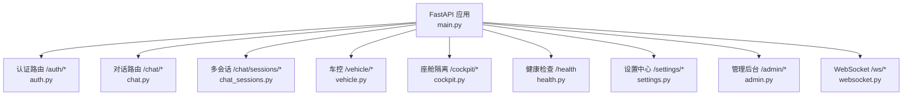
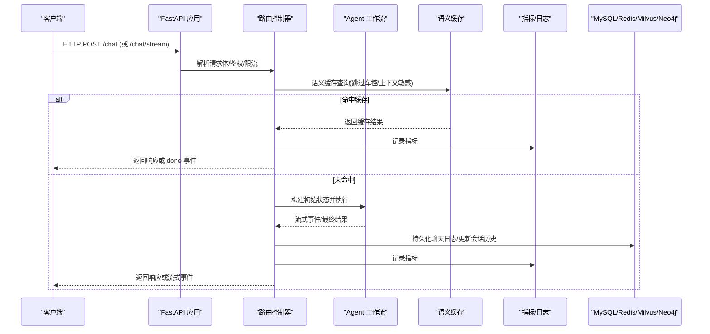
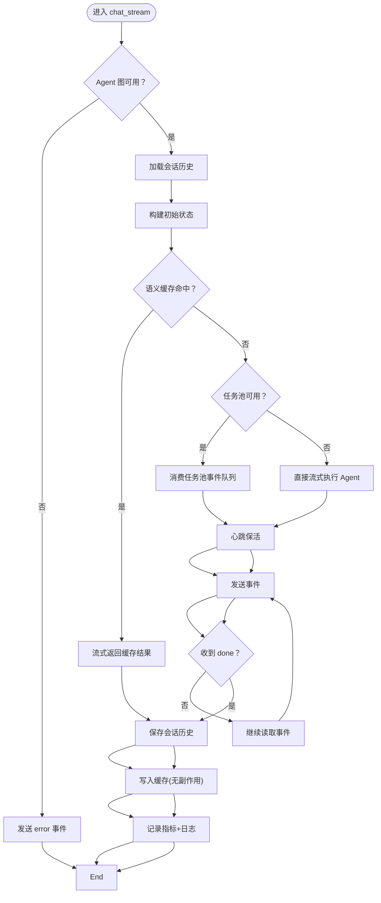
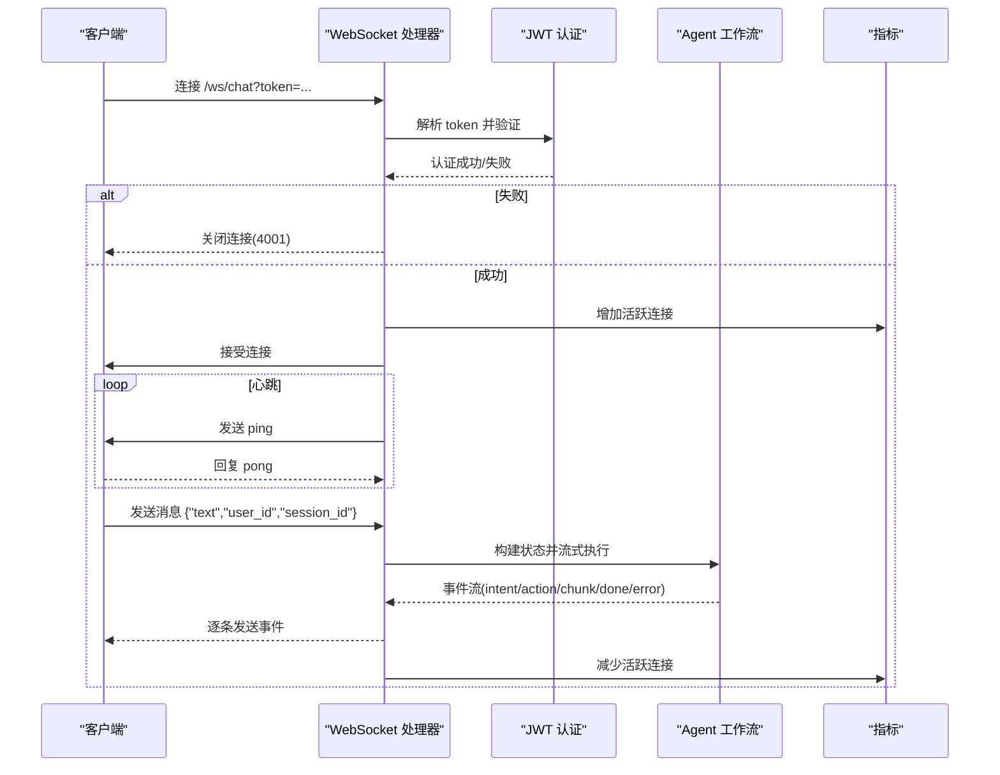
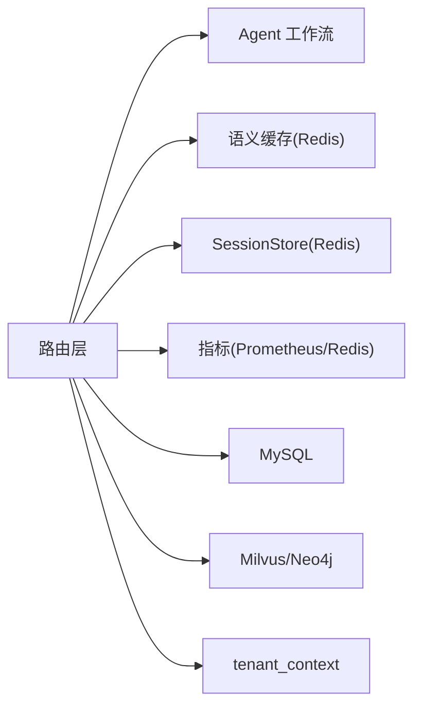

# L6 API层

<cite>
**本文引用的文件**   
- [main.py](file://backend_design/nexus/main.py)
- [websocket.py](file://backend_design/nexus/api/websocket.py)
- [chat.py](file://backend_design/nexus/api/routes/chat.py)
- [auth.py](file://backend_design/nexus/api/routes/auth.py)
- [cockpit.py](file://backend_design/nexus/api/routes/cockpit.py)
- [vehicle.py](file://backend_design/nexus/api/routes/vehicle.py)
- [admin.py](file://backend_design/nexus/api/routes/admin.py)
- [health.py](file://backend_design/nexus/api/routes/health.py)
- [settings.py](file://backend_design/nexus/api/routes/settings.py)
- [chat_sessions.py](file://backend_design/nexus/api/routes/chat_sessions.py)
- [schemas.py](file://backend_design/nexus/models/schemas.py)
</cite>

## 目录
1. [简介](#简介)
2. [项目结构](#项目结构)
3. [核心组件](#核心组件)
4. [架构总览](#架构总览)
5. [详细组件分析](#详细组件分析)
6. [依赖关系分析](#依赖关系分析)
7. [性能考量](#性能考量)
8. [故障排查指南](#故障排查指南)
9. [结论](#结论)
10. [附录](#附录)

## 简介
本文件为 NexusCockpit 的 L6 API 层文档，聚焦 RESTful 接口规范、SSE 流式输出与 WebSocket 双向通信协议。内容涵盖路由组织、请求响应格式、错误码定义、版本管理策略，以及 SSE/WebSocket 的连接管理、数据推送、断线重连机制。同时提供客户端集成指南与性能优化建议，帮助开发者快速、稳定地接入系统。

## 项目结构
L6 API 层基于 FastAPI 构建，采用模块化路由组织：
- 应用入口与生命周期管理：创建 FastAPI 实例、注册中间件、挂载路由、全局异常处理、指标采集等
- 业务路由模块：认证、对话（REST + SSE）、多会话管理、车控命令、座舱隔离接口、健康检查、设置中心、管理后台
- WebSocket 实时通道：用于语音/文本双向交互
- 统一数据模型：Pydantic 定义的请求/响应结构

**图表来源**
- [main.py:436-484](file://backend_design/nexus/main.py#L436-L484)
- [auth.py:32](file://backend_design/nexus/api/routes/auth.py#L32)
- [chat.py:41](file://backend_design/nexus/api/routes/chat.py#L41)
- [chat_sessions.py:32](file://backend_design/nexus/api/routes/chat_sessions.py#L32)
- [vehicle.py:32](file://backend_design/nexus/api/routes/vehicle.py#L32)
- [cockpit.py:29](file://backend_design/nexus/api/routes/cockpit.py#L29)
- [health.py:23](file://backend_design/nexus/api/routes/health.py#L23)
- [settings.py:35](file://backend_design/nexus/api/routes/settings.py#L35)
- [websocket.py:42](file://backend_design/nexus/api/websocket.py#L42)

**章节来源**
- [main.py:436-484](file://backend_design/nexus/main.py#L436-L484)

## 核心组件
- 应用生命周期与中间件
  - 启动时初始化向量存储、图谱存储、语义缓存、限流器、会话存储、Agent 工作流、MCP Server、提醒扫描器等
  - 注册 CORS、Prometheus 指标端点、静态资源挂载
  - 全局异常处理器统一错误格式
- 路由与控制器
  - 认证：签发 JWT、获取当前用户、密码修改、验证码重置
  - 对话：非流式与流式（SSE），语义缓存、会话锁、指标记录、日志持久化
  - 多会话：CRUD 与一致性自检
  - 车控：直接命令执行与状态查询
  - 座舱隔离：按 cockpit_id 隔离对话、车控、状态
  - 健康检查：组件连通性检测
  - 设置中心：座舱/用户/中间件配置、声纹注册验证
  - 管理后台：技能列表、记忆查询、缓存统计、知识库上传/重建索引
- WebSocket 实时通道
  - 通过 query token 进行 JWT 认证
  - 心跳保活（ping/pong）
  - 事件格式统一 JSON，支持意图、动作、分块、完成、错误、心跳

**章节来源**
- [main.py:75-433](file://backend_design/nexus/main.py#L75-L433)
- [auth.py:32-84](file://backend_design/nexus/api/routes/auth.py#L32-L84)
- [chat.py:319-464](file://backend_design/nexus/api/routes/chat.py#L319-L464)
- [chat.py:467-686](file://backend_design/nexus/api/routes/chat.py#L467-L686)
- [chat_sessions.py:58-136](file://backend_design/nexus/api/routes/chat_sessions.py#L58-L136)
- [vehicle.py:48-108](file://backend_design/nexus/api/routes/vehicle.py#L48-L108)
- [cockpit.py:54-149](file://backend_design/nexus/api/routes/cockpit.py#L54-L149)
- [health.py:26-95](file://backend_design/nexus/api/routes/health.py#L26-L95)
- [settings.py:42-90](file://backend_design/nexus/api/routes/settings.py#L42-L90)
- [admin.py:22-86](file://backend_design/nexus/api/routes/admin.py#L22-L86)
- [websocket.py:48-109](file://backend_design/nexus/api/websocket.py#L48-L109)

## 架构总览
整体调用链：客户端 → FastAPI 应用 → 路由控制器 → Agent 工作流/外部服务 → 指标与日志 → 响应/SSE/WebSocket

**图表来源**
- [chat.py:319-464](file://backend_design/nexus/api/routes/chat.py#L319-L464)
- [chat.py:467-686](file://backend_design/nexus/api/routes/chat.py#L467-L686)
- [main.py:436-484](file://backend_design/nexus/main.py#L436-L484)

## 详细组件分析

### 认证接口（/auth）
- 功能
  - 签发 JWT Token：POST /auth/token
  - 获取当前用户信息：GET /auth/me
  - 修改密码：POST /auth/change-password
  - 发送验证码与验证码重置密码：POST /auth/send-code、POST /auth/reset-password-by-code
- 请求/响应
  - 使用 Pydantic 模型定义请求/响应结构，确保字段校验与文档生成
- 安全
  - 开发模式直接签发 Token；生产环境应接入数据库验证凭据
  - 后续请求在 Authorization 头携带 "Bearer <token>"

**章节来源**
- [auth.py:32-84](file://backend_design/nexus/api/routes/auth.py#L32-L84)
- [auth.py:86-111](file://backend_design/nexus/api/routes/auth.py#L86-L111)
- [auth.py:119-194](file://backend_design/nexus/api/routes/auth.py#L119-L194)
- [schemas.py:19-38](file://backend_design/nexus/models/schemas.py#L19-L38)

### 对话接口（/chat）
- 功能
  - 非流式对话：POST /chat
  - 流式对话（SSE）：POST /chat/stream
  - 取消生成：POST /chat/cancel
- 流程要点
  - 限流检查、语义缓存（车控指令与上下文敏感查询跳过缓存）
  - 会话级并发锁防止历史交叉污染
  - 会话历史优先从 SessionStore（Redis）加载，不可用时回退内存 dict
  - 指标记录到 Redis（看板）与 MySQL（隐私日志）
  - Langfuse 链路追踪
- SSE 事件格式
  - 结构化 JSON 事件：intent、experts、action、chunk、done、error
  - 心跳保活：按间隔发送注释行避免连接超时
  - 任务池托管 pipeline，客户端断连不终止生成

**图表来源**
- [chat.py:467-686](file://backend_design/nexus/api/routes/chat.py#L467-L686)

**章节来源**
- [chat.py:319-464](file://backend_design/nexus/api/routes/chat.py#L319-L464)
- [chat.py:467-686](file://backend_design/nexus/api/routes/chat.py#L467-L686)
- [schemas.py:19-38](file://backend_design/nexus/models/schemas.py#L19-L38)

### 多会话管理（/chat/sessions）
- 功能
  - 列出会话：GET /chat/sessions
  - 创建会话：POST /chat/sessions
  - 删除会话：DELETE /chat/sessions/{id}（精确清理各层会话级资源）
  - 获取消息：GET /chat/sessions/{id}/messages
  - 更新标题：PATCH /chat/sessions/{id}/title
  - 一致性自检：GET /chat/sessions/consistency-check
- 清理范围
  - MySQL 会话与日志、Redis SessionStore、内存 session_histories、LangGraph checkpoint、语义缓存、Milvus 会话级记忆、会话并发锁

**章节来源**
- [chat_sessions.py:58-136](file://backend_design/nexus/api/routes/chat_sessions.py#L58-L136)
- [chat_sessions.py:138-324](file://backend_design/nexus/api/routes/chat_sessions.py#L138-L324)
- [chat_sessions.py:327-401](file://backend_design/nexus/api/routes/chat_sessions.py#L327-L401)
- [chat_sessions.py:404-534](file://backend_design/nexus/api/routes/chat_sessions.py#L404-L534)

### 车控接口（/vehicle）
- 功能
  - 直接执行命令：POST /vehicle/command
  - 查询状态：GET /vehicle/status
  - 位置更新：POST /vehicle/location
- 座舱隔离
  - 通过 X-Cockpit-Id 头或 tenant_context 获取 cockpit_id，隔离不同座舱状态

**章节来源**
- [vehicle.py:48-108](file://backend_design/nexus/api/routes/vehicle.py#L48-L108)
- [vehicle.py:117-152](file://backend_design/nexus/api/routes/vehicle.py#L117-L152)

### 座舱隔离接口（/cockpit）
- 功能
  - 状态查询：GET /cockpit/{cockpit_id}/status
  - 对话：POST /cockpit/{cockpit_id}/chat（非流式）
  - 流式对话：POST /cockpit/{cockpit_id}/chat/stream
  - 车控命令：POST /cockpit/{cockpit_id}/vehicle/cmd
  - 车辆状态：GET /cockpit/{cockpit_id}/vehicle/status
- 多租户上下文
  - 使用 CockpitContext 设置 cockpit_id 与 user_id，确保隔离

**章节来源**
- [cockpit.py:54-149](file://backend_design/nexus/api/routes/cockpit.py#L54-L149)
- [cockpit.py:152-201](file://backend_design/nexus/api/routes/cockpit.py#L152-L201)
- [cockpit.py:204-266](file://backend_design/nexus/api/routes/cockpit.py#L204-L266)

### 健康检查（/health）
- 功能
  - 根路径：GET /
  - 健康检查：GET /health（检测 Milvus、Neo4j、Redis、MySQL、Agent 等组件状态）

**章节来源**
- [health.py:26-95](file://backend_design/nexus/api/routes/health.py#L26-L95)
- [health.py:98-108](file://backend_design/nexus/api/routes/health.py#L98-L108)

### 设置中心（/settings）
- 功能
  - 座舱管理 CRUD：/settings/cockpits
  - 用户管理 CRUD：/settings/users
  - 中间件配置热更新：/settings/middleware
  - 声纹注册/验证/删除：/settings/voiceprint/*
- 特点
  - 支持通过 Redis Pub/Sub 触发配置热更新
  - 声纹验证成功自动签发 JWT Token

**章节来源**
- [settings.py:42-90](file://backend_design/nexus/api/routes/settings.py#L42-L90)
- [settings.py:96-178](file://backend_design/nexus/api/routes/settings.py#L96-L178)
- [settings.py:220-272](file://backend_design/nexus/api/routes/settings.py#L220-L272)
- [settings.py:279-393](file://backend_design/nexus/api/routes/settings.py#L279-L393)

### 管理后台（/admin）
- 功能
  - 技能列表：GET /admin/skills
  - 记忆查询：GET /admin/memory/{user_id}
  - 缓存统计与清理：GET /admin/cache/stats、POST /admin/cache/clear
  - 活跃会话：GET /admin/sessions
  - 知识库上传/重建索引/统计：/admin/kb/*
  - 配置热重载：POST /admin/config/reload、GET /admin/config

**章节来源**
- [admin.py:22-86](file://backend_design/nexus/api/routes/admin.py#L22-L86)
- [admin.py:120-170](file://backend_design/nexus/api/routes/admin.py#L120-L170)
- [admin.py:172-272](file://backend_design/nexus/api/routes/admin.py#L172-L272)

### WebSocket 实时通道（/ws）
- 功能
  - 双向实时通信：/ws/chat
  - 认证：query 参数 token（JWT）
  - 心跳：服务端每 30 秒 ping，客户端回复 pong
  - 事件格式：统一 JSON，包含 intent、action、chunk、done、error、ping、pong
- 连接管理
  - 活跃连接计数、心跳任务、断线清理、资源释放

**图表来源**
- [websocket.py:71-109](file://backend_design/nexus/api/websocket.py#L71-L109)
- [websocket.py:117-209](file://backend_design/nexus/api/websocket.py#L117-L209)

**章节来源**
- [websocket.py:48-109](file://backend_design/nexus/api/websocket.py#L48-L109)
- [websocket.py:117-209](file://backend_design/nexus/api/websocket.py#L117-L209)

## 依赖关系分析
- 路由依赖
  - 所有路由均依赖 FastAPI 框架与 Pydantic 模型
  - 对话与车控依赖 Agent 工作流、语义缓存、SessionStore、指标与日志
  - 座舱隔离依赖 CockpitManager 与 tenant_context
- 外部依赖
  - Redis（缓存与会话存储）、MySQL（日志与用户管理）、Milvus/Neo4j（向量与图谱）、Prometheus（指标）
- 中间件
  - CORS、CockpitContextMiddleware（提取 cockpit_id、计时、指标）

**图表来源**
- [main.py:436-484](file://backend_design/nexus/main.py#L436-L484)
- [chat.py:319-464](file://backend_design/nexus/api/routes/chat.py#L319-L464)
- [cockpit.py:54-149](file://backend_design/nexus/api/routes/cockpit.py#L54-L149)

**章节来源**
- [main.py:436-484](file://backend_design/nexus/main.py#L436-L484)

## 性能考量
- 语义缓存
  - 对非车控、非上下文敏感查询启用缓存，显著降低延迟
  - 车控指令与上下文敏感查询强制跳过缓存，保证正确性
- 会话级并发锁
  - 防止同一会话并发请求导致历史交叉污染
  - 空闲锁清理防止内存泄漏
- SSE 心跳保活
  - 按配置间隔发送注释行，避免代理/浏览器超时断开
- 任务池托管 pipeline
  - SSE 断连不终止生成，提升用户体验与可靠性
- 指标与日志
  - 实时指标（Redis）与持久化日志（MySQL）分离，兼顾看板与审计

[本节为通用指导，无需特定文件引用]

## 故障排查指南
- 常见错误码与处理
  - 429 限流：RateLimitError，返回 Retry-After 头
  - 401 认证失败：AuthError，返回 WWW-Authenticate 头
  - 500 内部错误：NexusError，统一错误格式
  - 422 参数校验失败：RequestValidationError，保留原始校验详情
- 诊断接口
  - /health 检查组件连通性
  - /admin/cache/stats 查看缓存命中率
  - /chat/sessions/consistency-check 存储一致性自检
- 调试建议
  - 启用 Langfuse 追踪，定位 Agent 执行瓶颈
  - 观察 Prometheus 指标（/metrics）与 Grafana 面板
  - 检查 Redis/MySQL/Milvus/Neo4j 连接状态

**章节来源**
- [main.py:505-596](file://backend_design/nexus/main.py#L505-L596)
- [health.py:26-95](file://backend_design/nexus/api/routes/health.py#L26-L95)
- [admin.py:51-86](file://backend_design/nexus/api/routes/admin.py#L51-L86)
- [chat_sessions.py:404-534](file://backend_design/nexus/api/routes/chat_sessions.py#L404-L534)

## 结论
NexusCockpit 的 L6 API 层以 FastAPI 为核心，结合语义缓存、会话锁、SSE/WebSocket、指标与日志，构建了高可靠、可扩展的车载智能体交互平台。通过统一的错误格式、健康检查与一致性自检，便于运维与排障。建议在生产环境中完善凭据验证、接入短信网关与外部 LLM，并根据负载调整缓存阈值与心跳间隔。

[本节为总结，无需特定文件引用]

## 附录

### RESTful API 设计规范
- 路由组织
  - 按功能域划分路由模块，前缀清晰（/auth、/chat、/vehicle、/cockpit、/settings、/admin、/health）
- 请求/响应格式
  - 使用 Pydantic 模型定义，自动生成 OpenAPI 文档
  - 统一错误格式 {error, message, details}
- 版本管理策略
  - 通过 URL 前缀或 Header 控制版本（当前未显式版本化，建议在路由前缀或 Header 中引入）
- 认证与安全
  - JWT Token 在 Authorization 头或 WebSocket query 参数传递
  - 限流器保护关键接口

**章节来源**
- [main.py:436-484](file://backend_design/nexus/main.py#L436-L484)
- [auth.py:32-84](file://backend_design/nexus/api/routes/auth.py#L32-L84)
- [websocket.py:48-109](file://backend_design/nexus/api/websocket.py#L48-L109)
- [schemas.py:19-88](file://backend_design/nexus/models/schemas.py#L19-L88)

### SSE 流式输出实现机制
- 连接管理
  - StreamingResponse 返回 text/event-stream
  - 心跳保活：按间隔发送注释行
- 数据推送
  - 结构化事件 JSON，包含 intent、action、chunk、done、error
  - 任务池托管 pipeline，断连不终止生成
- 断线重连
  - 客户端实现指数退避重连，重新建立 SSE 连接并恢复 session_id

**章节来源**
- [chat.py:467-686](file://backend_design/nexus/api/routes/chat.py#L467-L686)

### WebSocket 双向通信协议
- 连接建立
  - /ws/chat?token=JWT
  - 认证成功接受连接，失败关闭
- 消息格式
  - 统一 JSON：type + data
  - 支持 intent、action、chunk、done、error、ping、pong
- 事件类型与状态同步
  - 心跳保活：ping/pong
  - 会话历史：优先 Redis，降级内存

**章节来源**
- [websocket.py:48-109](file://backend_design/nexus/api/websocket.py#L48-L109)
- [websocket.py:117-209](file://backend_design/nexus/api/websocket.py#L117-L209)

### API 使用示例与客户端集成指南
- 认证
  - POST /auth/token 获取 JWT，后续请求携带 Authorization: Bearer <token>
- 对话
  - 非流式：POST /chat，返回 ChatResponse
  - 流式：POST /chat/stream，处理 SSE 事件
- 车控
  - POST /vehicle/command 执行命令，GET /vehicle/status 查询状态
- WebSocket
  - 连接 /ws/chat?token=...，发送 {"text":"..."}，接收事件流

**章节来源**
- [auth.py:48-77](file://backend_design/nexus/api/routes/auth.py#L48-L77)
- [chat.py:319-464](file://backend_design/nexus/api/routes/chat.py#L319-L464)
- [chat.py:467-686](file://backend_design/nexus/api/routes/chat.py#L467-L686)
- [vehicle.py:48-108](file://backend_design/nexus/api/routes/vehicle.py#L48-L108)
- [websocket.py:71-109](file://backend_design/nexus/api/websocket.py#L71-L109)

### 性能优化建议
- 合理配置语义缓存阈值与 TTL
- 根据负载调整 SSE 心跳间隔与限流 QPS
- 监控 Prometheus 指标与 Grafana 面板，识别瓶颈
- 使用任务池托管 pipeline，避免 SSE 断连影响生成

[本节为通用指导，无需特定文件引用]