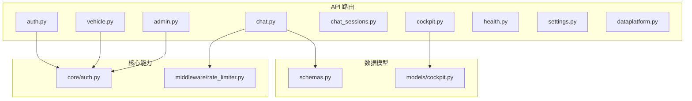
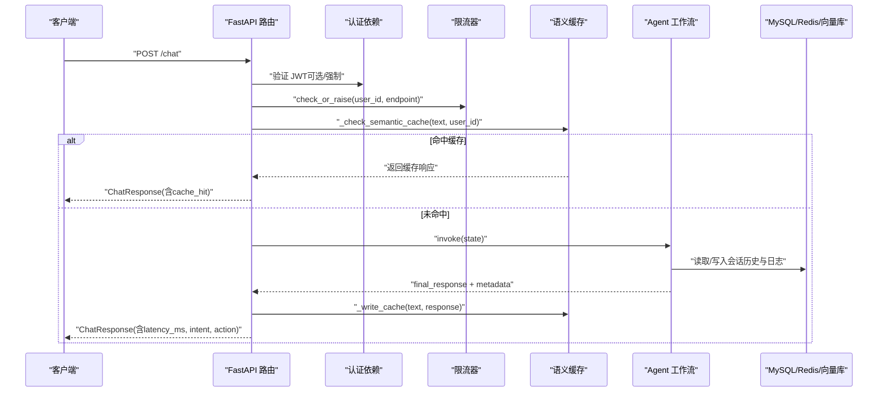
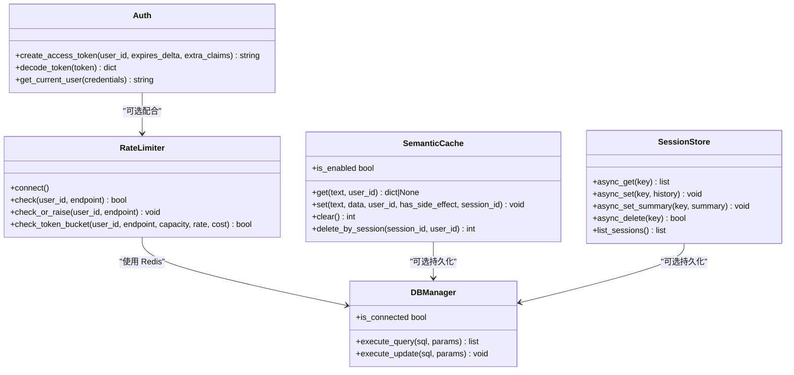

# RESTful API接口

<cite>
**本文引用的文件**
- [chat.py](file://backend_design/nexus/api/routes/chat.py)
- [auth.py](file://backend_design/nexus/api/routes/auth.py)
- [admin.py](file://backend_design/nexus/api/routes/admin.py)
- [cockpit.py](file://backend_design/nexus/api/routes/cockpit.py)
- [chat_sessions.py](file://backend_design/nexus/api/routes/chat_sessions.py)
- [vehicle.py](file://backend_design/nexus/api/routes/vehicle.py)
- [health.py](file://backend_design/nexus/api/routes/health.py)
- [settings.py](file://backend_design/nexus/api/routes/settings.py)
- [dataplatform.py](file://backend_design/nexus/api/routes/dataplatform.py)
- [schemas.py](file://backend_design/nexus/models/schemas.py)
- [cockpit.py](file://backend_design/nexus/models/cockpit.py)
- [auth.py](file://backend_design/nexus/core/auth.py)
- [rate_limiter.py](file://backend_design/nexus/middleware/rate_limiter.py)
</cite>

## 目录
1. [简介](#简介)
2. [项目结构](#项目结构)
3. [核心组件](#核心组件)
4. [架构总览](#架构总览)
5. [详细组件分析](#详细组件分析)
6. [依赖关系分析](#依赖关系分析)
7. [性能与限流](#性能与限流)
8. [故障排查指南](#故障排查指南)
9. [结论](#结论)
10. [附录：客户端集成与最佳实践](#附录客户端集成与最佳实践)

## 简介
本文件为 NexusCockpit 的 RESTful API 接口文档，覆盖以下能力：
- Chat 非流式对话接口（含语义缓存、会话管理、限流、错误处理）
- 座舱控制 API（按座舱隔离的对话、车控、状态查询）
- 用户认证 API（JWT Token 签发与校验）
- 管理员 API（技能列表、记忆查询、缓存统计与清理、知识库上传、配置热更新等）
- 数据中台 API（全局概览、座舱对比、告警、Agent 活动、缓存趋势）
- 健康检查与根路径

所有端点均提供 HTTP 方法、URL 模式、请求/响应格式、认证方式、状态码说明与错误处理策略。同时给出客户端集成建议与最佳实践。

## 项目结构
后端采用 FastAPI 路由模块化组织，核心模块位于 backend_design/nexus/api/routes 下，数据模型集中在 models 目录，认证与限流分别在 core 与 middleware 中实现。

图表来源
- [chat.py:1-120](file://backend_design/nexus/api/routes/chat.py#L1-L120)
- [auth.py:1-80](file://backend_design/nexus/api/routes/auth.py#L1-L80)
- [admin.py:1-60](file://backend_design/nexus/api/routes/admin.py#L1-L60)
- [cockpit.py:1-60](file://backend_design/nexus/api/routes/cockpit.py#L1-L60)
- [chat_sessions.py:1-60](file://backend_design/nexus/api/routes/chat_sessions.py#L1-L60)
- [vehicle.py:1-60](file://backend_design/nexus/api/routes/vehicle.py#L1-L60)
- [health.py:1-40](file://backend_design/nexus/api/routes/health.py#L1-L40)
- [settings.py:1-40](file://backend_design/nexus/api/routes/settings.py#L1-L40)
- [dataplatform.py:1-40](file://backend_design/nexus/api/routes/dataplatform.py#L1-L40)
- [schemas.py:1-40](file://backend_design/nexus/models/schemas.py#L1-L40)
- [cockpit.py:1-60](file://backend_design/nexus/models/cockpit.py#L1-L60)
- [auth.py:1-60](file://backend_design/nexus/core/auth.py#L1-L60)
- [rate_limiter.py:1-60](file://backend_design/nexus/middleware/rate_limiter.py#L1-L60)

章节来源
- [chat.py:1-120](file://backend_design/nexus/api/routes/chat.py#L1-L120)
- [schemas.py:1-88](file://backend_design/nexus/models/schemas.py#L1-L88)

## 核心组件
- 认证组件：JWT Token 签发与校验，支持可选认证与强制认证两种模式。
- 限流组件：基于 Redis 的滑动窗口与令牌桶算法，原子性保证分布式安全。
- 语义缓存：按文本相似度命中，支持上下文敏感与车控指令跳过缓存。
- 会话管理：MySQL 持久化会话元数据与聊天日志，Redis 短期历史与滚动摘要，SQLite LangGraph checkpoint 状态快照。
- 座舱隔离：通过 CockpitContext 与适配器工厂实现多座舱资源隔离。

章节来源
- [auth.py:1-140](file://backend_design/nexus/core/auth.py#L1-L140)
- [rate_limiter.py:1-297](file://backend_design/nexus/middleware/rate_limiter.py#L1-L297)
- [chat.py:112-208](file://backend_design/nexus/api/routes/chat.py#L112-L208)
- [chat_sessions.py:107-136](file://backend_design/nexus/api/routes/chat_sessions.py#L107-L136)
- [cockpit.py:1-120](file://backend_design/nexus/api/routes/cockpit.py#L1-L120)

## 架构总览
NexusCockpit 的 API 层由 FastAPI 路由组成，调用 Agent 工作流（SupervisorGraph）、语义缓存、数据库与中间件（Redis/MySQL/Milvus/Neo4j）。认证与限流贯穿关键接口。

图表来源
- [chat.py:319-464](file://backend_design/nexus/api/routes/chat.py#L319-L464)
- [auth.py:85-123](file://backend_design/nexus/core/auth.py#L85-L123)
- [rate_limiter.py:204-211](file://backend_design/nexus/middleware/rate_limiter.py#L204-L211)
- [chat.py:114-148](file://backend_design/nexus/api/routes/chat.py#L114-L148)
- [chat.py:189-208](file://backend_design/nexus/api/routes/chat.py#L189-L208)

## 详细组件分析

### 认证 API（/auth）
- POST /auth/token
  - 功能：用户认证并获取 JWT Token（开发环境直接签发，生产应接入数据库校验密码）
  - 请求体：user_id、password（或 API Key）
  - 响应：access_token、token_type、expires_in
  - 认证：无需认证
  - 状态码：200 成功；400 参数错误
- GET /auth/me
  - 功能：验证 Token 有效性并返回当前用户信息
  - 认证：需要 Bearer Token
  - 响应：{user_id, authenticated}
  - 状态码：200 成功；401 未授权
- POST /auth/change-password
  - 功能：修改用户密码（开发环境直接成功）
  - 认证：需要 Bearer Token
  - 请求体：old_password、new_password
  - 响应：{success, message}
  - 状态码：200 成功；400 参数错误；401 未授权
- POST /auth/send-code
  - 功能：发送手机验证码（开发模式返回验证码）
  - 请求体：phone（正则校验）
  - 响应：{success, message, dev_code}
  - 状态码：200 成功；400 参数错误
- POST /auth/reset-password-by-code
  - 功能：通过验证码重置密码
  - 请求体：phone、code、new_password
  - 响应：{success, message}
  - 状态码：200 成功；400 参数错误；401 未授权

章节来源
- [auth.py:35-78](file://backend_design/nexus/api/routes/auth.py#L35-L78)
- [auth.py:80-84](file://backend_design/nexus/api/routes/auth.py#L80-L84)
- [auth.py:92-111](file://backend_design/nexus/api/routes/auth.py#L92-L111)
- [auth.py:132-154](file://backend_design/nexus/api/routes/auth.py#L132-L154)
- [auth.py:164-194](file://backend_design/nexus/api/routes/auth.py#L164-L194)
- [auth.py:35-78](file://backend_design/nexus/core/auth.py#L35-L78)

### Chat 非流式对话 API（/chat）
- POST /chat
  - 功能：非流式文本对话，包含限流、语义缓存、Agent 执行、指标记录、日志持久化、缓存写入
  - 请求体：text、user_id、session_id、stream（默认 false）
  - 响应：ChatResponse（response、user_id、session_id、latency_ms、metadata、cache_hit、intent、action、trace_id）
  - 认证：可选（get_optional_user），但推荐携带 Bearer Token 以启用个性化与权限
  - 状态码：200 成功；429 限流；503 Agent 未初始化
  - 错误处理：Agent 图未初始化时返回友好提示；异常时记录日志并返回兜底响应
- POST /chat/stream（SSE 流式）
  - 功能：SSE 流式事件输出（intent、experts、action、chunk、done）
  - 请求体：同 /chat
  - 响应：text/event-stream，事件类型包括 thinking、chunk、done、error
  - 认证：可选
  - 状态码：200 成功；429 限流；503 Agent 未初始化
  - 错误处理：流中断时确保会话历史与日志成对写入，填充兜底话术
- POST /chat/cancel
  - 功能：取消正在进行的 AI 生成任务（仅用户主动点击暂停时调用）
  - 请求体：同 /chat
  - 响应：{success, message}
  - 认证：可选
  - 状态码：200 成功；400 无运行任务

语义缓存机制
- 跳过缓存场景：车控指令、上下文敏感查询（天气/附近/推荐等）
- 命中后直接返回缓存响应，并记录指标
- 未命中则执行 Agent 工作流，结果写入缓存（有副作用响应禁止缓存）

会话管理
- session_id 为空时生成临时 ID，禁止回退到 user_id 以保证会话隔离
- 会话历史优先从 SessionStore（Redis）加载，不可用时回退内存 dict
- 并发锁防止同一 session 的并发请求交叉污染历史

章节来源
- [chat.py:319-464](file://backend_design/nexus/api/routes/chat.py#L319-L464)
- [chat.py:467-686](file://backend_design/nexus/api/routes/chat.py#L467-L686)
- [chat.py:689-719](file://backend_design/nexus/api/routes/chat.py#L689-L719)
- [chat.py:114-148](file://backend_design/nexus/api/routes/chat.py#L114-L148)
- [chat.py:189-208](file://backend_design/nexus/api/routes/chat.py#L189-L208)
- [chat.py:151-187](file://backend_design/nexus/api/routes/chat.py#L151-L187)
- [chat.py:224-246](file://backend_design/nexus/api/routes/chat.py#L224-L246)

### 座舱控制 API（/cockpit/{cockpit_id}）
- GET /cockpit/{cockpit_id}/status
  - 功能：获取座舱状态（含车辆状态和指标）
  - 认证：无需认证
  - 响应：CockpitStatusResponse（cockpit_id、name、is_active、vehicle_status、metrics）
  - 状态码：200 成功；404 座舱不存在；503 Agent 未初始化
- POST /cockpit/{cockpit_id}/chat
  - 功能：座舱对话（转发到 Agent 工作流）
  - 请求体：text、user_id、stream（默认 false）
  - 响应：{response、cockpit_id、cache_hit、latency_ms、metadata}
  - 认证：无需认证
  - 状态码：200 成功；404 座舱不存在；503 Agent 未初始化
- POST /cockpit/{cockpit_id}/chat/stream
  - 功能：座舱流式对话（SSE）
  - 请求体：同 chat
  - 响应：text/event-stream
  - 认证：无需认证
  - 状态码：200 成功；404 座舱不存在；503 Agent 未初始化
- POST /cockpit/{cockpit_id}/vehicle/cmd
  - 功能：座舱车控指令执行
  - 请求体：command、arguments、user_id
  - 响应：{success、cockpit_id、result/error}
  - 认证：无需认证
  - 状态码：200 成功；404 座舱不存在；503 Vehicle adapter 未初始化
- GET /cockpit/{cockpit_id}/vehicle/status
  - 功能：获取座舱的车辆状态
  - 认证：无需认证
  - 响应：{cockpit_id、status/error}
  - 状态码：200 成功；404 座舱不存在；503 Vehicle adapter 未初始化

章节来源
- [cockpit.py:54-74](file://backend_design/nexus/api/routes/cockpit.py#L54-L74)
- [cockpit.py:76-150](file://backend_design/nexus/api/routes/cockpit.py#L76-L150)
- [cockpit.py:152-202](file://backend_design/nexus/api/routes/cockpit.py#L152-L202)
- [cockpit.py:204-237](file://backend_design/nexus/api/routes/cockpit.py#L204-L237)
- [cockpit.py:239-266](file://backend_design/nexus/api/routes/cockpit.py#L239-L266)

### 车控命令 API（/vehicle）
- POST /vehicle/command
  - 功能：直接执行车控命令（绕过 Agent 工作流）
  - 请求体：command、arguments、user_id
  - 响应：VehicleCommandResponse（success、message、data、error）
  - 认证：需要 Bearer Token
  - 状态码：200 成功；503 Vehicle adapter 未初始化；422 参数错误
- GET /vehicle/status
  - 功能：获取车辆当前状态（空调、车窗、座椅、媒体、导航、车况）
  - 认证：需要 Bearer Token
  - 响应：扁平结构（前端 VehicleStatus 类型直接匹配）
  - 状态码：200 成功；503 Vehicle adapter 未初始化
- POST /vehicle/location
  - 功能：使用浏览器 GPS 坐标更新当前位置
  - 请求体：latitude、longitude
  - 响应：{success、location、latitude、longitude、message}
  - 认证：需要 Bearer Token
  - 状态码：200 成功；503 Vehicle adapter 未初始化

章节来源
- [vehicle.py:48-86](file://backend_design/nexus/api/routes/vehicle.py#L48-L86)
- [vehicle.py:88-109](file://backend_design/nexus/api/routes/vehicle.py#L88-L109)
- [vehicle.py:117-152](file://backend_design/nexus/api/routes/vehicle.py#L117-L152)

### 会话管理 API（/chat/sessions）
- GET /chat/sessions
  - 功能：获取当前座舱的会话列表（按最后消息时间倒序，最多 50 条）
  - 认证：无需认证
  - 响应：SessionListResponse（total、sessions）
  - 状态码：200 成功
- POST /chat/sessions
  - 功能：创建新会话
  - 请求体：title、user_id
  - 响应：SessionResponse（session_id、cockpit_id、user_id、title、message_count、created_at、last_message_at）
  - 认证：无需认证
  - 状态码：200 成功
- DELETE /chat/sessions/{session_id}
  - 功能：删除会话及其所有关联数据（MySQL、Redis、SQLite、内存、语义缓存、Milvus）
  - 认证：无需认证
  - 响应：{success、message、cleanup_details}
  - 状态码：200 成功；500 数据库未连接
- GET /chat/sessions/{session_id}/messages
  - 功能：获取指定会话的所有消息记录（按时间正序）
  - 认证：无需认证
  - 响应：{messages}
  - 状态码：200 成功
- PATCH /chat/sessions/{session_id}/title
  - 功能：更新会话标题
  - 请求体：title（最大长度 100）
  - 响应：{success、title}
  - 状态码：200 成功；500 数据库未连接
- GET /chat/sessions/consistency-check
  - 功能：存储一致性自检（孤立日志、僵尸缓存、僵尸快照、孤儿向量）
  - 认证：无需认证
  - 响应：{success、healthy、issues、summary}
  - 状态码：200 成功；500 数据库未连接

章节来源
- [chat_sessions.py:58-105](file://backend_design/nexus/api/routes/chat_sessions.py#L58-L105)
- [chat_sessions.py:107-136](file://backend_design/nexus/api/routes/chat_sessions.py#L107-L136)
- [chat_sessions.py:138-325](file://backend_design/nexus/api/routes/chat_sessions.py#L138-L325)
- [chat_sessions.py:327-374](file://backend_design/nexus/api/routes/chat_sessions.py#L327-L374)
- [chat_sessions.py:381-402](file://backend_design/nexus/api/routes/chat_sessions.py#L381-L402)
- [chat_sessions.py:404-534](file://backend_design/nexus/api/routes/chat_sessions.py#L404-L534)

### 管理员 API（/admin）
- GET /admin/skills
  - 功能：列出所有可用技能
  - 认证：需要 Bearer Token
  - 响应：SkillListResponse（skills、count）
  - 状态码：200 成功
- GET /admin/memory/{user_id}
  - 功能：查询用户记忆（图谱记忆 + 用户画像）
  - 认证：需要 Bearer Token
  - 响应：MemoryResponse（user_id、memories、profile）
  - 状态码：200 成功
- GET /admin/cache/stats
  - 功能：获取语义缓存统计信息（命中/未命中/命中率/大小）
  - 认证：需要 Bearer Token
  - 响应：{hits、misses、hit_rate、size}
  - 状态码：200 成功
- POST /admin/cache/clear
  - 功能：清空语义缓存
  - 认证：需要 Bearer Token
  - 响应：{cleared、message}
  - 状态码：200 成功
- GET /admin/sessions
  - 功能：列出活跃会话（优先 Redis，降级内存）
  - 认证：需要 Bearer Token
  - 响应：{sessions、count}
  - 状态码：200 成功
- POST /admin/kb/upload
  - 功能：上传文档到 Cherry 知识库（自动分块、向量化、入库）
  - 认证：需要 Bearer Token
  - 请求体：file（multipart/form-data）、category
  - 响应：{chunks、source、category、message}
  - 状态码：200 成功；500 知识库不可用
- POST /admin/kb/reindex
  - 功能：重建知识库向量索引
  - 认证：需要 Bearer Token
  - 响应：{message、status}
  - 状态码：200 成功；500 知识库不可用
- GET /admin/kb/stats
  - 功能：获取知识库容量/文档统计
  - 认证：需要 Bearer Token
  - 响应：{connected、total_docs}
  - 状态码：200 成功；500 知识库不可用
- POST /admin/config/reload
  - 功能：配置热更新（重新加载 .env.local 并重置 LLM 客户端单例）
  - 认证：需要 Bearer Token
  - 响应：{status、llm、embedding、message}
  - 状态码：200 成功
- GET /admin/config
  - 功能：查看当前配置状态（敏感值脱敏）
  - 认证：需要 Bearer Token
  - 响应：{llm、embedding、milvus、redis、neo4j、mysql}
  - 状态码：200 成功

章节来源
- [admin.py:22-31](file://backend_design/nexus/api/routes/admin.py#L22-L31)
- [admin.py:33-49](file://backend_design/nexus/api/routes/admin.py#L33-L49)
- [admin.py:51-76](file://backend_design/nexus/api/routes/admin.py#L51-L76)
- [admin.py:78-87](file://backend_design/nexus/api/routes/admin.py#L78-L87)
- [admin.py:89-108](file://backend_design/nexus/api/routes/admin.py#L89-L108)
- [admin.py:120-149](file://backend_design/nexus/api/routes/admin.py#L120-L149)
- [admin.py:151-160](file://backend_design/nexus/api/routes/admin.py#L151-L160)
- [admin.py:162-170](file://backend_design/nexus/api/routes/admin.py#L162-L170)
- [admin.py:172-222](file://backend_design/nexus/api/routes/admin.py#L172-L222)
- [admin.py:224-272](file://backend_design/nexus/api/routes/admin.py#L224-L272)

### 设置中心 API（/settings）
- 座舱管理 CRUD：GET/POST/PUT/DELETE /settings/cockpits
- 用户管理：GET/POST/DELETE /settings/users，PUT /settings/users/{user_id}/password
- 中间件配置：GET/PUT /settings/middleware（热更新）
- 声纹管理：GET/POST/DELETE /settings/voiceprint/*

章节来源
- [settings.py:42-90](file://backend_design/nexus/api/routes/settings.py#L42-L90)
- [settings.py:96-178](file://backend_design/nexus/api/routes/settings.py#L96-L178)
- [settings.py:220-273](file://backend_design/nexus/api/routes/settings.py#L220-L273)
- [settings.py:279-393](file://backend_design/nexus/api/routes/settings.py#L279-L393)

### 数据中台 API（/dataplatform）
- GET /dataplatform/overview：全局概览（聊天数、车控数、缓存命中率、平均延迟、并发、告警、LLM 成本）
- GET /dataplatform/cockpit/{cockpit_id}：单座舱详情
- GET /dataplatform/concurrency：并发能力统计
- GET /dataplatform/alerts：告警历史（最近 N 小时）
- GET /dataplatform/agent/activity：Agent 活动时间线（最近 N 小时）
- GET /dataplatform/comparison：座舱对比数据
- GET /dataplatform/cache-trend：缓存趋势（最近 24 小时，2 小时间隔）

章节来源
- [dataplatform.py:28-68](file://backend_design/nexus/api/routes/dataplatform.py#L28-L68)
- [dataplatform.py:70-85](file://backend_design/nexus/api/routes/dataplatform.py#L70-L85)
- [dataplatform.py:87-97](file://backend_design/nexus/api/routes/dataplatform.py#L87-L97)
- [dataplatform.py:99-148](file://backend_design/nexus/api/routes/dataplatform.py#L99-L148)
- [dataplatform.py:150-219](file://backend_design/nexus/api/routes/dataplatform.py#L150-L219)
- [dataplatform.py:221-244](file://backend_design/nexus/api/routes/dataplatform.py#L221-L244)
- [dataplatform.py:246-300](file://backend_design/nexus/api/routes/dataplatform.py#L246-L300)

### 健康检查 API（/health）
- GET /health：健康检查（检查 Milvus、Neo4j、Redis、MySQL、OSS、Agent 状态）
- GET /：根路径（返回项目名称、版本、描述、文档与健康链接）

章节来源
- [health.py:26-96](file://backend_design/nexus/api/routes/health.py#L26-L96)
- [health.py:98-108](file://backend_design/nexus/api/routes/health.py#L98-L108)

## 依赖关系分析
- 认证依赖：所有需要认证的接口通过 Depends(get_current_user) 注入 user_id
- 限流依赖：Chat 接口在入口处调用 rate_limiter.check_or_raise(user_id, "chat")
- 语义缓存依赖：Chat 接口通过 app.state.semantic_cache 进行读写
- 会话依赖：Chat 接口通过 app.state.session_store（Redis）或内存 dict 管理历史
- 数据库依赖：会话管理与聊天日志通过 app.state.db_manager 访问 MySQL
- 座舱隔离：通过 CockpitContext 与 vehicle_adapter 工厂实现多座舱资源隔离

图表来源
- [rate_limiter.py:117-297](file://backend_design/nexus/middleware/rate_limiter.py#L117-L297)
- [auth.py:35-123](file://backend_design/nexus/core/auth.py#L35-L123)
- [chat.py:114-208](file://backend_design/nexus/api/routes/chat.py#L114-L208)
- [chat_sessions.py:107-136](file://backend_design/nexus/api/routes/chat_sessions.py#L107-L136)

章节来源
- [rate_limiter.py:117-297](file://backend_design/nexus/middleware/rate_limiter.py#L117-L297)
- [auth.py:35-123](file://backend_design/nexus/core/auth.py#L35-L123)
- [chat.py:114-208](file://backend_design/nexus/api/routes/chat.py#L114-L208)
- [chat_sessions.py:107-136](file://backend_design/nexus/api/routes/chat_sessions.py#L107-L136)

## 性能与限流
- 限流策略：基于 Redis 的滑动窗口与令牌桶算法，原子性保证分布式安全
- 语义缓存：命中后直接返回，显著降低延迟与 LLM 调用成本
- 会话并发锁：防止同一 session 的并发请求交叉污染历史
- SSE 心跳保活：按配置间隔发送注释行，防止连接超时断开
- 指标记录：实时指标写入 Redis，聊天日志持久化到 MySQL

章节来源
- [rate_limiter.py:156-211](file://backend_design/nexus/middleware/rate_limiter.py#L156-L211)
- [chat.py:520-595](file://backend_design/nexus/api/routes/chat.py#L520-L595)
- [chat.py:248-317](file://backend_design/nexus/api/routes/chat.py#L248-L317)

## 故障排查指南
- 健康检查：调用 /health 检查各组件连接状态（Milvus、Neo4j、Redis、MySQL、OSS、Agent）
- 缓存统计：调用 /admin/cache/stats 查看命中率与大小
- 会话一致性：调用 /chat/sessions/consistency-check 扫描孤立数据与僵尸缓存
- 限流问题：检查 Redis 连接与 Lua 脚本加载状态
- 认证失败：确认 Authorization 头格式为 "Bearer <token>"，Token 未过期且有效

章节来源
- [health.py:26-96](file://backend_design/nexus/api/routes/health.py#L26-L96)
- [admin.py:51-76](file://backend_design/nexus/api/routes/admin.py#L51-L76)
- [chat_sessions.py:404-534](file://backend_design/nexus/api/routes/chat_sessions.py#L404-L534)
- [rate_limiter.py:142-155](file://backend_design/nexus/middleware/rate_limiter.py#L142-L155)
- [auth.py:85-123](file://backend_design/nexus/core/auth.py#L85-L123)

## 结论
NexusCockpit 的 RESTful API 提供了完整的车载智能助手能力，涵盖对话、车控、认证、管理、数据中台与健康检查。通过语义缓存、会话管理、限流与指标记录，实现了高性能、高可用的服务体验。客户端可依据本文档快速集成，遵循最佳实践确保稳定与安全。

## 附录：客户端集成与最佳实践
- 认证流程
  - 首次调用 POST /auth/token 获取 JWT Token
  - 后续请求在 Authorization 头携带 "Bearer <token>"
  - 可选认证接口（如 /chat）建议携带 Token 以启用个性化
- 会话管理
  - 每次对话前创建新会话（POST /chat/sessions），使用返回的 session_id
  - 删除会话时调用 DELETE /chat/sessions/{session_id}，确保资源清理
- 限流与重试
  - 遇到 429 状态码时，等待并重试（指数退避）
  - 监控 /admin/cache/stats 了解缓存命中率
- SSE 流式处理
  - 处理 text/event-stream，解析事件类型（thinking、chunk、done、error）
  - 实现心跳保活与断线重连
- 错误处理
  - 捕获 401 未授权，重新登录
  - 捕获 503 服务不可用，提示用户稍后重试
  - 记录错误日志与 trace_id 便于排查

章节来源
- [auth.py:35-78](file://backend_design/nexus/api/routes/auth.py#L35-L78)
- [chat_sessions.py:107-136](file://backend_design/nexus/api/routes/chat_sessions.py#L107-L136)
- [chat.py:467-686](file://backend_design/nexus/api/routes/chat.py#L467-L686)
- [admin.py:51-76](file://backend_design/nexus/api/routes/admin.py#L51-L76)