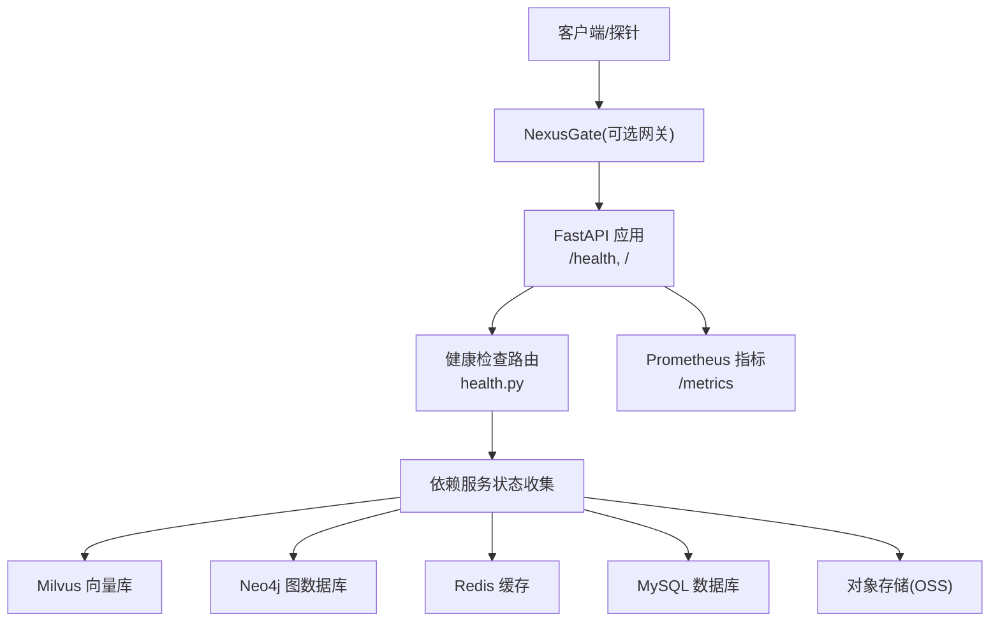
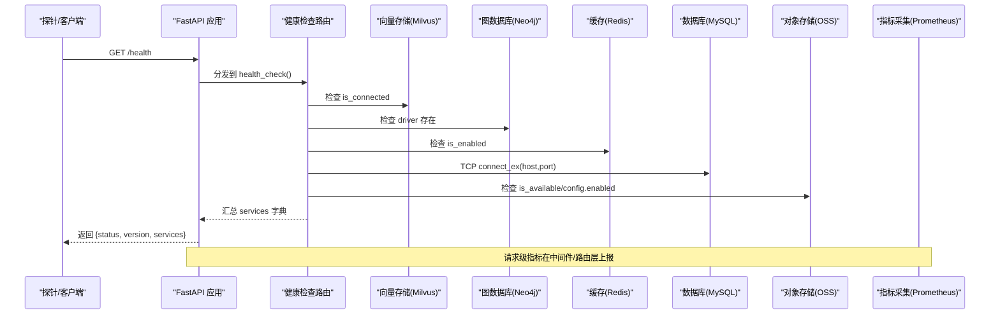
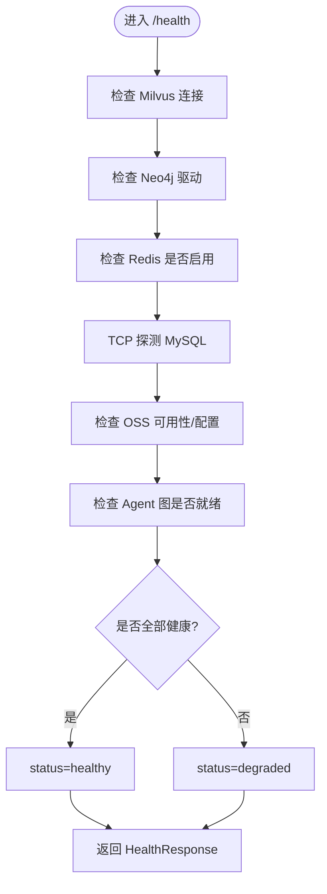
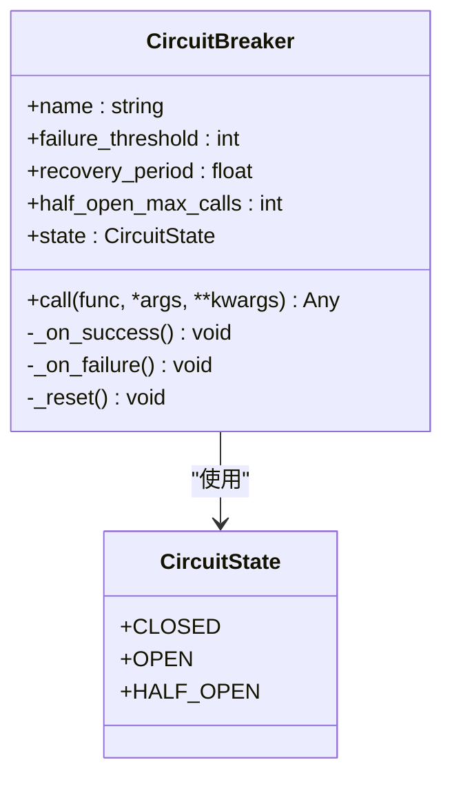
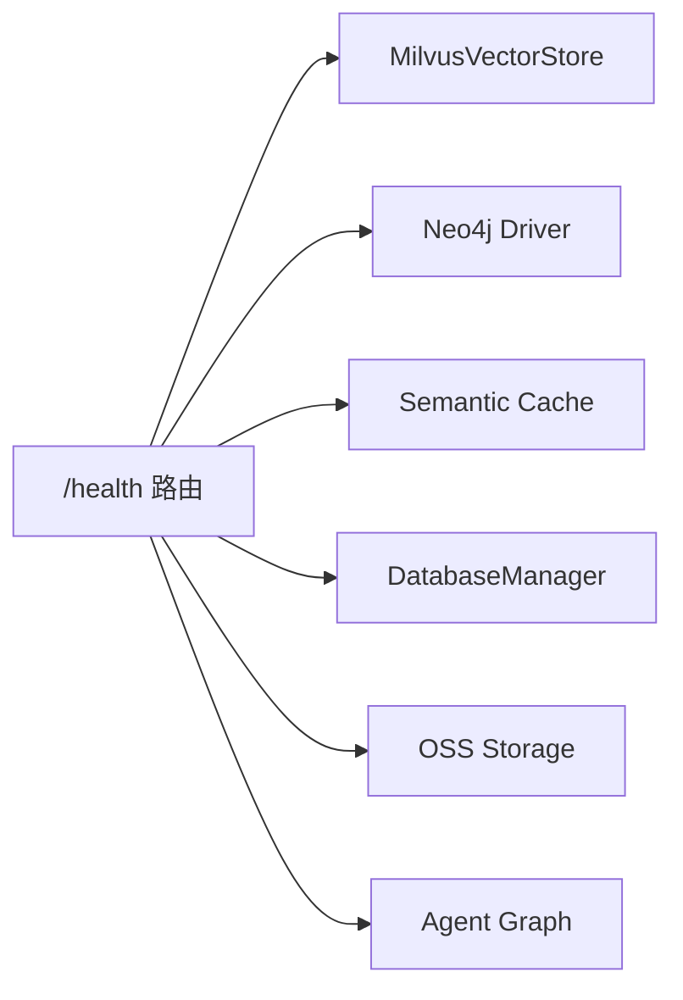

# 健康检查API

<cite>
**本文引用的文件**   
- [health.py](file://backend_design/nexus/api/routes/health.py)
- [schemas.py](file://backend_design/nexus/models/schemas.py)
- [vector_store.py](file://backend_design/nexus/rag/vector_store.py)
- [database.py](file://backend_design/nexus/config/database.py)
- [cache.py](file://backend_design/nexus/config/cache.py)
- [metrics.py](file://backend_design/nexus/observability/metrics.py)
- [db_manager.py](file://backend_design/nexus/core/db_manager.py)
- [circuit_breaker.py](file://backend_design/nexus/core/circuit_breaker.py)
- [docker-compose.yml](file://docker-compose.yml)
</cite>

## 目录
1. [简介](#简介)
2. [项目结构](#项目结构)
3. [核心组件](#核心组件)
4. [架构总览](#架构总览)
5. [详细组件分析](#详细组件分析)
6. [依赖关系分析](#依赖关系分析)
7. [性能与可观测性](#性能与可观测性)
8. [故障排查指南](#故障排查指南)
9. [结论](#结论)
10. [附录：容器编排与健康探测配置示例](#附录容器编排与健康探测配置示例)

## 简介
本文件为 NexusCockpit 的健康检查 API 提供完整规范，覆盖系统健康状态查询、依赖服务检测（MySQL、Milvus、Neo4j、Redis、OSS）、资源使用情况监控、告警阈值与熔断自愈机制，以及容器编排中的健康检查与负载均衡器探测配置。读者可据此快速集成 Prometheus/Grafana、Kubernetes 或 Docker Compose 的探针，实现自动化运维与故障自愈。

## 项目结构
健康检查相关能力主要分布在以下模块：
- API 路由层：暴露 /health 与根路径
- 数据模型：统一响应结构 HealthResponse
- 基础设施检测：向量存储（Milvus）、知识图谱（Neo4j）、缓存（Redis）、数据库（MySQL）、对象存储（OSS）
- 可观测性：Prometheus 指标采集
- 熔断与自愈：CircuitBreaker 保护关键调用
- 容器编排：Docker Compose 健康检查与依赖启动顺序

图表来源
- [health.py:26-95](file://backend_design/nexus/api/routes/health.py#L26-L95)
- [docker-compose.yml:70-74](file://docker-compose.yml#L70-L74)

章节来源
- [health.py:1-108](file://backend_design/nexus/api/routes/health.py#L1-L108)
- [schemas.py:70-75](file://backend_design/nexus/models/schemas.py#L70-L75)

## 核心组件
- 健康检查端点 GET /health
  - 返回整体状态 status: healthy/degraded
  - 返回版本 version
  - 返回各组件 services 字典，键包括 milvus、neo4j、redis、mysql、oss、agent
- 根路径 GET /
  - 返回应用基本信息与文档入口

HealthResponse 字段定义
- status: 字符串，默认 "healthy"
- version: 字符串，默认 "1.0.0"
- services: 字典，描述各组件状态值

章节来源
- [health.py:26-95](file://backend_design/nexus/api/routes/health.py#L26-L95)
- [schemas.py:70-75](file://backend_design/nexus/models/schemas.py#L70-L75)

## 架构总览
健康检查流程由 FastAPI 路由触发，依次探测各依赖服务的连接性与可用性，汇总后返回统一响应。同时通过 Prometheus 指标暴露请求量、延迟等运行时指标，便于外部监控系统采集。

图表来源
- [health.py:26-95](file://backend_design/nexus/api/routes/health.py#L26-L95)
- [metrics.py:15-108](file://backend_design/nexus/observability/metrics.py#L15-L108)

## 详细组件分析

### 健康检查接口规范
- 方法：GET
- 路径：/health
- 响应体：HealthResponse
  - status: "healthy" 表示所有核心组件可用；"degraded" 表示部分组件不可用但服务仍可运行
  - version: 应用版本
  - services: 各组件状态
    - milvus: "connected"/"disconnected"/"not_configured"
    - neo4j: "connected"/"disconnected"/"not_configured"
    - redis: "connected"/"disconnected"/"not_configured"
    - mysql: "connected"/"disconnected"
    - oss: "connected"/"configured"/"disabled"/"not_configured"
    - agent: "ready"/"not_ready"

健康判定规则
- 当 milvus、neo4j、redis、agent、mysql 全部为 "connected"/"ready" 时，status="healthy"
- 否则 status="degraded"

章节来源
- [health.py:26-95](file://backend_design/nexus/api/routes/health.py#L26-L95)
- [schemas.py:70-75](file://backend_design/nexus/models/schemas.py#L70-L75)

### 依赖服务检测逻辑

#### 向量存储（Milvus）
- 检测方式：读取 app.state.vector_store.is_connected
- 状态映射：
  - 已连接 → "connected"
  - 未连接 → "disconnected"
  - 未配置 → "not_configured"
- 初始化与集合管理：
  - connect() 建立连接并初始化 Food_List、User_Memory 集合
  - 维度不匹配或字段缺失时自动重建集合
- 健康建议：
  - 若 is_connected=False，优先检查 Milvus 服务可达性与 URI 配置

章节来源
- [health.py:36-41](file://backend_design/nexus/api/routes/health.py#L36-L41)
- [vector_store.py:45-57](file://backend_design/nexus/rag/vector_store.py#L45-L57)
- [vector_store.py:106-146](file://backend_design/nexus/rag/vector_store.py#L106-L146)
- [vector_store.py:148-199](file://backend_design/nexus/rag/vector_store.py#L148-L199)
- [vector_store.py:414-417](file://backend_design/nexus/rag/vector_store.py#L414-L417)

#### 知识图谱（Neo4j）
- 检测方式：读取 app.state.graph_store.driver 是否存在
- 状态映射：
  - 存在驱动 → "connected"
  - 不存在 → "disconnected"
  - 未配置 → "not_configured"

章节来源
- [health.py:43-47](file://backend_design/nexus/api/routes/health.py#L43-L47)

#### 缓存（Redis）
- 检测方式：读取 app.state.semantic_cache.is_enabled
- 状态映射：
  - 启用且可用 → "connected"
  - 禁用或不可用 → "disconnected"
  - 未配置 → "not_configured"
- 语义缓存参数：
  - cache_enabled、cache_similarity_threshold、cache_ttl

章节来源
- [health.py:49-54](file://backend_design/nexus/api/routes/health.py#L49-L54)
- [cache.py:15-41](file://backend_design/nexus/config/cache.py#L15-L41)

#### 数据库（MySQL）
- 检测方式：TCP connect_ex(host, port)，超时 2s
- 状态映射：
  - 连通 → "connected"
  - 失败 → "disconnected"
- 连接池与迁移：
  - DatabaseManager 维护 aiomysql 连接池
  - 启动时自动创建表与默认数据，确保 schema 一致

章节来源
- [health.py:58-71](file://backend_design/nexus/api/routes/health.py#L58-L71)
- [database.py:42-61](file://backend_design/nexus/config/database.py#L42-L61)
- [db_manager.py:56-85](file://backend_design/nexus/core/db_manager.py#L56-L85)

#### 对象存储（OSS）
- 检测方式：读取 app.state.oss_storage.is_available 或 config.enabled
- 状态映射：
  - 可用 → "connected"
  - 已配置但未启用 → "configured"
  - 禁用 → "disabled"
  - 未配置 → "not_configured"

章节来源
- [health.py:73-83](file://backend_design/nexus/api/routes/health.py#L73-L83)

#### Agent 工作流
- 检测方式：app.state.agent_graph 是否存在
- 状态映射：
  - 存在 → "ready"
  - 不存在 → "not_ready"

章节来源
- [health.py:85-86](file://backend_design/nexus/api/routes/health.py#L85-L86)

### 健康检查流程图

图表来源
- [health.py:26-95](file://backend_design/nexus/api/routes/health.py#L26-L95)

### 熔断与故障自愈机制
- CircuitBreaker 三态：CLOSED → OPEN → HALF_OPEN → CLOSED
- 适用场景：
  - LLM 连续失败降级本地模型
  - Milvus 连续不可用降级无向量检索
  - 车控服务连续超时降级 Mock
- 关键参数：
  - failure_threshold：连续失败次数阈值
  - recovery_period：熔断恢复等待时间（秒）
  - half_open_max_calls：半开试探并发上限

图表来源
- [circuit_breaker.py:34-177](file://backend_design/nexus/core/circuit_breaker.py#L34-L177)

章节来源
- [circuit_breaker.py:1-177](file://backend_design/nexus/core/circuit_breaker.py#L1-L177)

## 依赖关系分析
健康检查对以下组件存在直接依赖：
- Milvus：向量检索与记忆存储
- Neo4j：知识图谱
- Redis：语义缓存与会话存储
- MySQL：业务数据持久化
- OSS：对象存储
- Agent：工作流引擎

图表来源
- [health.py:26-95](file://backend_design/nexus/api/routes/health.py#L26-L95)
- [vector_store.py:36-57](file://backend_design/nexus/rag/vector_store.py#L36-L57)
- [db_manager.py:40-85](file://backend_design/nexus/core/db_manager.py#L40-L85)

章节来源
- [health.py:26-95](file://backend_design/nexus/api/routes/health.py#L26-L95)

## 性能与可观测性
- Prometheus 指标
  - 应用信息：nexus_cockpit_info
  - 请求计数：nexus_requests_total（endpoint/method/status）
  - 请求延迟：nexus_request_latency_seconds（endpoint）
  - Agent 调用：nexus_agent_invocations_total、nexus_agent_latency_seconds
  - 技能执行：nexus_skill_executions_total
  - 缓存命中/未命中：nexus_cache_hits_total、nexus_cache_misses_total
  - RAG 检索：nexus_rag_retrievals_total、nexus_rag_latency_seconds
  - LLM 调用：nexus_llm_calls_total、nexus_llm_latency_seconds
  - 活动连接数：nexus_active_connections

- 指标初始化
  - init_metrics() 设置应用信息与基础标签

章节来源
- [metrics.py:15-108](file://backend_design/nexus/observability/metrics.py#L15-L108)

## 故障排查指南
常见问题与定位步骤：
- MySQL 不可达
  - 检查 TCP 连通性（端口、防火墙）
  - 查看 DatabaseManager 连接池日志
  - 确认环境变量 MYSQL_HOST/MYSQL_PORT/MYSQL_USER/MYSQL_PASSWORD/MYSQL_DATABASE
- Milvus 未连接
  - 检查 is_connected 与 URI
  - 确认 etcd/minio 依赖健康
  - 观察集合维度与字段一致性
- Neo4j 未连接
  - 检查 driver 初始化与认证
- Redis 未启用
  - 检查 is_enabled 与 REDIS_* 环境变量
  - 确认密码与端口可达
- OSS 未配置或未启用
  - 检查 is_available 与 config.enabled
- Agent 未就绪
  - 检查 app.state.agent_graph 初始化

章节来源
- [health.py:58-86](file://backend_design/nexus/api/routes/health.py#L58-L86)
- [db_manager.py:56-85](file://backend_design/nexus/core/db_manager.py#L56-L85)
- [vector_store.py:45-57](file://backend_design/nexus/rag/vector_store.py#L45-L57)
- [cache.py:15-41](file://backend_design/nexus/config/cache.py#L15-L41)

## 结论
NexusCockpit 的健康检查 API 提供了全面的基础设施探测能力，结合 Prometheus 指标与熔断自愈机制，可实现高可用的生产环境运维。通过容器编排中的健康检查与依赖启动顺序，保障服务间正确拉起与故障隔离。

## 附录：容器编排与健康探测配置示例
- Docker Compose
  - nexus_ai（Python 后端）
    - healthcheck: curl -f http://localhost:8000/health
    - depends_on: redis、milvus、mysql（condition: service_healthy）
  - nexus_gate（Go 网关）
    - healthcheck: wget -q --spider http://localhost:8080/health
  - 基础设施
    - redis: redis-cli ping
    - mysql: mysqladmin ping
    - milvus: curl -f http://localhost:9091/healthz
    - etcd: etcdctl endpoint health
    - minio: curl -f http://localhost:9000/minio/health/live
    - langfuse: wget -q --spider http://localhost:3000/api/publichealth

- Kubernetes 健康探测（概念性示例）
  - livenessProbe: HTTP GET /health，间隔 15s，超时 5s，重试 3
  - readinessProbe: HTTP GET /health，间隔 10s，超时 5s，重试 3
  - startupProbe: HTTP GET /health，初始延迟 30s，周期 5s，失败阈值 10

- 负载均衡器健康探测（概念性示例）
  - Nginx upstream health check: 定期访问 /health，根据返回状态码标记节点 Up/Down
  - Ingress 控制器：基于 /health 的存活探针进行流量调度

章节来源
- [docker-compose.yml:34-38](file://docker-compose.yml#L34-L38)
- [docker-compose.yml:70-74](file://docker-compose.yml#L70-L74)
- [docker-compose.yml:105-109](file://docker-compose.yml#L105-L109)
- [docker-compose.yml:120-124](file://docker-compose.yml#L120-L124)
- [docker-compose.yml:141-145](file://docker-compose.yml#L141-L145)
- [docker-compose.yml:182-186](file://docker-compose.yml#L182-L186)
- [docker-compose.yml:204-208](file://docker-compose.yml#L204-L208)
- [docker-compose.yml:242-246](file://docker-compose.yml#L242-L246)