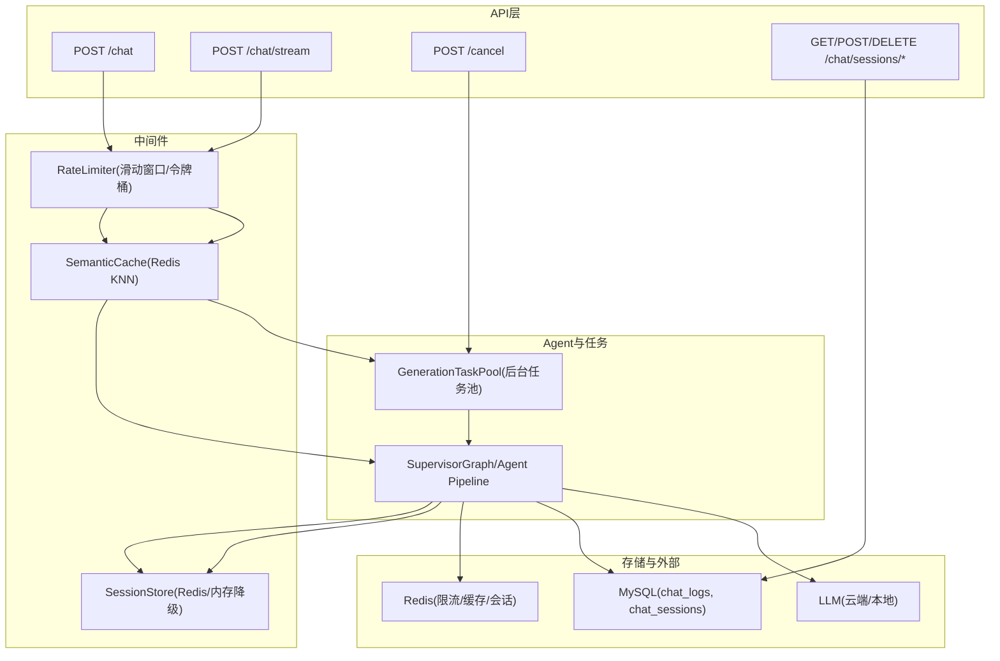
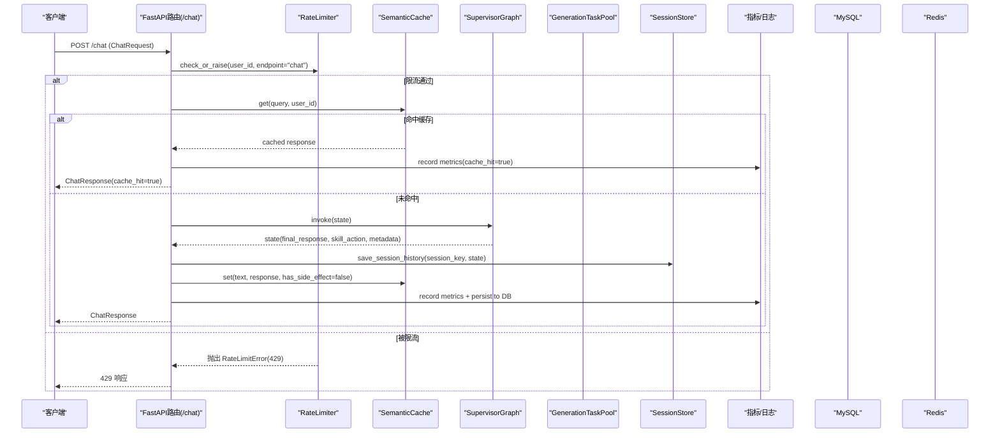
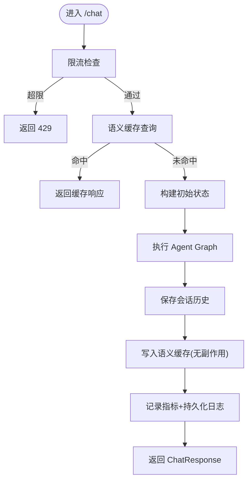
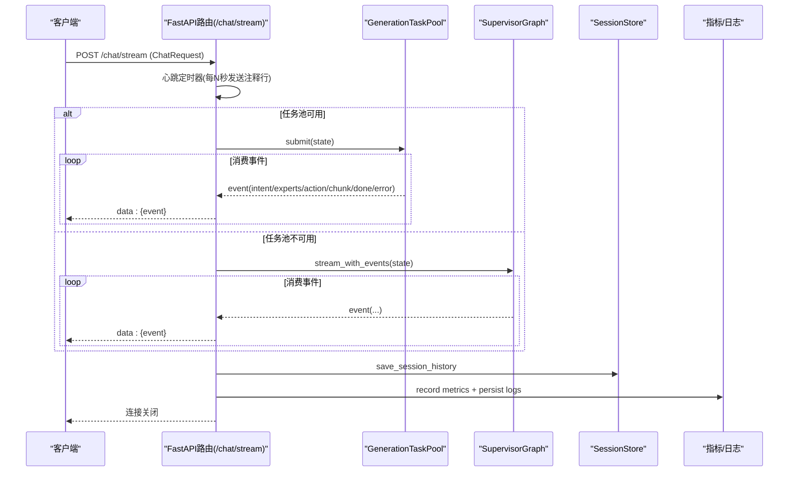
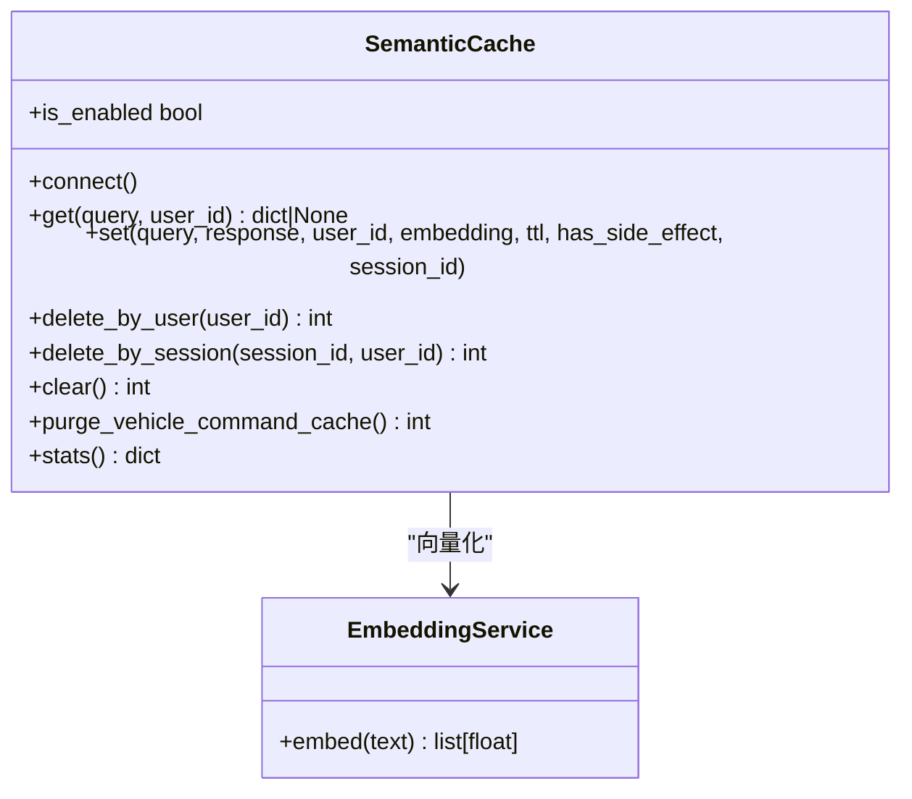
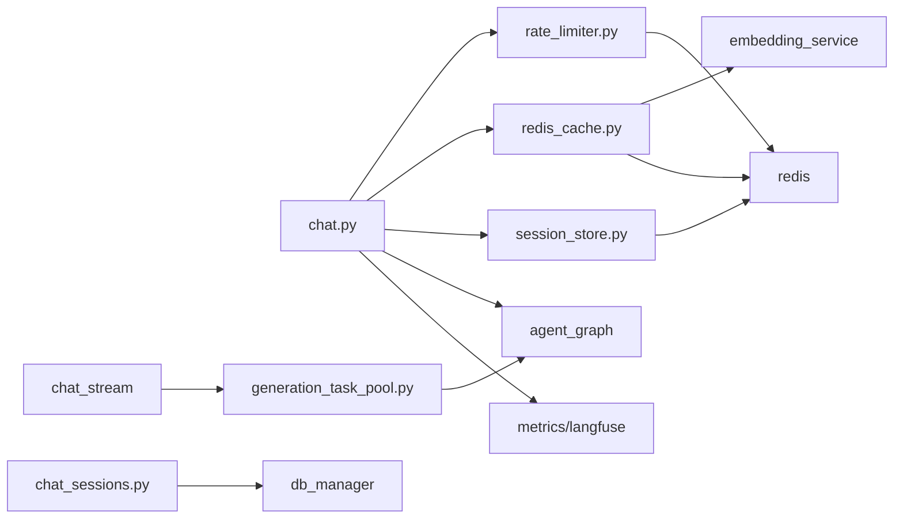

# 对话API接口

<cite>
**本文引用的文件**
- [chat.py](file://backend_design/nexus/api/routes/chat.py)
- [chat_sessions.py](file://backend_design/nexus/api/routes/chat_sessions.py)
- [rate_limiter.py](file://backend_design/nexus/middleware/rate_limiter.py)
- [redis_cache.py](file://backend_design/nexus/middleware/redis_cache.py)
- [schemas.py](file://backend_design/nexus/models/schemas.py)
- [generation_task_pool.py](file://backend_design/nexus/agent/generation_task_pool.py)
- [session_store.py](file://backend_design/nexus/middleware/session_store.py)
- [constants.py](file://backend_design/nexus/intent/constants.py)
- [cache.py](file://backend_design/nexus/config/cache.py)
- [server.py](file://backend_design/nexus/config/server.py)
- [exceptions.py](file://backend_design/nexus/core/exceptions.py)
</cite>

## 目录
1. [简介](#简介)
2. [项目结构](#项目结构)
3. [核心组件](#核心组件)
4. [架构总览](#架构总览)
5. [详细组件分析](#详细组件分析)
6. [依赖关系分析](#依赖关系分析)
7. [性能考量](#性能考量)
8. [故障排查指南](#故障排查指南)
9. [结论](#结论)
10. [附录](#附录)

## 简介
本文件为 NexusCockpit 的对话 API 接口文档，重点覆盖以下端点与机制：
- POST /chat（非流式）：完整的请求处理流程、语义缓存、会话管理、限流策略、指标记录与错误处理。
- POST /chat/stream（SSE 流式）：事件类型（intent、experts、action、chunk、done）、心跳保活、任务池托管与中断保障。
- POST /cancel（取消生成）：使用方法与行为说明。
- 语义缓存工作原理、车控指令跳过缓存逻辑、上下文敏感查询处理策略。
- 请求/响应格式定义、状态码说明、错误处理策略与客户端集成要点。

## 项目结构
对话相关代码主要位于后端 Python 服务中，关键路径如下：
- API 路由：backend_design/nexus/api/routes/chat.py、chat_sessions.py
- 中间件：middleware/rate_limiter.py、middleware/redis_cache.py、middleware/session_store.py
- 模型与配置：models/schemas.py、config/cache.py、config/server.py
- Agent 任务池：agent/generation_task_pool.py
- 意图常量：intent/constants.py
- 异常体系：core/exceptions.py

图表来源
- [chat.py:319-464](file://backend_design/nexus/api/routes/chat.py#L319-L464)
- [chat.py:467-686](file://backend_design/nexus/api/routes/chat.py#L467-L686)
- [chat.py:689-719](file://backend_design/nexus/api/routes/chat.py#L689-L719)
- [chat_sessions.py:58-136](file://backend_design/nexus/api/routes/chat_sessions.py#L58-L136)
- [rate_limiter.py:117-211](file://backend_design/nexus/middleware/rate_limiter.py#L117-L211)
- [redis_cache.py:57-128](file://backend_design/nexus/middleware/redis_cache.py#L57-L128)
- [session_store.py:43-114](file://backend_design/nexus/middleware/session_store.py#L43-L114)
- [generation_task_pool.py:68-145](file://backend_design/nexus/agent/generation_task_pool.py#L68-L145)

章节来源
- [chat.py:1-719](file://backend_design/nexus/api/routes/chat.py#L1-L719)
- [chat_sessions.py:1-534](file://backend_design/nexus/api/routes/chat_sessions.py#L1-L534)

## 核心组件
- 非流式对话端点 POST /chat：限流→语义缓存→构建初始状态→执行 Agent Graph→更新会话历史→写入缓存→记录指标与日志→返回 ChatResponse。
- 流式对话端点 POST /chat/stream：SSE 事件流，支持任务池托管 pipeline；心跳保活；完成时持久化日志与指标；断连不中断 pipeline。
- 取消生成 POST /cancel：通过 GenerationTaskPool 查找并取消用户正在运行的生成任务。
- 语义缓存 SemanticCache：基于 Redis 8 RediSearch KNN 向量检索，按 user_id 分片，TTL 分级，副作用隔离（车控不缓存）。
- 会话管理 SessionStore：优先 Redis 持久化会话历史与滚动摘要，不可用时降级到内存 dict。
- 限流 RateLimiter：基于 Redis Lua 的原子滑动窗口与令牌桶算法，支持 check_or_raise 抛出 429。
- 模型与配置：ChatRequest/ChatResponse 定义请求/响应字段；Redis/Server 配置项控制缓存阈值、TTL、心跳间隔等。

章节来源
- [chat.py:319-464](file://backend_design/nexus/api/routes/chat.py#L319-L464)
- [chat.py:467-686](file://backend_design/nexus/api/routes/chat.py#L467-L686)
- [chat.py:689-719](file://backend_design/nexus/api/routes/chat.py#L689-L719)
- [redis_cache.py:57-128](file://backend_design/nexus/middleware/redis_cache.py#L57-L128)
- [session_store.py:43-114](file://backend_design/nexus/middleware/session_store.py#L43-L114)
- [rate_limiter.py:117-211](file://backend_design/nexus/middleware/rate_limiter.py#L117-L211)
- [schemas.py:19-38](file://backend_design/nexus/models/schemas.py#L19-L38)
- [cache.py:15-41](file://backend_design/nexus/config/cache.py#L15-L41)
- [server.py:15-33](file://backend_design/nexus/config/server.py#L15-L33)

## 架构总览
下图展示从请求进入 FastAPI 到最终返回的完整链路，包括限流、语义缓存、会话历史、Agent 执行、任务池托管、指标与日志持久化。

图表来源
- [chat.py:319-464](file://backend_design/nexus/api/routes/chat.py#L319-L464)
- [rate_limiter.py:204-211](file://backend_design/nexus/middleware/rate_limiter.py#L204-L211)
- [redis_cache.py:213-234](file://backend_design/nexus/middleware/redis_cache.py#L213-L234)
- [session_store.py:152-176](file://backend_design/nexus/middleware/session_store.py#L152-L176)

## 详细组件分析

### 非流式对话端点 POST /chat
- 功能概述：接收 ChatRequest，执行限流、语义缓存、Agent 推理、会话历史保存、缓存写入、指标与日志记录，返回 ChatResponse。
- 关键流程：
  - 限流：调用 RateLimiter.check_or_raise，超限抛出 RateLimitError（429）。
  - 语义缓存：若命中则直接返回，否则继续执行。
  - 会话锁：同一 session 并发请求串行化，避免历史交叉污染。
  - Agent 执行：创建初始状态并调用 agent_graph.invoke，捕获异常并记录指标。
  - 会话历史：优先使用 SessionStore 持久化，不可用回退内存。
  - 缓存写入：有副作用（has_side_effect）或上下文敏感文本禁止写入缓存。
  - 指标与日志：记录 Redis 指标与 MySQL 聊天日志，包含 intent/action/latency/cache_hit。
  - 追踪：可选 Langfuse trace/span 记录。
- 错误处理：
  - 限流：429。
  - Agent 图未初始化：返回友好提示。
  - Agent 执行异常：返回兜底回复并记录错误。
  - 指标/日志失败：记录错误但不影响主流程。

图表来源
- [chat.py:319-464](file://backend_design/nexus/api/routes/chat.py#L319-L464)

章节来源
- [chat.py:319-464](file://backend_design/nexus/api/routes/chat.py#L319-L464)
- [schemas.py:19-38](file://backend_design/nexus/models/schemas.py#L19-L38)
- [exceptions.py:112-117](file://backend_design/nexus/core/exceptions.py#L112-L117)

### 流式对话端点 POST /chat/stream
- 功能概述：SSE 流式输出结构化事件（intent、experts、action、chunk、done），支持心跳保活与任务池托管。
- 事件类型：
  - intent：意图路由结果
  - experts：分派的专家列表
  - action：执行的技能动作
  - chunk：流式文本块
  - done：完成事件（包含最终 response、latency_ms、cache_hit）
- 心跳保活：按配置间隔发送 SSE 注释行（": heartbeat\n\n"），防止代理/防火墙超时断开。
- 任务池托管：
  - 优先通过 GenerationTaskPool.submit 提交后台任务，SSE 仅消费事件队列。
  - 客户端断连仅停止读取，pipeline 继续运行；finally 块确保会话历史与日志持久化。
  - 降级路径：任务池不可用时直接 stream_with_events。
- 语义缓存：命中时以 thinking/chunk/done 事件快速返回，不走 Agent 流式。
- 错误处理：
  - Agent 图未初始化：发送 error 事件。
  - 流式异常：发送 error 事件并在 finally 强制持久化日志。
  - 流中断兜底：full_response 为空时填充安全话术，保证成对写入 chat_logs。

图表来源
- [chat.py:467-686](file://backend_design/nexus/api/routes/chat.py#L467-L686)
- [generation_task_pool.py:113-145](file://backend_design/nexus/agent/generation_task_pool.py#L113-L145)

章节来源
- [chat.py:467-686](file://backend_design/nexus/api/routes/chat.py#L467-L686)
- [generation_task_pool.py:68-145](file://backend_design/nexus/agent/generation_task_pool.py#L68-L145)

### 取消生成接口 POST /cancel
- 功能：用户主动点击“暂停生成”时调用，终止当前用户的运行中生成任务。
- 行为：
  - 遍历任务池中的任务，匹配 user_id 且 status=running 的任务。
  - 调用 cancel_task 取消 asyncio.Task，返回 success 与消息。
  - 页面切换/组件卸载不会调用此接口，pipeline 继续在后台运行。
- 返回值：{"success": bool, "message": string}

章节来源
- [chat.py:689-719](file://backend_design/nexus/api/routes/chat.py#L689-L719)
- [generation_task_pool.py:240-257](file://backend_design/nexus/agent/generation_task_pool.py#L240-L257)

### 语义缓存机制
- 工作原理：
  - 将 query 向量化，使用 Redis 8 RediSearch KNN 检索最近邻，相似度阈值默认 0.92。
  - 按 user_id 分片，支持 TTL 分级（闲聊 1h、知识库 24h）。
  - 安全检查：has_side_effect=True 的条目永不返回（防车控指令缓存后不执行）。
  - 降级模式：不支持 FT.* 命令时回退 O(n) scan 搜索。
- 跳过缓存场景：
  - 车控指令：启发式路由器判断 VEHICLE_INTENT_KEYS，命中则跳过缓存。
  - 上下文敏感查询：包含时间/位置/历史/推荐关键词，答案依赖上下文，跳过缓存。
- 写入缓存：
  - 有副作用或上下文敏感的响应禁止写入缓存。
  - 记录 session_id 用于会话级精确清理。

图表来源
- [redis_cache.py:57-128](file://backend_design/nexus/middleware/redis_cache.py#L57-L128)
- [redis_cache.py:213-234](file://backend_design/nexus/middleware/redis_cache.py#L213-L234)
- [redis_cache.py:367-436](file://backend_design/nexus/middleware/redis_cache.py#L367-L436)

章节来源
- [redis_cache.py:57-128](file://backend_design/nexus/middleware/redis_cache.py#L57-L128)
- [redis_cache.py:213-234](file://backend_design/nexus/middleware/redis_cache.py#L213-L234)
- [redis_cache.py:367-436](file://backend_design/nexus/middleware/redis_cache.py#L367-L436)
- [chat.py:114-149](file://backend_design/nexus/api/routes/chat.py#L114-L149)
- [chat.py:189-208](file://backend_design/nexus/api/routes/chat.py#L189-L208)
- [constants.py:12-41](file://backend_design/nexus/intent/constants.py#L12-L41)

### 会话管理与持久化
- 会话历史：
  - 优先使用 SessionStore.async_get/set 持久化到 Redis，自动续期 TTL。
  - 降级到内存 dict，保证服务可用性。
  - 支持滚动摘要 running_summary 独立存储，跨轮次保留压缩后的上下文。
- 会话删除：
  - 精确清理 MySQL 会话元数据与聊天日志、Redis 短期记忆与摘要、内存会话历史、LangGraph checkpoint、会话并发锁、语义缓存、Milvus 会话级记忆。
  - 跨会话共享资源（用户级记忆、图谱、习惯）不随单个会话删除。

章节来源
- [session_store.py:43-114](file://backend_design/nexus/middleware/session_store.py#L43-L114)
- [session_store.py:152-176](file://backend_design/nexus/middleware/session_store.py#L152-L176)
- [chat_sessions.py:138-324](file://backend_design/nexus/api/routes/chat_sessions.py#L138-L324)

### 限流策略
- 滑动窗口：基于 Redis ZSET 原子操作，清理旧条目+统计计数+添加新条目，超限拒绝且不污染计数器。
- 令牌桶：允许突发流量，平均速率受令牌生成速率控制，适合 LLM API 调用。
- 错误降级：Redis 不可用时放行，避免单点故障。
- 429 响应：check_or_raise 抛出 RateLimitError，全局处理器映射为 429。

章节来源
- [rate_limiter.py:117-211](file://backend_design/nexus/middleware/rate_limiter.py#L117-L211)
- [rate_limiter.py:212-277](file://backend_design/nexus/middleware/rate_limiter.py#L212-L277)
- [exceptions.py:112-117](file://backend_design/nexus/core/exceptions.py#L112-L117)

### 错误处理策略
- 自定义异常体系：所有异常继承 NexusError，携带 code 与 details，便于前端差异化处理。
- 常见错误：
  - RateLimitError：限流触发，429。
  - LLMError/RAGError/VectorStoreError/GraphStoreError/MemoryError/SkillError/IntentError/VehicleError：各子系统异常。
  - CircuitBreakerError：熔断器打开，拒绝请求并触发降级。
- 全局处理：FastAPI 全局异常处理器统一返回 JSON {error, message, details}。

章节来源
- [exceptions.py:19-128](file://backend_design/nexus/core/exceptions.py#L19-L128)

## 依赖关系分析
- 模块耦合：
  - chat.py 依赖 rate_limiter、semantic_cache、session_store、agent_graph、metrics、langfuse。
  - redis_cache.py 依赖 embedding_service、redis client。
  - generation_task_pool.py 依赖 agent_graph.stream_with_events。
  - chat_sessions.py 依赖 db_manager、session_store、semantic_cache、memory_manager。
- 外部依赖：
  - Redis：限流、语义缓存、会话存储。
  - MySQL：聊天日志与会话元数据。
  - LLM：云端/本地大模型推理。
  - Milvus/Neo4j：向量检索与知识图谱（间接依赖）。

图表来源
- [chat.py:319-464](file://backend_design/nexus/api/routes/chat.py#L319-L464)
- [chat.py:467-686](file://backend_design/nexus/api/routes/chat.py#L467-L686)
- [redis_cache.py:57-128](file://backend_design/nexus/middleware/redis_cache.py#L57-L128)
- [rate_limiter.py:117-211](file://backend_design/nexus/middleware/rate_limiter.py#L117-L211)
- [session_store.py:43-114](file://backend_design/nexus/middleware/session_store.py#L43-L114)
- [generation_task_pool.py:68-145](file://backend_design/nexus/agent/generation_task_pool.py#L68-L145)

章节来源
- [chat.py:1-719](file://backend_design/nexus/api/routes/chat.py#L1-L719)
- [redis_cache.py:1-615](file://backend_design/nexus/middleware/redis_cache.py#L1-L615)
- [rate_limiter.py:1-297](file://backend_design/nexus/middleware/rate_limiter.py#L1-L297)
- [session_store.py:1-294](file://backend_design/nexus/middleware/session_store.py#L1-L294)
- [generation_task_pool.py:1-304](file://backend_design/nexus/agent/generation_task_pool.py#L1-L304)

## 性能考量
- 语义缓存：KNN 向量检索 O(log n)，相似度阈值可调，TTL 分级减少过期开销。
- 会话历史：Redis 持久化，自动续期，内存降级保证可用性。
- 限流：Lua 脚本原子操作，避免竞态条件，支持滑动窗口与令牌桶。
- 任务池：后台异步任务解耦 SSE 连接，支持并发限制与自动清理。
- 指标与日志：Redis 实时指标 + MySQL 持久化，分离隐私数据与管理数据。

[本节为通用指导，无需引用具体文件]

## 故障排查指南
- 限流触发：检查 Redis 连接与 Lua 脚本加载，确认用户请求频率是否超过限制。
- 语义缓存未命中：验证 EmbeddingService 是否正常，Redis FT.* 命令是否可用，相似度阈值是否过高。
- 会话历史丢失：检查 SessionStore 是否降级到内存，Redis TTL 是否过短。
- SSE 连接中断：确认心跳间隔配置，检查代理/防火墙超时设置。
- 任务池满：查看并发任务数是否超过 _MAX_CONCURRENT，必要时调整配置。
- 指标/日志失败：检查 Redis/MySQL 连接状态，关注错误日志但不影响主流程。

章节来源
- [rate_limiter.py:142-155](file://backend_design/nexus/middleware/rate_limiter.py#L142-L155)
- [redis_cache.py:129-163](file://backend_design/nexus/middleware/redis_cache.py#L129-L163)
- [session_store.py:69-81](file://backend_design/nexus/middleware/session_store.py#L69-L81)
- [chat.py:633-676](file://backend_design/nexus/api/routes/chat.py#L633-L676)

## 结论
NexusCockpit 的对话 API 提供了健壮的非流式与流式接口，结合语义缓存、会话管理、限流策略与完善的错误处理，满足车载语音对话的高可用与高性能需求。SSE 流式接口通过任务池托管确保连接中断不影响生成过程，取消接口提供用户主动控制能力。整体架构清晰，扩展性强，适合大规模部署。

[本节为总结，无需引用具体文件]

## 附录

### 请求/响应格式定义
- POST /chat
  - 请求体：ChatRequest{text, user_id, session_id, stream}
  - 响应体：ChatResponse{response, user_id, session_id, latency_ms, metadata, cache_hit, intent, action, trace_id}
- POST /chat/stream
  - 请求体：ChatRequest
  - 响应体：SSE 事件流，事件类型：intent、experts、action、chunk、done、error
- POST /cancel
  - 请求体：ChatRequest（至少 user_id）
  - 响应体：{success: bool, message: string}

章节来源
- [schemas.py:19-38](file://backend_design/nexus/models/schemas.py#L19-L38)
- [chat.py:319-464](file://backend_design/nexus/api/routes/chat.py#L319-L464)
- [chat.py:467-686](file://backend_design/nexus/api/routes/chat.py#L467-L686)
- [chat.py:689-719](file://backend_design/nexus/api/routes/chat.py#L689-L719)

### 状态码说明
- 200：成功（非流式返回 ChatResponse，流式返回 SSE 事件）
- 429：限流触发（RateLimitError）
- 5xx：服务端内部错误（如 Agent 图未初始化、数据库连接失败等）

章节来源
- [exceptions.py:112-117](file://backend_design/nexus/core/exceptions.py#L112-L117)
- [chat.py:375-384](file://backend_design/nexus/api/routes/chat.py#L375-L384)

### 客户端集成示例要点
- 非流式：发送 ChatRequest，等待 ChatResponse，根据 cache_hit 优化 UI。
- 流式：建立 SSE 连接，处理事件类型，实现心跳检测与重连。
- 取消：在用户点击“暂停生成”时调用 POST /cancel，传递 user_id。

[本节为通用指导，无需引用具体文件]