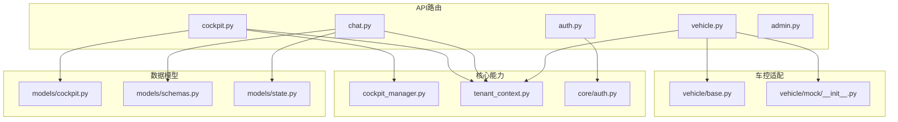
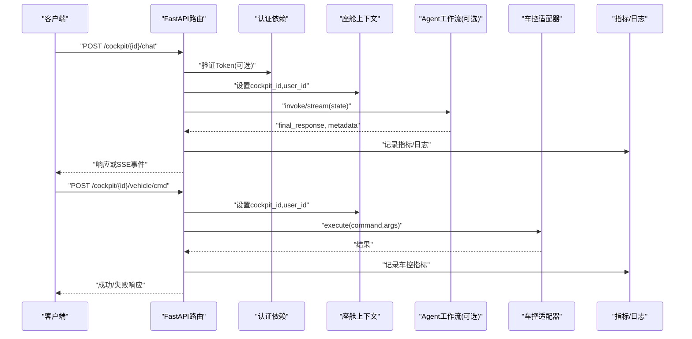
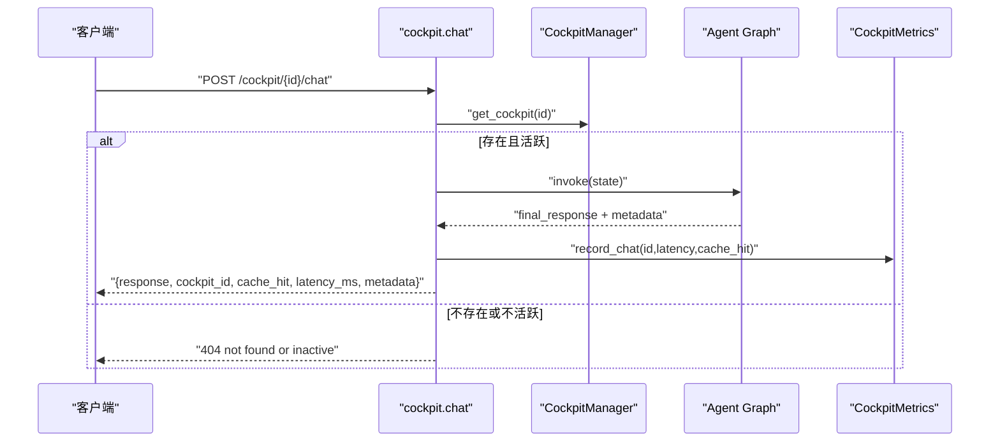
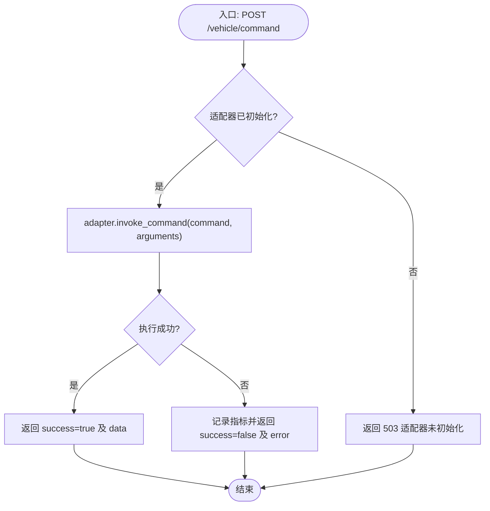
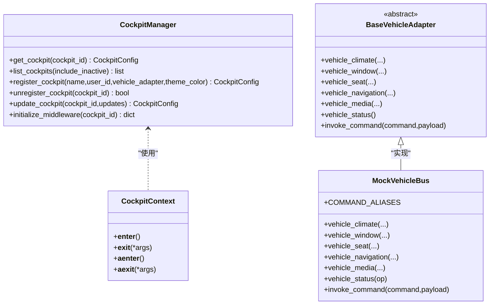

# 座舱控制API

<cite>
**本文引用的文件**   
- [cockpit.py](file://backend_design/nexus/api/routes/cockpit.py)
- [admin.py](file://backend_design/nexus/api/routes/admin.py)
- [auth.py](file://backend_design/nexus/api/routes/auth.py)
- [vehicle.py](file://backend_design/nexus/api/routes/vehicle.py)
- [chat.py](file://backend_design/nexus/api/routes/chat.py)
- [cockpit_manager.py](file://backend_design/nexus/core/cockpit_manager.py)
- [tenant_context.py](file://backend_design/nexus/core/tenant_context.py)
- [auth.py](file://backend_design/nexus/core/auth.py)
- [cockpit.py](file://backend_design/nexus/models/cockpit.py)
- [schemas.py](file://backend_design/nexus/models/schemas.py)
- [state.py](file://backend_design/nexus/models/state.py)
- [base.py](file://backend_design/nexus/vehicle/base.py)
- [mock/__init__.py](file://backend_design/nexus/vehicle/mock/__init__.py)
</cite>

## 目录
1. [简介](#简介)
2. [项目结构](#项目结构)
3. [核心组件](#核心组件)
4. [架构总览](#架构总览)
5. [详细组件分析](#详细组件分析)
6. [依赖关系分析](#依赖关系分析)
7. [性能考虑](#性能考虑)
8. [故障排查指南](#故障排查指南)
9. [结论](#结论)
10. [附录](#附录)

## 简介
本文件为 NexusCockpit 的“座舱控制API”提供完整、可操作的接口规范与最佳实践，覆盖：
- 座舱状态查询、对话与流式对话
- 车控指令执行与车辆状态查询
- 用户认证与会话管理
- 多座舱隔离、上下文管理与权限控制
- 与车控系统的数据交互流程与状态同步机制
- 错误码定义与调用示例（以路径引用形式给出）

## 项目结构
NexusCockpit 后端采用 FastAPI 路由分层组织，核心 API 集中在 api/routes 下；座舱生命周期与上下文由 core 层支撑；数据模型在 models 中统一声明；车控适配层通过 vehicle 抽象与 mock/http/mcp 实现。

图表来源
- [cockpit.py:1-266](file://backend_design/nexus/api/routes/cockpit.py#L1-L266)
- [chat.py:1-719](file://backend_design/nexus/api/routes/chat.py#L1-L719)
- [vehicle.py:1-152](file://backend_design/nexus/api/routes/vehicle.py#L1-L152)
- [auth.py:1-194](file://backend_design/nexus/api/routes/auth.py#L1-L194)
- [admin.py:1-272](file://backend_design/nexus/api/routes/admin.py#L1-L272)
- [cockpit_manager.py:1-397](file://backend_design/nexus/core/cockpit_manager.py#L1-L397)
- [tenant_context.py:1-103](file://backend_design/nexus/core/tenant_context.py#L1-L103)
- [auth.py:1-140](file://backend_design/nexus/core/auth.py#L1-L140)
- [cockpit.py:1-214](file://backend_design/nexus/models/cockpit.py#L1-L214)
- [schemas.py:1-88](file://backend_design/nexus/models/schemas.py#L1-L88)
- [state.py:1-165](file://backend_design/nexus/models/state.py#L1-L165)
- [base.py:1-92](file://backend_design/nexus/vehicle/base.py#L1-L92)
- [mock/__init__.py:1-220](file://backend_design/nexus/vehicle/mock/__init__.py#L1-L220)

章节来源
- [cockpit.py:1-266](file://backend_design/nexus/api/routes/cockpit.py#L1-L266)
- [chat.py:1-719](file://backend_design/nexus/api/routes/chat.py#L1-L719)
- [vehicle.py:1-152](file://backend_design/nexus/api/routes/vehicle.py#L1-L152)
- [auth.py:1-194](file://backend_design/nexus/api/routes/auth.py#L1-L194)
- [admin.py:1-272](file://backend_design/nexus/api/routes/admin.py#L1-L272)
- [cockpit_manager.py:1-397](file://backend_design/nexus/core/cockpit_manager.py#L1-L397)
- [tenant_context.py:1-103](file://backend_design/nexus/core/tenant_context.py#L1-L103)
- [auth.py:1-140](file://backend_design/nexus/core/auth.py#L1-L140)
- [cockpit.py:1-214](file://backend_design/nexus/models/cockpit.py#L1-L214)
- [schemas.py:1-88](file://backend_design/nexus/models/schemas.py#L1-L88)
- [state.py:1-165](file://backend_design/nexus/models/state.py#L1-L165)
- [base.py:1-92](file://backend_design/nexus/vehicle/base.py#L1-L92)
- [mock/__init__.py:1-220](file://backend_design/nexus/vehicle/mock/__init__.py#L1-L220)

## 核心组件
- 座舱管理器 CockpitManager：注册/查询/注销座舱，维护默认座舱与中间件初始化（Redis/Milvus/MySQL）。
- 租户上下文 CockpitContext：基于 contextvars 的协程安全上下文，自动注入 cockpit_id 与 user_id，驱动缓存/限流/会话等中间件按座舱隔离。
- 认证模块 auth：JWT Token 签发与校验，提供 get_current_user 依赖用于受保护接口。
- 车控适配器 BaseVehicleAdapter：统一抽象空调/车窗/座椅/导航/媒体/状态查询与通用命令 invoke_command。Mock 实现提供演示能力。
- 数据模型：Pydantic Schema 定义所有请求/响应结构，确保 OpenAPI 文档自动生成与参数校验。

章节来源
- [cockpit_manager.py:1-397](file://backend_design/nexus/core/cockpit_manager.py#L1-L397)
- [tenant_context.py:1-103](file://backend_design/nexus/core/tenant_context.py#L1-L103)
- [auth.py:1-140](file://backend_design/nexus/core/auth.py#L1-L140)
- [base.py:1-92](file://backend_design/nexus/vehicle/base.py#L1-L92)
- [mock/__init__.py:1-220](file://backend_design/nexus/vehicle/mock/__init__.py#L1-L220)
- [schemas.py:1-88](file://backend_design/nexus/models/schemas.py#L1-L88)
- [cockpit.py:1-214](file://backend_design/nexus/models/cockpit.py#L1-L214)

## 架构总览
座舱控制API整体流程如下：
- 客户端通过 REST/SSE 发起请求
- 认证依赖解析 JWT，获取 user_id
- 座舱上下文注入 cockpit_id 与 user_id
- 对话接口走 SupervisorGraph（含语义缓存、会话持久化、指标记录）
- 车控接口直接调用 vehicle_adapter.execute/invoke_command
- 指标与日志写入 Redis/MySQL

图表来源
- [chat.py:319-464](file://backend_design/nexus/api/routes/chat.py#L319-L464)
- [cockpit.py:76-149](file://backend_design/nexus/api/routes/cockpit.py#L76-L149)
- [vehicle.py:48-85](file://backend_design/nexus/api/routes/vehicle.py#L48-L85)
- [auth.py:85-122](file://backend_design/nexus/core/auth.py#L85-L122)
- [tenant_context.py:71-103](file://backend_design/nexus/core/tenant_context.py#L71-L103)

## 详细组件分析

### 座舱状态与对话接口（/cockpit）
- GET /cockpit/{cockpit_id}/status
  - 作用：获取座舱状态（含名称、活跃状态、指标）
  - 路径参数：cockpit_id
  - 响应体：CockpitStatusResponse（包含 cockpit_id、name、is_active、metrics 等）
  - 错误：未找到返回 404；服务未就绪返回 503

- POST /cockpit/{cockpit_id}/chat
  - 作用：非流式对话（转发到 Agent 工作流），支持语义缓存与会话持久化
  - 请求体：ChatRequestBody（text、user_id、stream=false）
  - 响应体：{response, cockpit_id, cache_hit, latency_ms, metadata}
  - 错误：座舱不存在/不活跃 404；Agent图未初始化 503；处理失败 500

- POST /cockpit/{cockpit_id}/chat/stream
  - 作用：SSE 流式对话，逐块输出事件
  - 请求体：ChatRequestBody（stream=true）
  - 响应体：text/event-stream，事件包括 data: {...} 与 data: [DONE]
  - 错误：同上，异常时返回 error 事件并结束

- POST /cockpit/{cockpit_id}/vehicle/cmd
  - 作用：执行车控指令（经 CockpitContext 隔离）
  - 请求体：VehicleCommandBody（command、arguments、user_id）
  - 响应体：{success, cockpit_id, result/error}
  - 错误：座舱不存在/不活跃 404；适配器未初始化 503

- GET /cockpit/{cockpit_id}/vehicle/status
  - 作用：获取座舱的车辆状态
  - 响应体：{cockpit_id, status} 或 {cockpit_id, error}

章节来源
- [cockpit.py:54-266](file://backend_design/nexus/api/routes/cockpit.py#L54-L266)
- [cockpit_manager.py:112-134](file://backend_design/nexus/core/cockpit_manager.py#L112-L134)
- [tenant_context.py:71-103](file://backend_design/nexus/core/tenant_context.py#L71-L103)

#### 对话流程时序图

图表来源
- [cockpit.py:76-149](file://backend_design/nexus/api/routes/cockpit.py#L76-L149)
- [cockpit_manager.py:112-134](file://backend_design/nexus/core/cockpit_manager.py#L112-L134)

### 车控接口（/vehicle）
- POST /vehicle/command
  - 作用：直接执行车控命令（绕过 Agent 工作流），需要 JWT
  - 请求体：VehicleCommandRequest（command、arguments、user_id）
  - 响应体：VehicleCommandResponse（success、message、data、error）
  - 错误：适配器未初始化 503；执行异常抛出 VehicleError

- GET /vehicle/status
  - 作用：获取当前车辆状态（空调/车窗/座椅/媒体/导航/车况）
  - 响应体：扁平化的各子系统状态字典
  - 错误：适配器未初始化 503；查询异常抛出 VehicleError

- POST /vehicle/location
  - 作用：更新浏览器 GPS 坐标（存储到 adapter.navigation）
  - 请求体：LocationUpdate（latitude、longitude）
  - 响应体：{success, location, latitude, longitude, message}

章节来源
- [vehicle.py:48-152](file://backend_design/nexus/api/routes/vehicle.py#L48-L152)
- [base.py:35-92](file://backend_design/nexus/vehicle/base.py#L35-L92)
- [mock/__init__.py:194-220](file://backend_design/nexus/vehicle/mock/__init__.py#L194-L220)

#### 车控命令执行流程图

图表来源
- [vehicle.py:48-85](file://backend_design/nexus/api/routes/vehicle.py#L48-L85)
- [base.py:90-92](file://backend_design/nexus/vehicle/base.py#L90-L92)

### 认证与会话（/auth）
- POST /auth/token
  - 作用：用户认证并获取 JWT Token（开发模式直接签发）
  - 请求体：TokenRequest（user_id、password）
  - 响应体：TokenResponse（access_token、token_type、expires_in）

- GET /auth/me
  - 作用：验证 Token 有效性并返回当前用户信息

- POST /auth/change-password
  - 作用：修改密码（开发模式直接成功）

- POST /auth/send-code
  - 作用：发送手机验证码（开发模式返回验证码）

- POST /auth/reset-password-by-code
  - 作用：通过验证码重置密码

章节来源
- [auth.py:48-194](file://backend_design/nexus/api/routes/auth.py#L48-L194)
- [auth.py:35-122](file://backend_design/nexus/core/auth.py#L35-L122)

### 管理接口（/admin）
- GET /admin/skills
  - 作用：列出可用技能（需认证）

- GET /admin/memory/{user_id}
  - 作用：查询用户记忆（需认证）

- GET /admin/cache/stats
  - 作用：语义缓存统计（命中/未命中/命中率/大小）

- POST /admin/cache/clear
  - 作用：清空语义缓存

- GET /admin/sessions
  - 作用：列出活跃会话

- POST /admin/kb/upload
  - 作用：上传文档到知识库（分块、向量化、入库）

- POST /admin/kb/reindex
  - 作用：重建知识库向量索引

- GET /admin/kb/stats
  - 作用：知识库容量/文档统计

- POST /admin/config/reload
  - 作用：配置热更新（重新加载 .env.local 并重置 LLM 客户端单例）

- GET /admin/config
  - 作用：查看当前配置状态（敏感值脱敏）

章节来源
- [admin.py:22-272](file://backend_design/nexus/api/routes/admin.py#L22-L272)

### 多座舱与上下文管理
- CockpitContext：在 with/async with 中自动设置 cockpit_id 与 user_id，保证缓存/限流/会话等中间件按座舱隔离。
- CockpitManager：维护座舱注册、查询、软删除与中间件初始化（Redis/Milvus/MySQL）。
- RBAC：角色与权限映射（super_admin、cockpit_admin、cockpit_user、cockpit_viewer），支持 :own 变体检查。

章节来源
- [tenant_context.py:1-103](file://backend_design/nexus/core/tenant_context.py#L1-L103)
- [cockpit_manager.py:75-191](file://backend_design/nexus/core/cockpit_manager.py#L75-L191)
- [cockpit.py:175-214](file://backend_design/nexus/models/cockpit.py#L175-L214)

### 数据模型与状态
- ChatRequest/ChatResponse：对话请求与响应结构，包含延迟、元数据、意图、动作、追踪ID等。
- VehicleCommandRequest/Response：车控命令请求与响应结构。
- SupervisorState：多智能体共享状态，包含输入、记忆、意图、专家输出、工具结果、副作用标记、最终输出、可观测性等字段。

章节来源
- [schemas.py:19-88](file://backend_design/nexus/models/schemas.py#L19-L88)
- [state.py:38-165](file://backend_design/nexus/models/state.py#L38-L165)

## 依赖关系分析
- 路由层依赖：
  - cockpit.py 依赖 CockpitManager、CockpitContext、CockpitMetrics
  - chat.py 依赖 HeuristicRouter、SessionStore、SemanticCache、LangfuseMonitor、CockpitMetrics
  - vehicle.py 依赖 BaseVehicleAdapter 与 MockVehicleBus
  - auth.py 依赖 JWT 签发/解码与 HTTPBearer
- 数据层依赖：
  - CockpitManager 依赖 Redis/Milvus/MySQL（异步初始化）
  - chat.py 依赖 MySQL（聊天日志）、Redis（指标与会话）
- 车控适配：
  - BaseVehicleAdapter 抽象出空调/车窗/座椅/导航/媒体/状态查询与通用命令
  - MockVehicleBus 提供演示实现与命令别名映射

图表来源
- [cockpit_manager.py:75-191](file://backend_design/nexus/core/cockpit_manager.py#L75-L191)
- [tenant_context.py:71-103](file://backend_design/nexus/core/tenant_context.py#L71-L103)
- [base.py:35-92](file://backend_design/nexus/vehicle/base.py#L35-L92)
- [mock/__init__.py:39-220](file://backend_design/nexus/vehicle/mock/__init__.py#L39-L220)

章节来源
- [cockpit_manager.py:1-397](file://backend_design/nexus/core/cockpit_manager.py#L1-L397)
- [tenant_context.py:1-103](file://backend_design/nexus/core/tenant_context.py#L1-L103)
- [base.py:1-92](file://backend_design/nexus/vehicle/base.py#L1-L92)
- [mock/__init__.py:1-220](file://backend_design/nexus/vehicle/mock/__init__.py#L1-L220)

## 性能考虑
- 语义缓存：对非车控、非上下文敏感的查询进行缓存，命中后直接返回，显著降低延迟。
- 会话锁：同一 session 并发请求串行化，避免历史交叉污染。
- SSE 心跳：长连接保活，防止代理超时断开。
- 指标与日志：Redis 实时指标 + MySQL 持久化聊天日志，便于监控与审计。
- 降级策略：任务池不可用时回退到直接流式；缓存不可用时跳过缓存逻辑。

[本节为通用指导，无需特定文件引用]

## 故障排查指南
- 常见错误码
  - 401：未提供认证凭据或 Token 无效（Authorization 头缺失或过期）
  - 404：座舱不存在或不活跃
  - 500：Agent 处理失败或内部异常
  - 503：Agent 图或车控适配器未初始化
- 排查步骤
  - 确认 Authorization: Bearer <token> 是否正确携带
  - 检查 cockpit_id 是否有效且 is_active=true
  - 确认 Redis/Milvus/MySQL 是否连通（指标与日志写入失败会记录警告）
  - 查看车控适配器是否初始化（vehicle_adapter 是否为 None）
  - 对于 SSE 中断，确保调用 /chat/cancel 真正终止 pipeline

章节来源
- [auth.py:85-122](file://backend_design/nexus/core/auth.py#L85-L122)
- [cockpit.py:54-149](file://backend_design/nexus/api/routes/cockpit.py#L54-L149)
- [vehicle.py:48-108](file://backend_design/nexus/api/routes/vehicle.py#L48-L108)
- [chat.py:319-464](file://backend_design/nexus/api/routes/chat.py#L319-L464)

## 结论
本规范系统化梳理了 NexusCockpit 座舱控制API的端点、参数、响应与高级特性（多座舱隔离、上下文管理、RBAC、语义缓存、SSE 流式、指标与日志）。建议在生产环境启用强认证、完善错误处理与监控告警，并按座舱维度进行资源隔离与容量规划。

[本节为总结性内容，无需特定文件引用]

## 附录

### API 端点速查表
- 认证
  - POST /auth/token — 获取 JWT
  - GET /auth/me — 验证 Token
  - POST /auth/change-password — 修改密码
  - POST /auth/send-code — 发送验证码
  - POST /auth/reset-password-by-code — 验证码重置密码
- 座舱
  - GET /cockpit/{cockpit_id}/status — 座舱状态
  - POST /cockpit/{cockpit_id}/chat — 非流式对话
  - POST /cockpit/{cockpit_id}/chat/stream — 流式对话
  - POST /cockpit/{cockpit_id}/vehicle/cmd — 车控指令
  - GET /cockpit/{cockpit_id}/vehicle/status — 车辆状态
- 车控
  - POST /vehicle/command — 直接车控命令
  - GET /vehicle/status — 车辆状态
  - POST /vehicle/location — 更新GPS坐标
- 管理
  - GET /admin/skills — 技能列表
  - GET /admin/memory/{user_id} — 用户记忆
  - GET /admin/cache/stats — 缓存统计
  - POST /admin/cache/clear — 清空缓存
  - GET /admin/sessions — 活跃会话
  - POST /admin/kb/upload — 上传知识库文档
  - POST /admin/kb/reindex — 重建索引
  - GET /admin/kb/stats — 知识库统计
  - POST /admin/config/reload — 配置热更新
  - GET /admin/config — 查看配置

章节来源
- [auth.py:48-194](file://backend_design/nexus/api/routes/auth.py#L48-L194)
- [cockpit.py:54-266](file://backend_design/nexus/api/routes/cockpit.py#L54-L266)
- [vehicle.py:48-152](file://backend_design/nexus/api/routes/vehicle.py#L48-L152)
- [admin.py:22-272](file://backend_design/nexus/api/routes/admin.py#L22-L272)

### 错误码与含义
- 401 Unauthorized：认证失败（缺少或无效 Token）
- 404 Not Found：座舱不存在或不活跃
- 500 Internal Server Error：服务端异常（如 Agent 处理失败）
- 503 Service Unavailable：关键组件未初始化（Agent 图/车控适配器）

章节来源
- [auth.py:85-122](file://backend_design/nexus/core/auth.py#L85-L122)
- [cockpit.py:54-149](file://backend_design/nexus/api/routes/cockpit.py#L54-L149)
- [vehicle.py:48-108](file://backend_design/nexus/api/routes/vehicle.py#L48-L108)

### 最佳实践建议
- 始终携带 Authorization: Bearer <token> 访问受保护接口
- 使用 CockpitContext 确保多座舱隔离（缓存/限流/会话）
- 对车控指令避免语义缓存命中导致的不执行问题（系统已内置跳过逻辑）
- 合理设置 session_id，避免跨会话历史污染
- 监控指标与日志，及时定位异常与性能瓶颈

[本节为通用指导，无需特定文件引用]