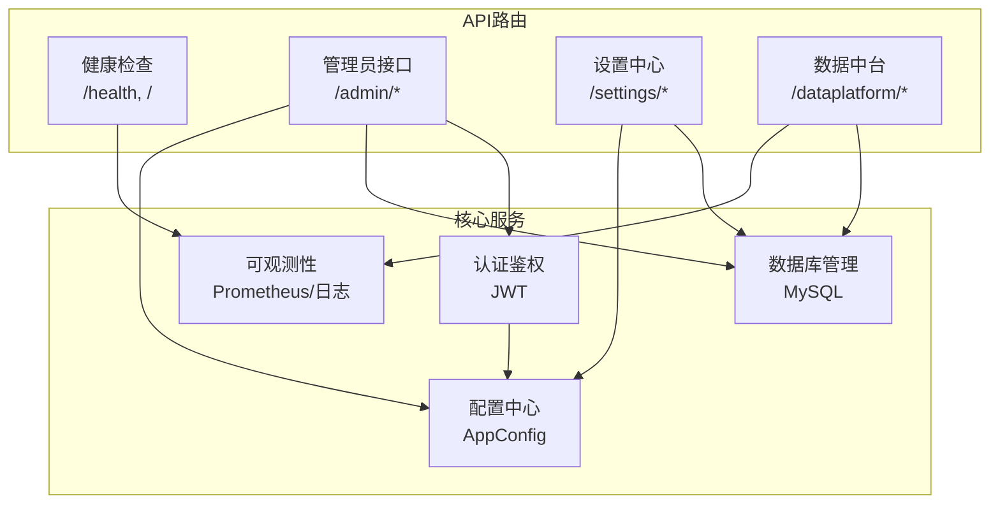
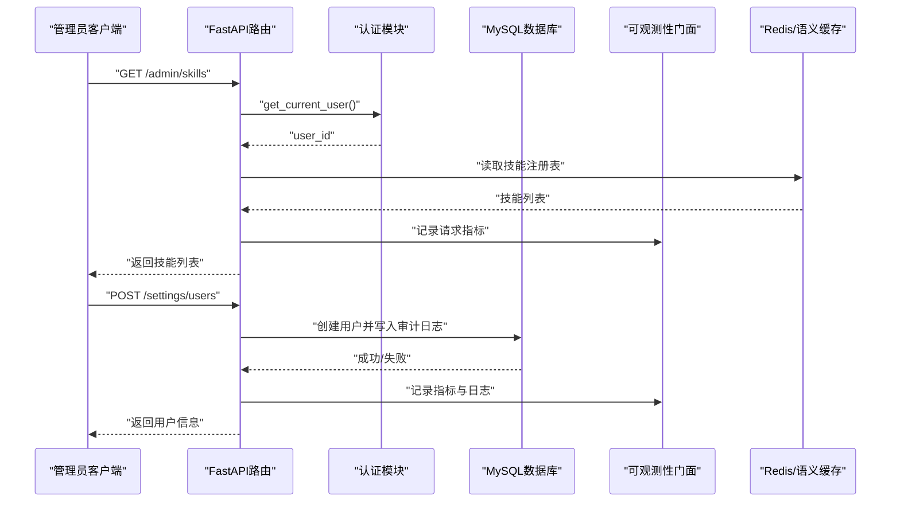
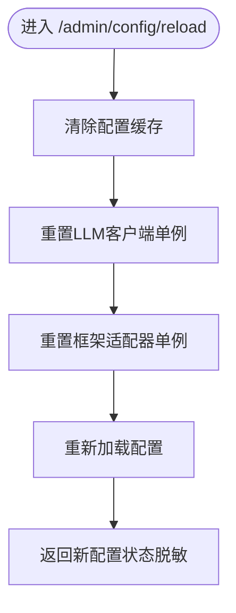
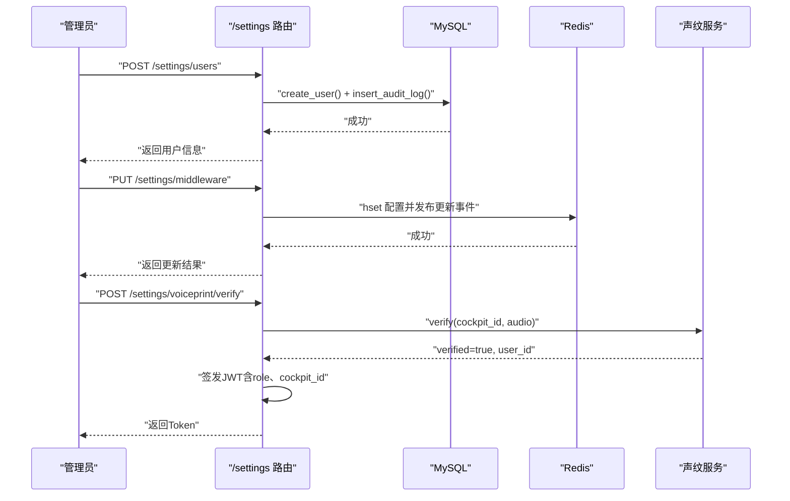
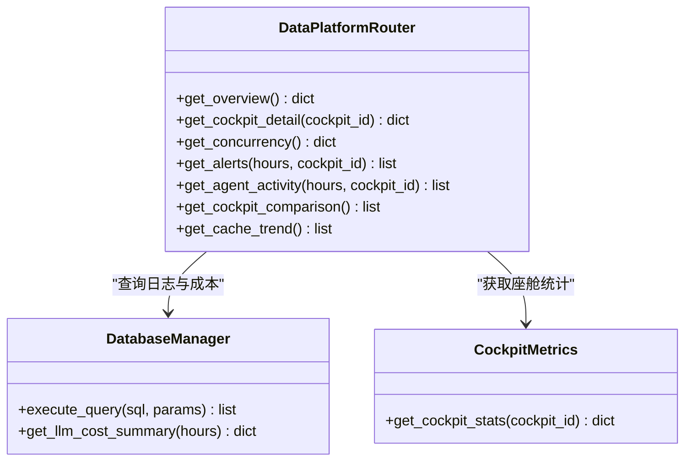
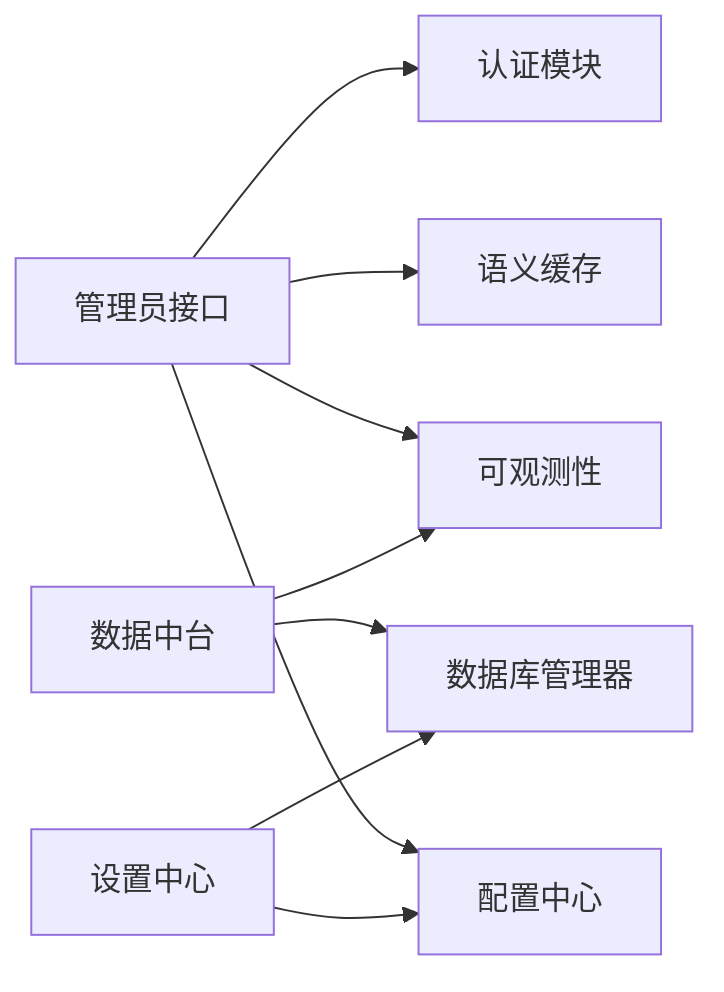

# 管理员API接口

<cite>
**本文引用的文件**   
- [admin.py](file://backend_design/nexus/api/routes/admin.py)
- [health.py](file://backend_design/nexus/api/routes/health.py)
- [settings.py](file://backend_design/nexus/api/routes/settings.py)
- [dataplatform.py](file://backend_design/nexus/api/routes/dataplatform.py)
- [auth.py](file://backend_design/nexus/core/auth.py)
- [metrics.py](file://backend_design/nexus/observability/metrics.py)
- [unified.py](file://backend_design/nexus/observability/unified.py)
- [logger.py](file://backend_design/nexus/core/logger.py)
- [db_manager.py](file://backend_design/nexus/core/db_manager.py)
- [__init__.py](file://backend_design/nexus/config/__init__.py)
</cite>

## 目录
1. [简介](#简介)
2. [项目结构](#项目结构)
3. [核心组件](#核心组件)
4. [架构总览](#架构总览)
5. [详细组件分析](#详细组件分析)
6. [依赖关系分析](#依赖关系分析)
7. [性能与可观测性](#性能与可观测性)
8. [故障排查指南](#故障排查指南)
9. [结论](#结论)
10. [附录：API参考与调用示例](#附录api参考与调用示例)

## 简介
本文件为 NexusCockpit 的管理员API接口文档，覆盖系统监控、用户管理、配置管理、日志查询等管理员专用能力。内容包含权限要求、操作审计、数据访问控制、健康检查、性能指标、告警与诊断工具使用方法，并提供完整的API调用示例、数据导出与批量操作指南，以及监控系统集成说明。

## 项目结构
后端采用 FastAPI 路由分层组织，管理员相关接口主要分布在以下模块：
- 健康检查与根路径：/health, /
- 管理员功能：技能列表、记忆查询、缓存统计/清空、会话列表、知识库上传/重建索引/统计、配置查看/热更新
- 设置中心：座舱CRUD、用户管理（持久化到MySQL）、中间件配置热更新、声纹注册/验证/删除
- 数据中台：全局概览、单座舱详情、并发统计、告警历史、Agent活动时间线、座舱对比、缓存趋势
- 认证与鉴权：JWT签发与校验、可选认证依赖
- 可观测性：Prometheus指标、统一门面、结构化日志
- 数据库：MySQL连接池、自动建表迁移、审计日志、LLM成本追踪、用户管理CRUD

**图表来源** 
- [health.py:26-108](file://backend_design/nexus/api/routes/health.py#L26-L108)
- [admin.py:22-272](file://backend_design/nexus/api/routes/admin.py#L22-L272)
- [settings.py:42-393](file://backend_design/nexus/api/routes/settings.py#L42-L393)
- [dataplatform.py:28-383](file://backend_design/nexus/api/routes/dataplatform.py#L28-L383)
- [auth.py:35-140](file://backend_design/nexus/core/auth.py#L35-L140)
- [metrics.py:15-108](file://backend_design/nexus/observability/metrics.py#L15-L108)
- [unified.py:78-269](file://backend_design/nexus/observability/unified.py#L78-L269)
- [db_manager.py:40-800](file://backend_design/nexus/core/db_manager.py#L40-L800)
- [__init__.py:84-167](file://backend_design/nexus/config/__init__.py#L84-L167)

**章节来源**
- [health.py:26-108](file://backend_design/nexus/api/routes/health.py#L26-L108)
- [admin.py:22-272](file://backend_design/nexus/api/routes/admin.py#L22-L272)
- [settings.py:42-393](file://backend_design/nexus/api/routes/settings.py#L42-L393)
- [dataplatform.py:28-383](file://backend_design/nexus/api/routes/dataplatform.py#L28-L383)
- [auth.py:35-140](file://backend_design/nexus/core/auth.py#L35-L140)
- [metrics.py:15-108](file://backend_design/nexus/observability/metrics.py#L15-L108)
- [unified.py:78-269](file://backend_design/nexus/observability/unified.py#L78-L269)
- [db_manager.py:40-800](file://backend_design/nexus/core/db_manager.py#L40-L800)
- [__init__.py:84-167](file://backend_design/nexus/config/__init__.py#L84-L167)

## 核心组件
- 认证与鉴权
  - JWT Token 签发与解码，支持额外声明（如角色、座舱ID、认证方式）
  - 强制认证依赖 get_current_user，可选认证依赖 get_optional_user
- 数据库管理
  - MySQL 连接池、自动建表与默认数据初始化
  - 审计日志、LLM成本追踪、用户CRUD、对话历史与统计
- 可观测性
  - Prometheus指标（请求、延迟、Agent、技能、缓存、RAG、LLM、活跃连接）
  - 统一门面 ObservabilityHub 提供日志、追踪、指标的统一入口
  - 结构化日志输出，敏感字段脱敏
- 配置中心
  - AppConfig聚合多子系统配置，支持热更新后重新加载

**章节来源**
- [auth.py:35-140](file://backend_design/nexus/core/auth.py#L35-L140)
- [db_manager.py:40-800](file://backend_design/nexus/core/db_manager.py#L40-L800)
- [metrics.py:15-108](file://backend_design/nexus/observability/metrics.py#L15-L108)
- [unified.py:78-269](file://backend_design/nexus/observability/unified.py#L78-L269)
- [logger.py:83-206](file://backend_design/nexus/core/logger.py#L83-L206)
- [__init__.py:84-167](file://backend_design/nexus/config/__init__.py#L84-L167)

## 架构总览
管理员端通过FastAPI暴露REST API，受JWT保护；业务逻辑调用数据库、Redis、向量库、图谱存储等外部服务；可观测性层统一采集指标与日志，便于监控与排障。

**图表来源** 
- [admin.py:22-31](file://backend_design/nexus/api/routes/admin.py#L22-L31)
- [auth.py:85-122](file://backend_design/nexus/core/auth.py#L85-L122)
- [settings.py:117-153](file://backend_design/nexus/api/routes/settings.py#L117-L153)
- [db_manager.py:743-781](file://backend_design/nexus/core/db_manager.py#L743-L781)
- [metrics.py:21-32](file://backend_design/nexus/observability/metrics.py#L21-L32)
- [unified.py:213-247](file://backend_design/nexus/observability/unified.py#L213-L247)

## 详细组件分析

### 健康检查与系统状态
- GET /health：检查各组件连接状态（Milvus、Neo4j、Redis、MySQL、OSS、Agent），返回整体健康状态与版本信息
- GET /：根路径，返回基本信息与文档入口

权限要求：无需认证（公开）
数据访问控制：仅读取组件状态，不修改任何数据
操作审计：不记录审计日志

**章节来源**
- [health.py:26-95](file://backend_design/nexus/api/routes/health.py#L26-L95)
- [health.py:98-108](file://backend_design/nexus/api/routes/health.py#L98-L108)

### 管理员接口（/admin）
- GET /admin/skills：列出所有可用技能
- GET /admin/memory/{user_id}：查询用户记忆（图谱记忆+用户画像）
- GET /admin/cache/stats：获取语义缓存统计（命中/未命中/命中率/大小）
- POST /admin/cache/clear：清空语义缓存
- GET /admin/sessions：列出活跃会话（优先Redis SessionStore，降级内存）
- POST /admin/kb/upload：上传文档到知识库（文本分块、向量化、入库）
- POST /admin/kb/reindex：重建知识库向量索引
- GET /admin/kb/stats：知识库容量/文档统计
- POST /admin/config/reload：配置热更新（清除配置缓存、重置LLM客户端与框架适配器）
- GET /admin/config：查看当前配置状态（敏感值脱敏）

权限要求：需要有效JWT（使用 get_current_user）
数据访问控制：只读为主，缓存清空与知识库上传需确认目标范围
操作审计：配置热更新与知识库操作建议记录审计日志（可在实现中扩展）

**图表来源** 
- [admin.py:172-221](file://backend_design/nexus/api/routes/admin.py#L172-L221)

**章节来源**
- [admin.py:22-272](file://backend_design/nexus/api/routes/admin.py#L22-L272)

### 设置中心（/settings）
- 座舱管理：CRUD（注册、更新、注销）
- 用户管理：列表、注册、删除、密码重置（持久化到MySQL）
- 中间件配置：获取与热更新（通过Redis Pub/Sub通知）
- 声纹管理：状态查询、注册、验证（成功后自动签发JWT）、删除

权限要求：用户管理与密码重置需管理员权限（建议在网关或中间件层进行RBAC校验）
数据访问控制：用户与座舱数据持久化至MySQL，审计日志记录关键操作
操作审计：用户注册、删除、密码重置均写入审计日志

**图表来源** 
- [settings.py:117-153](file://backend_design/nexus/api/routes/settings.py#L117-L153)
- [settings.py:231-272](file://backend_design/nexus/api/routes/settings.py#L231-L272)
- [settings.py:315-374](file://backend_design/nexus/api/routes/settings.py#L315-L374)
- [db_manager.py:743-781](file://backend_design/nexus/core/db_manager.py#L743-L781)

**章节来源**
- [settings.py:42-393](file://backend_design/nexus/api/routes/settings.py#L42-L393)
- [db_manager.py:743-781](file://backend_design/nexus/core/db_manager.py#L743-L781)

### 数据中台（/dataplatform）
- GET /dataplatform/overview：全局概览（聊天数、车控指令数、缓存命中率、平均延迟、告警数、并发、LLM成本）
- GET /dataplatform/cockpit/{cockpit_id}：单座舱详情（配置+统计）
- GET /dataplatform/concurrency：并发能力统计（当前并发、峰值、QPS、资源使用）
- GET /dataplatform/alerts：告警历史（从MySQL mainagent_logs查询）
- GET /dataplatform/agent/activity：Agent活动时间线（从MySQL subagent_logs查询）
- GET /dataplatform/comparison：座舱对比（健康评分、成功率、延迟等）
- GET /dataplatform/cache-trend：缓存趋势（按小时聚合最近24小时）

权限要求：无需认证（公开），生产环境建议限制访问IP或增加鉴权
数据访问控制：只读查询，涉及MySQL与Redis
操作审计：不直接记录审计日志，但可通过统一可观测性记录访问

**图表来源** 
- [dataplatform.py:28-383](file://backend_design/nexus/api/routes/dataplatform.py#L28-L383)
- [db_manager.py:622-682](file://backend_design/nexus/core/db_manager.py#L622-L682)

**章节来源**
- [dataplatform.py:28-383](file://backend_design/nexus/api/routes/dataplatform.py#L28-L383)

### 认证与鉴权
- create_access_token：签发JWT Access Token，支持过期时间与额外声明
- decode_token：解码并验证JWT，处理过期与无效错误
- get_current_user：FastAPI依赖，强制认证，返回user_id
- get_optional_user：可选认证，适用于非强制场景

权限模型：基于JWT中的role与cockpit_id进行访问控制（建议在网关层结合RBAC策略）

**章节来源**
- [auth.py:35-140](file://backend_design/nexus/core/auth.py#L35-L140)

### 可观测性与日志
- Prometheus指标：请求计数与延迟、Agent调用、技能执行、缓存命中/未命中、RAG检索、LLM调用、活跃连接
- 统一门面：ObservabilityHub提供日志、追踪、指标的统一入口，支持上下文绑定与自动清理
- 结构化日志：structlog JSON输出，敏感字段脱敏，支持上下文变量（request_id、user_id）

**章节来源**
- [metrics.py:15-108](file://backend_design/nexus/observability/metrics.py#L15-L108)
- [unified.py:78-269](file://backend_design/nexus/observability/unified.py#L78-L269)
- [logger.py:83-206](file://backend_design/nexus/core/logger.py#L83-L206)

### 数据库与审计
- MySQL连接池：异步连接池管理，自动建表与默认数据初始化
- 审计日志：记录关键操作（用户注册、删除、密码重置等）
- LLM成本追踪：记录token消耗与成本汇总
- 用户管理：CRUD操作，支持角色与座舱关联

**章节来源**
- [db_manager.py:40-800](file://backend_design/nexus/core/db_manager.py#L40-L800)

## 依赖关系分析
- API路由依赖认证模块进行鉴权
- 设置中心与数据中台依赖数据库管理器进行持久化查询
- 管理员接口依赖语义缓存与会话存储
- 可观测性模块被各层调用以记录指标与日志
- 配置中心为各模块提供统一配置访问

**图表来源** 
- [admin.py:22-272](file://backend_design/nexus/api/routes/admin.py#L22-L272)
- [settings.py:42-393](file://backend_design/nexus/api/routes/settings.py#L42-L393)
- [dataplatform.py:28-383](file://backend_design/nexus/api/routes/dataplatform.py#L28-L383)
- [auth.py:35-140](file://backend_design/nexus/core/auth.py#L35-L140)
- [db_manager.py:40-800](file://backend_design/nexus/core/db_manager.py#L40-L800)
- [metrics.py:15-108](file://backend_design/nexus/observability/metrics.py#L15-L108)
- [__init__.py:84-167](file://backend_design/nexus/config/__init__.py#L84-L167)

**章节来源**
- [admin.py:22-272](file://backend_design/nexus/api/routes/admin.py#L22-L272)
- [settings.py:42-393](file://backend_design/nexus/api/routes/settings.py#L42-L393)
- [dataplatform.py:28-383](file://backend_design/nexus/api/routes/dataplatform.py#L28-L383)
- [auth.py:35-140](file://backend_design/nexus/core/auth.py#L35-L140)
- [db_manager.py:40-800](file://backend_design/nexus/core/db_manager.py#L40-L800)
- [metrics.py:15-108](file://backend_design/nexus/observability/metrics.py#L15-L108)
- [__init__.py:84-167](file://backend_design/nexus/config/__init__.py#L84-L167)

## 性能与可观测性
- 性能指标：通过Prometheus暴露请求计数、延迟直方图、Agent与技能执行计数、缓存命中率、RAG与LLM调用延迟
- 监控集成：Prometheus抓取 /metrics 端点，Grafana可视化
- 日志采集：结构化JSON日志输出，便于ELK/Loki采集与分析
- 告警机制：基于MySQL中的mainagent_logs与subagent_logs进行告警历史查询与阈值告警

**章节来源**
- [metrics.py:15-108](file://backend_design/nexus/observability/metrics.py#L15-L108)
- [dataplatform.py:99-147](file://backend_design/nexus/api/routes/dataplatform.py#L99-L147)
- [logger.py:83-206](file://backend_design/nexus/core/logger.py#L83-L206)

## 故障排查指南
- 健康检查：调用 /health 检查各组件连接状态，定位异常服务
- 日志查询：通过结构化日志文件与Loki/ELK搜索错误与警告
- 数据库问题：检查MySQL连接池状态与自动迁移是否成功
- 缓存问题：查看语义缓存统计与Redis连接状态
- 配置问题：使用 /admin/config 查看当前配置，必要时执行 /admin/config/reload 热更新

**章节来源**
- [health.py:26-95](file://backend_design/nexus/api/routes/health.py#L26-L95)
- [admin.py:224-272](file://backend_design/nexus/api/routes/admin.py#L224-L272)
- [db_manager.py:40-104](file://backend_design/nexus/core/db_manager.py#L40-L104)

## 结论
NexusCockpit的管理员API提供了全面的系统监控、用户管理、配置管理与日志查询能力。通过JWT鉴权、审计日志、可观测性集成与数据库持久化，确保了系统的安全性、可维护性与可扩展性。建议在生产环境中加强访问控制与监控告警，以提升运维效率与系统稳定性。

## 附录：API参考与调用示例

### 健康检查
- GET /health
- 权限：无需认证
- 示例：curl -X GET http://localhost:8000/health

**章节来源**
- [health.py:26-95](file://backend_design/nexus/api/routes/health.py#L26-L95)

### 管理员接口
- GET /admin/skills
- GET /admin/memory/{user_id}
- GET /admin/cache/stats
- POST /admin/cache/clear
- GET /admin/sessions
- POST /admin/kb/upload (multipart/form-data: file, category)
- POST /admin/kb/reindex
- GET /admin/kb/stats
- POST /admin/config/reload
- GET /admin/config
- 权限：需要JWT（Authorization: Bearer <token>）
- 示例：curl -X GET http://localhost:8000/admin/skills -H "Authorization: Bearer <token>"

**章节来源**
- [admin.py:22-272](file://backend_design/nexus/api/routes/admin.py#L22-L272)

### 设置中心
- GET /settings/cockpits
- POST /settings/cockpits
- PUT /settings/cockpits/{cockpit_id}
- DELETE /settings/cockpits/{cockpit_id}
- GET /settings/users
- POST /settings/users
- DELETE /settings/users/{user_id}
- PUT /settings/users/{user_id}/password
- GET /settings/middleware
- PUT /settings/middleware
- GET /settings/voiceprint/status
- POST /settings/voiceprint/enroll (multipart/form-data: cockpit_id, user_id, audio)
- POST /settings/voiceprint/verify (multipart/form-data: cockpit_id, audio)
- DELETE /settings/voiceprint/{user_id}
- 权限：用户管理与密码重置需管理员权限（建议网关层RBAC）
- 示例：curl -X POST http://localhost:8000/settings/users -H "Content-Type: application/json" -d '{"user_id":"user_001","username":"test","role":"cockpit_user"}'

**章节来源**
- [settings.py:42-393](file://backend_design/nexus/api/routes/settings.py#L42-L393)

### 数据中台
- GET /dataplatform/overview
- GET /dataplatform/cockpit/{cockpit_id}
- GET /dataplatform/concurrency
- GET /dataplatform/alerts?hours=24&cockpit_id=cockpit-01
- GET /dataplatform/agent/activity?hours=24&cockpit_id=cockpit-01
- GET /dataplatform/comparison
- GET /dataplatform/cache-trend
- 权限：无需认证（生产环境建议限制访问）
- 示例：curl -X GET "http://localhost:8000/dataplatform/alerts?hours=24"

**章节来源**
- [dataplatform.py:28-383](file://backend_design/nexus/api/routes/dataplatform.py#L28-L383)

### 认证与鉴权
- POST /auth/token（假设存在，用于获取JWT）
- 使用JWT访问受保护接口：Authorization: Bearer <token>
- 示例：curl -X POST http://localhost:8000/auth/token -H "Content-Type: application/json" -d '{"username":"admin","password":"secret"}'

**章节来源**
- [auth.py:35-140](file://backend_design/nexus/core/auth.py#L35-L140)

### 可观测性
- GET /metrics（Prometheus指标）
- 结构化日志文件：logs/backend_logs/*.log
- 示例：curl -X GET http://localhost:8000/metrics

**章节来源**
- [metrics.py:15-108](file://backend_design/nexus/observability/metrics.py#L15-L108)
- [logger.py:83-206](file://backend_design/nexus/core/logger.py#L83-L206)