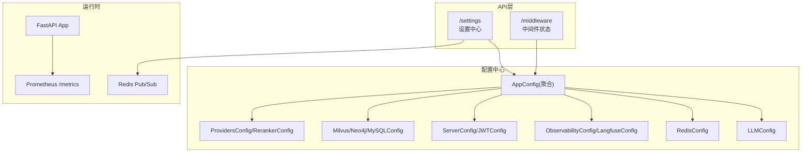
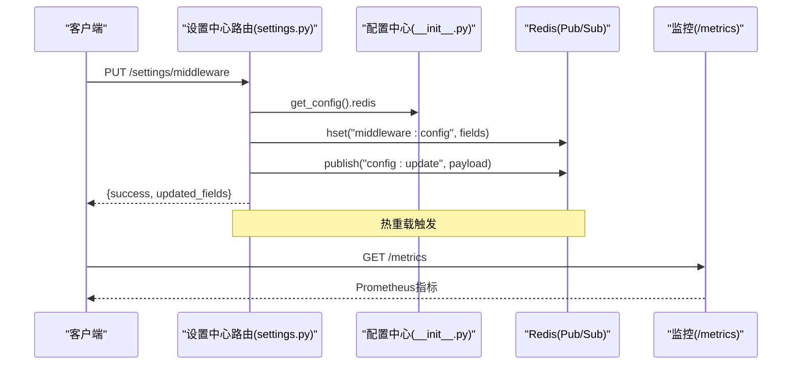
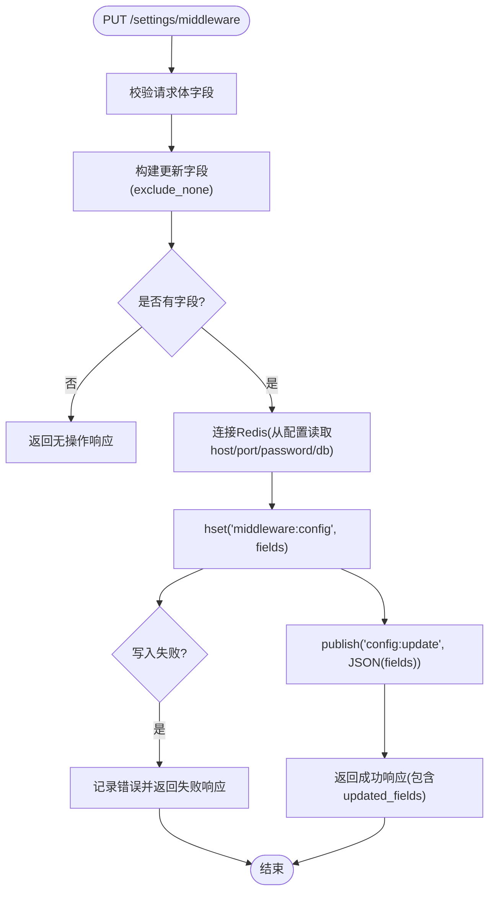
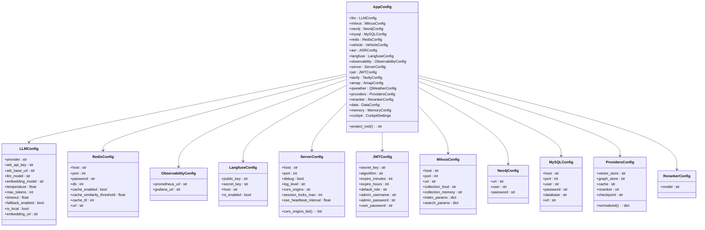
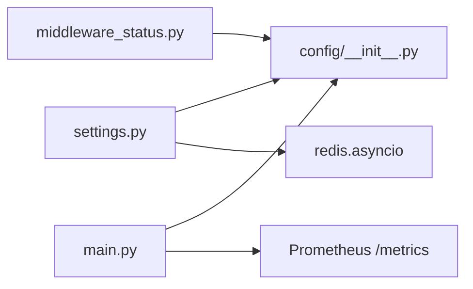

# 系统设置API

<cite>
**本文引用的文件**   
- [backend_design/nexus/api/routes/settings.py](file://backend_design/nexus/api/routes/settings.py)
- [backend_design/nexus/config/__init__.py](file://backend_design/nexus/config/__init__.py)
- [backend_design/nexus/config/_common.py](file://backend_design/nexus/config/_common.py)
- [backend_design/nexus/config/llm.py](file://backend_design/nexus/config/llm.py)
- [backend_design/nexus/config/cache.py](file://backend_design/nexus/config/cache.py)
- [backend_design/nexus/config/observability.py](file://backend_design/nexus/config/observability.py)
- [backend_design/nexus/config/server.py](file://backend_design/nexus/config/server.py)
- [backend_design/nexus/config/database.py](file://backend_design/nexus/config/database.py)
- [backend_design/nexus/config/providers.py](file://backend_design/nexus/config/providers.py)
- [backend_design/nexus/models/cockpit.py](file://backend_design/nexus/models/cockpit.py)
- [backend_design/nexus/main.py](file://backend_design/nexus/main.py)
- [backend_design/nexus/api/routes/middleware_status.py](file://backend_design/nexus/api/routes/middleware_status.py)
</cite>

## 目录
1. [简介](#简介)
2. [项目结构](#项目结构)
3. [核心组件](#核心组件)
4. [架构总览](#架构总览)
5. [详细组件分析](#详细组件分析)
6. [依赖关系分析](#依赖关系分析)
7. [性能考虑](#性能考虑)
8. [故障排查指南](#故障排查指南)
9. [结论](#结论)
10. [附录](#附录)

## 简介
本文件为 NexusCockpit 的“系统设置API”提供完整文档，覆盖 LLM 配置、RAG 设置、中间件参数、监控配置等系统级配置的管理接口。重点说明：
- 动态更新机制与热重载流程（基于 Redis Pub/Sub）
- 配置验证规则与环境变量映射
- 配置文件格式、默认值管理与继承关系
- 完整的配置管理示例、迁移建议与版本兼容性说明
- 与配置中心集成的最佳实践

## 项目结构
系统设置相关代码主要分布在以下位置：
- API 路由：settings.py（/settings 前缀）、middleware_status.py（/middleware 状态查询）
- 配置中心：config/*（按子系统拆分，统一入口 __init__.py）
- 模型定义：models/cockpit.py（中间件配置更新请求体等）
- 应用启动：main.py（生命周期初始化、指标挂载、异常处理）

图表来源
- [backend_design/nexus/api/routes/settings.py:1-393](file://backend_design/nexus/api/routes/settings.py#L1-L393)
- [backend_design/nexus/config/__init__.py:84-167](file://backend_design/nexus/config/__init__.py#L84-L167)
- [backend_design/nexus/api/routes/middleware_status.py:29-42](file://backend_design/nexus/api/routes/middleware_status.py#L29-L42)
- [backend_design/nexus/main.py:486-488](file://backend_design/nexus/main.py#L486-L488)

章节来源
- [backend_design/nexus/api/routes/settings.py:1-393](file://backend_design/nexus/api/routes/settings.py#L1-L393)
- [backend_design/nexus/config/__init__.py:84-167](file://backend_design/nexus/config/__init__.py#L84-L167)
- [backend_design/nexus/api/routes/middleware_status.py:29-42](file://backend_design/nexus/api/routes/middleware_status.py#L29-L42)
- [backend_design/nexus/main.py:486-488](file://backend_design/nexus/main.py#L486-L488)

## 核心组件
- 设置中心路由（/settings）
  - 座舱管理 CRUD
  - 用户管理（持久化到 MySQL）
  - 中间件配置（热更新）
  - 声纹管理（注册/验证/删除）
- 配置中心（nexus.config）
  - AppConfig 聚合所有子系统配置
  - 各子配置类独立管理环境变量前缀与 .env 加载
- 中间件状态（/middleware）
  - 查询 Redis/Milvus/Neo4j/MySQL/ASR/TTS/LLM 运行状态
- 应用启动（main.py）
  - 生命周期内初始化各组件、挂载 /metrics、全局异常处理

章节来源
- [backend_design/nexus/api/routes/settings.py:1-393](file://backend_design/nexus/api/routes/settings.py#L1-L393)
- [backend_design/nexus/config/__init__.py:84-167](file://backend_design/nexus/config/__init__.py#L84-L167)
- [backend_design/nexus/api/routes/middleware_status.py:29-42](file://backend_design/nexus/api/routes/middleware_status.py#L29-L42)
- [backend_design/nexus/main.py:75-101](file://backend_design/nexus/main.py#L75-L101)

## 架构总览
系统设置API通过 FastAPI 暴露 REST 接口，读取并更新运行时配置；中间件配置变更通过 Redis Pub/Sub 通知订阅者实现热重载。可观测性通过 Prometheus /metrics 暴露指标。

图表来源
- [backend_design/nexus/api/routes/settings.py:231-273](file://backend_design/nexus/api/routes/settings.py#L231-L273)
- [backend_design/nexus/config/__init__.py:144-167](file://backend_design/nexus/config/__init__.py#L144-L167)
- [backend_design/nexus/main.py:486-488](file://backend_design/nexus/main.py#L486-L488)

## 详细组件分析

### 设置中心路由（/settings）
- 座舱管理
  - GET /settings/cockpits：列出所有座舱（含活跃计数）
  - POST /settings/cockpits：注册新座舱
  - PUT /settings/cockpits/{id}：更新座舱配置
  - DELETE /settings/cockpits/{id}：注销座舱（软删除）
- 用户管理
  - GET /settings/users：列出用户（数据库不可用时降级为空列表）
  - POST /settings/users：注册用户（校验唯一性、密码哈希、审计日志）
  - DELETE /settings/users/{user_id}：删除用户（审计日志）
  - PUT /settings/users/{user_id}/password：管理员重置密码（长度校验、哈希、审计日志）
- 中间件配置（热更新）
  - GET /settings/middleware：获取当前中间件配置（如缓存相似度阈值、限流QPS）
  - PUT /settings/middleware：更新中间件配置（写入 Redis Hash + 发布配置变更事件）
- 声纹管理
  - GET /settings/voiceprint/status：获取声纹状态（可按座舱或全部）
  - POST /settings/voiceprint/enroll：声纹注册（失败返回503）
  - POST /settings/voiceprint/verify：声纹验证（成功自动签发JWT）
  - DELETE /settings/voiceprint/{user_id}：删除声纹（支持跨座舱）

图表来源
- [backend_design/nexus/api/routes/settings.py:231-273](file://backend_design/nexus/api/routes/settings.py#L231-L273)

章节来源
- [backend_design/nexus/api/routes/settings.py:42-90](file://backend_design/nexus/api/routes/settings.py#L42-L90)
- [backend_design/nexus/api/routes/settings.py:96-214](file://backend_design/nexus/api/routes/settings.py#L96-L214)
- [backend_design/nexus/api/routes/settings.py:220-273](file://backend_design/nexus/api/routes/settings.py#L220-L273)
- [backend_design/nexus/api/routes/settings.py:279-393](file://backend_design/nexus/api/routes/settings.py#L279-L393)

### 配置中心（nexus.config）
- AppConfig（聚合）
  - 聚合 LLM、数据库、缓存、车控、语音、可观测性、服务器+认证、第三方服务、部署模式、数据目录+记忆、多座舱等配置
  - 提供 get_config() 单例与快捷访问函数
- 环境文件加载策略
  - 优先加载 .env.local（覆盖 .env），确保敏感信息不提交
  - _resolve_path() 将相对路径解析为项目根绝对路径
- 子配置类
  - LLMConfig：provider、API Key、Base URL、模型、Embedding、温度、并发限制、本地回退等
  - RedisConfig：连接参数、语义缓存开关与阈值、TTL
  - ObservabilityConfig/LangfuseConfig：Langfuse 追踪、Prometheus/Grafana 地址
  - ServerConfig/JWTConfig：监听地址/端口、调试、CORS、SSE心跳、JWT密钥与过期时间、RBAC默认角色
  - Milvus/Neo4j/MySQLConfig：向量库、图谱库、关系型数据库连接参数
  - ProvidersConfig/RerankerConfig：部署模式开关与重排模型

图表来源
- [backend_design/nexus/config/__init__.py:84-167](file://backend_design/nexus/config/__init__.py#L84-L167)
- [backend_design/nexus/config/llm.py:15-72](file://backend_design/nexus/config/llm.py#L15-L72)
- [backend_design/nexus/config/cache.py:15-41](file://backend_design/nexus/config/cache.py#L15-L41)
- [backend_design/nexus/config/observability.py:15-47](file://backend_design/nexus/config/observability.py#L15-L47)
- [backend_design/nexus/config/server.py:15-61](file://backend_design/nexus/config/server.py#L15-L61)
- [backend_design/nexus/config/database.py:15-61](file://backend_design/nexus/config/database.py#L15-L61)
- [backend_design/nexus/config/providers.py:15-47](file://backend_design/nexus/config/providers.py#L15-47)

章节来源
- [backend_design/nexus/config/__init__.py:84-167](file://backend_design/nexus/config/__init__.py#L84-L167)
- [backend_design/nexus/config/_common.py:39-53](file://backend_design/nexus/config/_common.py#L39-L53)
- [backend_design/nexus/config/llm.py:15-72](file://backend_design/nexus/config/llm.py#L15-L72)
- [backend_design/nexus/config/cache.py:15-41](file://backend_design/nexus/config/cache.py#L15-L41)
- [backend_design/nexus/config/observability.py:15-47](file://backend_design/nexus/config/observability.py#L15-L47)
- [backend_design/nexus/config/server.py:15-61](file://backend_design/nexus/config/server.py#L15-L61)
- [backend_design/nexus/config/database.py:15-61](file://backend_design/nexus/config/database.py#L15-L61)
- [backend_design/nexus/config/providers.py:15-47](file://backend_design/nexus/config/providers.py#L15-47)

### 中间件状态（/middleware）
- GET /middleware：汇总 ASR/TTS/Milvus/Neo4j/MySQL/Redis/LLM/App 状态
- GET /middleware/redis、/milvus、/neo4j、/mysql：单项状态查询
- 内部实现通过配置中心读取连接参数，尝试连接并返回状态与元信息

章节来源
- [backend_design/nexus/api/routes/middleware_status.py:29-42](file://backend_design/nexus/api/routes/middleware_status.py#L29-L42)
- [backend_design/nexus/api/routes/middleware_status.py:75-194](file://backend_design/nexus/api/routes/middleware_status.py#L75-L194)

### 应用启动与生命周期（main.py）
- lifespan：启动时初始化日志、指标、LLM客户端、配置缓存、嵌入服务、向量/图谱存储、车控适配器、语义缓存、限流器、会话存储、Langfuse、Agent工作流、任务池、MySQL、座舱管理器、数据保留策略、llama.cpp子进程、MCP Server、提醒扫描器等
- create_app：创建 FastAPI 实例、注册路由、挂载 /metrics、静态资源、全局异常处理器、上下文中间件

章节来源
- [backend_design/nexus/main.py:75-101](file://backend_design/nexus/main.py#L75-L101)
- [backend_design/nexus/main.py:436-488](file://backend_design/nexus/main.py#L436-L488)
- [backend_design/nexus/main.py:503-596](file://backend_design/nexus/main.py#L503-L596)

## 依赖关系分析
- settings.py 依赖 nexus.config.get_config() 读取 Redis 配置，并通过 redis.asyncio 写入配置与发布事件
- middleware_status.py 依赖 nexus.config.get_config() 读取各组件配置进行健康检查
- main.py 在启动阶段初始化各组件并挂载 /metrics 端点

图表来源
- [backend_design/nexus/api/routes/settings.py:231-273](file://backend_design/nexus/api/routes/settings.py#L231-L273)
- [backend_design/nexus/api/routes/middleware_status.py:75-194](file://backend_design/nexus/api/routes/middleware_status.py#L75-L194)
- [backend_design/nexus/main.py:486-488](file://backend_design/nexus/main.py#L486-L488)

章节来源
- [backend_design/nexus/api/routes/settings.py:231-273](file://backend_design/nexus/api/routes/settings.py#L231-L273)
- [backend_design/nexus/api/routes/middleware_status.py:75-194](file://backend_design/nexus/api/routes/middleware_status.py#L75-L194)
- [backend_design/nexus/main.py:486-488](file://backend_design/nexus/main.py#L486-L488)

## 性能考虑
- 热更新路径使用 Redis Hash 与 Pub/Sub，避免重启服务即可生效
- 启动阶段异步预加载大模型（ASR/TTS）以减少首次请求延迟
- 指标采集通过 Prometheus 中间件统计请求数与延迟，排除 /metrics 自引用
- 数据库连接失败不阻塞启动，采用降级策略保证可用性

[本节为通用指导，无需特定文件引用]

## 故障排查指南
- 中间件配置热更新失败
  - 检查 Redis 连接参数是否正确（host/port/password/db）
  - 确认 Redis 服务可用且权限允许 hset/publish
  - 查看日志中的错误信息与返回消息
- 用户管理接口返回503
  - 检查 MySQL 是否可用（get_db_manager.is_connected）
- 声纹注册/验证失败
  - 注册失败返回503，前端应走 catch 分支重试或提示
  - 验证成功后自动签发JWT，若失败会记录 jwt_error
- 指标未上报
  - 确认 /metrics 已挂载且未被拦截
  - 检查 Prometheus 抓取配置

章节来源
- [backend_design/nexus/api/routes/settings.py:231-273](file://backend_design/nexus/api/routes/settings.py#L231-L273)
- [backend_design/nexus/api/routes/settings.py:117-154](file://backend_design/nexus/api/routes/settings.py#L117-L154)
- [backend_design/nexus/api/routes/settings.py:293-374](file://backend_design/nexus/api/routes/settings.py#L293-L374)
- [backend_design/nexus/main.py:486-488](file://backend_design/nexus/main.py#L486-L488)

## 结论
NexusCockpit 的系统设置API以模块化配置中心为核心，结合 Redis Pub/Sub 实现中间件参数的热重载，配合 Prometheus 提供可观测性。通过清晰的 Pydantic 模型与环境变量映射，保障配置的强类型校验与易维护性。生产环境建议结合外部配置中心（如 Consul/Nacos/Apollo）统一管理，并通过网关或配置推送机制实现更可靠的动态更新。

[本节为总结性内容，无需特定文件引用]

## 附录

### 环境变量映射与默认值
- LLM 配置（LLMConfig）
  - LLM_PROVIDER、ARK_API_KEY、ARK_BASE_URL、LLM_MODEL、EMBEDDING_MODEL、EMBEDDING_DIM、REFLECTION_ENABLED、MEMORY_EXTRACTION_ENABLED、LLM_CONCURRENCY_LIMIT
  - 本地回退：LLM_FALLBACK_ENABLED、LLM_FALLBACK_BASE_URL、LLM_FALLBACK_MODEL、LLM_FALLBACK_API_KEY、LLM_FALLBACK_TIMEOUT
  - 其他：MEITUAN_DEV_TOKEN、DEGRADATION_NOTIFY_USER、DEGRADATION_NOTIFY_ADMIN
- Redis 配置（RedisConfig）
  - REDIS_HOST、REDIS_PORT、REDIS_PASSWORD、REDIS_DB
  - SEMANTIC_CACHE_ENABLED、SEMANTIC_CACHE_SIMILARITY_THRESHOLD、SEMANTIC_CACHE_TTL_SECONDS
- 可观测性（ObservabilityConfig/LangfuseConfig）
  - PROMETHEUS_URL、GRAFANA_URL
  - LANGFUSE_PUBLIC_KEY、LANGFUSE_SECRET_KEY、LANGFUSE_HOST、LANGFUSE_DB_PASSWORD、LANGFUSE_NEXTAUTH_SECRET、LANGFUSE_SALT
- 服务器与认证（ServerConfig/JWTConfig）
  - HOST、PORT、DEBUG、LOG_LEVEL、CORS_ORIGINS、SESSION_LOCKS_MAX、SSE_HEARTBEAT_INTERVAL
  - JWT_SECRET_KEY、JWT_ALGORITHM、JWT_EXPIRE_MINUTES、JWT_EXPIRE_HOURS
  - RBAC_DEFAULT_ROLE、RBAC_ADMIN_USERNAME、RBAC_ADMIN_PASSWORD、RBAC_USER_PASSWORD
- 数据库（Milvus/Neo4j/MySQLConfig）
  - MILVUS_HOST、MILVUS_PORT、MILVUS_URI、MILVUS_COLLECTION_FOOD、MILVUS_COLLECTION_MEMORY
  - NEO4J_URI、NEO4J_USER、NEO4J_PASSWORD
  - MYSQL_HOST、MYSQL_PORT、MYSQL_USER、MYSQL_PASSWORD、MYSQL_DATABASE
- 部署模式（ProvidersConfig/RerankerConfig）
  - VECTOR_STORE_PROVIDER、GRAPH_STORE_PROVIDER、CACHE_PROVIDER、RERANKER_PROVIDER、CHECKPOINT_PROVIDER
  - RERANK_MODEL

章节来源
- [backend_design/nexus/config/llm.py:15-72](file://backend_design/nexus/config/llm.py#L15-L72)
- [backend_design/nexus/config/cache.py:15-41](file://backend_design/nexus/config/cache.py#L15-L41)
- [backend_design/nexus/config/observability.py:15-47](file://backend_design/nexus/config/observability.py#L15-L47)
- [backend_design/nexus/config/server.py:15-61](file://backend_design/nexus/config/server.py#L15-L61)
- [backend_design/nexus/config/database.py:15-61](file://backend_design/nexus/config/database.py#L15-L61)
- [backend_design/nexus/config/providers.py:15-47](file://backend_design/nexus/config/providers.py#L15-47)

### 配置文件格式与加载顺序
- 优先级：.env.local > .env（若存在）
- 使用 dotenv 加载并覆盖环境变量，确保敏感信息不被默认配置覆盖
- 路径解析：_resolve_path() 将相对路径转换为项目根绝对路径

章节来源
- [backend_design/nexus/config/_common.py:39-53](file://backend_design/nexus/config/_common.py#L39-L53)
- [backend_design/nexus/config/_common.py:56-75](file://backend_design/nexus/config/_common.py#L56-L75)

### 配置验证规则
- Pydantic BaseSettings 自动校验类型与必填项
- 自定义 computed_field 与 model_post_init 实现派生字段与条件逻辑（如 LLM 本地模式切换）
- 中间件配置更新仅接受非空字段（exclude_none=True）

章节来源
- [backend_design/nexus/config/llm.py:53-72](file://backend_design/nexus/config/llm.py#L53-L72)
- [backend_design/nexus/api/routes/settings.py:231-273](file://backend_design/nexus/api/routes/settings.py#L231-L273)

### 动态更新机制与热重载
- 中间件配置更新流程：
  - 接收 PUT /settings/middleware
  - 将更新字段写入 Redis Hash（key: middleware:config）
  - 发布 config:update 事件，订阅者收到后重新加载配置
- 注意：当前实现仅更新 Redis 中的中间件配置，未直接修改 AppConfig 内存对象；如需立即生效，需重启服务或实现配置热加载监听器

章节来源
- [backend_design/nexus/api/routes/settings.py:231-273](file://backend_design/nexus/api/routes/settings.py#L231-L273)

### 配置管理示例
- 获取中间件配置
  - GET /settings/middleware
  - 响应包含 cache_similarity_threshold、rate_limit_qps 等
- 更新中间件配置
  - PUT /settings/middleware
  - 请求体示例：{"cache_similarity_threshold": 0.95, "rate_limit_qps": 200}
  - 响应包含 success、updated_fields、message
- 查看中间件状态
  - GET /middleware
  - 返回各组件状态与元信息

章节来源
- [backend_design/nexus/api/routes/settings.py:220-273](file://backend_design/nexus/api/routes/settings.py#L220-L273)
- [backend_design/nexus/api/routes/middleware_status.py:29-42](file://backend_design/nexus/api/routes/middleware_status.py#L29-L42)

### 配置迁移工具与版本兼容性
- 迁移建议：
  - 新增配置项时，保持向后兼容（默认值合理）
  - 废弃字段标记为可选，并在日志中输出弃用警告
  - 提供脚本批量更新 .env 或配置中心键值
- 版本兼容性：
  - 主版本号变更时，检查环境变量命名约定是否变化
  - 次版本号变更时，确保新增字段不影响旧客户端

[本节为通用指导，无需特定文件引用]

### 与配置中心集成的最佳实践
- 使用外部配置中心（Consul/Nacos/Apollo）集中管理环境变量
- 通过配置推送机制（长轮询/WebSocket）实现实时热更新
- 在应用启动时拉取最新配置，并定期刷新缓存
- 对敏感信息（API Key、密码）进行加密存储与访问控制
- 结合审计日志记录配置变更历史

[本节为通用指导，无需特定文件引用]