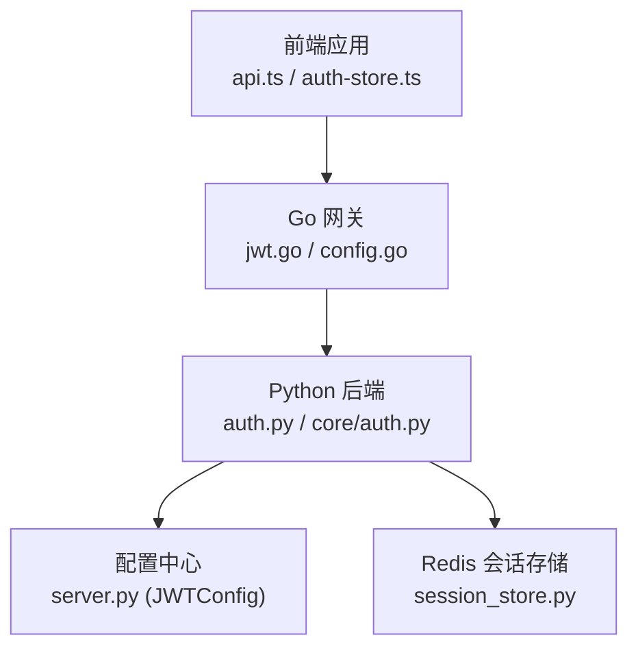
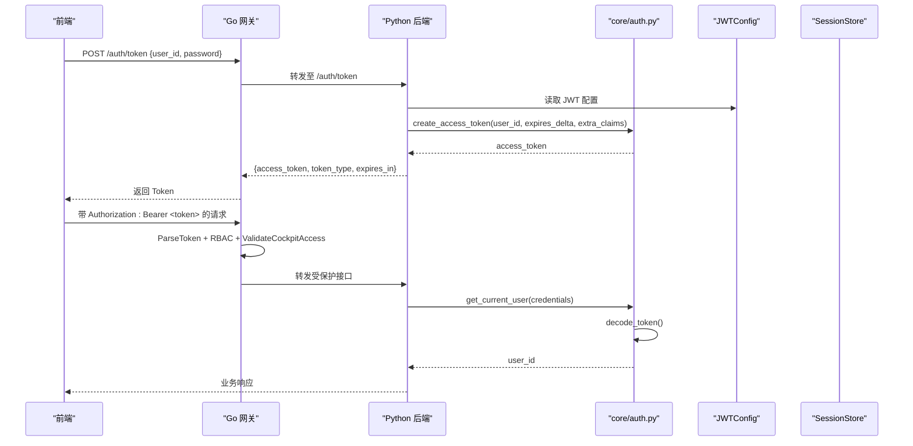
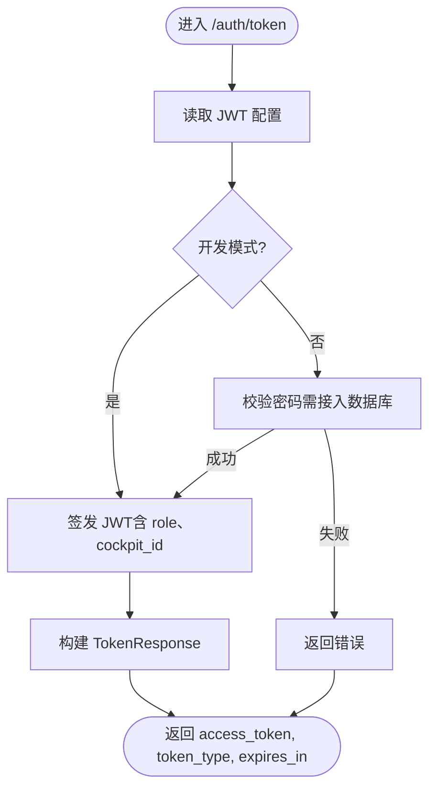
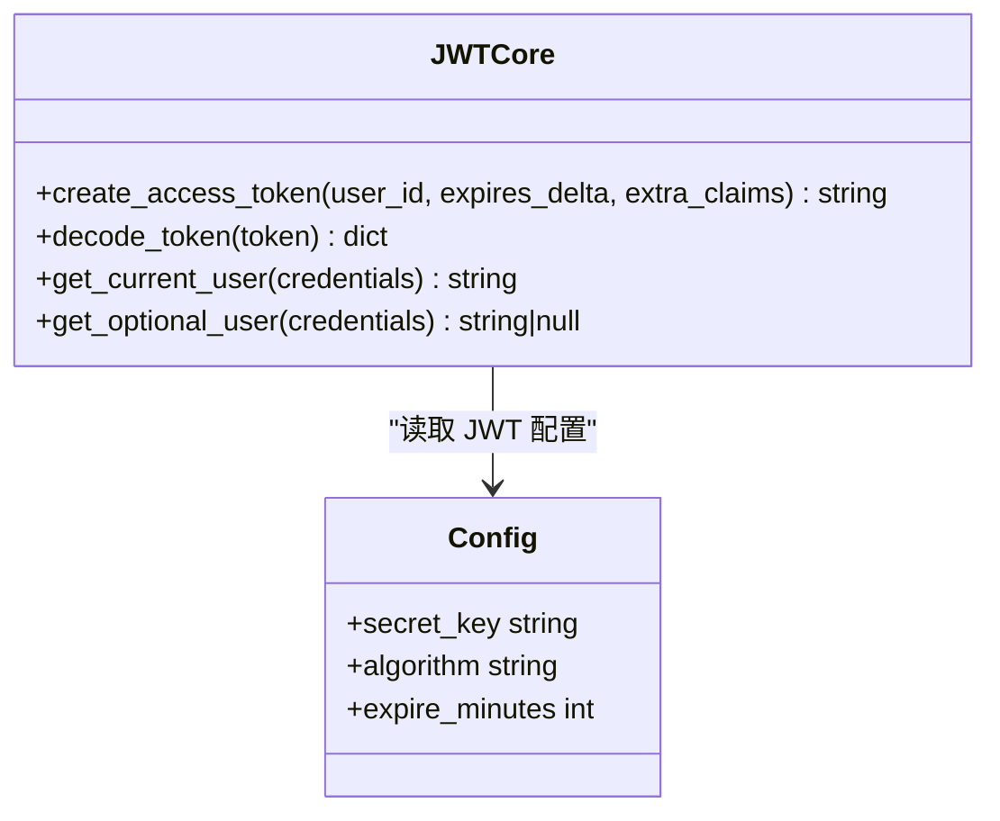
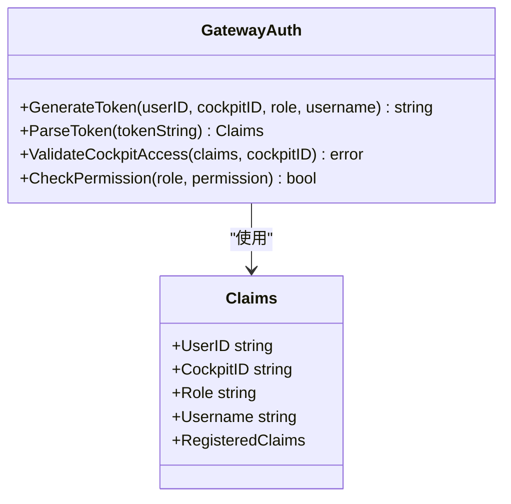
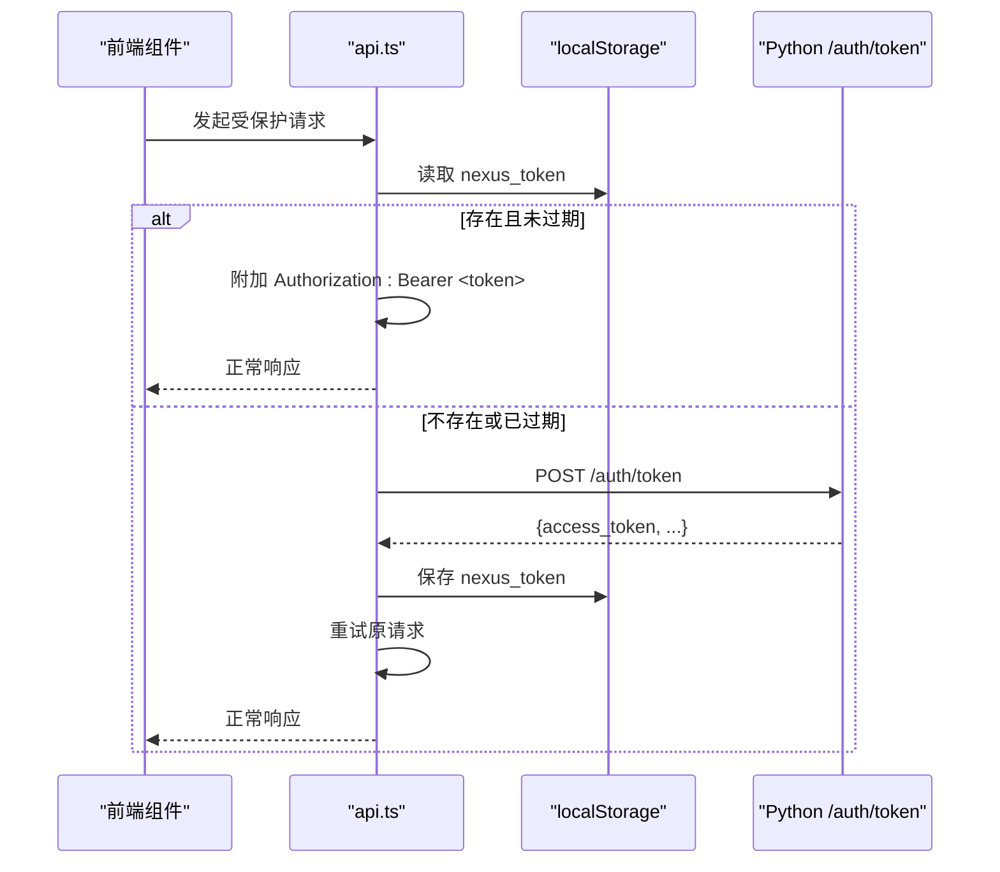
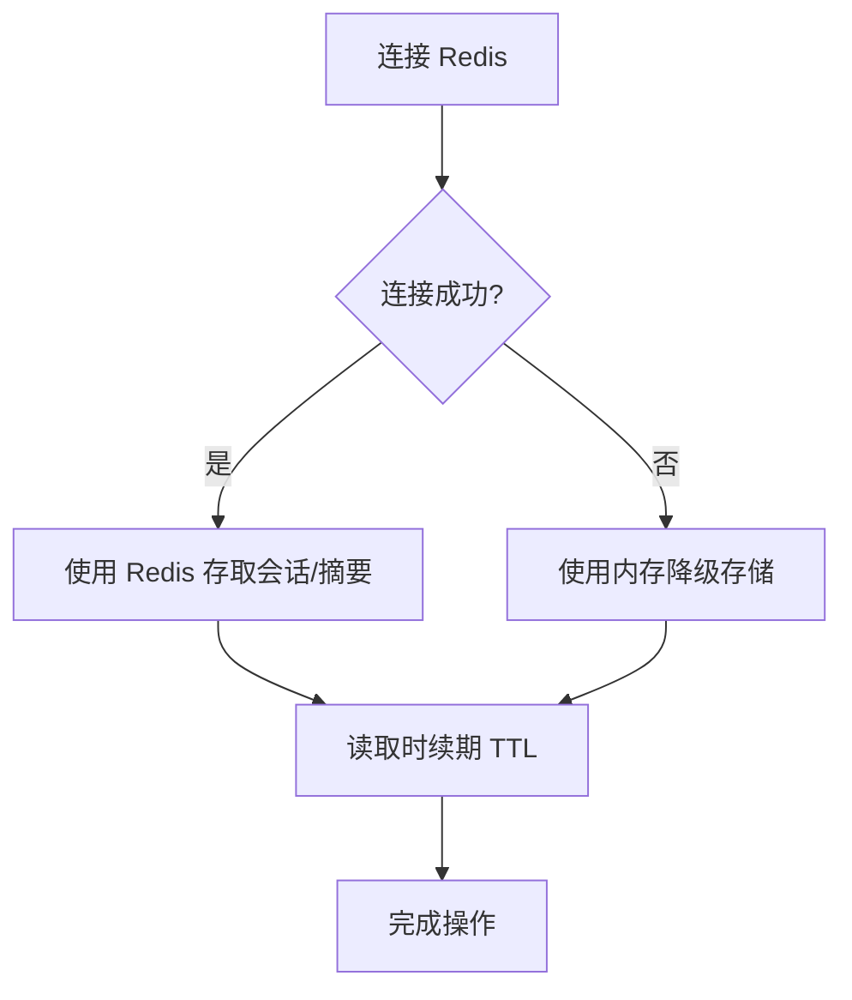
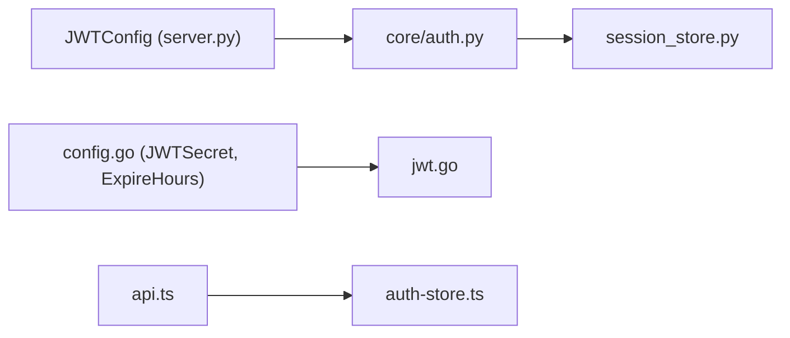

# 认证API接口

<cite>
**本文引用的文件**   
- [backend_design/nexus/api/routes/auth.py](file://backend_design/nexus/api/routes/auth.py)
- [backend_design/nexus/core/auth.py](file://backend_design/nexus/core/auth.py)
- [backend_design/nexus/config/server.py](file://backend_design/nexus/config/server.py)
- [backend_design/nexus/middleware/session_store.py](file://backend_design/nexus/middleware/session_store.py)
- [backend_design/nexus_gate/internal/auth/jwt.go](file://backend_design/nexus_gate/internal/auth/jwt.go)
- [backend_design/nexus_gate/internal/config/config.go](file://backend_design/nexus_gate/internal/config/config.go)
- [frontend_design/src/lib/api.ts](file://frontend_design/src/lib/api.ts)
- [frontend_design/src/stores/auth-store.ts](file://frontend_design/src/stores/auth-store.ts)
- [docs/交付版文档包/03-API接口协议文档.md](file://docs/交付版文档包/03-API接口协议文档.md)
</cite>

## 目录
1. [简介](#简介)
2. [项目结构](#项目结构)
3. [核心组件](#核心组件)
4. [架构总览](#架构总览)
5. [详细组件分析](#详细组件分析)
6. [依赖关系分析](#依赖关系分析)
7. [性能考虑](#性能考虑)
8. [故障排查指南](#故障排查指南)
9. [结论](#结论)
10. [附录](#附录)

## 简介
本文件为 NexusCockpit 的认证 API 接口提供完整规范，覆盖用户登录、密码修改、验证码重置、JWT 令牌签发与校验、Go 网关 JWT 验证协作、前端集成示例与安全最佳实践。当前实现采用 FastAPI + Pydantic 定义认证路由与模型，使用 JWT（HS256）进行无状态鉴权；Go 网关负责统一入口、跨域、限流与 RBAC 权限校验，并与 Python 后端共享密钥以互验 Token。

## 项目结构
与认证相关的代码主要分布在以下位置：
- Python 后端认证路由与核心逻辑：nexus/api/routes/auth.py、nexus/core/auth.py
- 配置中心（含 JWT 配置）：nexus/config/server.py
- 会话存储（Redis 持久化与会话 TTL）：nexus/middleware/session_store.py
- Go 网关 JWT 签发与校验、RBAC：nexus_gate/internal/auth/jwt.go、nexus_gate/internal/config/config.go
- 前端 API 客户端与认证状态管理：frontend_design/src/lib/api.ts、frontend_design/src/stores/auth-store.ts
- API 参考文档（含认证说明）：docs/交付版文档包/03-API接口协议文档.md

图表来源
- [frontend_design/src/lib/api.ts](file://frontend_design/src/lib/api.ts)
- [frontend_design/src/stores/auth-store.ts](file://frontend_design/src/stores/auth-store.ts)
- [backend_design/nexus_gate/internal/auth/jwt.go](file://backend_design/nexus_gate/internal/auth/jwt.go)
- [backend_design/nexus_gate/internal/config/config.go](file://backend_design/nexus_gate/internal/config/config.go)
- [backend_design/nexus/api/routes/auth.py](file://backend_design/nexus/api/routes/auth.py)
- [backend_design/nexus/core/auth.py](file://backend_design/nexus/core/auth.py)
- [backend_design/nexus/config/server.py](file://backend_design/nexus/config/server.py)
- [backend_design/nexus/middleware/session_store.py](file://backend_design/nexus/middleware/session_store.py)

章节来源
- [docs/交付版文档包/03-API接口协议文档.md:1-196](file://docs/交付版文档包/03-API接口协议文档.md#L1-L196)

## 核心组件
- 认证路由（/auth）：提供登录获取 Token、获取当前用户、修改密码、发送验证码、通过验证码重置密码等能力。
- JWT 核心模块：Token 签发、解码、Bearer 提取与依赖注入，用于保护需要认证的接口。
- Go 网关 JWT：统一签发与解析 Token，支持 RBAC 权限检查与座舱访问控制。
- 前端认证：自动获取并缓存 Token，请求拦截器附加 Authorization 头，401 自动刷新并重试。
- 会话存储：基于 Redis 的会话历史与滚动摘要持久化，具备内存降级与 TTL 续期。

章节来源
- [backend_design/nexus/api/routes/auth.py:1-194](file://backend_design/nexus/api/routes/auth.py#L1-L194)
- [backend_design/nexus/core/auth.py:1-140](file://backend_design/nexus/core/auth.py#L1-L140)
- [backend_design/nexus_gate/internal/auth/jwt.go:1-128](file://backend_design/nexus_gate/internal/auth/jwt.go#L1-L128)
- [frontend_design/src/lib/api.ts:1-786](file://frontend_design/src/lib/api.ts#L1-L786)
- [frontend_design/src/stores/auth-store.ts:1-228](file://frontend_design/src/stores/auth-store.ts#L1-L228)
- [backend_design/nexus/middleware/session_store.py:1-294](file://backend_design/nexus/middleware/session_store.py#L1-L294)

## 架构总览
认证流程概览：
- 前端调用 /auth/token 获取 JWT（开发模式直接签发，生产环境应接入用户数据库）。
- 后续请求在 Authorization 头携带 Bearer Token。
- Go 网关解析 Token 并进行 RBAC 校验与座舱访问控制。
- Python 后端通过 get_current_user 依赖校验 Token 并注入 user_id。
- 可选：Redis 会话存储用于对话历史与滚动摘要持久化，具备 TTL 与降级策略。

图表来源
- [backend_design/nexus/api/routes/auth.py:48-77](file://backend_design/nexus/api/routes/auth.py#L48-L77)
- [backend_design/nexus/core/auth.py:35-122](file://backend_design/nexus/core/auth.py#L35-L122)
- [backend_design/nexus_gate/internal/auth/jwt.go:28-88](file://backend_design/nexus_gate/internal/auth/jwt.go#L28-L88)
- [backend_design/nexus/config/server.py:44-61](file://backend_design/nexus/config/server.py#L44-L61)
- [backend_design/nexus/middleware/session_store.py:69-114](file://backend_design/nexus/middleware/session_store.py#L69-L114)

## 详细组件分析

### 认证路由（/auth）
- POST /auth/token：用户认证并获取 JWT Token。开发模式下直接签发，附带角色与座舱 ID。
- GET /auth/me：验证 Token 有效性并返回当前用户信息。
- POST /auth/change-password：修改密码（开发模式不校验旧密码）。
- POST /auth/send-code：发送手机验证码（开发模式生成随机码并返回）。
- POST /auth/reset-password-by-code：通过验证码重置密码（校验有效期与正确性）。

请求与响应格式要点：
- TokenRequest：包含 user_id、password。
- TokenResponse：包含 access_token、token_type、expires_in。
- ChangePasswordRequest：old_password、new_password（至少6位）。
- SendCodeRequest：phone（中国大陆手机号正则）。
- SendCodeResponse：success、message、dev_code（开发模式返回验证码）。
- ResetPasswordByCodeRequest：phone、code（6位）、new_password（至少6位）。

图表来源
- [backend_design/nexus/api/routes/auth.py:48-77](file://backend_design/nexus/api/routes/auth.py#L48-L77)
- [backend_design/nexus/api/routes/auth.py:86-111](file://backend_design/nexus/api/routes/auth.py#L86-L111)
- [backend_design/nexus/api/routes/auth.py:132-154](file://backend_design/nexus/api/routes/auth.py#L132-L154)
- [backend_design/nexus/api/routes/auth.py:164-194](file://backend_design/nexus/api/routes/auth.py#L164-L194)

章节来源
- [backend_design/nexus/api/routes/auth.py:1-194](file://backend_design/nexus/api/routes/auth.py#L1-L194)

### JWT 核心模块（core/auth.py）
- create_access_token：根据配置签发 HS256 的 JWT，支持自定义过期时间与额外 claims。
- decode_token：解码并验证 Token，处理过期与无效情况，抛出 AuthError。
- get_current_user：FastAPI 依赖，从 Authorization 头提取 Bearer Token，校验后返回 user_id。
- get_optional_user：可选认证，适用于非强制鉴权的场景。

图表来源
- [backend_design/nexus/core/auth.py:35-122](file://backend_design/nexus/core/auth.py#L35-L122)
- [backend_design/nexus/config/server.py:44-61](file://backend_design/nexus/config/server.py#L44-L61)

章节来源
- [backend_design/nexus/core/auth.py:1-140](file://backend_design/nexus/core/auth.py#L1-L140)
- [backend_design/nexus/config/server.py:44-61](file://backend_design/nexus/config/server.py#L44-L61)

### Go 网关 JWT 与 RBAC（nexus_gate/internal/auth/jwt.go）
- GenerateToken：签发 JWT，设置 Subject、Issuer、Exp、Role、CockpitID 等。
- ParseToken：解析并验证 Token，要求 HMAC 签名方法。
- ValidateCockpitAccess：super_admin 可访问所有座舱，其他角色仅能访问绑定座舱。
- CheckPermission：基于角色的权限列表校验。

图表来源
- [backend_design/nexus_gate/internal/auth/jwt.go:19-88](file://backend_design/nexus_gate/internal/auth/jwt.go#L19-L88)
- [backend_design/nexus_gate/internal/auth/jwt.go:90-127](file://backend_design/nexus_gate/internal/auth/jwt.go#L90-L127)

章节来源
- [backend_design/nexus_gate/internal/auth/jwt.go:1-128](file://backend_design/nexus_gate/internal/auth/jwt.go#L1-L128)

### 前端认证集成（api.ts 与 auth-store.ts）
- 自动获取 Token：ensureAuthToken 在首次或过期时调用 /auth/token，缓存到 localStorage。
- 请求拦截器：自动附加 Authorization 头与 X-Cockpit-Id 头。
- 401 自动刷新：遇到 401 时清除旧 Token 并重新获取，重试一次。
- 认证状态管理：parseToken 解析 payload，维护 isAuthenticated、role、cockpitId。

图表来源
- [frontend_design/src/lib/api.ts:55-103](file://frontend_design/src/lib/api.ts#L55-L103)
- [frontend_design/src/lib/api.ts:137-175](file://frontend_design/src/lib/api.ts#L137-L175)
- [frontend_design/src/stores/auth-store.ts:59-103](file://frontend_design/src/stores/auth-store.ts#L59-L103)

章节来源
- [frontend_design/src/lib/api.ts:1-786](file://frontend_design/src/lib/api.ts#L1-L786)
- [frontend_design/src/stores/auth-store.ts:1-228](file://frontend_design/src/stores/auth-store.ts#L1-L228)

### 会话存储（session_store.py）
- Redis 优先：连接成功后使用 Redis 持久化会话历史与滚动摘要。
- 内存降级：连接失败时回退到内存 dict，保证服务可用。
- TTL 续期：活跃会话每次读取自动续期，避免超时丢失。
- 删除清理：支持删除会话历史与滚动摘要，释放资源。

图表来源
- [backend_design/nexus/middleware/session_store.py:69-114](file://backend_design/nexus/middleware/session_store.py#L69-L114)
- [backend_design/nexus/middleware/session_store.py:152-194](file://backend_design/nexus/middleware/session_store.py#L152-L194)
- [backend_design/nexus/middleware/session_store.py:232-294](file://backend_design/nexus/middleware/session_store.py#L232-L294)

章节来源
- [backend_design/nexus/middleware/session_store.py:1-294](file://backend_design/nexus/middleware/session_store.py#L1-L294)

## 依赖关系分析
- Python 后端依赖 JWTConfig 获取密钥、算法与过期时间。
- Go 网关依赖全局配置加载 JWTSecret 与过期时长，确保与 Python 侧一致。
- 前端依赖 api.ts 与 auth-store.ts 管理 Token 生命周期与 RBAC 状态。
- 会话存储依赖 Redis 配置，具备降级策略。

图表来源
- [backend_design/nexus/config/server.py:44-61](file://backend_design/nexus/config/server.py#L44-L61)
- [backend_design/nexus_gate/internal/config/config.go:80-118](file://backend_design/nexus_gate/internal/config/config.go#L80-L118)
- [frontend_design/src/lib/api.ts:55-103](file://frontend_design/src/lib/api.ts#L55-L103)
- [frontend_design/src/stores/auth-store.ts:59-103](file://frontend_design/src/stores/auth-store.ts#L59-L103)
- [backend_design/nexus/middleware/session_store.py:69-114](file://backend_design/nexus/middleware/session_store.py#L69-L114)

章节来源
- [backend_design/nexus/config/server.py:44-61](file://backend_design/nexus/config/server.py#L44-L61)
- [backend_design/nexus_gate/internal/config/config.go:80-118](file://backend_design/nexus_gate/internal/config/config.go#L80-L118)

## 性能考虑
- JWT 无状态校验：减少服务端状态压力，适合水平扩展。
- Redis 会话持久化：提升多实例一致性，TTL 自动续期降低频繁写入。
- 前端 Token 缓存与批量获取：避免重复网络请求，提高响应速度。
- 降级策略：Redis 不可用时自动回退内存，保障可用性。

[本节为通用指导，无需特定文件引用]

## 故障排查指南
常见问题与定位：
- 401 未授权：检查 Authorization 头是否携带 Bearer Token；确认 Token 未过期。
- Token 无效：核对 JWT 密钥与算法是否与后端一致；检查签名方法是否为 HMAC。
- 座舱访问拒绝：确认 Token 中 CockpitID 与请求头 X-Cockpit-Id 匹配；super_admin 可访问所有座舱。
- 验证码过期：检查短信发送与本地存储的过期时间；确保 5 分钟内使用。
- Redis 不可用：查看日志中的降级提示；确认 Redis 连接参数与网络连通性。

章节来源
- [backend_design/nexus/core/auth.py:98-122](file://backend_design/nexus/core/auth.py#L98-L122)
- [backend_design/nexus_gate/internal/auth/jwt.go:52-88](file://backend_design/nexus_gate/internal/auth/jwt.go#L52-L88)
- [backend_design/nexus/api/routes/auth.py:177-194](file://backend_design/nexus/api/routes/auth.py#L177-L194)
- [backend_design/nexus/middleware/session_store.py:78-81](file://backend_design/nexus/middleware/session_store.py#L78-L81)

## 结论
NexusCockpit 的认证体系以 JWT 为核心，结合 Go 网关的 RBAC 与座舱访问控制，以及前端的自动化 Token 管理，形成端到端的安全闭环。生产环境建议接入真实用户数据库、启用强密钥与严格 CORS 策略，并完善短信网关与审计日志。

[本节为总结性内容，无需特定文件引用]

## 附录

### API 端点与请求响应规范
- POST /auth/token
  - 请求体：{ user_id, password }
  - 响应体：{ access_token, token_type, expires_in }
- GET /auth/me
  - 响应体：{ user_id, authenticated }
- POST /auth/change-password
  - 请求体：{ old_password, new_password }
  - 响应体：{ success, message }
- POST /auth/send-code
  - 请求体：{ phone }
  - 响应体：{ success, message, dev_code? }
- POST /auth/reset-password-by-code
  - 请求体：{ phone, code, new_password }
  - 响应体：{ success, message }

章节来源
- [backend_design/nexus/api/routes/auth.py:48-77](file://backend_design/nexus/api/routes/auth.py#L48-L77)
- [backend_design/nexus/api/routes/auth.py:80-84](file://backend_design/nexus/api/routes/auth.py#L80-L84)
- [backend_design/nexus/api/routes/auth.py:92-111](file://backend_design/nexus/api/routes/auth.py#L92-L111)
- [backend_design/nexus/api/routes/auth.py:132-154](file://backend_design/nexus/api/routes/auth.py#L132-L154)
- [backend_design/nexus/api/routes/auth.py:164-194](file://backend_design/nexus/api/routes/auth.py#L164-L194)

### 安全最佳实践
- 生产环境必须设置强随机 JWT_SECRET，禁用默认弱密钥。
- 限制 CORS_ORIGINS 为具体域名，禁止通配符。
- 普通用户签发 Token 时必须校验凭证（RBAC_USER_PASSWORD）。
- 定期轮换密钥与 Token 过期策略，最小化泄露影响。
- 对敏感操作增加二次验证（如短信验证码、声纹验证）。

章节来源
- [backend_design/nexus_gate/internal/config/config.go:120-142](file://backend_design/nexus_gate/internal/config/config.go#L120-L142)
- [backend_design/nexus/config/server.py:44-61](file://backend_design/nexus/config/server.py#L44-L61)

### 与 Go 网关的 JWT 验证协作机制
- 双端共享密钥：Go 网关与 Python 后端使用相同 JWT_SECRET，确保互验。
- Subject 字段对齐：Go 网关签发时将 userID 放入 Subject，Python 侧从 sub 读取。
- RBAC 与座舱隔离：Go 网关在入口处校验角色与座舱权限，Python 侧按需注入 user_id。

章节来源
- [backend_design/nexus_gate/internal/config/config.go:88-93](file://backend_design/nexus_gate/internal/config/config.go#L88-L93)
- [backend_design/nexus_gate/internal/auth/jwt.go:42-45](file://backend_design/nexus_gate/internal/auth/jwt.go#L42-L45)
- [backend_design/nexus/core/auth.py:114-122](file://backend_design/nexus/core/auth.py#L114-L122)