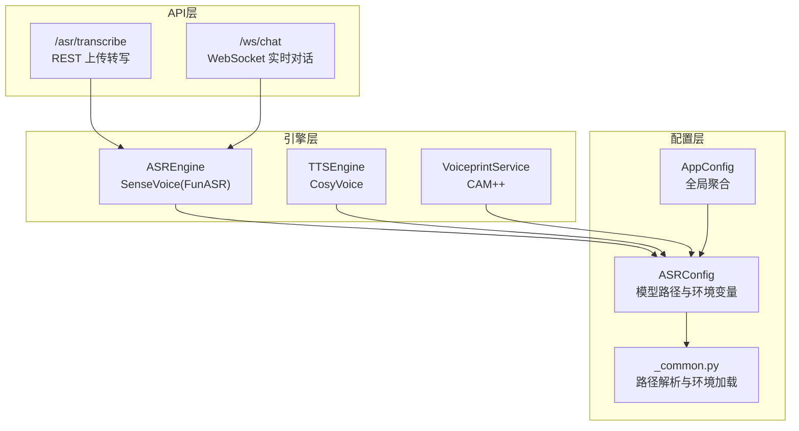
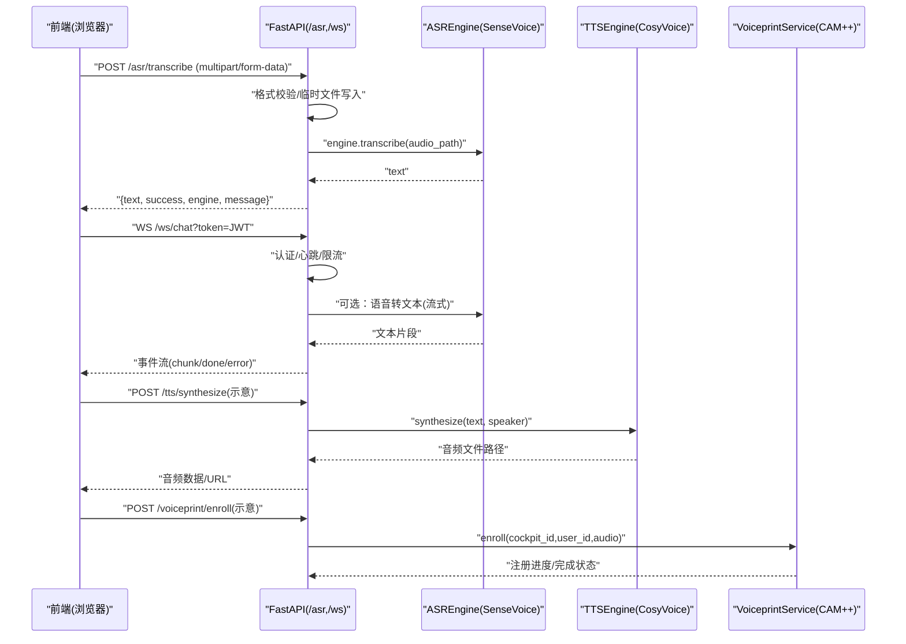
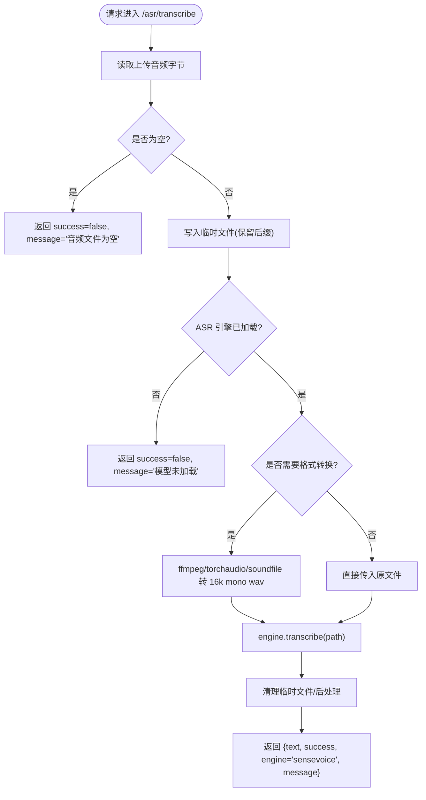
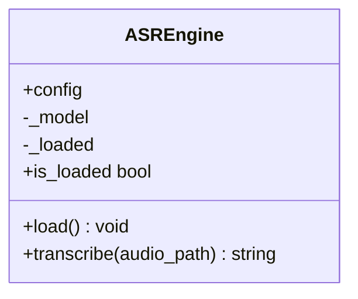
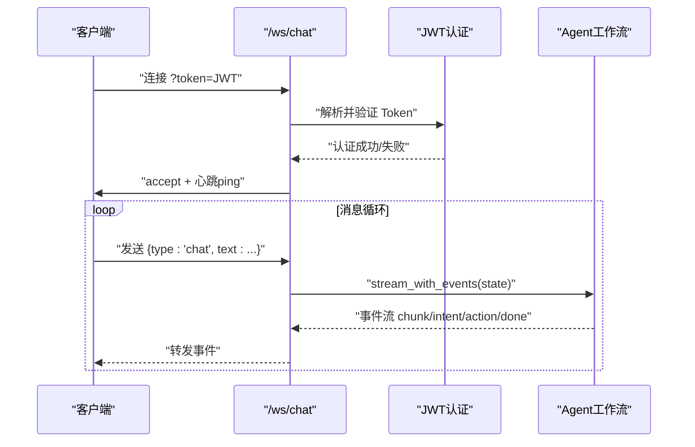
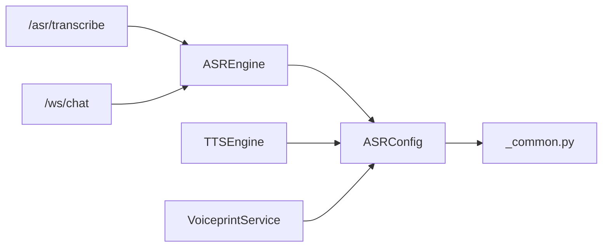

# 语音识别API

<cite>
**本文引用的文件**   
- [backend_design/nexus/api/routes/asr.py](file://backend_design/nexus/api/routes/asr.py)
- [backend_design/nexus/asr/engine.py](file://backend_design/nexus/asr/engine.py)
- [backend_design/nexus/config/asr.py](file://backend_design/nexus/config/asr.py)
- [backend_design/nexus/tts/engine.py](file://backend_design/nexus/tts/engine.py)
- [backend_design/nexus/core/voiceprint.py](file://backend_design/nexus/core/voiceprint.py)
- [backend_design/nexus/api/websocket.py](file://backend_design/nexus/api/websocket.py)
- [models/asr/sensevoice/configuration.json](file://models/asr/sensevoice/configuration.json)
- [models/asr/sensevoice/config.yaml](file://models/asr/sensevoice/config.yaml)
- [docs/内部开发存档文档/语音技术文档/asr-guide.md](file://docs/内部开发存档文档/语音技术文档/asr-guide.md)
- [frontend_design/src/hooks/use-speech-recognition.ts](file://frontend_design/src/hooks/use-speech-recognition.ts)
- [frontend_design/src/components/voice-recorder.tsx](file://frontend_design/src/components/voice-recorder.tsx)
- [backend_design/nexus/config/_common.py](file://backend_design/nexus/config/_common.py)
- [backend_design/nexus/config/__init__.py](file://backend_design/nexus/config/__init__.py)
- [docs/交付版文档包/03-API接口协议文档.md](file://docs/交付版文档包/03-API接口协议文档.md)
</cite>

## 目录
1. [简介](#简介)
2. [项目结构](#项目结构)
3. [核心组件](#核心组件)
4. [架构总览](#架构总览)
5. [详细组件分析](#详细组件分析)
6. [依赖关系分析](#依赖关系分析)
7. [性能与调优](#性能与调优)
8. [故障排查指南](#故障排查指南)
9. [结论](#结论)
10. [附录：客户端集成示例](#附录客户端集成示例)

## 简介
本文件为 NexusCockpit 的语音识别（ASR）API 提供完整、可操作的文档，覆盖以下能力：
- 音频文件上传转写（REST）
- 实时语音转文字（WebSocket）
- ASR 引擎配置与模型路径管理
- 支持的音频格式、采样率要求与语言模型选择
- SenseVoice 引擎参数、精度优化与性能调优
- 错误处理策略与常见问题定位
- 与 TTS 系统的协同工作
- 与声纹识别（CAM++）的集成方法

## 项目结构
与语音识别相关的后端代码主要分布在如下模块：
- API 路由层：FastAPI 路由定义 /asr 相关端点
- ASR 引擎封装：FunASR + SenseVoice 的加载与推理
- 配置中心：ASR/TTS/声纹模型路径与环境变量解析
- WebSocket：实时双向通信通道（可用于流式语音对话）
- TTS 引擎：CosyVoice 语音合成
- 声纹服务：CAM++ 特征提取与验证

图表来源
- [backend_design/nexus/api/routes/asr.py:48-121](file://backend_design/nexus/api/routes/asr.py#L48-L121)
- [backend_design/nexus/asr/engine.py:78-178](file://backend_design/nexus/asr/engine.py#L78-L178)
- [backend_design/nexus/config/asr.py:15-66](file://backend_design/nexus/config/asr.py#L15-L66)
- [backend_design/nexus/config/_common.py:56-75](file://backend_design/nexus/config/_common.py#L56-L75)
- [backend_design/nexus/config/__init__.py:84-131](file://backend_design/nexus/config/__init__.py#L84-L131)

章节来源
- [backend_design/nexus/api/routes/asr.py:1-248](file://backend_design/nexus/api/routes/asr.py#L1-L248)
- [backend_design/nexus/asr/engine.py:1-178](file://backend_design/nexus/asr/engine.py#L1-L178)
- [backend_design/nexus/config/asr.py:1-66](file://backend_design/nexus/config/asr.py#L1-L66)
- [backend_design/nexus/config/_common.py:1-75](file://backend_design/nexus/config/_common.py#L1-L75)
- [backend_design/nexus/config/__init__.py:1-167](file://backend_design/nexus/config/__init__.py#L1-L167)

## 核心组件
- ASR REST 接口
  - POST /asr/transcribe：上传音频文件并返回识别文本
  - GET /asr/status：查询 ASR 引擎状态（是否已加载、模型路径等）
- ASR 引擎
  - 基于 FunASR AutoModel 加载 SenseVoice 本地模型
  - 支持自动语言检测、ITN（逆文本规范化）、标点过滤
- 音频转换
  - 将 WebM/MP3/M4A/OGG 转换为 16kHz 单声道 WAV（优先 ffmpeg，其次 torchaudio/soundfile）
- TTS 引擎
  - CosyVoice 语音合成，支持多说话人与零样本模式
- 声纹服务
  - CAM++ 特征提取、注册与验证，按座舱/用户隔离存储
- WebSocket
  - /ws/chat 双向实时通信，心跳保活，限流与会话历史

章节来源
- [backend_design/nexus/api/routes/asr.py:48-139](file://backend_design/nexus/api/routes/asr.py#L48-L139)
- [backend_design/nexus/asr/engine.py:78-178](file://backend_design/nexus/asr/engine.py#L78-L178)
- [backend_design/nexus/tts/engine.py:21-116](file://backend_design/nexus/tts/engine.py#L21-L116)
- [backend_design/nexus/core/voiceprint.py:43-401](file://backend_design/nexus/core/voiceprint.py#L43-L401)
- [backend_design/nexus/api/websocket.py:71-209](file://backend_design/nexus/api/websocket.py#L71-L209)

## 架构总览
下图展示了从前端录音到后端 ASR 转写、TTS 合成以及声纹识别的整体流程。

图表来源
- [backend_design/nexus/api/routes/asr.py:48-121](file://backend_design/nexus/api/routes/asr.py#L48-L121)
- [backend_design/nexus/asr/engine.py:138-173](file://backend_design/nexus/asr/engine.py#L138-L173)
- [backend_design/nexus/tts/engine.py:63-111](file://backend_design/nexus/tts/engine.py#L63-L111)
- [backend_design/nexus/core/voiceprint.py:108-190](file://backend_design/nexus/core/voiceprint.py#L108-L190)
- [backend_design/nexus/api/websocket.py:71-209](file://backend_design/nexus/api/websocket.py#L71-L209)

## 详细组件分析

### ASR REST 接口：/asr/transcribe
- 功能：接收 multipart/form-data 音频文件，返回识别文本
- 支持格式：WAV、WebM、MP3、M4A、OGG（非WAV会尝试转为16kHz单声道WAV）
- 响应体字段：text、success、engine、message
- 错误处理：空文件、模型未加载、转换失败、异常捕获均返回结构化错误信息

图表来源
- [backend_design/nexus/api/routes/asr.py:48-121](file://backend_design/nexus/api/routes/asr.py#L48-L121)
- [backend_design/nexus/api/routes/asr.py:142-248](file://backend_design/nexus/api/routes/asr.py#L142-L248)

章节来源
- [backend_design/nexus/api/routes/asr.py:48-139](file://backend_design/nexus/api/routes/asr.py#L48-L139)

### ASR 引擎：ASREngine（SenseVoice/FunASR）
- 加载策略：懒加载，首次调用时初始化 AutoModel；自动选择 CUDA/CPU
- 推理参数：language="auto"、use_itn=True；输出经 rich_transcription_postprocess 处理
- 结果过滤：纯标点/空白结果会被过滤为空字符串，避免无意义输出
- 日志抑制：在模型加载期间抑制 FunASR/PyTorch 噪音日志

图表来源
- [backend_design/nexus/asr/engine.py:78-178](file://backend_design/nexus/asr/engine.py#L78-L178)

章节来源
- [backend_design/nexus/asr/engine.py:1-178](file://backend_design/nexus/asr/engine.py#L1-L178)

### 音频格式与采样率要求
- 推荐输入：WAV（16kHz、16-bit、mono PCM）
- 自动转换：WebM/MP3/M4A/OGG 将被转换为 16kHz 单声道 WAV
- 转换优先级：系统 ffmpeg > imageio_ffmpeg > torchaudio > soundfile
- 模型配置：SenseVoice 前端采样率 fs=16000，帧长/移位等参数见配置文件

章节来源
- [backend_design/nexus/api/routes/asr.py:142-248](file://backend_design/nexus/api/routes/asr.py#L142-L248)
- [models/asr/sensevoice/config.yaml:32-41](file://models/asr/sensevoice/config.yaml#L32-L41)

### 语言模型与识别精度优化
- 模型：SenseVoiceSmall（FunASR），支持中/英/日/韩多语种
- 语言设置：language="auto"（自动识别）
- ITN：use_itn=True（数字/符号规范化）
- 后处理：rich_transcription_postprocess（标点与文本规范化）
- 静音/极短录音过滤：正则匹配纯标点结果并清空

章节来源
- [docs/内部开发存档文档/语音技术文档/asr-guide.md:15-23](file://docs/内部开发存档文档/语音技术文档/asr-guide.md#L15-L23)
- [backend_design/nexus/asr/engine.py:152-173](file://backend_design/nexus/asr/engine.py#L152-L173)

### 实时语音转文字（WebSocket）
- 端点：/ws/chat
- 认证：通过 query 参数 token 传递 JWT
- 心跳：服务端每 30 秒 ping，客户端需回复 pong
- 事件：intent/action/chunk/done/error/ping/pong
- 适用场景：需要双向交互的语音对话（结合 ASR 实现端到端语音流）

图表来源
- [backend_design/nexus/api/websocket.py:71-209](file://backend_design/nexus/api/websocket.py#L71-L209)

章节来源
- [backend_design/nexus/api/websocket.py:1-209](file://backend_design/nexus/api/websocket.py#L1-L209)

### 与 TTS 系统的协同工作
- 引擎：CosyVoice（TTSEngine）
- 加载：根据配置路径加载模型，自动选择 GPU/CPU
- 合成：支持指定说话人或零样本模式，输出 WAV（22050Hz）
- 协作流程：ASR 得到文本 → LLM/业务逻辑生成回复 → TTS 合成语音 → 前端播放

章节来源
- [backend_design/nexus/tts/engine.py:21-116](file://backend_design/nexus/tts/engine.py#L21-L116)

### 与声纹识别的集成方法
- 引擎：CAM++（VoiceprintService）
- 功能：注册（enroll）、验证（verify）、状态查询、删除
- 存储：按 cockpit_id/user_id 隔离，保存 .npy 特征与原始音频
- 阈值：默认 0.7，可通过环境变量调整

章节来源
- [backend_design/nexus/core/voiceprint.py:43-401](file://backend_design/nexus/core/voiceprint.py#L43-L401)
- [backend_design/nexus/config/asr.py:40-44](file://backend_design/nexus/config/asr.py#L40-L44)

## 依赖关系分析
- ASR 路由依赖 ASREngine，后者依赖配置中心获取模型路径
- TTS 与声纹服务同样依赖配置中心
- WebSocket 负责认证、限流与会话管理，可与 ASR/TTS 组合使用

图表来源
- [backend_design/nexus/api/routes/asr.py:48-121](file://backend_design/nexus/api/routes/asr.py#L48-L121)
- [backend_design/nexus/asr/engine.py:78-178](file://backend_design/nexus/asr/engine.py#L78-L178)
- [backend_design/nexus/config/asr.py:15-66](file://backend_design/nexus/config/asr.py#L15-L66)
- [backend_design/nexus/config/_common.py:56-75](file://backend_design/nexus/config/_common.py#L56-L75)

章节来源
- [backend_design/nexus/config/__init__.py:84-131](file://backend_design/nexus/config/__init__.py#L84-L131)

## 性能与调优
- 设备选择：有 CUDA 则使用 cuda:0，否则回退 CPU
- 模型加载抑制：加载期间屏蔽 FunASR/PyTorch 噪音日志，提升启动体验
- 音频预处理：优先使用系统 ffmpeg，确保高质量转换；失败时回退至 Python 库
- 结果过滤：过滤纯标点/空白结果，减少无效输出
- 并发与资源：WebSocket 心跳保活、限流保护；会话历史持久化
- 模型配置：SenseVoice 前端 fs=16000，建议保持输入采样率一致

章节来源
- [backend_design/nexus/asr/engine.py:115-123](file://backend_design/nexus/asr/engine.py#L115-L123)
- [backend_design/nexus/api/routes/asr.py:142-248](file://backend_design/nexus/api/routes/asr.py#L142-L248)
- [models/asr/sensevoice/config.yaml:32-41](file://models/asr/sensevoice/config.yaml#L32-L41)

## 故障排查指南
- 模型未加载
  - 检查 FUNASR_MODEL_PATH 是否存在且包含必要文件
  - 查看 /asr/status 返回 loaded 字段
- 音频格式不支持
  - 确认上传文件类型；如为 WebM/MP3/M4A/OGG，系统将尝试转换
  - 检查 ffmpeg 或回退库可用性
- 识别结果为空
  - 可能为静音/极短录音，已被过滤；请重试更清晰的音频
- WebSocket 连接断开
  - 检查 token 有效性；确保客户端正确响应心跳 pong
- TTS 合成失败
  - 检查 COSYVOICE_MODEL_PATH 与可用说话人列表
- 声纹验证失败
  - 确认已注册足够条数（默认 3 条）；检查阈值与音频质量

章节来源
- [backend_design/nexus/api/routes/asr.py:124-139](file://backend_design/nexus/api/routes/asr.py#L124-L139)
- [backend_design/nexus/asr/engine.py:124-136](file://backend_design/nexus/asr/engine.py#L124-L136)
- [backend_design/nexus/tts/engine.py:58-61](file://backend_design/nexus/tts/engine.py#L58-L61)
- [backend_design/nexus/core/voiceprint.py:130-140](file://backend_design/nexus/core/voiceprint.py#L130-L140)

## 结论
NexusCockpit 的语音识别 API 以 FunASR + SenseVoice 为核心，提供稳定的本地离线转写能力，并通过 FastAPI 暴露简洁的 REST 与 WebSocket 接口。配合 TTS 与声纹服务，可实现完整的“听-说-认”一体化体验。通过合理的配置与调优，可在车载等资源受限环境中获得低延迟、高精度的语音交互体验。

## 附录：客户端集成示例
- 浏览器端语音识别（Web Speech API）
  - useSpeechRecognition Hook：支持开始/停止、实时结果、错误处理
- 声纹录音组件
  - VoiceRecorder：录制标准 WAV（16kHz/16bit/mono），回放与删除
- 前端调用建议
  - 上传转写：POST /asr/transcribe（multipart/form-data）
  - 实时对话：连接 /ws/chat?token=JWT，发送文本事件，接收流式响应

章节来源
- [frontend_design/src/hooks/use-speech-recognition.ts:19-112](file://frontend_design/src/hooks/use-speech-recognition.ts#L19-L112)
- [frontend_design/src/components/voice-recorder.tsx:26-212](file://frontend_design/src/components/voice-recorder.tsx#L26-L212)
- [docs/交付版文档包/03-API接口协议文档.md:106-116](file://docs/交付版文档包/03-API接口协议文档.md#L106-L116)