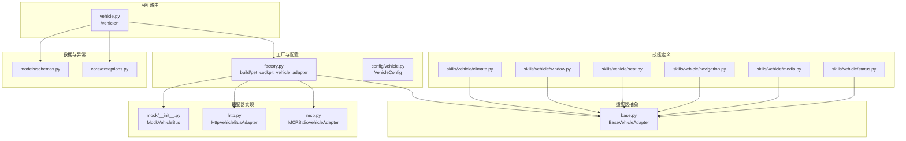
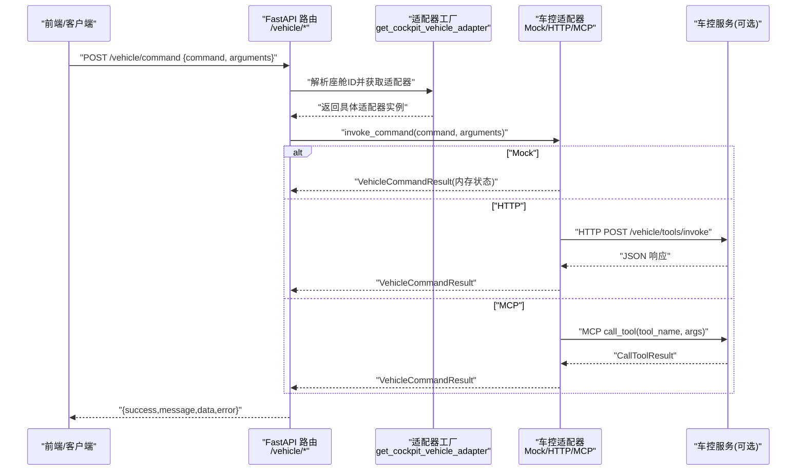
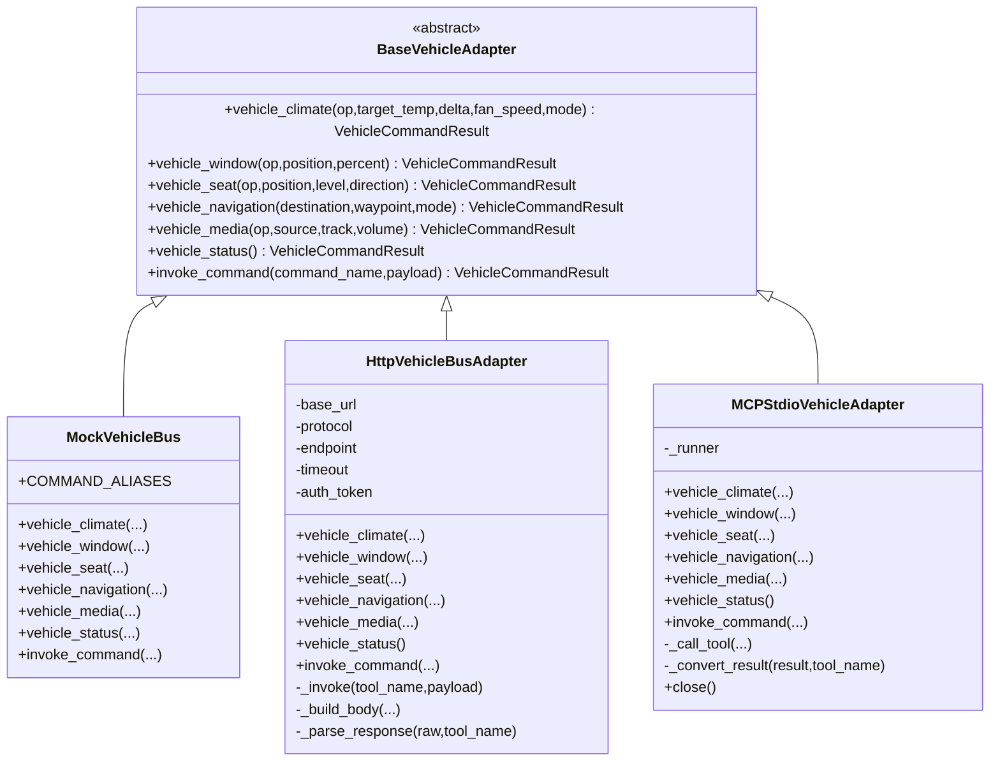
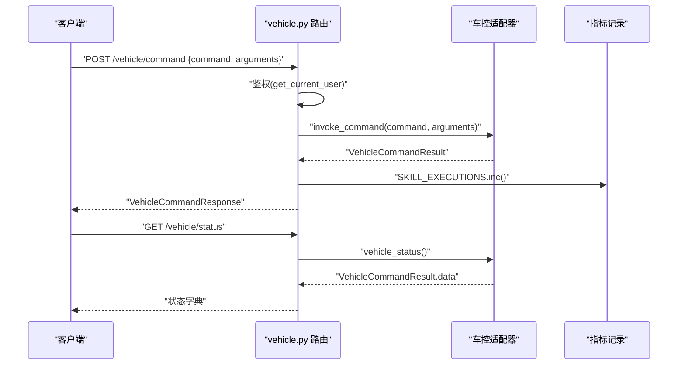
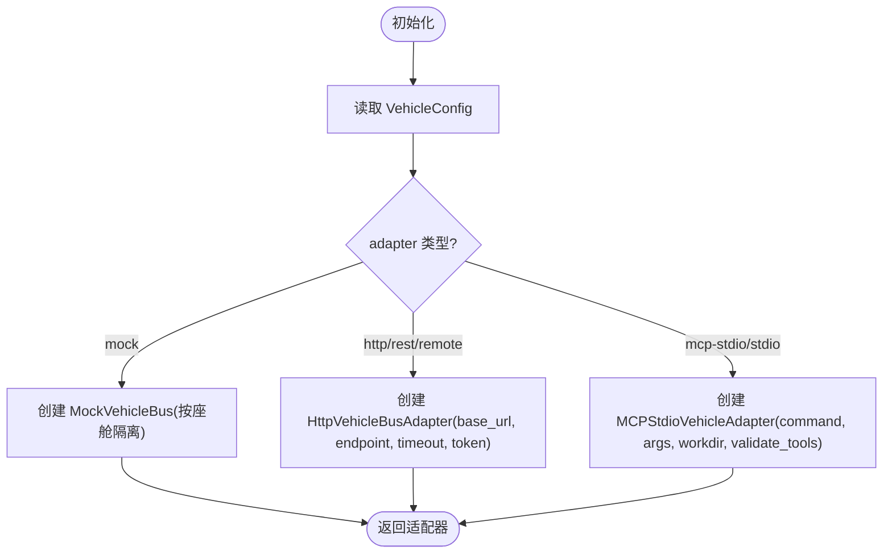
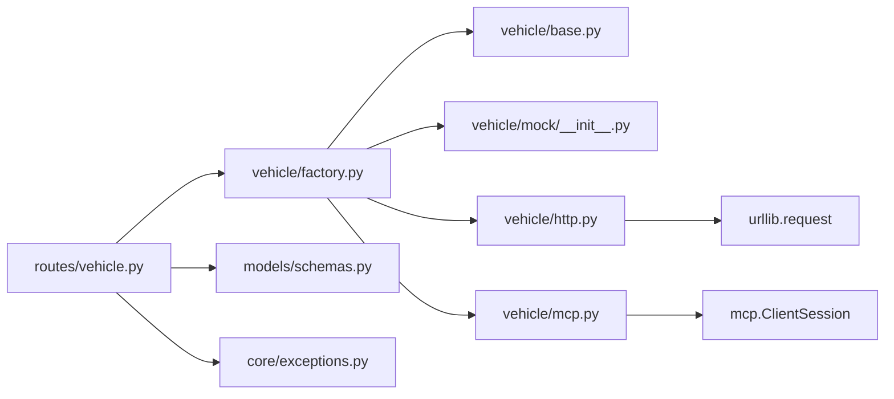

# 车辆控制API

<cite>
**本文引用的文件**   
- [backend_design/nexus/api/routes/vehicle.py](file://backend_design/nexus/api/routes/vehicle.py)
- [backend_design/nexus/vehicle/base.py](file://backend_design/nexus/vehicle/base.py)
- [backend_design/nexus/vehicle/factory.py](file://backend_design/nexus/vehicle/factory.py)
- [backend_design/nexus/vehicle/http.py](file://backend_design/nexus/vehicle/http.py)
- [backend_design/nexus/vehicle/mcp.py](file://backend_design/nexus/vehicle/mcp.py)
- [backend_design/nexus/vehicle/mock/__init__.py](file://backend_design/nexus/vehicle/mock/__init__.py)
- [backend_design/nexus/vehicle/mock/climate_state.py](file://backend_design/nexus/vehicle/mock/climate_state.py)
- [backend_design/nexus/models/schemas.py](file://backend_design/nexus/models/schemas.py)
- [backend_design/nexus/core/exceptions.py](file://backend_design/nexus/core/exceptions.py)
- [backend_design/nexus/config/vehicle.py](file://backend_design/nexus/config/vehicle.py)
- [backend_design/nexus/skills/vehicle/climate.py](file://backend_design/nexus/skills/vehicle/climate.py)
- [backend_design/nexus/skills/vehicle/window.py](file://backend_design/nexus/skills/vehicle/window.py)
- [backend_design/nexus/skills/vehicle/seat.py](file://backend_design/nexus/skills/vehicle/seat.py)
- [backend_design/nexus/skills/vehicle/navigation.py](file://backend_design/nexus/skills/vehicle/navigation.py)
- [backend_design/nexus/skills/vehicle/media.py](file://backend_design/nexus/skills/vehicle/media.py)
- [backend_design/nexus/skills/vehicle/status.py](file://backend_design/nexus/skills/vehicle/status.py)
</cite>

## 目录
1. [简介](#简介)
2. [项目结构](#项目结构)
3. [核心组件](#核心组件)
4. [架构总览](#架构总览)
5. [详细组件分析](#详细组件分析)
6. [依赖关系分析](#依赖关系分析)
7. [性能与可靠性](#性能与可靠性)
8. [故障排查指南](#故障排查指南)
9. [结论](#结论)
10. [附录：接口规范与示例](#附录接口规范与示例)

## 简介
本文件为 NexusCockpit 的车辆控制 API 提供完整、可操作的文档，覆盖空调控制、车窗调节、座椅设置、导航控制、媒体控制等车控功能的 REST 接口规范；说明 Mock、HTTP、MCP 三种适配模式的切换与使用方法；给出车辆状态查询、命令执行结果反馈、错误处理与重试机制的完整说明；并提供不同车控场景的调用示例与最佳实践。同时，对与物理车辆的通信协议和数据安全保障措施进行说明。

## 项目结构
与车控 API 直接相关的代码主要分布在以下模块：
- API 路由层：暴露 /vehicle/command、/vehicle/status、/vehicle/location 三个端点
- 适配器抽象与实现：BaseVehicleAdapter + Mock/HTTP/MCP 三种适配器
- 工厂与配置：根据环境变量选择适配器并支持多座舱隔离
- 技能定义：面向 Agent 的技能描述（名称、参数、示例）
- 数据模型与异常：统一的请求/响应结构与错误体系

图表来源
- [backend_design/nexus/api/routes/vehicle.py:1-152](file://backend_design/nexus/api/routes/vehicle.py#L1-L152)
- [backend_design/nexus/vehicle/base.py:1-92](file://backend_design/nexus/vehicle/base.py#L1-L92)
- [backend_design/nexus/vehicle/factory.py:1-147](file://backend_design/nexus/vehicle/factory.py#L1-L147)
- [backend_design/nexus/vehicle/http.py:1-127](file://backend_design/nexus/vehicle/http.py#L1-L127)
- [backend_design/nexus/vehicle/mcp.py:1-285](file://backend_design/nexus/vehicle/mcp.py#L1-L285)
- [backend_design/nexus/vehicle/mock/__init__.py:1-220](file://backend_design/nexus/vehicle/mock/__init__.py#L1-L220)
- [backend_design/nexus/config/vehicle.py:1-50](file://backend_design/nexus/config/vehicle.py#L1-L50)
- [backend_design/nexus/models/schemas.py:1-88](file://backend_design/nexus/models/schemas.py#L1-L88)
- [backend_design/nexus/core/exceptions.py:1-128](file://backend_design/nexus/core/exceptions.py#L1-L128)

章节来源
- [backend_design/nexus/api/routes/vehicle.py:1-152](file://backend_design/nexus/api/routes/vehicle.py#L1-L152)
- [backend_design/nexus/vehicle/base.py:1-92](file://backend_design/nexus/vehicle/base.py#L1-L92)
- [backend_design/nexus/vehicle/factory.py:1-147](file://backend_design/nexus/vehicle/factory.py#L1-L147)
- [backend_design/nexus/config/vehicle.py:1-50](file://backend_design/nexus/config/vehicle.py#L1-L50)
- [backend_design/nexus/models/schemas.py:1-88](file://backend_design/nexus/models/schemas.py#L1-L88)
- [backend_design/nexus/core/exceptions.py:1-128](file://backend_design/nexus/core/exceptions.py#L1-L128)

## 核心组件
- 车控适配器抽象：统一接口 vehicle_climate / vehicle_window / vehicle_seat / vehicle_navigation / vehicle_media / vehicle_status / invoke_command
- 三种适配器实现：
  - MockVehicleBus：本地内存状态模拟，支持多座舱隔离
  - HttpVehicleBusAdapter：通过 HTTP/REST 或 JSON-RPC 调用真实车控服务
  - MCPStdioVehicleAdapter：通过 MCP stdio 与外部服务通信
- 工厂与配置：依据环境变量选择适配器，支持每座舱独立实例（Mock）或无状态复用（HTTP/MCP）
- API 路由：/vehicle/command、/vehicle/status、/vehicle/location
- 数据模型与异常：统一的请求/响应结构与错误码体系

章节来源
- [backend_design/nexus/vehicle/base.py:1-92](file://backend_design/nexus/vehicle/base.py#L1-L92)
- [backend_design/nexus/vehicle/mock/__init__.py:1-220](file://backend_design/nexus/vehicle/mock/__init__.py#L1-L220)
- [backend_design/nexus/vehicle/http.py:1-127](file://backend_design/nexus/vehicle/http.py#L1-L127)
- [backend_design/nexus/vehicle/mcp.py:1-285](file://backend_design/nexus/vehicle/mcp.py#L1-L285)
- [backend_design/nexus/vehicle/factory.py:1-147](file://backend_design/nexus/vehicle/factory.py#L1-L147)
- [backend_design/nexus/api/routes/vehicle.py:1-152](file://backend_design/nexus/api/routes/vehicle.py#L1-L152)
- [backend_design/nexus/models/schemas.py:1-88](file://backend_design/nexus/models/schemas.py#L1-L88)
- [backend_design/nexus/core/exceptions.py:1-128](file://backend_design/nexus/core/exceptions.py#L1-L128)

## 架构总览
下图展示了从前端到车控后端的端到端调用路径，以及三种适配器的选择逻辑。

图表来源
- [backend_design/nexus/api/routes/vehicle.py:1-152](file://backend_design/nexus/api/routes/vehicle.py#L1-L152)
- [backend_design/nexus/vehicle/factory.py:1-147](file://backend_design/nexus/vehicle/factory.py#L1-L147)
- [backend_design/nexus/vehicle/http.py:1-127](file://backend_design/nexus/vehicle/http.py#L1-L127)
- [backend_design/nexus/vehicle/mcp.py:1-285](file://backend_design/nexus/vehicle/mcp.py#L1-L285)

## 详细组件分析

### 适配器抽象与实现
- BaseVehicleAdapter：定义所有子适配器必须实现的统一方法签名
- MockVehicleBus：门面模式，内部委托至各子系统状态模块（空调、车窗、座椅、导航、媒体、车况），支持命令别名映射
- HttpVehicleBusAdapter：封装 HTTP/REST 或 JSON-RPC 调用，统一构建请求体与解析响应
- MCPStdioVehicleAdapter：在后台线程运行异步事件循环，桥接同步接口与 MCP SDK 的异步调用

图表来源
- [backend_design/nexus/vehicle/base.py:1-92](file://backend_design/nexus/vehicle/base.py#L1-L92)
- [backend_design/nexus/vehicle/mock/__init__.py:1-220](file://backend_design/nexus/vehicle/mock/__init__.py#L1-L220)
- [backend_design/nexus/vehicle/http.py:1-127](file://backend_design/nexus/vehicle/http.py#L1-L127)
- [backend_design/nexus/vehicle/mcp.py:1-285](file://backend_design/nexus/vehicle/mcp.py#L1-L285)

章节来源
- [backend_design/nexus/vehicle/base.py:1-92](file://backend_design/nexus/vehicle/base.py#L1-L92)
- [backend_design/nexus/vehicle/mock/__init__.py:1-220](file://backend_design/nexus/vehicle/mock/__init__.py#L1-L220)
- [backend_design/nexus/vehicle/http.py:1-127](file://backend_design/nexus/vehicle/http.py#L1-L127)
- [backend_design/nexus/vehicle/mcp.py:1-285](file://backend_design/nexus/vehicle/mcp.py#L1-L285)

### API 路由与请求流程
- POST /vehicle/command：直接执行车控命令（绕过 Agent 工作流），需要 JWT 认证，支持多座舱隔离
- GET /vehicle/status：获取当前车辆状态（空调、车窗、座椅、媒体、导航、车况），返回扁平结构
- POST /vehicle/location：更新浏览器 GPS 坐标，用于后续逆地理编码

图表来源
- [backend_design/nexus/api/routes/vehicle.py:1-152](file://backend_design/nexus/api/routes/vehicle.py#L1-L152)
- [backend_design/nexus/models/schemas.py:1-88](file://backend_design/nexus/models/schemas.py#L1-L88)

章节来源
- [backend_design/nexus/api/routes/vehicle.py:1-152](file://backend_design/nexus/api/routes/vehicle.py#L1-L152)
- [backend_design/nexus/models/schemas.py:1-88](file://backend_design/nexus/models/schemas.py#L1-L88)

### 适配器工厂与配置
- 通过环境变量 VEHICLE_ADAPTER 选择适配器类型：mock / http(rest/remote) / mcp-stdio(stdio)
- Mock 模式：每个座舱独立实例，状态隔离
- HTTP/MCP 模式：无状态，复用单例
- HTTP 模式支持 protocol=jsonrpc 或 rest，endpoint 可配置，超时与 Token 可配置
- MCP 模式支持启动命令、参数、工作目录、工具列表校验

图表来源
- [backend_design/nexus/vehicle/factory.py:1-147](file://backend_design/nexus/vehicle/factory.py#L1-L147)
- [backend_design/nexus/config/vehicle.py:1-50](file://backend_design/nexus/config/vehicle.py#L1-L50)

章节来源
- [backend_design/nexus/vehicle/factory.py:1-147](file://backend_design/nexus/vehicle/factory.py#L1-L147)
- [backend_design/nexus/config/vehicle.py:1-50](file://backend_design/nexus/config/vehicle.py#L1-L50)

### 技能定义与参数
- ClimateControlSkill：空调温度、风量、模式控制
- WindowControlSkill：车窗开合、百分比位置
- SeatControlSkill：座椅加热/通风/按摩、位置调整
- NavigationSkill：目的地导航、途经点、当前位置查询
- MediaControlSkill：播放控制、音量、音源切换
- VehicleStatusSkill：车辆状态与位置查询

章节来源
- [backend_design/nexus/skills/vehicle/climate.py:1-37](file://backend_design/nexus/skills/vehicle/climate.py#L1-L37)
- [backend_design/nexus/skills/vehicle/window.py:1-34](file://backend_design/nexus/skills/vehicle/window.py#L1-L34)
- [backend_design/nexus/skills/vehicle/seat.py:1-35](file://backend_design/nexus/skills/vehicle/seat.py#L1-L35)
- [backend_design/nexus/skills/vehicle/navigation.py:1-39](file://backend_design/nexus/skills/vehicle/navigation.py#L1-L39)
- [backend_design/nexus/skills/vehicle/media.py:1-36](file://backend_design/nexus/skills/vehicle/media.py#L1-L36)
- [backend_design/nexus/skills/vehicle/status.py:1-33](file://backend_design/nexus/skills/vehicle/status.py#L1-L33)

## 依赖关系分析
- API 路由依赖适配器工厂与数据模型、异常体系
- 适配器工厂依赖配置与环境变量
- HTTP/MCP 适配器分别依赖网络库与 MCP SDK
- Mock 适配器依赖各子系统状态模块

图表来源
- [backend_design/nexus/api/routes/vehicle.py:1-152](file://backend_design/nexus/api/routes/vehicle.py#L1-L152)
- [backend_design/nexus/vehicle/factory.py:1-147](file://backend_design/nexus/vehicle/factory.py#L1-L147)
- [backend_design/nexus/vehicle/http.py:1-127](file://backend_design/nexus/vehicle/http.py#L1-L127)
- [backend_design/nexus/vehicle/mcp.py:1-285](file://backend_design/nexus/vehicle/mcp.py#L1-L285)
- [backend_design/nexus/models/schemas.py:1-88](file://backend_design/nexus/models/schemas.py#L1-L88)
- [backend_design/nexus/core/exceptions.py:1-128](file://backend_design/nexus/core/exceptions.py#L1-L128)

章节来源
- [backend_design/nexus/api/routes/vehicle.py:1-152](file://backend_design/nexus/api/routes/vehicle.py#L1-L152)
- [backend_design/nexus/vehicle/factory.py:1-147](file://backend_design/nexus/vehicle/factory.py#L1-L147)
- [backend_design/nexus/vehicle/http.py:1-127](file://backend_design/nexus/vehicle/http.py#L1-L127)
- [backend_design/nexus/vehicle/mcp.py:1-285](file://backend_design/nexus/vehicle/mcp.py#L1-L285)
- [backend_design/nexus/models/schemas.py:1-88](file://backend_design/nexus/models/schemas.py#L1-L88)
- [backend_design/nexus/core/exceptions.py:1-128](file://backend_design/nexus/core/exceptions.py#L1-L128)

## 性能与可靠性
- 超时控制
  - HTTP 模式：api_timeout 控制单次调用超时
  - MCP 模式：tool_timeout 控制工具调用超时
- 连接与错误分类
  - HTTP 模式区分 HTTPError、URLError 与通用异常，返回结构化错误信息
  - MCP 模式捕获工具不可用、调用失败等情况
- 指标与可观测性
  - 每次命令执行成功/失败计数，便于监控与告警
- 多座舱隔离
  - Mock 模式按座舱独立实例，避免状态污染
  - HTTP/MCP 模式无状态，适合高并发复用

[本节为通用指导，不直接分析具体文件]

## 故障排查指南
- 常见错误码与含义
  - connection_failed：无法连接真实车控服务
  - invalid_response：非 JSON 响应
  - tool_not_exposed：MCP server 未暴露该工具
  - mcp_call_failed：MCP 调用失败
  - command_not_found：模拟车控不支持的命令
  - invoke_failed：调用失败（通用）
- 定位步骤
  - 检查 VEHICLE_ADAPTER 配置是否正确
  - 确认 base_url、endpoint、token 是否有效
  - 查看日志中的错误堆栈与 error 字段
  - 对于 MCP 模式，确认启动命令与工作目录正确
- 建议重试策略
  - 对 transient 错误（如连接失败、超时）进行指数退避重试
  - 对确定性错误（如参数非法、工具不存在）不进行重试

章节来源
- [backend_design/nexus/vehicle/http.py:1-127](file://backend_design/nexus/vehicle/http.py#L1-L127)
- [backend_design/nexus/vehicle/mcp.py:1-285](file://backend_design/nexus/vehicle/mcp.py#L1-L285)
- [backend_design/nexus/vehicle/mock/__init__.py:1-220](file://backend_design/nexus/vehicle/mock/__init__.py#L1-L220)
- [backend_design/nexus/core/exceptions.py:1-128](file://backend_design/nexus/core/exceptions.py#L1-L128)

## 结论
NexusCockpit 的车辆控制 API 通过统一的适配器抽象与工厂机制，实现了 Mock、HTTP、MCP 三种适配模式的无缝切换与扩展。API 路由简洁清晰，数据模型与异常体系完善，支持多座舱隔离与可观测性。结合合理的超时、错误分类与重试策略，可在开发测试与生产环境中稳定运行。

[本节为总结性内容，不直接分析具体文件]

## 附录：接口规范与示例

### 通用请求/响应结构
- 请求体（POST /vehicle/command）
  - command：字符串，命令名称（如 vehicle_climate、vehicle_window、vehicle_seat、vehicle_navigation、vehicle_media、vehicle_status）
  - arguments：对象，命令参数（键值对）
  - user_id：字符串，用户标识（可选）
- 响应体
  - success：布尔，是否成功
  - message：字符串，人类可读消息
  - data：对象，结构化数据（可能为空）
  - error：字符串，错误码或错误信息

章节来源
- [backend_design/nexus/models/schemas.py:1-88](file://backend_design/nexus/models/schemas.py#L1-L88)

### 端点定义
- POST /vehicle/command
  - 功能：直接执行车控命令（绕过 Agent 工作流）
  - 认证：JWT
  - 多座舱：通过 X-Cockpit-Id 头或 tenant_context 隔离
- GET /vehicle/status
  - 功能：获取车辆当前状态（空调、车窗、座椅、媒体、导航、车况）
  - 认证：JWT
- POST /vehicle/location
  - 功能：使用浏览器 GPS 坐标更新当前位置
  - 请求体：{latitude, longitude}
  - 行为：仅存储坐标，地址在查询时按需获取

章节来源
- [backend_design/nexus/api/routes/vehicle.py:1-152](file://backend_design/nexus/api/routes/vehicle.py#L1-L152)

### 命令与参数规范（基于技能定义）
- vehicle_climate
  - op：操作类型（temp_up/temp_down/set_temp/set_fan/set_mode/status 等）
  - target_temp：目标温度（整数）
  - delta：相对调节幅度（整数）
  - fan_speed：风量档位（整数）
  - mode：模式（auto/cool/heat/defog/vent/defrost）
- vehicle_window
  - op：open/close/set_position 等
  - position：all/front_left/sunroof 等
  - percent：开合百分比（0-100）
- vehicle_seat
  - op：heat_on/cool_on/massage_on/forward 等
  - position：driver/passenger
  - level：档位（1-3）
  - direction：forward/backward
- vehicle_navigation
  - destination：目的地（字符串）
  - waypoint：途经点（字符串）
  - mode：drive/walk
  - op：location（查询当前位置）
- vehicle_media
  - op：play/pause/next/prev/set_volume/set_source
  - source：local/bluetooth/radio
  - track：曲目或内容
  - volume：音量（0-30）
- vehicle_status
  - op：status/location（查询车辆状态或当前位置）

章节来源
- [backend_design/nexus/skills/vehicle/climate.py:1-37](file://backend_design/nexus/skills/vehicle/climate.py#L1-L37)
- [backend_design/nexus/skills/vehicle/window.py:1-34](file://backend_design/nexus/skills/vehicle/window.py#L1-L34)
- [backend_design/nexus/skills/vehicle/seat.py:1-35](file://backend_design/nexus/skills/vehicle/seat.py#L1-L35)
- [backend_design/nexus/skills/vehicle/navigation.py:1-39](file://backend_design/nexus/skills/vehicle/navigation.py#L1-L39)
- [backend_design/nexus/skills/vehicle/media.py:1-36](file://backend_design/nexus/skills/vehicle/media.py#L1-L36)
- [backend_design/nexus/skills/vehicle/status.py:1-33](file://backend_design/nexus/skills/vehicle/status.py#L1-L33)

### 调用示例（概念性）
- 打开空调并设置温度与风量
  - command: vehicle_climate
  - arguments: {op: "power_on", target_temp: 24, fan_speed: 3}
- 关闭天窗
  - command: vehicle_window
  - arguments: {op: "close", position: "sunroof", percent: 0}
- 主驾座椅加热一档
  - command: vehicle_seat
  - arguments: {op: "heat_on", position: "driver", level: 1}
- 导航到公司
  - command: vehicle_navigation
  - arguments: {destination: "公司", mode: "drive"}
- 下一首音乐
  - command: vehicle_media
  - arguments: {op: "next"}
- 查询车辆状态
  - command: vehicle_status
  - arguments: {}
- 查询当前位置
  - command: vehicle_status
  - arguments: {op: "location"}

[本节为概念性示例，不直接引用代码片段]

### 适配模式切换与使用
- 环境变量
  - VEHICLE_ADAPTER：mock / http / mcp-stdio
  - VEHICLE_API_BASE_URL：HTTP 模式基础 URL
  - VEHICLE_API_PROTOCOL：rest 或 jsonrpc
  - VEHICLE_API_ENDPOINT：HTTP 接口路径
  - VEHICLE_API_TIMEOUT：超时秒数
  - VEHICLE_API_TOKEN：认证 Token
  - VEHICLE_MCP_COMMAND：MCP 启动命令
  - VEHICLE_MCP_ARGS：MCP 启动参数
  - VEHICLE_MCP_WORKDIR：MCP 工作目录
  - VEHICLE_MCP_VALIDATE_TOOLS：是否验证工具列表
- 行为差异
  - Mock：本地内存状态，多座舱隔离
  - HTTP：通过 HTTP/REST 或 JSON-RPC 调用真实服务
  - MCP：通过 MCP stdio 与外部服务通信

章节来源
- [backend_design/nexus/config/vehicle.py:1-50](file://backend_design/nexus/config/vehicle.py#L1-L50)
- [backend_design/nexus/vehicle/factory.py:1-147](file://backend_design/nexus/vehicle/factory.py#L1-L147)

### 与物理车辆的通信协议与安全
- HTTP 模式
  - 协议：REST 或 JSON-RPC
  - 安全：Authorization Bearer Token
  - 超时：可配置 api_timeout
- MCP 模式
  - 协议：Model Context Protocol (stdio)
  - 工具白名单：可启用 validate_tools 校验可用工具
  - 超时：tool_timeout 控制工具调用超时
- 数据保障
  - 统一错误分类与结构化响应
  - 指标记录与日志输出
  - 多座舱隔离确保状态不串扰

章节来源
- [backend_design/nexus/vehicle/http.py:1-127](file://backend_design/nexus/vehicle/http.py#L1-L127)
- [backend_design/nexus/vehicle/mcp.py:1-285](file://backend_design/nexus/vehicle/mcp.py#L1-L285)
- [backend_design/nexus/vehicle/factory.py:1-147](file://backend_design/nexus/vehicle/factory.py#L1-L147)