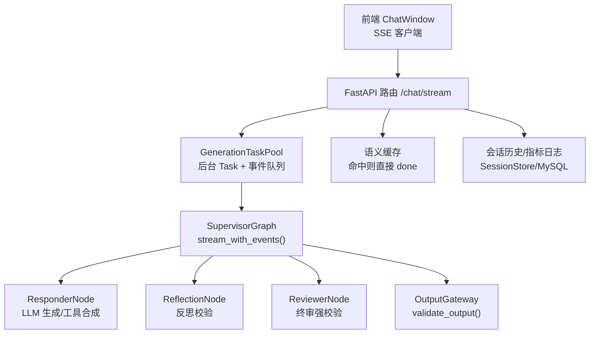
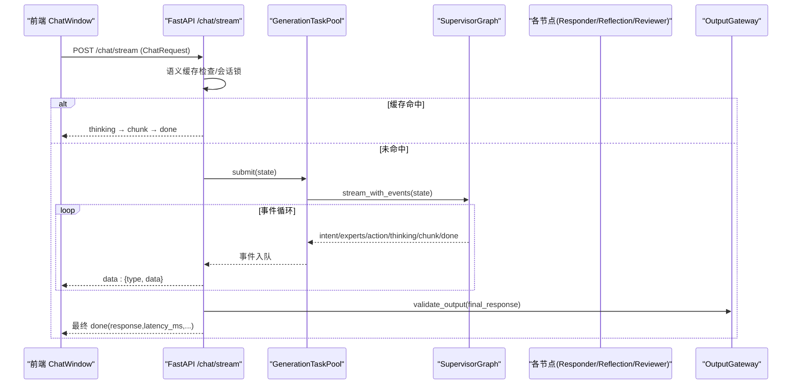
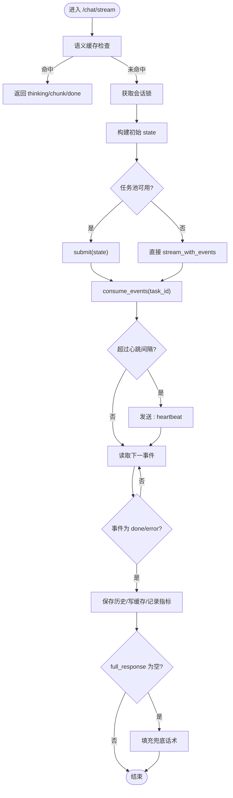
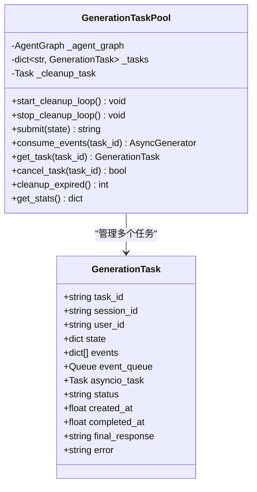
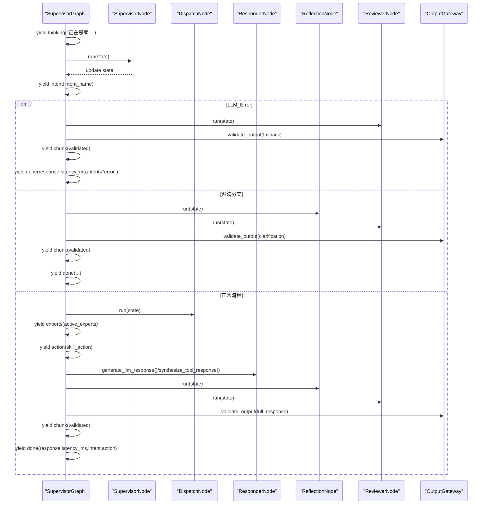
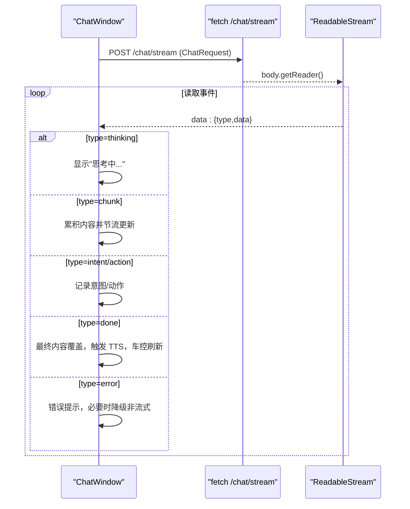
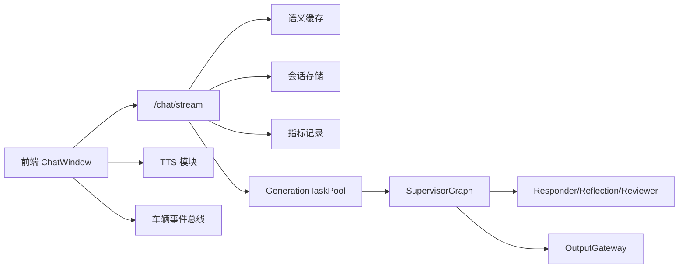

# SSE流式输出

<cite>
**本文引用的文件**   
- [chat.py](file://backend_design/nexus/api/routes/chat.py)
- [generation_task_pool.py](file://backend_design/nexus/agent/generation_task_pool.py)
- [supervisor_graph.py](file://backend_design/nexus/agent/supervisor_graph.py)
- [output_gateway.py](file://backend_design/nexus/agent/output_gateway.py)
- [chat_expert.py](file://backend_design/nexus/agent/experts/chat_expert.py)
- [api.ts](file://frontend_design/src/lib/api.ts)
- [chat-window.tsx](file://frontend_design/src/components/chat/chat-window.tsx)
</cite>

## 目录
1. [简介](#简介)
2. [项目结构](#项目结构)
3. [核心组件](#核心组件)
4. [架构总览](#架构总览)
5. [详细组件分析](#详细组件分析)
6. [依赖关系分析](#依赖关系分析)
7. [性能考量](#性能考量)
8. [故障排查指南](#故障排查指南)
9. [结论](#结论)
10. [附录](#附录)

## 简介
本文件面向 NexusCockpit 的 Server-Sent Events（SSE）流式输出系统，系统性阐述连接建立、事件推送、心跳保活与断线重连机制；深入解析 chat_stream 接口的流式处理流程，包括 GenerationTaskPool 任务池管理、事件队列处理与异常恢复；文档化各类事件类型（intent、experts、action、chunk、done）的数据格式与处理逻辑；并提供前端集成示例、性能优化建议与故障排查指南。

## 项目结构
SSE 流式输出由后端 FastAPI 路由、SupervisorGraph 多智能体编排、GenerationTaskPool 任务池、OutputGateway 输出网关以及前端 SSE 客户端共同构成：
- 后端路由层：提供 /chat/stream 接口，封装 SSE 事件生成器、心跳保活、缓存命中快速返回、会话锁与会话历史持久化。
- 工作流编排：SupervisorGraph.stream_with_events() 输出结构化事件，贯穿意图识别、专家并行、回复合成、反思校验、终审审查与全局输出网关。
- 任务池：GenerationTaskPool 将 pipeline 执行从 SSE 连接生命周期中解耦，通过 asyncio.Queue 缓冲事件，支持查询状态与取消任务。
- 输出网关：validate_output() 对最终输出进行非空、敏感词、幻觉模式、长度合理性、车控完整性等校验。
- 前端：使用原生 fetch + ReadableStream 实现 SSE 客户端，按事件类型更新 UI、触发 TTS 朗读与车控面板刷新，并具备降级策略与错误提示。

图表来源
- [chat.py:467-686](file://backend_design/nexus/api/routes/chat.py#L467-L686)
- [generation_task_pool.py:113-231](file://backend_design/nexus/agent/generation_task_pool.py#L113-L231)
- [supervisor_graph.py:386-617](file://backend_design/nexus/agent/supervisor_graph.py#L386-L617)
- [output_gateway.py:64-194](file://backend_design/nexus/agent/output_gateway.py#L64-L194)
- [api.ts:261-341](file://frontend_design/src/lib/api.ts#L261-L341)
- [chat-window.tsx:294-401](file://frontend_design/src/components/chat/chat-window.tsx#L294-L401)

章节来源
- [chat.py:467-686](file://backend_design/nexus/api/routes/chat.py#L467-L686)
- [generation_task_pool.py:113-231](file://backend_design/nexus/agent/generation_task_pool.py#L113-L231)
- [supervisor_graph.py:386-617](file://backend_design/nexus/agent/supervisor_graph.py#L386-L617)
- [output_gateway.py:64-194](file://backend_design/nexus/agent/output_gateway.py#L64-L194)
- [api.ts:261-341](file://frontend_design/src/lib/api.ts#L261-L341)
- [chat-window.tsx:294-401](file://frontend_design/src/components/chat/chat-window.tsx#L294-L401)

## 核心组件
- SSE 路由与事件生成器：负责请求接入、限流、语义缓存、会话锁、心跳保活、事件序列化与响应头设置。
- SupervisorGraph 事件流：定义 intent、experts、action、thinking、chunk、done 等事件发送时机与数据内容。
- GenerationTaskPool：后台异步任务托管、事件缓冲队列、任务状态查询与取消、过期清理。
- OutputGateway：统一输出安全校验，兜底话术与截断策略。
- 前端 SSE 客户端：逐块解析 data: 行，按事件类型驱动 UI 更新、TTS 播放与车控联动，支持 AbortController 取消与降级回退。

章节来源
- [chat.py:467-686](file://backend_design/nexus/api/routes/chat.py#L467-L686)
- [supervisor_graph.py:386-617](file://backend_design/nexus/agent/supervisor_graph.py#L386-L617)
- [generation_task_pool.py:113-231](file://backend_design/nexus/agent/generation_task_pool.py#L113-L231)
- [output_gateway.py:64-194](file://backend_design/nexus/agent/output_gateway.py#L64-L194)
- [api.ts:261-341](file://frontend_design/src/lib/api.ts#L261-L341)
- [chat-window.tsx:294-401](file://frontend_design/src/components/chat/chat-window.tsx#L294-L401)

## 架构总览
SSE 流式输出的端到端调用序列如下：

图表来源
- [chat.py:467-686](file://backend_design/nexus/api/routes/chat.py#L467-L686)
- [generation_task_pool.py:113-231](file://backend_design/nexus/agent/generation_task_pool.py#L113-L231)
- [supervisor_graph.py:386-617](file://backend_design/nexus/agent/supervisor_graph.py#L386-L617)

## 详细组件分析

### SSE 路由与事件生成器（/chat/stream）
- 连接建立与响应头：设置 text/event-stream、no-cache、keep-alive、X-Accel-Buffering=no 与 X-Heartbeat-Interval。
- 语义缓存优先：车控指令与上下文敏感查询跳过缓存；命中后直接以 thinking→chunk→done 返回。
- 会话并发控制：基于 session_key 的 asyncio.Lock，防止同一会话并发交叉污染历史。
- 任务池路径与降级：优先通过 GenerationTaskPool.submit() 托管 pipeline；不可用时回退到 agent_graph.stream_with_events()。
- 心跳保活：按配置间隔发送注释行 “: heartbeat” 保持连接活跃。
- 事件消费与持久化：从任务池事件队列读取事件，完成时保存会话历史、写入语义缓存、记录指标与聊天日志；finally 块保障即使流中断也强制持久化。
- 异常恢复：捕获异常并返回 error 事件；若 full_response 为空，填充兜底话术确保成对写入。

图表来源
- [chat.py:467-686](file://backend_design/nexus/api/routes/chat.py#L467-L686)

章节来源
- [chat.py:467-686](file://backend_design/nexus/api/routes/chat.py#L467-L686)

### GenerationTaskPool 任务池
- 任务提交与并发限制：submit() 创建后台 asyncio.Task，限制最大并发数。
- 事件缓冲与消费：_run_pipeline() 将事件同时写入 events 列表与 event_queue；consume_events() 阻塞等待并超时检测，保证消费者侧稳定。
- 任务状态与结果：completed/failed/cancelled 三种终态，final_response 在 done 事件中捕获；失败时注入 error 事件。
- 取消与清理：cancel_task() 仅用户主动调用才终止；后台 _cleanup_loop() 定期清理过期任务，避免内存泄漏。
- 统计信息：get_stats() 暴露运行态统计。

图表来源
- [generation_task_pool.py:36-104](file://backend_design/nexus/agent/generation_task_pool.py#L36-L104)
- [generation_task_pool.py:113-231](file://backend_design/nexus/agent/generation_task_pool.py#L113-L231)
- [generation_task_pool.py:259-304](file://backend_design/nexus/agent/generation_task_pool.py#L259-L304)

章节来源
- [generation_task_pool.py:113-231](file://backend_design/nexus/agent/generation_task_pool.py#L113-L231)
- [generation_task_pool.py:259-304](file://backend_design/nexus/agent/generation_task_pool.py#L259-L304)

### SupervisorGraph 事件流（stream_with_events）
- 事件顺序：thinking → intent → experts → action → thinking → chunk → done。
- 分支处理：LLM 不可用走兜底；澄清分支完整走 Reflection+Reviewer+Gateway；专家并行执行后聚合回复；复合场景合并车控与搜索/对话结果。
- 全链路闭环：所有分支均经过 Reflection 反思校验、Reviewer 终审强校验与 OutputGateway 全局校验，确保输出安全与一致性。
- 延迟统计：汇总各阶段 latency_ms 元数据，最终在 done 事件中返回。

图表来源
- [supervisor_graph.py:386-617](file://backend_design/nexus/agent/supervisor_graph.py#L386-L617)

章节来源
- [supervisor_graph.py:386-617](file://backend_design/nexus/agent/supervisor_graph.py#L386-L617)

### OutputGateway 输出校验
- 五层链路闭环校验：缺失 _chain_completed 标记时发出警告但不拦截（向后兼容）。
- 非空与最小长度：过短或空文本替换为兜底话术。
- 敏感内容拦截：匹配预置正则模式，返回敏感兜底话术。
- 幻觉模式检测：无历史时检测编造历史模式，返回新对话兜底。
- 长度合理性：超长输出尝试在句末截断，否则追加省略号。
- 车控完整性：车控失败但回复未提及失败时标记问题（不替换文本）。

章节来源
- [output_gateway.py:64-194](file://backend_design/nexus/agent/output_gateway.py#L64-L194)

### 闲聊专家（ChatExpert）
- 声纹注册：调用 registry.execute("register_voice", ...) 并返回 ACTION_REGISTER 指令供前端处理。
- 纯闲聊：不标记 handled，交由 Responder 走 LLM 分支。
- 结果验证：错误状态或空消息时返回兜底话术。

章节来源
- [chat_expert.py:24-71](file://backend_design/nexus/agent/experts/chat_expert.py#L24-L71)

### 前端 SSE 客户端与集成
- 连接建立：使用原生 fetch 发起 POST /chat/stream，附加 JWT 与座舱 ID 头。
- 事件解析：按行读取 data: 前缀，解析 JSON 事件对象，支持 [DONE] 终止。
- 事件处理：
  - thinking：清空内容并显示“思考中...”
  - chunk：累积内容，节流写入 store，避免频繁 setState
  - intent/action：记录意图与动作，用于展示与车控联动
  - done：最终内容覆盖，触发 TTS 朗读与车控面板刷新
  - error：弹出 toast 并回退为非流式请求（如 404/501）
- 取消与降级：AbortController 中断读取；失败时自动回退到非流式 sendMessage。

图表来源
- [api.ts:261-341](file://frontend_design/src/lib/api.ts#L261-L341)
- [chat-window.tsx:294-401](file://frontend_design/src/components/chat/chat-window.tsx#L294-L401)

章节来源
- [api.ts:261-341](file://frontend_design/src/lib/api.ts#L261-L341)
- [chat-window.tsx:294-401](file://frontend_design/src/components/chat/chat-window.tsx#L294-L401)

## 依赖关系分析
- 路由层依赖：语义缓存、会话存储、指标记录、Langfuse 追踪、RateLimiter。
- 任务池依赖：SupervisorGraph.stream_with_events() 作为事件生产者。
- 工作流依赖：各节点共享 NodeContext（意图路由、记忆、技能注册、LLM 客户端、Prompt 管理等）。
- 输出网关依赖：幻觉模式规则、敏感词正则、车控状态判断。
- 前端依赖：axios 实例（非流式）、原生 fetch（流式）、TTS 模块、车辆事件总线。

图表来源
- [chat.py:467-686](file://backend_design/nexus/api/routes/chat.py#L467-L686)
- [generation_task_pool.py:113-231](file://backend_design/nexus/agent/generation_task_pool.py#L113-L231)
- [supervisor_graph.py:386-617](file://backend_design/nexus/agent/supervisor_graph.py#L386-L617)
- [output_gateway.py:64-194](file://backend_design/nexus/agent/output_gateway.py#L64-L194)
- [api.ts:261-341](file://frontend_design/src/lib/api.ts#L261-L341)
- [chat-window.tsx:294-401](file://frontend_design/src/components/chat/chat-window.tsx#L294-L401)

章节来源
- [chat.py:467-686](file://backend_design/nexus/api/routes/chat.py#L467-L686)
- [generation_task_pool.py:113-231](file://backend_design/nexus/agent/generation_task_pool.py#L113-L231)
- [supervisor_graph.py:386-617](file://backend_design/nexus/agent/supervisor_graph.py#L386-L617)
- [output_gateway.py:64-194](file://backend_design/nexus/agent/output_gateway.py#L64-L194)
- [api.ts:261-341](file://frontend_design/src/lib/api.ts#L261-L341)
- [chat-window.tsx:294-401](file://frontend_design/src/components/chat/chat-window.tsx#L294-L401)

## 性能考量
- 语义缓存：对重复且无副作用的请求显著降低延迟；车控与上下文敏感查询跳过缓存保证正确性。
- 会话锁：避免同一会话并发导致的历史交叉污染；空闲锁清理防止内存泄漏。
- 任务池并发：限制最大并发任务数，避免资源耗尽；后台清理循环释放过期任务。
- 事件缓冲：asyncio.Queue 解耦生产与消费，提升吞吐与稳定性。
- 心跳保活：按配置间隔发送注释行，避免中间设备或代理断开长连接。
- 前端节流：使用 setTimeout 节流 setState，避免 rAF 在组件卸载时失效导致的更新丢失。
- 降级策略：流式失败自动回退非流式，提高可用性。

[本节为通用性能指导，无需具体文件引用]

## 故障排查指南
- 服务初始化未完成：当 Agent graph 未初始化时，SSE 会返回 error 事件并提示检查基础设施（Milvus/Neo4j/Redis）。
- 流中断与空回复：finally 块强制持久化，若 full_response 为空则填充兜底话术，确保 chat_logs 成对写入。
- 任务池满：超过最大并发限制将抛出 RuntimeError，需调整并发上限或优化下游耗时。
- 心跳未生效：确认 X-Heartbeat-Interval 配置与网络中间件是否允许注释行透传。
- 前端无法解析事件：检查 data: 行前缀与 JSON 合法性；确认 [DONE] 终止条件。
- 鉴权失败：401 错误时前端自动刷新 Token 并重试；检查 JWT 有效期与角色权限。
- 车控指令未执行：确认车控意图被识别且未命中旧缓存；检查 skill_status 与 OutputGateway 车控完整性标记。

章节来源
- [chat.py:502-515](file://backend_design/nexus/api/routes/chat.py#L502-L515)
- [chat.py:633-676](file://backend_design/nexus/api/routes/chat.py#L633-L676)
- [generation_task_pool.py:122-126](file://backend_design/nexus/agent/generation_task_pool.py#L122-L126)
- [api.ts:346-354](file://frontend_design/src/lib/api.ts#L346-L354)
- [output_gateway.py:165-184](file://backend_design/nexus/agent/output_gateway.py#L165-L184)

## 结论
NexusCockpit 的 SSE 流式输出系统通过 FastAPI 路由、SupervisorGraph 事件流、GenerationTaskPool 任务池与 OutputGateway 输出网关形成高可靠、可观测、可扩展的端到端流式能力。前端采用原生 SSE 客户端，具备健壮的错误处理与降级策略。整体设计在保证一致性与安全性的同时，兼顾了性能与用户体验。

[本节为总结性内容，无需具体文件引用]

## 附录

### 事件类型与数据格式
- thinking：{type:"thinking", data:{message:string}} — 表示系统正在思考或处理某阶段。
- intent：{type:"intent", data:{intent:string, source:string}} — 意图识别结果与来源。
- experts：{type:"experts", data:{experts:string[]}} — 分派的专家列表。
- action：{type:"action", data:{action:string}} — 执行的技能动作（如 vehicle_xxx）。
- chunk：{type:"chunk", data:{chunk:string}} — 流式文本块。
- done：{type:"done", data:{response:string, latency_ms:number, intent?:string, action?:string, cache_hit?:boolean}} — 完成事件，包含最终回复与延迟统计。
- error：{type:"error", data:{message:string}} — 错误事件，包含错误描述。

章节来源
- [supervisor_graph.py:405-438](file://backend_design/nexus/agent/supervisor_graph.py#L405-L438)
- [supervisor_graph.py:469-517](file://backend_design/nexus/agent/supervisor_graph.py#L469-L517)
- [supervisor_graph.py:595-614](file://backend_design/nexus/agent/supervisor_graph.py#L595-L614)
- [chat.py:536-551](file://backend_design/nexus/api/routes/chat.py#L536-L551)
- [chat.py:633-676](file://backend_design/nexus/api/routes/chat.py#L633-L676)