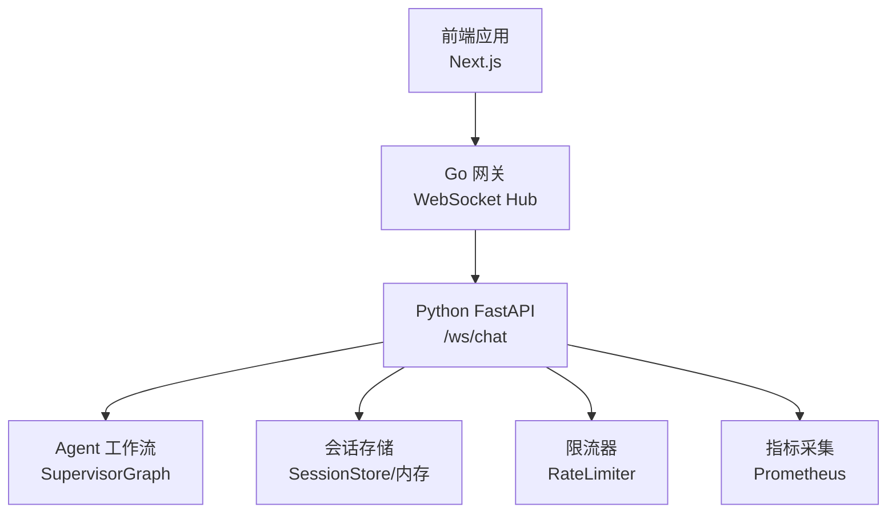
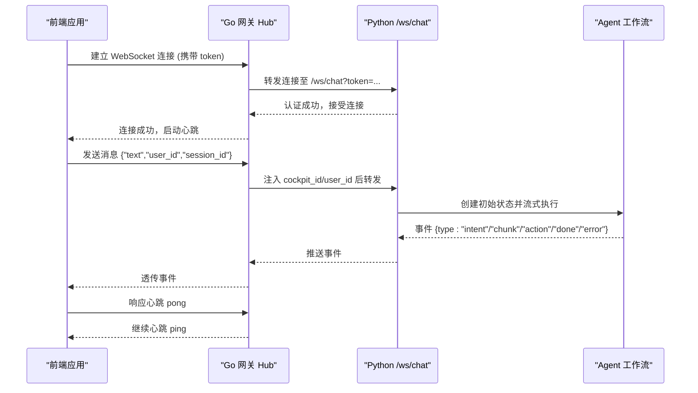
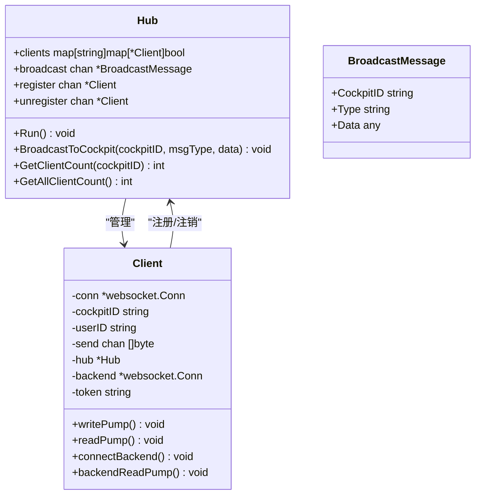
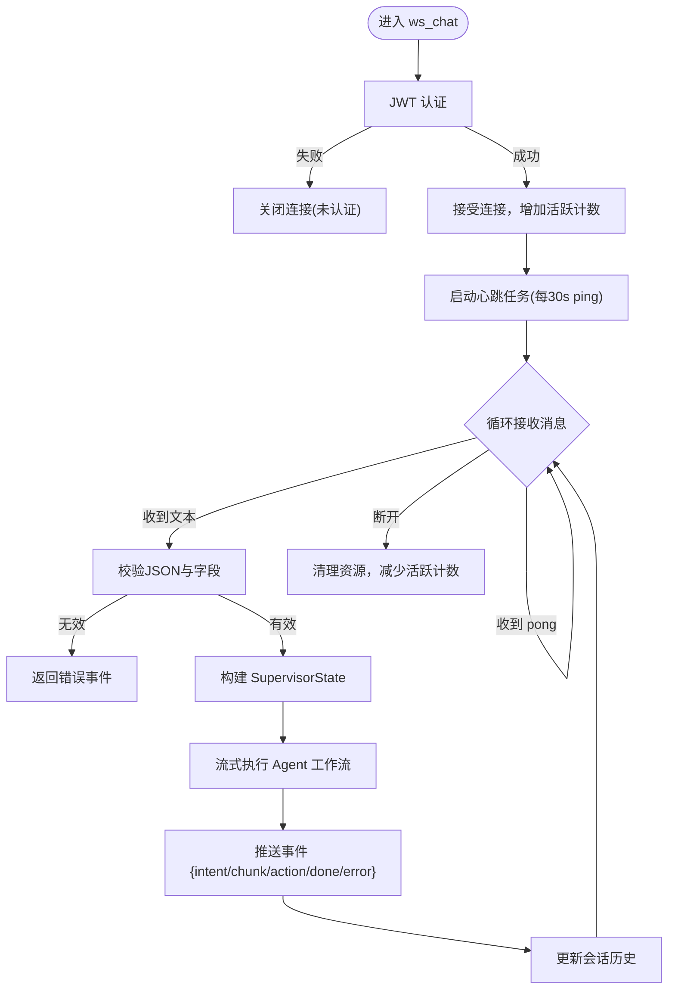
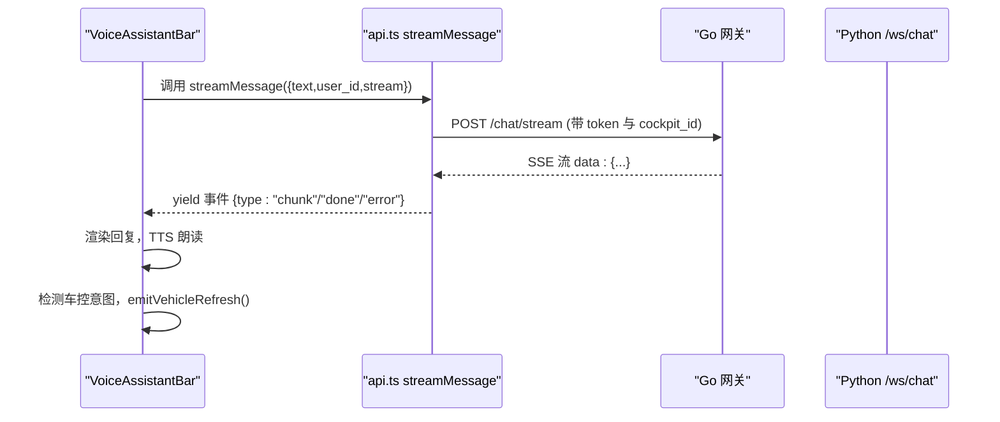
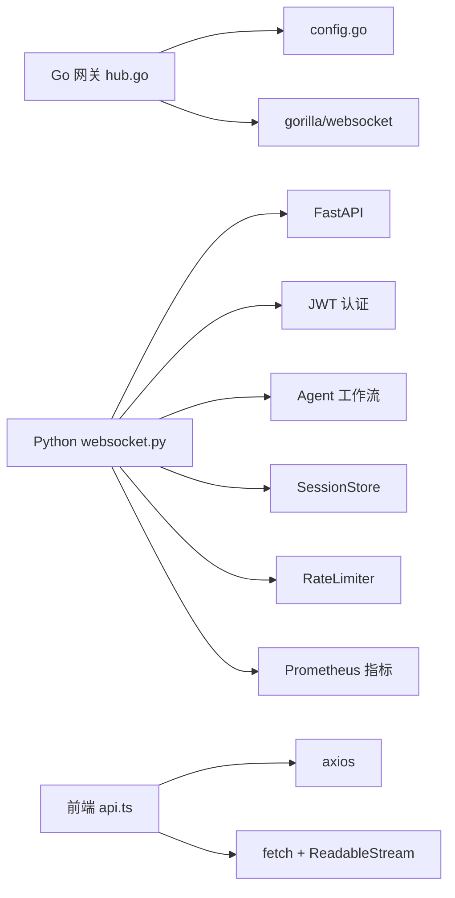

# WebSocket双向通信

<cite>
**本文引用的文件**   
- [backend_design/nexus/api/websocket.py](file://backend_design/nexus/api/websocket.py)
- [backend_design/nexus_gate/internal/ws/hub.go](file://backend_design/nexus_gate/internal/ws/hub.go)
- [backend_design/nexus/main.py](file://backend_design/nexus/main.py)
- [frontend_design/src/lib/api.ts](file://frontend_design/src/lib/api.ts)
- [frontend_design/src/components/vehicle/voice-assistant-bar.tsx](file://frontend_design/src/components/vehicle/voice-assistant-bar.tsx)
- [frontend_design/src/lib/vehicle-events.ts](file://frontend_design/src/lib/vehicle-events.ts)
- [backend_design/nexus/models/state.py](file://backend_design/nexus/models/state.py)
</cite>

## 目录
1. [简介](#简介)
2. [项目结构](#项目结构)
3. [核心组件](#核心组件)
4. [架构总览](#架构总览)
5. [详细组件分析](#详细组件分析)
6. [依赖关系分析](#依赖关系分析)
7. [性能考虑](#性能考虑)
8. [故障排查指南](#故障排查指南)
9. [结论](#结论)
10. [附录](#附录)

## 简介
本文件为 NexusCockpit 的 WebSocket 双向通信系统提供完整技术文档，覆盖连接协议、消息格式与事件类型、实时通信的连接管理、消息路由与状态同步机制。重点说明设备状态更新、语音交互数据与车控指令的双向传输协议，包含连接建立流程、消息编解码规则、错误处理策略与性能调优建议，并提供客户端 SDK 使用示例与调试工具推荐。

## 项目结构
NexusCockpit 的 WebSocket 双向通信由 Go 网关（nexus_gate）与 Python 后端（nexus）共同实现：
- Go 网关负责前端 WebSocket 接入、鉴权转发、心跳保活、广播与多座舱隔离。
- Python 后端提供 /ws/chat 端点，完成 JWT 认证、Agent 工作流流式输出、会话历史持久化与限流控制。
- 前端通过 SSE 流式接口进行文本对话，同时可通过 WebSocket 通道进行语音交互与车控联动。

**图表来源** 
- [backend_design/nexus_gate/internal/ws/hub.go:150-190](file://backend_design/nexus_gate/internal/ws/hub.go#L150-L190)
- [backend_design/nexus/api/websocket.py:71-115](file://backend_design/nexus/api/websocket.py#L71-L115)
- [backend_design/nexus/main.py:473-484](file://backend_design/nexus/main.py#L473-L484)

**章节来源**
- [backend_design/nexus/main.py:473-484](file://backend_design/nexus/main.py#L473-L484)

## 核心组件
- Go 网关 WebSocket Hub：维护客户端连接、按座舱广播、心跳保活、后端转发与重连。
- Python WebSocket 处理器：JWT 认证、心跳 ping/pong、Agent 流式事件推送、会话历史更新与限流。
- 前端 API 客户端：SSE 流式文本对话、Token 自动获取与刷新、车控命令与状态查询。
- 车控事件总线：在语音助手栏触发车控后，通知 VehiclePanel 刷新 UI。

**章节来源**
- [backend_design/nexus_gate/internal/ws/hub.go:40-121](file://backend_design/nexus_gate/internal/ws/hub.go#L40-L121)
- [backend_design/nexus/api/websocket.py:48-115](file://backend_design/nexus/api/websocket.py#L48-L115)
- [frontend_design/src/lib/api.ts:261-341](file://frontend_design/src/lib/api.ts#L261-L341)
- [frontend_design/src/lib/vehicle-events.ts:18-33](file://frontend_design/src/lib/vehicle-events.ts#L18-L33)

## 架构总览
整体通信链路如下：
- 前端通过 Go 网关建立 WebSocket 连接，网关从请求头或查询参数提取 JWT Token，并尝试连接 Python 后端的 /ws/chat。
- Python 后端对连接进行 JWT 认证，启动心跳任务，接收客户端消息，构建 Agent 初始状态，执行流式生成，逐块推送事件。
- 前端通过 SSE 接口进行文本对话；语音交互与车控联动通过 WebSocket 通道与事件总线协同。

**图表来源** 
- [backend_design/nexus_gate/internal/ws/hub.go:150-190](file://backend_design/nexus_gate/internal/ws/hub.go#L150-L190)
- [backend_design/nexus/api/websocket.py:71-115](file://backend_design/nexus/api/websocket.py#L71-L115)
- [backend_design/nexus/models/state.py:108-165](file://backend_design/nexus/models/state.py#L108-L165)

## 详细组件分析

### Go 网关 WebSocket Hub
- 连接升级与跨域校验：基于配置白名单校验 Origin，防止跨站劫持。
- 客户端注册与广播：按 cockpit_id 分组管理连接，支持广播到指定座舱。
- 心跳保活：每 30 秒发送 Ping，设置写超时与读超时，Pong 回调重置读超时。
- 后端连接与转发：构造 Python WebSocket URL，注入 cockpit_id/user_id，失败时返回统一错误事件。
- 缓冲区满保护：当 send 缓冲满时关闭连接，避免内存泄漏。

**图表来源** 
- [backend_design/nexus_gate/internal/ws/hub.go:51-75](file://backend_design/nexus_gate/internal/ws/hub.go#L51-L75)
- [backend_design/nexus_gate/internal/ws/hub.go:150-190](file://backend_design/nexus_gate/internal/ws/hub.go#L150-L190)

**章节来源**
- [backend_design/nexus_gate/internal/ws/hub.go:22-38](file://backend_design/nexus_gate/internal/ws/hub.go#L22-L38)
- [backend_design/nexus_gate/internal/ws/hub.go:192-219](file://backend_design/nexus_gate/internal/ws/hub.go#L192-L219)
- [backend_design/nexus_gate/internal/ws/hub.go:221-248](file://backend_design/nexus_gate/internal/ws/hub.go#L221-L248)
- [backend_design/nexus_gate/internal/ws/hub.go:250-274](file://backend_design/nexus_gate/internal/ws/hub.go#L250-L274)
- [backend_design/nexus_gate/internal/ws/hub.go:276-326](file://backend_design/nexus_gate/internal/ws/hub.go#L276-L326)
- [backend_design/nexus_gate/internal/ws/hub.go:328-352](file://backend_design/nexus_gate/internal/ws/hub.go#L328-L352)

### Python WebSocket 处理器
- 认证与心跳：从 query 参数解析 JWT Token，验证通过后接受连接；每 30 秒发送 ping，客户端需回复 pong。
- 消息处理：接收 JSON 消息，校验字段，构建 SupervisorState，调用 Agent 流式事件推送。
- 会话历史：优先从 SessionStore 加载历史，完成后回写最新历史片段。
- 限流与异常：集成 RateLimiter，捕获异常并返回统一错误事件。

**图表来源** 
- [backend_design/nexus/api/websocket.py:71-115](file://backend_design/nexus/api/websocket.py#L71-L115)
- [backend_design/nexus/api/websocket.py:117-209](file://backend_design/nexus/api/websocket.py#L117-L209)
- [backend_design/nexus/models/state.py:108-165](file://backend_design/nexus/models/state.py#L108-L165)

**章节来源**
- [backend_design/nexus/api/websocket.py:48-69](file://backend_design/nexus/api/websocket.py#L48-L69)
- [backend_design/nexus/api/websocket.py:71-115](file://backend_design/nexus/api/websocket.py#L71-L115)
- [backend_design/nexus/api/websocket.py:117-209](file://backend_design/nexus/api/websocket.py#L117-L209)
- [backend_design/nexus/models/state.py:108-165](file://backend_design/nexus/models/state.py#L108-L165)

### 前端 API 客户端与语音助手栏
- SSE 流式文本对话：使用原生 fetch + ReadableStream 逐块读取 data: 行，解析 JSON 事件，支持 AbortSignal 取消。
- Token 管理：自动获取与刷新 JWT Token，附加 Authorization 与 X-Cockpit-Id 请求头。
- 语音助手栏：集成浏览器语音识别与本地 ASR 录音，发送消息后流式渲染回复，TTS 朗读，检测车控意图触发刷新事件。

**图表来源** 
- [frontend_design/src/lib/api.ts:261-341](file://frontend_design/src/lib/api.ts#L261-L341)
- [frontend_design/src/components/vehicle/voice-assistant-bar.tsx:132-229](file://frontend_design/src/components/vehicle/voice-assistant-bar.tsx#L132-L229)
- [frontend_design/src/lib/vehicle-events.ts:23-33](file://frontend_design/src/lib/vehicle-events.ts#L23-L33)

**章节来源**
- [frontend_design/src/lib/api.ts:117-175](file://frontend_design/src/lib/api.ts#L117-L175)
- [frontend_design/src/lib/api.ts:261-341](file://frontend_design/src/lib/api.ts#L261-L341)
- [frontend_design/src/components/vehicle/voice-assistant-bar.tsx:132-229](file://frontend_design/src/components/vehicle/voice-assistant-bar.tsx#L132-L229)
- [frontend_design/src/lib/vehicle-events.ts:23-33](file://frontend_design/src/lib/vehicle-events.ts#L23-L33)

## 依赖关系分析
- Go 网关依赖配置模块（AllowedOrigins）、gorilla/websocket、内部 config。
- Python 后端依赖 FastAPI、JWT 认证、Agent 工作流、SessionStore、RateLimiter、Prometheus 指标。
- 前端依赖 axios、fetch、AbortController、浏览器语音 API。

**图表来源** 
- [backend_design/nexus_gate/internal/ws/hub.go:1-20](file://backend_design/nexus_gate/internal/ws/hub.go#L1-L20)
- [backend_design/nexus/api/websocket.py:27-42](file://backend_design/nexus/api/websocket.py#L27-L42)
- [frontend_design/src/lib/api.ts:17-38](file://frontend_design/src/lib/api.ts#L17-L38)

**章节来源**
- [backend_design/nexus_gate/internal/ws/hub.go:1-20](file://backend_design/nexus_gate/internal/ws/hub.go#L1-L20)
- [backend_design/nexus/api/websocket.py:27-42](file://backend_design/nexus/api/websocket.py#L27-L42)
- [frontend_design/src/lib/api.ts:17-38](file://frontend_design/src/lib/api.ts#L17-L38)

## 性能考虑
- 心跳与超时：Go 网关每 30 秒发送 Ping，设置写超时 10 秒、读超时 60 秒，Pong 回调重置读超时，避免僵尸连接。
- 缓冲区保护：send 缓冲满时关闭连接，防止内存泄漏；Python 侧限制单次消息大小与 JSON 解析开销。
- 流式渲染：前端使用 requestAnimationFrame 节流更新，避免高频重渲染阻塞 UI。
- 会话历史：优先 Redis SessionStore 持久化，降级内存 dict，减少数据库压力。
- 指标监控：Prometheus 记录请求计数与延迟，便于观测与告警。

[本节为通用性能建议，不直接分析具体文件]

## 故障排查指南
- 连接失败：检查 CORS 白名单与 Origin 校验；确认 JWT Token 有效且已传递。
- 心跳超时：确认客户端正确响应 pong；检查网络与防火墙策略。
- 后端不可用：Go 网关返回统一错误事件；检查 Python 服务健康与日志。
- 流式中断：前端使用 AbortSignal 取消旧请求；检查 SSE 与 WebSocket 通道稳定性。
- 车控无刷新：确认 emitVehicleRefresh() 被调用；检查 VehiclePanel 订阅是否正确。

**章节来源**
- [backend_design/nexus_gate/internal/ws/hub.go:276-326](file://backend_design/nexus_gate/internal/ws/hub.go#L276-L326)
- [backend_design/nexus/api/websocket.py:117-209](file://backend_design/nexus/api/websocket.py#L117-L209)
- [frontend_design/src/components/vehicle/voice-assistant-bar.tsx:132-229](file://frontend_design/src/components/vehicle/voice-assistant-bar.tsx#L132-L229)

## 结论
NexusCockpit 的 WebSocket 双向通信系统通过 Go 网关与 Python 后端的协作，实现了高可靠、低延迟的实时交互能力。连接管理、消息路由与状态同步机制完善，支持语音交互与车控指令的双向传输。结合前端 SSE 流式体验与事件总线，提供了流畅的用户交互与 UI 联动。建议在生产环境中严格配置 CORS 与 JWT 认证，启用心跳与超时保护，并通过 Prometheus 监控关键指标。

[本节为总结性内容，不直接分析具体文件]

## 附录

### 连接建立流程
- 前端通过 Go 网关建立 WebSocket 连接，携带 JWT Token。
- 网关校验 Origin 与 CORS，尝试连接 Python 后端 /ws/chat。
- Python 后端验证 Token，接受连接并启动心跳任务。
- 前端响应心跳 pong，维持连接存活。

**章节来源**
- [backend_design/nexus_gate/internal/ws/hub.go:150-190](file://backend_design/nexus_gate/internal/ws/hub.go#L150-L190)
- [backend_design/nexus/api/websocket.py:71-115](file://backend_design/nexus/api/websocket.py#L71-L115)

### 消息编解码规则
- 统一 JSON 格式：{"type": "...", "data": {...}}
- 事件类型：
  - intent: 意图识别结果
  - action: 车控动作描述
  - chunk: 流式文本片段
  - done: 完成事件，包含 response 与 latency_ms
  - error: 错误事件，包含 message
  - ping/pong: 心跳请求与响应

**章节来源**
- [backend_design/nexus/api/websocket.py:17-25](file://backend_design/nexus/api/websocket.py#L17-L25)

### 错误处理策略
- 认证失败：关闭连接并返回原因。
- 后端不可用：返回统一错误事件。
- 限流异常：返回 429 与重试提示。
- 全局异常：统一 JSON 格式，隐藏内部堆栈。

**章节来源**
- [backend_design/nexus/api/websocket.py:89-92](file://backend_design/nexus/api/websocket.py#L89-L92)
- [backend_design/nexus_gate/internal/ws/hub.go:314-324](file://backend_design/nexus_gate/internal/ws/hub.go#L314-L324)
- [backend_design/nexus/main.py:505-596](file://backend_design/nexus/main.py#L505-L596)

### 客户端 SDK 使用示例
- 文本对话：使用 streamMessage 函数，传入请求对象与可选 AbortSignal。
- 语音交互：集成浏览器语音识别或本地 ASR 录音，发送消息后流式渲染回复。
- 车控联动：在语音助手栏中，根据事件中的 action/intent 判断是否触发刷新。

**章节来源**
- [frontend_design/src/lib/api.ts:261-341](file://frontend_design/src/lib/api.ts#L261-L341)
- [frontend_design/src/components/vehicle/voice-assistant-bar.tsx:132-229](file://frontend_design/src/components/vehicle/voice-assistant-bar.tsx#L132-L229)

### 调试工具推荐
- 浏览器开发者工具：Network 面板查看 SSE 与 WebSocket 流量。
- Go 网关日志：观察连接注册、注销与错误信息。
- Python 后端日志：查看 Agent 执行过程与异常堆栈。
- Prometheus 与 Grafana：监控请求计数、延迟与活跃连接数。

[本节为通用调试建议，不直接分析具体文件]