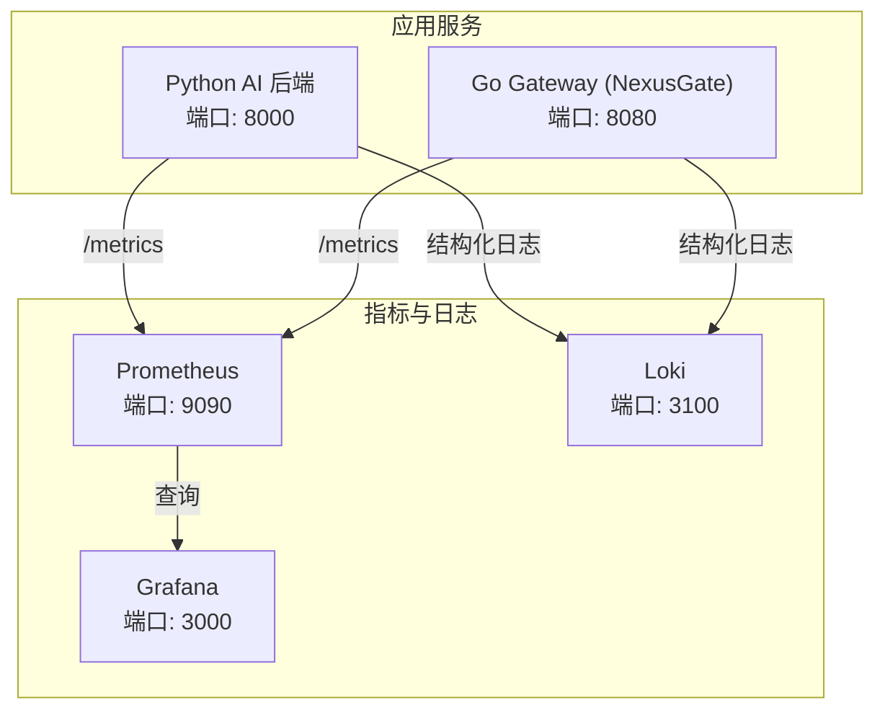
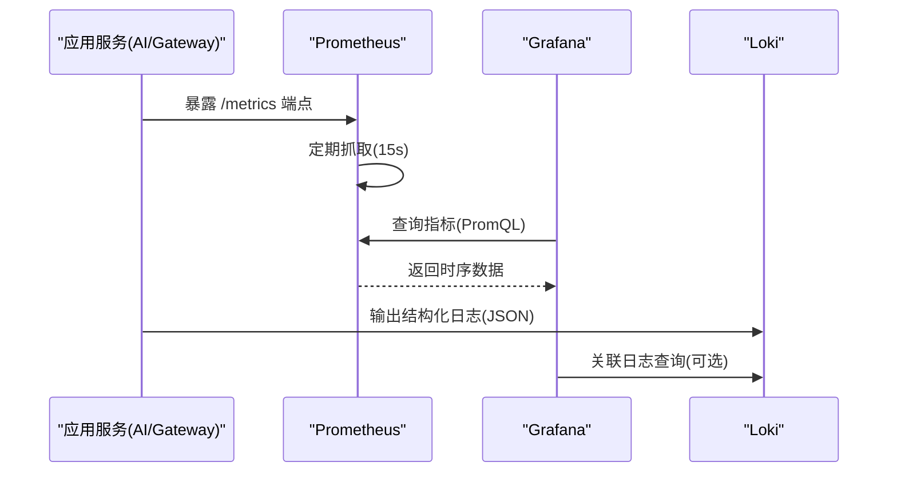
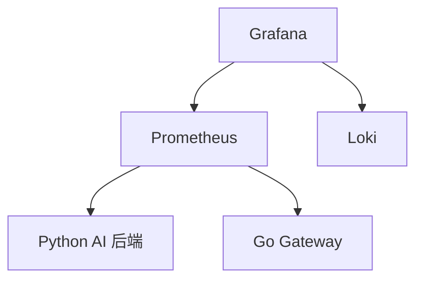

# Grafana 监控看板

<cite>
**本文引用的文件**   
- [nexuscockpit-overview.json](file://config/grafana/provisioning/dashboards/nexuscockpit-overview.json)
- [prometheus.yml（Grafana 数据源）](file://config/grafana/provisioning/datasources/prometheus.yml)
- [dashboards.yml（Grafana 仪表盘提供程序）](file://config/grafana/provisioning/dashboards/dashboards.yml)
- [prometheus.yml（Prometheus 抓取配置）](file://config/prometheus/prometheus.yml)
- [metrics.py（指标定义与采集）](file://backend_design/nexus/observability/metrics.py)
- [unified.py（统一可观测性门面）](file://backend_design/nexus/observability/unified.py)
- [cockpit_metrics.py（座舱级指标采集）](file://backend_design/nexus/observability/cockpit_metrics.py)
- [docker-compose.yml（基础设施编排）](file://docker-compose.yml)
- [loki-config.yml（Loki 日志聚合配置）](file://config/loki/loki-config.yml)
</cite>

## 目录
1. [简介](#简介)
2. [项目结构](#项目结构)
3. [核心组件](#核心组件)
4. [架构总览](#架构总览)
5. [详细组件分析](#详细组件分析)
6. [依赖关系分析](#依赖关系分析)
7. [性能考虑](#性能考虑)
8. [故障排查指南](#故障排查指南)
9. [结论](#结论)
10. [附录](#附录)

## 简介
本文件面向 Grafana 监控看板系统，聚焦 NexusCockpit 预置看板的配置与内容、数据源连接与查询优化、关键指标的可视化配置、告警规则配置方法、自定义仪表板创建指南以及监控最佳实践与性能调优建议。文档基于仓库中的 Prometheus 抓取配置、Grafana 数据源与仪表盘提供程序、Python 后端指标定义与统一可观测性门面、以及 Docker Compose 编排信息进行系统化说明，帮助读者快速搭建并高效使用监控体系。

## 项目结构
与监控相关的核心文件分布如下：
- Grafana 仪表盘与数据源：
  - config/grafana/provisioning/dashboards/nexuscockpit-overview.json：NexusCockpit 概览面板的完整 JSON 定义，包含多个关键指标面板与阈值配置。
  - config/grafana/provisioning/dashboards/dashboards.yml：Grafana 仪表盘提供程序配置，自动从文件加载仪表盘。
  - config/grafana/provisioning/datasources/prometheus.yml：Grafana 默认数据源指向 Prometheus。
- Prometheus 抓取配置：
  - config/prometheus/prometheus.yml：定义对 Python AI 后端、Go Gateway、Milvus、Prometheus 自身的抓取任务与路径。
- 指标定义与采集：
  - backend_design/nexus/observability/metrics.py：使用 prometheus_client 暴露 /metrics 端点，定义请求、延迟、Agent、缓存、RAG、LLM、连接数等指标。
  - backend_design/nexus/observability/unified.py：统一可观测性门面，封装日志、追踪、指标记录入口。
  - backend_design/nexus/observability/cockpit_metrics.py：座舱级指标采集器，写入 Redis 供实时统计与中台聚合。
- 基础设施编排与日志：
  - docker-compose.yml：编排 Prometheus、Grafana、Loki 等服务，挂载配置文件与数据卷。
  - config/loki/loki-config.yml：Loki 单机模式配置，用于日志聚合与查询。

图表来源 
- [prometheus.yml（Prometheus 抓取配置）:1-35](file://config/prometheus/prometheus.yml#L1-L35)
- [docker-compose.yml（基础设施编排）:256-276](file://docker-compose.yml#L256-L276)

章节来源
- [prometheus.yml（Prometheus 抓取配置）:1-35](file://config/prometheus/prometheus.yml#L1-L35)
- [prometheus.yml（Grafana 数据源）:1-14](file://config/grafana/provisioning/datasources/prometheus.yml#L1-L14)
- [dashboards.yml（Grafana 仪表盘提供程序）:1-14](file://config/grafana/provisioning/dashboards/dashboards.yml#L1-L14)
- [nexuscockpit-overview.json:1-800](file://config/grafana/provisioning/dashboards/nexuscockpit-overview.json#L1-L800)

## 核心组件
- Prometheus 抓取配置：
  - 抓取目标包括 Python AI 后端（/metrics）、Go Gateway（/metrics）、Milvus、Prometheus 自身。
  - scrape_interval 与 evaluation_interval 均为 15s，适合开发环境。
- Grafana 数据源与仪表盘：
  - 默认数据源名称为 Prometheus，UID 为 prometheus，访问方式为 proxy，HTTP 方法 POST，时间间隔 15s。
  - 仪表盘提供程序从 /etc/grafana/provisioning/dashboards 加载 JSON 文件，支持编辑与自动更新。
- 指标定义与采集：
  - 请求计数与延迟直方图、Agent 调用计数与延迟、技能执行计数、缓存命中/未命中计数、RAG 检索计数与延迟、LLM 调用计数与延迟、活跃 WebSocket 连接数。
  - 统一门面提供便捷记录方法，便于在业务代码中埋点。
- 座舱级指标：
  - 通过 CockpitMetrics 将对话、车控指令、错误等指标写入 Redis，计算命中率、错误率、平均延迟、成功率等。

章节来源
- [prometheus.yml（Prometheus 抓取配置）:1-35](file://config/prometheus/prometheus.yml#L1-L35)
- [prometheus.yml（Grafana 数据源）:1-14](file://config/grafana/provisioning/datasources/prometheus.yml#L1-L14)
- [metrics.py（指标定义与采集）:1-108](file://backend_design/nexus/observability/metrics.py#L1-L108)
- [unified.py（统一可观测性门面）:1-269](file://backend_design/nexus/observability/unified.py#L1-L269)
- [cockpit_metrics.py（座舱级指标采集）:1-180](file://backend_design/nexus/observability/cockpit_metrics.py#L1-L180)

## 架构总览
下图展示 Prometheus 抓取、Grafana 可视化与 Loki 日志聚合的整体交互流程。

图表来源 
- [prometheus.yml（Prometheus 抓取配置）:1-35](file://config/prometheus/prometheus.yml#L1-L35)
- [prometheus.yml（Grafana 数据源）:1-14](file://config/grafana/provisioning/datasources/prometheus.yml#L1-L14)
- [loki-config.yml（Loki 日志聚合配置）:1-56](file://config/loki/loki-config.yml#L1-L56)

## 详细组件分析

### 预置看板：NexusCockpit 概览面板
概览面板包含以下关键指标与可视化配置：
- API 请求总数（5min）：统计最近 5 分钟所有 API 端点的请求总量，使用阈值颜色区分正常/偏高/异常。
- API P95 延迟：基于直方图分位数计算 P95 毫秒值，设置阈值以识别性能退化。
- 缓存命中率（1h）：统计语义缓存命中比例，低于阈值需关注 Agent 流水线压力。
- 当前活跃连接数：WebSocket 长连接数量，多座舱场景下注意上限。
- API 请求速率（按方法）：按 HTTP 方法分组统计每秒请求量，观察 GET/POST/OPTIONS 分布。
- API 延迟分布（P50/P95/P99）：展示不同分位数的延迟趋势，辅助定位尾部延迟问题。
- Agent 调用速率（1h）：按 agent_name 分组统计调用速率，覆盖 supervisor 与 pipeline 入口。
- 缓存命中/未命中趋势（1h）：对比命中与未命中的速率，评估缓存策略效果。
- Agent 执行延迟（P95, 1h）：Supervisor 节点延迟，反映意图路由与专家调度效率。
- RAG 检索 & LLM 调用延迟（P95）：分别统计向量检索与 LLM API 调用延迟，识别外部依赖瓶颈。

这些面板均基于 Prometheus 指标进行可视化，指标命名与维度与 metrics.py 中定义一致。

章节来源
- [nexuscockpit-overview.json:1-800](file://config/grafana/provisioning/dashboards/nexuscockpit-overview.json#L1-L800)
- [metrics.py（指标定义与采集）:1-108](file://backend_design/nexus/observability/metrics.py#L1-L108)

### 数据源配置：Prometheus 连接与查询优化
- 连接设置：
  - 名称：Prometheus，类型：prometheus，访问方式：proxy，UID：prometheus。
  - URL：http://prometheus:9090，启用 POST 方法与 15s 时间间隔。
- 抓取配置：
  - job_name 分别为 nexus-ai、nexus-gate、milvus、prometheus，对应不同服务的 /metrics 路径。
  - 使用 host.docker.internal 作为目标地址，适用于 Docker 环境。
- 查询优化建议：
  - 使用 rate() 与 increase() 函数计算速率与增量，避免全表扫描。
  - 合理选择时间窗口（如 1m、5m、1h），平衡精度与负载。
  - 利用 by() 分组减少重复计算，结合 histogram_quantile() 计算分位数。
  - 在 Grafana 中设置合适的刷新频率与范围，避免频繁重绘。

章节来源
- [prometheus.yml（Grafana 数据源）:1-14](file://config/grafana/provisioning/datasources/prometheus.yml#L1-L14)
- [prometheus.yml（Prometheus 抓取配置）:1-35](file://config/prometheus/prometheus.yml#L1-L35)

### 关键监控指标的可视化配置
- 请求量趋势：
  - 指标：nexus_requests_total，按 endpoint、method、status 维度。
  - 可视化：timeseries 或 stat，使用 sum(increase(...[5m])) 计算总量。
- 响应时间分布：
  - 指标：nexus_request_latency_seconds_bucket，使用 histogram_quantile() 计算 P50/P95/P99。
  - 可视化：timeseries，单位秒或毫秒，设置阈值线。
- Agent 调用统计：
  - 指标：nexus_agent_invocations_total、nexus_agent_latency_seconds_bucket。
  - 可视化：按 agent_name 分组，统计速率与延迟分位数。
- 缓存命中率：
  - 指标：nexus_cache_hits_total、nexus_cache_misses_total。
  - 可视化：计算命中率百分比，设置阈值颜色。

章节来源
- [nexuscockpit-overview.json:1-800](file://config/grafana/provisioning/dashboards/nexuscockpit-overview.json#L1-L800)
- [metrics.py（指标定义与采集）:1-108](file://backend_design/nexus/observability/metrics.py#L1-L108)

### 告警规则的配置方法
- 阈值设置：
  - 在 Grafana 面板中设置阈值（绿色/黄色/红色），或使用 Alertmanager 规则文件定义条件。
  - 示例：API P95 延迟 > 3s、缓存命中率 < 10%、活跃连接数 > 50。
- 通知渠道：
  - 集成 Email、Webhook、企业微信、钉钉等，通过 Alertmanager 配置路由与模板。
- 告警策略：
  - 分级告警：警告（黄色）与严重（红色）分别处理。
  - 抑制与静默：避免重复告警与夜间打扰。
  - 持续时长：设置持续时间（如 5m）以减少抖动。

注：仓库未提供 Alertmanager 配置文件，建议在部署时补充 rules/alertmanager.yml 并挂载到容器。

章节来源
- [nexuscockpit-overview.json:1-800](file://config/grafana/provisioning/dashboards/nexuscockpit-overview.json#L1-L800)

### 自定义仪表板的创建指南
- 创建步骤：
  - 在 Grafana 中新建 Dashboard，添加 Panel，选择 Prometheus 数据源。
  - 编写 PromQL 查询，预览数据后保存。
- 图表类型选择：
  - 时序数据：timeseries（趋势、分位数）。
  - 数值汇总：stat（总量、比率、当前值）。
  - 分布与占比：pie、bar（方法分布、状态码分布）。
- 布局优化：
  - 将关键指标置于顶部（KPI），趋势图居中，细节图底部。
  - 使用网格对齐，保持视觉一致性。
  - 添加描述与阈值，便于理解与判断。

章节来源
- [dashboards.yml（Grafana 仪表盘提供程序）:1-14](file://config/grafana/provisioning/dashboards/dashboards.yml#L1-L14)

## 依赖关系分析
- 组件耦合：
  - Grafana 依赖 Prometheus 数据源，仪表盘 JSON 引用 UID 为 prometheus。
  - Prometheus 抓取 Python AI 后端与 Go Gateway 的 /metrics 端点。
  - Loki 独立运行，接收结构化日志，可与 Grafana 联动查询。
- 外部依赖：
  - Redis、MySQL、Milvus、Neo4j 等为业务依赖，不直接参与监控链路。
- 潜在循环依赖：
  - 无循环依赖，各组件职责清晰。

图表来源 
- [prometheus.yml（Prometheus 抓取配置）:1-35](file://config/prometheus/prometheus.yml#L1-L35)
- [prometheus.yml（Grafana 数据源）:1-14](file://config/grafana/provisioning/datasources/prometheus.yml#L1-L14)
- [loki-config.yml（Loki 日志聚合配置）:1-56](file://config/loki/loki-config.yml#L1-L56)

章节来源
- [prometheus.yml（Prometheus 抓取配置）:1-35](file://config/prometheus/prometheus.yml#L1-L35)
- [prometheus.yml（Grafana 数据源）:1-14](file://config/grafana/provisioning/datasources/prometheus.yml#L1-L14)
- [loki-config.yml（Loki 日志聚合配置）:1-56](file://config/loki/loki-config.yml#L1-L56)

## 性能考虑
- 指标粒度：
  - 合理设置 buckets（如 0.1s~30s），避免过细导致内存占用过高。
  - 控制标签基数（endpoint、method、status），防止标签爆炸。
- 抓取频率：
  - 开发环境 15s 可接受，生产环境可根据负载调整至 30s 或更长。
- 查询优化：
  - 使用降采样（如 $__interval）与聚合函数减少数据量。
  - 避免在 Grafana 中进行复杂计算，尽量在 PromQL 层完成。
- 存储与保留：
  - Prometheus 数据卷持久化，设置 retention 时间与压缩策略。
  - Loki 日志保留 7 天，避免磁盘无限增长。

章节来源
- [metrics.py（指标定义与采集）:1-108](file://backend_design/nexus/observability/metrics.py#L1-L108)
- [prometheus.yml（Prometheus 抓取配置）:1-35](file://config/prometheus/prometheus.yml#L1-L35)
- [loki-config.yml（Loki 日志聚合配置）:1-56](file://config/loki/loki-config.yml#L1-L56)

## 故障排查指南
- 指标缺失：
  - 检查 /metrics 端点是否可达，确认 Prometheus 抓取任务状态。
  - 验证指标命名与维度是否与仪表盘查询一致。
- 延迟异常：
  - 查看 P95/P99 趋势，定位是网络、数据库还是 LLM 调用瓶颈。
  - 结合日志与追踪（Langfuse）分析具体请求链路。
- 缓存命中率低：
  - 检查缓存策略与键设计，确认车控指令是否绕过缓存。
  - 分析未命中原因（冷启动、键不一致、过期策略）。
- 连接数激增：
  - 检查 WebSocket 连接生命周期，确保客户端正确断开。
  - 监控服务器资源（CPU、内存、文件句柄）。

章节来源
- [nexuscockpit-overview.json:1-800](file://config/grafana/provisioning/dashboards/nexuscockpit-overview.json#L1-L800)
- [unified.py（统一可观测性门面）:1-269](file://backend_design/nexus/observability/unified.py#L1-L269)

## 结论
本监控体系以 Prometheus 为核心，结合 Grafana 可视化与 Loki 日志聚合，提供了完整的 NexusCockpit 可观测性方案。通过预置看板与统一指标定义，用户可快速掌握系统健康状态与性能瓶颈。建议在生产环境中进一步优化指标粒度、抓取频率与告警策略，并结合业务特性定制仪表盘与阈值，以实现更精准的监控与运维。

## 附录
- 常用 PromQL 示例：
  - 请求总量：sum(increase(nexus_requests_total[5m]))
  - P95 延迟：histogram_quantile(0.95, sum(rate(nexus_request_latency_seconds_bucket[5m])) by (le))
  - 缓存命中率：sum(increase(nexus_cache_hits_total[1h])) / clamp_min(sum(increase(nexus_cache_hits_total[1h])) + sum(increase(nexus_cache_misses_total[1h])), 1) * 100
- 部署命令：
  - docker compose up -d（启动基础设施）
  - docker compose --profile app up -d（启动应用服务）

章节来源
- [prometheus.yml（Prometheus 抓取配置）:1-35](file://config/prometheus/prometheus.yml#L1-L35)
- [docker-compose.yml（基础设施编排）:256-276](file://docker-compose.yml#L256-L276)