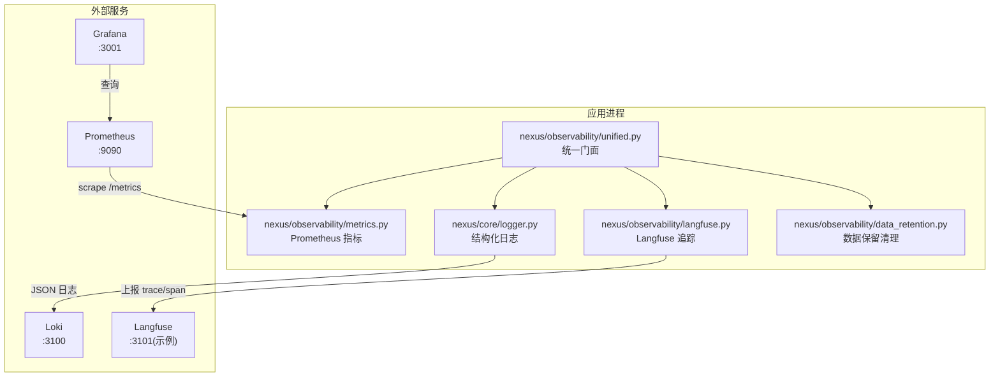
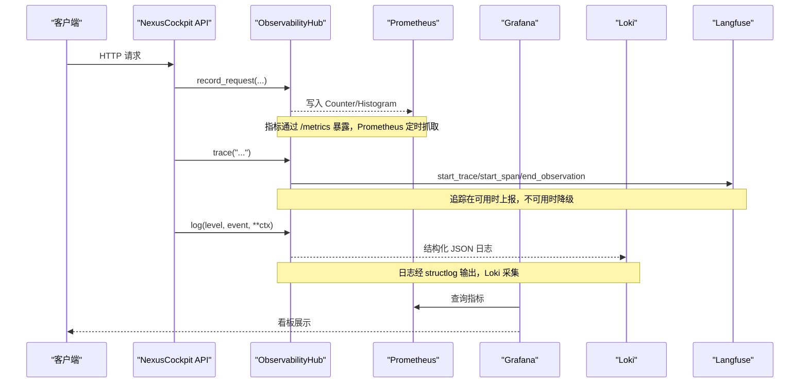
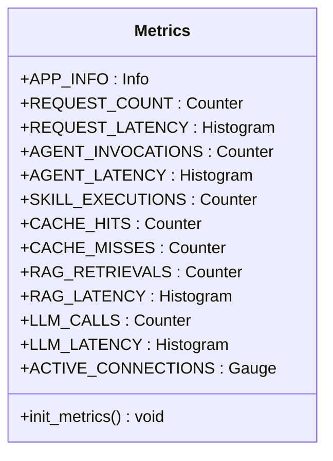
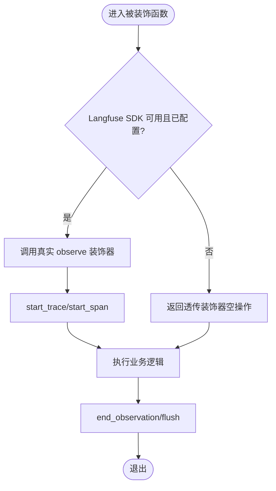
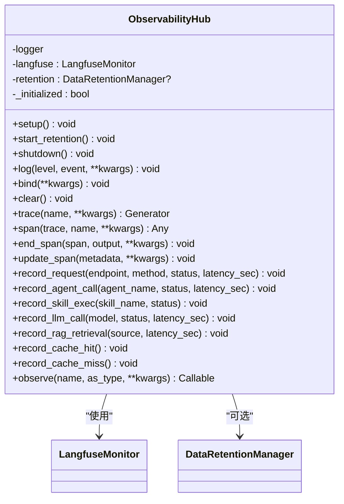
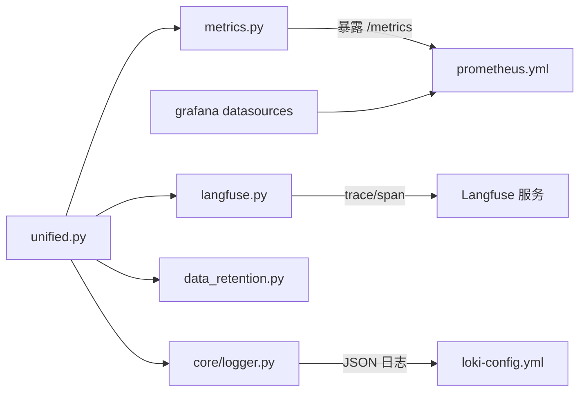

# L7 可观测性层

<cite>
**本文引用的文件**   
- [backend_design/nexus/observability/metrics.py](file://backend_design/nexus/observability/metrics.py)
- [backend_design/nexus/observability/langfuse.py](file://backend_design/nexus/observability/langfuse.py)
- [backend_design/nexus/observability/unified.py](file://backend_design/nexus/observability/unified.py)
- [backend_design/nexus/observability/data_retention.py](file://backend_design/nexus/observability/data_retention.py)
- [backend_design/nexus/config/observability.py](file://backend_design/nexus/config/observability.py)
- [config/prometheus/prometheus.yml](file://config/prometheus/prometheus.yml)
- [config/grafana/provisioning/dashboards/nexuscockpit-overview.json](file://config/grafana/provisioning/dashboards/nexuscockpit-overview.json)
- [config/grafana/provisioning/datasources/prometheus.yml](file://config/grafana/provisioning/datasources/prometheus.yml)
- [config/loki/loki-config.yml](file://config/loki/loki-config.yml)
- [backend_design/nexus/core/logger.py](file://backend_design/nexus/core/logger.py)
- [docs/内部开发存档文档/架构详细设计/L7-observability.md](file://docs/内部开发存档文档/架构详细设计/L7-observability.md)
</cite>

## 目录
1. [简介](#简介)
2. [项目结构](#项目结构)
3. [核心组件](#核心组件)
4. [架构总览](#架构总览)
5. [组件详解](#组件详解)
6. [依赖关系分析](#依赖关系分析)
7. [性能与存储策略](#性能与存储策略)
8. [告警与看板配置](#告警与看板配置)
9. [日志采集与使用（Loki）](#日志采集与使用loki)
10. [故障排查指南](#故障排查指南)
11. [结论](#结论)

## 简介
本章节面向 NexusCockpit 的 L7 可观测性层，系统性阐述 Prometheus 指标采集体系、Langfuse 链路追踪集成、Grafana 看板与告警、以及 Loki 日志收集的使用方式。目标是帮助读者快速理解并落地“指标 + 追踪 + 日志”三位一体的可观测方案，覆盖自定义指标定义、采集频率、存储策略、监控最佳实践与排障要点。

## 项目结构
L7 可观测性层由以下关键部分组成：
- 指标采集：Prometheus 客户端指标定义与统一门面
- 链路追踪：Langfuse 自动降级与装饰器式埋点
- 日志系统：结构化日志（structlog）与脱敏处理
- 数据保留：MySQL 过期数据定期清理
- 可视化与采集配置：Prometheus 抓取配置、Grafana 数据源与面板、Loki 日志服务配置

图表来源
- [backend_design/nexus/observability/unified.py](file://backend_design/nexus/observability/unified.py)
- [backend_design/nexus/observability/metrics.py](file://backend_design/nexus/observability/metrics.py)
- [backend_design/nexus/observability/langfuse.py](file://backend_design/nexus/observability/langfuse.py)
- [backend_design/nexus/core/logger.py](file://backend_design/nexus/core/logger.py)
- [backend_design/nexus/observability/data_retention.py](file://backend_design/nexus/observability/data_retention.py)
- [config/prometheus/prometheus.yml](file://config/prometheus/prometheus.yml)
- [config/grafana/provisioning/datasources/prometheus.yml](file://config/grafana/provisioning/datasources/prometheus.yml)
- [config/loki/loki-config.yml](file://config/loki/loki-config.yml)

章节来源
- [backend_design/nexus/observability/unified.py](file://backend_design/nexus/observability/unified.py)
- [backend_design/nexus/observability/metrics.py](file://backend_design/nexus/observability/metrics.py)
- [backend_design/nexus/observability/langfuse.py](file://backend_design/nexus/observability/langfuse.py)
- [backend_design/nexus/core/logger.py](file://backend_design/nexus/core/logger.py)
- [backend_design/nexus/observability/data_retention.py](file://backend_design/nexus/observability/data_retention.py)
- [config/prometheus/prometheus.yml](file://config/prometheus/prometheus.yml)
- [config/grafana/provisioning/datasources/prometheus.yml](file://config/grafana/provisioning/datasources/prometheus.yml)
- [config/loki/loki-config.yml](file://config/loki/loki-config.yml)

## 核心组件
- 统一门面 ObservabilityHub：集中初始化日志、指标、追踪与数据保留；提供统一的 log/trace/span/record_* 接口，屏蔽底层差异与降级逻辑。
- Prometheus 指标：Counter/Gauge/Histogram/Info 等类型，覆盖请求、Agent、技能、缓存、RAG、LLM、连接数等维度。
- Langfuse 追踪：@observe 装饰器与 LangfuseMonitor，未安装或未配置时自动降级为空操作。
- 结构化日志：基于 structlog 输出 JSON，内置敏感字段脱敏，支持上下文绑定（request_id、user_id、trace_id）。
- 数据保留：后台任务按表粒度清理 MySQL 旧数据，避免磁盘无限增长。

章节来源
- [backend_design/nexus/observability/unified.py](file://backend_design/nexus/observability/unified.py)
- [backend_design/nexus/observability/metrics.py](file://backend_design/nexus/observability/metrics.py)
- [backend_design/nexus/observability/langfuse.py](file://backend_design/nexus/observability/langfuse.py)
- [backend_design/nexus/core/logger.py](file://backend_design/nexus/core/logger.py)
- [backend_design/nexus/observability/data_retention.py](file://backend_design/nexus/observability/data_retention.py)

## 架构总览
下图展示从业务调用到指标采集、追踪上报、日志落盘与可视化的完整链路。

图表来源
- [backend_design/nexus/observability/unified.py](file://backend_design/nexus/observability/unified.py)
- [backend_design/nexus/observability/metrics.py](file://backend_design/nexus/observability/metrics.py)
- [backend_design/nexus/observability/langfuse.py](file://backend_design/nexus/observability/langfuse.py)
- [backend_design/nexus/core/logger.py](file://backend_design/nexus/core/logger.py)
- [config/prometheus/prometheus.yml](file://config/prometheus/prometheus.yml)
- [config/grafana/provisioning/datasources/prometheus.yml](file://config/grafana/provisioning/datasources/prometheus.yml)
- [config/loki/loki-config.yml](file://config/loki/loki-config.yml)

## 组件详解

### Prometheus 指标采集体系
- 指标类型与用途
  - 应用信息：Info 类型用于版本与服务描述
  - 请求指标：Counter 记录总量，Histogram 记录延迟分位
  - Agent 指标：Counter 统计调用次数，Histogram 统计节点延迟
  - 技能指标：Counter 统计执行次数
  - 缓存指标：Counter 统计命中/未命中
  - RAG 指标：Counter 统计检索来源，Histogram 统计检索延迟
  - LLM 指标：Counter 统计调用次数与状态，Histogram 统计延迟
  - 系统指标：Gauge 统计活跃连接数
- 采集频率与存储
  - Prometheus 抓取间隔：15s（全局 scrape_interval）
  - 评估间隔：15s（evaluation_interval）
  - 目标端点：Python 后端 /metrics，Go Gateway /metrics，Milvus 指标端口
- 指标命名与标签
  - 前缀统一为 nexus_
  - 常用标签：endpoint、method、status、agent_name、skill_name、source、model 等

图表来源
- [backend_design/nexus/observability/metrics.py](file://backend_design/nexus/observability/metrics.py)

章节来源
- [backend_design/nexus/observability/metrics.py](file://backend_design/nexus/observability/metrics.py)
- [config/prometheus/prometheus.yml](file://config/prometheus/prometheus.yml)

### Langfuse 追踪系统集成
- 能力概览
  - @observe 装饰器：对 async/sync 函数自动埋点，支持 as_type 参数映射 span/generation/agent
  - update_current_span：更新当前 span 的 metadata
  - LangfuseMonitor：封装 start_trace/start_span/start_generation/end_observation/flush
- 降级策略
  - 未安装 SDK 或环境变量未配置时，自动降级为空操作，不影响业务执行
- 配置项
  - public_key、secret_key、host、db_password、nextauth_secret、salt
  - is_enabled 判断是否启用（需要公钥与密钥同时存在）

图表来源
- [backend_design/nexus/observability/langfuse.py](file://backend_design/nexus/observability/langfuse.py)
- [backend_design/nexus/config/observability.py](file://backend_design/nexus/config/observability.py)

章节来源
- [backend_design/nexus/observability/langfuse.py](file://backend_design/nexus/observability/langfuse.py)
- [backend_design/nexus/config/observability.py](file://backend_design/nexus/config/observability.py)

### 统一可观测性门面（ObservabilityHub）
- 职责
  - 一次性 setup：初始化日志、指标、追踪
  - 统一入口：log/bind/clear、trace/span/update_span、record_* 系列方法
  - 生命周期：start_retention/shutdown 管理后台任务与资源释放
- 上下文传播
  - bind_context/clear_context 确保 request_id/user_id/trace_id 贯穿日志与追踪
- 便捷方法
  - record_request/record_agent_call/record_skill_exec/record_llm_call/record_rag_retrieval/record_cache_hit/record_cache_miss

图表来源
- [backend_design/nexus/observability/unified.py](file://backend_design/nexus/observability/unified.py)
- [backend_design/nexus/observability/langfuse.py](file://backend_design/nexus/observability/langfuse.py)
- [backend_design/nexus/observability/data_retention.py](file://backend_design/nexus/observability/data_retention.py)

章节来源
- [backend_design/nexus/observability/unified.py](file://backend_design/nexus/observability/unified.py)

### 结构化日志与脱敏
- 输出格式
  - 生产环境：JSON（便于 Loki 采集）
  - 开发环境：彩色控制台（便于阅读）
- 脱敏策略
  - 匹配敏感 key（api_key、secret、token、password 等）进行掩码
  - 匹配 Bearer token 与长密钥字符串进行部分掩码
- 上下文绑定
  - merge_contextvars 将 request_id、user_id、trace_id 合并到每条日志

章节来源
- [backend_design/nexus/core/logger.py](file://backend_design/nexus/core/logger.py)

### 数据保留策略（MySQL）
- 策略范围
  - subagent_logs（30天）、mainagent_logs（90天）、audit_logs（180天）、chat_history（30天）、llm_cost_tracking（365天）、cockpit_stats（7天）
- 执行机制
  - 后台任务循环执行 DELETE 旧数据，记录剩余条数与异常
  - 默认间隔 24 小时，可通过 CLEANUP_INTERVAL 调整

章节来源
- [backend_design/nexus/observability/data_retention.py](file://backend_design/nexus/observability/data_retention.py)

## 依赖关系分析
- 模块耦合
  - unified.py 聚合 metrics、langfuse、data_retention、logger，形成门面
  - metrics.py 仅依赖 prometheus_client 暴露指标
  - langfuse.py 依赖配置与 logger，具备强降级能力
  - data_retention.py 依赖数据库管理器与 logger
- 外部依赖
  - Prometheus：抓取 /metrics
  - Grafana：查询 Prometheus 数据源
  - Loki：接收 JSON 日志
  - Langfuse：接收 trace/span 数据

图表来源
- [backend_design/nexus/observability/unified.py](file://backend_design/nexus/observability/unified.py)
- [backend_design/nexus/observability/metrics.py](file://backend_design/nexus/observability/metrics.py)
- [backend_design/nexus/observability/langfuse.py](file://backend_design/nexus/observability/langfuse.py)
- [backend_design/nexus/core/logger.py](file://backend_design/nexus/core/logger.py)
- [backend_design/nexus/observability/data_retention.py](file://backend_design/nexus/observability/data_retention.py)
- [config/prometheus/prometheus.yml](file://config/prometheus/prometheus.yml)
- [config/grafana/provisioning/datasources/prometheus.yml](file://config/grafana/provisioning/datasources/prometheus.yml)
- [config/loki/loki-config.yml](file://config/loki/loki-config.yml)

章节来源
- [backend_design/nexus/observability/unified.py](file://backend_design/nexus/observability/unified.py)
- [config/prometheus/prometheus.yml](file://config/prometheus/prometheus.yml)
- [config/grafana/provisioning/datasources/prometheus.yml](file://config/grafana/provisioning/datasources/prometheus.yml)
- [config/loki/loki-config.yml](file://config/loki/loki-config.yml)

## 性能与存储策略
- 指标采集频率
  - Prometheus 抓取间隔 15s，评估间隔 15s，适合近实时监控
- 直方图桶设置
  - 请求延迟桶：0.1/0.25/0.5/1.0/2.0/5.0/10.0/30.0 秒
  - Agent 延迟桶：0.05/0.1/0.25/0.5/1.0/2.0/5.0 秒
  - LLM 延迟桶：0.5/1.0/2.0/5.0/10.0/30.0 秒
  - RAG 延迟桶：0.05/0.1/0.25/0.5/1.0/2.0/5.0 秒
- 存储与保留
  - Loki 默认保留 168h（7 天），压缩与索引周期 24h
  - MySQL 数据保留按表策略清理，防止无限增长
- 建议
  - 根据业务 QPS 与延迟目标调整直方图桶
  - 合理设置 Prometheus 抓取间隔与保留期
  - 控制指标标签基数，避免高基数字段导致存储膨胀

章节来源
- [backend_design/nexus/observability/metrics.py](file://backend_design/nexus/observability/metrics.py)
- [config/prometheus/prometheus.yml](file://config/prometheus/prometheus.yml)
- [config/loki/loki-config.yml](file://config/loki/loki-config.yml)
- [backend_design/nexus/observability/data_retention.py](file://backend_design/nexus/observability/data_retention.py)

## 告警与看板配置
- 数据源与面板
  - Grafana 数据源：Prometheus（http://prometheus:9090，uid: prometheus）
  - 预置面板：nexuscockpit-overview.json，包含请求总数、P95 延迟、缓存命中率、活跃连接数、各方法速率、延迟分布、Agent 调用速率、缓存命中趋势、Agent 延迟、RAG/LLM 延迟等
- 关键指标表达式（来自面板）
  - 请求总数：sum(increase(nexus_requests_total[5m]))
  - P95 延迟：histogram_quantile(0.95, sum(rate(nexus_request_latency_seconds_bucket[5m])) by (le)) * 1000
  - 缓存命中率：sum(increase(nexus_cache_hits_total[1h])) / clamp_min(sum(increase(nexus_cache_hits_total[1h])) + sum(increase(nexus_cache_misses_total[1h])), 1) * 100
  - 活跃连接数：nexus_active_connections
  - 方法速率：sum(rate(nexus_requests_total[1m])) by (method)
  - 延迟分布：P50/P95/P99 分别对应 0.50/0.95/0.99 分位
  - Agent 调用速率：sum(rate(nexus_agent_invocations_total[1h])) by (agent_name)
  - 缓存命中/未命中趋势：rate(nexus_cache_hits_total[1h]) 与 rate(nexus_cache_misses_total[1h])
  - Agent 延迟 P95：histogram_quantile(0.95, sum(rate(nexus_agent_latency_seconds_bucket[1h])) by (le, agent_name))
- 告警建议
  - 错误率突增：error_rate > 阈值（需结合 status 标签）
  - 延迟超标：P95 > 1s（车载场景建议 < 1s）
  - 缓存命中率过低：< 10%
  - 连接数异常：> 50（多座舱场景）
  - LLM/RAG 延迟异常：P95 > 3s/1s

章节来源
- [config/grafana/provisioning/dashboards/nexuscockpit-overview.json](file://config/grafana/provisioning/dashboards/nexuscockpit-overview.json)
- [config/grafana/provisioning/datasources/prometheus.yml](file://config/grafana/provisioning/datasources/prometheus.yml)

## 日志采集与使用（Loki）
- 配置要点
  - 监听端口：HTTP 3100，gRPC 9096
  - 存储：文件系统（chunks/rules），TSDB schema v12
  - 保留策略：168h，拒绝超过保留期的样本
  - 查询缓存：嵌入式缓存 100MB
- 日志格式
  - JSON 结构：timestamp、level、event、附加字段（如 user_id、intent、trace_id）
  - 脱敏：敏感键名与值自动掩码
- 使用建议
  - 通过统一门面 log() 输出结构化日志
  - 绑定 trace_id 以便与 Langfuse 追踪关联
  - 在 Grafana 中通过 Loki 数据源查询日志，结合指标联动定位问题

章节来源
- [config/loki/loki-config.yml](file://config/loki/loki-config.yml)
- [backend_design/nexus/core/logger.py](file://backend_design/nexus/core/logger.py)
- [backend_design/nexus/observability/unified.py](file://backend_design/nexus/observability/unified.py)

## 故障排查指南
- 指标无法抓取
  - 检查 Prometheus 抓取目标与端口（Python 8000、Gateway 8080、Milvus 9091）
  - 确认 /metrics 路径可达，无鉴权拦截
  - 查看 Prometheus 自身指标 job=“prometheus” 的状态
- 追踪未上报
  - 检查 Langfuse 环境变量（public_key、secret_key、host）
  - 确认 is_enabled 为真；若未配置，观察降级行为是否正常
- 日志缺失或格式异常
  - 确认 structlog 输出为 JSON（生产环境）
  - 检查日志文件路径与权限
  - 验证 Loki 配置与挂载路径
- 数据膨胀
  - 检查 MySQL 数据保留策略是否生效
  - 关注清理任务日志与异常
- 常见告警定位
  - 延迟升高：查看 P95/P99 曲线，结合 Agent/LLM/RAG 延迟定位瓶颈
  - 错误率上升：结合 status 标签与日志 trace_id 定位具体环节
  - 缓存命中率低：检查缓存策略与业务路径（车控指令强制不缓存）

章节来源
- [config/prometheus/prometheus.yml](file://config/prometheus/prometheus.yml)
- [backend_design/nexus/observability/langfuse.py](file://backend_design/nexus/observability/langfuse.py)
- [backend_design/nexus/core/logger.py](file://backend_design/nexus/core/logger.py)
- [backend_design/nexus/observability/data_retention.py](file://backend_design/nexus/observability/data_retention.py)

## 结论
NexusCockpit 的 L7 可观测性层以统一门面为核心，整合了 Prometheus 指标、Langfuse 追踪、结构化日志与数据保留策略，配合 Grafana 与 Loki 实现端到端的监控与诊断能力。通过合理的指标定义、采集频率与存储策略，以及完善的告警与看板配置，可在复杂的多 Agent、RAG、LLM 场景中快速定位问题、保障稳定性与性能。