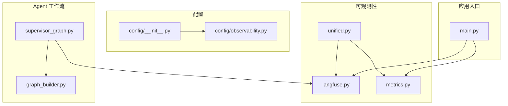
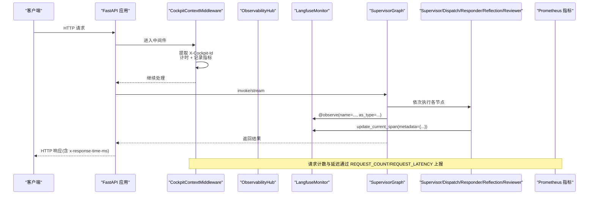
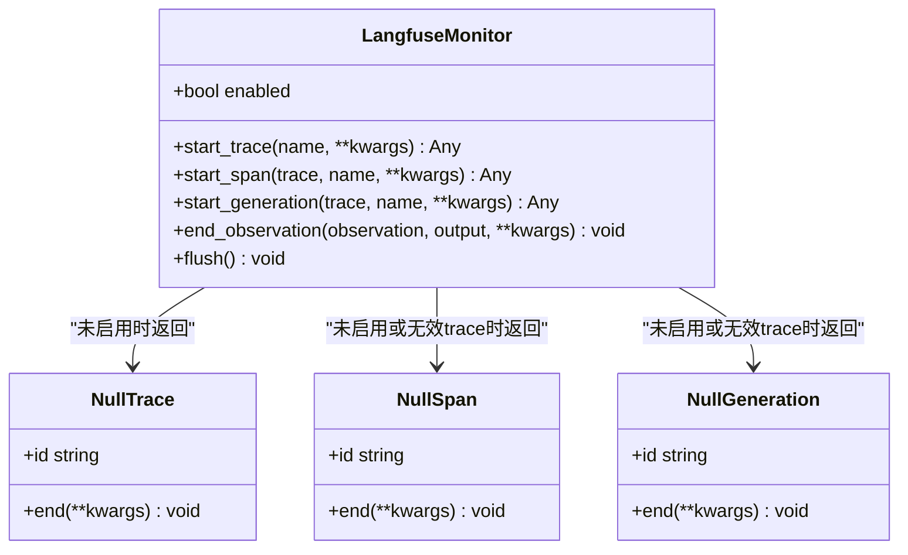
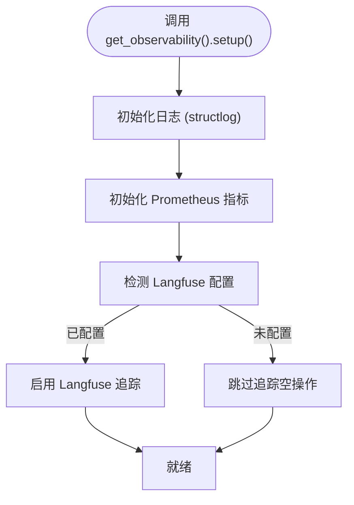
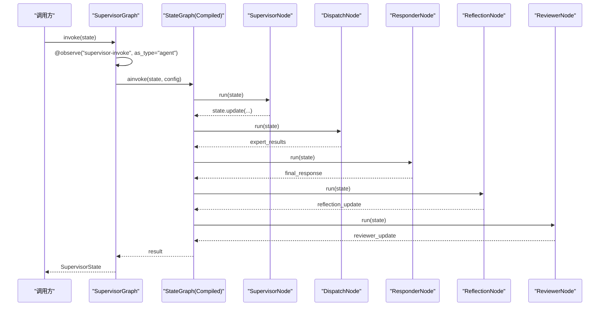
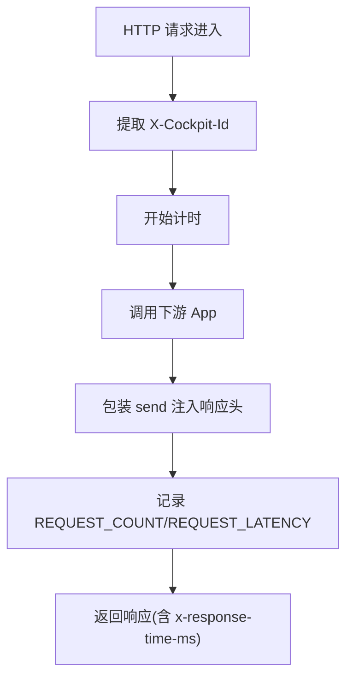
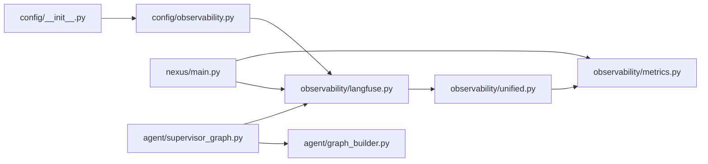

# Langfuse 链路追踪

<cite>
**本文引用的文件**   
- [langfuse.py](file://backend_design/nexus/observability/langfuse.py)
- [unified.py](file://backend_design/nexus/observability/unified.py)
- [metrics.py](file://backend_design/nexus/observability/metrics.py)
- [observability.py](file://backend_design/nexus/config/observability.py)
- [__init__.py](file://backend_design/nexus/config/__init__.py)
- [supervisor_graph.py](file://backend_design/nexus/agent/supervisor_graph.py)
- [graph_builder.py](file://backend_design/nexus/agent/graph_builder.py)
- [main.py](file://backend_design/nexus/main.py)
</cite>

## 目录
1. [简介](#简介)
2. [项目结构](#项目结构)
3. [核心组件](#核心组件)
4. [架构总览](#架构总览)
5. [详细组件分析](#详细组件分析)
6. [依赖关系分析](#依赖关系分析)
7. [性能与可观测性](#性能与可观测性)
8. [故障诊断与最佳实践](#故障诊断与最佳实践)
9. [结论](#结论)
10. [附录：配置与仪表板](#附录配置与仪表板)

## 简介
本文件面向 NexusCockpit 的 Langfuse 链路追踪能力，系统性说明如何集成、使用与扩展追踪能力，覆盖以下要点：
- 追踪上下文传递与 Span 创建管理
- Multi-Agent 工作流（Supervisor、专家 Agent、Responder、Reflection、Reviewer）全链路追踪
- 性能分析：延迟统计、错误追踪、资源使用监控
- FastAPI 中间件自动捕获 HTTP 请求与响应信息
- 追踪数据查询与分析方法
- 平台配置与自定义仪表板设置指南

## 项目结构
与 Langfuse 相关的代码主要分布在 observability、config、agent 与 main 模块中：
- observability/langfuse.py：Langfuse 封装与降级策略、装饰器与上下文更新
- observability/unified.py：统一可观测性门面（日志、指标、追踪、数据保留）
- observability/metrics.py：Prometheus 指标定义与初始化
- config/observability.py：Langfuse 配置项与启用判断
- config/__init__.py：全局配置聚合与单例
- agent/supervisor_graph.py：Multi-Agent 工作流编排入口，内置 observe 装饰器使用
- agent/graph_builder.py：LangGraph 图构建（节点注册、边连接、编译）
- main.py：FastAPI 应用生命周期、中间件与指标端点挂载

**图表来源** 
- [langfuse.py:1-221](file://backend_design/nexus/observability/langfuse.py#L1-L221)
- [unified.py:1-269](file://backend_design/nexus/observability/unified.py#L1-L269)
- [metrics.py:1-108](file://backend_design/nexus/observability/metrics.py#L1-L108)
- [observability.py:1-47](file://backend_design/nexus/config/observability.py#L1-L47)
- [__init__.py:1-167](file://backend_design/nexus/config/__init__.py#L1-L167)
- [supervisor_graph.py:1-617](file://backend_design/nexus/agent/supervisor_graph.py#L1-L617)
- [graph_builder.py:1-120](file://backend_design/nexus/agent/graph_builder.py#L1-L120)
- [main.py:1-673](file://backend_design/nexus/main.py#L1-L673)

**章节来源**
- [langfuse.py:1-221](file://backend_design/nexus/observability/langfuse.py#L1-L221)
- [unified.py:1-269](file://backend_design/nexus/observability/unified.py#L1-L269)
- [metrics.py:1-108](file://backend_design/nexus/observability/metrics.py#L1-L108)
- [observability.py:1-47](file://backend_design/nexus/config/observability.py#L1-L47)
- [__init__.py:1-167](file://backend_design/nexus/config/__init__.py#L1-L167)
- [supervisor_graph.py:1-617](file://backend_design/nexus/agent/supervisor_graph.py#L1-L617)
- [graph_builder.py:1-120](file://backend_design/nexus/agent/graph_builder.py#L1-L120)
- [main.py:1-673](file://backend_design/nexus/main.py#L1-L673)

## 核心组件
- LangfuseMonitor：封装 Langfuse SDK，提供 start_trace/start_span/start_generation/end_observation/flush 等接口，未配置时自动降级为空操作。
- observe 装饰器：对函数进行自动追踪，支持 as_type="span"/"generation"/"agent"；未安装或未配置时透传执行。
- update_current_span：更新当前 span 的 metadata（如 model、latency_ms）。
- ObservabilityHub：统一门面，整合日志、指标、追踪与数据保留，提供 trace/span/update_span 等便捷方法。
- Prometheus 指标：REQUEST_COUNT、REQUEST_LATENCY、AGENT_*、LLM_*、RAG_*、CACHE_* 等。
- FastAPI 中间件：CockpitContextMiddleware 提取租户上下文并记录请求指标，同时注入响应头。

**章节来源**
- [langfuse.py:1-221](file://backend_design/nexus/observability/langfuse.py#L1-L221)
- [unified.py:1-269](file://backend_design/nexus/observability/unified.py#L1-L269)
- [metrics.py:1-108](file://backend_design/nexus/observability/metrics.py#L1-L108)
- [main.py:598-653](file://backend_design/nexus/main.py#L598-L653)

## 架构总览
下图展示从 HTTP 请求进入 FastAPI，到 Multi-Agent 工作流各节点的追踪与指标采集路径。

**图表来源** 
- [main.py:598-653](file://backend_design/nexus/main.py#L598-L653)
- [supervisor_graph.py:183-207](file://backend_design/nexus/agent/supervisor_graph.py#L183-L207)
- [langfuse.py:89-112](file://backend_design/nexus/observability/langfuse.py#L89-L112)
- [metrics.py:20-32](file://backend_design/nexus/observability/metrics.py#L20-L32)

## 详细组件分析

### Langfuse 追踪封装与降级策略
- 观察器装饰器 observe：当 SDK 可用且配置启用时使用真实装饰器；否则返回透传包装，不影响业务逻辑。
- 当前 Span 更新 update_current_span：在 LLM 调用、工具合成等关键步骤写入 model、latency_ms 等元数据。
- LangfuseMonitor：构造时根据配置决定是否初始化 Langfuse 客户端；所有 API 均具备异常保护与空对象降级。

**图表来源** 
- [langfuse.py:144-221](file://backend_design/nexus/observability/langfuse.py#L144-L221)

**章节来源**
- [langfuse.py:27-86](file://backend_design/nexus/observability/langfuse.py#L27-L86)
- [langfuse.py:89-112](file://backend_design/nexus/observability/langfuse.py#L89-L112)
- [langfuse.py:144-221](file://backend_design/nexus/observability/langfuse.py#L144-L221)

### 统一可观测性门面（ObservabilityHub）
- 一次性 setup：初始化日志、指标、追踪（Langfuse 自动检测配置）。
- 统一日志入口 log/bind/clear：绑定 request_id/user_id/trace_id 等上下文。
- 统一追踪入口 trace/span/update_span：自动创建 Langfuse trace，失败时降级为空操作。
- 统一指标入口：record_request/record_agent_call/record_llm_call 等便捷方法。

**图表来源** 
- [unified.py:100-118](file://backend_design/nexus/observability/unified.py#L100-L118)

**章节来源**
- [unified.py:78-136](file://backend_design/nexus/observability/unified.py#L78-L136)
- [unified.py:175-208](file://backend_design/nexus/observability/unified.py#L175-L208)
- [unified.py:213-247](file://backend_design/nexus/observability/unified.py#L213-L247)

### Multi-Agent 工作流追踪（Supervisor、专家、Responder、Reflection、Reviewer）
- SupervisorGraph.invoke/@observe：以 as_type="agent" 标记整个工作流为一次 Agent 调用。
- 各节点内部可通过 update_current_span 追加元数据（如模型名、耗时、状态码等）。
- graph_builder 负责注册节点与边，确保执行顺序与可观测性一致。

**图表来源** 
- [supervisor_graph.py:183-207](file://backend_design/nexus/agent/supervisor_graph.py#L183-L207)
- [graph_builder.py:40-120](file://backend_design/nexus/agent/graph_builder.py#L40-L120)

**章节来源**
- [supervisor_graph.py:183-207](file://backend_design/nexus/agent/supervisor_graph.py#L183-L207)
- [graph_builder.py:40-120](file://backend_design/nexus/agent/graph_builder.py#L40-L120)

### FastAPI 中间件与自动捕获
- CockpitContextMiddleware：纯 ASGI 中间件，提取 X-Cockpit-Id 并设置到 contextvars，避免 BaseHTTPMiddleware 导致的上下文丢失。
- 自动记录请求计数与延迟至 Prometheus，并在响应头注入 x-response-time-ms。
- 排除 /metrics 自引用，避免指标循环。

**图表来源** 
- [main.py:598-653](file://backend_design/nexus/main.py#L598-L653)

**章节来源**
- [main.py:598-653](file://backend_design/nexus/main.py#L598-L653)

## 依赖关系分析
- 配置层：config/__init__.py 聚合 AppConfig，包含 langfuse 子配置；config/observability.py 定义 LangfuseConfig 与 is_enabled 判断。
- 可观测性层：unified.py 依赖 langfuse.py 与 metrics.py；langfuse.py 依赖配置与日志。
- 应用层：main.py 在 lifespan 中初始化 LangfuseMonitor 与 Prometheus 指标，并挂载 /metrics。
- Agent 层：supervisor_graph.py 使用 @observe 装饰器，graph_builder.py 构建执行图。

**图表来源** 
- [__init__.py:84-132](file://backend_design/nexus/config/__init__.py#L84-L132)
- [observability.py:15-33](file://backend_design/nexus/config/observability.py#L15-L33)
- [langfuse.py:144-168](file://backend_design/nexus/observability/langfuse.py#L144-L168)
- [unified.py:94-118](file://backend_design/nexus/observability/unified.py#L94-L118)
- [metrics.py:99-108](file://backend_design/nexus/observability/metrics.py#L99-L108)
- [main.py:168-171](file://backend_design/nexus/main.py#L168-L171)
- [supervisor_graph.py:183-184](file://backend_design/nexus/agent/supervisor_graph.py#L183-L184)
- [graph_builder.py:70-118](file://backend_design/nexus/agent/graph_builder.py#L70-L118)

**章节来源**
- [__init__.py:84-132](file://backend_design/nexus/config/__init__.py#L84-L132)
- [observability.py:15-33](file://backend_design/nexus/config/observability.py#L15-L33)
- [langfuse.py:144-168](file://backend_design/nexus/observability/langfuse.py#L144-L168)
- [unified.py:94-118](file://backend_design/nexus/observability/unified.py#L94-L118)
- [metrics.py:99-108](file://backend_design/nexus/observability/metrics.py#L99-L108)
- [main.py:168-171](file://backend_design/nexus/main.py#L168-L171)
- [supervisor_graph.py:183-184](file://backend_design/nexus/agent/supervisor_graph.py#L183-L184)
- [graph_builder.py:70-118](file://backend_design/nexus/agent/graph_builder.py#L70-L118)

## 性能与可观测性
- 延迟统计
  - HTTP 层：CockpitContextMiddleware 记录 REQUEST_LATENCY（秒），并在响应头返回毫秒级耗时。
  - Agent 层：@observe 与 update_current_span 可在各节点记录 latency_ms、model、status 等。
  - 工作流层：stream_with_events 汇总各阶段 _latency_ms 字段计算总延迟。
- 错误追踪
  - LangfuseMonitor 所有 API 均 try/except 并记录警告/错误日志，未配置时降级为空操作。
  - FastAPI 全局异常处理器统一错误格式，便于前端与日志系统解析。
- 资源使用监控
  - Prometheus 指标涵盖请求、Agent、LLM、RAG、缓存、活跃连接等维度。
  - 启动时初始化 APP_INFO，便于 Grafana/Prometheus 识别服务版本与描述。

**章节来源**
- [main.py:598-653](file://backend_design/nexus/main.py#L598-L653)
- [supervisor_graph.py:596-614](file://backend_design/nexus/agent/supervisor_graph.py#L596-L614)
- [metrics.py:15-96](file://backend_design/nexus/observability/metrics.py#L15-L96)
- [langfuse.py:164-168](file://backend_design/nexus/observability/langfuse.py#L164-L168)

## 故障诊断与最佳实践
- 常见问题定位
  - Langfuse 未启用：检查环境变量 LANGFUSE_PUBLIC_KEY/LANGFUSE_SECRET_KEY；确认 is_enabled 为真。
  - 追踪缺失：确认 @observe 已正确标注关键函数；确认 update_current_span 在各关键路径被调用。
  - 指标无数据：确认 /metrics 端点可达；确认中间件未被绕过；确认未访问 /metrics 自身导致自引用。
- 建议实践
  - 在每个 LLM 调用前后使用 update_current_span 记录 model、latency_ms、status。
  - 在 SupervisorGraph.invoke/stream_with_events 上保留 @observe(as_type="agent") 以便在 Langfuse 平台查看完整 Agent 调用链。
  - 在关键分支（澄清、错误兜底、工具合成）均走 Reflection + Reviewer + Output Gateway，保证一致性。
  - 使用 ObservabilityHub.trace 包裹长流程，自动绑定 trace_id 到日志上下文。

**章节来源**
- [observability.py:29-33](file://backend_design/nexus/config/observability.py#L29-L33)
- [supervisor_graph.py:183-184](file://backend_design/nexus/agent/supervisor_graph.py#L183-L184)
- [main.py:598-653](file://backend_design/nexus/main.py#L598-L653)

## 结论
本项目通过 LangfuseMonitor 与 observe 装饰器实现了轻量、可降级的 LLM 链路追踪；ObservabilityHub 统一了日志、指标与追踪入口；FastAPI 中间件自动捕获 HTTP 指标与响应头；Multi-Agent 工作流在 Supervisor → Dispatch → Responder → Reflection → Reviewer 的全链路中保持强一致性与可观测性。结合 Prometheus/Grafana 与 Langfuse 平台，可实现端到端的性能分析与故障诊断。

## 附录：配置与仪表板
- Langfuse 平台配置
  - 环境变量：LANGFUSE_PUBLIC_KEY、LANGFUSE_SECRET_KEY、LANGFUSE_HOST、LANGFUSE_DB_PASSWORD、LANGFUSE_NEXTAUTH_SECRET、LANGFUSE_SALT。
  - 启用条件：public_key 与 secret_key 非空时 is_enabled 为真。
- Prometheus/Grafana
  - /metrics 端点由 make_asgi_app 挂载；Grafana 数据源指向 Prometheus 地址。
  - 常用指标：nexus_requests_total、nexus_request_latency_seconds、nexus_agent_invocations_total、nexus_llm_calls_total、nexus_rag_retrievals_total、nexus_cache_hits_total 等。
- 自定义仪表板
  - 在 Grafana 中导入/新建面板，基于上述指标绘制 QPS、P95/P99 延迟、错误率、Agent 调用分布、LLM 调用量与延迟、RAG 检索量与延迟、缓存命中率等。
  - 结合 Langfuse 平台的 Trace 视图，关联 trace_id 与 Prometheus 指标，快速定位瓶颈与异常。

**章节来源**
- [observability.py:15-33](file://backend_design/nexus/config/observability.py#L15-L33)
- [metrics.py:15-96](file://backend_design/nexus/observability/metrics.py#L15-L96)
- [main.py:486-488](file://backend_design/nexus/main.py#L486-L488)