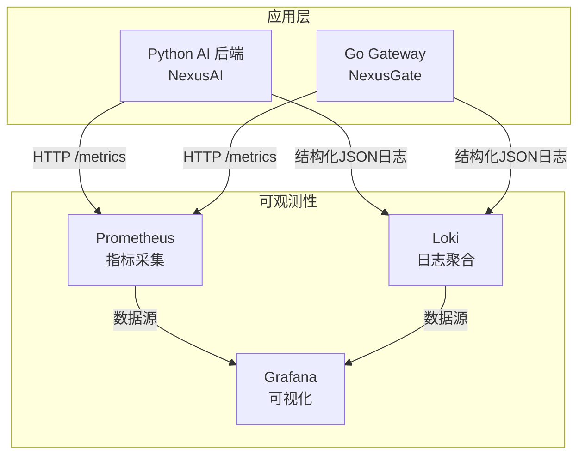
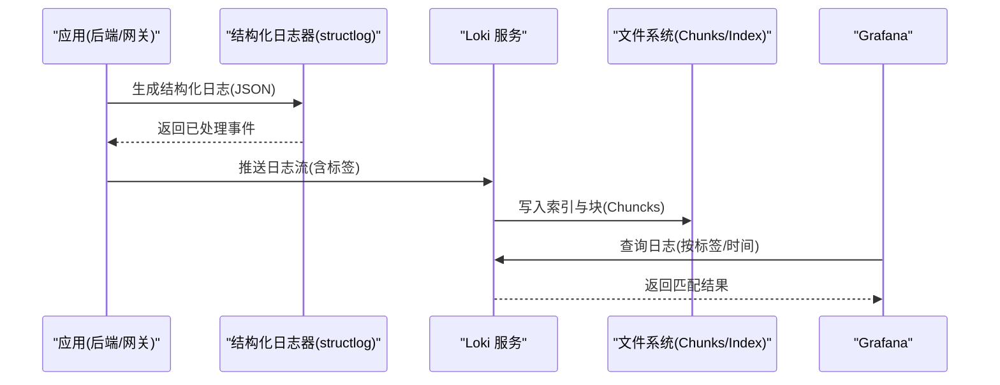
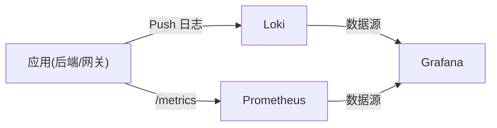

# Loki 日志收集

<cite>
**本文引用的文件**   
- [loki-config.yml](file://config/loki/loki-config.yml)
- [docker-compose.yml](file://docker-compose.yml)
- [logger.py](file://backend_design/nexus/core/logger.py)
- [prometheus.yml](file://config/prometheus/prometheus.yml)
- [observability.py](file://backend_design/nexus/config/observability.py)
</cite>

## 目录
1. [简介](#简介)
2. [项目结构](#项目结构)
3. [核心组件](#核心组件)
4. [架构总览](#架构总览)
5. [详细组件分析](#详细组件分析)
6. [依赖关系分析](#依赖关系分析)
7. [性能与成本优化](#性能与成本优化)
8. [故障排查指南](#故障排查指南)
9. [结论](#结论)
10. [附录：查询语法与常用模式](#附录：查询语法与常用模式)

## 简介
本文件面向 NexusCockpit 项目中的 Loki 日志收集系统，提供从配置、采集、索引、保留到查询与可视化的完整说明。重点覆盖：
- Loki 配置文件参数详解（存储后端、索引策略、保留策略）
- 结构化日志格式规范与标签设计（与 Prometheus 指标关联）
- 日志采集配置（文件路径监听、日志轮转、过滤规则）
- 日志查询语法与常用模式（基于标签快速检索）
- 日志聚合与分析方法，以及与 Grafana 的集成
- 优化建议（存储成本控制、查询性能调优）

## 项目结构
本项目在 Docker Compose 中统一编排 Loki、Prometheus、Grafana 等基础设施服务，并通过挂载配置文件实现可观测性能力。Loki 的配置文件位于 config/loki/loki-config.yml，由 docker-compose.yml 挂载至容器内 /etc/loki/local-config.yml。

图表来源 
- [docker-compose.yml:248-276](file://docker-compose.yml#L248-L276)
- [prometheus.yml:1-35](file://config/prometheus/prometheus.yml#L1-L35)

章节来源
- [docker-compose.yml:248-276](file://docker-compose.yml#L248-L276)
- [prometheus.yml:1-35](file://config/prometheus/prometheus.yml#L1-L35)

## 核心组件
- Loki 服务端配置：定义 HTTP/gRPC 端口、存储后端、索引与对象存储、压缩与保留策略、查询缓存等。
- 结构化日志模块：基于 structlog 输出 JSON 格式，内置敏感信息脱敏，便于 Loki 采集与解析。
- Prometheus 指标采集：为后端与网关暴露 /metrics，供 Grafana 展示并与日志联动。
- Grafana 数据源：通过 provision 自动注入 Prometheus 数据源，后续可扩展 Loki 数据源。

章节来源
- [loki-config.yml:1-56](file://config/loki/loki-config.yml#L1-L56)
- [logger.py:1-249](file://backend_design/nexus/core/logger.py#L1-L249)
- [prometheus.yml:1-35](file://config/prometheus/prometheus.yml#L1-L35)
- [observability.py:1-47](file://backend_design/nexus/config/observability.py#L1-L47)

## 架构总览
下图展示了日志从应用侧产生、结构化输出、被 Loki 接收并持久化，再到 Grafana 可视化的整体流程。

图表来源 
- [docker-compose.yml:248-276](file://docker-compose.yml#L248-L276)
- [loki-config.yml:1-56](file://config/loki/loki-config.yml#L1-L56)
- [logger.py:1-249](file://backend_design/nexus/core/logger.py#L1-L249)

## 详细组件分析

### Loki 服务端配置详解
- 网络与服务
  - HTTP 监听端口：用于 API 访问（如 Push/Query）。
  - gRPC 监听端口：用于高性能日志写入。
- 通用配置
  - 实例地址与路径前缀：控制服务发现与路由。
  - 存储：使用本地文件系统作为 chunks 与 rules 目录。
  - 复制因子与 Ring：单机模式使用内存 kvstore。
- 索引与对象存储
  - schema v12，TSDB 存储，对象存储使用 filesystem。
  - 索引前缀与周期：index_ 前缀，24h 周期分片。
- 限制与保留
  - 保留期：默认 168h（7天），拒绝旧样本。
  - 最大查询系列数：限制并发查询规模。
- 压缩与保留
  - compactor 工作目录与共享存储启用，开启保留清理。
- 查询缓存
  - 启用嵌入式结果缓存，提升重复查询性能。
- 分析上报
  - 关闭匿名使用统计上报。

章节来源
- [loki-config.yml:1-56](file://config/loki/loki-config.yml#L1-L56)

### 结构化日志规范与标签设计
- 输出格式
  - 生产环境：JSON 格式，包含时间戳、级别、模块名、上下文变量等。
  - 开发环境：彩色控制台输出，便于调试。
- 敏感信息脱敏
  - 对 key 名称匹配 api_key/secret/token/password 等进行掩码。
  - 对 Bearer token 与长密钥字符串进行部分掩码。
- 上下文绑定
  - 支持绑定 request_id、user_id 等字段，便于链路追踪与聚合。
- 与 Prometheus 指标关联
  - 建议在日志中携带 service、job、instance 等标签，与 Prometheus 指标保持一致，便于 Grafana 中日志与指标联动。

章节来源
- [logger.py:1-249](file://backend_design/nexus/core/logger.py#L1-L249)
- [prometheus.yml:1-35](file://config/prometheus/prometheus.yml#L1-L35)

### 日志采集配置（文件路径监听、轮转与过滤）
- 采集方式
  - 当前项目采用应用侧直接推送到 Loki 的方式（HTTP/gRPC），而非文件尾随采集。
- 文件路径监听
  - 若需文件采集，可在 Loki 或 sidecar（如 Promtail）中配置 file_paths 与 labels。
- 日志轮转
  - 应用侧 logger.py 按日期生成日志文件；如需集中管理，可结合外部轮转工具（如 logrotate）。
- 过滤规则
  - 应用侧通过处理器进行敏感字段脱敏；可按需在采集端增加正则过滤，减少无关日志入库。

章节来源
- [logger.py:1-249](file://backend_design/nexus/core/logger.py#L1-L249)
- [docker-compose.yml:248-276](file://docker-compose.yml#L248-L276)

### 日志查询语法与常用模式
- 基础语法
  - 使用 {label="value"} 选择器过滤标签，配合 | regexp 进行内容过滤。
- 常用模式
  - 按服务与级别筛选：{service="nexus-ai", level="error"}
  - 按时间范围查询：{service="nexus-gate"} |= "timeout" | line_format "{{.Line}}"
  - 聚合统计：count_over_time({service="nexus-ai"}[5m])
- 与指标联动
  - 在 Grafana 中将日志面板与 Prometheus 指标面板同屏展示，通过相同标签（service、instance）进行关联。

章节来源
- [prometheus.yml:1-35](file://config/prometheus/prometheus.yml#L1-L35)
- [observability.py:1-47](file://backend_design/nexus/config/observability.py#L1-L47)

### 与 Grafana 的集成配置
- 数据源
  - Prometheus 数据源通过 provisioning 自动注入。
  - 可扩展添加 Loki 数据源，指向 Loki 服务地址。
- 仪表盘
  - 可通过 provision dashboards 自动加载预置面板，展示指标与日志联动视图。

章节来源
- [docker-compose.yml:266-276](file://docker-compose.yml#L266-L276)
- [prometheus.yml:1-35](file://config/prometheus/prometheus.yml#L1-L35)

## 依赖关系分析
- 应用依赖
  - Python 后端与 Go 网关均通过 HTTP/gRPC 向 Loki 推送日志。
  - 两者同时暴露 /metrics 给 Prometheus 采集。
- 基础设施依赖
  - Loki 使用本地文件系统存储索引与块。
  - Grafana 依赖 Prometheus 与 Loki 数据源。

图表来源 
- [docker-compose.yml:248-276](file://docker-compose.yml#L248-L276)
- [prometheus.yml:1-35](file://config/prometheus/prometheus.yml#L1-L35)

章节来源
- [docker-compose.yml:248-276](file://docker-compose.yml#L248-L276)
- [prometheus.yml:1-35](file://config/prometheus/prometheus.yml#L1-L35)

## 性能与成本优化
- 存储成本控制
  - 合理设置 retention_period（当前 168h），避免长期堆积。
  - 使用 TSDB 与对象存储 filesystem，确保索引与块分离，利于压缩与清理。
  - 启用 compactor 与 retention_enabled，定期清理过期数据。
- 查询性能调优
  - 启用 query_range 结果缓存（embedded_cache），提高重复查询命中率。
  - 限制 max_query_series，防止大查询拖垮服务。
  - 合理设计标签维度，避免高基数标签导致索引膨胀。
- 采集优化
  - 在应用侧进行敏感信息与噪声日志过滤，减少无效数据入库。
  - 使用 gRPC 写入（如适用）提升吞吐。

章节来源
- [loki-config.yml:1-56](file://config/loki/loki-config.yml#L1-L56)
- [logger.py:1-249](file://backend_design/nexus/core/logger.py#L1-L249)

## 故障排查指南
- 常见问题
  - 无法连接 Loki：检查 HTTP/gRPC 端口与网络连通性。
  - 日志未入库：确认应用侧推送成功，检查 Loki 存储目录权限。
  - 查询缓慢：查看是否命中缓存，评估标签基数与查询范围。
- 定位步骤
  - 查看应用日志文件（logger.py 生成的 backend_logs 目录）。
  - 检查 Prometheus 抓取状态与目标健康度。
  - 在 Grafana 中切换数据源验证 Loki 连通性。

章节来源
- [logger.py:1-249](file://backend_design/nexus/core/logger.py#L1-L249)
- [prometheus.yml:1-35](file://config/prometheus/prometheus.yml#L1-L35)

## 结论
本项目通过结构化日志与 Loki/Prometheus/Grafana 的组合，实现了统一的日志与指标可观测体系。合理的配置与标签设计是保证查询效率与存储成本的关键。建议在生产环境中持续监控 Loki 的存储增长与查询延迟，动态调整保留策略与标签维度。

## 附录：查询语法与常用模式
- 标签选择器
  - {service="nexus-ai"}、{level="error"}、{instance="host.docker.internal:8000"}
- 内容过滤
  - |= "error"、| regexp ".*exception.*"
- 时间窗口与聚合
  - count_over_time({service="nexus-gate"}[1h])
  - sum by (level) (count_over_time({service="nexus-ai"}[5m]))
- 与指标联动
  - 在 Grafana 中使用相同的 service/instance 标签，将日志与指标面板对齐展示。

章节来源
- [prometheus.yml:1-35](file://config/prometheus/prometheus.yml#L1-L35)
- [observability.py:1-47](file://backend_design/nexus/config/observability.py#L1-L47)