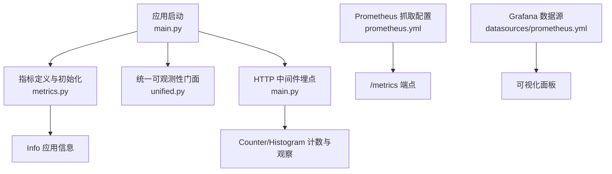
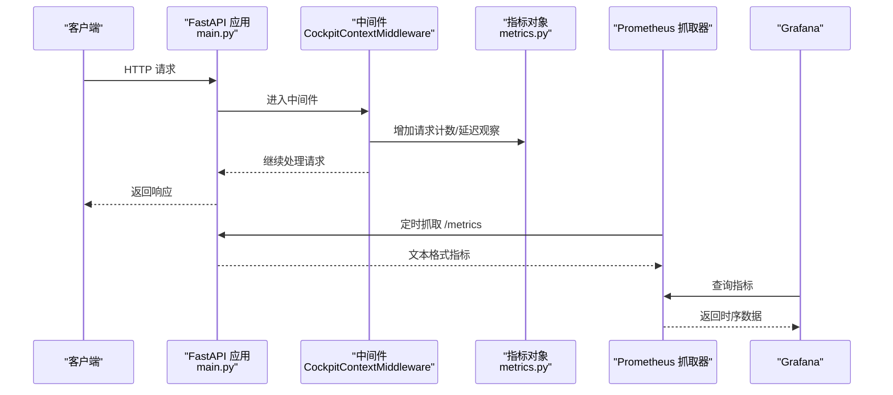
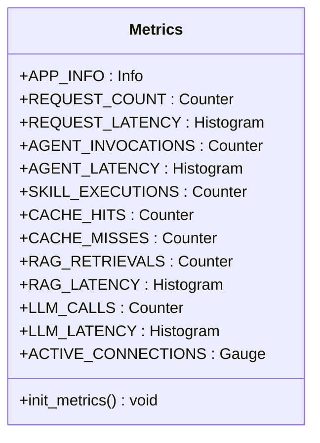
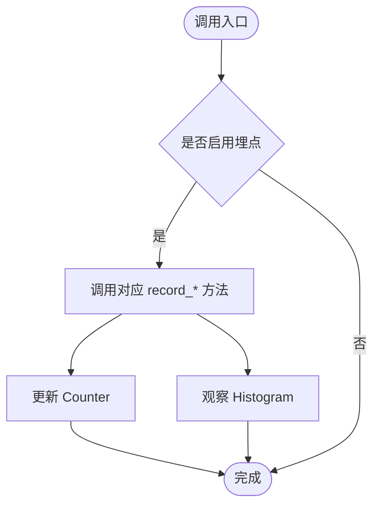
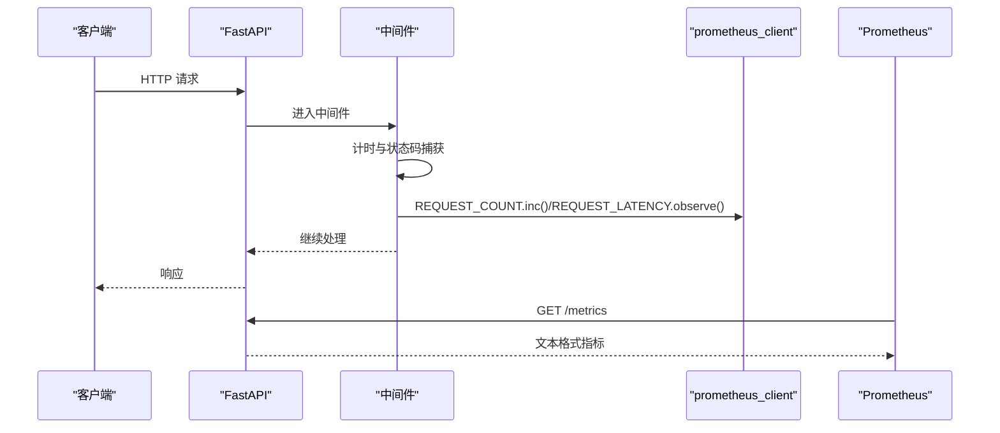
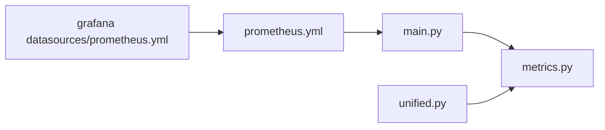

# Prometheus 指标采集

<cite>
**本文引用的文件**   
- [backend_design/nexus/observability/metrics.py](file://backend_design/nexus/observability/metrics.py)
- [backend_design/nexus/main.py](file://backend_design/nexus/main.py)
- [config/prometheus/prometheus.yml](file://config/prometheus/prometheus.yml)
- [config/grafana/provisioning/datasources/prometheus.yml](file://config/grafana/provisioning/datasources/prometheus.yml)
- [backend_design/nexus/observability/unified.py](file://backend_design/nexus/observability/unified.py)
- [backend_design/nexus/middleware/redis_cache.py](file://backend_design/nexus/middleware/redis_cache.py)
</cite>

## 目录
1. [简介](#简介)
2. [项目结构](#项目结构)
3. [核心组件](#核心组件)
4. [架构总览](#架构总览)
5. [详细组件分析](#详细组件分析)
6. [依赖关系分析](#依赖关系分析)
7. [性能考虑](#性能考虑)
8. [故障排查指南](#故障排查指南)
9. [结论](#结论)
10. [附录](#附录)

## 简介
本文件面向 Prometheus 指标采集系统，系统化说明 NexusCockpit 中自定义指标的定义、分类与使用方式，涵盖请求指标（REQUEST_COUNT、REQUEST_LATENCY）、Agent 指标（AGENT_INVOCATIONS、AGENT_LATENCY）、技能指标（SKILL_EXECUTIONS）、缓存指标（CACHE_HITS、CACHE_MISSES）、RAG 指标（RAG_RETRIEVALS、RAG_LATENCY）和 LLM 指标（LLM_CALLS、LLM_LATENCY）。文档同时解释 Counter、Gauge、Histogram、Info 等指标类型的使用场景与配置要点，说明 /metrics 端点的暴露机制与数据格式，并给出 Prometheus 抓取配置、Grafana 数据源配置、查询示例与性能优化建议。

## 项目结构
与 Prometheus 指标相关的关键位置：
- 指标定义与初始化：backend_design/nexus/observability/metrics.py
- 统一可观测性门面（便捷记录方法）：backend_design/nexus/observability/unified.py
- HTTP 中间件埋点与 /metrics 挂载：backend_design/nexus/main.py
- Prometheus 抓取配置：config/prometheus/prometheus.yml
- Grafana 数据源配置：config/grafana/provisioning/datasources/prometheus.yml
- 缓存命中/未命中埋点参考：backend_design/nexus/middleware/redis_cache.py

图表来源 
- [backend_design/nexus/main.py:486-488](file://backend_design/nexus/main.py#L486-L488)
- [backend_design/nexus/observability/metrics.py:15-96](file://backend_design/nexus/observability/metrics.py#L15-L96)
- [config/prometheus/prometheus.yml:1-35](file://config/prometheus/prometheus.yml#L1-L35)
- [config/grafana/provisioning/datasources/prometheus.yml:1-14](file://config/grafana/provisioning/datasources/prometheus.yml#L1-L14)

章节来源
- [backend_design/nexus/main.py:486-488](file://backend_design/nexus/main.py#L486-L488)
- [backend_design/nexus/observability/metrics.py:15-96](file://backend_design/nexus/observability/metrics.py#L15-L96)
- [config/prometheus/prometheus.yml:1-35](file://config/prometheus/prometheus.yml#L1-L35)
- [config/grafana/provisioning/datasources/prometheus.yml:1-14](file://config/grafana/provisioning/datasources/prometheus.yml#L1-L14)

## 核心组件
- 指标定义模块（metrics.py）
  - 使用 prometheus_client 的 Counter、Gauge、Histogram、Info 定义全局指标对象，并在 init_metrics() 中设置 Info 元数据。
  - 覆盖请求、Agent、技能、缓存、RAG、LLM、连接数等关键维度。
- 统一可观测性门面（unified.py）
  - 提供统一的 record_* 方法封装指标上报，便于在各层调用时简化代码。
- HTTP 中间件（main.py）
  - 在请求生命周期内统计 REQUEST_COUNT 与 REQUEST_LATENCY，并挂载 /metrics 端点。
- 缓存埋点（redis_cache.py）
  - 在语义缓存命中/未命中路径中更新 CACHE_HITS/CACHE_MISSES。

章节来源
- [backend_design/nexus/observability/metrics.py:15-96](file://backend_design/nexus/observability/metrics.py#L15-L96)
- [backend_design/nexus/observability/unified.py:213-247](file://backend_design/nexus/observability/unified.py#L213-L247)
- [backend_design/nexus/main.py:598-652](file://backend_design/nexus/main.py#L598-L652)
- [backend_design/nexus/middleware/redis_cache.py:1-200](file://backend_design/nexus/middleware/redis_cache.py#L1-L200)

## 架构总览
下图展示从 HTTP 请求到指标暴露的全链路流程，以及 Prometheus 抓取与 Grafana 可视化的关系。

图表来源 
- [backend_design/nexus/main.py:486-488](file://backend_design/nexus/main.py#L486-L488)
- [backend_design/nexus/main.py:598-652](file://backend_design/nexus/main.py#L598-L652)
- [config/prometheus/prometheus.yml:1-35](file://config/prometheus/prometheus.yml#L1-L35)
- [config/grafana/provisioning/datasources/prometheus.yml:1-14](file://config/grafana/provisioning/datasources/prometheus.yml#L1-L14)

## 详细组件分析

### 指标定义与类型说明（metrics.py）
- Info
  - 用途：应用版本、服务名、描述等静态元数据。
  - 配置：通过 init_metrics() 设置键值对。
- Counter
  - 用途：单调递增计数，如请求总数、Agent 调用次数、技能执行次数、缓存命中/未命中、RAG 检索次数、LLM 调用次数。
  - 标签：endpoint/method/status、agent_name/status、skill_name/status、source、model/status 等。
- Histogram
  - 用途：延迟分布统计，如请求延迟、Agent 节点延迟、RAG 检索延迟、LLM 调用延迟。
  - 分桶：按业务需求设置 buckets，覆盖常用延迟区间。
- Gauge
  - 用途：瞬时值，如当前活跃 WebSocket 连接数。

图表来源 
- [backend_design/nexus/observability/metrics.py:15-96](file://backend_design/nexus/observability/metrics.py#L15-L96)

章节来源
- [backend_design/nexus/observability/metrics.py:15-96](file://backend_design/nexus/observability/metrics.py#L15-L96)

### 统一可观测性门面（unified.py）
- 提供便捷方法统一记录各类指标，避免在各处直接操作底层指标对象。
- 支持 request/agent/skill/cache/rag/llm 等常见场景的快速上报。

图表来源 
- [backend_design/nexus/observability/unified.py:213-247](file://backend_design/nexus/observability/unified.py#L213-L247)

章节来源
- [backend_design/nexus/observability/unified.py:213-247](file://backend_design/nexus/observability/unified.py#L213-L247)

### HTTP 中间件埋点与 /metrics 暴露（main.py）
- 中间件 CockpitContextMiddleware：
  - 提取 X-Cockpit-Id 上下文。
  - 计时并记录 REQUEST_COUNT、REQUEST_LATENCY。
  - 排除 /metrics 自身以避免自引用。
- /metrics 端点：
  - 通过 make_asgi_app() 挂载，由 prometheus_client 自动暴露文本格式指标。

图表来源 
- [backend_design/nexus/main.py:486-488](file://backend_design/nexus/main.py#L486-L488)
- [backend_design/nexus/main.py:598-652](file://backend_design/nexus/main.py#L598-L652)

章节来源
- [backend_design/nexus/main.py:486-488](file://backend_design/nexus/main.py#L486-L488)
- [backend_design/nexus/main.py:598-652](file://backend_design/nexus/main.py#L598-L652)

### 缓存指标埋点（redis_cache.py）
- 语义缓存命中/未命中路径应分别调用 CACHE_HITS.inc() 与 CACHE_MISSES.inc()。
- 建议在 Redis 连接建立后确保索引可用，失败时降级并记录日志。

章节来源
- [backend_design/nexus/middleware/redis_cache.py:1-200](file://backend_design/nexus/middleware/redis_cache.py#L1-L200)

## 依赖关系分析
- main.py 依赖 metrics.py 中的指标对象与 init_metrics()。
- unified.py 聚合 metrics.py 的指标对象，提供统一接口。
- prometheus.yml 配置抓取目标与间隔，指向 Python 后端与 Go Gateway 的 /metrics。
- Grafana datasources/prometheus.yml 配置数据源以访问 Prometheus。

图表来源 
- [backend_design/nexus/main.py:486-488](file://backend_design/nexus/main.py#L486-L488)
- [backend_design/nexus/observability/unified.py:213-247](file://backend_design/nexus/observability/unified.py#L213-L247)
- [config/prometheus/prometheus.yml:1-35](file://config/prometheus/prometheus.yml#L1-L35)
- [config/grafana/provisioning/datasources/prometheus.yml:1-14](file://config/grafana/provisioning/datasources/prometheus.yml#L1-L14)

章节来源
- [backend_design/nexus/main.py:486-488](file://backend_design/nexus/main.py#L486-L488)
- [backend_design/nexus/observability/unified.py:213-247](file://backend_design/nexus/observability/unified.py#L213-L247)
- [config/prometheus/prometheus.yml:1-35](file://config/prometheus/prometheus.yml#L1-L35)
- [config/grafana/provisioning/datasources/prometheus.yml:1-14](file://config/grafana/provisioning/datasources/prometheus.yml#L1-L14)

## 性能考虑
- 指标标签基数控制
  - 避免高基数字段（如用户 ID、随机会话 ID）作为标签；必要时进行采样或聚合。
- Histogram 分桶设计
  - 根据业务延迟分布合理设置 buckets，减少不必要的桶数量，降低内存占用。
- 抓取间隔与评估间隔
  - 默认 15s，可根据负载与监控粒度调整 scrape_interval 与 evaluation_interval。
- 中间件开销
  - 中间件仅做轻量级计数与观察，避免在高频路径中进行复杂计算。
- 缓存命中率
  - 提升 CACHE_HITS 比例可降低下游压力，关注 CACHE_MISSES 异常增长。
- 连接数监控
  - ACTIVE_CONNECTIONS 用于识别连接泄漏或突发流量。

[本节为通用指导，不直接分析具体文件]

## 故障排查指南
- /metrics 无法访问
  - 确认 FastAPI 已挂载 /metrics 端点。
  - 检查 Prometheus 抓取配置 targets 与 metrics_path。
- 指标缺失或为 0
  - 检查中间件是否正确记录 REQUEST_COUNT/REQUEST_LATENCY。
  - 检查各模块是否调用对应的 record_* 方法。
- 指标基数爆炸
  - 审查标签维度，移除高基数字段或进行聚合。
- 延迟分布异常
  - 检查 Histogram 分桶是否合理，确认 observe 调用时机。
- 缓存指标不更新
  - 确认缓存命中/未命中路径均正确调用 CACHE_HITS/CACHE_MISSES。

章节来源
- [backend_design/nexus/main.py:486-488](file://backend_design/nexus/main.py#L486-L488)
- [backend_design/nexus/main.py:598-652](file://backend_design/nexus/main.py#L598-L652)
- [config/prometheus/prometheus.yml:1-35](file://config/prometheus/prometheus.yml#L1-L35)

## 结论
NexusCockpit 的 Prometheus 指标体系覆盖了请求、Agent、技能、缓存、RAG、LLM 及连接数等关键维度，采用 Counter/Gauge/Histogram/Info 四类指标类型满足不同观测需求。通过中间件埋点与统一门面简化了上报逻辑，配合 Prometheus 抓取与 Grafana 可视化形成完整的可观测闭环。建议持续优化标签基数与 Histogram 分桶，结合缓存命中率与延迟分布进行容量规划与性能调优。

[本节为总结，不直接分析具体文件]

## 附录

### 指标清单与类型
- 请求指标
  - REQUEST_COUNT（Counter）：endpoint、method、status
  - REQUEST_LATENCY（Histogram）：endpoint
- Agent 指标
  - AGENT_INVOCATIONS（Counter）：agent_name、status
  - AGENT_LATENCY（Histogram）：agent_name
- 技能指标
  - SKILL_EXECUTIONS（Counter）：skill_name、status
- 缓存指标
  - CACHE_HITS（Counter）
  - CACHE_MISSES（Counter）
- RAG 指标
  - RAG_RETRIEVALS（Counter）：source
  - RAG_LATENCY（Histogram）
- LLM 指标
  - LLM_CALLS（Counter）：model、status
  - LLM_LATENCY（Histogram）
- 系统指标
  - ACTIVE_CONNECTIONS（Gauge）

章节来源
- [backend_design/nexus/observability/metrics.py:15-96](file://backend_design/nexus/observability/metrics.py#L15-L96)

### /metrics 端点与数据格式
- 端点挂载：通过 make_asgi_app() 挂载至 /metrics。
- 数据格式：prometheus_client 输出的文本格式（text/plain），包含指标名、标签、值与时间戳。

章节来源
- [backend_design/nexus/main.py:486-488](file://backend_design/nexus/main.py#L486-L488)

### Prometheus 抓取配置详解
- global.scrape_interval：抓取间隔（默认 15s）。
- global.evaluation_interval：规则评估间隔（默认 15s）。
- scrape_configs：
  - job_name：任务名称（nexus-ai、nexus-gate、milvus、prometheus）。
  - static_configs.targets：目标地址（host.docker.internal:端口）。
  - labels：附加标签（service）。
  - metrics_path：指标路径（/metrics）。

章节来源
- [config/prometheus/prometheus.yml:1-35](file://config/prometheus/prometheus.yml#L1-L35)

### Grafana 数据源配置
- name：数据源名称（Prometheus）。
- type：类型（prometheus）。
- url：Prometheus 服务地址（http://prometheus:9090）。
- isDefault：默认数据源。
- jsonData.httpMethod：HTTP 方法（POST）。
- jsonData.timeInterval：默认时间间隔（15s）。

章节来源
- [config/grafana/provisioning/datasources/prometheus.yml:1-14](file://config/grafana/provisioning/datasources/prometheus.yml#L1-L14)

### 指标查询示例
- 请求总量（按 endpoint）
  - sum by (endpoint) (rate(nexus_requests_total[5m]))
- 请求延迟 P95（按 endpoint）
  - histogram_quantile(0.95, sum by (le, endpoint) (rate(nexus_request_latency_seconds_bucket[5m])))
- Agent 调用成功率
  - sum(rate(nexus_agent_invocations_total{status="ok"}[5m])) / sum(rate(nexus_agent_invocations_total[5m]))
- 缓存命中率
  - sum(rate(nexus_cache_hits_total[5m])) / (sum(rate(nexus_cache_hits_total[5m])) + sum(rate(nexus_cache_misses_total[5m])))
- RAG 检索量（按 source）
  - sum by (source) (rate(nexus_rag_retrievals_total[5m]))
- LLM 调用延迟中位数
  - histogram_quantile(0.5, sum by (le) (rate(nexus_llm_latency_seconds_bucket[5m])))
- 活跃连接数
  - nexus_active_connections

[本节为概念性示例，不直接分析具体文件]

### 性能优化建议
- 合理设置 Histogram 分桶，避免过多桶导致内存膨胀。
- 控制标签基数，避免高基数字段（如用户 ID）直接作为标签。
- 调整抓取间隔与评估间隔，平衡监控精度与资源消耗。
- 在缓存命中/未命中路径及时更新指标，确保命中率统计准确。
- 监控 ACTIVE_CONNECTIONS，及时发现连接泄漏或突发流量。

[本节为通用指导，不直接分析具体文件]