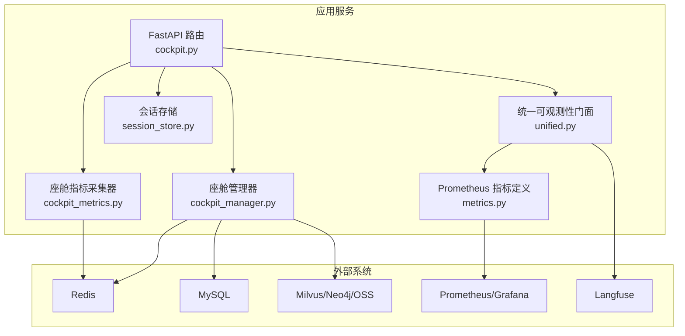
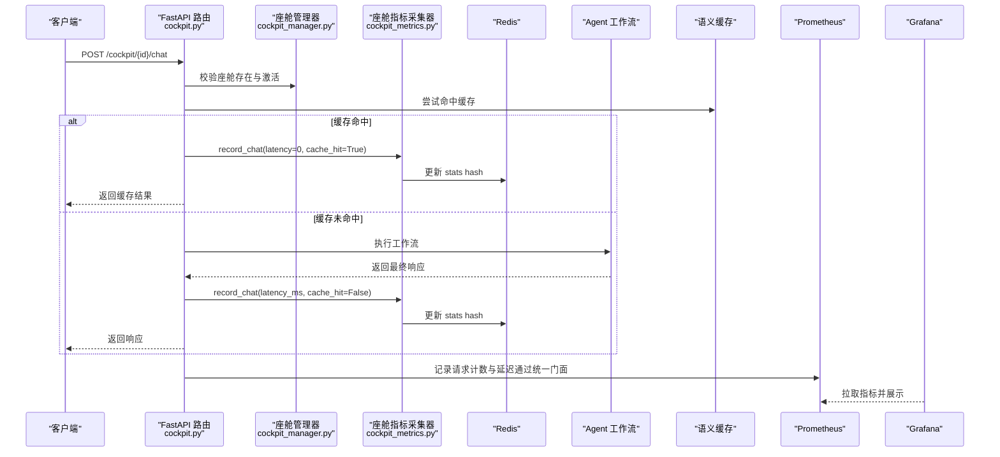
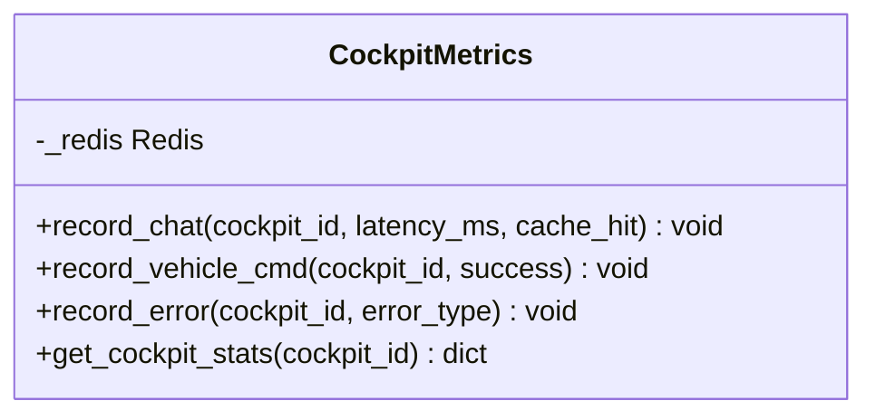
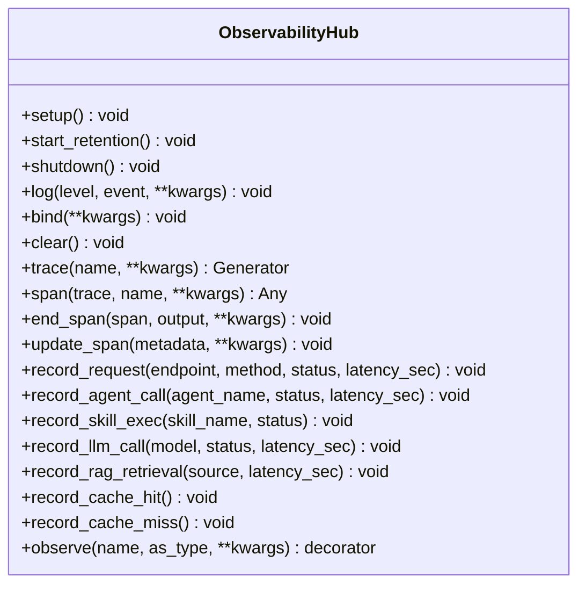
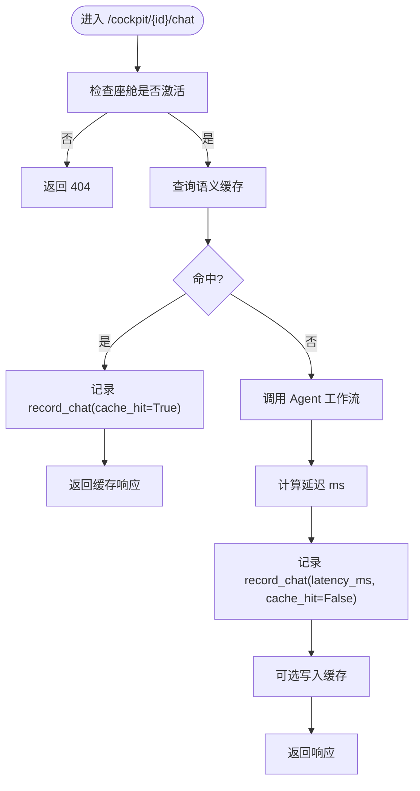
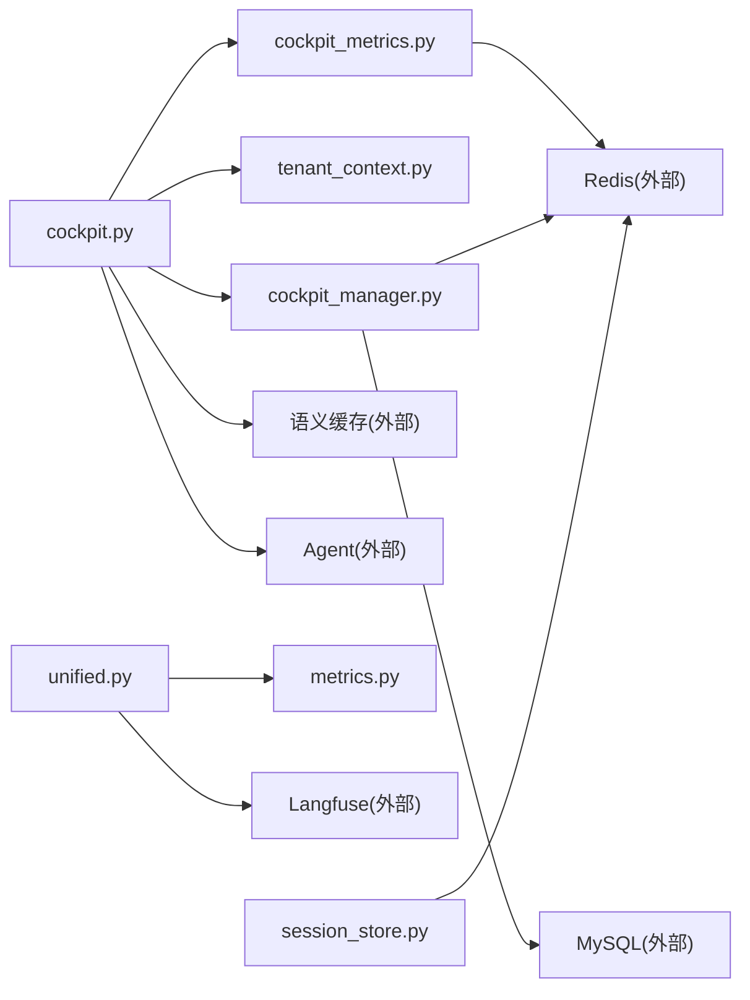

# 座舱专用指标

<cite>
**本文引用的文件**   
- [cockpit_metrics.py](file://backend_design/nexus/observability/cockpit_metrics.py)
- [metrics.py](file://backend_design/nexus/observability/metrics.py)
- [unified.py](file://backend_design/nexus/observability/unified.py)
- [observability.py](file://backend_design/nexus/config/observability.py)
- [cockpit_manager.py](file://backend_design/nexus/core/cockpit_manager.py)
- [cockpit.py](file://backend_design/nexus/api/routes/cockpit.py)
- [tenant_context.py](file://backend_design/nexus/core/tenant_context.py)
- [session_store.py](file://backend_design/nexus/middleware/session_store.py)
- [health.py](file://backend_design/nexus/api/routes/health.py)
- [nexuscockpit-overview.json](file://config/grafana/provisioning/dashboards/nexuscockpit-overview.json)
- [logger.py](file://backend_design/nexus/core/logger.py)
</cite>

## 目录
1. [引言](#引言)
2. [项目结构](#项目结构)
3. [核心组件](#核心组件)
4. [架构总览](#架构总览)
5. [详细组件分析](#详细组件分析)
6. [依赖关系分析](#依赖关系分析)
7. [性能考量](#性能考量)
8. [故障排查指南](#故障排查指南)
9. [结论](#结论)
10. [附录](#附录)

## 引言
本文件面向“座舱专用指标系统”，系统性说明座舱相关指标的定制设计、采集与展示方法，覆盖以下目标：
- 车辆状态监控、用户交互统计与会话管理指标
- 座舱上下文信息采集（用户身份识别、设备信息、环境参数）
- 座舱操作行为追踪（语音指令识别率、车控命令执行成功率等关键业务指标）
- 座舱性能监控（内存使用、CPU 占用、响应时间分析）
- 健康检查指标与异常检测机制
- 座舱特定告警规则与故障诊断方法

## 项目结构
本项目在可观测性方面采用分层设计：
- 统一门面层：ObservabilityHub 统一日志、追踪、指标初始化与调用入口
- 指标定义层：Prometheus 指标定义与初始化
- 座舱级指标层：CockpitMetrics 负责按座舱维度采集实时指标并写入 Redis
- API 路由层：座舱对话与车控接口埋点记录指标
- 中间件层：会话持久化与滚动摘要
- 配置层：Langfuse 与 Prometheus 配置
- 可视化层：Grafana 仪表盘

图表来源
- [cockpit.py:1-266](file://backend_design/nexus/api/routes/cockpit.py#L1-L266)
- [unified.py:1-269](file://backend_design/nexus/observability/unified.py#L1-L269)
- [metrics.py:1-108](file://backend_design/nexus/observability/metrics.py#L1-L108)
- [cockpit_metrics.py:1-180](file://backend_design/nexus/observability/cockpit_metrics.py#L1-L180)
- [session_store.py:1-294](file://backend_design/nexus/middleware/session_store.py#L1-L294)
- [cockpit_manager.py:1-397](file://backend_design/nexus/core/cockpit_manager.py#L1-L397)

章节来源
- [cockpit.py:1-266](file://backend_design/nexus/api/routes/cockpit.py#L1-L266)
- [unified.py:1-269](file://backend_design/nexus/observability/unified.py#L1-L269)
- [metrics.py:1-108](file://backend_design/nexus/observability/metrics.py#L1-L108)
- [cockpit_metrics.py:1-180](file://backend_design/nexus/observability/cockpit_metrics.py#L1-L180)
- [session_store.py:1-294](file://backend_design/nexus/middleware/session_store.py#L1-L294)
- [cockpit_manager.py:1-397](file://backend_design/nexus/core/cockpit_manager.py#L1-L397)

## 核心组件
- 统一可观测性门面 ObservabilityHub
  - 统一初始化日志、指标、追踪；提供 trace/span/log 等便捷方法
  - 透传 Langfuse observe 装饰器
- Prometheus 指标定义
  - 请求计数与延迟直方图、Agent/技能/RAG/LLM 调用计数与延迟、活跃连接数等
- 座舱级指标采集 CockpitMetrics
  - 按座舱维度记录对话、车控、错误等指标到 Redis，计算命中率、平均延迟、成功率等
- 座舱管理器 CockpitManager
  - 座舱注册、查询、状态管理；初始化 Redis stats key 与配置缓存
- 多租户上下文 CockpitContext
  - 协程安全的 cockpit_id/user_id 传递，供缓存/限流/会话等自动隔离
- 会话存储 SessionStore
  - Redis 持久化会话历史与滚动摘要，支持降级为内存
- 健康检查 Health Routes
  - 检查 Milvus/Neo4j/Redis/MySQL/OSS/Agent 等组件连通性

章节来源
- [unified.py:1-269](file://backend_design/nexus/observability/unified.py#L1-L269)
- [metrics.py:1-108](file://backend_design/nexus/observability/metrics.py#L1-L108)
- [cockpit_metrics.py:1-180](file://backend_design/nexus/observability/cockpit_metrics.py#L1-L180)
- [cockpit_manager.py:1-397](file://backend_design/nexus/core/cockpit_manager.py#L1-L397)
- [tenant_context.py:1-103](file://backend_design/nexus/core/tenant_context.py#L1-L103)
- [session_store.py:1-294](file://backend_design/nexus/middleware/session_store.py#L1-L294)
- [health.py:1-108](file://backend_design/nexus/api/routes/health.py#L1-L108)

## 架构总览
下图展示了从 HTTP 请求到指标采集与可视化的完整链路。

图表来源
- [cockpit.py:76-149](file://backend_design/nexus/api/routes/cockpit.py#L76-L149)
- [cockpit_metrics.py:38-64](file://backend_design/nexus/observability/cockpit_metrics.py#L38-L64)
- [unified.py:213-218](file://backend_design/nexus/observability/unified.py#L213-L218)
- [metrics.py:21-32](file://backend_design/nexus/observability/metrics.py#L21-L32)

## 详细组件分析

### 座舱级指标采集 CockpitMetrics
- 职责
  - 记录对话请求指标（延迟、缓存命中/未命中）
  - 记录车控指令成功/失败次数
  - 记录错误类型与数量
  - 读取并计算聚合指标（缓存命中率、错误率、平均延迟、车控成功率）
- 数据模型
  - Redis Key: {cockpit_id}:stats
  - Hash 字段包括 chat_count、cache_hits、cache_misses、total_latency_ms、latency_count、last_chat_time、last_latency_ms、vehicle_cmd_count、vehicle_cmd_errors、error_count、error_{type}
- 复杂度与性能
  - 使用 Redis pipeline 批量写入，降低网络往返
  - 延迟计算基于累加值与计数，避免仅取最后一次导致的偏差
- 错误处理
  - 所有写操作捕获异常并记录日志，保证采集不阻塞主流程

图表来源
- [cockpit_metrics.py:24-180](file://backend_design/nexus/observability/cockpit_metrics.py#L24-L180)

章节来源
- [cockpit_metrics.py:1-180](file://backend_design/nexus/observability/cockpit_metrics.py#L1-L180)

### 统一可观测性门面 ObservabilityHub
- 职责
  - 统一初始化日志（structlog）、指标（Prometheus）、追踪（Langfuse）
  - 提供 log/bind/clear、trace/span/end_span/update_span、record_* 系列便捷方法
  - 启动/关闭数据保留策略与 Langfuse flush
- 设计要点
  - 门面模式：不修改底层组件接口，仅统一调度
  - 降级透明：Langfuse 未配置时自动降级为空操作
  - 上下文绑定：request_id/user_id 自动传播到日志和追踪

图表来源
- [unified.py:78-269](file://backend_design/nexus/observability/unified.py#L78-L269)

章节来源
- [unified.py:1-269](file://backend_design/nexus/observability/unified.py#L1-L269)

### Prometheus 指标定义 metrics.py
- 指标类别
  - 应用信息 Info
  - 请求计数 Counter（endpoint/method/status）
  - 请求延迟 Histogram（按 endpoint）
  - Agent 调用计数与延迟
  - 技能执行计数
  - 缓存命中/未命中计数
  - RAG 检索计数与延迟
  - LLM 调用计数与延迟
  - 活跃连接数 Gauge
- 初始化
  - init_metrics 设置应用信息版本与服务描述

章节来源
- [metrics.py:1-108](file://backend_design/nexus/observability/metrics.py#L1-L108)

### 座舱 API 路由 cockpit.py
- 关键端点
  - GET /{cockpit_id}/status：返回座舱状态与实时指标（含 metrics）
  - POST /{cockpit_id}/chat：非流式对话，记录指标与缓存命中
  - POST /{cockpit_id}/chat/stream：流式对话
  - POST /{cockpit_id}/vehicle/cmd：车控指令执行，记录成功/失败
  - GET /{cockpit_id}/vehicle/status：获取车辆状态
- 指标埋点
  - 缓存命中路径直接记录 record_chat(cache_hit=True)
  - 非缓存路径记录 record_chat(latency_ms, cache_hit=False)
  - 车控成功/失败分别记录 record_vehicle_cmd(success=True/False)

图表来源
- [cockpit.py:76-149](file://backend_design/nexus/api/routes/cockpit.py#L76-L149)
- [cockpit_metrics.py:38-64](file://backend_design/nexus/observability/cockpit_metrics.py#L38-L64)

章节来源
- [cockpit.py:1-266](file://backend_design/nexus/api/routes/cockpit.py#L1-L266)

### 座舱管理器 CockpitManager
- 职责
  - 默认座舱初始化（cockpit-01/02/03）
  - 注册/注销/更新座舱
  - 初始化中间件资源（Redis stats 初始值、配置缓存、MySQL 用户记录、审计日志）
- 指标关联
  - 初始化 Redis stats hash 的初始键值（chat_count、vehicle_cmd_count、cache_hits、cache_misses、error_count、created_at）

章节来源
- [cockpit_manager.py:1-397](file://backend_design/nexus/core/cockpit_manager.py#L1-L397)

### 多租户上下文 CockpitContext
- 职责
  - 协程安全地设置/恢复 cockpit_id 与 user_id
  - 提供 get_cache_prefix 生成 Redis key 前缀
- 使用方式
  - with CockpitContext(cockpit_id, user_id): 作用域内自动隔离

章节来源
- [tenant_context.py:1-103](file://backend_design/nexus/core/tenant_context.py#L1-L103)

### 会话存储 SessionStore
- 职责
  - Redis 持久化会话历史与滚动摘要，支持 TTL 自动续期
  - 降级为内存存储以保证可用性
- 指标关联
  - 会话过期与活跃度间接影响“活跃连接数”与“缓存命中率”

章节来源
- [session_store.py:1-294](file://backend_design/nexus/middleware/session_store.py#L1-L294)

### 健康检查与健康指标
- 端点
  - GET /health：检查 Milvus/Neo4j/Redis/MySQL/OSS/Agent 等组件状态
  - GET /：根路径返回基本信息
- 健康判定
  - 核心组件均 connected/ready 则 healthy，否则 degraded

章节来源
- [health.py:1-108](file://backend_design/nexus/api/routes/health.py#L1-L108)

### 可观测性配置 observability.py
- LangfuseConfig
  - public_key/secret_key/host/db_password/nextauth_secret/salt
  - is_enabled 判断是否启用追踪
- ObservabilityConfig
  - prometheus_url/grafana_url

章节来源
- [observability.py:1-47](file://backend_design/nexus/config/observability.py#L1-L47)

### 结构化日志 logger.py
- 特点
  - structlog JSON 输出，生产环境便于 ELK/Loki 采集
  - 敏感字段脱敏处理器，防止泄露密钥/token
  - 为 uvicorn 添加 FileHandler，确保访问日志落盘

章节来源
- [logger.py:1-200](file://backend_design/nexus/core/logger.py#L1-L200)

## 依赖关系分析
- 组件耦合
  - cockpit.py 依赖 CockpitManager、CockpitContext、CockpitMetrics、语义缓存、Agent 工作流
  - unified.py 依赖 logger、langfuse、metrics、data_retention
  - cockpit_metrics.py 依赖 redis.asyncio、logger
  - cockpit_manager.py 依赖 redis.asyncio、db_manager、datetime
  - session_store.py 依赖 redis.asyncio、config、logger
- 外部依赖
  - Redis：实时指标与会话持久化
  - MySQL：用户与审计日志
  - Milvus/Neo4j：向量与图谱存储
  - Prometheus/Grafana：指标采集与可视化
  - Langfuse：LLM 调用链路追踪

图表来源
- [cockpit.py:1-266](file://backend_design/nexus/api/routes/cockpit.py#L1-L266)
- [unified.py:1-269](file://backend_design/nexus/observability/unified.py#L1-L269)
- [cockpit_metrics.py:1-180](file://backend_design/nexus/observability/cockpit_metrics.py#L1-L180)
- [cockpit_manager.py:1-397](file://backend_design/nexus/core/cockpit_manager.py#L1-L397)
- [session_store.py:1-294](file://backend_design/nexus/middleware/session_store.py#L1-L294)

## 性能考量
- 指标采集
  - 使用 Redis pipeline 批量写入，减少网络开销
  - 延迟计算基于累计值与计数，避免单次采样偏差
- 缓存策略
  - 语义缓存命中可跳过 Agent 流水线，显著降低延迟与 LLM 调用成本
  - 车控指令强制不经过缓存，确保每次执行真实状态
- 会话管理
  - Redis 持久化会话历史与滚动摘要，TTL 自动续期，避免频繁重建上下文
- 可视化
  - Grafana 面板提供 P50/P95/P99 延迟、缓存命中率、活跃连接数等关键指标

[本节为通用指导，不直接分析具体文件]

## 故障排查指南
- 常见问题定位
  - 指标缺失：检查 CockpitMetrics 是否被调用、Redis 连接是否正常
  - 指标不准确：确认延迟计算逻辑与累计值是否正确更新
  - 缓存命中率低：检查缓存键前缀与上下文隔离是否正确
  - 车控失败率高：查看 vehicle_adapter 异常日志与错误类型统计
- 健康检查
  - 使用 /health 端点快速定位组件连通性问题
- 日志与追踪
  - 使用统一门面 log/trace 方法，结合 Langfuse 追踪链路
  - 结构化日志便于 ELK/Loki 检索与脱敏

章节来源
- [health.py:1-108](file://backend_design/nexus/api/routes/health.py#L1-L108)
- [unified.py:141-208](file://backend_design/nexus/observability/unified.py#L141-L208)
- [logger.py:1-200](file://backend_design/nexus/core/logger.py#L1-L200)

## 结论
本座舱专用指标体系以 Redis 为核心实时指标存储，结合 Prometheus 与 Grafana 实现可视化监控，辅以 Langfuse 进行 LLM 链路追踪。通过统一的 ObservabilityHub 门面与 CockpitMetrics 采集器，实现了按座舱维度的精细化指标采集与计算。配合健康检查与结构化日志，形成完整的可观测性与故障诊断闭环。

[本节为总结，不直接分析具体文件]

## 附录

### 座舱指标字典与含义
- chat_count：对话请求总数
- cache_hits/cache_misses：缓存命中/未命中次数
- total_latency_ms/latency_count：用于计算平均延迟的累计延迟与次数
- last_chat_time/last_latency_ms：最近一次对话时间与延迟
- vehicle_cmd_count/vehicle_cmd_errors：车控指令总数与失败次数
- error_count/error_{type}：错误总数与按类型的错误计数
- 衍生指标
  - cache_hit_rate：缓存命中率
  - error_rate：错误率
  - avg_latency_ms：平均延迟
  - vehicle_cmd_success_rate：车控成功率

章节来源
- [cockpit_metrics.py:102-161](file://backend_design/nexus/observability/cockpit_metrics.py#L102-L161)

### Grafana 仪表盘关键指标
- API 请求总数（5min）
- API P95 延迟（ms）
- 缓存命中率（1h）
- 当前活跃连接数
- API 请求速率（按方法）
- API 延迟分布（P50/P95/P99）
- Agent 调用速率（1h）
- 缓存命中/未命中趋势（1h）
- Agent 执行延迟（P95, 1h）
- RAG 检索 & LLM 调用延迟（P95）

章节来源
- [nexuscockpit-overview.json:1-800](file://config/grafana/provisioning/dashboards/nexuscockpit-overview.json#L1-L800)

### 告警规则建议（示例）
- 高错误率：error_rate > 阈值（如 5%）持续 N 分钟
- 高延迟：avg_latency_ms > 阈值（如 2s）持续 N 分钟
- 低缓存命中率：cache_hit_rate < 阈值（如 10%）持续 N 分钟
- 车控失败率高：vehicle_cmd_success_rate < 阈值（如 95%）持续 N 分钟
- 健康状态异常：/health 返回 degraded

[本节为通用建议，不直接分析具体文件]