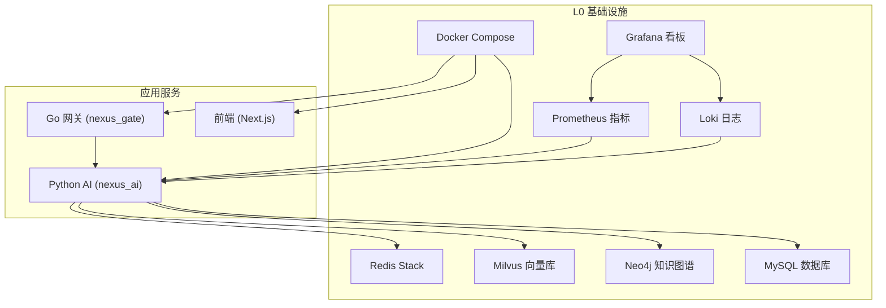
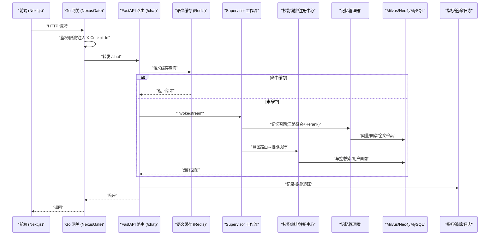
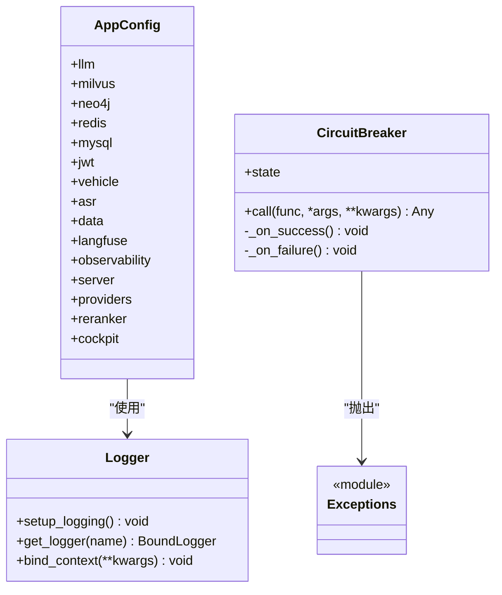
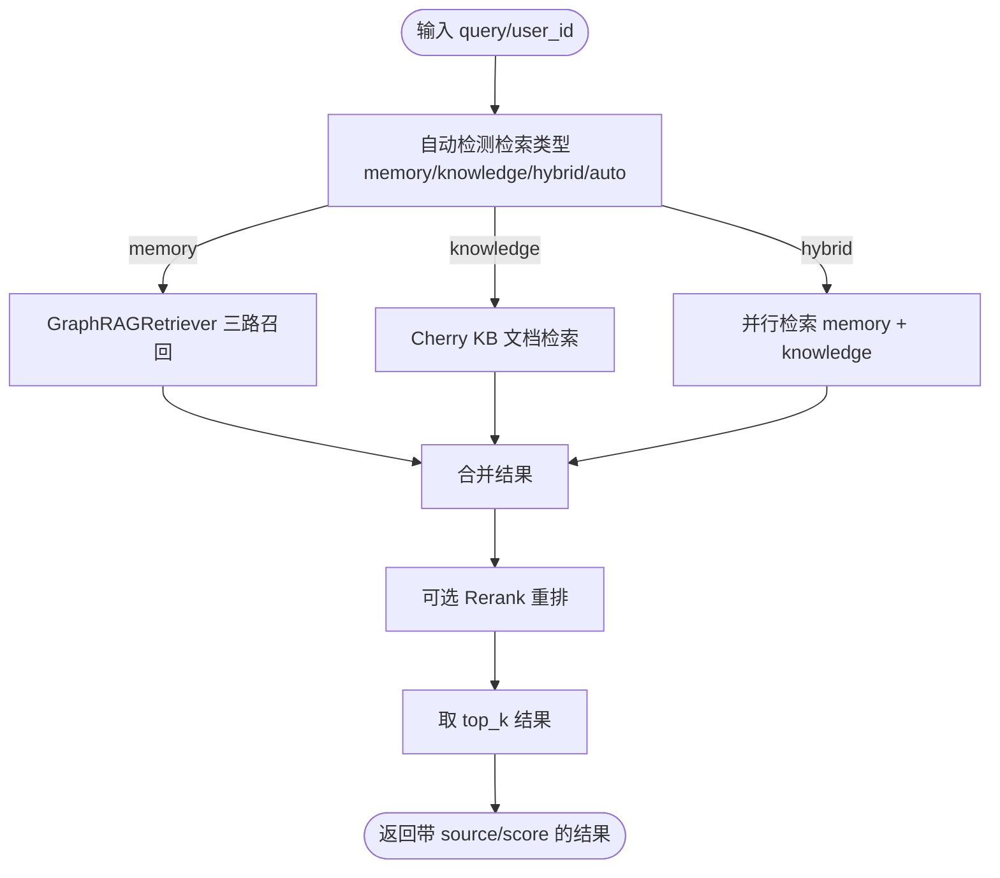
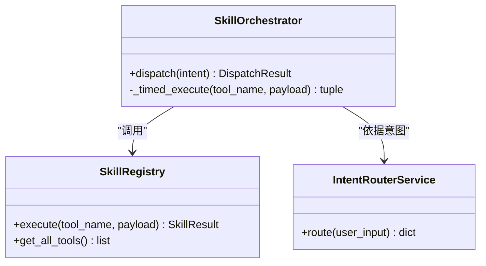
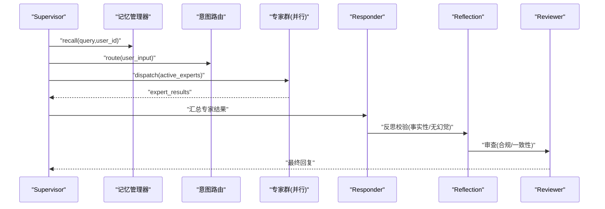
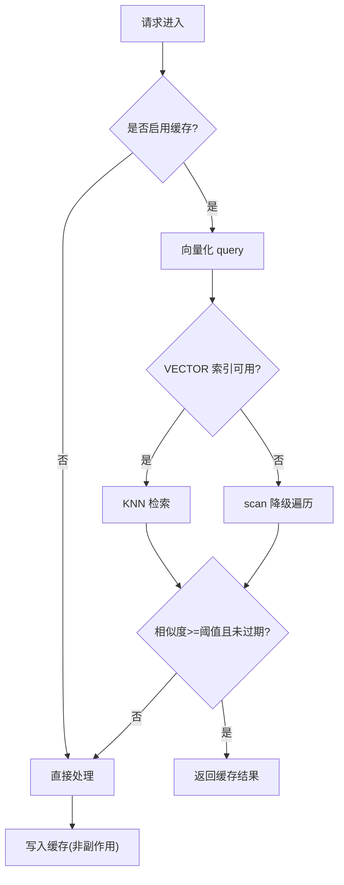
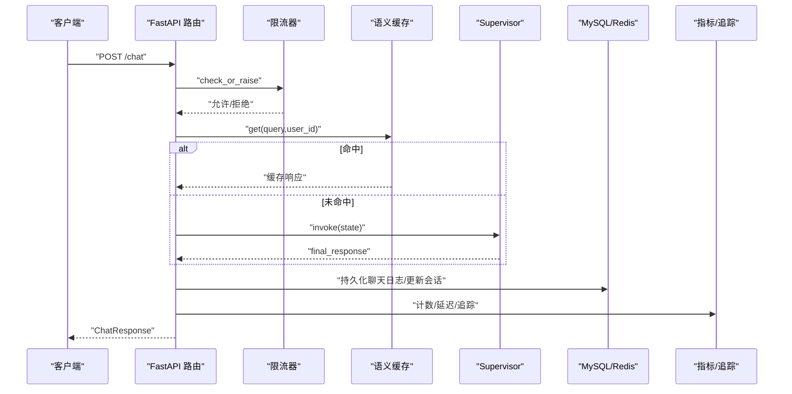
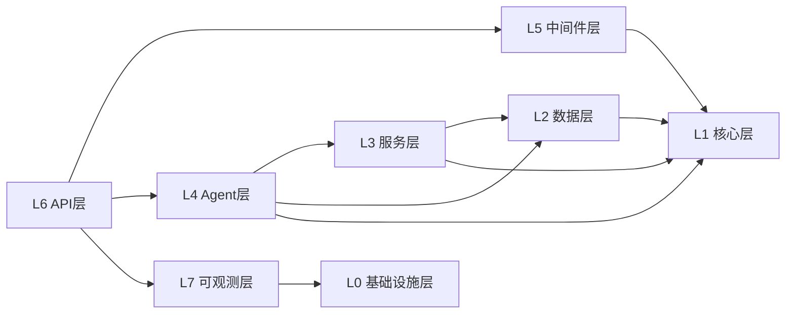

# 7层分层架构详解

<cite>
**本文引用的文件**   
- [docker-compose.yml](file://docker-compose.yml)
- [main.py](file://backend_design/nexus/main.py)
- [config.py](file://backend_design/nexus/config.py)
- [logger.py](file://backend_design/nexus/core/logger.py)
- [exceptions.py](file://backend_design/nexus/core/exceptions.py)
- [circuit_breaker.py](file://backend_design/nexus/core/circuit_breaker.py)
- [unified_retriever.py](file://backend_design/nexus/rag/unified_retriever.py)
- [manager.py](file://backend_design/nexus/memory/manager.py)
- [orchestrator.py](file://backend_design/nexus/skills/orchestrator.py)
- [supervisor_graph.py](file://backend_design/nexus/agent/supervisor_graph.py)
- [redis_cache.py](file://backend_design/nexus/middleware/redis_cache.py)
- [rate_limiter.py](file://backend_design/nexus/middleware/rate_limiter.py)
- [chat.py](file://backend_design/nexus/api/routes/chat.py)
- [metrics.py](file://backend_design/nexus/observability/metrics.py)
- [router.go](file://backend_design/nexus_gate/internal/router/router.go)
</cite>

## 目录
1. [引言](#引言)
2. [项目结构](#项目结构)
3. [核心组件](#核心组件)
4. [架构总览](#架构总览)
5. [详细组件分析](#详细组件分析)
6. [依赖关系分析](#依赖关系分析)
7. [性能考量](#性能考量)
8. [故障排查指南](#故障排查指南)
9. [结论](#结论)
10. [附录](#附录)

## 引言
本文件为 NexusCockpit 的7层分层架构文档，围绕 L0-L7 各层的职责边界、技术选型与设计原则展开，并给出层间依赖关系图、数据流向图与关键交互时序。目标读者包括产品、研发与运维人员，力求以循序渐进的方式呈现系统全貌与实现细节。

## 项目结构
NexusCockpit 采用“Go 网关 + Python AI 服务 + TS 前端”的组合，通过 Docker Compose 编排基础设施与应用服务。整体结构如下：
- L0 基础设施层：Docker Compose 编排中间件（Redis、Milvus、Neo4j、MySQL、Loki、Prometheus、Grafana）与应用服务（nexus_gate、nexus_ai、nexus_frontend）。
- L1 核心层：配置中心、结构化日志、异常体系、熔断器。
- L2 数据层：GraphRAG（向量+图谱+BM25）、统一检索路由、记忆管理器。
- L3 服务层：技能编排、车控适配、意图路由。
- L4 Agent层：Supervisor 多智能体工作流（专家并行、Responder 汇总、Reviewer 审查）。
- L5 中间件层：语义缓存、限流、会话存储。
- L6 API层：REST/SSE/WebSocket 接口。
- L7 可观测层：指标采集、链路追踪、日志聚合与可视化。

图表来源
- [docker-compose.yml:1-246](file://docker-compose.yml#L1-L246)

章节来源
- [docker-compose.yml:1-246](file://docker-compose.yml#L1-L246)

## 核心组件
- 配置中心：集中管理 LLM、向量库、图谱、缓存、数据库、车控、ASR/TTS、可观测性等配置，支持本地/云端双模式切换与安全校验。
- 结构化日志：基于 structlog 输出 JSON/彩色控制台格式，支持上下文绑定与链路追踪。
- 异常体系：统一的自定义异常族，便于全局处理器映射到标准 HTTP 状态码。
- 熔断器：三态保护（CLOSED/OPEN/HALF_OPEN），用于 LLM/外部服务降级与自愈。
- GraphRAG 与记忆：三路召回（向量+图谱+BM25）+ RRF 融合 + Rerank；短期/长期/习惯记忆协同。
- 技能编排：根据意图将请求分发至车控、导航、生活、健康、闲聊等技能执行。
- Supervisor 多智能体：记忆召回+意图路由→专家并行→Responder 汇总→反思校验→Reviewer 审查。
- 中间件：Redis 语义缓存（KNN 向量索引）、分布式限流（Lua 原子滑动窗口）、会话持久化。
- API 层：REST/SSE/WebSocket，集成鉴权、限流、指标记录与聊天日志持久化。
- 可观测性：Prometheus 指标、Langfuse 链路追踪、Loki 日志、Grafana 看板。

章节来源
- [config.py:1-693](file://backend_design/nexus/config.py#L1-L693)
- [logger.py:1-105](file://backend_design/nexus/core/logger.py#L1-L105)
- [exceptions.py:1-124](file://backend_design/nexus/core/exceptions.py#L1-L124)
- [circuit_breaker.py:1-176](file://backend_design/nexus/core/circuit_breaker.py#L1-L176)
- [unified_retriever.py:1-155](file://backend_design/nexus/rag/unified_retriever.py#L1-L155)
- [manager.py:1-398](file://backend_design/nexus/memory/manager.py#L1-L398)
- [orchestrator.py:1-131](file://backend_design/nexus/skills/orchestrator.py#L1-L131)
- [supervisor_graph.py:1-800](file://backend_design/nexus/agent/supervisor_graph.py#L1-L800)
- [redis_cache.py:1-449](file://backend_design/nexus/middleware/redis_cache.py#L1-L449)
- [rate_limiter.py:1-174](file://backend_design/nexus/middleware/rate_limiter.py#L1-L174)
- [chat.py:1-392](file://backend_design/nexus/api/routes/chat.py#L1-L392)
- [metrics.py:1-113](file://backend_design/nexus/observability/metrics.py#L1-L113)

## 架构总览
下图展示从前端到后端再到基础设施的整体调用链路与数据流向。

图表来源
- [router.go:57-200](file://backend_design/nexus_gate/internal/router/router.go#L57-L200)
- [chat.py:146-294](file://backend_design/nexus/api/routes/chat.py#L146-L294)
- [supervisor_graph.py:127-174](file://backend_design/nexus/agent/supervisor_graph.py#L127-L174)
- [manager.py:95-141](file://backend_design/nexus/memory/manager.py#L95-L141)
- [redis_cache.py:160-249](file://backend_design/nexus/middleware/redis_cache.py#L160-L249)
- [metrics.py:104-113](file://backend_design/nexus/observability/metrics.py#L104-L113)

## 详细组件分析

### L0 基础设施层（Docker Compose 编排）
- 职责边界：提供运行时所需的所有中间件与服务（Redis、Milvus、Neo4j、MySQL、Loki、Prometheus、Grafana），以及应用服务（Go 网关、Python AI、前端）。
- 技术选型：
  - Redis Stack：RediSearch VECTOR 索引、TTL、分片隔离。
  - Milvus：向量检索（HNSW/IP）。
  - Neo4j：知识图谱（APOC 插件）。
  - MySQL：用户数据、审计日志、座舱隔离。
  - Loki/Prometheus/Grafana：日志/指标/可视化。
- 设计原则：容器化、健康检查、端口避让、卷持久化、按需启动（profiles）。
- 扩展点：新增中间件或替换云托管时，仅需调整 compose 与 providers 配置。

章节来源
- [docker-compose.yml:1-246](file://docker-compose.yml#L1-L246)

### L1 核心层（配置/日志/异常/熔断）
- 配置中心：集中式 Pydantic Settings，支持 .env.local/.env.prod 自动加载、路径解析、安全告警、Provider 双模式开关。
- 结构化日志：structlog 管道，JSON/Console 输出，上下文变量绑定。
- 异常体系：统一基类与领域异常，全局处理器映射到 401/429/500。
- 熔断器：三态转换，半开试探，失败阈值与恢复周期可调。
- 设计原则：类型安全、可观测、可降级、最小侵入。

图表来源
- [config.py:601-693](file://backend_design/nexus/config.py#L601-L693)
- [circuit_breaker.py:47-176](file://backend_design/nexus/core/circuit_breaker.py#L47-L176)
- [logger.py:32-105](file://backend_design/nexus/core/logger.py#L32-L105)
- [exceptions.py:19-124](file://backend_design/nexus/core/exceptions.py#L19-L124)

章节来源
- [config.py:1-693](file://backend_design/nexus/config.py#L1-L693)
- [logger.py:1-105](file://backend_design/nexus/core/logger.py#L1-L105)
- [exceptions.py:1-124](file://backend_design/nexus/core/exceptions.py#L1-L124)
- [circuit_breaker.py:1-176](file://backend_design/nexus/core/circuit_breaker.py#L1-L176)

### L2 数据层（GraphRAG+记忆系统）
- 统一检索路由：按 query_type 分发至 GraphRAG（记忆/习惯）与 Cherry KB（手册/FAQ），支持 hybrid 混合检索与 Rerank。
- 记忆管理器：短期（Redis 会话）、长期（Milvus+Neo4j）、习惯（MySQL user_habits）；渐进式披露策略动态调整 top_k。
- 三路召回+RRF 融合+Rerank：提升召回质量与相关性。
- 设计原则：高内聚低耦合、可插拔存储、容错降级（向量-only 回退）。

图表来源
- [unified_retriever.py:33-155](file://backend_design/nexus/rag/unified_retriever.py#L33-L155)
- [manager.py:95-141](file://backend_design/nexus/memory/manager.py#L95-L141)

章节来源
- [unified_retriever.py:1-155](file://backend_design/nexus/rag/unified_retriever.py#L1-L155)
- [manager.py:1-398](file://backend_design/nexus/memory/manager.py#L1-L398)

### L3 服务层（技能系统/车控/意图路由）
- 技能编排器：根据意图字段匹配动作（Climate/Window/Seat/Navigation/Media/Status），驱动对应工具执行，标记副作用（禁止缓存）。
- 意图路由：复用 IntentRouterService，结合工具目录进行决策。
- 车控适配：mock/http/mcp 三种适配器，统一抽象。
- 设计原则：面向接口编程、副作用隔离、可扩展技能注册。

图表来源
- [orchestrator.py:44-131](file://backend_design/nexus/skills/orchestrator.py#L44-L131)
- [supervisor_graph.py:285-324](file://backend_design/nexus/agent/supervisor_graph.py#L285-L324)

章节来源
- [orchestrator.py:1-131](file://backend_design/nexus/skills/orchestrator.py#L1-L131)
- [supervisor_graph.py:175-324](file://backend_design/nexus/agent/supervisor_graph.py#L175-L324)

### L4 Agent层（Supervisor+专家Agent）
- Supervisor：记忆召回+用户画像+意图路由→决定活跃专家集→并行执行→Responder 汇总→Reflection 反思→Reviewer 审查→END。
- 专家并行：vehicle/nav/lifestyle/health/chat 五类专家，结果通过 reducer 累加。
- Tool→LLM 合成：工具结构化数据回传 LLM 生成自然语言回复，降低幻觉风险。
- 设计原则：可观测的工作流、可插拔专家、强一致性反思与审查。

图表来源
- [supervisor_graph.py:127-174](file://backend_design/nexus/agent/supervisor_graph.py#L127-L174)
- [supervisor_graph.py:183-283](file://backend_design/nexus/agent/supervisor_graph.py#L183-L283)
- [supervisor_graph.py:401-450](file://backend_design/nexus/agent/supervisor_graph.py#L401-L450)
- [supervisor_graph.py:534-675](file://backend_design/nexus/agent/supervisor_graph.py#L534-L675)

章节来源
- [supervisor_graph.py:1-800](file://backend_design/nexus/agent/supervisor_graph.py#L1-L800)

### L5 中间件层（缓存/限流/会话）
- 语义缓存：基于 Redis Stack RediSearch KNN 向量检索 O(log n)，按 user_id 分片，TTL 分级，副作用隔离（车控指令不缓存）。
- 分布式限流：Redis Lua 原子滑动窗口，超限不污染计数器，支持 EVALSHA 预加载脚本。
- 会话存储：优先 Redis SessionStore 持久化，内存兼容层保留历史片段。
- 设计原则：高性能、幂等、可降级、安全隔离。

图表来源
- [redis_cache.py:83-159](file://backend_design/nexus/middleware/redis_cache.py#L83-L159)
- [redis_cache.py:160-249](file://backend_design/nexus/middleware/redis_cache.py#L160-L249)
- [rate_limiter.py:63-174](file://backend_design/nexus/middleware/rate_limiter.py#L63-L174)

章节来源
- [redis_cache.py:1-449](file://backend_design/nexus/middleware/redis_cache.py#L1-L449)
- [rate_limiter.py:1-174](file://backend_design/nexus/middleware/rate_limiter.py#L1-L174)

### L6 API层（REST/SSE/WebSocket）
- REST：/chat 文本对话，集成限流、语义缓存、指标记录、聊天日志持久化（MySQL）、Langfuse 追踪。
- SSE：/chat/stream 流式事件，结构化事件（intent/experts/action/chunk/done）。
- WebSocket：/ws/chat 实时通道，Go 网关 Hub 管理连接。
- 设计原则：前后端解耦、事件驱动、可观测、会话并发安全。

图表来源
- [chat.py:146-294](file://backend_design/nexus/api/routes/chat.py#L146-L294)
- [chat.py:296-392](file://backend_design/nexus/api/routes/chat.py#L296-L392)
- [metrics.py:104-113](file://backend_design/nexus/observability/metrics.py#L104-L113)

章节来源
- [chat.py:1-392](file://backend_design/nexus/api/routes/chat.py#L1-L392)
- [metrics.py:1-113](file://backend_design/nexus/observability/metrics.py#L1-L113)

### L7 可观测层（监控/追踪）
- Prometheus：应用信息、请求计数/延迟、Agent 调用/延迟、技能执行、缓存命中/缺失、RAG 检索、LLM 调用、活跃连接/用户。
- Langfuse：在 API 层创建 trace/span，贯穿整个请求生命周期，记录输入/输出/元数据。
- Loki/Grafana：日志聚合与可视化看板。
- 设计原则：标准化指标命名、低基数标签、端到端追踪。

章节来源
- [metrics.py:1-113](file://backend_design/nexus/observability/metrics.py#L1-L113)
- [chat.py:163-171](file://backend_design/nexus/api/routes/chat.py#L163-L171)

## 依赖关系分析
- 层间依赖：
  - L6 → L5/L4/L2/L1/L7
  - L4 → L3/L2/L1/L7
  - L3 → L2/L1
  - L2 → L1/L0
  - L5 → L1/L0
  - L7 → L0
- 外部依赖：
  - Go 网关负责鉴权、限流、反向代理与 WS Hub。
  - Python AI 负责业务逻辑、Agent 工作流、数据访问与可观测性埋点。

图表来源
- [main.py:294-433](file://backend_design/nexus/main.py#L294-L433)
- [router.go:57-200](file://backend_design/nexus_gate/internal/router/router.go#L57-L200)

章节来源
- [main.py:1-452](file://backend_design/nexus/main.py#L1-L452)
- [router.go:1-437](file://backend_design/nexus_gate/internal/router/router.go#L1-L437)

## 性能考量
- 向量检索：Milvus HNSW 索引参数（M=16, efConstruction=200, ef=64）平衡召回率与延迟。
- 语义缓存：RediSearch KNN 向量检索 O(log n)，TTL 分级，避免副作用缓存。
- 限流：Lua 原子滑动窗口，EVALSHA 预加载脚本减少网络往返。
- 并行化：Supervisor 节点内并行执行记忆召回、用户画像加载、意图路由；专家并行执行。
- 渐进式披露：简单指令减少 top_k，复杂查询增加深度召回。
- 建议：
  - 合理设置 LLM 并发限制与超时。
  - 对热点接口开启缓存与限流。
  - 定期评估 Rerank 成本与收益。

[本节为通用指导，无需具体文件引用]

## 故障排查指南
- 认证错误（401）：检查 JWT 签发与校验、Token 有效期、座舱权限。
- 限流错误（429）：查看 Redis 限流 key 与窗口统计，确认优先级策略。
- 缓存未命中：检查向量维度一致性、相似度阈值、TTL、副作用标记。
- 熔断器开启：观察连续失败次数与恢复周期，定位下游服务健康状态。
- 指标/日志：
  - Prometheus /metrics 端点查看请求/延迟/Agent/缓存/RAG/LLM 指标。
  - Loki 聚合 JSON 日志，结合 request_id/user_id 追踪。
  - Grafana 看板快速定位异常时段。

章节来源
- [exceptions.py:105-124](file://backend_design/nexus/core/exceptions.py#L105-L124)
- [rate_limiter.py:148-174](file://backend_design/nexus/middleware/rate_limiter.py#L148-L174)
- [redis_cache.py:414-449](file://backend_design/nexus/middleware/redis_cache.py#L414-L449)
- [circuit_breaker.py:134-176](file://backend_design/nexus/core/circuit_breaker.py#L134-L176)
- [metrics.py:14-113](file://backend_design/nexus/observability/metrics.py#L14-L113)

## 结论
NexusCockpit 通过清晰的7层分层架构实现了高内聚、低耦合、可观测、可降级的企业级车载语音助手平台。L0-L7 各司其职，配合 GraphRAG、多智能体工作流与中间件能力，兼顾性能与稳定性。未来可在专家扩展、检索增强、可观测性深化等方面持续演进。

[本节为总结，无需具体文件引用]

## 附录
- 部署与环境：
  - 本地开发：默认加载 .env.local，启用 debug 与热重载。
  - 生产环境：APP_ENV=prod 加载 .env.prod，修改弱密钥与密码，关闭 CORS 通配符。
- Provider 双模式：
  - vector_store/graph_store/cache/reranker 支持 local/cloud/none 切换。
- 扩展点：
  - 新增专家：在 SupervisorGraph 中注册新节点与路由。
  - 新增技能：在 SkillRegistry 中注册工具，并在 Orchestrator 中映射意图。
  - 新增存储：实现 VectorStore/GraphStore 接口并通过工厂函数接入。

章节来源
- [config.py:458-489](file://backend_design/nexus/config.py#L458-L489)
- [supervisor_graph.py:127-174](file://backend_design/nexus/agent/supervisor_graph.py#L127-L174)
- [orchestrator.py:61-131](file://backend_design/nexus/skills/orchestrator.py#L61-L131)