# L0 基础设施层

<cite>
**本文引用的文件**   
- [docker-compose.yml](file://docker-compose.yml)
- [config/prometheus/prometheus.yml](file://config/prometheus/prometheus.yml)
- [config/grafana/provisioning/datasources/prometheus.yml](file://config/grafana/provisioning/datasources/prometheus.yml)
- [config/grafana/provisioning/dashboards/dashboards.yml](file://config/grafana/provisioning/dashboards/dashboards.yml)
- [backend_design/scripts/init_milvus.py](file://backend_design/scripts/init_milvus.py)
- [backend_design/scripts/init_neo4j.py](file://backend_design/scripts/init_neo4j.py)
- [backend_design/nexus/config.py](file://backend_design/nexus/config.py)
- [backend_design/nexus/core/db_manager.py](file://backend_design/nexus/core/db_manager.py)
- [backend_design/nexus/middleware/redis_cache.py](file://backend_design/nexus/middleware/redis_cache.py)
- [backend_design/nexus/rag/vector_store.py](file://backend_design/nexus/rag/vector_store.py)
- [backend_design/nexus/rag/graph_store.py](file://backend_design/nexus/rag/graph_store.py)
- [backend_design/nexus/observability/metrics.py](file://backend_design/nexus/observability/metrics.py)
- [backend_design/nexus/api/routes/health.py](file://backend_design/nexus/api/routes/health.py)
- [backend_design/nexus_gate/internal/handlers/redis_client.go](file://backend_design/nexus_gate/internal/handlers/redis_client.go)
</cite>

## 目录
1. [简介](#简介)
2. [项目结构](#项目结构)
3. [核心组件](#核心组件)
4. [架构总览](#架构总览)
5. [详细组件分析](#详细组件分析)
6. [依赖关系分析](#依赖关系分析)
7. [性能考虑](#性能考虑)
8. [故障排查指南](#故障排查指南)
9. [结论](#结论)
10. [附录](#附录)

## 简介
本章节面向 NexusCockpit 的 L0 基础设施层，聚焦容器化编排与中间件体系。内容涵盖：
- Docker Compose 编排与服务依赖、网络拓扑
- 中间件组件：Milvus 向量数据库、Neo4j 知识图谱、Redis 缓存、MySQL 关系数据库、Prometheus 监控、Grafana 可视化面板
- 双模式部署方案（本地 Docker vs 云端托管服务）
- 健康检查机制、数据持久化策略、服务启动流程
- 配置文件说明与常见问题排查

## 项目结构
L0 基础设施层的关键编排与配置集中在仓库根目录与 config 子目录中，应用侧通过环境变量与初始化脚本完成中间件的连接与初始化。

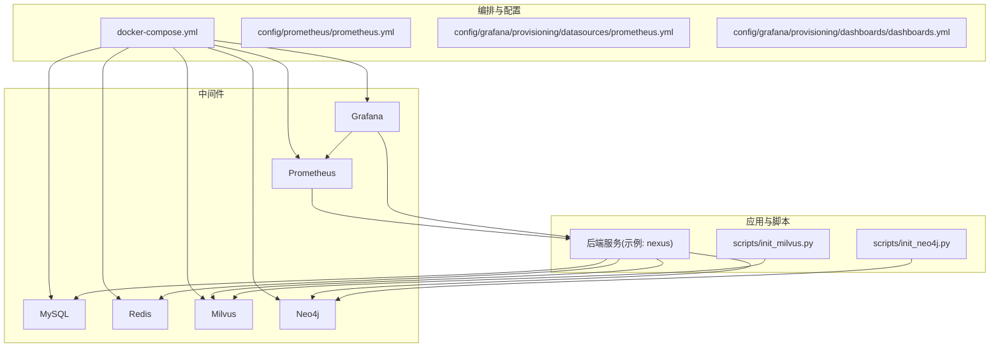

图表来源
- [docker-compose.yml](file://docker-compose.yml)
- [config/prometheus/prometheus.yml](file://config/prometheus/prometheus.yml)
- [config/grafana/provisioning/datasources/prometheus.yml](file://config/grafana/provisioning/datasources/prometheus.yml)
- [config/grafana/provisioning/dashboards/dashboards.yml](file://config/grafana/provisioning/dashboards/dashboards.yml)
- [backend_design/scripts/init_milvus.py](file://backend_design/scripts/init_milvus.py)
- [backend_design/scripts/init_neo4j.py](file://backend_design/scripts/init_neo4j.py)

章节来源
- [docker-compose.yml](file://docker-compose.yml)
- [config/prometheus/prometheus.yml](file://config/prometheus/prometheus.yml)
- [config/grafana/provisioning/datasources/prometheus.yml](file://config/grafana/provisioning/datasources/prometheus.yml)
- [config/grafana/provisioning/dashboards/dashboards.yml](file://config/grafana/provisioning/dashboards/dashboards.yml)
- [backend_design/scripts/init_milvus.py](file://backend_design/scripts/init_milvus.py)
- [backend_design/scripts/init_neo4j.py](file://backend_design/scripts/init_neo4j.py)

## 核心组件
本节概述各中间件在 L0 层的职责与关键配置要点。

- MySQL 关系数据库
  - 用途：存储结构化业务数据（用户、会话、系统配置等）。
  - 关键点：端口映射、持久卷挂载、初始数据导入、健康检查。
- Redis 缓存
  - 用途：会话、限流、热点数据缓存、任务队列等。
  - 关键点：密码保护、持久化开关、内存上限、网络隔离。
- Milvus 向量数据库
  - 用途：语义检索、RAG 向量索引。
  - 关键点：集合/索引初始化脚本、资源配额、磁盘空间。
- Neo4j 知识图谱
  - 用途：实体关系建模、图谱检索。
  - 关键点：认证、图初始化脚本、存储路径。
- Prometheus 监控
  - 用途：采集应用与中间件指标。
  - 关键点：targets 配置、抓取间隔、保留策略。
- Grafana 可视化面板
  - 用途：指标展示、告警面板。
  - 关键点：数据源注入、仪表盘注入、认证。

章节来源
- [docker-compose.yml](file://docker-compose.yml)
- [config/prometheus/prometheus.yml](file://config/prometheus/prometheus.yml)
- [config/grafana/provisioning/datasources/prometheus.yml](file://config/grafana/provisioning/datasources/prometheus.yml)
- [config/grafana/provisioning/dashboards/dashboards.yml](file://config/grafana/provisioning/dashboards/dashboards.yml)

## 架构总览
下图展示了 L0 层的服务编排、网络拓扑与数据流向。应用通过内部网络访问中间件；Prometheus 抓取应用暴露的指标端点；Grafana 读取 Prometheus 并渲染仪表盘。

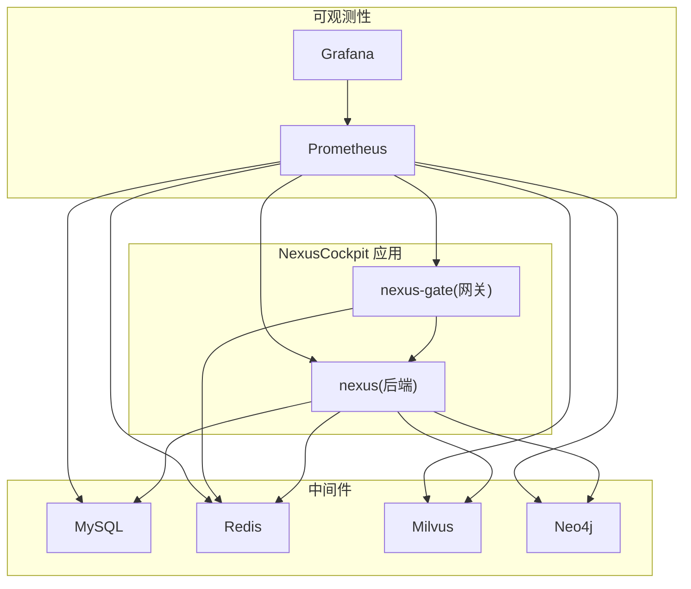

图表来源
- [docker-compose.yml](file://docker-compose.yml)
- [config/prometheus/prometheus.yml](file://config/prometheus/prometheus.yml)
- [config/grafana/provisioning/datasources/prometheus.yml](file://config/grafana/provisioning/datasources/prometheus.yml)
- [config/grafana/provisioning/dashboards/dashboards.yml](file://config/grafana/provisioning/dashboards/dashboards.yml)

## 详细组件分析

### Docker Compose 编排与服务依赖
- 服务定义
  - 为每个中间件与应用服务提供独立的 service 块，包含镜像、端口映射、环境变量、卷挂载与健康检查。
- 网络拓扑
  - 默认 bridge 网络下，服务间通过“服务名”进行 DNS 解析通信，避免硬编码 IP。
- 依赖关系
  - 使用 depends_on 声明顺序依赖；结合 healthcheck 确保下游服务就绪后再启动。
- 数据持久化
  - 通过 volumes 将宿主目录或命名卷挂载到容器内数据目录，保障重启不丢数据。
- 健康检查
  - 对关键服务（如 MySQL、Redis、Milvus、Neo4j、Prometheus、Grafana）配置健康检查，用于编排器判定服务可用性。

章节来源
- [docker-compose.yml](file://docker-compose.yml)

### Milvus 向量数据库
- 角色与用途
  - 承载 RAG 场景下的向量索引与相似度检索。
- 部署要点
  - 端口暴露、存储卷挂载、资源限制。
  - 初始化脚本在容器启动后执行，创建集合与索引。
- 初始化流程
  - 应用启动后调用初始化脚本，等待 Milvus 可用，再创建必要集合与索引。

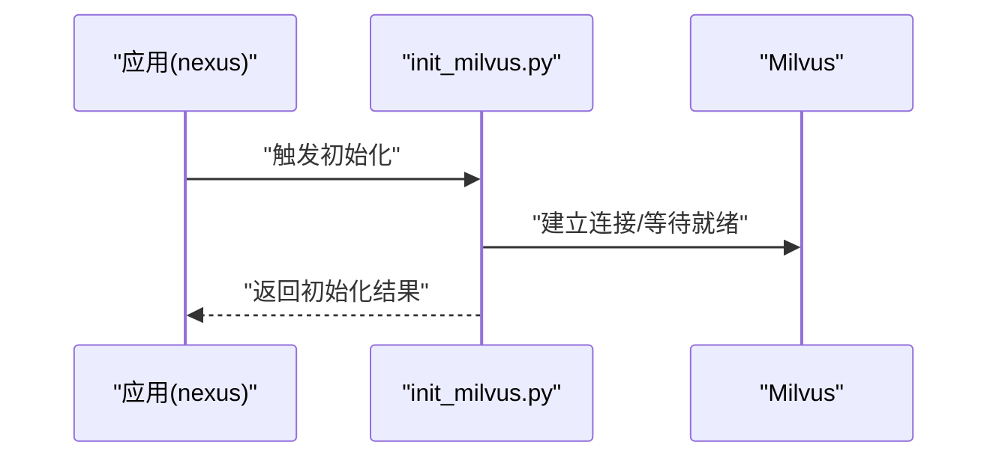

图表来源
- [backend_design/scripts/init_milvus.py](file://backend_design/scripts/init_milvus.py)

章节来源
- [docker-compose.yml](file://docker-compose.yml)
- [backend_design/scripts/init_milvus.py](file://backend_design/scripts/init_milvus.py)

### Neo4j 知识图谱
- 角色与用途
  - 存储实体与关系，支持图谱查询与推理。
- 部署要点
  - 认证配置、存储卷挂载、端口暴露。
  - 初始化脚本在启动后运行，导入种子数据或建图。
- 初始化流程
  - 应用启动后调用初始化脚本，等待 Neo4j 可用，再执行建图/导入。

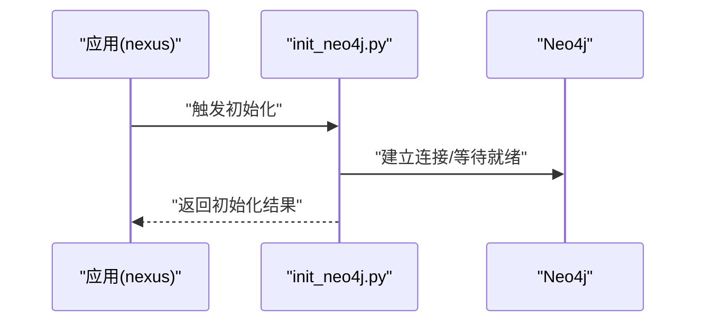

图表来源
- [backend_design/scripts/init_neo4j.py](file://backend_design/scripts/init_neo4j.py)

章节来源
- [docker-compose.yml](file://docker-compose.yml)
- [backend_design/scripts/init_neo4j.py](file://backend_design/scripts/init_neo4j.py)

### Redis 缓存
- 角色与用途
  - 会话存储、限流计数、热点数据缓存、任务队列等。
- 部署要点
  - 密码保护、持久化开关、内存上限、网络隔离。
- 应用集成
  - 后端与网关均通过 Redis 客户端访问，注意超时与重试策略。

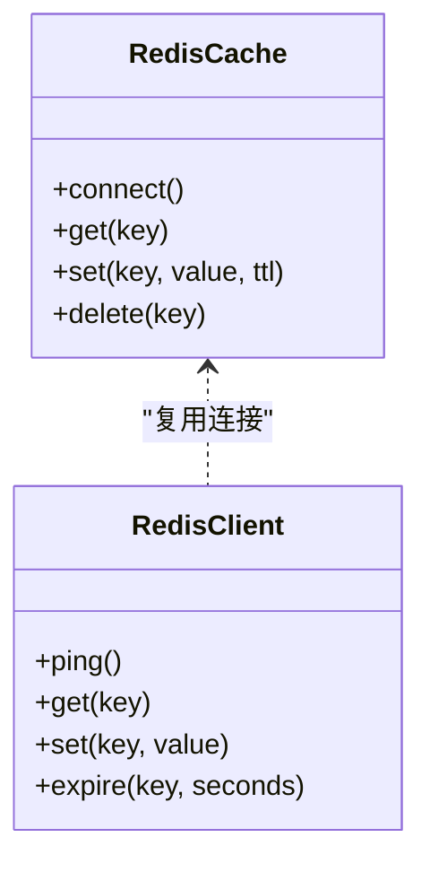

图表来源
- [backend_design/nexus/middleware/redis_cache.py](file://backend_design/nexus/middleware/redis_cache.py)
- [backend_design/nexus_gate/internal/handlers/redis_client.go](file://backend_design/nexus_gate/internal/handlers/redis_client.go)

章节来源
- [docker-compose.yml](file://docker-compose.yml)
- [backend_design/nexus/middleware/redis_cache.py](file://backend_design/nexus/middleware/redis_cache.py)
- [backend_design/nexus_gate/internal/handlers/redis_client.go](file://backend_design/nexus_gate/internal/handlers/redis_client.go)

### MySQL 关系数据库
- 角色与用途
  - 结构化数据存储，支撑用户、会话、系统配置等。
- 部署要点
  - 端口映射、持久卷挂载、初始 SQL 导入、健康检查。
- 应用集成
  - 通过数据库管理器统一获取连接池与事务能力。

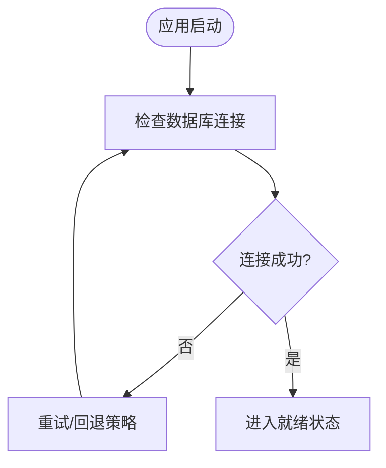

图表来源
- [backend_design/nexus/core/db_manager.py](file://backend_design/nexus/core/db_manager.py)

章节来源
- [docker-compose.yml](file://docker-compose.yml)
- [backend_design/nexus/core/db_manager.py](file://backend_design/nexus/core/db_manager.py)

### Prometheus 监控
- 角色与用途
  - 采集应用与中间件指标，提供时序存储与查询。
- 配置要点
  - targets 列表、抓取间隔、保留策略、安全访问控制。
- 集成方式
  - 应用暴露 /metrics 端点，Prometheus 定期抓取。

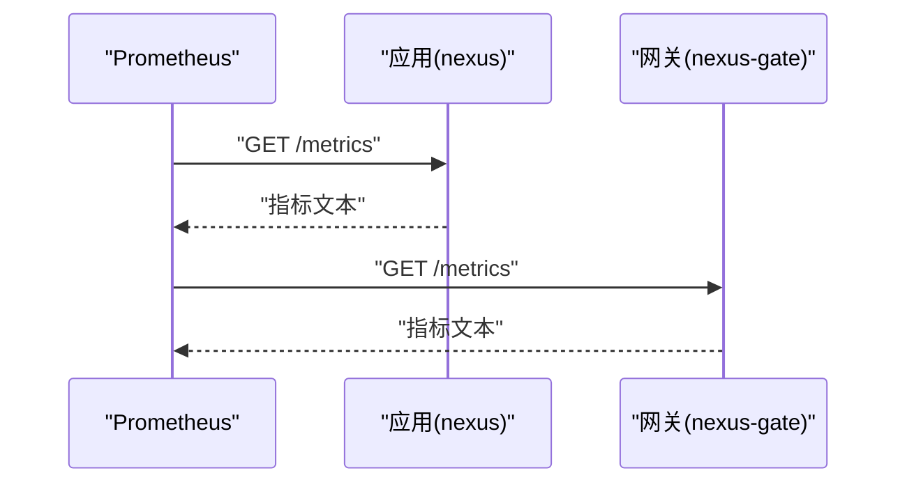

图表来源
- [config/prometheus/prometheus.yml](file://config/prometheus/prometheus.yml)
- [backend_design/nexus/observability/metrics.py](file://backend_design/nexus/observability/metrics.py)

章节来源
- [config/prometheus/prometheus.yml](file://config/prometheus/prometheus.yml)
- [backend_design/nexus/observability/metrics.py](file://backend_design/nexus/observability/metrics.py)

### Grafana 可视化面板
- 角色与用途
  - 对接 Prometheus，提供仪表盘与告警。
- 配置要点
  - 数据源注入、仪表盘注入、认证与权限。
- 使用建议
  - 预置仪表盘模板，按团队需求定制。

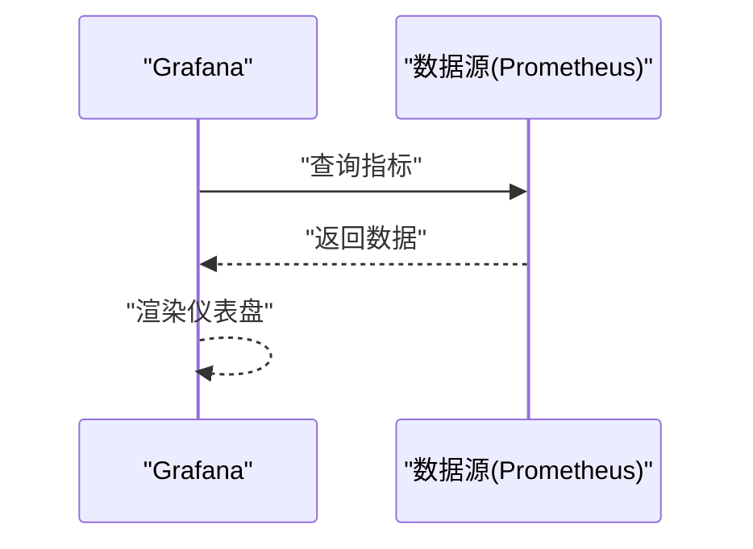

图表来源
- [config/grafana/provisioning/datasources/prometheus.yml](file://config/grafana/provisioning/datasources/prometheus.yml)
- [config/grafana/provisioning/dashboards/dashboards.yml](file://config/grafana/provisioning/dashboards/dashboards.yml)

章节来源
- [config/grafana/provisioning/datasources/prometheus.yml](file://config/grafana/provisioning/datasources/prometheus.yml)
- [config/grafana/provisioning/dashboards/dashboards.yml](file://config/grafana/provisioning/dashboards/dashboards.yml)

### 健康检查机制
- 编排层健康检查
  - 在 docker-compose 中为关键服务配置健康检查，确保依赖顺序与自动重启。
- 应用层健康检查
  - 提供 /health 路由，聚合各依赖的健康状态，供外部探针与编排器使用。

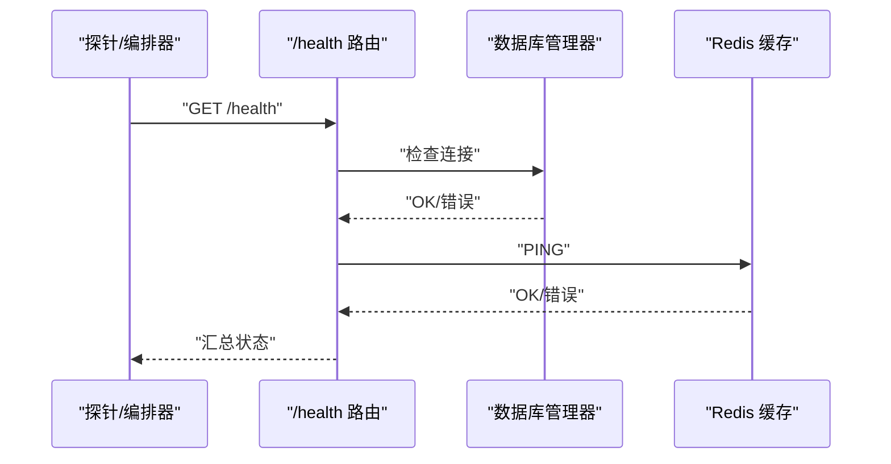

图表来源
- [backend_design/nexus/api/routes/health.py](file://backend_design/nexus/api/routes/health.py)
- [backend_design/nexus/core/db_manager.py](file://backend_design/nexus/core/db_manager.py)
- [backend_design/nexus/middleware/redis_cache.py](file://backend_design/nexus/middleware/redis_cache.py)

章节来源
- [docker-compose.yml](file://docker-compose.yml)
- [backend_design/nexus/api/routes/health.py](file://backend_design/nexus/api/routes/health.py)
- [backend_design/nexus/core/db_manager.py](file://backend_design/nexus/core/db_manager.py)
- [backend_design/nexus/middleware/redis_cache.py](file://backend_design/nexus/middleware/redis_cache.py)

### 数据持久化策略
- 原则
  - 所有有状态服务通过 volumes 挂载宿主机目录或命名卷，确保容器重建不丢失数据。
- 实践
  - MySQL：数据目录、日志目录、备份目录分离。
  - Redis：AOF/RDB 持久化开关与路径。
  - Milvus/Neo4j：索引与图数据目录独立挂载。
  - Prometheus/Grafana：指标与仪表盘配置持久化。

章节来源
- [docker-compose.yml](file://docker-compose.yml)

### 服务启动流程
- 编排启动
  - docker-compose up 拉起所有服务，按 depends_on 与 healthcheck 顺序启动。
- 应用初始化
  - 应用启动后执行中间件初始化脚本（如 Milvus/Neo4j），确保集合/图就绪。
- 健康就绪
  - 应用对外暴露 /health，编排器据此判定服务是否可接收流量。

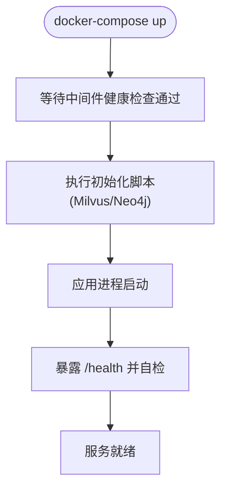

图表来源
- [docker-compose.yml](file://docker-compose.yml)
- [backend_design/scripts/init_milvus.py](file://backend_design/scripts/init_milvus.py)
- [backend_design/scripts/init_neo4j.py](file://backend_design/scripts/init_neo4j.py)
- [backend_design/nexus/api/routes/health.py](file://backend_design/nexus/api/routes/health.py)

章节来源
- [docker-compose.yml](file://docker-compose.yml)
- [backend_design/scripts/init_milvus.py](file://backend_design/scripts/init_milvus.py)
- [backend_design/scripts/init_neo4j.py](file://backend_design/scripts/init_neo4j.py)
- [backend_design/nexus/api/routes/health.py](file://backend_design/nexus/api/routes/health.py)

### 双模式部署方案（本地 Docker vs 云端托管服务）
- 本地 Docker 模式
  - 使用 docker-compose 拉起全部中间件与应用，便于开发与联调。
  - 通过环境变量切换连接地址、认证信息与资源限制。
- 云端托管模式
  - 将中间件替换为云厂商托管服务（如云 MySQL、云 Redis、云 Milvus、云 Neo4j、云 Prometheus/Grafana）。
  - 通过环境变量覆盖连接参数，保持应用代码不变。
- 配置管理
  - 集中式配置入口，按环境加载不同变量集，实现一键切换。

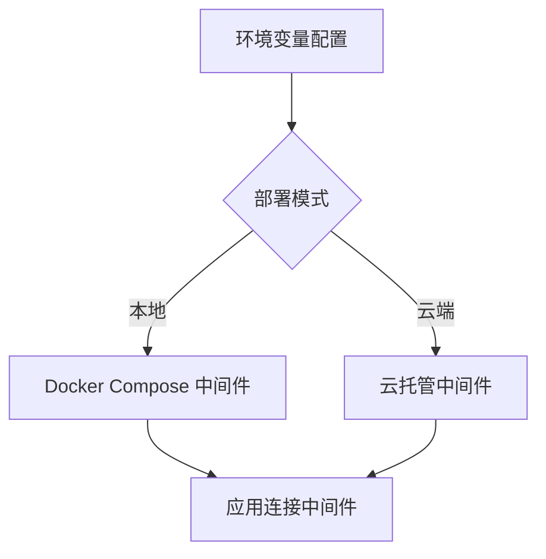

图表来源
- [backend_design/nexus/config.py](file://backend_design/nexus/config.py)

章节来源
- [docker-compose.yml](file://docker-compose.yml)
- [backend_design/nexus/config.py](file://backend_design/nexus/config.py)

### 应用侧中间件集成要点
- 向量检索
  - 通过向量存储抽象接口访问 Milvus，屏蔽底层差异。
- 图谱检索
  - 通过图谱存储抽象接口访问 Neo4j，统一查询模型。
- 缓存与会话
  - 通过 Redis 客户端封装，提供统一的 get/set/delete/expire 能力。
- 数据库访问
  - 通过数据库管理器统一管理连接池、事务与迁移。

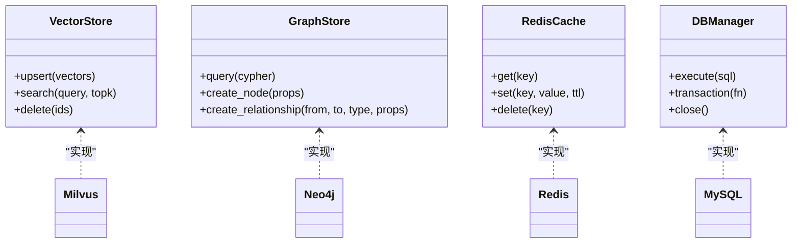

图表来源
- [backend_design/nexus/rag/vector_store.py](file://backend_design/nexus/rag/vector_store.py)
- [backend_design/nexus/rag/graph_store.py](file://backend_design/nexus/rag/graph_store.py)
- [backend_design/nexus/middleware/redis_cache.py](file://backend_design/nexus/middleware/redis_cache.py)
- [backend_design/nexus/core/db_manager.py](file://backend_design/nexus/core/db_manager.py)

章节来源
- [backend_design/nexus/rag/vector_store.py](file://backend_design/nexus/rag/vector_store.py)
- [backend_design/nexus/rag/graph_store.py](file://backend_design/nexus/rag/graph_store.py)
- [backend_design/nexus/middleware/redis_cache.py](file://backend_design/nexus/middleware/redis_cache.py)
- [backend_design/nexus/core/db_manager.py](file://backend_design/nexus/core/db_manager.py)

## 依赖关系分析
- 直接依赖
  - 应用依赖 MySQL、Redis、Milvus、Neo4j。
  - Prometheus 依赖应用与中间件暴露的指标端点。
  - Grafana 依赖 Prometheus 数据源。
- 间接依赖
  - 初始化脚本依赖对应中间件服务可用。
- 潜在循环依赖
  - 通过健康检查与 depends_on 规避启动阶段的循环依赖问题。

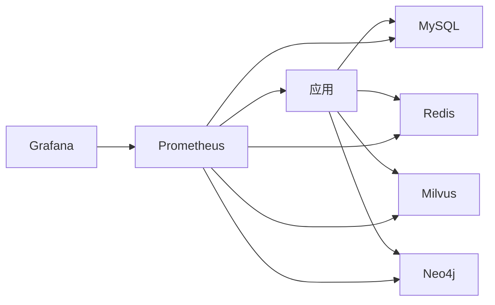

图表来源
- [docker-compose.yml](file://docker-compose.yml)
- [config/prometheus/prometheus.yml](file://config/prometheus/prometheus.yml)
- [config/grafana/provisioning/datasources/prometheus.yml](file://config/grafana/provisioning/datasources/prometheus.yml)

章节来源
- [docker-compose.yml](file://docker-compose.yml)
- [config/prometheus/prometheus.yml](file://config/prometheus/prometheus.yml)
- [config/grafana/provisioning/datasources/prometheus.yml](file://config/grafana/provisioning/datasources/prometheus.yml)

## 性能考虑
- 资源配额
  - 为 CPU、内存设置合理限制，避免争抢导致抖动。
- 连接池与超时
  - 数据库与缓存连接池大小需根据并发量调整；设置合理的读写超时与重试次数。
- 持久化与 I/O
  - 使用高性能磁盘或 SSD 挂载；合理配置 AOF/RDB 频率与 WAL 策略。
- 监控与告警
  - 基于 Prometheus+Grafana 建立关键指标看板与阈值告警，提前发现瓶颈。

[本节为通用指导，无需特定文件引用]

## 故障排查指南
- 常见症状
  - 应用无法连接中间件：检查端口、网络、认证信息。
  - 指标缺失：确认 /metrics 端点可达、Prometheus targets 配置正确。
  - 仪表盘空白：确认 Grafana 数据源连通性与权限。
- 定位步骤
  - 查看容器日志与编排健康检查输出。
  - 验证中间件健康检查脚本与端口监听。
  - 检查环境变量与配置文件一致性。
- 恢复建议
  - 重启异常服务；清理临时数据并重跑初始化脚本；回滚配置变更。

章节来源
- [docker-compose.yml](file://docker-compose.yml)
- [config/prometheus/prometheus.yml](file://config/prometheus/prometheus.yml)
- [config/grafana/provisioning/datasources/prometheus.yml](file://config/grafana/provisioning/datasources/prometheus.yml)
- [config/grafana/provisioning/dashboards/dashboards.yml](file://config/grafana/provisioning/dashboards/dashboards.yml)

## 结论
L0 基础设施层以 Docker Compose 为核心编排载体，围绕 MySQL、Redis、Milvus、Neo4j、Prometheus、Grafana 构建稳定可靠的中间件生态。通过健康检查、持久化与双模式部署策略，兼顾开发效率与生产可用性。配合完善的监控与排障手段，可有效提升系统的可观测性与稳定性。

[本节为总结性内容，无需特定文件引用]

## 附录
- 配置文件清单
  - docker-compose.yml：服务定义、网络、卷、健康检查
  - config/prometheus/prometheus.yml：抓取目标与保留策略
  - config/grafana/provisioning/datasources/prometheus.yml：数据源注入
  - config/grafana/provisioning/dashboards/dashboards.yml：仪表盘注入
- 初始化脚本
  - backend_design/scripts/init_milvus.py：Milvus 集合与索引初始化
  - backend_design/scripts/init_neo4j.py：Neo4j 图初始化
- 应用集成参考
  - backend_design/nexus/config.py：配置与环境变量管理
  - backend_design/nexus/core/db_manager.py：数据库连接与事务
  - backend_design/nexus/middleware/redis_cache.py：Redis 缓存封装
  - backend_design/nexus/rag/vector_store.py：向量存储抽象
  - backend_design/nexus/rag/graph_store.py：图谱存储抽象
  - backend_design/nexus/observability/metrics.py：指标暴露
  - backend_design/nexus/api/routes/health.py：健康检查路由
  - backend_design/nexus_gate/internal/handlers/redis_client.go：网关侧 Redis 客户端

章节来源
- [docker-compose.yml](file://docker-compose.yml)
- [config/prometheus/prometheus.yml](file://config/prometheus/prometheus.yml)
- [config/grafana/provisioning/datasources/prometheus.yml](file://config/grafana/provisioning/datasources/prometheus.yml)
- [config/grafana/provisioning/dashboards/dashboards.yml](file://config/grafana/provisioning/dashboards/dashboards.yml)
- [backend_design/scripts/init_milvus.py](file://backend_design/scripts/init_milvus.py)
- [backend_design/scripts/init_neo4j.py](file://backend_design/scripts/init_neo4j.py)
- [backend_design/nexus/config.py](file://backend_design/nexus/config.py)
- [backend_design/nexus/core/db_manager.py](file://backend_design/nexus/core/db_manager.py)
- [backend_design/nexus/middleware/redis_cache.py](file://backend_design/nexus/middleware/redis_cache.py)
- [backend_design/nexus/rag/vector_store.py](file://backend_design/nexus/rag/vector_store.py)
- [backend_design/nexus/rag/graph_store.py](file://backend_design/nexus/rag/graph_store.py)
- [backend_design/nexus/observability/metrics.py](file://backend_design/nexus/observability/metrics.py)
- [backend_design/nexus/api/routes/health.py](file://backend_design/nexus/api/routes/health.py)
- [backend_design/nexus_gate/internal/handlers/redis_client.go](file://backend_design/nexus_gate/internal/handlers/redis_client.go)