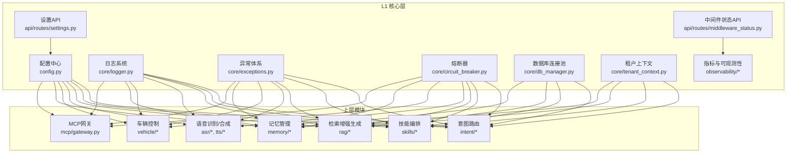
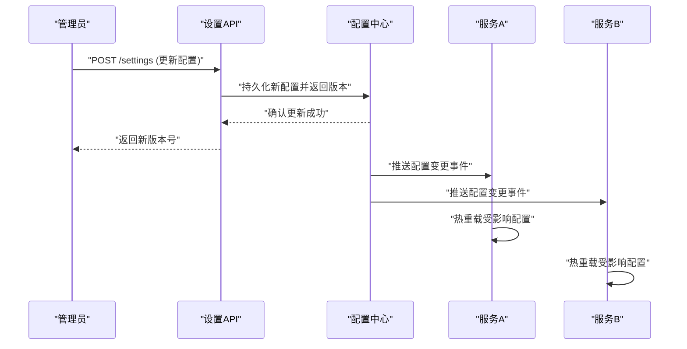
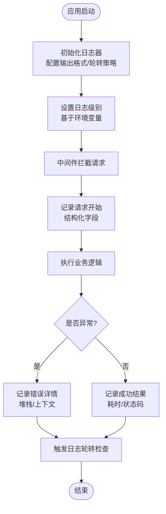
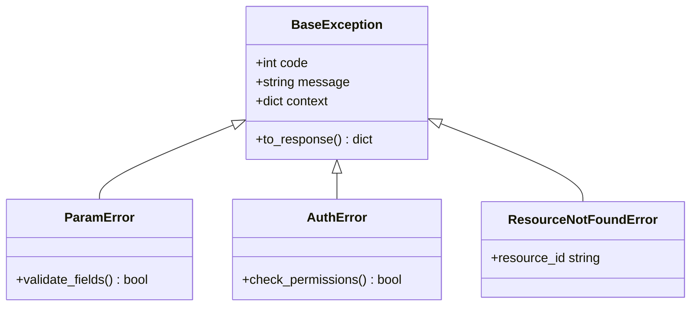
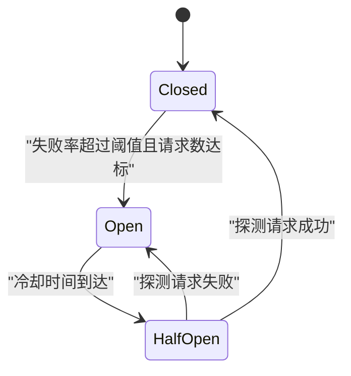
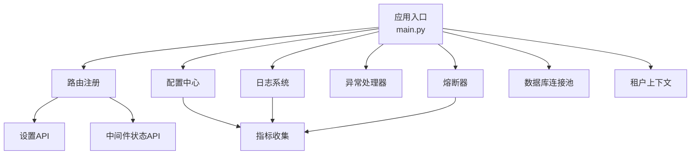
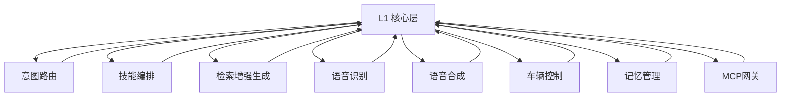

# L1 核心层

<cite>
**本文引用的文件**   
- [backend_design/nexus/config.py](file://backend_design/nexus/config.py)
- [backend_design/nexus/core/logger.py](file://backend_design/nexus/core/logger.py)
- [backend_design/nexus/core/exceptions.py](file://backend_design/nexus/core/exceptions.py)
- [backend_design/nexus/core/circuit_breaker.py](file://backend_design/nexus/core/circuit_breaker.py)
- [backend_design/nexus/main.py](file://backend_design/nexus/main.py)
- [backend_design/nexus/core/db_manager.py](file://backend_design/nexus/core/db_manager.py)
- [backend_design/nexus/core/personalization.py](file://backend_design/nexus/core/personalization.py)
- [backend_design/nexus/core/cockpit_manager.py](file://backend_design/nexus/core/cockpit_manager.py)
- [backend_design/nexus/core/tenant_context.py](file://backend_design/nexus/core/tenant_context.py)
- [backend_design/nexus/api/routes/settings.py](file://backend_design/nexus/api/routes/settings.py)
- [backend_design/nexus/api/routes/middleware_status.py](file://backend_design/nexus/api/routes/middleware_status.py)
- [backend_design/nexus/observability/metrics.py](file://backend_design/nexus/observability/metrics.py)
- [backend_design/nexus/observability/cockpit_metrics.py](file://backend_design/nexus/observability/cockpit_metrics.py)
- [backend_design/nexus/middleware/session_store.py](file://backend_design/nexus/middleware/session_store.py)
- [backend_design/nexus/middleware/redis_cache.py](file://backend_design/nexus/middleware/redis_cache.py)
- [backend_design/nexus/middleware/rate_limiter.py](file://backend_design/nexus/middleware/rate_limiter.py)
- [backend_design/nexus/middleware/task_queue.py](file://backend_design/nexus/middleware/task_queue.py)
- [backend_design/nexus/models/schemas.py](file://backend_design/nexus/models/schemas.py)
- [backend_design/nexus/models/state.py](file://backend_design/nexus/models/state.py)
- [backend_design/nexus/intent/router.py](file://backend_design/nexus/intent/router.py)
- [backend_design/nexus/intent/heuristic.py](file://backend_design/nexus/intent/heuristic.py)
- [backend_design/nexus/intent/llm_router.py](file://backend_design/nexus/intent/llm_router.py)
- [backend_design/nexus/vehicle/factory.py](file://backend_design/nexus/vehicle/factory.py)
- [backend_design/nexus/vehicle/base.py](file://backend_design/nexus/vehicle/base.py)
- [backend_design/nexus/vehicle/http.py](file://backend_design/nexus/vehicle/http.py)
- [backend_design/nexus/vehicle/mock.py](file://backend_design/nexus/vehicle/mock.py)
- [backend_design/nexus/vehicle/mcp.py](file://backend_design/nexus/vehicle/mcp.py)
- [backend_design/nexus/memory/manager.py](file://backend_design/nexus/memory/manager.py)
- [backend_design/nexus/memory/compressor.py](file://backend_design/nexus/memory/compressor.py)
- [backend_design/nexus/memory/conflict.py](file://backend_design/nexus/memory/conflict.py)
- [backend_design/nexus/skills/orchestrator.py](file://backend_design/nexus/skills/orchestrator.py)
- [backend_design/nexus/skills/registry.py](file://backend_design/nexus/skills/registry.py)
- [backend_design/nexus/skills/base.py](file://backend_design/nexus/skills/base.py)
- [backend_design/nexus/rag/graph_factory.py](file://backend_design/nexus/rag/graph_factory.py)
- [backend_design/nexus/rag/vector_factory.py](file://backend_design/nexus/rag/vector_factory.py)
- [backend_design/nexus/rag/retriever.py](file://backend_design/nexus/rag/retriever.py)
- [backend_design/nexus/rag/reranker_factory.py](file://backend_design/nexus/rag/reranker_factory.py)
- [backend_design/nexus/rag/unified_retriever.py](file://backend_design/nexus/rag/unified_retriever.py)
- [backend_design/nexus/asr/engine.py](file://backend_design/nexus/asr/engine.py)
- [backend_design/nexus/tts/engine.py](file://backend_design/nexus/tts/engine.py)
- [backend_design/nexus/mcp/gateway.py](file://backend_design/nexus/mcp/gateway.py)
- [backend_design/nexus/core/auth.py](file://backend_design/nexus/core/auth.py)
- [backend_design/nexus/core/voiceprint.py](file://backend_design/nexus/core/voiceprint.py)
- [backend_design/nexus/core/ssl_fix.py](file://backend_design/nexus/core/ssl_fix.py)
</cite>

## 目录
1. [简介](#简介)
2. [项目结构](#项目结构)
3. [核心组件](#核心组件)
4. [架构总览](#架构总览)
5. [详细组件分析](#详细组件分析)
6. [依赖关系分析](#依赖关系分析)
7. [性能考量](#性能考量)
8. [故障排查指南](#故障排查指南)
9. [结论](#结论)
10. [附录](#附录)

## 简介
本文件聚焦 NexusCockpit 的 L1 核心层，围绕以下关键能力展开：
- 集中式配置管理：多环境支持、动态配置更新与热加载
- 统一日志系统：结构化日志、日志轮转、性能监控集成
- 全局异常处理：自定义异常类型、错误码规范、异常恢复策略
- 熔断器模式：降级策略、熔断阈值、状态机
- 初始化流程、生命周期管理与依赖注入机制
- 配置示例、最佳实践与常见问题解决方案

L1 核心层为上层业务（意图路由、技能编排、RAG、ASR/TTS、车辆控制等）提供稳定、可观测、可扩展的基础设施。

## 项目结构
L1 核心层主要位于 backend_design/nexus 下的 core、config、api、middleware、observability 等模块中，并与上层模块通过清晰的接口契约交互。

图表来源
- [backend_design/nexus/config.py](file://backend_design/nexus/config.py)
- [backend_design/nexus/core/logger.py](file://backend_design/nexus/core/logger.py)
- [backend_design/nexus/core/exceptions.py](file://backend_design/nexus/core/exceptions.py)
- [backend_design/nexus/core/circuit_breaker.py](file://backend_design/nexus/core/circuit_breaker.py)
- [backend_design/nexus/core/db_manager.py](file://backend_design/nexus/core/db_manager.py)
- [backend_design/nexus/core/tenant_context.py](file://backend_design/nexus/core/tenant_context.py)
- [backend_design/nexus/observability/metrics.py](file://backend_design/nexus/observability/metrics.py)
- [backend_design/nexus/observability/cockpit_metrics.py](file://backend_design/nexus/observability/cockpit_metrics.py)
- [backend_design/nexus/api/routes/settings.py](file://backend_design/nexus/api/routes/settings.py)
- [backend_design/nexus/api/routes/middleware_status.py](file://backend_design/nexus/api/routes/middleware_status.py)

章节来源
- [backend_design/nexus/config.py](file://backend_design/nexus/config.py)
- [backend_design/nexus/core/logger.py](file://backend_design/nexus/core/logger.py)
- [backend_design/nexus/core/exceptions.py](file://backend_design/nexus/core/exceptions.py)
- [backend_design/nexus/core/circuit_breaker.py](file://backend_design/nexus/core/circuit_breaker.py)
- [backend_design/nexus/core/db_manager.py](file://backend_design/nexus/core/db_manager.py)
- [backend_design/nexus/core/tenant_context.py](file://backend_design/nexus/core/tenant_context.py)
- [backend_design/nexus/observability/metrics.py](file://backend_design/nexus/observability/metrics.py)
- [backend_design/nexus/observability/cockpit_metrics.py](file://backend_design/nexus/observability/cockpit_metrics.py)
- [backend_design/nexus/api/routes/settings.py](file://backend_design/nexus/api/routes/settings.py)
- [backend_design/nexus/api/routes/middleware_status.py](file://backend_design/nexus/api/routes/middleware_status.py)

## 核心组件
本节对 L1 核心层的四大基础能力进行深度解析：配置管理、日志系统、异常处理、熔断器。

### 集中式配置管理（多环境支持与动态更新）
- 多环境支持：通过环境变量或配置文件区分开发、测试、生产环境；按环境选择不同配置源（本地文件、远端配置中心）。
- 动态配置更新：暴露设置 API 以支持运行时刷新配置项；结合事件通知机制触发相关服务热重载。
- 配置校验与默认值：在启动阶段完成必填字段校验并提供合理默认值，避免运行时崩溃。
- 配置版本与回滚：记录配置变更历史，支持快速回滚到上一稳定版本。

图表来源
- [backend_design/nexus/api/routes/settings.py](file://backend_design/nexus/api/routes/settings.py)
- [backend_design/nexus/config.py](file://backend_design/nexus/config.py)

章节来源
- [backend_design/nexus/config.py](file://backend_design/nexus/config.py)
- [backend_design/nexus/api/routes/settings.py](file://backend_design/nexus/api/routes/settings.py)

### 统一日志系统（结构化日志、日志轮转、性能监控）
- 结构化日志：所有日志输出采用 JSON 格式，包含请求ID、租户ID、耗时、级别、消息等字段，便于聚合与分析。
- 日志轮转：按大小或时间自动切分日志文件，保留策略可配置，避免磁盘占用过高。
- 性能监控集成：在关键路径埋点，将耗时、错误率等指标上报至监控系统（Prometheus/Grafana）。
- 分级输出：根据环境调整日志级别，生产环境默认 INFO/WARN/ERROR，调试时可临时提升为 DEBUG。

图表来源
- [backend_design/nexus/core/logger.py](file://backend_design/nexus/core/logger.py)
- [backend_design/nexus/observability/metrics.py](file://backend_design/nexus/observability/metrics.py)

章节来源
- [backend_design/nexus/core/logger.py](file://backend_design/nexus/core/logger.py)
- [backend_design/nexus/observability/metrics.py](file://backend_design/nexus/observability/metrics.py)

### 全局异常处理（自定义异常类型、错误码规范、异常恢复策略）
- 自定义异常类型：定义业务异常基类及细分异常（如参数错误、权限不足、资源不存在等），携带错误码与上下文信息。
- 错误码规范：统一错误码前缀与层级，便于前端展示与运维定位。
- 异常恢复策略：对幂等操作实现重试与退避；对非致命错误执行降级或缓存兜底。
- 全局捕获：在入口层统一捕获未处理异常，转换为标准响应格式并记录结构化日志。

图表来源
- [backend_design/nexus/core/exceptions.py](file://backend_design/nexus/core/exceptions.py)

章节来源
- [backend_design/nexus/core/exceptions.py](file://backend_design/nexus/core/exceptions.py)

### 熔断器模式（降级策略、熔断阈值、状态机）
- 状态机：Closed → Open → Half-Open，依据失败率与请求数切换状态。
- 阈值配置：失败率阈值、最小请求数、半开探测窗口、冷却时间等均可配置。
- 降级策略：熔断时返回缓存数据、默认值或友好提示，保障用户体验。
- 指标上报：将熔断状态、成功率、延迟等指标暴露给监控系统。

图表来源
- [backend_design/nexus/core/circuit_breaker.py](file://backend_design/nexus/core/circuit_breaker.py)

章节来源
- [backend_design/nexus/core/circuit_breaker.py](file://backend_design/nexus/core/circuit_breaker.py)

## 架构总览
L1 核心层作为基础设施，向上提供配置、日志、异常、熔断、数据库连接、租户上下文等能力，并通过 API 暴露动态配置与中间件状态查询。

图表来源
- [backend_design/nexus/main.py](file://backend_design/nexus/main.py)
- [backend_design/nexus/config.py](file://backend_design/nexus/config.py)
- [backend_design/nexus/core/logger.py](file://backend_design/nexus/core/logger.py)
- [backend_design/nexus/core/exceptions.py](file://backend_design/nexus/core/exceptions.py)
- [backend_design/nexus/core/circuit_breaker.py](file://backend_design/nexus/core/circuit_breaker.py)
- [backend_design/nexus/core/db_manager.py](file://backend_design/nexus/core/db_manager.py)
- [backend_design/nexus/core/tenant_context.py](file://backend_design/nexus/core/tenant_context.py)
- [backend_design/nexus/observability/metrics.py](file://backend_design/nexus/observability/metrics.py)
- [backend_design/nexus/api/routes/settings.py](file://backend_design/nexus/api/routes/settings.py)
- [backend_design/nexus/api/routes/middleware_status.py](file://backend_design/nexus/api/routes/middleware_status.py)

## 详细组件分析

### 配置中心（config.py）
- 职责：加载多环境配置、提供读取接口、支持动态更新与版本管理。
- 关键点：
  - 环境变量优先于配置文件
  - 配置项分组（数据库、缓存、外部服务、功能开关）
  - 变更事件广播，供订阅者热重载
- 依赖注入：通过单例或容器注入到各模块，避免重复加载。

章节来源
- [backend_design/nexus/config.py](file://backend_design/nexus/config.py)

### 日志系统（core/logger.py）
- 职责：统一日志格式、轮转策略、性能埋点。
- 关键点：
  - JSON 结构化输出
  - 按大小/时间轮转，保留策略可配
  - 与指标系统对接，输出耗时与错误率

章节来源
- [backend_design/nexus/core/logger.py](file://backend_design/nexus/core/logger.py)

### 异常体系（core/exceptions.py）
- 职责：定义统一异常类型与错误码，提供标准化响应转换。
- 关键点：
  - 基类封装通用字段（code、message、context）
  - 子类覆盖特定业务场景
  - 全局捕获器转换为 HTTP 响应

章节来源
- [backend_design/nexus/core/exceptions.py](file://backend_design/nexus/core/exceptions.py)

### 熔断器（core/circuit_breaker.py）
- 职责：保护下游依赖，防止雪崩。
- 关键点：
  - 状态机驱动（Closed/Open/Half-Open）
  - 可配置阈值与冷却时间
  - 降级回调函数支持

章节来源
- [backend_design/nexus/core/circuit_breaker.py](file://backend_design/nexus/core/circuit_breaker.py)

### 数据库连接池（core/db_manager.py）
- 职责：管理数据库连接生命周期、连接复用、健康检查。
- 关键点：
  - 连接池大小与超时配置
  - 事务边界管理
  - 慢查询日志与指标上报

章节来源
- [backend_design/nexus/core/db_manager.py](file://backend_design/nexus/core/db_manager.py)

### 租户上下文（core/tenant_context.py）
- 职责：在请求上下文中维护租户标识，贯穿全链路。
- 关键点：
  - 从请求头或会话中提取租户ID
  - 线程/协程安全存储
  - 与日志、指标、权限校验联动

章节来源
- [backend_design/nexus/core/tenant_context.py](file://backend_design/nexus/core/tenant_context.py)

### 指标与可观测性（observability/*）
- 职责：采集系统与应用指标，暴露 Prometheus 端点，集成 Grafana 看板。
- 关键点：
  - 内置指标（请求数、延迟、错误率、熔断状态）
  - 自定义指标扩展点
  - 与日志系统关联（traceId 关联）

章节来源
- [backend_design/nexus/observability/metrics.py](file://backend_design/nexus/observability/metrics.py)
- [backend_design/nexus/observability/cockpit_metrics.py](file://backend_design/nexus/observability/cockpit_metrics.py)

### 设置 API（api/routes/settings.py）
- 职责：提供运行时配置更新接口，支持灰度发布与回滚。
- 关键点：
  - 权限校验与审计日志
  - 配置版本对比与差异展示
  - 变更事件广播

章节来源
- [backend_design/nexus/api/routes/settings.py](file://backend_design/nexus/api/routes/settings.py)

### 中间件状态 API（api/routes/middleware_status.py）
- 职责：暴露中间件运行状态（限流、缓存、任务队列等）用于监控与诊断。
- 关键点：
  - 实时状态快照
  - 历史趋势查询
  - 告警阈值配置

章节来源
- [backend_design/nexus/api/routes/middleware_status.py](file://backend_design/nexus/api/routes/middleware_status.py)

## 依赖关系分析
L1 核心层与上层模块的依赖关系如下：

图表来源
- [backend_design/nexus/intent/router.py](file://backend_design/nexus/intent/router.py)
- [backend_design/nexus/skills/orchestrator.py](file://backend_design/nexus/skills/orchestrator.py)
- [backend_design/nexus/rag/unified_retriever.py](file://backend_design/nexus/rag/unified_retriever.py)
- [backend_design/nexus/asr/engine.py](file://backend_design/nexus/asr/engine.py)
- [backend_design/nexus/tts/engine.py](file://backend_design/nexus/tts/engine.py)
- [backend_design/nexus/vehicle/factory.py](file://backend_design/nexus/vehicle/factory.py)
- [backend_design/nexus/memory/manager.py](file://backend_design/nexus/memory/manager.py)
- [backend_design/nexus/mcp/gateway.py](file://backend_design/nexus/mcp/gateway.py)

章节来源
- [backend_design/nexus/intent/router.py](file://backend_design/nexus/intent/router.py)
- [backend_design/nexus/skills/orchestrator.py](file://backend_design/nexus/skills/orchestrator.py)
- [backend_design/nexus/rag/unified_retriever.py](file://backend_design/nexus/rag/unified_retriever.py)
- [backend_design/nexus/asr/engine.py](file://backend_design/nexus/asr/engine.py)
- [backend_design/nexus/tts/engine.py](file://backend_design/nexus/tts/engine.py)
- [backend_design/nexus/vehicle/factory.py](file://backend_design/nexus/vehicle/factory.py)
- [backend_design/nexus/memory/manager.py](file://backend_design/nexus/memory/manager.py)
- [backend_design/nexus/mcp/gateway.py](file://backend_design/nexus/mcp/gateway.py)

## 性能考量
- 配置加载：启动时批量加载，避免频繁 IO；动态更新使用增量合并。
- 日志写入：异步落盘，批量刷写，减少 I/O 开销。
- 熔断器：轻量级状态机，避免锁竞争；半开探测限流。
- 数据库连接池：合理设置最大连接数与空闲回收策略。
- 指标采集：采样与聚合，避免高频上报造成额外负载。

## 故障排查指南
- 配置问题：
  - 检查环境变量优先级与配置文件路径
  - 查看设置 API 的变更历史与回滚记录
- 日志问题：
  - 确认日志轮转策略与磁盘空间
  - 验证结构化字段完整性（requestId、tenantId）
- 异常处理：
  - 核对错误码规范与前端映射
  - 检查全局捕获器是否正确转换响应
- 熔断器：
  - 观察状态机切换日志与阈值配置
  - 分析降级策略是否生效

章节来源
- [backend_design/nexus/api/routes/settings.py](file://backend_design/nexus/api/routes/settings.py)
- [backend_design/nexus/core/logger.py](file://backend_design/nexus/core/logger.py)
- [backend_design/nexus/core/exceptions.py](file://backend_design/nexus/core/exceptions.py)
- [backend_design/nexus/core/circuit_breaker.py](file://backend_design/nexus/core/circuit_breaker.py)

## 结论
L1 核心层通过配置中心、统一日志、全局异常与熔断器四大能力，为 NexusCockpit 提供了稳定、可观测、可扩展的基础设施。配合中间件与上层模块，实现了高可用与易维护的系统架构。建议在生产环境中严格遵循配置规范、日志标准与异常处理约定，并结合监控告警实现主动运维。

## 附录
- 配置示例：参考设置 API 的请求体结构与响应格式
- 最佳实践：
  - 使用环境变量区分环境，敏感信息通过密钥管理服务注入
  - 日志中务必包含 requestId 与 tenantId，便于追踪
  - 熔断阈值需根据实际流量与 SLA 调优
- 常见问题：
  - 动态配置未生效：检查事件广播与订阅者实现
  - 日志丢失：确认异步队列与磁盘配额
  - 熔断误触发：调整失败率阈值与最小请求数