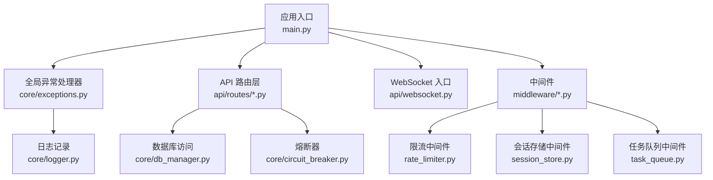
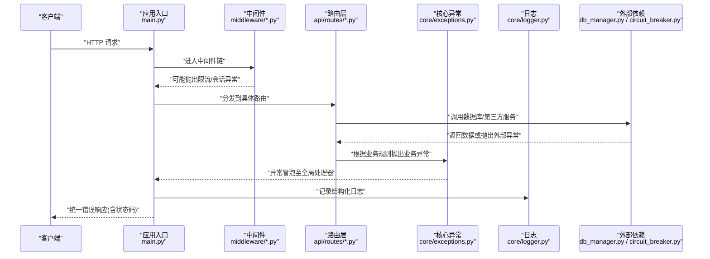
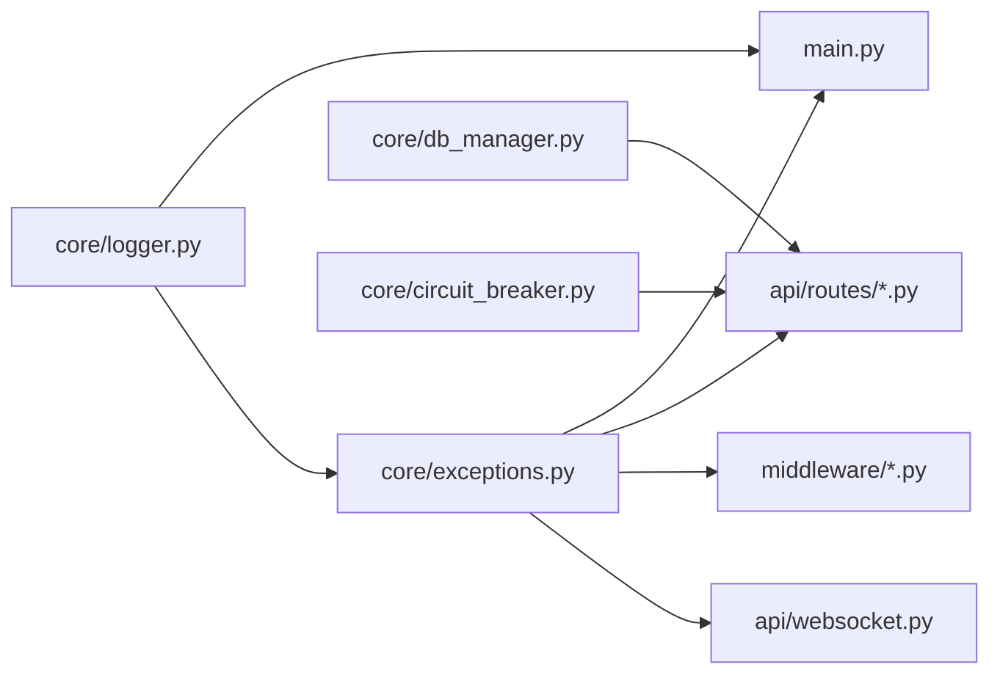

# 全局异常处理

<cite>
**本文引用的文件**   
- [backend_design/nexus/core/exceptions.py](file://backend_design/nexus/core/exceptions.py)
- [backend_design/nexus/main.py](file://backend_design/nexus/main.py)
- [backend_design/nexus/api/routes/chat.py](file://backend_design/nexus/api/routes/chat.py)
- [backend_design/nexus/api/routes/auth.py](file://backend_design/nexus/api/routes/auth.py)
- [backend_design/nexus/api/routes/cockpit.py](file://backend_design/nexus/api/routes/cockpit.py)
- [backend_design/nexus/api/routes/dataplatform.py](file://backend_design/nexus/api/routes/dataplatform.py)
- [backend_design/nexus/api/routes/vehicle.py](file://backend_design/nexus/api/routes/vehicle.py)
- [backend_design/nexus/api/websocket.py](file://backend_design/nexus/api/websocket.py)
- [backend_design/nexus/middleware/rate_limiter.py](file://backend_design/nexus/middleware/rate_limiter.py)
- [backend_design/nexus/middleware/session_store.py](file://backend_design/nexus/middleware/session_store.py)
- [backend_design/nexus/middleware/task_queue.py](file://backend_design/nexus/middleware/task_queue.py)
- [backend_design/nexus/core/logger.py](file://backend_design/nexus/core/logger.py)
- [backend_design/nexus/core/circuit_breaker.py](file://backend_design/nexus/core/circuit_breaker.py)
- [backend_design/nexus/core/db_manager.py](file://backend_design/nexus/core/db_manager.py)
</cite>

## 目录
1. [简介](#简介)
2. [项目结构](#项目结构)
3. [核心组件](#核心组件)
4. [架构总览](#架构总览)
5. [详细组件分析](#详细组件分析)
6. [依赖关系分析](#依赖关系分析)
7. [性能考虑](#性能考虑)
8. [故障排查指南](#故障排查指南)
9. [结论](#结论)
10. [附录](#附录)

## 简介
本文件面向 NexusCockpit 后端的全局异常处理系统，系统性阐述自定义异常类型设计、错误码规范、异常恢复策略与 HTTP 状态码映射；覆盖业务异常、系统异常、第三方服务异常的分类与处理流程；说明异常中间件实现、统一错误响应格式、调试信息控制与生产环境安全考虑；并提供异常捕获最佳实践与故障排查指南。

## 项目结构
NexusCockpit 的后端基于 Python（FastAPI）构建，异常处理相关代码主要分布在以下位置：
- 核心异常定义与工具：backend_design/nexus/core/exceptions.py
- 应用启动与全局异常注册：backend_design/nexus/main.py
- API 路由层示例（展示如何抛出/使用异常）：backend_design/nexus/api/routes/*.py
- WebSocket 异常处理入口：backend_design/nexus/api/websocket.py
- 中间件（限流、会话、任务队列等）：backend_design/nexus/middleware/*.py
- 日志与可观测性：backend_design/nexus/core/logger.py
- 外部依赖与容错（数据库、熔断器）：backend_design/nexus/core/db_manager.py, backend_design/nexus/core/circuit_breaker.py

图表来源
- [backend_design/nexus/main.py](file://backend_design/nexus/main.py)
- [backend_design/nexus/core/exceptions.py](file://backend_design/nexus/core/exceptions.py)
- [backend_design/nexus/api/routes/chat.py](file://backend_design/nexus/api/routes/chat.py)
- [backend_design/nexus/api/websocket.py](file://backend_design/nexus/api/websocket.py)
- [backend_design/nexus/middleware/rate_limiter.py](file://backend_design/nexus/middleware/rate_limiter.py)
- [backend_design/nexus/middleware/session_store.py](file://backend_design/nexus/middleware/session_store.py)
- [backend_design/nexus/middleware/task_queue.py](file://backend_design/nexus/middleware/task_queue.py)
- [backend_design/nexus/core/db_manager.py](file://backend_design/nexus/core/db_manager.py)
- [backend_design/nexus/core/circuit_breaker.py](file://backend_design/nexus/core/circuit_breaker.py)
- [backend_design/nexus/core/logger.py](file://backend_design/nexus/core/logger.py)

章节来源
- [backend_design/nexus/main.py](file://backend_design/nexus/main.py)
- [backend_design/nexus/core/exceptions.py](file://backend_design/nexus/core/exceptions.py)

## 核心组件
- 自定义异常基类与分层异常族：提供统一的异常层次结构与扩展点，便于在路由层精准抛出并在全局处理器中分类处理。
- 全局异常处理器：在应用启动时注册，拦截未处理异常，转换为标准 JSON 错误响应，并写入结构化日志。
- 中间件集成：在限流、会话、任务队列等中间件中按职责抛出领域异常，避免将底层细节泄露到上层。
- 外部依赖封装：对数据库、第三方服务等调用进行异常归一化，结合熔断器与重试策略提升稳定性。
- 日志与可观测性：通过统一日志模块输出上下文信息（请求 ID、租户、用户、耗时等），便于追踪与排障。

章节来源
- [backend_design/nexus/core/exceptions.py](file://backend_design/nexus/core/exceptions.py)
- [backend_design/nexus/main.py](file://backend_design/nexus/main.py)
- [backend_design/nexus/core/logger.py](file://backend_design/nexus/core/logger.py)

## 架构总览
下图展示了从请求进入应用到异常被捕获、转换与返回的完整链路，以及关键组件间的交互。

图表来源
- [backend_design/nexus/main.py](file://backend_design/nexus/main.py)
- [backend_design/nexus/core/exceptions.py](file://backend_design/nexus/core/exceptions.py)
- [backend_design/nexus/api/routes/chat.py](file://backend_design/nexus/api/routes/chat.py)
- [backend_design/nexus/middleware/rate_limiter.py](file://backend_design/nexus/middleware/rate_limiter.py)
- [backend_design/nexus/core/db_manager.py](file://backend_design/nexus/core/db_manager.py)
- [backend_design/nexus/core/circuit_breaker.py](file://backend_design/nexus/core/circuit_breaker.py)
- [backend_design/nexus/core/logger.py](file://backend_design/nexus/core/logger.py)

## 详细组件分析

### 自定义异常类型设计与错误码规范
- 异常分层建议
  - 基础异常：所有异常的根类，提供通用字段（如错误码、消息、上下文）。
  - 业务异常：用于表达明确的业务约束违反（如参数校验失败、权限不足、资源不存在）。
  - 系统异常：表示内部错误或不可恢复的系统问题（如配置缺失、初始化失败）。
  - 第三方服务异常：封装外部依赖的错误（如网络超时、上游服务不可用、鉴权失败）。
- 错误码规范
  - 采用“模块前缀 + 三位数字”的编码方式，确保唯一性与可读性。
  - 建议为常见场景预置常量（如参数错误、权限拒绝、资源不存在、限流、上游错误等）。
- 异常元数据
  - 包含请求标识、租户、用户、时间戳、堆栈摘要等，便于追踪与审计。
  - 敏感字段需脱敏（如密码、令牌、手机号等）。

章节来源
- [backend_design/nexus/core/exceptions.py](file://backend_design/nexus/core/exceptions.py)

### 全局异常处理器与 HTTP 状态码映射
- 注册位置
  - 在应用启动阶段注册全局异常处理器，确保所有未捕获异常均能统一收敛。
- 映射原则
  - 业务异常 → 4xx（如 400 参数错误、401 未认证、403 权限不足、404 资源不存在、429 限流）。
  - 第三方服务异常 → 5xx（如 502 上游错误、503 服务不可用、504 网关超时），并结合熔断器降级。
  - 系统异常 → 500 内部错误，附带最小化对外暴露信息。
- 响应体结构
  - 统一字段：错误码、消息、请求标识、时间戳、可选详情（开发环境可见）。
  - 生产环境隐藏堆栈与内部路径，仅保留必要诊断信息。
- 日志关联
  - 每个错误响应携带请求 ID，日志中包含相同 ID，便于端到端追踪。

章节来源
- [backend_design/nexus/main.py](file://backend_design/nexus/main.py)
- [backend_design/nexus/core/exceptions.py](file://backend_design/nexus/core/exceptions.py)

### 中间件中的异常处理
- 限流中间件
  - 触发条件：超过阈值后抛出限流异常，映射为 429。
  - 行为：记录限流事件，返回统一错误响应。
- 会话存储中间件
  - 触发条件：会话读取/写入失败、过期、非法状态等，抛出会话异常，映射为 401/403。
  - 行为：清理无效会话，记录审计日志。
- 任务队列中间件
  - 触发条件：任务入队/出队失败、重复提交、队列满等，抛出任务异常，映射为 503/429。
  - 行为：退避重试、告警上报。

章节来源
- [backend_design/nexus/middleware/rate_limiter.py](file://backend_design/nexus/middleware/rate_limiter.py)
- [backend_design/nexus/middleware/session_store.py](file://backend_design/nexus/middleware/session_store.py)
- [backend_design/nexus/middleware/task_queue.py](file://backend_design/nexus/middleware/task_queue.py)

### API 路由层的异常使用
- 路由示例
  - 聊天接口：参数校验失败抛业务异常；模型调用失败抛第三方服务异常。
  - 认证接口：凭据错误抛业务异常；令牌失效抛会话异常。
  - 座舱接口：设备状态异常抛系统异常；车辆控制失败抛第三方服务异常。
  - 数据平台接口：查询失败抛第三方服务异常；权限不足抛业务异常。
  - 车辆接口：协议不匹配抛业务异常；通信失败抛第三方服务异常。
- 最佳实践
  - 在路由层尽早校验输入，明确语义地抛出业务异常。
  - 对第三方调用进行异常归一化，不要将底层异常直接上抛。
  - 在需要时附加上下文（如设备 ID、会话 ID、操作人）。

章节来源
- [backend_design/nexus/api/routes/chat.py](file://backend_design/nexus/api/routes/chat.py)
- [backend_design/nexus/api/routes/auth.py](file://backend_design/nexus/api/routes/auth.py)
- [backend_design/nexus/api/routes/cockpit.py](file://backend_design/nexus/api/routes/cockpit.py)
- [backend_design/nexus/api/routes/dataplatform.py](file://backend_design/nexus/api/routes/dataplatform.py)
- [backend_design/nexus/api/routes/vehicle.py](file://backend_design/nexus/api/routes/vehicle.py)

### WebSocket 异常处理
- 连接建立阶段
  - 鉴权失败、会话无效、配额超限等，立即关闭连接并记录审计日志。
- 消息处理阶段
  - 解析失败、指令非法、下游服务不可用等，发送标准化错误帧并继续维持连接（除非致命错误）。
- 资源清理
  - 异常分支确保释放锁、断开下游、更新状态机。

章节来源
- [backend_design/nexus/api/websocket.py](file://backend_design/nexus/api/websocket.py)

### 外部依赖与容错（数据库、熔断器）
- 数据库访问
  - 连接失败、事务异常、死锁等，归一化为系统异常或第三方服务异常，配合重试与回退策略。
- 熔断器
  - 对不稳定上游进行快速失败与半开探测，避免雪崩。
  - 熔断开启时返回降级响应（如缓存数据或默认值），并记录告警。

章节来源
- [backend_design/nexus/core/db_manager.py](file://backend_design/nexus/core/db_manager.py)
- [backend_design/nexus/core/circuit_breaker.py](file://backend_design/nexus/core/circuit_breaker.py)

### 错误响应格式与调试信息控制
- 统一响应字段
  - 错误码、消息、请求标识、时间戳、可选详情（开发环境）。
- 调试开关
  - 通过环境变量控制是否返回堆栈、SQL 片段、内部路径等敏感信息。
- 生产安全
  - 默认关闭详细错误；仅在受控白名单内暴露；所有错误必须落盘且带请求 ID。

章节来源
- [backend_design/nexus/core/exceptions.py](file://backend_design/nexus/core/exceptions.py)
- [backend_design/nexus/main.py](file://backend_design/nexus/main.py)
- [backend_design/nexus/core/logger.py](file://backend_design/nexus/core/logger.py)

## 依赖关系分析
- 耦合与内聚
  - 异常定义集中管理，路由与中间件仅依赖异常类型与错误码，保持高内聚低耦合。
- 外部依赖
  - 数据库、第三方服务通过封装层抛出归一化异常，降低上层复杂度。
- 潜在循环依赖
  - 避免在异常模块中引入业务逻辑；日志模块应轻量且不反向依赖业务模块。

图表来源
- [backend_design/nexus/core/exceptions.py](file://backend_design/nexus/core/exceptions.py)
- [backend_design/nexus/main.py](file://backend_design/nexus/main.py)
- [backend_design/nexus/api/routes/chat.py](file://backend_design/nexus/api/routes/chat.py)
- [backend_design/nexus/middleware/rate_limiter.py](file://backend_design/nexus/middleware/rate_limiter.py)
- [backend_design/nexus/api/websocket.py](file://backend_design/nexus/api/websocket.py)
- [backend_design/nexus/core/db_manager.py](file://backend_design/nexus/core/db_manager.py)
- [backend_design/nexus/core/circuit_breaker.py](file://backend_design/nexus/core/circuit_breaker.py)
- [backend_design/nexus/core/logger.py](file://backend_design/nexus/core/logger.py)

章节来源
- [backend_design/nexus/core/exceptions.py](file://backend_design/nexus/core/exceptions.py)
- [backend_design/nexus/main.py](file://backend_design/nexus/main.py)

## 性能考虑
- 异常路径开销
  - 尽量避免在热路径频繁构造复杂异常对象；复用错误码与消息模板。
- 日志级别控制
  - 生产环境降低 DEBUG 级别日志量；对高频错误采样记录。
- 熔断与降级
  - 对不稳定上游启用熔断，减少长尾延迟与资源占用。
- 限流与背压
  - 合理设置限流阈值，避免异常风暴导致雪崩。

[本节为通用指导，无需特定文件引用]

## 故障排查指南
- 定位步骤
  - 通过错误响应中的请求 ID 在日志系统中检索完整链路。
  - 检查中间件日志（限流、会话、任务队列）确认是否在入口处被拦截。
  - 查看外部依赖日志（数据库、第三方服务）判断是否为上游问题。
- 常见问题
  - 参数错误：核对路由层校验逻辑与错误码映射。
  - 权限不足：检查会话中间件与鉴权流程。
  - 上游不可用：观察熔断器状态与降级策略。
  - 限流过严：调整阈值与窗口大小，关注峰值流量。
- 修复建议
  - 补充单元测试覆盖异常分支。
  - 增加可观测指标（错误率、P99 延迟、熔断次数）。
  - 完善告警规则（错误率突增、上游超时比例升高）。

章节来源
- [backend_design/nexus/middleware/rate_limiter.py](file://backend_design/nexus/middleware/rate_limiter.py)
- [backend_design/nexus/middleware/session_store.py](file://backend_design/nexus/middleware/session_store.py)
- [backend_design/nexus/middleware/task_queue.py](file://backend_design/nexus/middleware/task_queue.py)
- [backend_design/nexus/core/circuit_breaker.py](file://backend_design/nexus/core/circuit_breaker.py)
- [backend_design/nexus/core/logger.py](file://backend_design/nexus/core/logger.py)

## 结论
通过统一的异常分层、严格的错误码规范、集中的全局处理器与中间件协作，NexusCockpit 实现了稳定、可观测、安全的异常处理体系。在生产环境中，应严格遵循最小暴露原则，结合熔断、限流与降级策略，保障系统在异常条件下的可用性与可恢复性。

[本节为总结性内容，无需特定文件引用]

## 附录

### 异常捕获最佳实践
- 在路由层尽早校验输入，抛出明确的业务异常。
- 对第三方调用进行异常归一化，避免泄漏底层细节。
- 在中间件中只处理横切关注点（限流、会话、任务），不承载业务逻辑。
- 为关键路径添加结构化日志与指标埋点。
- 使用熔断器保护不稳定依赖，及时降级与告警。

[本节为通用指导，无需特定文件引用]