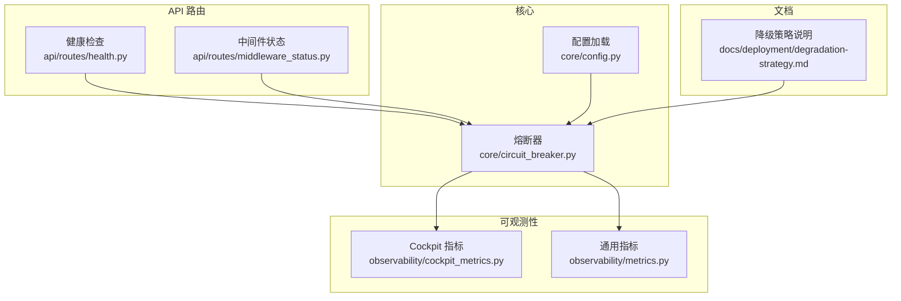
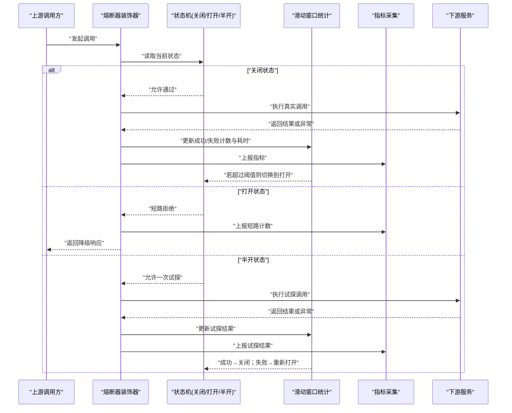
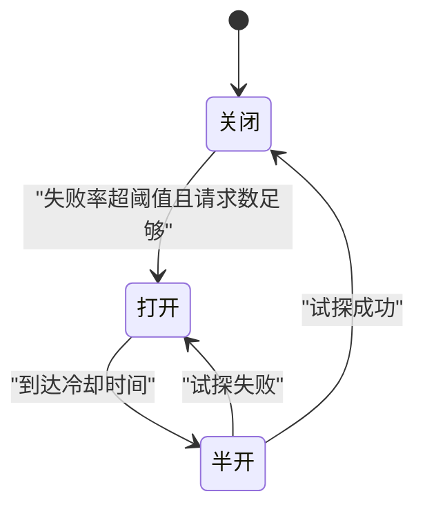
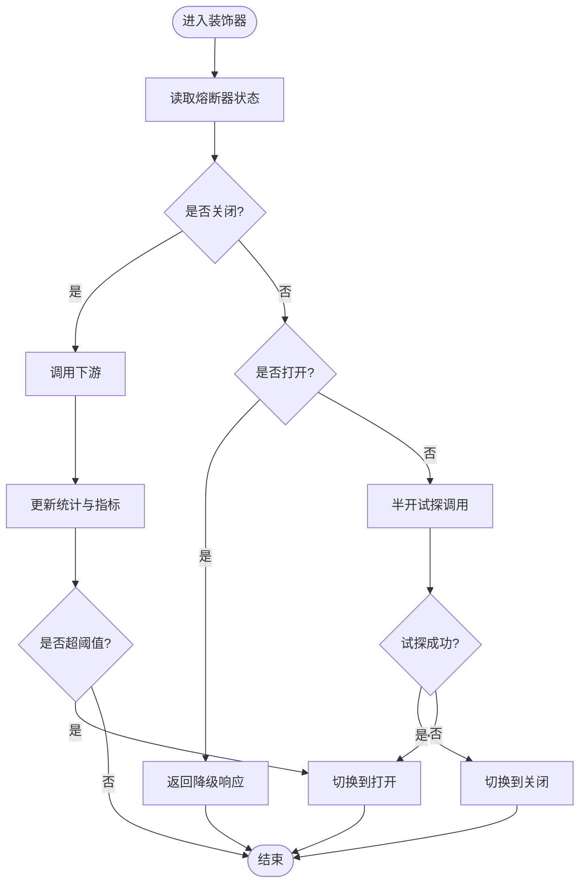
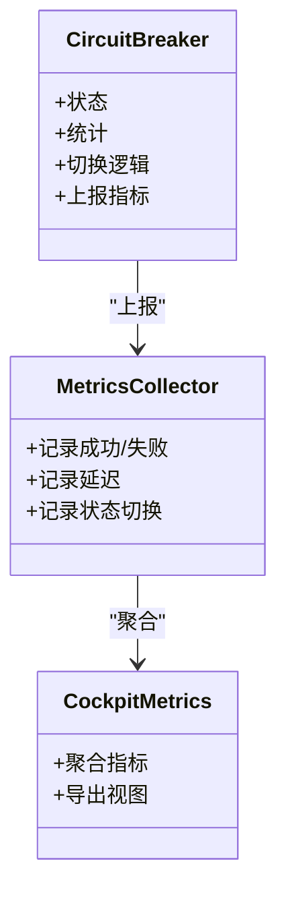
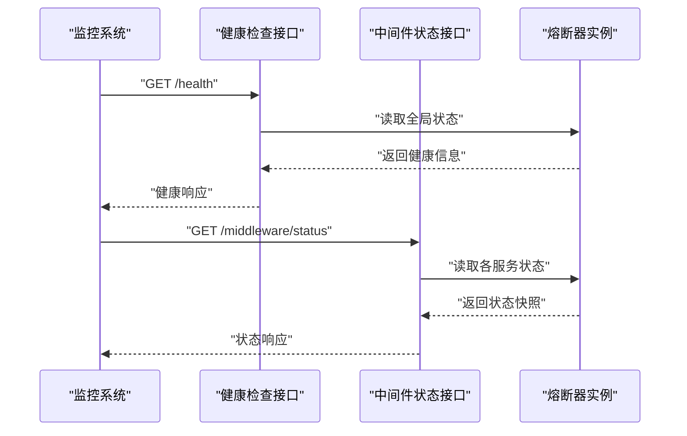
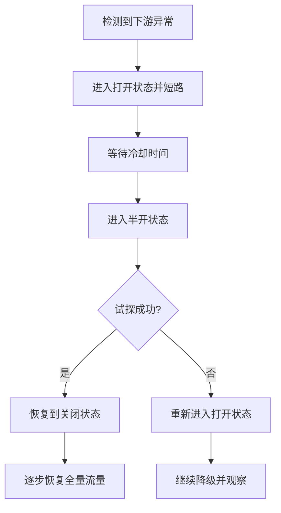
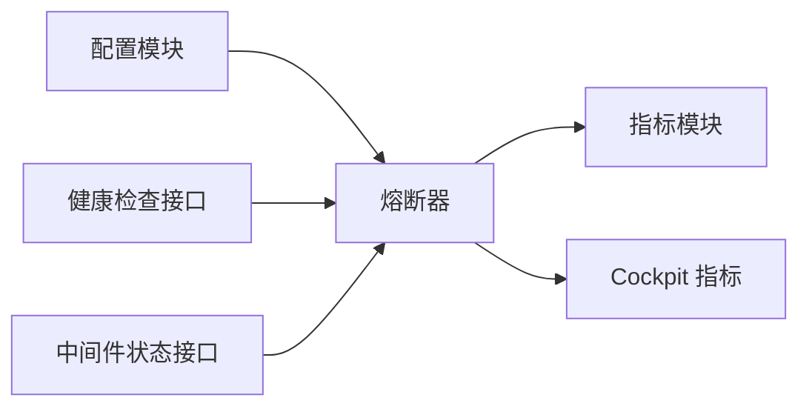

# 熔断器模式

<cite>
**本文引用的文件**   
- [circuit_breaker.py](file://backend_design/nexus/core/circuit_breaker.py)
- [config.py](file://backend_design/nexus/config.py)
- [cockpit_metrics.py](file://backend_design/nexus/observability/cockpit_metrics.py)
- [metrics.py](file://backend_design/nexus/observability/metrics.py)
- [health.py](file://backend_design/nexus/api/routes/health.py)
- [middleware_status.py](file://backend_design/nexus/api/routes/middleware_status.py)
- [degradation-strategy.md](file://docs/deployment/degradation-strategy.md)
</cite>

## 目录
1. [简介](#简介)
2. [项目结构](#项目结构)
3. [核心组件](#核心组件)
4. [架构总览](#架构总览)
5. [详细组件分析](#详细组件分析)
6. [依赖关系分析](#依赖关系分析)
7. [性能考量](#性能考量)
8. [故障排查指南](#故障排查指南)
9. [结论](#结论)
10. [附录](#附录)

## 简介
本文件围绕 NexusCockpit 的熔断器模式实现，系统化阐述状态机设计（关闭→打开→半开）、阈值与窗口配置、降级策略、健康检查机制、装饰器使用方式、异步调用保护、统计指标收集、动态配置更新、监控告警集成与故障恢复流程，并提供调优建议与最佳实践。文档旨在帮助开发者快速理解并正确使用熔断器，保障系统在高负载或下游异常时的稳定性与可观测性。

## 项目结构
NexusCockpit 后端采用模块化组织，熔断器相关代码位于 core 层，指标与可观测性位于 observability 层，API 路由提供健康与中间件状态查询能力，部署文档包含降级策略说明。

图表来源
- [circuit_breaker.py](file://backend_design/nexus/core/circuit_breaker.py)
- [config.py](file://backend_design/nexus/config.py)
- [cockpit_metrics.py](file://backend_design/nexus/observability/cockpit_metrics.py)
- [metrics.py](file://backend_design/nexus/observability/metrics.py)
- [health.py](file://backend_design/nexus/api/routes/health.py)
- [middleware_status.py](file://backend_design/nexus/api/routes/middleware_status.py)
- [degradation-strategy.md](file://docs/deployment/degradation-strategy.md)

章节来源
- [circuit_breaker.py](file://backend_design/nexus/core/circuit_breaker.py)
- [config.py](file://backend_design/nexus/config.py)
- [cockpit_metrics.py](file://backend_design/nexus/observability/cockpit_metrics.py)
- [metrics.py](file://backend_design/nexus/observability/metrics.py)
- [health.py](file://backend_design/nexus/api/routes/health.py)
- [middleware_status.py](file://backend_design/nexus/api/routes/middleware_status.py)
- [degradation-strategy.md](file://docs/deployment/degradation-strategy.md)

## 核心组件
- 熔断器核心：负责状态机切换、滑动窗口统计、阈值判定、时间窗控制、重试与回退逻辑。
- 配置模块：集中管理熔断器参数（如失败率阈值、最小请求数、半开探测间隔等）。
- 指标采集：记录成功/失败次数、延迟分布、状态切换事件、降级触发次数等。
- 健康检查与中间件状态：暴露运行时熔断器状态与健康度，便于外部系统巡检与告警。
- 降级策略文档：定义不同场景下的降级路径与兜底行为。

章节来源
- [circuit_breaker.py](file://backend_design/nexus/core/circuit_breaker.py)
- [config.py](file://backend_design/nexus/config.py)
- [cockpit_metrics.py](file://backend_design/nexus/observability/cockpit_metrics.py)
- [metrics.py](file://backend_design/nexus/observability/metrics.py)
- [health.py](file://backend_design/nexus/api/routes/health.py)
- [middleware_status.py](file://backend_design/nexus/api/routes/middleware_status.py)
- [degradation-strategy.md](file://docs/deployment/degradation-strategy.md)

## 架构总览
下图展示了熔断器在请求链路中的位置与交互关系：上游调用通过装饰器进入熔断器，熔断器依据当前状态与统计结果决定是否放行、短路或允许试探；同时持续上报指标供监控与告警使用。

图表来源
- [circuit_breaker.py](file://backend_design/nexus/core/circuit_breaker.py)
- [cockpit_metrics.py](file://backend_design/nexus/observability/cockpit_metrics.py)
- [metrics.py](file://backend_design/nexus/observability/metrics.py)

## 详细组件分析

### 熔断器状态机与阈值
- 状态定义
  - 关闭：正常放行，统计失败率/错误数，达到阈值后进入打开。
  - 打开：直接短路，拒绝请求，等待冷却时间后进入半开。
  - 半开：允许有限试探请求，成功则回到关闭，失败则再次进入打开。
- 关键阈值与窗口
  - 失败率阈值：在滑动窗口内失败比例超过阈值时触发打开。
  - 最小请求数：窗口内请求不足时不触发打开，避免样本偏差。
  - 半开探测间隔：从打开到半开的等待时间，用于让下游恢复。
  - 窗口大小与步长：决定统计的时间粒度与平滑程度。
- 状态切换条件
  - 关闭→打开：失败率≥阈值且请求数≥最小请求数。
  - 打开→半开：到达冷却时间。
  - 半开→关闭：试探成功。
  - 半开→打开：试探失败。

图表来源
- [circuit_breaker.py](file://backend_design/nexus/core/circuit_breaker.py)

章节来源
- [circuit_breaker.py](file://backend_design/nexus/core/circuit_breaker.py)

### 熔断器装饰器与异步调用保护
- 装饰器职责
  - 拦截函数调用，注入熔断逻辑。
  - 根据状态决定是否执行真实调用或返回降级结果。
  - 捕获异常与超时，统一计入统计。
- 异步支持
  - 对协程函数进行包装，确保 await 语义下正确统计与状态切换。
  - 保证并发安全，避免竞态导致的状态不一致。
- 使用要点
  - 将需要保护的函数用装饰器标注。
  - 为不同下游服务配置独立实例，避免相互影响。
  - 结合超时与重试策略，避免雪崩。

图表来源
- [circuit_breaker.py](file://backend_design/nexus/core/circuit_breaker.py)

章节来源
- [circuit_breaker.py](file://backend_design/nexus/core/circuit_breaker.py)

### 统计指标收集与可视化
- 指标维度
  - 成功/失败计数、失败率、平均/分位延迟、状态切换次数、短路次数、降级次数。
- 指标用途
  - 实时监控熔断器健康度与下游服务质量。
  - 驱动告警规则（如失败率突增、长时间处于打开状态）。
  - 辅助容量规划与阈值调优。
- 集成点
  - 通过通用指标模块上报标准指标。
  - Cockpit 指标模块提供面向业务视图的聚合与展示。

图表来源
- [circuit_breaker.py](file://backend_design/nexus/core/circuit_breaker.py)
- [metrics.py](file://backend_design/nexus/observability/metrics.py)
- [cockpit_metrics.py](file://backend_design/nexus/observability/cockpit_metrics.py)

章节来源
- [metrics.py](file://backend_design/nexus/observability/metrics.py)
- [cockpit_metrics.py](file://backend_design/nexus/observability/cockpit_metrics.py)

### 健康检查与中间件状态
- 健康检查接口
  - 暴露熔断器整体健康度与关键状态，便于编排系统与负载均衡器判断。
- 中间件状态接口
  - 提供各下游服务的熔断器状态快照，便于运维定位问题。
- 告警联动
  - 基于健康检查结果与中间件状态，触发平台级告警与自愈动作。

图表来源
- [health.py](file://backend_design/nexus/api/routes/health.py)
- [middleware_status.py](file://backend_design/nexus/api/routes/middleware_status.py)
- [circuit_breaker.py](file://backend_design/nexus/core/circuit_breaker.py)

章节来源
- [health.py](file://backend_design/nexus/api/routes/health.py)
- [middleware_status.py](file://backend_design/nexus/api/routes/middleware_status.py)

### 降级策略与恢复流程
- 降级策略
  - 短路时返回缓存数据、默认值或友好提示。
  - 针对关键路径提供多路降级（例如本地缓存→静态数据→用户提示）。
- 恢复流程
  - 打开→半开：等待冷却时间后允许试探。
  - 半开→关闭：试探成功后恢复正常流量。
  - 半开→打开：试探失败后延长冷却时间并继续降级。
- 策略文档
  - 参考降级策略文档，明确不同场景下的降级路径与优先级。

图表来源
- [degradation-strategy.md](file://docs/deployment/degradation-strategy.md)
- [circuit_breaker.py](file://backend_design/nexus/core/circuit_breaker.py)

章节来源
- [degradation-strategy.md](file://docs/deployment/degradation-strategy.md)

### 动态配置更新
- 配置项范围
  - 失败率阈值、最小请求数、窗口大小与步长、半开探测间隔、最大并发试探数等。
- 更新机制
  - 通过配置中心或 API 热更新，避免重启服务。
  - 更新后即时生效，新请求按新阈值评估。
- 注意事项
  - 变更需具备灰度与回滚能力。
  - 变更后观察指标变化，防止误判或抖动。

章节来源
- [config.py](file://backend_design/nexus/config.py)
- [circuit_breaker.py](file://backend_design/nexus/core/circuit_breaker.py)

## 依赖关系分析
- 内部依赖
  - 熔断器依赖配置模块获取阈值与窗口参数。
  - 熔断器依赖指标模块上报统计数据。
  - 健康与中间件状态接口依赖熔断器实例提供运行时信息。
- 外部依赖
  - 监控系统与告警平台通过健康与状态接口消费数据。
  - 部署与运维流程参考降级策略文档制定预案。

图表来源
- [config.py](file://backend_design/nexus/config.py)
- [circuit_breaker.py](file://backend_design/nexus/core/circuit_breaker.py)
- [metrics.py](file://backend_design/nexus/observability/metrics.py)
- [cockpit_metrics.py](file://backend_design/nexus/observability/cockpit_metrics.py)
- [health.py](file://backend_design/nexus/api/routes/health.py)
- [middleware_status.py](file://backend_design/nexus/api/routes/middleware_status.py)

章节来源
- [config.py](file://backend_design/nexus/config.py)
- [circuit_breaker.py](file://backend_design/nexus/core/circuit_breaker.py)
- [metrics.py](file://backend_design/nexus/observability/metrics.py)
- [cockpit_metrics.py](file://backend_design/nexus/observability/cockpit_metrics.py)
- [health.py](file://backend_design/nexus/api/routes/health.py)
- [middleware_status.py](file://backend_design/nexus/api/routes/middleware_status.py)

## 性能考量
- 统计开销
  - 滑动窗口与分桶计算带来额外 CPU 与内存占用，需合理设置窗口大小与步长。
- 并发安全
  - 高并发下状态切换需加锁或使用原子操作，避免竞争条件。
- 指标上报
  - 批量上报与采样可降低指标写入成本，避免阻塞主流程。
- 降级路径
  - 降级逻辑应尽量轻量，减少二次依赖与网络调用。

[本节为通用指导，无需特定文件引用]

## 故障排查指南
- 常见问题
  - 频繁开关：可能是阈值过低或窗口过小，建议提高最小请求数与调整失败率阈值。
  - 长时间打开：下游未恢复或冷却时间过长，建议缩短冷却时间并观察恢复情况。
  - 指标缺失：确认指标上报链路是否正常，检查健康与状态接口可用性。
- 诊断步骤
  - 查看健康与中间件状态接口，确认熔断器状态快照。
  - 检查指标面板，关注失败率、延迟与状态切换事件。
  - 核对配置项，确认阈值与窗口是否符合预期。
- 恢复建议
  - 临时放宽阈值以恢复流量，随后逐步收紧。
  - 启用更细粒度的降级策略，优先保障核心功能。

章节来源
- [health.py](file://backend_design/nexus/api/routes/health.py)
- [middleware_status.py](file://backend_design/nexus/api/routes/middleware_status.py)
- [metrics.py](file://backend_design/nexus/observability/metrics.py)
- [cockpit_metrics.py](file://backend_design/nexus/observability/cockpit_metrics.py)

## 结论
熔断器模式在 NexusCockpit 中通过清晰的状态机、合理的阈值与窗口配置、完善的指标采集与健康检查，有效提升了系统在下游异常时的鲁棒性与可观测性。配合降级策略与动态配置更新，可在保障用户体验的同时快速恢复服务。建议在生产环境持续优化阈值与窗口参数，结合监控告警形成闭环治理。

[本节为总结性内容，无需特定文件引用]

## 附录
- 配置参数清单（示例）
  - 失败率阈值：窗口内失败比例上限。
  - 最小请求数：触发打开的最小样本量。
  - 窗口大小与步长：统计时间粒度与平滑度。
  - 半开探测间隔：从打开到半开的等待时间。
  - 最大并发试探数：半开状态下允许的并行试探请求数。
- 最佳实践
  - 为每个下游服务独立配置熔断器实例。
  - 结合超时与重试策略，避免级联失败。
  - 定期复盘指标与告警，动态调优阈值。
  - 在灰度发布中逐步放开流量，观察熔断器行为。

[本节为补充信息，无需特定文件引用]