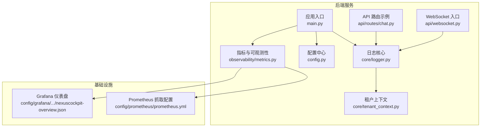
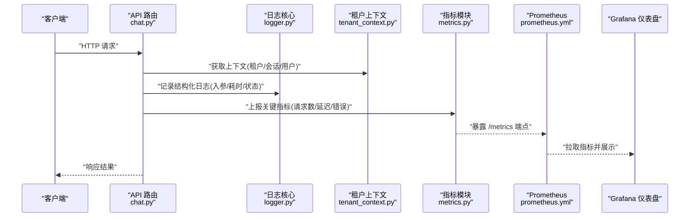
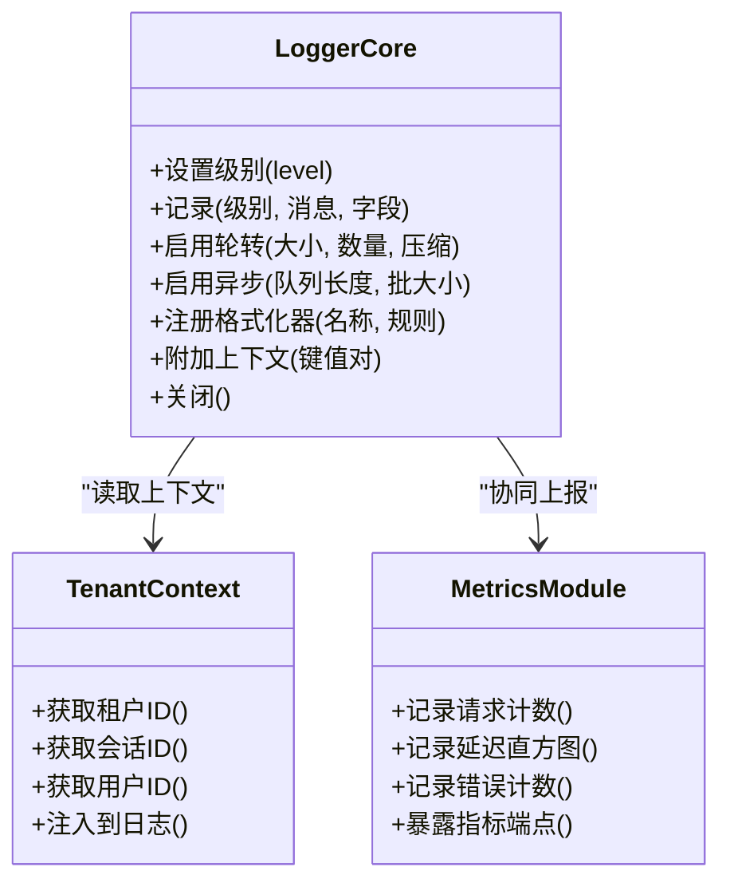
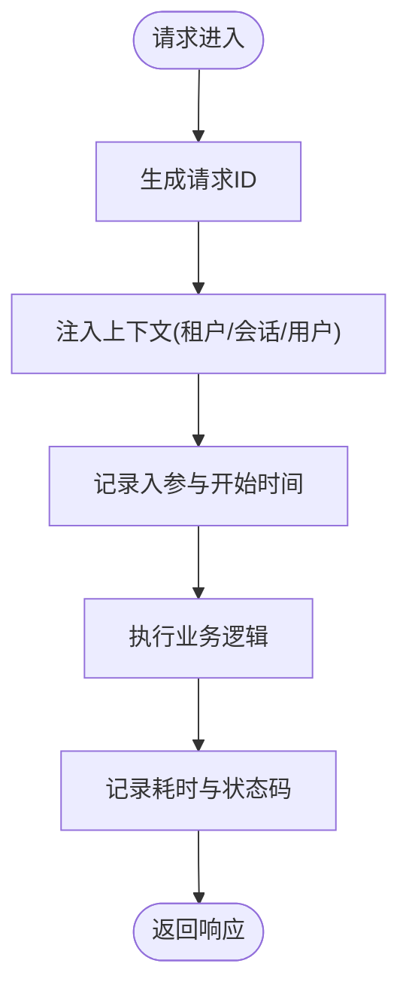
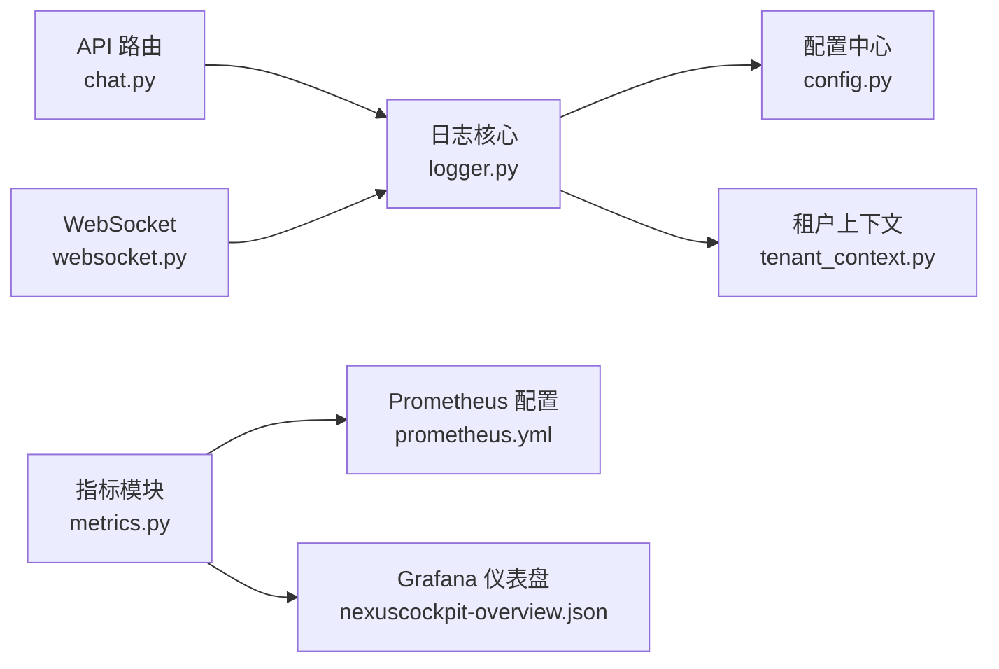

# 统一日志系统

<cite>
**本文引用的文件**   
- [backend_design/nexus/core/logger.py](file://backend_design/nexus/core/logger.py)
- [backend_design/nexus/config.py](file://backend_design/nexus/config.py)
- [backend_design/nexus/main.py](file://backend_design/nexus/main.py)
- [backend_design/nexus/observability/metrics.py](file://backend_design/nexus/observability/metrics.py)
- [config/prometheus/prometheus.yml](file://config/prometheus/prometheus.yml)
- [config/grafana/provisioning/dashboards/nexuscockpit-overview.json](file://config/grafana/provisioning/dashboards/nexuscockpit-overview.json)
- [backend_design/nexus/api/routes/chat.py](file://backend_design/nexus/api/routes/chat.py)
- [backend_design/nexus/api/websocket.py](file://backend_design/nexus/api/websocket.py)
- [backend_design/nexus/core/tenant_context.py](file://backend_design/nexus/core/tenant_context.py)
</cite>

## 目录
1. [简介](#简介)
2. [项目结构](#项目结构)
3. [核心组件](#核心组件)
4. [架构总览](#架构总览)
5. [详细组件分析](#详细组件分析)
6. [依赖关系分析](#依赖关系分析)
7. [性能考量](#性能考量)
8. [故障排查指南](#故障排查指南)
9. [结论](#结论)
10. [附录](#附录)

## 简介
本文件面向 NexusCockpit 的统一日志系统，系统性阐述结构化日志设计、日志级别管理、日志轮转策略、与性能监控的集成方式。文档同时覆盖日志格式规范、上下文信息注入、异步日志处理、日志聚合方案、配置选项、自定义格式化器、错误追踪集成以及生产环境优化建议，并提供日志查询与分析的最佳实践，帮助读者在开发与运维中高效使用日志能力。

## 项目结构
NexusCockpit 后端采用 Python 实现，日志相关能力集中在核心模块与可观测性模块中，并通过中间件与 API 层进行广泛使用；前端与网关侧不直接参与日志采集与聚合。

图表来源
- [backend_design/nexus/main.py](file://backend_design/nexus/main.py)
- [backend_design/nexus/core/logger.py](file://backend_design/nexus/core/logger.py)
- [backend_design/nexus/config.py](file://backend_design/nexus/config.py)
- [backend_design/nexus/observability/metrics.py](file://backend_design/nexus/observability/metrics.py)
- [config/prometheus/prometheus.yml](file://config/prometheus/prometheus.yml)
- [config/grafana/provisioning/dashboards/nexuscockpit-overview.json](file://config/grafana/provisioning/dashboards/nexuscockpit-overview.json)

章节来源
- [backend_design/nexus/main.py](file://backend_design/nexus/main.py)
- [backend_design/nexus/core/logger.py](file://backend_design/nexus/core/logger.py)
- [backend_design/nexus/config.py](file://backend_design/nexus/config.py)
- [backend_design/nexus/observability/metrics.py](file://backend_design/nexus/observability/metrics.py)
- [config/prometheus/prometheus.yml](file://config/prometheus/prometheus.yml)
- [config/grafana/provisioning/dashboards/nexuscockpit-overview.json](file://config/grafana/provisioning/dashboards/nexuscockpit-overview.json)

## 核心组件
- 日志核心：提供统一的日志记录接口、结构化字段输出、级别控制、可选的文件轮转与异步写入能力。
- 配置中心：集中管理日志级别、输出目标（控制台/文件）、轮转策略、采样率等开关。
- 可观测性指标：将关键业务与系统指标暴露给 Prometheus，并与 Grafana 仪表盘联动。
- API/WebSocket 层：在各请求路径与连接生命周期内注入上下文并记录结构化日志。
- 租户上下文：为每条日志自动附加租户标识、会话 ID、用户标识等上下文字段。

章节来源
- [backend_design/nexus/core/logger.py](file://backend_design/nexus/core/logger.py)
- [backend_design/nexus/config.py](file://backend_design/nexus/config.py)
- [backend_design/nexus/observability/metrics.py](file://backend_design/nexus/observability/metrics.py)
- [backend_design/nexus/api/routes/chat.py](file://backend_design/nexus/api/routes/chat.py)
- [backend_design/nexus/api/websocket.py](file://backend_design/nexus/api/websocket.py)
- [backend_design/nexus/core/tenant_context.py](file://backend_design/nexus/core/tenant_context.py)

## 架构总览
统一日志系统围绕“结构化 + 上下文 + 异步 + 可观测”的设计原则构建，通过中间件和上下文管理器在请求链路中自动注入必要字段，并以 JSON 形式输出到标准输出或文件，再由外部采集器（如 Filebeat/Fluent Bit）汇聚至 Loki/Elasticsearch 等存储，配合 Prometheus/Grafana 完成可视化。

图表来源
- [backend_design/nexus/api/routes/chat.py](file://backend_design/nexus/api/routes/chat.py)
- [backend_design/nexus/core/logger.py](file://backend_design/nexus/core/logger.py)
- [backend_design/nexus/core/tenant_context.py](file://backend_design/nexus/core/tenant_context.py)
- [backend_design/nexus/observability/metrics.py](file://backend_design/nexus/observability/metrics.py)
- [config/prometheus/prometheus.yml](file://config/prometheus/prometheus.yml)
- [config/grafana/provisioning/dashboards/nexuscockpit-overview.json](file://config/grafana/provisioning/dashboards/nexuscockpit-overview.json)

## 详细组件分析

### 日志核心（结构化日志、级别管理、轮转与异步）
- 结构化日志设计
  - 以键值对形式输出，包含时间戳、级别、模块、消息体及扩展字段（如请求 ID、租户 ID、用户 ID、会话 ID、操作类型、耗时等）。
  - 支持动态追加上下文字段，避免重复打印敏感信息。
- 日志级别管理
  - 提供 DEBUG/INFO/WARNING/ERROR/CRITICAL 等多级控制，默认按运行环境选择合适级别。
  - 可按模块或命名空间细粒度调整级别，便于定位问题而不影响整体吞吐。
- 日志轮转策略
  - 支持基于大小与时间的轮转，保留固定数量的历史文件，限制单文件大小与总磁盘占用。
  - 生产环境建议开启压缩与清理策略，降低存储压力。
- 异步日志处理
  - 在高并发场景下，采用异步队列缓冲日志写入，降低主线程阻塞风险。
  - 提供优雅关闭机制，确保进程退出前落盘所有缓存日志。
- 自定义格式化器
  - 允许注册自定义字段与格式化规则，统一输出样式，便于下游解析与检索。
- 错误追踪集成
  - 在 ERROR/CRITICAL 级别自动附带堆栈信息与异常元数据，便于快速回溯。
- 性能监控集成
  - 与指标模块解耦，但可在同一链路中同步记录日志与指标，保证一致性。

图表来源
- [backend_design/nexus/core/logger.py](file://backend_design/nexus/core/logger.py)
- [backend_design/nexus/core/tenant_context.py](file://backend_design/nexus/core/tenant_context.py)
- [backend_design/nexus/observability/metrics.py](file://backend_design/nexus/observability/metrics.py)

章节来源
- [backend_design/nexus/core/logger.py](file://backend_design/nexus/core/logger.py)
- [backend_design/nexus/core/tenant_context.py](file://backend_design/nexus/core/tenant_context.py)
- [backend_design/nexus/observability/metrics.py](file://backend_design/nexus/observability/metrics.py)

### 配置中心（日志与环境变量）
- 集中式配置
  - 定义日志级别、输出目标、轮转参数、异步队列容量、采样率等。
  - 支持按环境（开发/测试/生产）切换默认策略。
- 环境变量覆盖
  - 通过环境变量覆盖配置文件中的关键项，便于容器化部署与灰度发布。
- 运行时热更新
  - 在不重启服务的前提下调整日志级别与采样率，用于紧急排障。

章节来源
- [backend_design/nexus/config.py](file://backend_design/nexus/config.py)

### API 与 WebSocket 层（上下文注入与链路日志）
- API 路由
  - 在每个请求进入时生成唯一请求 ID，附加到上下文并贯穿整个处理链。
  - 记录入参摘要、处理耗时、返回状态码与错误码，便于审计与排障。
- WebSocket
  - 在连接建立、消息收发、断开时记录结构化事件，附带会话与用户上下文。
  - 对异常断连与重连进行统计与告警。

图表来源
- [backend_design/nexus/api/routes/chat.py](file://backend_design/nexus/api/routes/chat.py)
- [backend_design/nexus/api/websocket.py](file://backend_design/nexus/api/websocket.py)
- [backend_design/nexus/core/tenant_context.py](file://backend_design/nexus/core/tenant_context.py)

章节来源
- [backend_design/nexus/api/routes/chat.py](file://backend_design/nexus/api/routes/chat.py)
- [backend_design/nexus/api/websocket.py](file://backend_design/nexus/api/websocket.py)
- [backend_design/nexus/core/tenant_context.py](file://backend_design/nexus/core/tenant_context.py)

### 可观测性集成（指标与仪表盘）
- 指标暴露
  - 通过指标模块暴露 HTTP 请求计数、延迟分布、错误率等关键指标。
  - 遵循 Prometheus 抓取约定，提供稳定端点供采集。
- 仪表盘
  - 预置 Grafana 仪表盘，直观展示服务健康度与性能趋势。
  - 支持按租户、模块、接口维度筛选与对比。

章节来源
- [backend_design/nexus/observability/metrics.py](file://backend_design/nexus/observability/metrics.py)
- [config/prometheus/prometheus.yml](file://config/prometheus/prometheus.yml)
- [config/grafana/provisioning/dashboards/nexuscockpit-overview.json](file://config/grafana/provisioning/dashboards/nexuscockpit-overview.json)

## 依赖关系分析
- 耦合与内聚
  - 日志核心与上下文模块低耦合，通过接口读取上下文字段，提升可测试性与可替换性。
  - 指标模块独立于日志核心，但在同一请求链路中协同工作，保证一致性与完整性。
- 外部依赖
  - Prometheus 抓取配置与 Grafana 仪表盘作为外部可视化工具，与后端指标模块对接。
- 潜在循环依赖
  - 当前设计避免循环导入，日志核心仅依赖上下文与配置，不反向依赖 API 层。

图表来源
- [backend_design/nexus/core/logger.py](file://backend_design/nexus/core/logger.py)
- [backend_design/nexus/config.py](file://backend_design/nexus/config.py)
- [backend_design/nexus/core/tenant_context.py](file://backend_design/nexus/core/tenant_context.py)
- [backend_design/nexus/api/routes/chat.py](file://backend_design/nexus/api/routes/chat.py)
- [backend_design/nexus/api/websocket.py](file://backend_design/nexus/api/websocket.py)
- [backend_design/nexus/observability/metrics.py](file://backend_design/nexus/observability/metrics.py)
- [config/prometheus/prometheus.yml](file://config/prometheus/prometheus.yml)
- [config/grafana/provisioning/dashboards/nexuscockpit-overview.json](file://config/grafana/provisioning/dashboards/nexuscockpit-overview.json)

章节来源
- [backend_design/nexus/core/logger.py](file://backend_design/nexus/core/logger.py)
- [backend_design/nexus/config.py](file://backend_design/nexus/config.py)
- [backend_design/nexus/core/tenant_context.py](file://backend_design/nexus/core/tenant_context.py)
- [backend_design/nexus/api/routes/chat.py](file://backend_design/nexus/api/routes/chat.py)
- [backend_design/nexus/api/websocket.py](file://backend_design/nexus/api/websocket.py)
- [backend_design/nexus/observability/metrics.py](file://backend_design/nexus/observability/metrics.py)
- [config/prometheus/prometheus.yml](file://config/prometheus/prometheus.yml)
- [config/grafana/provisioning/dashboards/nexuscockpit-overview.json](file://config/grafana/provisioning/dashboards/nexuscockpit-overview.json)

## 性能考量
- 异步写入
  - 在高并发场景下优先使用异步队列，减少 IO 阻塞；合理设置队列长度与批大小，平衡延迟与吞吐。
- 采样与降采样
  - 对高频 INFO/DEBUG 日志启用采样率，避免风暴；对关键路径保持全量记录。
- 字段精简
  - 避免在日志中输出大对象或敏感信息，按需裁剪字段，降低序列化开销。
- 轮转与压缩
  - 生产环境启用压缩与保留策略，定期清理过期文件，防止磁盘膨胀。
- 指标与日志分离
  - 指标走专用通道，避免与日志写入竞争资源；必要时对指标进行聚合与降采样。

[本节为通用指导，无需特定文件引用]

## 故障排查指南
- 常见问题
  - 日志缺失：检查异步队列是否溢出、进程是否正常关闭、输出目标权限是否正确。
  - 级别过高：临时调高级别（如 DEBUG），复现后恢复默认，避免长期影响性能。
  - 上下文缺失：确认请求链路是否完整注入上下文，检查中间件顺序与异常分支。
- 错误追踪
  - 在 ERROR/CRITICAL 级别查看堆栈与异常元数据，结合请求 ID 定位具体调用链。
- 指标联动
  - 通过 Prometheus 与 Grafana 观察错误率与延迟峰值，辅助判断是否为日志风暴或下游瓶颈。

章节来源
- [backend_design/nexus/core/logger.py](file://backend_design/nexus/core/logger.py)
- [backend_design/nexus/observability/metrics.py](file://backend_design/nexus/observability/metrics.py)

## 结论
NexusCockpit 的统一日志系统以结构化为核心，结合上下文注入、异步写入与轮转策略，在保证可观测性的同时兼顾性能与可维护性。通过与 Prometheus/Grafana 的集成，形成“日志 + 指标 + 仪表盘”的闭环，满足从开发调试到生产运维的全链路需求。建议在上线前完成配置基线、采样策略与轮转策略的评审，并在日常运维中持续优化字段与级别，确保日志价值最大化。

[本节为总结性内容，无需特定文件引用]

## 附录

### 日志格式规范
- 基础字段
  - 时间戳、级别、模块、消息体、请求 ID、租户 ID、用户 ID、会话 ID、操作类型、耗时、状态码、错误码。
- 扩展字段
  - 根据业务需要动态追加，避免冗余与敏感信息泄露。
- 输出格式
  - 推荐 JSON 行式输出，便于下游解析与检索。

[本节为规范说明，无需特定文件引用]

### 日志配置选项
- 级别控制
  - 全局级别、模块级别、命名空间级别。
- 输出目标
  - 控制台、文件、网络（由外部采集器转发）。
- 轮转策略
  - 基于大小与时间、保留数量、压缩开关。
- 异步参数
  - 队列长度、批大小、刷新间隔、优雅关闭。
- 采样率
  - 全局采样、按级别采样、按模块采样。

章节来源
- [backend_design/nexus/config.py](file://backend_design/nexus/config.py)

### 自定义格式化器
- 注册流程
  - 定义格式化规则与字段映射，注册到日志核心。
- 使用场景
  - 统一审计字段、脱敏规则、多语言适配。

章节来源
- [backend_design/nexus/core/logger.py](file://backend_design/nexus/core/logger.py)

### 错误追踪集成
- 堆栈捕获
  - 在异常分支自动附加堆栈与上下文。
- 关联指标
  - 错误计数与错误分类指标与日志联动。

章节来源
- [backend_design/nexus/core/logger.py](file://backend_design/nexus/core/logger.py)
- [backend_design/nexus/observability/metrics.py](file://backend_design/nexus/observability/metrics.py)

### 生产环境优化建议
- 日志级别
  - 默认 INFO，关键路径保留 DEBUG 开关。
- 异步与批写
  - 增大批大小与刷新间隔，降低 IO 频率。
- 轮转与清理
  - 严格限制单文件大小与保留天数，启用压缩。
- 字段裁剪
  - 仅保留必要字段，避免大对象与敏感信息。
- 指标与日志分离
  - 指标走专用通道，避免争用。

[本节为通用指导，无需特定文件引用]

### 日志查询与分析最佳实践
- 索引与分片
  - 按日期与租户分片，提高查询效率。
- 过滤与聚合
  - 使用请求 ID、租户 ID、操作类型进行过滤与聚合。
- 关联分析
  - 结合指标与日志，定位慢请求与错误热点。
- 告警与巡检
  - 基于错误率、延迟阈值与日志关键字设置告警规则。

[本节为通用指导，无需特定文件引用]