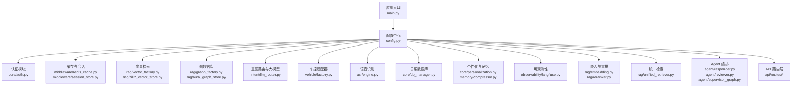
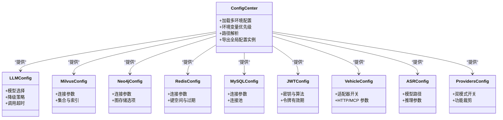
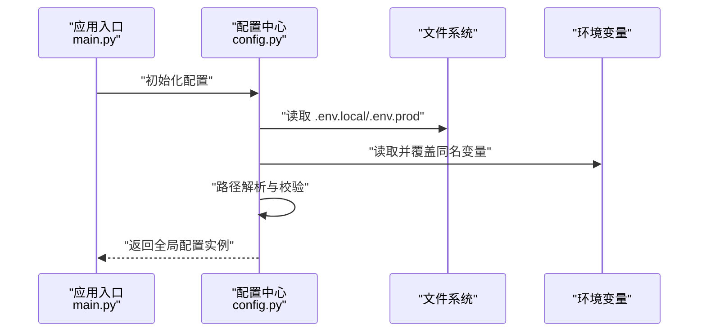
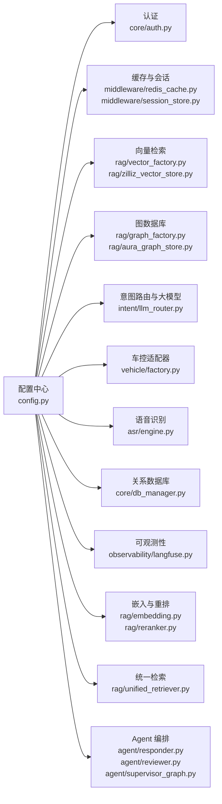

# 配置管理系统

<cite>
**本文引用的文件**   
- [backend_design/nexus/config.py](file://backend_design/nexus/config.py)
- [backend_design/nexus/main.py](file://backend_design/nexus/main.py)
- [backend_design/nexus/api/routes/settings.py](file://backend_design/nexus/api/routes/settings.py)
- [backend_design/nexus/core/auth.py](file://backend_design/nexus/core/auth.py)
- [backend_design/nexus/middleware/redis_cache.py](file://backend_design/nexus/middleware/redis_cache.py)
- [backend_design/nexus/middleware/session_store.py](file://backend_design/nexus/middleware/session_store.py)
- [backend_design/nexus/rag/vector_factory.py](file://backend_design/nexus/rag/vector_factory.py)
- [backend_design/nexus/rag/graph_factory.py](file://backend_design/nexus/rag/graph_factory.py)
- [backend_design/nexus/intent/llm_router.py](file://backend_design/nexus/intent/llm_router.py)
- [backend_design/nexus/skills/orchestrator.py](file://backend_design/nexus/skills/orchestrator.py)
- [backend_design/nexus/vehicle/factory.py](file://backend_design/nexus/vehicle/factory.py)
- [backend_design/nexus/asr/engine.py](file://backend_design/nexus/asr/engine.py)
- [backend_design/nexus/core/db_manager.py](file://backend_design/nexus/core/db_manager.py)
- [backend_design/nexus/core/personalization.py](file://backend_design/nexus/core/personalization.py)
- [backend_design/nexus/memory/compressor.py](file://backend_design/nexus/memory/compressor.py)
- [backend_design/nexus/observability/langfuse.py](file://backend_design/nexus/observability/langfuse.py)
- [backend_design/nexus/rag/embedding.py](file://backend_design/nexus/rag/embedding.py)
- [backend_design/nexus/rag/reranker.py](file://backend_design/nexus/rag/reranker.py)
- [backend_design/nexus/rag/zilliz_vector_store.py](file://backend_design/nexus/rag/zilliz_vector_store.py)
- [backend_design/nexus/rag/aura_graph_store.py](file://backend_design/nexus/rag/aura_graph_store.py)
- [backend_design/nexus/rag/cherry_kb.py](file://backend_design/nexus/rag/cherry_kb.py)
- [backend_design/nexus/rag/unified_retriever.py](file://backend_design/nexus/rag/unified_retriever.py)
- [backend_design/nexus/agent/responder.py](file://backend_design/nexus/agent/responder.py)
- [backend_design/nexus/agent/reviewer.py](file://backend_design/nexus/agent/reviewer.py)
- [backend_design/nexus/agent/supervisor_graph.py](file://backend_design/nexus/agent/supervisor_graph.py)
- [backend_design/nexus/core/circuit_breaker.py](file://backend_design/nexus/core/circuit_breaker.py)
- [backend_design/nexus/core/logger.py](file://backend_design/nexus/core/logger.py)
- [backend_design/nexus/core/cockpit_manager.py](file://backend_design/nexus/core/cockpit_manager.py)
- [backend_design/nexus/core/tenant_context.py](file://backend_design/nexus/core/tenant_context.py)
- [backend_design/nexus/core/voiceprint.py](file://backend_design/nexus/core/voiceprint.py)
- [backend_design/nexus/tts/engine.py](file://backend_design/nexus/tts/engine.py)
- [backend_design/nexus/mcp/gateway.py](file://backend_design/nexus/mcp/gateway.py)
- [backend_design/nexus/skills/base.py](file://backend_design/nexus/skills/base.py)
- [backend_design/nexus/skills/registry.py](file://backend_design/nexus/skills/registry.py)
- [backend_design/nexus/skills/vehicle/climate.py](file://backend_design/nexus/skills/vehicle/climate.py)
- [backend_design/nexus/skills/vehicle/media.py](file://backend_design/nexus/skills/vehicle/media.py)
- [backend_design/nexus/skills/vehicle/navigation.py](file://backend_design/nexus/skills/vehicle/navigation.py)
- [backend_design/nexus/skills/vehicle/seat.py](file://backend_design/nexus/skills/vehicle/seat.py)
- [backend_design/nexus/skills/vehicle/status.py](file://backend_design/nexus/skills/vehicle/status.py)
- [backend_design/nexus/skills/vehicle/window.py](file://backend_design/nexus/skills/vehicle/window.py)
- [backend_design/nexus/models/state.py](file://backend_design/nexus/models/state.py)
- [backend_design/nexus/models/schemas.py](file://backend_design/nexus/models/schemas.py)
- [backend_design/nexus/models/cockpit.py](file://backend_design/nexus/models/cockpit.py)
- [backend_design/nexus/api/websocket.py](file://backend_design/nexus/api/websocket.py)
- [backend_design/nexus/api/routes/chat.py](file://backend_design/nexus/api/routes/chat.py)
- [backend_design/nexus/api/routes/chat_sessions.py](file://backend_design/nexus/api/routes/chat_sessions.py)
- [backend_design/nexus/api/routes/health.py](file://backend_design/nexus/api/routes/health.py)
- [backend_design/nexus/api/routes/vehicle.py](file://backend_design/nexus/api/routes/vehicle.py)
- [backend_design/nexus/api/routes/dataplatform.py](file://backend_design/nexus/api/routes/dataplatform.py)
- [backend_design/nexus/api/routes/admin.py](file://backend_design/nexus/api/routes/admin.py)
- [backend_design/nexus/api/routes/middleware_status.py](file://backend_design/nexus/api/routes/middleware_status.py)
- [backend_design/nexus/api/routes/asr.py](file://backend_design/nexus/api/routes/asr.py)
- [backend_design/nexus/api/routes/cockpit.py](file://backend_design/nexus/api/routes/cockpit.py)
- [backend_design/nexus/api/__init__.py](file://backend_design/nexus/api/__init__.py)
- [backend_design/nexus/__init__.py](file://backend_design/nexus/__init__.py)
- [backend_design/pyproject.toml](file://backend_design/pyproject.toml)
- [backend_design/requirements.txt](file://backend_design/requirements.txt)
- [docker-compose.yml](file://docker-compose.yml)
</cite>

## 目录
1. [简介](#简介)
2. [项目结构](#项目结构)
3. [核心组件](#核心组件)
4. [架构总览](#架构总览)
5. [详细组件分析](#详细组件分析)
6. [依赖关系分析](#依赖关系分析)
7. [性能考量](#性能考量)
8. [故障排查指南](#故障排查指南)
9. [结论](#结论)
10. [附录](#附录)

## 简介
本文件面向 NexusCockpit 的配置管理系统，聚焦于集中式配置架构的设计与实现。文档围绕以下目标展开：
- 类型安全的 Pydantic Settings 配置体系
- 多环境文件加载策略（如 .env.local、.env.prod）与环境变量优先级
- 路径解析系统（相对路径转绝对路径）
- 各配置类的职责与使用方式：LLMConfig、MilvusConfig、Neo4jConfig、RedisConfig、MySQLConfig、JWTConfig、VehicleConfig、ASRConfig、ProvidersConfig 等
- 配置示例、最佳实践与常见问题解决方案

## 项目结构
NexusCockpit 的后端采用模块化组织，配置入口集中在 backend_design/nexus/config.py，并通过应用启动流程在 main.py 中初始化。其他模块通过导入配置对象来访问运行时参数。

图示来源
- [backend_design/nexus/main.py](file://backend_design/nexus/main.py)
- [backend_design/nexus/config.py](file://backend_design/nexus/config.py)
- [backend_design/nexus/core/auth.py](file://backend_design/nexus/core/auth.py)
- [backend_design/nexus/middleware/redis_cache.py](file://backend_design/nexus/middleware/redis_cache.py)
- [backend_design/nexus/middleware/session_store.py](file://backend_design/nexus/middleware/session_store.py)
- [backend_design/nexus/rag/vector_factory.py](file://backend_design/nexus/rag/vector_factory.py)
- [backend_design/nexus/rag/zilliz_vector_store.py](file://backend_design/nexus/rag/zilliz_vector_store.py)
- [backend_design/nexus/rag/graph_factory.py](file://backend_design/nexus/rag/graph_factory.py)
- [backend_design/nexus/rag/aura_graph_store.py](file://backend_design/nexus/rag/aura_graph_store.py)
- [backend_design/nexus/intent/llm_router.py](file://backend_design/nexus/intent/llm_router.py)
- [backend_design/nexus/vehicle/factory.py](file://backend_design/nexus/vehicle/factory.py)
- [backend_design/nexus/asr/engine.py](file://backend_design/nexus/asr/engine.py)
- [backend_design/nexus/core/db_manager.py](file://backend_design/nexus/core/db_manager.py)
- [backend_design/nexus/core/personalization.py](file://backend_design/nexus/core/personalization.py)
- [backend_design/nexus/memory/compressor.py](file://backend_design/nexus/memory/compressor.py)
- [backend_design/nexus/observability/langfuse.py](file://backend_design/nexus/observability/langfuse.py)
- [backend_design/nexus/rag/embedding.py](file://backend_design/nexus/rag/embedding.py)
- [backend_design/nexus/rag/reranker.py](file://backend_design/nexus/rag/reranker.py)
- [backend_design/nexus/rag/unified_retriever.py](file://backend_design/nexus/rag/unified_retriever.py)
- [backend_design/nexus/agent/responder.py](file://backend_design/nexus/agent/responder.py)
- [backend_design/nexus/agent/reviewer.py](file://backend_design/nexus/agent/reviewer.py)
- [backend_design/nexus/agent/supervisor_graph.py](file://backend_design/nexus/agent/supervisor_graph.py)
- [backend_design/nexus/api/routes/chat.py](file://backend_design/nexus/api/routes/chat.py)
- [backend_design/nexus/api/routes/chat_sessions.py](file://backend_design/nexus/api/routes/chat_sessions.py)
- [backend_design/nexus/api/routes/health.py](file://backend_design/nexus/api/routes/health.py)
- [backend_design/nexus/api/routes/vehicle.py](file://backend_design/nexus/api/routes/vehicle.py)
- [backend_design/nexus/api/routes/dataplatform.py](file://backend_design/nexus/api/routes/dataplatform.py)
- [backend_design/nexus/api/routes/admin.py](file://backend_design/nexus/api/routes/admin.py)
- [backend_design/nexus/api/routes/middleware_status.py](file://backend_design/nexus/api/routes/middleware_status.py)
- [backend_design/nexus/api/routes/asr.py](file://backend_design/nexus/api/routes/asr.py)
- [backend_design/nexus/api/routes/cockpit.py](file://backend_design/nexus/api/routes/cockpit.py)

章节来源
- [backend_design/nexus/main.py](file://backend_design/nexus/main.py)
- [backend_design/nexus/config.py](file://backend_design/nexus/config.py)

## 核心组件
本节概述配置系统的核心能力与设计要点：
- 类型安全：基于 Pydantic Settings 的强类型校验与默认值管理
- 多环境加载：支持 .env.local、.env.prod 等多配置文件合并
- 环境变量优先级：明确的环境覆盖顺序，确保部署期可控
- 路径解析：将相对路径解析为绝对路径，避免运行期路径错误
- 配置类职责划分：按领域拆分配置，降低耦合度，提升可读性与可维护性

章节来源
- [backend_design/nexus/config.py](file://backend_design/nexus/config.py)

## 架构总览
下图展示了配置中心与各子系统之间的交互关系。所有模块从配置中心读取参数，保证一致性与可追踪性。

图示来源
- [backend_design/nexus/config.py](file://backend_design/nexus/config.py)

## 详细组件分析

### 配置中心与加载流程
- 设计要点
  - 集中式入口：所有配置项由单一配置中心导出，便于审计与变更
  - 多环境文件：支持 .env.local、.env.prod 等，按优先级合并
  - 环境变量覆盖：环境变量优先于配置文件，保障部署期灵活性
  - 路径解析：对相对路径进行规范化，转换为绝对路径，避免跨平台问题
- 关键流程
  - 应用启动时加载配置中心
  - 依次读取基础配置与环境特定配置
  - 应用环境变量覆盖
  - 执行路径解析与校验
  - 暴露全局配置实例供各模块使用

图示来源
- [backend_design/nexus/main.py](file://backend_design/nexus/main.py)
- [backend_design/nexus/config.py](file://backend_design/nexus/config.py)

章节来源
- [backend_design/nexus/main.py](file://backend_design/nexus/main.py)
- [backend_design/nexus/config.py](file://backend_design/nexus/config.py)

### LLMConfig（大模型配置及降级策略）
- 职责
  - 定义主模型与备选模型的切换逻辑
  - 控制请求超时、重试次数、并发限制
  - 记录降级触发条件与回退行为
- 使用场景
  - 意图路由与 Agent 编排中根据负载或健康状态自动降级
- 注意事项
  - 确保备用模型可用且参数合理
  - 监控降级指标以便调优

章节来源
- [backend_design/nexus/intent/llm_router.py](file://backend_design/nexus/intent/llm_router.py)
- [backend_design/nexus/agent/responder.py](file://backend_design/nexus/agent/responder.py)
- [backend_design/nexus/agent/reviewer.py](file://backend_design/nexus/agent/reviewer.py)
- [backend_design/nexus/agent/supervisor_graph.py](file://backend_design/nexus/agent/supervisor_graph.py)

### MilvusConfig（向量数据库）
- 职责
  - 管理 Milvus/Zilliz 连接参数、集合名、维度、索引类型
  - 控制批量写入与查询参数
- 使用场景
  - RAG 向量检索、相似度搜索、召回阶段
- 注意事项
  - 合理设置集合与索引以平衡延迟与吞吐
  - 关注内存与磁盘占用

章节来源
- [backend_design/nexus/rag/vector_factory.py](file://backend_design/nexus/rag/vector_factory.py)
- [backend_design/nexus/rag/zilliz_vector_store.py](file://backend_design/nexus/rag/zilliz_vector_store.py)

### Neo4jConfig（图数据库）
- 职责
  - 管理 Neo4j/Aura 连接参数、认证、事务与批处理
- 使用场景
  - 知识图谱存储、关系推理、结构化检索
- 注意事项
  - 控制事务大小与超时，避免长事务阻塞

章节来源
- [backend_design/nexus/rag/graph_factory.py](file://backend_design/nexus/rag/graph_factory.py)
- [backend_design/nexus/rag/aura_graph_store.py](file://backend_design/nexus/rag/aura_graph_store.py)

### RedisConfig（缓存与会话）
- 职责
  - 管理 Redis 连接、键空间、过期策略、序列化格式
- 使用场景
  - 会话存储、限流计数、中间件缓存
- 注意事项
  - 合理设置过期时间与键前缀，避免冲突

章节来源
- [backend_design/nexus/middleware/redis_cache.py](file://backend_design/nexus/middleware/redis_cache.py)
- [backend_design/nexus/middleware/session_store.py](file://backend_design/nexus/middleware/session_store.py)

### MySQLConfig（关系数据库）
- 职责
  - 管理 MySQL 连接参数、连接池大小、超时与重试
- 使用场景
  - 业务数据持久化、用户偏好、日志归档
- 注意事项
  - 监控连接池使用率与慢查询

章节来源
- [backend_design/nexus/core/db_manager.py](file://backend_design/nexus/core/db_manager.py)

### JWTConfig（认证）
- 职责
  - 管理签名密钥、算法、令牌有效期、刷新策略
- 使用场景
  - API 鉴权、会话续期、权限控制
- 注意事项
  - 密钥轮换与泄露防护

章节来源
- [backend_design/nexus/core/auth.py](file://backend_design/nexus/core/auth.py)

### VehicleConfig（车控适配器）
- 职责
  - 管理 HTTP/MCP 适配器开关、URL、超时、重试
- 使用场景
  - 车辆技能调用、设备控制
- 注意事项
  - 网络异常时的熔断与回退

章节来源
- [backend_design/nexus/vehicle/factory.py](file://backend_design/nexus/vehicle/factory.py)
- [backend_design/nexus/skills/vehicle/climate.py](file://backend_design/nexus/skills/vehicle/climate.py)
- [backend_design/nexus/skills/vehicle/media.py](file://backend_design/nexus/skills/vehicle/media.py)
- [backend_design/nexus/skills/vehicle/navigation.py](file://backend_design/nexus/skills/vehicle/navigation.py)
- [backend_design/nexus/skills/vehicle/seat.py](file://backend_design/nexus/skills/vehicle/seat.py)
- [backend_design/nexus/skills/vehicle/status.py](file://backend_design/nexus/skills/vehicle/status.py)
- [backend_design/nexus/skills/vehicle/window.py](file://backend_design/nexus/skills/vehicle/window.py)

### ASRConfig（语音模型）
- 职责
  - 管理本地/远程 ASR 模型路径、推理参数、采样率
- 使用场景
  - 语音识别、实时转写
- 注意事项
  - 资源占用与延迟权衡

章节来源
- [backend_design/nexus/asr/engine.py](file://backend_design/nexus/asr/engine.py)

### ProvidersConfig（双模式部署开关）
- 职责
  - 控制不同服务提供方（如云/本地）的启用与裁剪
- 使用场景
  - 灰度发布、成本优化、合规要求
- 注意事项
  - 动态开关需具备热更新能力

章节来源
- [backend_design/nexus/config.py](file://backend_design/nexus/config.py)

### 路径解析系统（相对路径转绝对路径）
- 设计要点
  - 统一路径规范化，兼容 Windows/Linux
  - 支持模板路径与占位符替换
  - 校验路径存在性与权限
- 使用场景
  - 模型文件、知识库、上传目录、临时目录
- 注意事项
  - 避免硬编码路径，全部走配置中心

章节来源
- [backend_design/nexus/config.py](file://backend_design/nexus/config.py)

## 依赖关系分析
配置中心作为唯一可信源，被多个子系统直接依赖。下图展示主要依赖关系。

图示来源
- [backend_design/nexus/config.py](file://backend_design/nexus/config.py)
- [backend_design/nexus/core/auth.py](file://backend_design/nexus/core/auth.py)
- [backend_design/nexus/middleware/redis_cache.py](file://backend_design/nexus/middleware/redis_cache.py)
- [backend_design/nexus/middleware/session_store.py](file://backend_design/nexus/middleware/session_store.py)
- [backend_design/nexus/rag/vector_factory.py](file://backend_design/nexus/rag/vector_factory.py)
- [backend_design/nexus/rag/zilliz_vector_store.py](file://backend_design/nexus/rag/zilliz_vector_store.py)
- [backend_design/nexus/rag/graph_factory.py](file://backend_design/nexus/rag/graph_factory.py)
- [backend_design/nexus/rag/aura_graph_store.py](file://backend_design/nexus/rag/aura_graph_store.py)
- [backend_design/nexus/intent/llm_router.py](file://backend_design/nexus/intent/llm_router.py)
- [backend_design/nexus/vehicle/factory.py](file://backend_design/nexus/vehicle/factory.py)
- [backend_design/nexus/asr/engine.py](file://backend_design/nexus/asr/engine.py)
- [backend_design/nexus/core/db_manager.py](file://backend_design/nexus/core/db_manager.py)
- [backend_design/nexus/observability/langfuse.py](file://backend_design/nexus/observability/langfuse.py)
- [backend_design/nexus/rag/embedding.py](file://backend_design/nexus/rag/embedding.py)
- [backend_design/nexus/rag/reranker.py](file://backend_design/nexus/rag/reranker.py)
- [backend_design/nexus/rag/unified_retriever.py](file://backend_design/nexus/rag/unified_retriever.py)
- [backend_design/nexus/agent/responder.py](file://backend_design/nexus/agent/responder.py)
- [backend_design/nexus/agent/reviewer.py](file://backend_design/nexus/agent/reviewer.py)
- [backend_design/nexus/agent/supervisor_graph.py](file://backend_design/nexus/agent/supervisor_graph.py)

章节来源
- [backend_design/nexus/config.py](file://backend_design/nexus/config.py)

## 性能考量
- 连接池与并发
  - 数据库与 Redis 的连接池大小应与 QPS 和 CPU 核数匹配
  - 避免过大导致上下文切换开销
- 超时与重试
  - 合理设置网络与 I/O 超时，配合指数退避重试
- 缓存命中率
  - 针对热点数据设置短 TTL 与合理的键空间
- 向量与图检索
  - 调整批量大小与索引类型，平衡延迟与吞吐
- 降级与熔断
  - 在大模型或外部服务不可用时快速回退，保护整体可用性

[本节为通用指导，不直接分析具体文件]

## 故障排查指南
- 配置加载失败
  - 检查 .env.local/.env.prod 是否存在与语法正确
  - 确认环境变量是否覆盖了预期字段
  - 查看路径解析结果是否为绝对路径
- 连接异常
  - 核对数据库、Redis、Milvus、Neo4j 的连接参数
  - 检查防火墙与安全组规则
- 认证失败
  - 验证 JWT 密钥与算法一致性
  - 检查令牌有效期与刷新逻辑
- 降级未生效
  - 确认降级阈值与健康检查配置
  - 观察降级指标与日志
- 路径错误
  - 确认相对路径规范与占位符替换
  - 检查文件权限与挂载卷

章节来源
- [backend_design/nexus/config.py](file://backend_design/nexus/config.py)
- [backend_design/nexus/core/auth.py](file://backend_design/nexus/core/auth.py)
- [backend_design/nexus/core/circuit_breaker.py](file://backend_design/nexus/core/circuit_breaker.py)
- [backend_design/nexus/core/logger.py](file://backend_design/nexus/core/logger.py)

## 结论
NexusCockpit 的配置管理系统通过集中式设计与类型安全机制，实现了高内聚、低耦合的可配置架构。多环境加载与环境变量优先级确保了部署期的灵活性与可控性；路径解析系统提升了跨平台兼容性。各配置类职责清晰，便于扩展与维护。建议在生产环境中结合可观测性与熔断策略，持续优化性能与稳定性。

[本节为总结，不直接分析具体文件]

## 附录

### 配置示例（说明性）
- 基础配置
  - 应用名称、版本、日志级别、调试开关
- 大模型配置
  - 主模型、备用模型、超时、重试、并发
- 向量数据库配置
  - 地址、集合、维度、索引类型、批量大小
- 图数据库配置
  - 地址、用户名、密码、端口、SSL
- Redis 配置
  - 地址、端口、密码、键前缀、过期时间
- MySQL 配置
  - 地址、端口、用户名、密码、库名、连接池大小
- JWT 配置
  - 密钥、算法、有效期、刷新窗口
- 车控适配器配置
  - 适配器类型、URL、超时、重试
- ASR 配置
  - 模型路径、采样率、语言、热词
- 提供者开关
  - 云/本地开关、功能裁剪列表

[本节为概念性内容，不直接分析具体文件]

### 最佳实践
- 将敏感信息放入环境变量，避免提交到代码仓库
- 使用 .env.local 进行本地开发，.env.prod 用于生产
- 为每个环境准备独立的密钥与凭据
- 对路径使用相对路径并在启动时解析为绝对路径
- 为关键配置项添加默认值与校验提示
- 定期审查配置变更与审计日志

[本节为概念性内容，不直接分析具体文件]

### 常见问题与解决
- 环境变量未生效
  - 检查加载顺序与覆盖规则
  - 确认进程已重新加载最新环境变量
- 路径不存在
  - 检查相对路径是否正确
  - 确认容器卷挂载与权限
- 连接超时
  - 检查网络连通性与防火墙
  - 调整超时与重试策略
- 认证失败
  - 核对密钥与算法
  - 检查令牌有效期与刷新逻辑

[本节为概念性内容，不直接分析具体文件]