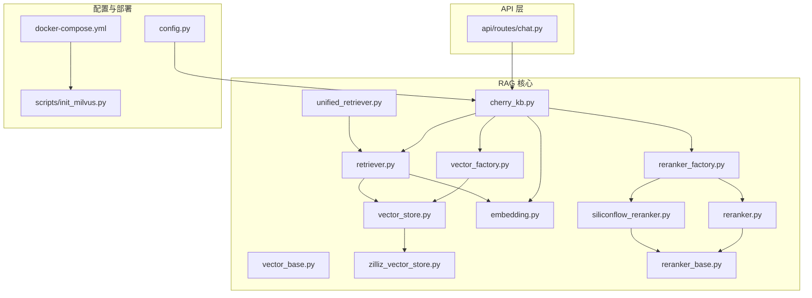
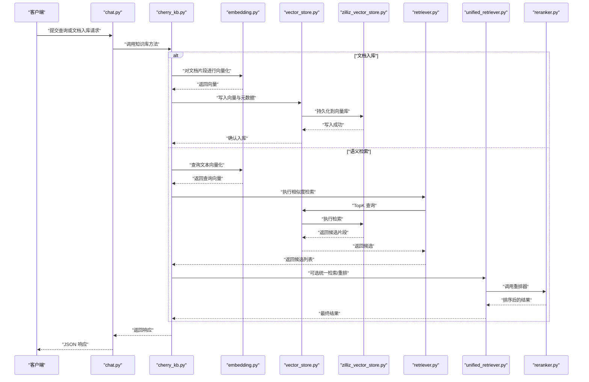
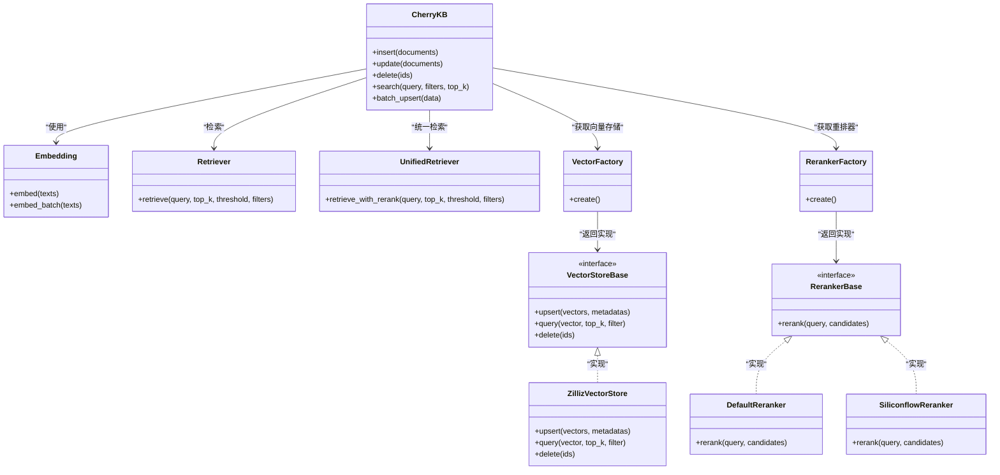

# Cherry知识库管理

<cite>
**本文引用的文件**   
- [backend_design/nexus/rag/cherry_kb.py](file://backend_design/nexus/rag/cherry_kb.py)
- [backend_design/nexus/rag/vector_store.py](file://backend_design/nexus/rag/vector_store.py)
- [backend_design/nexus/rag/vector_base.py](file://backend_design/nexus/rag/vector_base.py)
- [backend_design/nexus/rag/vector_factory.py](file://backend_design/nexus/rag/vector_factory.py)
- [backend_design/nexus/rag/zilliz_vector_store.py](file://backend_design/nexus/rag/zilliz_vector_store.py)
- [backend_design/nexus/rag/embedding.py](file://backend_design/nexus/rag/embedding.py)
- [backend_design/nexus/rag/retriever.py](file://backend_design/nexus/rag/retriever.py)
- [backend_design/nexus/rag/unified_retriever.py](file://backend_design/nexus/rag/unified_retriever.py)
- [backend_design/nexus/rag/reranker.py](file://backend_design/nexus/rag/reranker.py)
- [backend_design/nexus/rag/reranker_base.py](file://backend_design/nexus/rag/reranker_base.py)
- [backend_design/nexus/rag/reranker_factory.py](file://backend_design/nexus/rag/reranker_factory.py)
- [backend_design/nexus/rag/siliconflow_reranker.py](file://backend_design/nexus/rag/siliconflow_reranker.py)
- [backend_design/nexus/api/routes/chat.py](file://backend_design/nexus/api/routes/chat.py)
- [backend_design/nexus/config.py](file://backend_design/nexus/config.py)
- [docker-compose.yml](file://docker-compose.yml)
- [scripts/init_milvus.py](file://scripts/init_milvus.py)
</cite>

## 目录
1. [简介](#简介)
2. [项目结构](#项目结构)
3. [核心组件](#核心组件)
4. [架构总览](#架构总览)
5. [详细组件分析](#详细组件分析)
6. [依赖关系分析](#依赖关系分析)
7. [性能考量](#性能考量)
8. [故障排查指南](#故障排查指南)
9. [结论](#结论)
10. [附录](#附录)

## 简介
Cherry 知识库管理系统是 NexusCockpit 的检索增强生成（RAG）子系统，面向车手册、故障码、FAQ、保养规范等结构化文档，提供从文档索引构建、向量存储管理到语义搜索与重排的一体化能力。系统支持双模式部署：本地 Docker 与云端服务，并提供可扩展的嵌入模型、向量存储与重排器实现，便于在不同环境与资源约束下灵活选择。

## 项目结构
Cherry 知识库相关代码集中在 backend_design/nexus/rag 目录下，围绕“工厂+抽象基类”的设计组织，核心模块包括：
- 知识库入口与编排：cherry_kb.py
- 向量存储抽象与实现：vector_base.py、vector_store.py、zilliz_vector_store.py、vector_factory.py
- 文本嵌入：embedding.py
- 检索与统一检索：retriever.py、unified_retriever.py
- 重排器抽象与实现：reranker_base.py、reranker.py、siliconflow_reranker.py、reranker_factory.py
- API 集成：api/routes/chat.py
- 配置与部署：config.py、docker-compose.yml、scripts/init_milvus.py

图表来源
- [backend_design/nexus/rag/cherry_kb.py](file://backend_design/nexus/rag/cherry_kb.py)
- [backend_design/nexus/rag/vector_store.py](file://backend_design/nexus/rag/vector_store.py)
- [backend_design/nexus/rag/vector_base.py](file://backend_design/nexus/rag/vector_base.py)
- [backend_design/nexus/rag/vector_factory.py](file://backend_design/nexus/rag/vector_factory.py)
- [backend_design/nexus/rag/zilliz_vector_store.py](file://backend_design/nexus/rag/zilliz_vector_store.py)
- [backend_design/nexus/rag/embedding.py](file://backend_design/nexus/rag/embedding.py)
- [backend_design/nexus/rag/retriever.py](file://backend_design/nexus/rag/retriever.py)
- [backend_design/nexus/rag/unified_retriever.py](file://backend_design/nexus/rag/unified_retriever.py)
- [backend_design/nexus/rag/reranker.py](file://backend_design/nexus/rag/reranker.py)
- [backend_design/nexus/rag/reranker_base.py](file://backend_design/nexus/rag/reranker_base.py)
- [backend_design/nexus/rag/siliconflow_reranker.py](file://backend_design/nexus/rag/siliconflow_reranker.py)
- [backend_design/nexus/rag/reranker_factory.py](file://backend_design/nexus/rag/reranker_factory.py)
- [backend_design/nexus/api/routes/chat.py](file://backend_design/nexus/api/routes/chat.py)
- [backend_design/nexus/config.py](file://backend_design/nexus/config.py)
- [docker-compose.yml](file://docker-compose.yml)
- [scripts/init_milvus.py](file://scripts/init_milvus.py)

章节来源
- [backend_design/nexus/rag/cherry_kb.py](file://backend_design/nexus/rag/cherry_kb.py)
- [backend_design/nexus/rag/vector_store.py](file://backend_design/nexus/rag/vector_store.py)
- [backend_design/nexus/rag/vector_base.py](file://backend_design/nexus/rag/vector_base.py)
- [backend_design/nexus/rag/vector_factory.py](file://backend_design/nexus/rag/vector_factory.py)
- [backend_design/nexus/rag/zilliz_vector_store.py](file://backend_design/nexus/rag/zilliz_vector_store.py)
- [backend_design/nexus/rag/embedding.py](file://backend_design/nexus/rag/embedding.py)
- [backend_design/nexus/rag/retriever.py](file://backend_design/nexus/rag/retriever.py)
- [backend_design/nexus/rag/unified_retriever.py](file://backend_design/nexus/rag/unified_retriever.py)
- [backend_design/nexus/rag/reranker.py](file://backend_design/nexus/rag/reranker.py)
- [backend_design/nexus/rag/reranker_base.py](file://backend_design/nexus/rag/reranker_base.py)
- [backend_design/nexus/rag/siliconflow_reranker.py](file://backend_design/nexus/rag/siliconflow_reranker.py)
- [backend_design/nexus/rag/reranker_factory.py](file://backend_design/nexus/rag/reranker_factory.py)
- [backend_design/nexus/api/routes/chat.py](file://backend_design/nexus/api/routes/chat.py)
- [backend_design/nexus/config.py](file://backend_design/nexus/config.py)
- [docker-compose.yml](file://docker-compose.yml)
- [scripts/init_milvus.py](file://scripts/init_milvus.py)

## 核心组件
- 知识库入口 cherry_kb.py：对外暴露文档入库、更新、删除、检索与批量操作；协调嵌入、向量存储与检索器；封装元数据与分片策略。
- 向量存储抽象 vector_base.py：定义统一的增删改查接口、集合/命名空间管理与相似度查询契约。
- 向量存储实现 zilliz_vector_store.py：基于 Milvus/Zilliz 的具体实现，负责向量写入、过滤条件构建与 TopK 检索。
- 向量工厂 vector_factory.py：根据配置创建并返回具体向量存储实例。
- 嵌入 embedding.py：封装向量化模型加载与调用，支持多后端切换。
- 检索器 retriever.py：将查询文本向量化后执行相似度检索，支持阈值与 TopK 控制。
- 统一检索 unified_retriever.py：在检索基础上融合重排结果，提升相关性。
- 重排器 reranker_base.py / reranker.py / siliconflow_reranker.py / reranker_factory.py：定义重排接口与默认/云端重排实现，按配置动态装配。

章节来源
- [backend_design/nexus/rag/cherry_kb.py](file://backend_design/nexus/rag/cherry_kb.py)
- [backend_design/nexus/rag/vector_base.py](file://backend_design/nexus/rag/vector_base.py)
- [backend_design/nexus/rag/zilliz_vector_store.py](file://backend_design/nexus/rag/zilliz_vector_store.py)
- [backend_design/nexus/rag/vector_factory.py](file://backend_design/nexus/rag/vector_factory.py)
- [backend_design/nexus/rag/embedding.py](file://backend_design/nexus/rag/embedding.py)
- [backend_design/nexus/rag/retriever.py](file://backend_design/nexus/rag/retriever.py)
- [backend_design/nexus/rag/unified_retriever.py](file://backend_design/nexus/rag/unified_retriever.py)
- [backend_design/nexus/rag/reranker_base.py](file://backend_design/nexus/rag/reranker_base.py)
- [backend_design/nexus/rag/reranker.py](file://backend_design/nexus/rag/reranker.py)
- [backend_design/nexus/rag/siliconflow_reranker.py](file://backend_design/nexus/rag/siliconflow_reranker.py)
- [backend_design/nexus/rag/reranker_factory.py](file://backend_design/nexus/rag/reranker_factory.py)

## 架构总览
Cherry 知识库采用分层与可插拔设计：
- 接入层：API 路由接收请求，解析参数并调用知识库入口。
- 编排层：知识库入口协调嵌入、检索与重排流程。
- 基础设施层：向量存储与重排器通过工厂按需装配，支持本地与云端两种模式。

图表来源
- [backend_design/nexus/api/routes/chat.py](file://backend_design/nexus/api/routes/chat.py)
- [backend_design/nexus/rag/cherry_kb.py](file://backend_design/nexus/rag/cherry_kb.py)
- [backend_design/nexus/rag/embedding.py](file://backend_design/nexus/rag/embedding.py)
- [backend_design/nexus/rag/vector_store.py](file://backend_design/nexus/rag/vector_store.py)
- [backend_design/nexus/rag/zilliz_vector_store.py](file://backend_design/nexus/rag/zilliz_vector_store.py)
- [backend_design/nexus/rag/retriever.py](file://backend_design/nexus/rag/retriever.py)
- [backend_design/nexus/rag/unified_retriever.py](file://backend_design/nexus/rag/unified_retriever.py)
- [backend_design/nexus/rag/reranker.py](file://backend_design/nexus/rag/reranker.py)

## 详细组件分析

### 知识库入口（cherry_kb.py）
职责与流程
- 文档预处理与分片：将车手册、故障码、FAQ、保养规范等文档拆分为可检索的最小单元，保留必要元数据（类型、来源、版本、适用车型等）。
- 向量化：调用嵌入模块为每个片段生成向量。
- 索引构建：将向量与元数据写入向量存储，支持增量更新与去重。
- 检索与重排：根据查询生成向量，执行相似度检索，必要时调用重排器优化排序。
- 批量操作：支持批量插入、更新与删除，便于数据迁移与同步。

关键要点
- 元数据字段设计需覆盖文档类型、来源、时间戳、版本、适用车型等，以支撑后续过滤与审计。
- 分片粒度应平衡检索精度与存储成本，建议按段落或固定长度切分，避免过长导致信息稀释。
- 幂等性：入库接口应具备幂等保障，防止重复写入。

章节来源
- [backend_design/nexus/rag/cherry_kb.py](file://backend_design/nexus/rag/cherry_kb.py)

### 向量存储抽象与实现（vector_base.py、vector_store.py、zilliz_vector_store.py、vector_factory.py）
抽象与契约
- 定义统一的集合/命名空间管理、插入、更新、删除、查询接口。
- 支持过滤条件（如文档类型、车型、时间范围）与相似度阈值。

实现细节
- zilliz_vector_store.py：对接 Milvus/Zilliz，负责向量写入、标量字段索引与混合检索。
- vector_factory.py：依据配置返回具体实现，便于本地与云端切换。

扩展点
- 新增向量存储只需实现抽象接口并通过工厂注册即可无缝替换。

章节来源
- [backend_design/nexus/rag/vector_base.py](file://backend_design/nexus/rag/vector_base.py)
- [backend_design/nexus/rag/vector_store.py](file://backend_design/nexus/rag/vector_store.py)
- [backend_design/nexus/rag/zilliz_vector_store.py](file://backend_design/nexus/rag/zilliz_vector_store.py)
- [backend_design/nexus/rag/vector_factory.py](file://backend_design/nexus/rag/vector_factory.py)

### 嵌入模型（embedding.py）
功能
- 封装向量化模型的加载与调用，支持多后端（本地/云端）切换。
- 提供批量向量化接口以提升吞吐。

选型建议
- 中文场景优先选择具备强中文能力的模型。
- 本地部署关注显存占用与推理速度；云端部署关注延迟与成本。

章节来源
- [backend_design/nexus/rag/embedding.py](file://backend_design/nexus/rag/embedding.py)

### 检索器与统一检索（retriever.py、unified_retriever.py）
检索流程
- 将查询文本向量化后，调用向量存储执行 TopK 检索。
- 支持相似度阈值过滤与元数据过滤（如限定文档类型或车型）。
- unified_retriever.py 在检索基础上引入重排，提高最终结果的相关性与稳定性。

章节来源
- [backend_design/nexus/rag/retriever.py](file://backend_design/nexus/rag/retriever.py)
- [backend_design/nexus/rag/unified_retriever.py](file://backend_design/nexus/rag/unified_retriever.py)

### 重排器（reranker_base.py、reranker.py、siliconflow_reranker.py、reranker_factory.py）
设计与实现
- reranker_base.py 定义重排接口；reranker.py 提供默认实现；siliconflow_reranker.py 提供云端重排服务适配。
- reranker_factory.py 根据配置选择重排器实现。

使用建议
- 对高并发或低延迟场景，可关闭重排或使用轻量级重排器。
- 对准确性要求高的场景，启用云端重排以获得更好的排序质量。

章节来源
- [backend_design/nexus/rag/reranker_base.py](file://backend_design/nexus/rag/reranker_base.py)
- [backend_design/nexus/rag/reranker.py](file://backend_design/nexus/rag/reranker.py)
- [backend_design/nexus/rag/siliconflow_reranker.py](file://backend_design/nexus/rag/siliconflow_reranker.py)
- [backend_design/nexus/rag/reranker_factory.py](file://backend_design/nexus/rag/reranker_factory.py)

### API 集成（api/routes/chat.py）
职责
- 暴露知识库相关的 HTTP 接口，处理查询与文档入库请求。
- 校验参数、组装上下文、调用知识库入口并返回标准化响应。

章节来源
- [backend_design/nexus/api/routes/chat.py](file://backend_design/nexus/api/routes/chat.py)

## 依赖关系分析

图表来源
- [backend_design/nexus/rag/cherry_kb.py](file://backend_design/nexus/rag/cherry_kb.py)
- [backend_design/nexus/rag/vector_base.py](file://backend_design/nexus/rag/vector_base.py)
- [backend_design/nexus/rag/vector_store.py](file://backend_design/nexus/rag/vector_store.py)
- [backend_design/nexus/rag/zilliz_vector_store.py](file://backend_design/nexus/rag/zilliz_vector_store.py)
- [backend_design/nexus/rag/vector_factory.py](file://backend_design/nexus/rag/vector_factory.py)
- [backend_design/nexus/rag/embedding.py](file://backend_design/nexus/rag/embedding.py)
- [backend_design/nexus/rag/retriever.py](file://backend_design/nexus/rag/retriever.py)
- [backend_design/nexus/rag/unified_retriever.py](file://backend_design/nexus/rag/unified_retriever.py)
- [backend_design/nexus/rag/reranker_base.py](file://backend_design/nexus/rag/reranker_base.py)
- [backend_design/nexus/rag/reranker.py](file://backend_design/nexus/rag/reranker.py)
- [backend_design/nexus/rag/siliconflow_reranker.py](file://backend_design/nexus/rag/siliconflow_reranker.py)
- [backend_design/nexus/rag/reranker_factory.py](file://backend_design/nexus/rag/reranker_factory.py)

章节来源
- [backend_design/nexus/rag/cherry_kb.py](file://backend_design/nexus/rag/cherry_kb.py)
- [backend_design/nexus/rag/vector_base.py](file://backend_design/nexus/rag/vector_base.py)
- [backend_design/nexus/rag/vector_store.py](file://backend_design/nexus/rag/vector_store.py)
- [backend_design/nexus/rag/zilliz_vector_store.py](file://backend_design/nexus/rag/zilliz_vector_store.py)
- [backend_design/nexus/rag/vector_factory.py](file://backend_design/nexus/rag/vector_factory.py)
- [backend_design/nexus/rag/embedding.py](file://backend_design/nexus/rag/embedding.py)
- [backend_design/nexus/rag/retriever.py](file://backend_design/nexus/rag/retriever.py)
- [backend_design/nexus/rag/unified_retriever.py](file://backend_design/nexus/rag/unified_retriever.py)
- [backend_design/nexus/rag/reranker_base.py](file://backend_design/nexus/rag/reranker_base.py)
- [backend_design/nexus/rag/reranker.py](file://backend_design/nexus/rag/reranker.py)
- [backend_design/nexus/rag/siliconflow_reranker.py](file://backend_design/nexus/rag/siliconflow_reranker.py)
- [backend_design/nexus/rag/reranker_factory.py](file://backend_design/nexus/rag/reranker_factory.py)

## 性能考量
- 分片策略：合理设置分片大小，避免单片段过大导致检索噪声增加；对长文档采用层级分片（章节→段落→句子）以提升定位精度。
- 向量化批处理：批量嵌入可降低模型调用开销，提高吞吐。
- 向量存储索引：为常用过滤字段建立标量索引，减少全表扫描；合理设置 TopK 与相似度阈值，平衡召回与延迟。
- 重排开关：在高并发或低延迟场景可关闭重排；对准确性敏感的场景开启云端重排。
- 缓存与预热：对热点查询与常用嵌入模型进行缓存与预热，降低首访延迟。
- 资源隔离：本地与云端模式分离部署，避免相互干扰。

[本节为通用指导，不直接分析具体文件]

## 故障排查指南
常见问题与定位步骤
- 向量库连接失败：检查 Milvus/Zilliz 地址、端口与认证配置；确认 docker-compose 中服务已启动。
- 嵌入模型加载失败：核对模型路径或云端密钥；检查网络连通性与配额限制。
- 检索结果为空：调整 TopK 与相似度阈值；检查元数据过滤条件是否过严。
- 重排超时：评估云端重排服务的可用性；必要时降级为本地重排或关闭重排。
- 数据不一致：核查入库幂等逻辑与批次事务边界；对比源数据与向量库中的元数据。

章节来源
- [backend_design/nexus/config.py](file://backend_design/nexus/config.py)
- [docker-compose.yml](file://docker-compose.yml)
- [scripts/init_milvus.py](file://scripts/init_milvus.py)

## 结论
Cherry 知识库管理系统通过清晰的模块化与工厂装配机制，实现了文档索引构建、向量存储管理与语义搜索的完整链路。其双模式部署支持与可扩展的嵌入、检索与重排组件，使系统能够在不同资源与业务需求下灵活运行。结合合理的分片策略、索引优化与重排开关，可在保证检索质量的同时满足性能与成本要求。

[本节为总结性内容，不直接分析具体文件]

## 附录

### 双模式部署说明（本地 Docker + 云端服务）
- 本地模式
  - 使用 docker-compose 启动 Milvus/Zilliz 与后端服务。
  - 初始化向量库：运行脚本完成集合与索引准备。
  - 配置嵌入与重排器为本地实现。
- 云端模式
  - 配置云端向量库与重排服务地址与鉴权。
  - 确保网络可达与配额充足。
- 切换方式
  - 通过配置文件选择向量存储与重排器实现，无需修改业务代码。

章节来源
- [docker-compose.yml](file://docker-compose.yml)
- [scripts/init_milvus.py](file://scripts/init_milvus.py)
- [backend_design/nexus/config.py](file://backend_design/nexus/config.py)

### 数据迁移方案
- 增量迁移：按时间戳或版本号分批入库，避免一次性大批量写入造成抖动。
- 幂等写入：基于唯一键（如文档ID+片段ID）去重，确保多次迁移一致性。
- 回滚策略：迁移前备份集合状态，失败时恢复至上一快照。
- 校验与观测：迁移完成后抽样比对源数据与向量库元数据，监控错误率与耗时。

章节来源
- [backend_design/nexus/rag/cherry_kb.py](file://backend_design/nexus/rag/cherry_kb.py)
- [backend_design/nexus/rag/vector_store.py](file://backend_design/nexus/rag/vector_store.py)

### API 使用示例（概念性说明）
- 文档入库
  - 输入：文档列表（包含文本、类型、来源、适用车型、版本等元数据）
  - 行为：预处理→分片→向量化→写入向量库
  - 输出：入库结果（成功/失败计数与错误详情）
- 语义检索
  - 输入：查询文本、TopK、相似度阈值、过滤条件（如文档类型、车型）
  - 行为：查询向量化→相似度检索→可选重排
  - 输出：候选片段列表（含得分与元数据）
- 批量操作
  - 输入：批量数据（插入/更新/删除）
  - 行为：分批处理与重试
  - 输出：批量结果统计

章节来源
- [backend_design/nexus/api/routes/chat.py](file://backend_design/nexus/api/routes/chat.py)
- [backend_design/nexus/rag/cherry_kb.py](file://backend_design/nexus/rag/cherry_kb.py)

### 自定义文档类型的扩展指南
- 元数据设计
  - 为新增文档类型定义必要字段（如类型、来源、版本、适用车型、生效时间等），并在入库时填充。
- 分片策略
  - 针对新类型制定合适的分片规则（例如故障码按条目分片，保养规范按步骤分片）。
- 检索过滤
  - 在检索时利用元数据过滤缩小候选集，提升准确率与效率。
- 重排适配
  - 若新类型需要特殊排序逻辑，可实现自定义重排器并通过工厂装配。

章节来源
- [backend_design/nexus/rag/cherry_kb.py](file://backend_design/nexus/rag/cherry_kb.py)
- [backend_design/nexus/rag/vector_base.py](file://backend_design/nexus/rag/vector_base.py)
- [backend_design/nexus/rag/reranker_base.py](file://backend_design/nexus/rag/reranker_base.py)