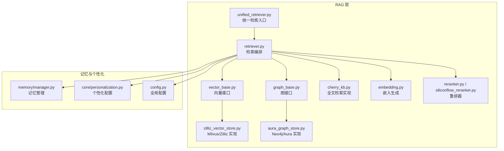
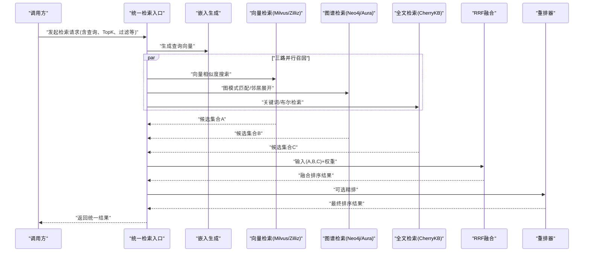
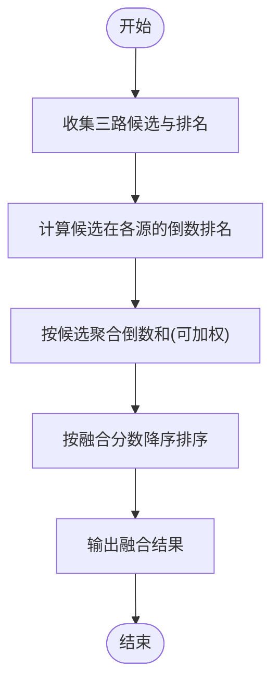
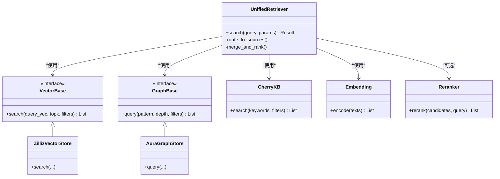

# GraphRAG检索器

<cite>
**本文引用的文件**   
- [backend_design/nexus/rag/retriever.py](file://backend_design/nexus/rag/retriever.py)
- [backend_design/nexus/rag/unified_retriever.py](file://backend_design/nexus/rag/unified_retriever.py)
- [backend_design/nexus/rag/vector_base.py](file://backend_design/nexus/rag/vector_base.py)
- [backend_design/nexus/rag/zilliz_vector_store.py](file://backend_design/nexus/rag/zilliz_vector_store.py)
- [backend_design/nexus/rag/graph_base.py](file://backend_design/nexus/rag/graph_base.py)
- [backend_design/nexus/rag/aura_graph_store.py](file://backend_design/nexus/rag/aura_graph_store.py)
- [backend_design/nexus/rag/cherry_kb.py](file://backend_design/nexus/rag/cherry_kb.py)
- [backend_design/nexus/rag/embedding.py](file://backend_design/nexus/rag/embedding.py)
- [backend_design/nexus/rag/reranker.py](file://backend_design/nexus/rag/reranker.py)
- [backend_design/nexus/rag/siliconflow_reranker.py](file://backend_design/nexus/rag/siliconflow_reranker.py)
- [backend_design/nexus/memory/manager.py](file://backend_design/nexus/memory/manager.py)
- [backend_design/nexus/core/personalization.py](file://backend_design/nexus/core/personalization.py)
- [backend_design/nexus/config.py](file://backend_design/nexus/config.py)
</cite>

## 目录
1. [简介](#简介)
2. [项目结构](#项目结构)
3. [核心组件](#核心组件)
4. [架构总览](#架构总览)
5. [详细组件分析](#详细组件分析)
6. [依赖关系分析](#依赖关系分析)
7. [性能考虑](#性能考虑)
8. [故障排查指南](#故障排查指南)
9. [结论](#结论)
10. [附录](#附录)

## 简介
本文件面向 NexusCockpit 的 GraphRAG 检索器，系统性阐述“三路融合检索”的实现与优化：向量检索（Milvus/Zilliz）、图谱检索（Neo4j/Aura）与全文检索（CherryKB）的协同工作机制。文档覆盖用户记忆存储结构、知识图谱构建流程、向量嵌入生成与相似度计算、RRF（Reciprocal Rank Fusion）融合策略的具体实现、查询优化技巧与性能调优指南，并提供扩展新检索源与优化检索效果的实践路径。

## 项目结构
GraphRAG 相关代码集中在 backend_design/nexus/rag 目录下，围绕统一检索入口、向量库抽象、图数据库抽象、重排器与嵌入模块组织。记忆与个性化配置位于 memory 与 core 子模块中，为检索提供上下文增强。

图表来源
- [backend_design/nexus/rag/unified_retriever.py](file://backend_design/nexus/rag/unified_retriever.py)
- [backend_design/nexus/rag/retriever.py](file://backend_design/nexus/rag/retriever.py)
- [backend_design/nexus/rag/vector_base.py](file://backend_design/nexus/rag/vector_base.py)
- [backend_design/nexus/rag/zilliz_vector_store.py](file://backend_design/nexus/rag/zilliz_vector_store.py)
- [backend_design/nexus/rag/graph_base.py](file://backend_design/nexus/rag/graph_base.py)
- [backend_design/nexus/rag/aura_graph_store.py](file://backend_design/nexus/rag/aura_graph_store.py)
- [backend_design/nexus/rag/cherry_kb.py](file://backend_design/nexus/rag/cherry_kb.py)
- [backend_design/nexus/rag/embedding.py](file://backend_design/nexus/rag/embedding.py)
- [backend_design/nexus/rag/reranker.py](file://backend_design/nexus/rag/reranker.py)
- [backend_design/nexus/rag/siliconflow_reranker.py](file://backend_design/nexus/rag/siliconflow_reranker.py)
- [backend_design/nexus/memory/manager.py](file://backend_design/nexus/memory/manager.py)
- [backend_design/nexus/core/personalization.py](file://backend_design/nexus/core/personalization.py)
- [backend_design/nexus/config.py](file://backend_design/nexus/config.py)

章节来源
- [backend_design/nexus/rag/unified_retriever.py](file://backend_design/nexus/rag/unified_retriever.py)
- [backend_design/nexus/rag/retriever.py](file://backend_design/nexus/rag/retriever.py)
- [backend_design/nexus/rag/vector_base.py](file://backend_design/nexus/rag/vector_base.py)
- [backend_design/nexus/rag/zilliz_vector_store.py](file://backend_design/nexus/rag/zilliz_vector_store.py)
- [backend_design/nexus/rag/graph_base.py](file://backend_design/nexus/rag/graph_base.py)
- [backend_design/nexus/rag/aura_graph_store.py](file://backend_design/nexus/rag/aura_graph_store.py)
- [backend_design/nexus/rag/cherry_kb.py](file://backend_design/nexus/rag/cherry_kb.py)
- [backend_design/nexus/rag/embedding.py](file://backend_design/nexus/rag/embedding.py)
- [backend_design/nexus/rag/reranker.py](file://backend_design/nexus/rag/reranker.py)
- [backend_design/nexus/rag/siliconflow_reranker.py](file://backend_design/nexus/rag/siliconflow_reranker.py)
- [backend_design/nexus/memory/manager.py](file://backend_design/nexus/memory/manager.py)
- [backend_design/nexus/core/personalization.py](file://backend_design/nexus/core/personalization.py)
- [backend_design/nexus/config.py](file://backend_design/nexus/config.py)

## 核心组件
- 统一检索入口：对外暴露统一的检索 API，负责参数解析、多路召回、排序与结果合并。
- 向量检索：基于 Milvus/Zilliz 的向量相似度搜索，支持 TopK、过滤条件与元数据筛选。
- 图谱检索：基于 Neo4j/Aura 的图遍历与模式匹配，返回实体、关系与子图片段。
- 全文检索：基于 CherryKB 的关键词/布尔检索，适合精确术语与短文本匹配。
- 嵌入生成：将查询与文档切片转换为向量，支撑向量检索与相似度计算。
- 重排器：对候选集进行二次精排，提升最终相关性。
- 记忆与个性化：注入用户历史偏好、会话上下文与领域约束，增强召回质量。

章节来源
- [backend_design/nexus/rag/unified_retriever.py](file://backend_design/nexus/rag/unified_retriever.py)
- [backend_design/nexus/rag/retriever.py](file://backend_design/nexus/rag/retriever.py)
- [backend_design/nexus/rag/vector_base.py](file://backend_design/nexus/rag/vector_base.py)
- [backend_design/nexus/rag/zilliz_vector_store.py](file://backend_design/nexus/rag/zilliz_vector_store.py)
- [backend_design/nexus/rag/graph_base.py](file://backend_design/nexus/rag/graph_base.py)
- [backend_design/nexus/rag/aura_graph_store.py](file://backend_design/nexus/rag/aura_graph_store.py)
- [backend_design/nexus/rag/cherry_kb.py](file://backend_design/nexus/rag/cherry_kb.py)
- [backend_design/nexus/rag/embedding.py](file://backend_design/nexus/rag/embedding.py)
- [backend_design/nexus/rag/reranker.py](file://backend_design/nexus/rag/reranker.py)
- [backend_design/nexus/rag/siliconflow_reranker.py](file://backend_design/nexus/rag/siliconflow_reranker.py)
- [backend_design/nexus/memory/manager.py](file://backend_design/nexus/memory/manager.py)
- [backend_design/nexus/core/personalization.py](file://backend_design/nexus/core/personalization.py)

## 架构总览
下图展示三路融合检索的整体流程：查询经嵌入后并行进入向量、图谱与全文检索；各源返回候选项，随后通过 RRF 融合与可选重排器精排，最终输出统一结果。

图表来源
- [backend_design/nexus/rag/unified_retriever.py](file://backend_design/nexus/rag/unified_retriever.py)
- [backend_design/nexus/rag/retriever.py](file://backend_design/nexus/rag/retriever.py)
- [backend_design/nexus/rag/vector_base.py](file://backend_design/nexus/rag/vector_base.py)
- [backend_design/nexus/rag/zilliz_vector_store.py](file://backend_design/nexus/rag/zilliz_vector_store.py)
- [backend_design/nexus/rag/graph_base.py](file://backend_design/nexus/rag/graph_base.py)
- [backend_design/nexus/rag/aura_graph_store.py](file://backend_design/nexus/rag/aura_graph_store.py)
- [backend_design/nexus/rag/cherry_kb.py](file://backend_design/nexus/rag/cherry_kb.py)
- [backend_design/nexus/rag/embedding.py](file://backend_design/nexus/rag/embedding.py)
- [backend_design/nexus/rag/reranker.py](file://backend_design/nexus/rag/reranker.py)
- [backend_design/nexus/rag/siliconflow_reranker.py](file://backend_design/nexus/rag/siliconflow_reranker.py)

## 详细组件分析

### 统一检索入口与编排
- 职责：接收查询与参数，构造检索任务，分发到三路检索源，收集候选并执行融合与精排。
- 关键能力：
  - 参数校验与默认值填充（TopK、过滤条件、权重）。
  - 并发调度三路检索，降低端到端延迟。
  - 结果去重与归一化（统一 ID、字段映射）。
  - 可插拔的重排器接入点。

章节来源
- [backend_design/nexus/rag/unified_retriever.py](file://backend_design/nexus/rag/unified_retriever.py)
- [backend_design/nexus/rag/retriever.py](file://backend_design/nexus/rag/retriever.py)

### 向量检索（Milvus/Zilliz）
- 接口抽象：定义向量库通用方法（创建索引、插入、删除、相似度搜索、过滤）。
- 具体实现：对接 Milvus/Zilliz，处理连接池、分区/标签过滤、标量过滤表达式。
- 相似度算法：内积或余弦相似度（由索引类型决定），TopK 返回最相似向量及元数据。
- 性能要点：
  - 合理设置 nlist/nprobe 平衡召回率与延迟。
  - 使用标量字段做预过滤减少候选规模。
  - 批量写入与异步提交提升吞吐。

章节来源
- [backend_design/nexus/rag/vector_base.py](file://backend_design/nexus/rag/vector_base.py)
- [backend_design/nexus/rag/zilliz_vector_store.py](file://backend_design/nexus/rag/zilliz_vector_store.py)

### 图谱检索（Neo4j/Aura）
- 接口抽象：定义图查询方法（节点查找、关系遍历、子图提取、属性过滤）。
- 具体实现：对接 Neo4j/Aura，支持 Cypher 查询模板与参数化绑定。
- 检索策略：
  - 实体识别后以种子节点为中心展开固定深度邻居。
  - 结合业务模式约束（如角色、时间窗口、状态）剪枝。
  - 返回结构化片段（节点+边+属性）便于后续融合。
- 性能要点：
  - 建立合适索引与约束，避免全表扫描。
  - 限制遍历深度与分支因子，控制结果规模。
  - 缓存热点子图或常用查询计划。

章节来源
- [backend_design/nexus/rag/graph_base.py](file://backend_design/nexus/rag/graph_base.py)
- [backend_design/nexus/rag/aura_graph_store.py](file://backend_design/nexus/rag/aura_graph_store.py)

### 全文检索（CherryKB）
- 职责：基于倒排索引的关键词/布尔检索，适合精确术语、短文本与强规则场景。
- 特点：
  - 高召回的精确匹配与短语匹配。
  - 支持字段级过滤与权重调整。
  - 与向量/图谱互补，覆盖稀疏语义与长尾词。
- 性能要点：
  - 分词与停用词策略影响召回精度。
  - 控制最大返回条数与查询复杂度。

章节来源
- [backend_design/nexus/rag/cherry_kb.py](file://backend_design/nexus/rag/cherry_kb.py)

### 嵌入生成与相似度计算
- 嵌入模型：将查询与文档切片映射为稠密向量，支持本地或远程服务。
- 预处理：清洗、截断、分段与规范化，保证向量空间一致性。
- 相似度：与向量库约定一致（内积/余弦），在入库与查询时保持一致性。
- 优化：
  - 批量化编码与缓存常见查询向量。
  - 动态选择模型维度与精度权衡。

章节来源
- [backend_design/nexus/rag/embedding.py](file://backend_design/nexus/rag/embedding.py)

### RRF（Reciprocal Rank Fusion）融合策略
- 目标：在不依赖外部评分的情况下，将不同源的排名序列融合为统一排序。
- 核心思想：对每个候选在所有源中出现的位置取倒数，累加得到融合分数，按总分降序排列。
- 典型步骤：
  - 收集三路候选及其在各源的排名位置。
  - 对每个候选计算跨源倒数和。
  - 可选：引入源权重以调节贡献度。
  - 输出融合后的候选列表供重排器进一步精排。

图表来源
- [backend_design/nexus/rag/retriever.py](file://backend_design/nexus/rag/retriever.py)

章节来源
- [backend_design/nexus/rag/retriever.py](file://backend_design/nexus/rag/retriever.py)

### 重排器（Reranker）
- 作用：在融合基础上进行细粒度相关性打分，提升最终答案质量。
- 实现：支持多种后端（例如 SiliconFlow 重排器），通过统一接口接入。
- 输入：候选片段与查询；输出：精排后的顺序与置信度。
- 建议：
  - 控制候选规模以降低重排成本。
  - 根据业务场景选择更合适的重排模型。

章节来源
- [backend_design/nexus/rag/reranker.py](file://backend_design/nexus/rag/reranker.py)
- [backend_design/nexus/rag/siliconflow_reranker.py](file://backend_design/nexus/rag/siliconflow_reranker.py)

### 用户记忆与个性化注入
- 记忆管理：维护用户历史对话、偏好与行为摘要，作为检索上下文。
- 个性化：根据用户画像调整检索权重、过滤条件与提示词。
- 融合方式：
  - 在查询阶段注入个性化约束（如领域、时间范围）。
  - 在融合阶段对不同源的结果施加个性化权重。
  - 在重排阶段引入用户偏好信号。

章节来源
- [backend_design/nexus/memory/manager.py](file://backend_design/nexus/memory/manager.py)
- [backend_design/nexus/core/personalization.py](file://backend_design/nexus/core/personalization.py)

### 配置与环境
- 全局配置：集中管理向量库、图数据库、全文检索、重排器与嵌入服务的连接参数与开关。
- 运行时切换：通过配置启用/禁用某路检索源，便于灰度与降级。

章节来源
- [backend_design/nexus/config.py](file://backend_design/nexus/config.py)

## 依赖关系分析
- 低耦合抽象：向量与图检索均通过接口抽象解耦具体实现，便于替换与扩展。
- 组合式编排：统一检索入口组合多个独立组件，遵循单一职责原则。
- 外部依赖：Milvus/Zilliz、Neo4j/Aura、CherryKB、重排服务与嵌入服务。

图表来源
- [backend_design/nexus/rag/unified_retriever.py](file://backend_design/nexus/rag/unified_retriever.py)
- [backend_design/nexus/rag/vector_base.py](file://backend_design/nexus/rag/vector_base.py)
- [backend_design/nexus/rag/zilliz_vector_store.py](file://backend_design/nexus/rag/zilliz_vector_store.py)
- [backend_design/nexus/rag/graph_base.py](file://backend_design/nexus/rag/graph_base.py)
- [backend_design/nexus/rag/aura_graph_store.py](file://backend_design/nexus/rag/aura_graph_store.py)
- [backend_design/nexus/rag/cherry_kb.py](file://backend_design/nexus/rag/cherry_kb.py)
- [backend_design/nexus/rag/embedding.py](file://backend_design/nexus/rag/embedding.py)
- [backend_design/nexus/rag/reranker.py](file://backend_design/nexus/rag/reranker.py)

章节来源
- [backend_design/nexus/rag/unified_retriever.py](file://backend_design/nexus/rag/unified_retriever.py)
- [backend_design/nexus/rag/vector_base.py](file://backend_design/nexus/rag/vector_base.py)
- [backend_design/nexus/rag/zilliz_vector_store.py](file://backend_design/nexus/rag/zilliz_vector_store.py)
- [backend_design/nexus/rag/graph_base.py](file://backend_design/nexus/rag/graph_base.py)
- [backend_design/nexus/rag/aura_graph_store.py](file://backend_design/nexus/rag/graph_base.py)
- [backend_design/nexus/rag/cherry_kb.py](file://backend_design/nexus/rag/cherry_kb.py)
- [backend_design/nexus/rag/embedding.py](file://backend_design/nexus/rag/embedding.py)
- [backend_design/nexus/rag/reranker.py](file://backend_design/nexus/rag/reranker.py)

## 性能考虑
- 召回阶段
  - 向量检索：调整 nlist/nprobe、使用标量预过滤、批量查询与连接池复用。
  - 图谱检索：限制遍历深度与分支、建立索引与约束、缓存热点子图。
  - 全文检索：优化分词与停用词、限制查询复杂度与返回规模。
- 融合与精排
  - RRF 计算轻量，优先在内存完成；控制候选规模后再进入重排器。
  - 重排器按需启用，结合业务 SLA 与资源预算。
- 系统与资源
  - 并发度与超时控制：三路检索并行，设置合理的超时与熔断。
  - 监控与指标：记录各源耗时、召回数量、融合与重排耗时，定位瓶颈。
  - 缓存：对高频查询向量与热门子图进行缓存，降低重复计算与 IO。

[本节为通用指导，不直接分析具体文件]

## 故障排查指南
- 连接问题
  - 检查向量库、图数据库、全文检索与重排器的连接配置与网络可达性。
  - 确认认证凭据、端口与防火墙策略。
- 召回异常
  - 向量检索：核对索引类型与相似度度量是否一致；检查标量过滤表达式语法。
  - 图谱检索：验证 Cypher 模板与参数绑定；检查节点/关系是否存在与索引命中。
  - 全文检索：确认分词器与停用词配置；检查关键词与字段映射。
- 融合与排序
  - 核对候选去重键与字段映射是否正确；检查 RRF 权重与排序稳定性。
- 日志与追踪
  - 开启各组件的调试日志，记录输入参数、中间结果与错误堆栈。
  - 结合链路追踪定位慢调用与失败重试。

章节来源
- [backend_design/nexus/config.py](file://backend_design/nexus/config.py)
- [backend_design/nexus/rag/vector_base.py](file://backend_design/nexus/rag/vector_base.py)
- [backend_design/nexus/rag/zilliz_vector_store.py](file://backend_design/nexus/rag/zilliz_vector_store.py)
- [backend_design/nexus/rag/graph_base.py](file://backend_design/nexus/rag/graph_base.py)
- [backend_design/nexus/rag/aura_graph_store.py](file://backend_design/nexus/rag/aura_graph_store.py)
- [backend_design/nexus/rag/cherry_kb.py](file://backend_design/nexus/rag/cherry_kb.py)
- [backend_design/nexus/rag/retriever.py](file://backend_design/nexus/rag/retriever.py)

## 结论
NexusCockpit 的 GraphRAG 检索器通过统一入口编排三路检索，利用 RRF 融合与可选重排器，兼顾召回广度与排序精度。借助接口抽象与配置化开关，系统具备良好的可扩展性与可运维性。配合记忆与个性化注入，可在复杂业务场景中稳定输出高质量结果。

[本节为总结性内容，不直接分析具体文件]

## 附录

### 扩展新的检索源（示例步骤）
- 定义接口契约
  - 若新增向量源：参考向量接口抽象，实现统一方法签名与错误约定。
  - 若新增图源：参考图接口抽象，实现查询方法与返回结构。
  - 若新增全文源：参考现有全文检索实现，确保返回格式一致。
- 注册与配置
  - 在统一检索入口中注册新源，并在配置文件中添加连接参数与开关。
- 融合与精排
  - 新源参与 RRF 融合，必要时调整权重以获得期望效果。
- 测试与回归
  - 编写单元测试与集成测试，覆盖正常路径与异常路径。
  - 压测评估延迟与吞吐变化，必要时调整并发与超时。

章节来源
- [backend_design/nexus/rag/vector_base.py](file://backend_design/nexus/rag/vector_base.py)
- [backend_design/nexus/rag/graph_base.py](file://backend_design/nexus/rag/graph_base.py)
- [backend_design/nexus/rag/cherry_kb.py](file://backend_design/nexus/rag/cherry_kb.py)
- [backend_design/nexus/rag/unified_retriever.py](file://backend_design/nexus/rag/unified_retriever.py)
- [backend_design/nexus/config.py](file://backend_design/nexus/config.py)

### 优化检索效果（实践清单）
- 数据侧
  - 文档切分与标题/摘要增强，提高向量区分度。
  - 图谱模式设计聚焦关键实体与关系，减少噪声边。
  - 全文索引字段精细化，避免过度泛化。
- 检索侧
  - 向量检索：选择合适的索引与度量，调整 TopK 与过滤条件。
  - 图谱检索：限定深度与分支，使用模式约束剪枝。
  - 全文检索：优化分词与停用词，使用短语与布尔逻辑。
- 融合与精排
  - 调整 RRF 权重，结合业务反馈迭代。
  - 启用重排器并对候选规模进行裁剪，平衡质量与成本。
- 观测与迭代
  - 建立离线评测集与在线 A/B 实验，持续跟踪命中率与满意度。

[本节为通用指导，不直接分析具体文件]