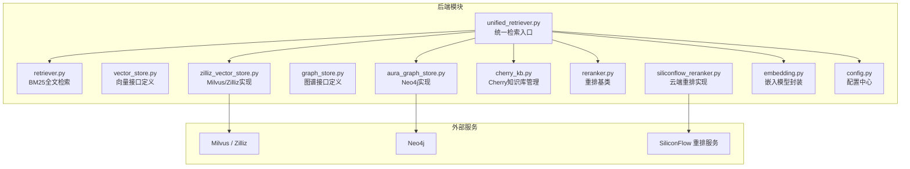
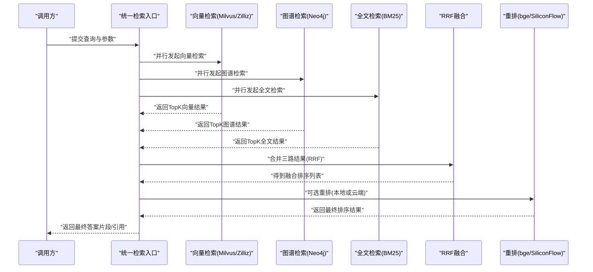
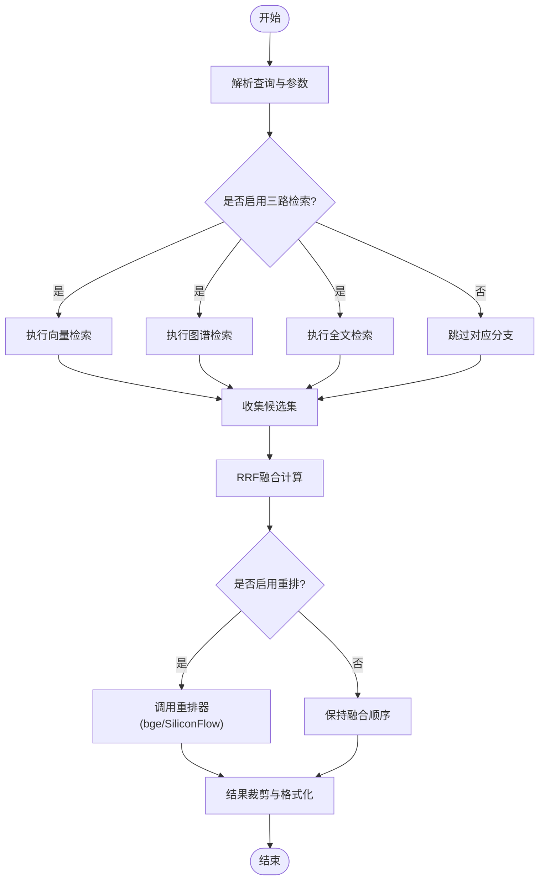
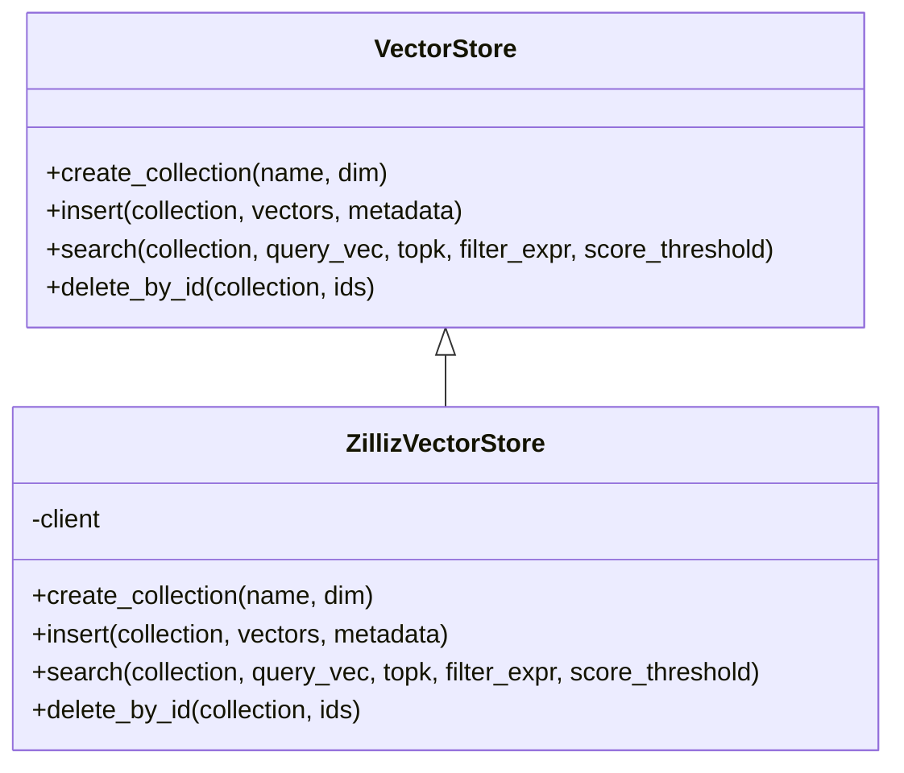
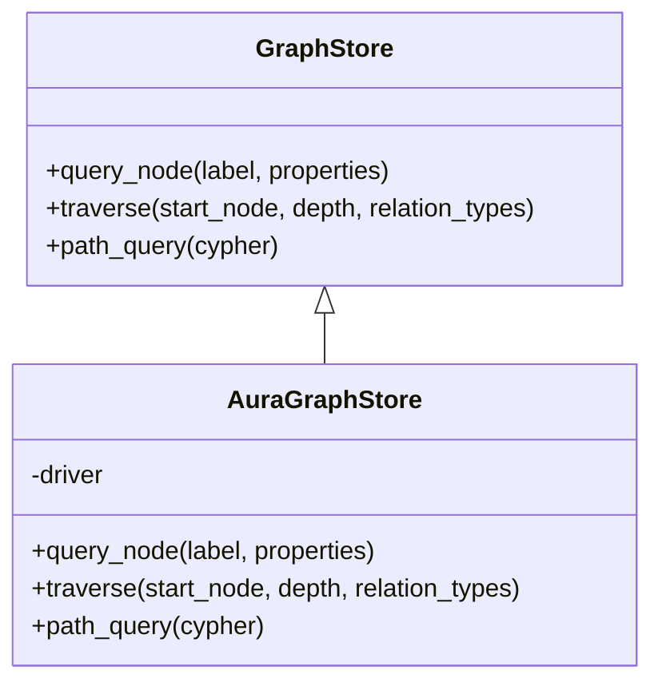
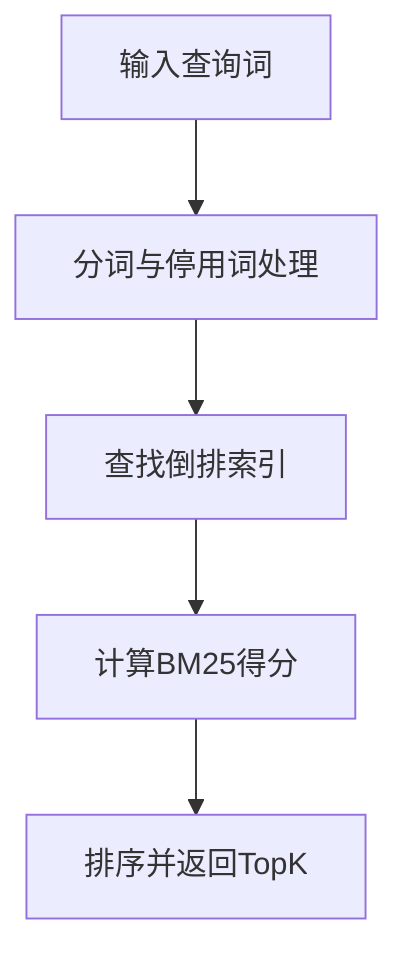
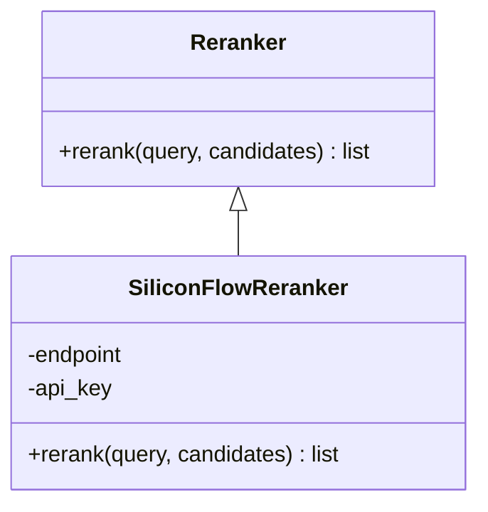
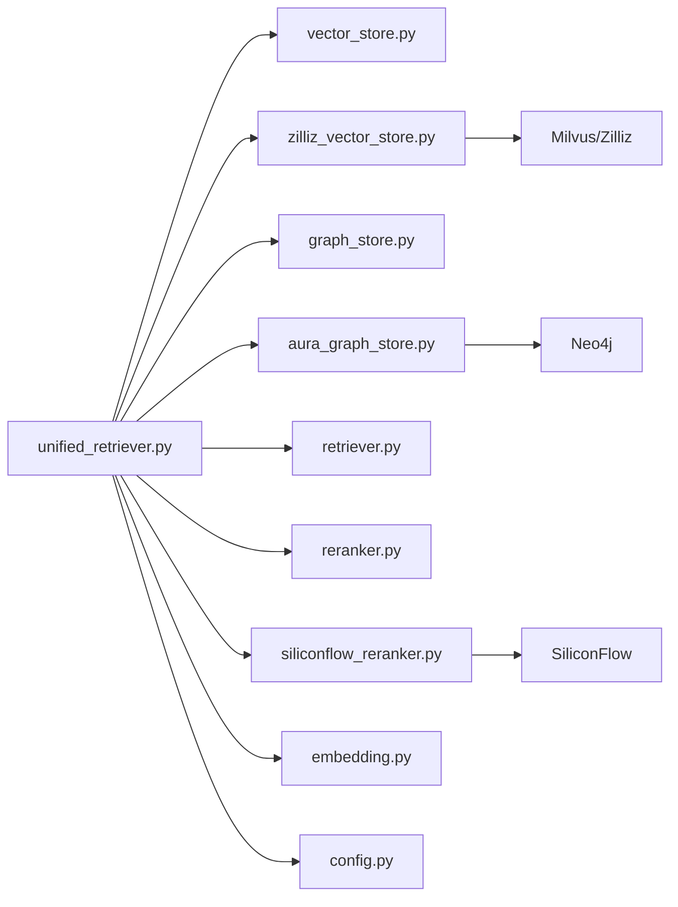

# GraphRAG检索系统

<cite>
**本文引用的文件**   
- [backend_design/nexus/rag/unified_retriever.py](file://backend_design/nexus/rag/unified_retriever.py)
- [backend_design/nexus/rag/retriever.py](file://backend_design/nexus/rag/retriever.py)
- [backend_design/nexus/rag/vector_store.py](file://backend_design/nexus/rag/vector_store.py)
- [backend_design/nexus/rag/zilliz_vector_store.py](file://backend_design/nexus/rag/zilliz_vector_store.py)
- [backend_design/nexus/rag/graph_store.py](file://backend_design/nexus/rag/graph_store.py)
- [backend_design/nexus/rag/aura_graph_store.py](file://backend_design/nexus/rag/aura_graph_store.py)
- [backend_design/nexus/rag/cherry_kb.py](file://backend_design/nexus/rag/cherry_kb.py)
- [backend_design/nexus/rag/reranker.py](file://backend_design/nexus/rag/reranker.py)
- [backend_design/nexus/rag/siliconflow_reranker.py](file://backend_design/nexus/rag/siliconflow_reranker.py)
- [backend_design/nexus/rag/embedding.py](file://backend_design/nexus/rag/embedding.py)
- [backend_design/nexus/config.py](file://backend_design/nexus/config.py)
- [scripts/init_milvus.py](file://scripts/init_milvus.py)
- [scripts/init_neo4j.py](file://scripts/init_neo4j.py)
- [docker-compose.yml](file://docker-compose.yml)
</cite>

## 目录
1. [简介](#简介)
2. [项目结构](#项目结构)
3. [核心组件](#核心组件)
4. [架构总览](#架构总览)
5. [详细组件分析](#详细组件分析)
6. [依赖关系分析](#依赖关系分析)
7. [性能考虑](#性能考虑)
8. [故障排查指南](#故障排查指南)
9. [结论](#结论)
10. [附录](#附录)

## 简介
本文件面向 NexusCockpit 的 GraphRAG 检索系统，系统性阐述“三路融合检索”（向量检索 + 图谱检索 + 全文检索）的整体设计与实现细节。重点覆盖：
- Milvus 向量存储与 Zilliz 云向量库接入
- Neo4j 知识图谱检索
- BM25 全文检索
- RRF（Reciprocal Rank Fusion）多路结果融合策略
- bge-reranker-v2-m3 重排模型与云端重排服务
- Cherry 知识库管理
- 双模式部署（本地 Docker + 云端服务）
- 统一检索路由设计、查询优化策略与性能调优指南
- 使用示例与调用模式

## 项目结构
GraphRAG 相关代码集中于 backend_design/nexus/rag 目录，围绕“统一检索入口 -> 多路检索器 -> 融合与重排 -> 返回结果”的主线组织。配置集中在 backend_design/nexus/config.py，初始化脚本位于 scripts 目录，容器编排由 docker-compose.yml 提供。

图表来源
- [backend_design/nexus/rag/unified_retriever.py](file://backend_design/nexus/rag/unified_retriever.py)
- [backend_design/nexus/rag/retriever.py](file://backend_design/nexus/rag/retriever.py)
- [backend_design/nexus/rag/vector_store.py](file://backend_design/nexus/rag/vector_store.py)
- [backend_design/nexus/rag/zilliz_vector_store.py](file://backend_design/nexus/rag/zilliz_vector_store.py)
- [backend_design/nexus/rag/graph_store.py](file://backend_design/nexus/rag/graph_store.py)
- [backend_design/nexus/rag/aura_graph_store.py](file://backend_design/nexus/rag/aura_graph_store.py)
- [backend_design/nexus/rag/cherry_kb.py](file://backend_design/nexus/rag/cherry_kb.py)
- [backend_design/nexus/rag/reranker.py](file://backend_design/nexus/rag/reranker.py)
- [backend_design/nexus/rag/siliconflow_reranker.py](file://backend_design/nexus/rag/siliconflow_reranker.py)
- [backend_design/nexus/rag/embedding.py](file://backend_design/nexus/rag/embedding.py)
- [backend_design/nexus/config.py](file://backend_design/nexus/config.py)

章节来源
- [backend_design/nexus/rag/unified_retriever.py](file://backend_design/nexus/rag/unified_retriever.py)
- [backend_design/nexus/config.py](file://backend_design/nexus/config.py)

## 核心组件
- 统一检索入口 unified_retriever：负责接收查询、分发到各检索通道、执行 RRF 融合与可选重排，并返回最终结果。
- 向量检索 vector_store/zilliz_vector_store：抽象向量检索接口并提供 Milvus/Zilliz 的具体实现，支持集合选择、过滤条件、相似度阈值等参数。
- 图谱检索 graph_store/aura_graph_store：抽象图谱检索接口并提供 Neo4j 的具体实现，支持图遍历、路径检索、属性过滤等。
- 全文检索 retriever：基于 BM25 的关键词匹配检索，适合精确术语召回。
- 重排 reranker/siliconflow_reranker：提供本地或云端重排能力，默认使用 bge-reranker-v2-m3 或 SiliconFlow 在线重排。
- 嵌入 embedding：为查询文本生成向量表示，供向量检索使用。
- Cherry 知识库 cherry_kb：对文档进行切分、索引与管理，作为全文与向量索引的数据源之一。
- 配置 config：集中管理 Milvus、Neo4j、重排模型与服务端点等运行时参数。

章节来源
- [backend_design/nexus/rag/unified_retriever.py](file://backend_design/nexus/rag/unified_retriever.py)
- [backend_design/nexus/rag/vector_store.py](file://backend_design/nexus/rag/vector_store.py)
- [backend_design/nexus/rag/zilliz_vector_store.py](file://backend_design/nexus/rag/zilliz_vector_store.py)
- [backend_design/nexus/rag/graph_store.py](file://backend_design/nexus/rag/graph_store.py)
- [backend_design/nexus/rag/aura_graph_store.py](file://backend_design/nexus/rag/aura_graph_store.py)
- [backend_design/nexus/rag/retriever.py](file://backend_design/nexus/rag/retriever.py)
- [backend_design/nexus/rag/reranker.py](file://backend_design/nexus/rag/reranker.py)
- [backend_design/nexus/rag/siliconflow_reranker.py](file://backend_design/nexus/rag/siliconflow_reranker.py)
- [backend_design/nexus/rag/embedding.py](file://backend_design/nexus/rag/embedding.py)
- [backend_design/nexus/rag/cherry_kb.py](file://backend_design/nexus/rag/cherry_kb.py)
- [backend_design/nexus/config.py](file://backend_design/nexus/config.py)

## 架构总览
下图展示了从用户查询到最终结果的端到端流程，包括三路检索、RRF 融合与重排阶段。

图表来源
- [backend_design/nexus/rag/unified_retriever.py](file://backend_design/nexus/rag/unified_retriever.py)
- [backend_design/nexus/rag/zilliz_vector_store.py](file://backend_design/nexus/rag/zilliz_vector_store.py)
- [backend_design/nexus/rag/aura_graph_store.py](file://backend_design/nexus/rag/aura_graph_store.py)
- [backend_design/nexus/rag/retriever.py](file://backend_design/nexus/rag/retriever.py)
- [backend_design/nexus/rag/reranker.py](file://backend_design/nexus/rag/reranker.py)
- [backend_design/nexus/rag/siliconflow_reranker.py](file://backend_design/nexus/rag/siliconflow_reranker.py)

## 详细组件分析

### 统一检索入口 unified_retriever
职责
- 解析查询与检索参数（如 TopK、权重、是否启用重排）。
- 并发调度三路检索器，收集候选集。
- 执行 RRF 融合，必要时调用重排器进行二次排序。
- 输出标准化结果（包含内容、来源、分数等元数据）。

关键流程
- 参数校验与默认值填充
- 并行检索（向量/图谱/全文）
- RRF 融合计算
- 可选重排（bge-reranker-v2-m3 或 SiliconFlow）
- 结果裁剪与格式化

图表来源
- [backend_design/nexus/rag/unified_retriever.py](file://backend_design/nexus/rag/unified_retriever.py)
- [backend_design/nexus/rag/reranker.py](file://backend_design/nexus/rag/reranker.py)
- [backend_design/nexus/rag/siliconflow_reranker.py](file://backend_design/nexus/rag/siliconflow_reranker.py)

章节来源
- [backend_design/nexus/rag/unified_retriever.py](file://backend_design/nexus/rag/unified_retriever.py)

### 向量检索 vector_store 与 zilliz_vector_store
职责
- vector_store：定义统一的向量检索接口（创建集合、插入向量、相似性搜索、删除等）。
- zilliz_vector_store：基于 Milvus/Zilliz 的实现，支持集合名、过滤表达式、相似度阈值、TopK 等参数。

典型用法
- 初始化连接（本地 Milvus 或 Zilliz 云服务）
- 构建查询向量（通过 embedding 模块）
- 执行相似性搜索并返回带元数据的片段

图表来源
- [backend_design/nexus/rag/vector_store.py](file://backend_design/nexus/rag/vector_store.py)
- [backend_design/nexus/rag/zilliz_vector_store.py](file://backend_design/nexus/rag/zilliz_vector_store.py)

章节来源
- [backend_design/nexus/rag/vector_store.py](file://backend_design/nexus/rag/vector_store.py)
- [backend_design/nexus/rag/zilliz_vector_store.py](file://backend_design/nexus/rag/zilliz_vector_store.py)

### 图谱检索 graph_store 与 aura_graph_store
职责
- graph_store：定义统一的图谱检索接口（节点查询、关系遍历、路径检索等）。
- aura_graph_store：基于 Neo4j/Aura 的实现，支持 Cypher 查询、标签过滤、深度限制等。

典型用法
- 根据实体名称或 ID 定位节点
- 沿关系边扩展邻居节点
- 组合属性过滤与路径约束

图表来源
- [backend_design/nexus/rag/graph_store.py](file://backend_design/nexus/rag/graph_store.py)
- [backend_design/nexus/rag/aura_graph_store.py](file://backend_design/nexus/rag/aura_graph_store.py)

章节来源
- [backend_design/nexus/rag/graph_store.py](file://backend_design/nexus/rag/graph_store.py)
- [backend_design/nexus/rag/aura_graph_store.py](file://backend_design/nexus/rag/aura_graph_store.py)

### 全文检索 retriever（BM25）
职责
- 基于 BM25 算法对文档片段进行关键词匹配与打分。
- 适用于精确术语召回与短文本匹配。

典型用法
- 构建倒排索引（可由 Cherry 知识库完成）
- 按查询词进行评分排序并返回 TopK

图表来源
- [backend_design/nexus/rag/retriever.py](file://backend_design/nexus/rag/retriever.py)

章节来源
- [backend_design/nexus/rag/retriever.py](file://backend_design/nexus/rag/retriever.py)

### 重排 reranker 与 siliconflow_reranker
职责
- reranker：定义重排接口（接受候选片段与查询，返回重排后的有序列表）。
- siliconflow_reranker：对接 SiliconFlow 在线重排服务；也可在本地加载 bge-reranker-v2-m3 模型进行离线重排。

典型用法
- 传入候选片段与原始查询
- 返回按相关性重新排序的结果

图表来源
- [backend_design/nexus/rag/reranker.py](file://backend_design/nexus/rag/reranker.py)
- [backend_design/nexus/rag/siliconflow_reranker.py](file://backend_design/nexus/rag/siliconflow_reranker.py)

章节来源
- [backend_design/nexus/rag/reranker.py](file://backend_design/nexus/rag/reranker.py)
- [backend_design/nexus/rag/siliconflow_reranker.py](file://backend_design/nexus/rag/siliconflow_reranker.py)

### 嵌入 embedding
职责
- 将查询文本转换为向量表示，供向量检索使用。
- 可适配不同模型与后端（本地或云端）。

典型用法
- 单条或多条文本编码
- 控制维度与精度参数

章节来源
- [backend_design/nexus/rag/embedding.py](file://backend_design/nexus/rag/embedding.py)

### Cherry 知识库 cherry_kb
职责
- 文档加载、切分、清洗与索引构建。
- 为全文检索（BM25）与向量检索提供数据源。
- 支持版本管理与增量更新。

典型用法
- 导入文档集合
- 触发索引重建
- 查询时指定知识库范围

章节来源
- [backend_design/nexus/rag/cherry_kb.py](file://backend_design/nexus/rag/cherry_kb.py)

### 配置 config
职责
- 集中管理 Milvus/Zilliz、Neo4j、重排模型与服务端点等配置项。
- 支持环境变量与配置文件注入。

章节来源
- [backend_design/nexus/config.py](file://backend_design/nexus/config.py)

## 依赖关系分析
- unified_retriever 依赖 vector_store、graph_store、retriever、reranker、embedding 与 config。
- zilliz_vector_store 依赖 Milvus/Zilliz 客户端。
- aura_graph_store 依赖 Neo4j 驱动。
- siliconflow_reranker 依赖 SiliconFlow 服务端点。
- cherry_kb 为 retriever 与 vector_store 提供数据源。

图表来源
- [backend_design/nexus/rag/unified_retriever.py](file://backend_design/nexus/rag/unified_retriever.py)
- [backend_design/nexus/rag/vector_store.py](file://backend_design/nexus/rag/vector_store.py)
- [backend_design/nexus/rag/zilliz_vector_store.py](file://backend_design/nexus/rag/zilliz_vector_store.py)
- [backend_design/nexus/rag/graph_store.py](file://backend_design/nexus/rag/graph_store.py)
- [backend_design/nexus/rag/aura_graph_store.py](file://backend_design/nexus/rag/aura_graph_store.py)
- [backend_design/nexus/rag/retriever.py](file://backend_design/nexus/rag/retriever.py)
- [backend_design/nexus/rag/reranker.py](file://backend_design/nexus/rag/reranker.py)
- [backend_design/nexus/rag/siliconflow_reranker.py](file://backend_design/nexus/rag/siliconflow_reranker.py)
- [backend_design/nexus/rag/embedding.py](file://backend_design/nexus/rag/embedding.py)
- [backend_design/nexus/config.py](file://backend_design/nexus/config.py)

章节来源
- [backend_design/nexus/rag/unified_retriever.py](file://backend_design/nexus/rag/unified_retriever.py)
- [backend_design/nexus/config.py](file://backend_design/nexus/config.py)

## 性能考虑
- 并行检索：三路检索应并发执行以降低延迟。
- TopK 与阈值：合理设置 TopK 与相似度阈值，避免过多候选进入重排阶段。
- 重排开关：在低延迟场景可关闭重排以提升吞吐。
- 索引规模：控制向量与文档规模，定期清理过期片段。
- 资源隔离：Milvus、Neo4j 与重排服务独立部署，避免相互影响。
- 缓存策略：对高频查询结果进行短期缓存（可在上层中间件实现）。

[本节为通用性能建议，不直接分析具体文件]

## 故障排查指南
- 连接失败
  - 检查 Milvus/Zilliz 与 Neo4j 的连接参数与网络可达性。
  - 确认认证凭据与环境变量是否正确注入。
- 检索结果为空
  - 检查索引是否成功构建（Cherry 知识库与向量/全文索引）。
  - 调整 TopK 与相似度阈值，扩大召回范围。
- 重排超时或错误
  - 验证 SiliconFlow 服务可用性或本地模型加载状态。
  - 降低候选数量或增加超时时间。
- 初始化脚本
  - 使用 init_milvus.py 与 init_neo4j.py 进行环境初始化与连通性测试。

章节来源
- [scripts/init_milvus.py](file://scripts/init_milvus.py)
- [scripts/init_neo4j.py](file://scripts/init_neo4j.py)

## 结论
NexusCockpit 的 GraphRAG 检索系统通过“向量+图谱+全文”三路融合与 RRF 融合策略，结合 bge-reranker-v2-m3 或 SiliconFlow 重排，实现了高召回与高相关的检索体验。统一检索入口屏蔽了底层差异，配合 Cherry 知识库与灵活的配置管理，既支持本地 Docker 快速部署，也支持云端服务弹性扩展。

[本节为总结性内容，不直接分析具体文件]

## 附录

### 双模式部署说明
- 本地 Docker
  - 使用 docker-compose.yml 启动 Milvus、Neo4j 与应用服务。
  - 运行初始化脚本完成索引构建与连通性验证。
- 云端服务
  - 将 Milvus 替换为 Zilliz 云服务，Neo4j 替换为 Aura。
  - 配置 SiliconFlow 重排服务端点与密钥。

章节来源
- [docker-compose.yml](file://docker-compose.yml)
- [backend_design/nexus/config.py](file://backend_design/nexus/config.py)

### 使用示例与调用模式
- 基本检索
  - 构造查询字符串与参数（TopK、是否启用重排、权重分配）。
  - 调用统一检索入口获取最终结果。
- 指定知识库
  - 在 Cherry 知识库中维护多个数据集，检索时限定范围。
- 重排模式
  - 本地重排：加载 bge-reranker-v2-m3 模型。
  - 云端重排：配置 SiliconFlow 端点与 API Key。

章节来源
- [backend_design/nexus/rag/unified_retriever.py](file://backend_design/nexus/rag/unified_retriever.py)
- [backend_design/nexus/rag/cherry_kb.py](file://backend_design/nexus/rag/cherry_kb.py)
- [backend_design/nexus/rag/reranker.py](file://backend_design/nexus/rag/reranker.py)
- [backend_design/nexus/rag/siliconflow_reranker.py](file://backend_design/nexus/rag/siliconflow_reranker.py)