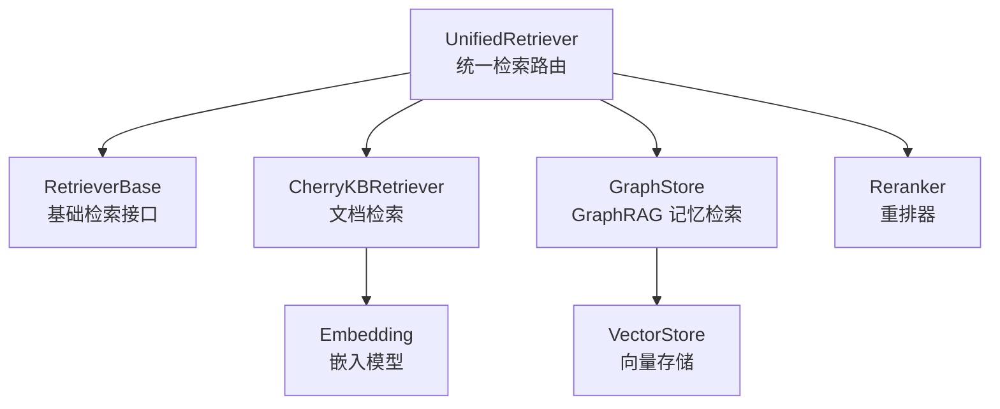
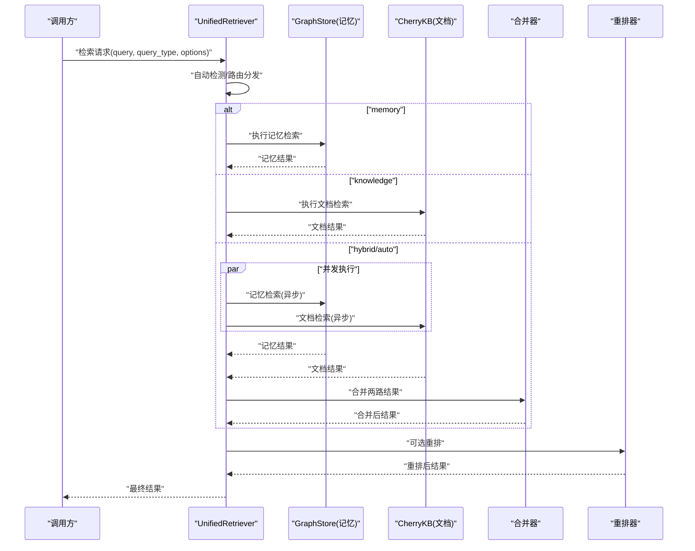
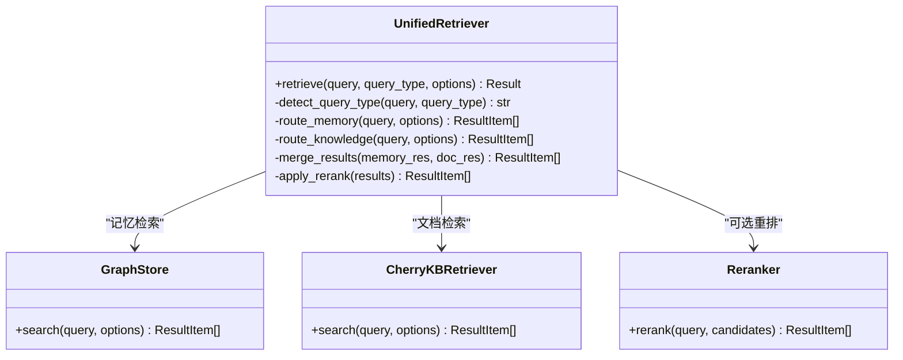
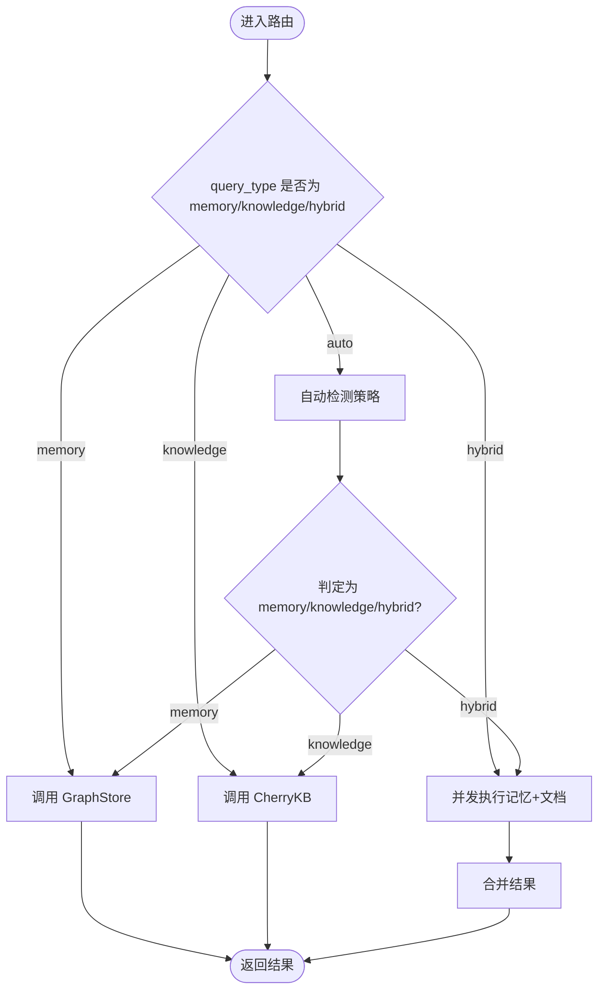
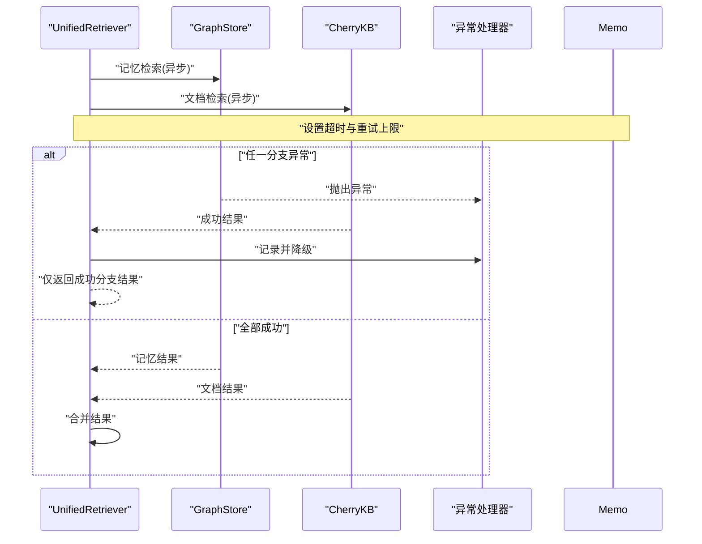
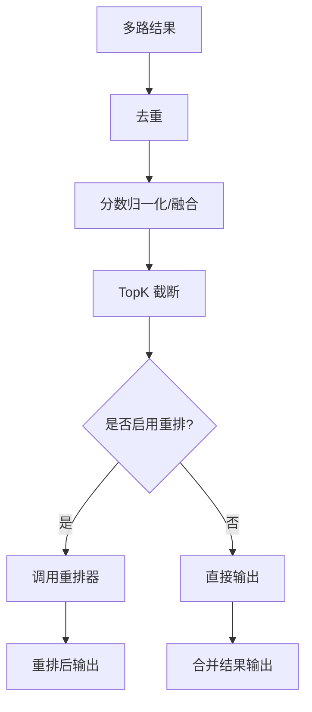
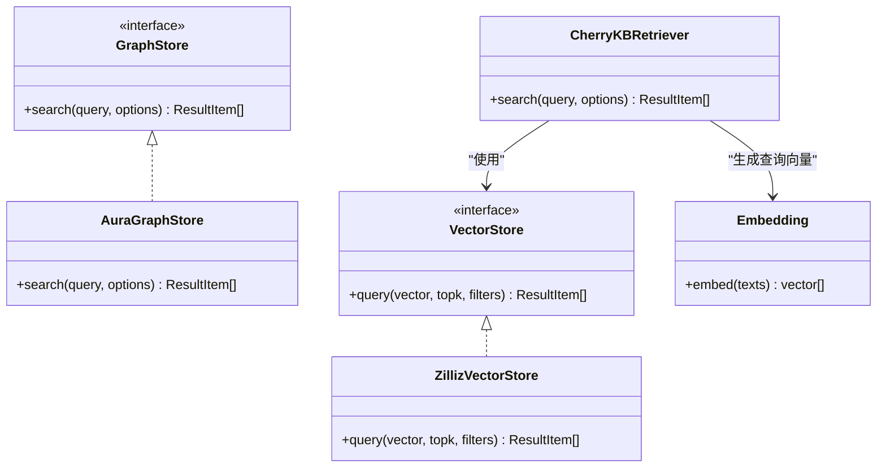
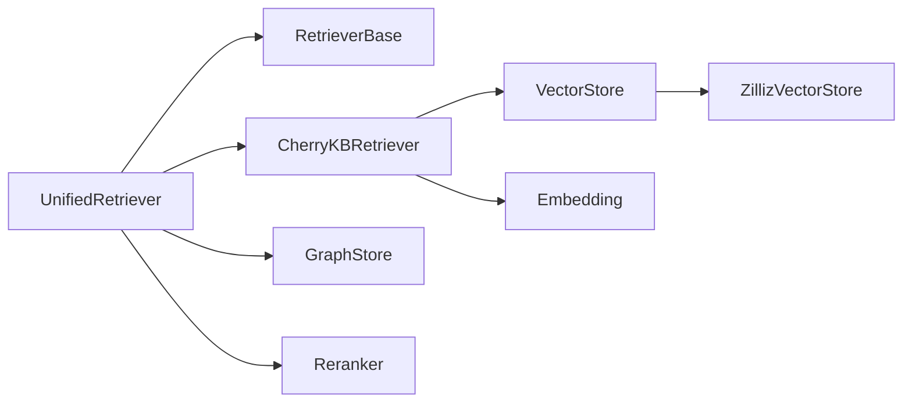

# 统一检索路由层

<cite>
**本文引用的文件**   
- [unified_retriever.py](file://backend_design/nexus/rag/unified_retriever.py)
- [retriever.py](file://backend_design/nexus/rag/retriever.py)
- [cherry_kb.py](file://backend_design/nexus/rag/cherry_kb.py)
- [graph_store.py](file://backend_design/nexus/rag/graph_store.py)
- [aura_graph_store.py](file://backend_design/nexus/rag/aura_graph_store.py)
- [reranker.py](file://backend_design/nexus/rag/reranker.py)
- [reranker_base.py](file://backend_design/nexus/rag/reranker_base.py)
- [vector_store.py](file://backend_design/nexus/rag/vector_store.py)
- [zilliz_vector_store.py](file://backend_design/nexus/rag/zilliz_vector_store.py)
- [embedding.py](file://backend_design/nexus/rag/embedding.py)
</cite>

## 目录
1. [简介](#简介)
2. [项目结构](#项目结构)
3. [核心组件](#核心组件)
4. [架构总览](#架构总览)
5. [详细组件分析](#详细组件分析)
6. [依赖关系分析](#依赖关系分析)
7. [性能考量](#性能考量)
8. [故障排查指南](#故障排查指南)
9. [结论](#结论)
10. [附录](#附录)

## 简介
本文件面向 NexusCockpit 的统一检索路由层，重点围绕 UnifiedRetriever 类的设计与实现，系统阐述查询类型自动检测（memory/knowledge/hybrid/auto）、并行检索策略、结果合并算法与重排集成。文档同时说明 GraphRAG 记忆检索与 Cherry KB 文档检索的路由分发逻辑，覆盖混合检索的异步并发实现与异常处理机制，并提供不同检索模式的使用方法与性能优化建议。

## 项目结构
统一检索路由层位于后端 RAG 模块中，核心文件包括：
- unified_retriever.py：统一检索入口与路由分发
- retriever.py：基础检索接口与通用能力
- cherry_kb.py：Cherry KB 文档检索实现
- graph_store.py / aura_graph_store.py：GraphRAG 记忆检索抽象与具体实现
- reranker.py / reranker_base.py：重排器抽象与默认实现
- vector_store.py / zilliz_vector_store.py：向量存储抽象与 Milvus 实现
- embedding.py：嵌入模型封装

图示来源
- [unified_retriever.py](file://backend_design/nexus/rag/unified_retriever.py)
- [retriever.py](file://backend_design/nexus/rag/retriever.py)
- [cherry_kb.py](file://backend_design/nexus/rag/cherry_kb.py)
- [graph_store.py](file://backend_design/nexus/rag/graph_store.py)
- [aura_graph_store.py](file://backend_design/nexus/rag/aura_graph_store.py)
- [reranker.py](file://backend_design/nexus/rag/reranker.py)
- [reranker_base.py](file://backend_design/nexus/rag/reranker_base.py)
- [vector_store.py](file://backend_design/nexus/rag/vector_store.py)
- [zilliz_vector_store.py](file://backend_design/nexus/rag/zilliz_vector_store.py)
- [embedding.py](file://backend_design/nexus/rag/embedding.py)

章节来源
- [unified_retriever.py](file://backend_design/nexus/rag/unified_retriever.py)
- [retriever.py](file://backend_design/nexus/rag/retriever.py)
- [cherry_kb.py](file://backend_design/nexus/rag/cherry_kb.py)
- [graph_store.py](file://backend_design/nexus/rag/graph_store.py)
- [aura_graph_store.py](file://backend_design/nexus/rag/aura_graph_store.py)
- [reranker.py](file://backend_design/nexus/rag/reranker.py)
- [reranker_base.py](file://backend_design/nexus/rag/reranker_base.py)
- [vector_store.py](file://backend_design/nexus/rag/vector_store.py)
- [zilliz_vector_store.py](file://backend_design/nexus/rag/zilliz_vector_store.py)
- [embedding.py](file://backend_design/nexus/rag/embedding.py)

## 核心组件
- UnifiedRetriever：统一检索路由层，负责解析查询意图、选择检索路径、组织并发执行、合并结果并调用重排器。
- RetrieverBase：定义检索器的标准接口，约束输入输出契约与错误语义。
- CherryKBRetriever：面向文档库的知识检索实现，通常基于向量相似度召回。
- GraphStore/AuraGraphStore：面向图数据库的记忆检索实现，支持实体/关系查询与上下文聚合。
- Reranker/RerankerBase：对召回结果进行二次排序，提升最终相关性。
- VectorStore/ZillizVectorStore：向量检索后端抽象与 Milvus 实现。
- Embedding：文本到向量的嵌入服务。

章节来源
- [unified_retriever.py](file://backend_design/nexus/rag/unified_retriever.py)
- [retriever.py](file://backend_design/nexus/rag/retriever.py)
- [cherry_kb.py](file://backend_design/nexus/rag/cherry_kb.py)
- [graph_store.py](file://backend_design/nexus/rag/graph_store.py)
- [aura_graph_store.py](file://backend_design/nexus/rag/aura_graph_store.py)
- [reranker.py](file://backend_design/nexus/rag/reranker.py)
- [reranker_base.py](file://backend_design/nexus/rag/reranker_base.py)
- [vector_store.py](file://backend_design/nexus/rag/vector_store.py)
- [zilliz_vector_store.py](file://backend_design/nexus/rag/zilliz_vector_store.py)
- [embedding.py](file://backend_design/nexus/rag/embedding.py)

## 架构总览
统一检索路由层采用“路由 + 并行 + 合并 + 重排”的分层设计：
- 路由层：根据 query_type 或 auto 推断，将请求分发至 memory/knowledge/hybrid 分支。
- 并行层：在 hybrid 模式下，memory 与 knowledge 检索可并发执行，降低端到端延迟。
- 合并层：对多路召回结果去重、截断与融合，保证稳定输出规模。
- 重排层：可选地调用重排器，按相关性对候选集重新排序。

图示来源
- [unified_retriever.py](file://backend_design/nexus/rag/unified_retriever.py)
- [graph_store.py](file://backend_design/nexus/rag/graph_store.py)
- [cherry_kb.py](file://backend_design/nexus/rag/cherry_kb.py)
- [reranker.py](file://backend_design/nexus/rag/reranker.py)

## 详细组件分析

### UnifiedRetriever 设计与实现
- 查询类型自动检测
  - 支持显式指定：memory、knowledge、hybrid、auto。
  - auto 模式下依据查询特征（如是否包含实体/关系词、领域关键词等）决定走记忆还是文档或两者并行。
- 并行检索策略
  - hybrid/auto 下，记忆与文档检索以并发方式执行，减少整体时延。
  - 通过任务调度与超时控制保障稳定性。
- 结果合并算法
  - 去重：基于内容指纹或 ID 去重。
  - 融合：按权重或分数归一化后进行加权求和或 TopK 截断。
  - 稳定性：固定随机种子与排序键，确保结果可复现。
- 重排集成
  - 可选接入重排器，对合并后的候选集进行二次排序。
  - 支持降级：当重排失败时回退到合并结果。

图示来源
- [unified_retriever.py](file://backend_design/nexus/rag/unified_retriever.py)
- [graph_store.py](file://backend_design/nexus/rag/graph_store.py)
- [cherry_kb.py](file://backend_design/nexus/rag/cherry_kb.py)
- [reranker.py](file://backend_design/nexus/rag/reranker.py)

章节来源
- [unified_retriever.py](file://backend_design/nexus/rag/unified_retriever.py)

### 路由分发与自动检测
- 规则要点
  - 若 query_type=memory：仅走 GraphStore。
  - 若 query_type=knowledge：仅走 CherryKB。
  - 若 query_type=hybrid：并行执行记忆与文档检索，再合并。
  - 若 query_type=auto：基于启发式或轻量分类器判断，必要时仍走 hybrid。
- 异常隔离
  - 单路失败不影响另一路；例如文档检索失败时仍可返回记忆结果。
  - 提供兜底策略与指标上报。

图示来源
- [unified_retriever.py](file://backend_design/nexus/rag/unified_retriever.py)

章节来源
- [unified_retriever.py](file://backend_design/nexus/rag/unified_retriever.py)

### 并行检索与异常处理
- 并发模型
  - 使用异步任务或线程池并行发起记忆与文档检索。
  - 设置最大等待时间与熔断阈值，避免级联故障。
- 异常处理
  - 捕获网络/IO/序列化异常，记录日志并降级。
  - 部分失败时返回可用分支的结果，并在响应中标注降级信息。
- 资源管理
  - 限制并发度，防止下游过载。
  - 连接复用与超时配置。

图示来源
- [unified_retriever.py](file://backend_design/nexus/rag/unified_retriever.py)
- [graph_store.py](file://backend_design/nexus/rag/graph_store.py)
- [cherry_kb.py](file://backend_design/nexus/rag/cherry_kb.py)

章节来源
- [unified_retriever.py](file://backend_design/nexus/rag/unified_retriever.py)

### 结果合并与重排集成
- 合并策略
  - 去重：基于唯一标识或内容指纹。
  - 评分融合：对多路分数做归一化与加权融合，或按 TopK 直接拼接。
  - 排序稳定性：使用复合排序键，保证多次运行一致。
- 重排集成
  - 在合并后调用重排器，对候选集进行细粒度排序。
  - 支持开关与降级：当重排不可用时，直接返回合并结果。

图示来源
- [unified_retriever.py](file://backend_design/nexus/rag/unified_retriever.py)
- [reranker.py](file://backend_design/nexus/rag/reranker.py)
- [reranker_base.py](file://backend_design/nexus/rag/reranker_base.py)

章节来源
- [unified_retriever.py](file://backend_design/nexus/rag/unified_retriever.py)
- [reranker.py](file://backend_design/nexus/rag/reranker.py)
- [reranker_base.py](file://backend_design/nexus/rag/reranker_base.py)

### GraphRAG 记忆检索与 Cherry KB 文档检索
- GraphRAG 记忆检索
  - 通过 GraphStore 抽象，AuraGraphStore 作为具体实现，支持实体/关系查询与上下文聚合。
  - 适合回答涉及用户画像、历史交互、偏好等“记忆型”问题。
- Cherry KB 文档检索
  - 基于向量相似度召回，适合事实性、百科类知识问答。
  - 可与嵌入模型配合，完成文本到向量的检索。

图示来源
- [graph_store.py](file://backend_design/nexus/rag/graph_store.py)
- [aura_graph_store.py](file://backend_design/nexus/rag/aura_graph_store.py)
- [cherry_kb.py](file://backend_design/nexus/rag/cherry_kb.py)
- [vector_store.py](file://backend_design/nexus/rag/vector_store.py)
- [zilliz_vector_store.py](file://backend_design/nexus/rag/zilliz_vector_store.py)
- [embedding.py](file://backend_design/nexus/rag/embedding.py)

章节来源
- [graph_store.py](file://backend_design/nexus/rag/graph_store.py)
- [aura_graph_store.py](file://backend_design/nexus/rag/aura_graph_store.py)
- [cherry_kb.py](file://backend_design/nexus/rag/cherry_kb.py)
- [vector_store.py](file://backend_design/nexus/rag/vector_store.py)
- [zilliz_vector_store.py](file://backend_design/nexus/rag/zilliz_vector_store.py)
- [embedding.py](file://backend_design/nexus/rag/embedding.py)

### 使用示例与最佳实践
- 基本用法
  - 指定 query_type=memory：仅走记忆检索，适合个性化问答。
  - 指定 query_type=knowledge：仅走文档检索，适合事实问答。
  - 指定 query_type=hybrid：并行执行记忆与文档，合并后输出。
  - 指定 query_type=auto：由路由层自动判断，兼顾效率与效果。
- 性能优化技巧
  - 合理设置并发度与超时时间，避免下游过载。
  - 对高频查询启用缓存（上层中间件或应用层）。
  - 调整 TopK 与重排开关，平衡延迟与质量。
  - 使用批量嵌入与索引预热，减少冷启动开销。
- 降级与容错
  - 单路失败不阻断整体流程，返回可用分支结果。
  - 重排失败时回退到合并结果，保证可用性。

章节来源
- [unified_retriever.py](file://backend_design/nexus/rag/unified_retriever.py)
- [reranker.py](file://backend_design/nexus/rag/reranker.py)

## 依赖关系分析
- 内部依赖
  - UnifiedRetriever 依赖 RetrieverBase 定义的接口契约。
  - CherryKBRetriever 依赖 VectorStore 与 Embedding。
  - GraphStore 的具体实现（如 AuraGraphStore）依赖底层图数据库客户端。
  - Reranker 独立于检索分支，可在合并后接入。
- 外部依赖
  - 向量存储（如 Milvus）与图数据库（如 Neo4j）通过各自适配器访问。
  - 嵌入模型服务可能为本地或远程 API。

图示来源
- [unified_retriever.py](file://backend_design/nexus/rag/unified_retriever.py)
- [retriever.py](file://backend_design/nexus/rag/retriever.py)
- [cherry_kb.py](file://backend_design/nexus/rag/cherry_kb.py)
- [vector_store.py](file://backend_design/nexus/rag/vector_store.py)
- [zilliz_vector_store.py](file://backend_design/nexus/rag/zilliz_vector_store.py)
- [embedding.py](file://backend_design/nexus/rag/embedding.py)
- [reranker.py](file://backend_design/nexus/rag/reranker.py)

章节来源
- [unified_retriever.py](file://backend_design/nexus/rag/unified_retriever.py)
- [retriever.py](file://backend_design/nexus/rag/retriever.py)
- [cherry_kb.py](file://backend_design/nexus/rag/cherry_kb.py)
- [vector_store.py](file://backend_design/nexus/rag/vector_store.py)
- [zilliz_vector_store.py](file://backend_design/nexus/rag/zilliz_vector_store.py)
- [embedding.py](file://backend_design/nexus/rag/embedding.py)
- [reranker.py](file://backend_design/nexus/rag/reranker.py)

## 性能考量
- 并发与吞吐
  - 在 hybrid/auto 模式下充分利用并发，缩短 P95/P99 延迟。
  - 控制并发度与队列长度，避免雪崩。
- 缓存与预热
  - 对热点查询与嵌入结果进行缓存。
  - 启动阶段预加载索引与模型，降低首请求延迟。
- 参数调优
  - TopK、重排开关、融合权重需结合业务场景与数据分布调优。
  - 针对长尾查询，适当放宽 TopK 以提升召回率。
- 监控与观测
  - 记录各分支耗时、失败率与降级次数，辅助定位瓶颈。

[本节为通用指导，无需代码引用]

## 故障排查指南
- 常见问题
  - 某一路检索超时：检查下游连接池、超时配置与重试策略。
  - 重排失败：确认重排器可用性与输入格式，必要时关闭重排。
  - 结果不稳定：检查去重与排序键，确保确定性。
- 诊断步骤
  - 开启详细日志，定位失败分支与异常堆栈。
  - 对比不同 query_type 的行为差异，验证路由逻辑。
  - 逐步关闭并发与重排，缩小问题范围。

章节来源
- [unified_retriever.py](file://backend_design/nexus/rag/unified_retriever.py)
- [reranker.py](file://backend_design/nexus/rag/reranker.py)

## 结论
统一检索路由层通过清晰的职责划分与可扩展的接口设计，实现了灵活的查询类型自动检测、高效的并行检索、稳定的结果合并与可选的重排集成。该架构在保证高可用的同时，提供了良好的性能与可观测性，适用于多样化问答场景。

[本节为总结，无需代码引用]

## 附录
- 术语
  - 记忆检索：基于用户画像与历史交互的个性化检索。
  - 文档检索：基于知识库的事实性检索。
  - 重排：对候选结果进行二次排序以提升相关性。
- 参考实现位置
  - 统一检索路由：见 [unified_retriever.py](file://backend_design/nexus/rag/unified_retriever.py)
  - 基础检索接口：见 [retriever.py](file://backend_design/nexus/rag/retriever.py)
  - 文档检索实现：见 [cherry_kb.py](file://backend_design/nexus/rag/cherry_kb.py)
  - 记忆检索实现：见 [graph_store.py](file://backend_design/nexus/rag/graph_store.py)、[aura_graph_store.py](file://backend_design/nexus/rag/aura_graph_store.py)
  - 重排器：见 [reranker.py](file://backend_design/nexus/rag/reranker.py)、[reranker_base.py](file://backend_design/nexus/rag/reranker_base.py)
  - 向量存储：见 [vector_store.py](file://backend_design/nexus/rag/vector_store.py)、[zilliz_vector_store.py](file://backend_design/nexus/rag/zilliz_vector_store.py)
  - 嵌入模型：见 [embedding.py](file://backend_design/nexus/rag/embedding.py)