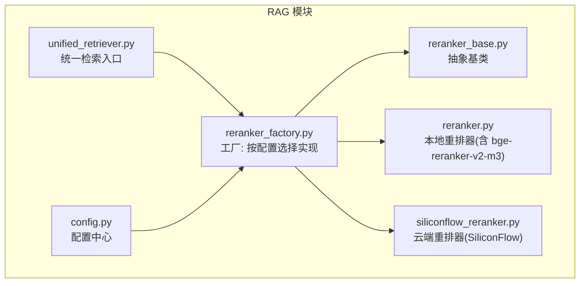
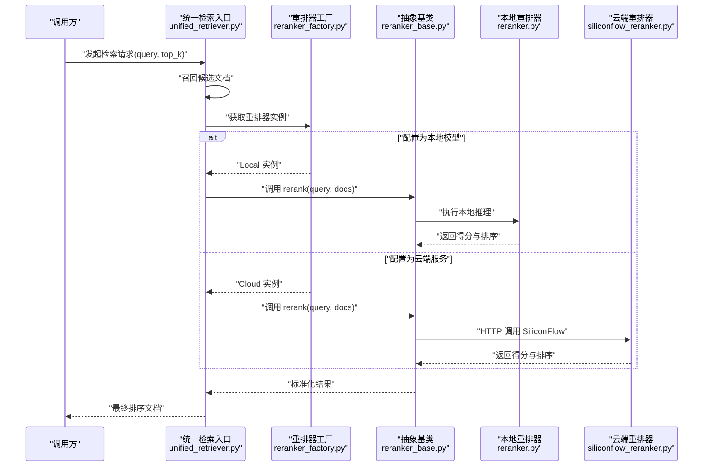
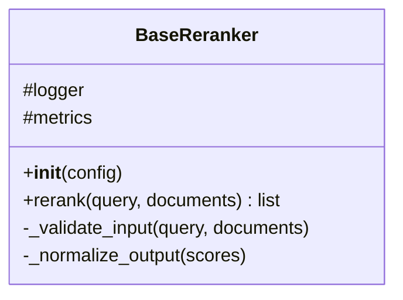
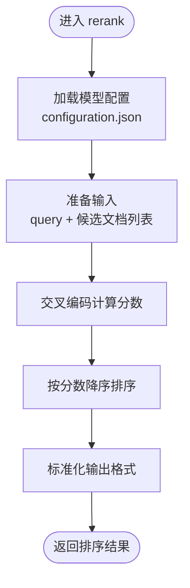
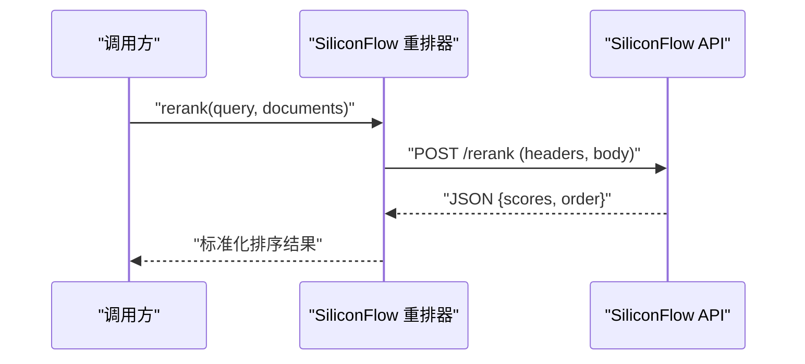
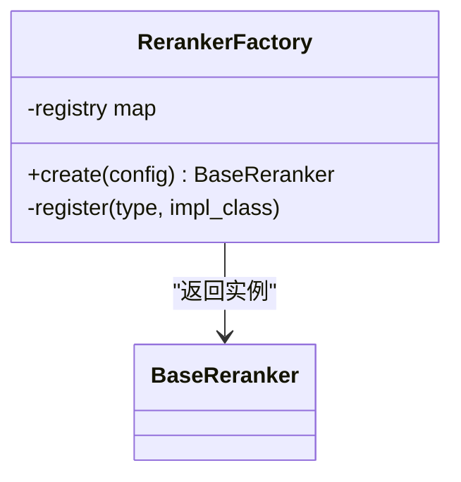
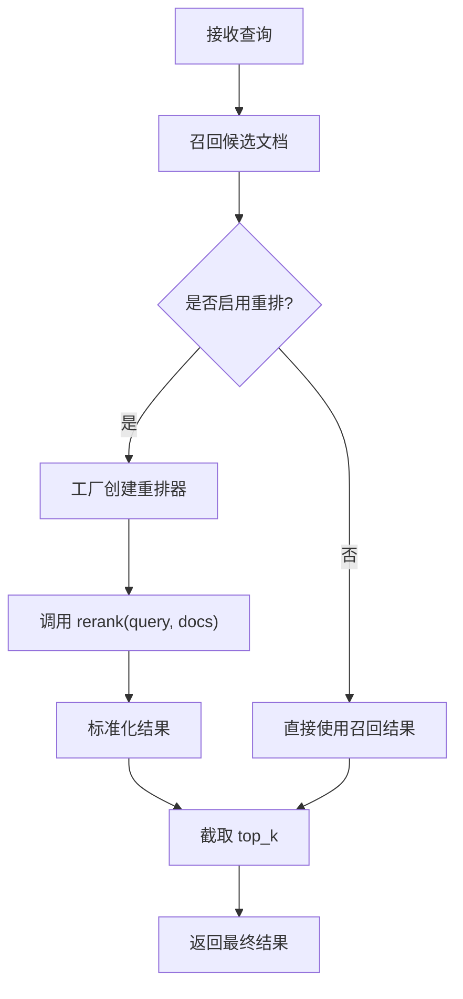
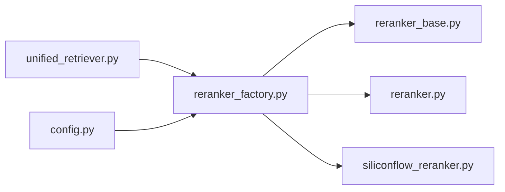

# 重排系统

<cite>
**本文引用的文件**   
- [reranker.py](file://backend_design/nexus/rag/reranker.py)
- [reranker_base.py](file://backend_design/nexus/rag/reranker_base.py)
- [reranker_factory.py](file://backend_design/nexus/rag/reranker_factory.py)
- [siliconflow_reranker.py](file://backend_design/nexus/rag/siliconflow_reranker.py)
- [unified_retriever.py](file://backend_design/nexus/rag/unified_retriever.py)
- [config.py](file://backend_design/nexus/config.py)
- [bge-reranker-v2-m3 README.md](file://models/reranker/bge-reranker-v2-m3/README.md)
- [bge-reranker-v2-m3 configuration.json](file://models/reranker/bge-reranker-v2-m3/configuration.json)
</cite>

## 目录
1. [简介](#简介)
2. [项目结构](#项目结构)
3. [核心组件](#核心组件)
4. [架构总览](#架构总览)
5. [详细组件分析](#详细组件分析)
6. [依赖关系分析](#依赖关系分析)
7. [性能与优化](#性能与优化)
8. [故障排查指南](#故障排查指南)
9. [结论](#结论)
10. [附录：配置与示例](#附录配置与示例)

## 简介
本章节面向 NexusCockpit 的重排（Rerank）子系统，聚焦以下目标：
- 解释 bge-reranker-v2-m3 本地模型的集成方式与使用要点
- 说明 SiliconFlow 云服务重排接口的调用流程与参数约定
- 阐述 BaseReranker 抽象类的设计模式、RerankerFactory 工厂模式的实现以及多模型切换机制
- 给出重排质量评估指标、响应时间优化策略与错误处理方案
- 提供可操作的配置示例，展示如何替换不同重排器并优化效果

## 项目结构
重排相关代码位于后端 RAG 模块中，关键文件如下：
- reranker_base.py：定义重排器抽象基类与通用接口
- reranker.py：默认或本地重排器实现（例如基于 bge-reranker-v2-m3）
- siliconflow_reranker.py：SiliconFlow 云重排服务客户端
- reranker_factory.py：重排器工厂，负责按配置创建具体实例
- unified_retriever.py：检索管线统一入口，串联召回与重排阶段
- config.py：全局配置加载与键值管理

图表来源
- [reranker_base.py](file://backend_design/nexus/rag/reranker_base.py)
- [reranker.py](file://backend_design/nexus/rag/reranker.py)
- [siliconflow_reranker.py](file://backend_design/nexus/rag/siliconflow_reranker.py)
- [reranker_factory.py](file://backend_design/nexus/rag/reranker_factory.py)
- [unified_retriever.py](file://backend_design/nexus/rag/unified_retriever.py)
- [config.py](file://backend_design/nexus/config.py)

章节来源
- [reranker_base.py](file://backend_design/nexus/rag/reranker_base.py)
- [reranker.py](file://backend_design/nexus/rag/reranker.py)
- [siliconflow_reranker.py](file://backend_design/nexus/rag/siliconflow_reranker.py)
- [reranker_factory.py](file://backend_design/nexus/rag/reranker_factory.py)
- [unified_retriever.py](file://backend_design/nexus/rag/unified_retriever.py)
- [config.py](file://backend_design/nexus/config.py)

## 核心组件
- BaseReranker 抽象类
  - 职责：定义统一的 rerank(query, documents) 接口、公共校验与日志埋点位置、返回结构约定（文档索引与分数）。
  - 设计要点：通过子类化扩展不同实现；在基类中封装输入规范化、异常包装与耗时统计。
- 本地重排器（reranker.py）
  - 职责：加载本地模型（如 bge-reranker-v2-m3），对候选文档进行相关性打分与排序。
  - 关键点：模型路径、分词器配置、批大小、设备选择、缓存策略等。
- 云端重排器（siliconflow_reranker.py）
  - 职责：通过 HTTP 调用 SiliconFlow 重排 API，传入 query 与候选文档列表，解析返回的评分与排序结果。
  - 关键点：鉴权头、请求体字段、超时与重试、降级回退。
- 工厂（reranker_factory.py）
  - 职责：根据配置项（如 provider/type/model_name）动态创建具体重排器实例。
  - 关键点：注册表维护、缺失配置的健壮性处理、单例/复用策略。
- 统一检索入口（unified_retriever.py）
  - 职责：协调召回与重排阶段，将召回结果交给重排器处理，输出最终排序后的文档集合。
  - 关键点：阶段开关、阈值控制、错误透传与降级。

章节来源
- [reranker_base.py](file://backend_design/nexus/rag/reranker_base.py)
- [reranker.py](file://backend_design/nexus/rag/reranker.py)
- [siliconflow_reranker.py](file://backend_design/nexus/rag/siliconflow_reranker.py)
- [reranker_factory.py](file://backend_design/nexus/rag/reranker_factory.py)
- [unified_retriever.py](file://backend_design/nexus/rag/unified_retriever.py)

## 架构总览
下图展示了从检索到重排的端到端流程，以及工厂模式如何按需注入不同的重排实现。

图表来源
- [unified_retriever.py](file://backend_design/nexus/rag/unified_retriever.py)
- [reranker_factory.py](file://backend_design/nexus/rag/reranker_factory.py)
- [reranker_base.py](file://backend_design/nexus/rag/reranker_base.py)
- [reranker.py](file://backend_design/nexus/rag/reranker.py)
- [siliconflow_reranker.py](file://backend_design/nexus/rag/siliconflow_reranker.py)

## 详细组件分析

### BaseReranker 抽象类
- 设计目标
  - 统一接口：所有重排器必须实现 rerank(query, documents) 方法。
  - 通用能力：输入校验、日志记录、耗时统计、异常包装。
  - 返回约定：返回包含文档索引与相关度分数的结构化结果。
- 典型方法
  - __init__：初始化基础资源（如日志、配置读取）。
  - rerank：抽象方法，由子类实现具体逻辑。
  - _validate_input/_normalize_output：内部工具方法，保证数据一致性。
- 复杂度与可扩展性
  - 时间复杂度取决于具体实现；基类仅做轻量预处理与后处理。
  - 新增重排器只需继承基类并实现 rerank。

图表来源
- [reranker_base.py](file://backend_design/nexus/rag/reranker_base.py)

章节来源
- [reranker_base.py](file://backend_design/nexus/rag/reranker_base.py)

### 本地重排器（bge-reranker-v2-m3）
- 模型信息
  - 模型名称：bge-reranker-v2-m3
  - 配置文件：configuration.json（用于加载模型与分词器参数）
  - 说明文档：README.md（包含用法与注意事项）
- 集成要点
  - 模型路径：指向 models/reranker/bge-reranker-v2-m3
  - 分词器：依据 tokenizer_config.json 与 special_tokens_map.json 配置
  - 推理设备：优先 GPU，回退 CPU
  - 批处理：合理设置 batch_size 以平衡吞吐与时延
- 算法原理简述
  - 采用交叉编码器思路，对 query-doc 对进行联合编码，输出相关性分数，再按分数降序排列。
- 性能建议
  - 预热模型、启用量化（若支持）、限制最大文档长度、批量合并请求。

图表来源
- [reranker.py](file://backend_design/nexus/rag/reranker.py)
- [bge-reranker-v2-m3 configuration.json](file://models/reranker/bge-reranker-v2-m3/configuration.json)
- [bge-reranker-v2-m3 README.md](file://models/reranker/bge-reranker-v2-m3/README.md)

章节来源
- [reranker.py](file://backend_design/nexus/rag/reranker.py)
- [bge-reranker-v2-m3 configuration.json](file://models/reranker/bge-reranker-v2-m3/configuration.json)
- [bge-reranker-v2-m3 README.md](file://models/reranker/bge-reranker-v2-m3/README.md)

### 云端重排器（SiliconFlow）
- 调用流程
  - 构造请求体：包含 query、documents、可选参数（如 top_n、timeout）。
  - 发送 HTTP 请求至 SiliconFlow 重排接口。
  - 解析响应：提取文档索引与分数，转换为统一格式。
- 错误处理
  - 网络异常：重试与熔断策略。
  - 业务异常：状态码检查、错误消息透传。
  - 超时：设置合理的连接与读取超时。
- 降级策略
  - 云端不可用时自动回退到本地重排器或跳过重排阶段。

图表来源
- [siliconflow_reranker.py](file://backend_design/nexus/rag/siliconflow_reranker.py)

章节来源
- [siliconflow_reranker.py](file://backend_design/nexus/rag/siliconflow_reranker.py)

### 工厂模式与多模型切换（RerankerFactory）
- 职责
  - 根据配置项（provider/type/model_name）决定创建本地或云端重排器。
  - 维护实现注册表，支持未来扩展新重排器。
- 切换机制
  - 配置驱动：修改配置即可无缝切换不同重排器。
  - 运行时检测：若某实现不可用（如模型未下载、密钥缺失），抛出明确错误以便上层降级。
- 最佳实践
  - 工厂实例尽量复用，避免重复初始化。
  - 为每个实现提供健康检查与就绪状态。

图表来源
- [reranker_factory.py](file://backend_design/nexus/rag/reranker_factory.py)
- [reranker_base.py](file://backend_design/nexus/rag/reranker_base.py)

章节来源
- [reranker_factory.py](file://backend_design/nexus/rag/reranker_factory.py)
- [reranker_base.py](file://backend_design/nexus/rag/reranker_base.py)

### 统一检索入口（unified_retriever.py）
- 职责
  - 编排召回与重排阶段，确保整体流程稳定与可观测。
  - 暴露高层 API：retrieve(query, top_k)，内部完成重排。
- 流程
  - 召回：从向量库/图存储检索候选文档。
  - 重排：通过工厂获取重排器，调用 rerank 得到最终排序。
  - 返回：截断到 top_k 并返回。

图表来源
- [unified_retriever.py](file://backend_design/nexus/rag/unified_retriever.py)
- [reranker_factory.py](file://backend_design/nexus/rag/reranker_factory.py)

章节来源
- [unified_retriever.py](file://backend_design/nexus/rag/unified_retriever.py)
- [reranker_factory.py](file://backend_design/nexus/rag/reranker_factory.py)

## 依赖关系分析
- 组件耦合
  - unified_retriever 依赖 reranker_factory 与 BaseReranker 接口。
  - 工厂依赖各具体实现（本地/云端）与配置中心。
- 外部依赖
  - 本地重排器依赖模型文件与推理框架。
  - 云端重排器依赖 HTTP 客户端与认证凭据。
- 潜在循环依赖
  - 通过工厂与抽象基类解耦，避免直接相互引用。

图表来源
- [unified_retriever.py](file://backend_design/nexus/rag/unified_retriever.py)
- [reranker_factory.py](file://backend_design/nexus/rag/reranker_factory.py)
- [reranker_base.py](file://backend_design/nexus/rag/reranker_base.py)
- [reranker.py](file://backend_design/nexus/rag/reranker.py)
- [siliconflow_reranker.py](file://backend_design/nexus/rag/siliconflow_reranker.py)
- [config.py](file://backend_design/nexus/config.py)

章节来源
- [unified_retriever.py](file://backend_design/nexus/rag/unified_retriever.py)
- [reranker_factory.py](file://backend_design/nexus/rag/reranker_factory.py)
- [reranker_base.py](file://backend_design/nexus/rag/reranker_base.py)
- [reranker.py](file://backend_design/nexus/rag/reranker.py)
- [siliconflow_reranker.py](file://backend_design/nexus/rag/siliconflow_reranker.py)
- [config.py](file://backend_design/nexus/config.py)

## 性能与优化
- 重排质量评估指标
  - NDCG@K、MRR@K、Recall@K、Precision@K：衡量排序质量与覆盖度。
  - 人工评测：领域专家对 Top-N 结果的相关性与可读性打分。
- 响应时间优化
  - 本地模型：启用批处理、模型量化、GPU 加速、结果缓存（相同 query+doc 集）。
  - 云端服务：连接池、并发控制、超时与重试策略、降级回退。
  - 流水线：召回阶段限制候选数量，减少重排压力。
- 错误处理策略
  - 网络异常：指数退避重试、熔断器保护。
  - 业务异常：明确错误码与消息，便于监控告警。
  - 降级：云端失败时自动切换到本地或跳过重排。

[本节为通用指导，不直接分析具体文件]

## 故障排查指南
- 常见问题
  - 模型未找到：检查模型路径与配置文件是否正确。
  - 云端鉴权失败：确认 API Key 与权限范围。
  - 超时：调整超时参数与重试次数。
  - 内存不足：降低 batch_size 或候选文档数量。
- 定位步骤
  - 查看日志：关注重排阶段的耗时与异常堆栈。
  - 验证配置：核对 provider/type/model_name 与对应实现一致。
  - 健康检查：工厂返回的实现是否已就绪。
  - 最小复现：使用固定 query 与少量文档进行回归测试。

章节来源
- [reranker_factory.py](file://backend_design/nexus/rag/reranker_factory.py)
- [siliconflow_reranker.py](file://backend_design/nexus/rag/siliconflow_reranker.py)
- [reranker.py](file://backend_design/nexus/rag/reranker.py)

## 结论
NexusCockpit 的重排系统通过抽象基类与工厂模式实现了良好的可扩展性与可维护性。本地 bge-reranker-v2-m3 与云端 SiliconFlow 两种实现可灵活切换，配合统一检索入口形成稳定的检索-重排流水线。通过合理的评估指标、性能优化与错误处理策略，可在保障用户体验的同时提升检索质量。

[本节为总结性内容，不直接分析具体文件]

## 附录：配置与示例
- 配置项建议
  - provider：选择 "local" 或 "siliconflow"
  - type：重排器类型标识（如 "bge-reranker-v2-m3"）
  - model_path：本地模型目录（仅 local 模式需要）
  - api_key：SiliconFlow 鉴权密钥（仅 siliconflow 模式需要）
  - timeout：请求超时秒数
  - top_k：最终返回文档数量
- 示例一：使用本地 bge-reranker-v2-m3
  - provider: "local"
  - type: "bge-reranker-v2-m3"
  - model_path: "models/reranker/bge-reranker-v2-m3"
  - top_k: 5
- 示例二：使用 SiliconFlow 云端重排
  - provider: "siliconflow"
  - type: "siliconflow"
  - api_key: "<你的密钥>"
  - timeout: 10
  - top_k: 5
- 切换与验证
  - 修改配置后重启服务或热重载配置。
  - 使用统一检索入口进行端到端验证，观察日志与指标。
  - 对比不同 provider 的 NDCG@K 与平均响应时间，选择最优方案。

章节来源
- [config.py](file://backend_design/nexus/config.py)
- [unified_retriever.py](file://backend_design/nexus/rag/unified_retriever.py)
- [reranker_factory.py](file://backend_design/nexus/rag/reranker_factory.py)
- [bge-reranker-v2-m3 README.md](file://models/reranker/bge-reranker-v2-m3/README.md)
- [bge-reranker-v2-m3 configuration.json](file://models/reranker/bge-reranker-v2-m3/configuration.json)