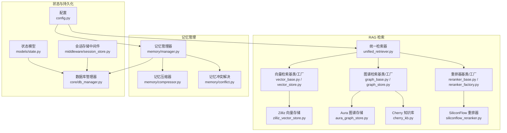
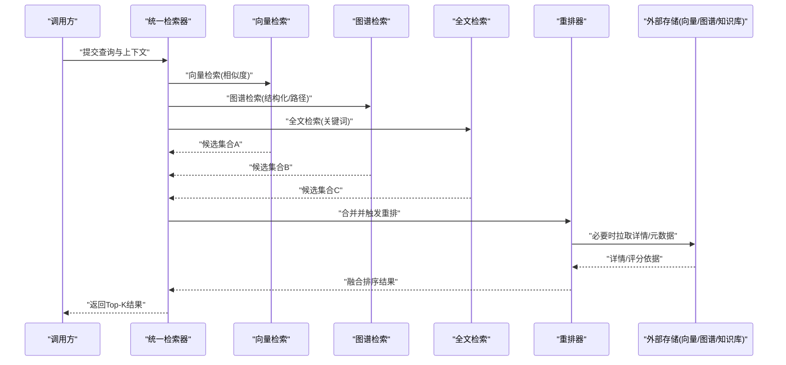
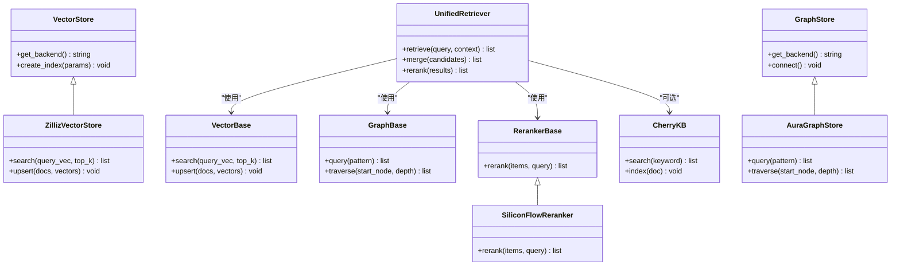
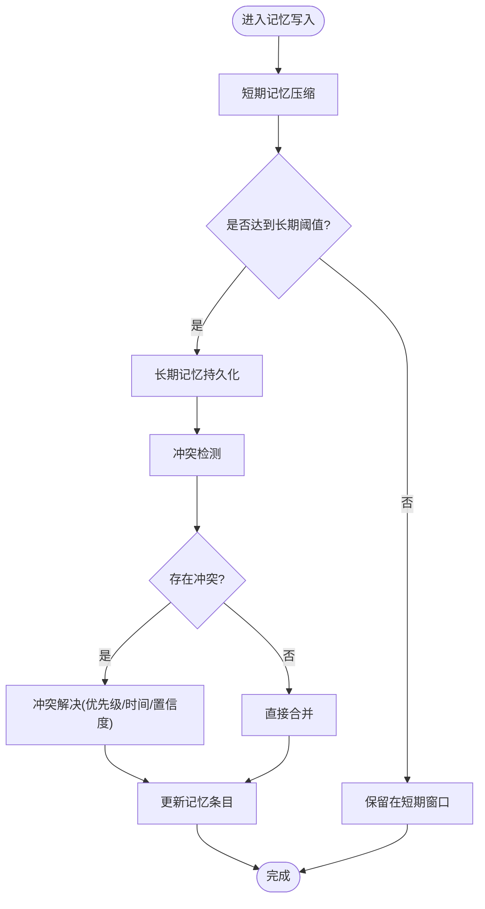
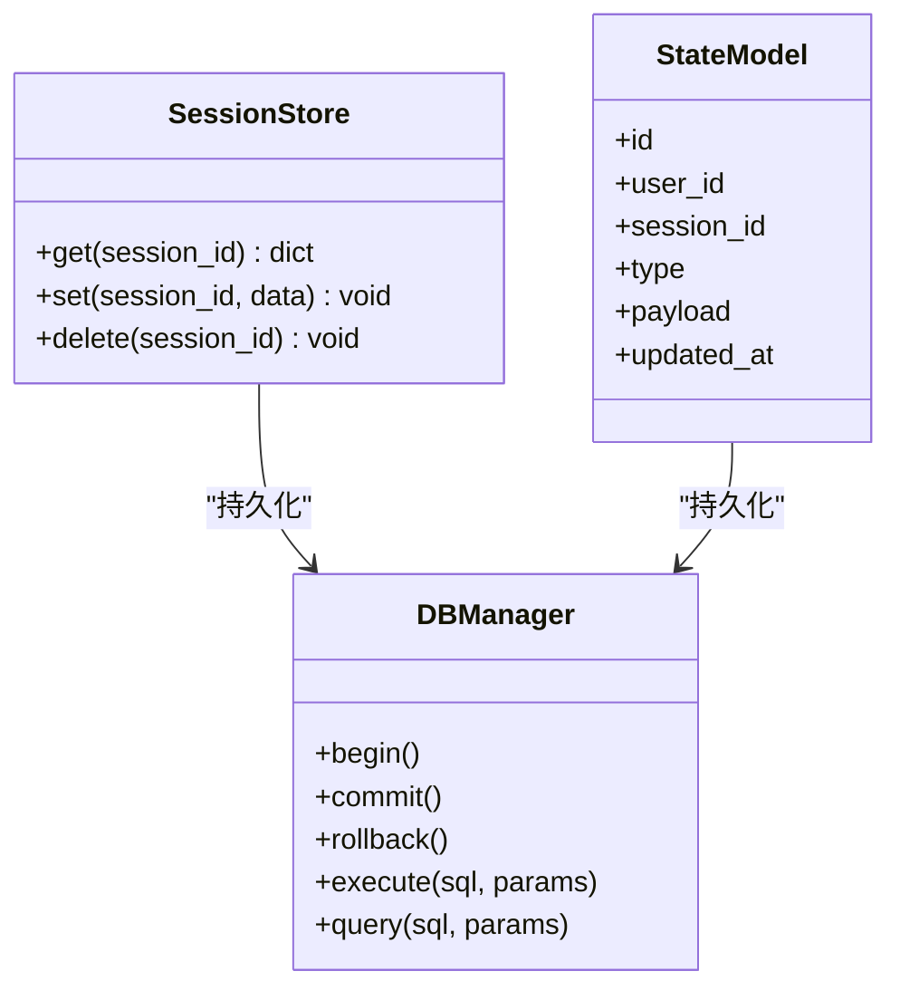
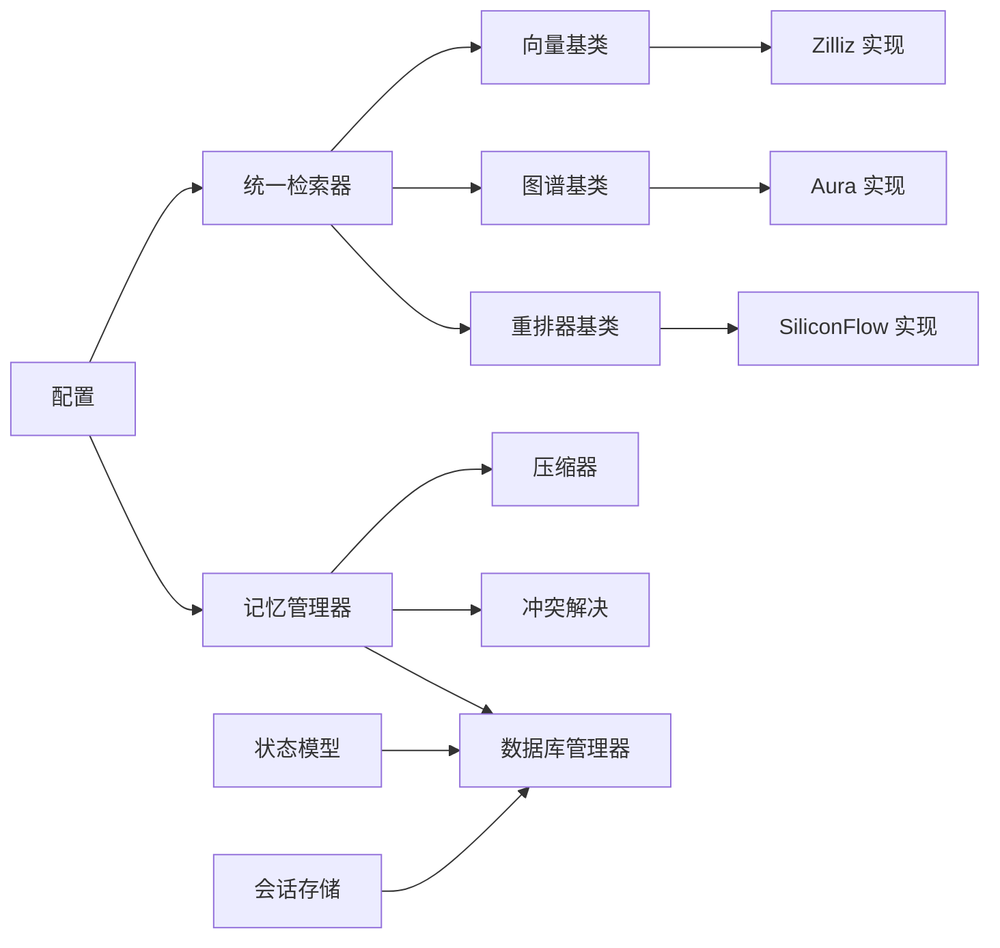
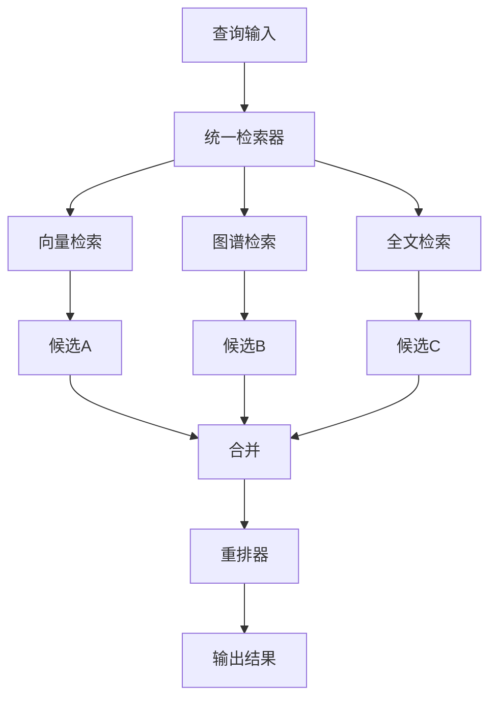
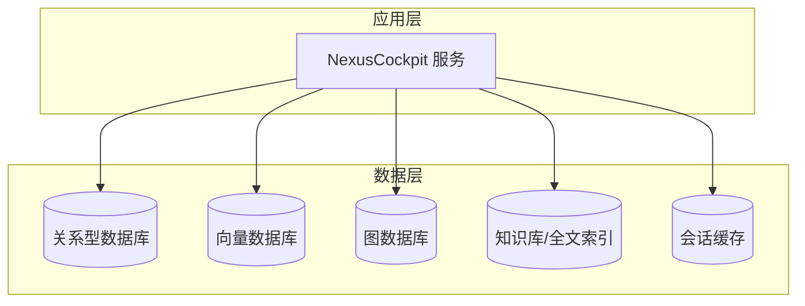

# L2 数据层

<cite>
**本文引用的文件**   
- [backend_design/nexus/rag/__init__.py](file://backend_design/nexus/rag/__init__.py)
- [backend_design/nexus/rag/unified_retriever.py](file://backend_design/nexus/rag/unified_retriever.py)
- [backend_design/nexus/rag/retriever.py](file://backend_design/nexus/rag/retriever.py)
- [backend_design/nexus/rag/vector_base.py](file://backend_design/nexus/rag/vector_base.py)
- [backend_design/nexus/rag/vector_store.py](file://backend_design/nexus/rag/vector_store.py)
- [backend_design/nexus/rag/zilliz_vector_store.py](file://backend_design/nexus/rag/zilliz_vector_store.py)
- [backend_design/nexus/rag/graph_base.py](file://backend_design/nexus/rag/graph_base.py)
- [backend_design/nexus/rag/graph_store.py](file://backend_design/nexus/rag/graph_store.py)
- [backend_design/nexus/rag/aura_graph_store.py](file://backend_design/nexus/rag/aura_graph_store.py)
- [backend_design/nexus/rag/cherry_kb.py](file://backend_design/nexus/rag/cherry_kb.py)
- [backend_design/nexus/rag/reranker_base.py](file://backend_design/nexus/rag/reranker_base.py)
- [backend_design/nexus/rag/reranker_factory.py](file://backend_design/nexus/rag/reranker_factory.py)
- [backend_design/nexus/rag/siliconflow_reranker.py](file://backend_design/nexus/rag/siliconflow_reranker.py)
- [backend_design/nexus/memory/manager.py](file://backend_design/nexus/memory/manager.py)
- [backend_design/nexus/memory/compressor.py](file://backend_design/nexus/memory/compressor.py)
- [backend_design/nexus/memory/conflict.py](file://backend_design/nexus/memory/conflict.py)
- [backend_design/nexus/models/state.py](file://backend_design/nexus/models/state.py)
- [backend_design/nexus/core/db_manager.py](file://backend_design/nexus/core/db_manager.py)
- [backend_design/nexus/middleware/session_store.py](file://backend_design/nexus/middleware/session_store.py)
- [backend_design/nexus/config.py](file://backend_design/nexus/config.py)
- [scripts/init_milvus.py](file://scripts/init_milvus.py)
- [scripts/init_neo4j.py](file://scripts/init_neo4j.py)
- [scripts/v2.1_migration.sql](file://scripts/v2.1_migration.sql)
</cite>

## 目录
1. [简介](#简介)
2. [项目结构](#项目结构)
3. [核心组件](#核心组件)
4. [架构总览](#架构总览)
5. [详细组件分析](#详细组件分析)
6. [依赖关系分析](#依赖关系分析)
7. [性能考虑](#性能考虑)
8. [故障排查指南](#故障排查指南)
9. [结论](#结论)
10. [附录](#附录)

## 简介
本章节面向 NexusCockpit 的 L2 数据层，聚焦以下目标：
- 数据存储与检索架构：GraphRAG 三路融合（向量检索 + 图谱检索 + 全文检索）
- 记忆管理系统：短期记忆压缩、长期记忆存储、冲突解决
- 状态管理机制：会话与用户状态的持久化与一致性
- 数据模型设计、索引策略、查询优化与一致性保证
- 数据流向图、存储架构图与性能调优指南
- 数据迁移方案、备份恢复策略与扩展开发接口

## 项目结构
L2 数据层主要位于 backend_design/nexus 下，围绕 RAG、记忆、模型与中间件展开。关键目录与职责如下：
- rag：检索增强生成相关实现，包含统一检索器、向量库、图谱库、重排器等
- memory：记忆管理，包括管理器、压缩器、冲突解决
- models：数据模型与状态定义
- core：数据库连接管理与核心工具
- middleware：会话存储等中间件能力
- config：配置加载与参数注入
- scripts：初始化与迁移脚本

图表来源
- [backend_design/nexus/rag/unified_retriever.py](file://backend_design/nexus/rag/unified_retriever.py)
- [backend_design/nexus/rag/vector_base.py](file://backend_design/nexus/rag/vector_base.py)
- [backend_design/nexus/rag/vector_store.py](file://backend_design/nexus/rag/vector_store.py)
- [backend_design/nexus/rag/zilliz_vector_store.py](file://backend_design/nexus/rag/zilliz_vector_store.py)
- [backend_design/nexus/rag/graph_base.py](file://backend_design/nexus/rag/graph_base.py)
- [backend_design/nexus/rag/graph_store.py](file://backend_design/nexus/rag/graph_store.py)
- [backend_design/nexus/rag/aura_graph_store.py](file://backend_design/nexus/rag/aura_graph_store.py)
- [backend_design/nexus/rag/cherry_kb.py](file://backend_design/nexus/rag/cherry_kb.py)
- [backend_design/nexus/rag/reranker_base.py](file://backend_design/nexus/rag/reranker_base.py)
- [backend_design/nexus/rag/reranker_factory.py](file://backend_design/nexus/rag/reranker_factory.py)
- [backend_design/nexus/rag/siliconflow_reranker.py](file://backend_design/nexus/rag/siliconflow_reranker.py)
- [backend_design/nexus/memory/manager.py](file://backend_design/nexus/memory/manager.py)
- [backend_design/nexus/memory/compressor.py](file://backend_design/nexus/memory/compressor.py)
- [backend_design/nexus/memory/conflict.py](file://backend_design/nexus/memory/conflict.py)
- [backend_design/nexus/models/state.py](file://backend_design/nexus/models/state.py)
- [backend_design/nexus/core/db_manager.py](file://backend_design/nexus/core/db_manager.py)
- [backend_design/nexus/middleware/session_store.py](file://backend_design/nexus/middleware/session_store.py)
- [backend_design/nexus/config.py](file://backend_design/nexus/config.py)

章节来源
- [backend_design/nexus/rag/__init__.py](file://backend_design/nexus/rag/__init__.py)
- [backend_design/nexus/config.py](file://backend_design/nexus/config.py)

## 核心组件
- 统一检索器：聚合向量、图谱、全文三类检索结果，并进行重排与融合
- 向量检索：基于向量相似度匹配，支持多后端（如 Zilliz）
- 图谱检索：基于知识图谱的结构化查询与路径发现
- 全文检索：通过知识库或倒排索引进行关键词匹配
- 重排器：对候选结果进行二次排序与打分
- 记忆管理器：维护短期与长期记忆，提供压缩与冲突解决
- 状态模型：定义系统运行态与用户态的数据结构
- 数据库管理器：封装持久化访问与事务控制
- 会话存储：跨请求的状态保持与缓存

章节来源
- [backend_design/nexus/rag/unified_retriever.py](file://backend_design/nexus/rag/unified_retriever.py)
- [backend_design/nexus/rag/retriever.py](file://backend_design/nexus/rag/retriever.py)
- [backend_design/nexus/memory/manager.py](file://backend_design/nexus/memory/manager.py)
- [backend_design/nexus/models/state.py](file://backend_design/nexus/models/state.py)
- [backend_design/nexus/core/db_manager.py](file://backend_design/nexus/core/db_manager.py)
- [backend_design/nexus/middleware/session_store.py](file://backend_design/nexus/middleware/session_store.py)

## 架构总览
下图展示 GraphRAG 三路融合的整体流程：输入查询经统一检索器分发至向量、图谱、全文检索通道，各自返回候选集后由重排器进行融合排序，最终输出给上层业务。

图表来源
- [backend_design/nexus/rag/unified_retriever.py](file://backend_design/nexus/rag/unified_retriever.py)
- [backend_design/nexus/rag/vector_base.py](file://backend_design/nexus/rag/vector_base.py)
- [backend_design/nexus/rag/graph_base.py](file://backend_design/nexus/rag/graph_base.py)
- [backend_design/nexus/rag/cherry_kb.py](file://backend_design/nexus/rag/cherry_kb.py)
- [backend_design/nexus/rag/reranker_base.py](file://backend_design/nexus/rag/reranker_base.py)

## 详细组件分析

### GraphRAG 检索系统（向量+图谱+全文）
- 统一检索器负责路由与结果融合，支持可插拔的向量/图谱/全文后端
- 向量检索抽象了不同向量库的接入方式，当前提供 Zilliz 实现
- 图谱检索抽象了不同图数据库的接入方式，当前提供 Aura 实现；同时支持 Cherry 知识库作为补充
- 重排器提供通用接口与具体实现（如 SiliconFlow），用于提升召回质量

图表来源
- [backend_design/nexus/rag/unified_retriever.py](file://backend_design/nexus/rag/unified_retriever.py)
- [backend_design/nexus/rag/vector_base.py](file://backend_design/nexus/rag/vector_base.py)
- [backend_design/nexus/rag/vector_store.py](file://backend_design/nexus/rag/vector_store.py)
- [backend_design/nexus/rag/zilliz_vector_store.py](file://backend_design/nexus/rag/zilliz_vector_store.py)
- [backend_design/nexus/rag/graph_base.py](file://backend_design/nexus/rag/graph_base.py)
- [backend_design/nexus/rag/graph_store.py](file://backend_design/nexus/rag/graph_store.py)
- [backend_design/nexus/rag/aura_graph_store.py](file://backend_design/nexus/rag/aura_graph_store.py)
- [backend_design/nexus/rag/cherry_kb.py](file://backend_design/nexus/rag/cherry_kb.py)
- [backend_design/nexus/rag/reranker_base.py](file://backend_design/nexus/rag/reranker_base.py)
- [backend_design/nexus/rag/reranker_factory.py](file://backend_design/nexus/rag/reranker_factory.py)
- [backend_design/nexus/rag/siliconflow_reranker.py](file://backend_design/nexus/rag/siliconflow_reranker.py)

章节来源
- [backend_design/nexus/rag/unified_retriever.py](file://backend_design/nexus/rag/unified_retriever.py)
- [backend_design/nexus/rag/vector_base.py](file://backend_design/nexus/rag/vector_base.py)
- [backend_design/nexus/rag/vector_store.py](file://backend_design/nexus/rag/vector_store.py)
- [backend_design/nexus/rag/zilliz_vector_store.py](file://backend_design/nexus/rag/zilliz_vector_store.py)
- [backend_design/nexus/rag/graph_base.py](file://backend_design/nexus/rag/graph_base.py)
- [backend_design/nexus/rag/graph_store.py](file://backend_design/nexus/rag/graph_store.py)
- [backend_design/nexus/rag/aura_graph_store.py](file://backend_design/nexus/rag/aura_graph_store.py)
- [backend_design/nexus/rag/cherry_kb.py](file://backend_design/nexus/rag/cherry_kb.py)
- [backend_design/nexus/rag/reranker_base.py](file://backend_design/nexus/rag/reranker_base.py)
- [backend_design/nexus/rag/reranker_factory.py](file://backend_design/nexus/rag/reranker_factory.py)
- [backend_design/nexus/rag/siliconflow_reranker.py](file://backend_design/nexus/rag/siliconflow_reranker.py)

### 记忆管理系统（短期压缩、长期存储、冲突解决）
- 短期记忆压缩：将近期对话片段进行摘要与去冗余，降低上下文长度与成本
- 长期记忆存储：将重要事实、偏好、历史事件持久化到数据库或外部存储
- 冲突解决：当新信息与旧记忆不一致时，采用优先级、时间衰减、置信度等策略进行合并

图表来源
- [backend_design/nexus/memory/manager.py](file://backend_design/nexus/memory/manager.py)
- [backend_design/nexus/memory/compressor.py](file://backend_design/nexus/memory/compressor.py)
- [backend_design/nexus/memory/conflict.py](file://backend_design/nexus/memory/conflict.py)

章节来源
- [backend_design/nexus/memory/manager.py](file://backend_design/nexus/memory/manager.py)
- [backend_design/nexus/memory/compressor.py](file://backend_design/nexus/memory/compressor.py)
- [backend_design/nexus/memory/conflict.py](file://backend_design/nexus/memory/conflict.py)

### 状态管理机制
- 状态模型：定义会话、用户、任务等核心实体及其字段
- 持久化：通过数据库管理器进行读写，确保事务性与一致性
- 会话存储：中间件层提供跨请求的状态保持，支持缓存与回源

图表来源
- [backend_design/nexus/models/state.py](file://backend_design/nexus/models/state.py)
- [backend_design/nexus/core/db_manager.py](file://backend_design/nexus/core/db_manager.py)
- [backend_design/nexus/middleware/session_store.py](file://backend_design/nexus/middleware/session_store.py)

章节来源
- [backend_design/nexus/models/state.py](file://backend_design/nexus/models/state.py)
- [backend_design/nexus/core/db_manager.py](file://backend_design/nexus/core/db_manager.py)
- [backend_design/nexus/middleware/session_store.py](file://backend_design/nexus/middleware/session_store.py)

## 依赖关系分析
- 统一检索器依赖向量、图谱、全文与重排器模块，形成松耦合的可插拔架构
- 记忆管理器依赖压缩器与冲突解决器，并通过数据库管理器进行持久化
- 状态模型与数据库管理器强耦合，会话存储中间件依赖数据库管理器
- 配置模块为各组件提供运行时参数

图表来源
- [backend_design/nexus/rag/unified_retriever.py](file://backend_design/nexus/rag/unified_retriever.py)
- [backend_design/nexus/rag/vector_base.py](file://backend_design/nexus/rag/vector_base.py)
- [backend_design/nexus/rag/zilliz_vector_store.py](file://backend_design/nexus/rag/zilliz_vector_store.py)
- [backend_design/nexus/rag/graph_base.py](file://backend_design/nexus/rag/graph_base.py)
- [backend_design/nexus/rag/aura_graph_store.py](file://backend_design/nexus/rag/aura_graph_store.py)
- [backend_design/nexus/rag/reranker_base.py](file://backend_design/nexus/rag/reranker_base.py)
- [backend_design/nexus/rag/siliconflow_reranker.py](file://backend_design/nexus/rag/siliconflow_reranker.py)
- [backend_design/nexus/memory/manager.py](file://backend_design/nexus/memory/manager.py)
- [backend_design/nexus/memory/compressor.py](file://backend_design/nexus/memory/compressor.py)
- [backend_design/nexus/memory/conflict.py](file://backend_design/nexus/memory/conflict.py)
- [backend_design/nexus/core/db_manager.py](file://backend_design/nexus/core/db_manager.py)
- [backend_design/nexus/middleware/session_store.py](file://backend_design/nexus/middleware/session_store.py)
- [backend_design/nexus/config.py](file://backend_design/nexus/config.py)

章节来源
- [backend_design/nexus/rag/unified_retriever.py](file://backend_design/nexus/rag/unified_retriever.py)
- [backend_design/nexus/memory/manager.py](file://backend_design/nexus/memory/manager.py)
- [backend_design/nexus/core/db_manager.py](file://backend_design/nexus/core/db_manager.py)
- [backend_design/nexus/config.py](file://backend_design/nexus/config.py)

## 性能考虑
- 向量检索
  - 合理设置 top_k 与相似度阈值，避免过度召回
  - 批量 upsert 与分片索引可降低写入放大
  - 使用近似最近邻算法与维度降维减少计算开销
- 图谱检索
  - 限制遍历深度与分支因子，防止组合爆炸
  - 预构建热点路径与索引，加速常用查询
- 全文检索
  - 使用倒排索引与词频过滤，减少无关文档
  - 对长文本进行分块与去噪，提高召回精度
- 重排器
  - 选择轻量级重排模型，或在批处理中并行执行
  - 对低置信度结果进行早停，减少无效计算
- 记忆管理
  - 短期窗口大小与压缩频率需平衡延迟与成本
  - 长期记忆按主题与时间分区，便于冷热分离
- 状态与持久化
  - 使用事务与幂等写入，避免重复更新
  - 会话缓存命中优先，未命中再回源数据库

[本节为通用性能建议，不直接分析具体文件]

## 故障排查指南
- 检索失败
  - 检查向量/图谱/全文后端连通性与认证信息
  - 确认索引已初始化且数据已同步
- 重排异常
  - 验证重排器配置与模型可用性
  - 检查输入格式与字段完整性
- 记忆写入错误
  - 查看压缩器日志与冲突解决策略
  - 确认数据库连接与权限
- 状态不一致
  - 检查事务边界与回滚逻辑
  - 核对会话存储与数据库的一致性

章节来源
- [backend_design/nexus/core/db_manager.py](file://backend_design/nexus/core/db_manager.py)
- [backend_design/nexus/middleware/session_store.py](file://backend_design/nexus/middleware/session_store.py)
- [backend_design/nexus/rag/reranker_base.py](file://backend_design/nexus/rag/reranker_base.py)
- [backend_design/nexus/rag/siliconflow_reranker.py](file://backend_design/nexus/rag/siliconflow_reranker.py)
- [backend_design/nexus/memory/manager.py](file://backend_design/nexus/memory/manager.py)
- [backend_design/nexus/memory/compressor.py](file://backend_design/nexus/memory/compressor.py)
- [backend_design/nexus/memory/conflict.py](file://backend_design/nexus/memory/conflict.py)

## 结论
L2 数据层以 GraphRAG 为核心，结合记忆管理与状态机制，构建了高可用、可扩展的数据基础设施。通过统一检索器与可插拔后端，系统在召回质量与性能之间取得良好平衡；记忆与状态模块保障了个性化与一致性。配合完善的迁移与运维脚本，系统具备良好的演进能力。

[本节为总结性内容，不直接分析具体文件]

## 附录

### 数据流向图

图表来源
- [backend_design/nexus/rag/unified_retriever.py](file://backend_design/nexus/rag/unified_retriever.py)
- [backend_design/nexus/rag/vector_base.py](file://backend_design/nexus/rag/vector_base.py)
- [backend_design/nexus/rag/graph_base.py](file://backend_design/nexus/rag/graph_base.py)
- [backend_design/nexus/rag/cherry_kb.py](file://backend_design/nexus/rag/cherry_kb.py)
- [backend_design/nexus/rag/reranker_base.py](file://backend_design/nexus/rag/reranker_base.py)

### 存储架构图

图表来源
- [backend_design/nexus/core/db_manager.py](file://backend_design/nexus/core/db_manager.py)
- [backend_design/nexus/rag/zilliz_vector_store.py](file://backend_design/nexus/rag/zilliz_vector_store.py)
- [backend_design/nexus/rag/aura_graph_store.py](file://backend_design/nexus/rag/aura_graph_store.py)
- [backend_design/nexus/rag/cherry_kb.py](file://backend_design/nexus/rag/cherry_kb.py)
- [backend_design/nexus/middleware/session_store.py](file://backend_design/nexus/middleware/session_store.py)

### 数据迁移方案
- 版本迁移脚本：v2.1 迁移 SQL 用于表结构与初始数据变更
- 向量库初始化：Milvus 初始化脚本用于创建集合与索引
- 图数据库初始化：Neo4j 初始化脚本用于创建节点与关系

章节来源
- [scripts/v2.1_migration.sql](file://scripts/v2.1_migration.sql)
- [scripts/init_milvus.py](file://scripts/init_milvus.py)
- [scripts/init_neo4j.py](file://scripts/init_neo4j.py)

### 备份恢复策略
- 关系型数据库：定期全量快照 + 增量 WAL 归档，恢复时先全量后回放增量
- 向量数据库：导出集合元数据与向量分片，离线重建索引
- 图数据库：导出图快照与属性，恢复后校验连通性与约束
- 会话缓存：热备与冷备结合，主从切换时快速漂移

[本节为通用运维建议，不直接分析具体文件]

### 扩展开发接口
- 新增向量后端：实现向量基类接口并在工厂注册
- 新增图谱后端：实现图谱基类接口并在工厂注册
- 新增重排器：实现重排器基类接口并在工厂注册
- 记忆策略扩展：在压缩器与冲突解决器中添加新规则
- 状态模型扩展：在状态模型中增加字段并在迁移脚本中声明变更

章节来源
- [backend_design/nexus/rag/vector_base.py](file://backend_design/nexus/rag/vector_base.py)
- [backend_design/nexus/rag/vector_store.py](file://backend_design/nexus/rag/vector_store.py)
- [backend_design/nexus/rag/graph_base.py](file://backend_design/nexus/rag/graph_base.py)
- [backend_design/nexus/rag/graph_store.py](file://backend_design/nexus/rag/graph_store.py)
- [backend_design/nexus/rag/reranker_base.py](file://backend_design/nexus/rag/reranker_base.py)
- [backend_design/nexus/rag/reranker_factory.py](file://backend_design/nexus/rag/reranker_factory.py)
- [backend_design/nexus/memory/compressor.py](file://backend_design/nexus/memory/compressor.py)
- [backend_design/nexus/memory/conflict.py](file://backend_design/nexus/memory/conflict.py)
- [backend_design/nexus/models/state.py](file://backend_design/nexus/models/state.py)
- [scripts/v2.1_migration.sql](file://scripts/v2.1_migration.sql)