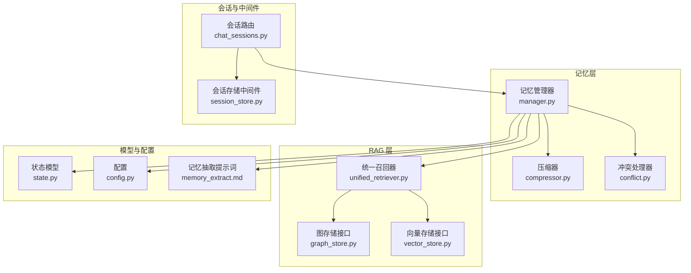
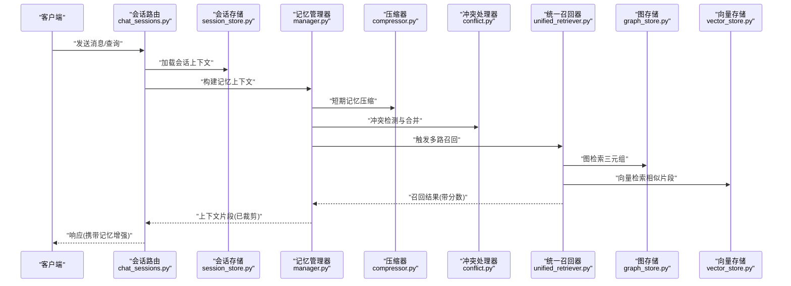
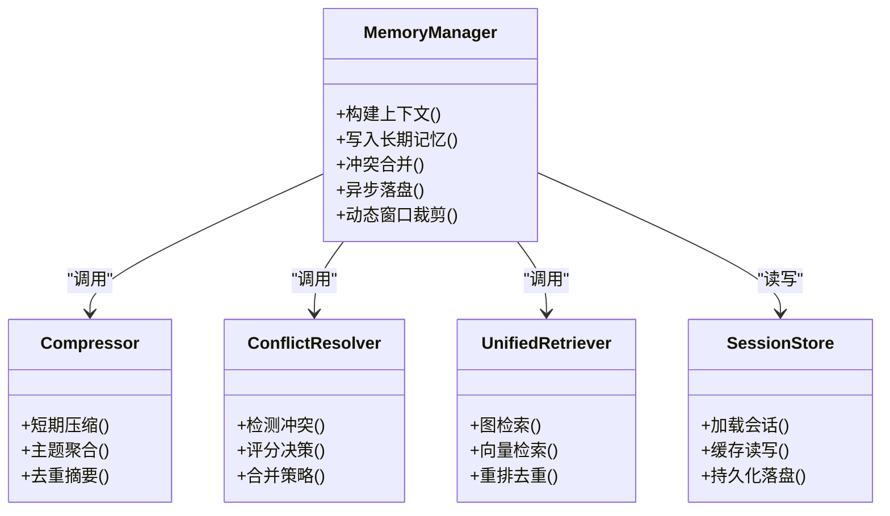
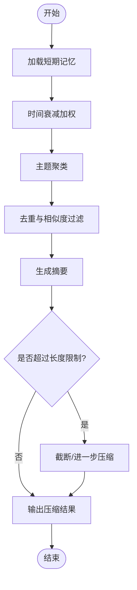
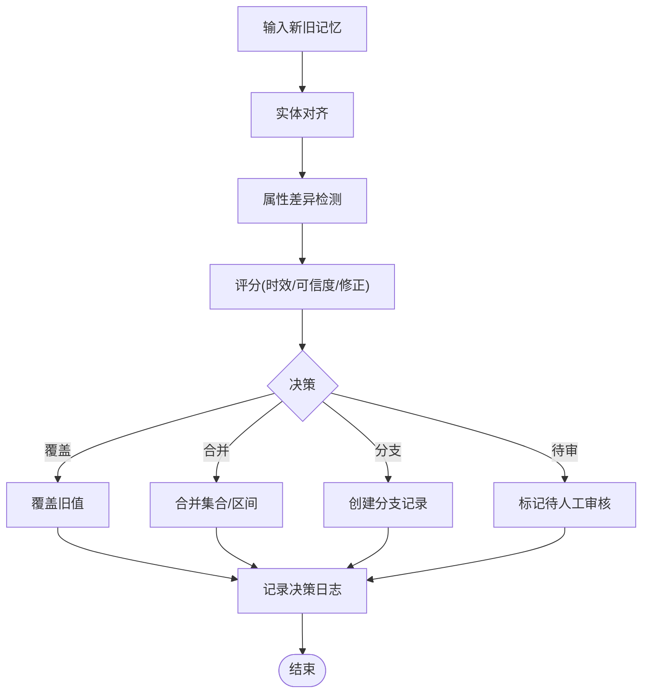
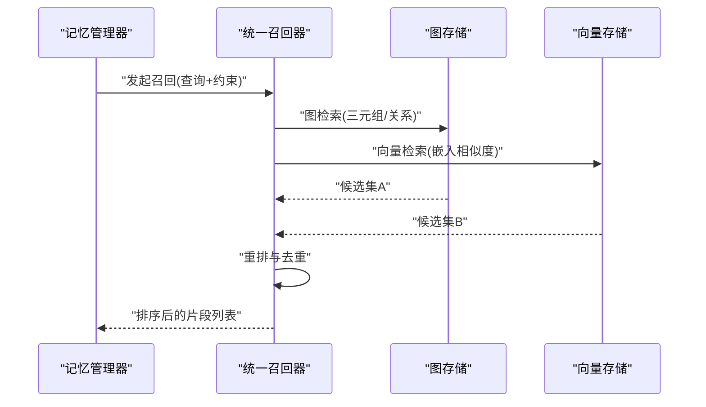
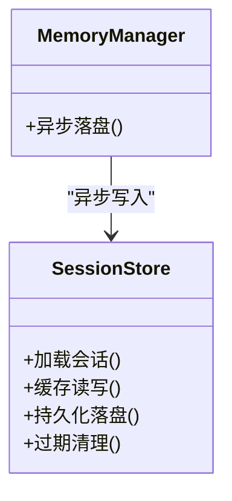
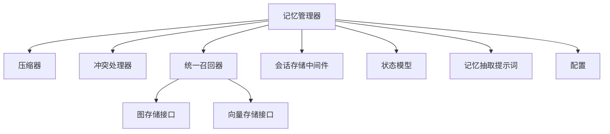

# 记忆管理系统

<cite>
**本文引用的文件**   
- [backend_design/nexus/memory/manager.py](file://backend_design/nexus/memory/manager.py)
- [backend_design/nexus/memory/compressor.py](file://backend_design/nexus/memory/compressor.py)
- [backend_design/nexus/memory/conflict.py](file://backend_design/nexus/memory/conflict.py)
- [backend_design/nexus/core/personalization.py](file://backend_design/nexus/core/personalization.py)
- [backend_design/nexus/models/state.py](file://backend_design/nexus/models/state.py)
- [backend_design/nexus/prompts/memory_extract.md](file://backend_design/nexus/prompts/memory_extract.md)
- [backend_design/nexus/api/routes/chat_sessions.py](file://backend_design/nexus/api/routes/chat_sessions.py)
- [backend_design/nexus/middleware/session_store.py](file://backend_design/nexus/middleware/session_store.py)
- [backend_design/nexus/rag/unified_retriever.py](file://backend_design/nexus/rag/unified_retriever.py)
- [backend_design/nexus/rag/graph_store.py](file://backend_design/nexus/rag/graph_store.py)
- [backend_design/nexus/rag/vector_store.py](file://backend_design/nexus/rag/vector_store.py)
- [backend_design/nexus/config.py](file://backend_design/nexus/config.py)
- [backend_design/tests/test_v21.py](file://backend_design/tests/test_v21.py)
</cite>

## 目录
1. [简介](#简介)
2. [项目结构](#项目结构)
3. [核心组件](#核心组件)
4. [架构总览](#架构总览)
5. [详细组件分析](#详细组件分析)
6. [依赖关系分析](#依赖关系分析)
7. [性能考量](#性能考量)
8. [故障排查指南](#故障排查指南)
9. [结论](#结论)
10. [附录](#附录)

## 简介
本文件为 NexusCockpit 的记忆管理系统提供系统化、可落地的技术文档。内容覆盖用户记忆架构设计（短期记忆压缩、长期记忆存储、冲突检测与解决）、v2.1 版本的渐进式披露策略、异步非阻塞存储、用户习惯注入，以及上下文压缩算法、Token 精确计数、动态上下文窗口管理。同时给出记忆召回流程、三元组提取与存储、对话历史管理等核心功能的实现细节与使用示例路径。

## 项目结构
记忆系统位于后端模块 backend_design/nexus/memory 下，并与 RAG、会话中间件、模型状态、提示词模板等模块协同工作：
- memory：记忆生命周期管理与压缩、冲突处理
- rag：图/向量检索与统一召回
- middleware：会话持久化与缓存
- models：会话与记忆状态模型
- prompts：记忆抽取提示词模板
- api：会话相关接口
- config：配置项（含 v2.1 开关）
- tests：v2.1 行为验证用例

图表来源
- [backend_design/nexus/memory/manager.py](file://backend_design/nexus/memory/manager.py)
- [backend_design/nexus/memory/compressor.py](file://backend_design/nexus/memory/compressor.py)
- [backend_design/nexus/memory/conflict.py](file://backend_design/nexus/memory/conflict.py)
- [backend_design/nexus/rag/unified_retriever.py](file://backend_design/nexus/rag/unified_retriever.py)
- [backend_design/nexus/rag/graph_store.py](file://backend_design/nexus/rag/graph_store.py)
- [backend_design/nexus/rag/vector_store.py](file://backend_design/nexus/rag/vector_store.py)
- [backend_design/nexus/middleware/session_store.py](file://backend_design/nexus/middleware/session_store.py)
- [backend_design/nexus/api/routes/chat_sessions.py](file://backend_design/nexus/api/routes/chat_sessions.py)
- [backend_design/nexus/models/state.py](file://backend_design/nexus/models/state.py)
- [backend_design/nexus/prompts/memory_extract.md](file://backend_design/nexus/prompts/memory_extract.md)
- [backend_design/nexus/config.py](file://backend_design/nexus/config.py)

章节来源
- [backend_design/nexus/memory/manager.py](file://backend_design/nexus/memory/manager.py)
- [backend_design/nexus/memory/compressor.py](file://backend_design/nexus/memory/compressor.py)
- [backend_design/nexus/memory/conflict.py](file://backend_design/nexus/memory/conflict.py)
- [backend_design/nexus/rag/unified_retriever.py](file://backend_design/nexus/rag/unified_retriever.py)
- [backend_design/nexus/rag/graph_store.py](file://backend_design/nexus/rag/graph_store.py)
- [backend_design/nexus/rag/vector_store.py](file://backend_design/nexus/rag/vector_store.py)
- [backend_design/nexus/middleware/session_store.py](file://backend_design/nexus/middleware/session_store.py)
- [backend_design/nexus/api/routes/chat_sessions.py](file://backend_design/nexus/api/routes/chat_sessions.py)
- [backend_design/nexus/models/state.py](file://backend_design/nexus/models/state.py)
- [backend_design/nexus/prompts/memory_extract.md](file://backend_design/nexus/prompts/memory_extract.md)
- [backend_design/nexus/config.py](file://backend_design/nexus/config.py)

## 核心组件
- 记忆管理器（MemoryManager）
  - 职责：编排短期记忆压缩、长期记忆写入、冲突检测与合并、上下文构建与裁剪、异步落盘。
  - 关键能力：
    - 短期记忆压缩：按时间衰减、主题聚类、去重与摘要，控制输出长度。
    - 长期记忆存储：以三元组形式持久化到图数据库，并生成向量索引用于语义检索。
    - 冲突检测与解决：基于实体对齐、属性对比、置信度与时效性进行合并或保留分支。
    - 上下文窗口管理：结合 Token 精确计数与动态窗口策略，保证 LLM 输入稳定可控。
    - 渐进式披露（v2.1）：根据用户偏好与场景逐步暴露记忆片段，避免信息过载。
    - 异步非阻塞存储：将写操作放入任务队列，主链路保持低延迟。
    - 用户习惯注入：从个性化服务读取习惯标签，影响记忆权重与召回排序。

- 压缩器（Compressor）
  - 职责：对短期记忆进行压缩与摘要，维护“活跃记忆”的紧凑表示。
  - 关键能力：
    - 滑动窗口与时间衰减
    - 主题聚合与冗余消除
    - 摘要生成与长度约束

- 冲突处理器（ConflictResolver）
  - 职责：在新增记忆与已有知识发生冲突时，判定优先级、合并策略与版本分支。
  - 关键能力：
    - 实体匹配与属性差异检测
    - 规则与启发式评分（时效、来源可信度、用户显式修正）
    - 冲突日志与可回滚

- 统一召回器（UnifiedRetriever）
  - 职责：融合图检索与向量检索结果，返回与当前上下文相关的记忆片段。
  - 关键能力：
    - 多路召回与重排
    - 相关性打分与去重
    - 与上下文窗口的适配裁剪

- 会话存储中间件（SessionStore）
  - 职责：会话级状态的读写、缓存与持久化，支撑异步写入与快速读取。
  - 关键能力：
    - 内存缓存 + 持久化双写
    - 幂等写入与重试
    - 会话隔离与过期清理

- 状态模型（State）
  - 职责：定义会话状态、记忆元数据、上下文窗口参数与 v2.1 特性开关。
  - 关键能力：
    - 结构化字段描述
    - 校验与默认值
    - 迁移兼容

- 记忆抽取提示词（memory_extract.md）
  - 职责：指导 LLM 从对话中抽取三元组（主体-谓词-客体）及置信度、时间戳等元数据。

章节来源
- [backend_design/nexus/memory/manager.py](file://backend_design/nexus/memory/manager.py)
- [backend_design/nexus/memory/compressor.py](file://backend_design/nexus/memory/compressor.py)
- [backend_design/nexus/memory/conflict.py](file://backend_design/nexus/memory/conflict.py)
- [backend_design/nexus/rag/unified_retriever.py](file://backend_design/nexus/rag/unified_retriever.py)
- [backend_design/nexus/middleware/session_store.py](file://backend_design/nexus/middleware/session_store.py)
- [backend_design/nexus/models/state.py](file://backend_design/nexus/models/state.py)
- [backend_design/nexus/prompts/memory_extract.md](file://backend_design/nexus/prompts/memory_extract.md)

## 架构总览
下图展示一次对话请求在记忆系统中的端到端流程：从会话路由进入，经过记忆管理器协调压缩、冲突处理、RAG 召回与上下文构建，最终返回给上层服务。

图表来源
- [backend_design/nexus/api/routes/chat_sessions.py](file://backend_design/nexus/api/routes/chat_sessions.py)
- [backend_design/nexus/middleware/session_store.py](file://backend_design/nexus/middleware/session_store.py)
- [backend_design/nexus/memory/manager.py](file://backend_design/nexus/memory/manager.py)
- [backend_design/nexus/memory/compressor.py](file://backend_design/nexus/memory/compressor.py)
- [backend_design/nexus/memory/conflict.py](file://backend_design/nexus/memory/conflict.py)
- [backend_design/nexus/rag/unified_retriever.py](file://backend_design/nexus/rag/unified_retriever.py)
- [backend_design/nexus/rag/graph_store.py](file://backend_design/nexus/rag/graph_store.py)
- [backend_design/nexus/rag/vector_store.py](file://backend_design/nexus/rag/vector_store.py)

## 详细组件分析

### 记忆管理器（MemoryManager）
- 角色与边界
  - 作为记忆系统的编排者，负责短期记忆压缩、长期记忆写入、冲突处理、上下文构建与裁剪、异步落盘。
- 关键流程
  - 接收新对话片段 → 调用压缩器生成短期摘要 → 调用冲突处理器更新长期记忆 → 通过统一召回器获取相关片段 → 结合 Token 计数与动态窗口裁剪 → 异步写入会话存储与持久化。
- 重要方法（概念说明）
  - 构建上下文：整合会话历史、短期记忆、召回片段，应用渐进式披露策略。
  - 写入长期记忆：将三元组持久化至图存储，并生成向量索引。
  - 冲突合并：依据规则与评分决定保留、合并或分支。
  - 异步落盘：将写任务入队，避免阻塞主链路。
- 与外部依赖
  - 会话存储中间件：读写会话状态与缓存。
  - RAG 统一召回器：图/向量双路召回。
  - 配置与状态模型：控制 v2.1 开关、窗口大小、Token 阈值等。

图表来源
- [backend_design/nexus/memory/manager.py](file://backend_design/nexus/memory/manager.py)
- [backend_design/nexus/memory/compressor.py](file://backend_design/nexus/memory/compressor.py)
- [backend_design/nexus/memory/conflict.py](file://backend_design/nexus/memory/conflict.py)
- [backend_design/nexus/rag/unified_retriever.py](file://backend_design/nexus/rag/unified_retriever.py)
- [backend_design/nexus/middleware/session_store.py](file://backend_design/nexus/middleware/session_store.py)

章节来源
- [backend_design/nexus/memory/manager.py](file://backend_design/nexus/memory/manager.py)

### 压缩器（Compressor）
- 目标：在有限上下文窗口内最大化信息密度，减少冗余与噪声。
- 主要策略
  - 时间衰减：近期片段权重更高，远期片段降权或丢弃。
  - 主题聚类：按主题聚合相似片段，生成摘要。
  - 去重与摘要：基于相似度与语义重复检测，合并重复信息。
  - 长度约束：确保输出不超过目标长度或 Token 上限。
- 复杂度与优化
  - 近似最近邻与哈希去重降低计算开销。
  - 增量更新避免全量重算。

图表来源
- [backend_design/nexus/memory/compressor.py](file://backend_design/nexus/memory/compressor.py)

章节来源
- [backend_design/nexus/memory/compressor.py](file://backend_design/nexus/memory/compressor.py)

### 冲突处理器（ConflictResolver）
- 目标：在多源或多轮对话产生的矛盾记忆中，做出一致且可解释的合并决策。
- 关键步骤
  - 实体对齐：识别主体与客体的一致性。
  - 属性差异检测：比较谓词与值的差异。
  - 评分与规则：考虑时效性、来源可信度、用户显式修正。
  - 合并策略：覆盖、合并、分支记录或标记待人工审核。
- 可观测性：记录冲突事件与决策原因，便于审计与回溯。

图表来源
- [backend_design/nexus/memory/conflict.py](file://backend_design/nexus/memory/conflict.py)

章节来源
- [backend_design/nexus/memory/conflict.py](file://backend_design/nexus/memory/conflict.py)

### 统一召回器（UnifiedRetriever）
- 目标：融合图检索与向量检索，提高召回质量与鲁棒性。
- 流程
  - 图检索：基于三元组结构与关系进行精准定位。
  - 向量检索：基于语义相似度召回相关片段。
  - 重排与去重：综合相关性分数、时效性与多样性进行排序。
  - 适配上下文：根据动态窗口与 Token 预算裁剪结果。
- 扩展点：支持不同图/向量存储后端，通过工厂模式切换。

图表来源
- [backend_design/nexus/rag/unified_retriever.py](file://backend_design/nexus/rag/unified_retriever.py)
- [backend_design/nexus/rag/graph_store.py](file://backend_design/nexus/rag/graph_store.py)
- [backend_design/nexus/rag/vector_store.py](file://backend_design/nexus/rag/vector_store.py)

章节来源
- [backend_design/nexus/rag/unified_retriever.py](file://backend_design/nexus/rag/unified_retriever.py)

### 会话存储中间件（SessionStore）
- 目标：提供高性能、可靠的会话状态读写与持久化。
- 机制
  - 内存缓存：热点会话快速访问。
  - 持久化落盘：异步写入，失败重试与幂等。
  - 会话隔离：按用户/租户维度隔离。
  - 过期清理：自动回收过期会话。
- 与记忆系统协作：记忆管理器通过该中间件完成异步落盘与状态同步。

图表来源
- [backend_design/nexus/middleware/session_store.py](file://backend_design/nexus/middleware/session_store.py)
- [backend_design/nexus/memory/manager.py](file://backend_design/nexus/memory/manager.py)

章节来源
- [backend_design/nexus/middleware/session_store.py](file://backend_design/nexus/middleware/session_store.py)

### 状态模型（State）与配置（Config）
- 状态模型
  - 定义会话状态、记忆元数据、上下文窗口参数、v2.1 特性开关（如渐进式披露、异步写入）。
  - 提供字段校验与默认值，保障向后兼容。
- 配置
  - 集中管理记忆系统参数：窗口大小、Token 阈值、压缩策略、冲突规则、RAG 权重等。
  - 支持运行时热更新与降级策略。

章节来源
- [backend_design/nexus/models/state.py](file://backend_design/nexus/models/state.py)
- [backend_design/nexus/config.py](file://backend_design/nexus/config.py)

### 记忆抽取提示词（memory_extract.md）
- 目标：引导 LLM 从对话中提取结构化三元组与元数据（置信度、时间戳、来源等）。
- 要点
  - 明确三元组格式与约束。
  - 要求标注置信度与不确定性。
  - 支持多语言与领域术语。
  - 提供示例与负例，提升稳定性。

章节来源
- [backend_design/nexus/prompts/memory_extract.md](file://backend_design/nexus/prompts/memory_extract.md)

### v2.1 渐进式披露策略
- 目标：根据用户偏好、场景与上下文，逐步暴露记忆片段，避免一次性信息过载。
- 机制
  - 分层披露：基础事实 → 偏好与习惯 → 细粒度细节。
  - 动态阈值：依据用户交互反馈调整披露强度。
  - 与上下文窗口联动：优先披露高相关性与高价值片段。
- 验证
  - 测试用例覆盖渐进式披露在不同场景下的表现。

章节来源
- [backend_design/tests/test_v21.py](file://backend_design/tests/test_v21.py)

### 异步非阻塞存储
- 目标：将记忆写入与持久化过程从主链路解耦，降低请求延迟。
- 机制
  - 任务队列：写入任务入队，后台消费者执行。
  - 幂等与重试：防止重复写入与失败丢失。
  - 监控与告警：记录写入耗时与错误率。

章节来源
- [backend_design/nexus/memory/manager.py](file://backend_design/nexus/memory/manager.py)
- [backend_design/nexus/middleware/session_store.py](file://backend_design/nexus/middleware/session_store.py)

### 用户习惯注入
- 目标：将用户习惯与偏好注入记忆系统与召回排序，提升个性化体验。
- 机制
  - 从个性化服务读取习惯标签与权重。
  - 影响记忆权重与召回排序。
  - 支持在线更新与离线批处理。

章节来源
- [backend_design/nexus/core/personalization.py](file://backend_design/nexus/core/personalization.py)

### 上下文压缩算法与动态窗口管理
- 目标：在有限上下文窗口内最大化信息密度，并保持语义连贯。
- 算法要点
  - 时间衰减与主题聚合。
  - 去重与摘要生成。
  - 动态窗口：根据 Token 预算与相关性分数自适应裁剪。
- Token 精确计数
  - 采用分词器统计 Token，避免估算误差。
  - 在压缩与裁剪阶段严格约束 Token 上限。

章节来源
- [backend_design/nexus/memory/compressor.py](file://backend_design/nexus/memory/compressor.py)
- [backend_design/nexus/memory/manager.py](file://backend_design/nexus/memory/manager.py)

### 记忆召回流程与三元组提取存储
- 召回流程
  - 图检索：基于三元组结构与关系定位。
  - 向量检索：基于语义相似度召回。
  - 重排与去重：综合相关性、时效性与多样性。
- 三元组提取与存储
  - 使用提示词模板引导 LLM 抽取三元组与元数据。
  - 写入图存储并生成向量索引，供后续检索。

章节来源
- [backend_design/nexus/rag/unified_retriever.py](file://backend_design/nexus/rag/unified_retriever.py)
- [backend_design/nexus/prompts/memory_extract.md](file://backend_design/nexus/prompts/memory_extract.md)
- [backend_design/nexus/rag/graph_store.py](file://backend_design/nexus/rag/graph_store.py)
- [backend_design/nexus/rag/vector_store.py](file://backend_design/nexus/rag/vector_store.py)

### 对话历史管理
- 目标：维护会话历史的结构化表示，支撑记忆抽取与上下文构建。
- 机制
  - 会话中间件负责历史片段的缓存与持久化。
  - 记忆管理器在需要时加载历史片段，进行压缩与召回。
  - 支持按时间范围与主题筛选历史片段。

章节来源
- [backend_design/nexus/middleware/session_store.py](file://backend_design/nexus/middleware/session_store.py)
- [backend_design/nexus/api/routes/chat_sessions.py](file://backend_design/nexus/api/routes/chat_sessions.py)

## 依赖关系分析
记忆系统内部组件与外部依赖的关系如下：

图表来源
- [backend_design/nexus/memory/manager.py](file://backend_design/nexus/memory/manager.py)
- [backend_design/nexus/memory/compressor.py](file://backend_design/nexus/memory/compressor.py)
- [backend_design/nexus/memory/conflict.py](file://backend_design/nexus/memory/conflict.py)
- [backend_design/nexus/rag/unified_retriever.py](file://backend_design/nexus/rag/unified_retriever.py)
- [backend_design/nexus/rag/graph_store.py](file://backend_design/nexus/rag/graph_store.py)
- [backend_design/nexus/rag/vector_store.py](file://backend_design/nexus/rag/vector_store.py)
- [backend_design/nexus/middleware/session_store.py](file://backend_design/nexus/middleware/session_store.py)
- [backend_design/nexus/models/state.py](file://backend_design/nexus/models/state.py)
- [backend_design/nexus/prompts/memory_extract.md](file://backend_design/nexus/prompts/memory_extract.md)
- [backend_design/nexus/config.py](file://backend_design/nexus/config.py)

章节来源
- [backend_design/nexus/memory/manager.py](file://backend_design/nexus/memory/manager.py)
- [backend_design/nexus/rag/unified_retriever.py](file://backend_design/nexus/rag/unified_retriever.py)
- [backend_design/nexus/middleware/session_store.py](file://backend_design/nexus/middleware/session_store.py)
- [backend_design/nexus/models/state.py](file://backend_design/nexus/models/state.py)
- [backend_design/nexus/config.py](file://backend_design/nexus/config.py)

## 性能考量
- 短期记忆压缩
  - 使用近似最近邻与哈希去重降低计算开销。
  - 增量更新避免全量重算。
- 异步非阻塞存储
  - 写入任务入队，后台消费者执行，主链路低延迟。
  - 幂等与重试保障可靠性。
- 召回效率
  - 图检索与向量检索并行，重排阶段进行轻量级过滤。
  - 动态窗口与 Token 预算控制，避免过大上下文导致 LLM 超时。
- 资源监控
  - 记录压缩、冲突处理、召回与写入的耗时与错误率。
  - 设置阈值告警与降级策略。

[本节为通用性能建议，不直接分析具体文件]

## 故障排查指南
- 常见问题
  - 上下文过长：检查 Token 计数与动态窗口裁剪逻辑。
  - 召回质量差：调整图/向量权重与重排策略。
  - 写入延迟高：检查任务队列积压与消费者并发度。
  - 冲突频繁：审查冲突评分规则与数据来源可信度。
- 诊断步骤
  - 查看记忆管理器日志与冲突决策日志。
  - 检查会话存储中间件的缓存命中率与持久化错误。
  - 验证 RAG 召回器的相关性分数分布。
  - 核对配置项与状态模型的默认值与校验规则。

章节来源
- [backend_design/nexus/memory/manager.py](file://backend_design/nexus/memory/manager.py)
- [backend_design/nexus/memory/conflict.py](file://backend_design/nexus/memory/conflict.py)
- [backend_design/nexus/middleware/session_store.py](file://backend_design/nexus/middleware/session_store.py)
- [backend_design/nexus/rag/unified_retriever.py](file://backend_design/nexus/rag/unified_retriever.py)
- [backend_design/nexus/models/state.py](file://backend_design/nexus/models/state.py)
- [backend_design/nexus/config.py](file://backend_design/nexus/config.py)

## 结论
NexusCockpit 的记忆管理系统通过短期记忆压缩、长期记忆存储、冲突检测与解决、渐进式披露、异步非阻塞存储与用户习惯注入，构建了高效、可扩展且个性化的记忆增强框架。配合上下文压缩算法、Token 精确计数与动态上下文窗口管理，系统在保障用户体验的同时实现了稳定的性能与可观测性。

[本节为总结性内容，不直接分析具体文件]

## 附录
- 使用示例路径
  - 会话路由调用记忆管理器构建上下文：[backend_design/nexus/api/routes/chat_sessions.py](file://backend_design/nexus/api/routes/chat_sessions.py)
  - 记忆管理器编排压缩、冲突与召回：[backend_design/nexus/memory/manager.py](file://backend_design/nexus/memory/manager.py)
  - 压缩器短期记忆压缩流程：[backend_design/nexus/memory/compressor.py](file://backend_design/nexus/memory/compressor.py)
  - 冲突处理器合并策略与日志：[backend_design/nexus/memory/conflict.py](file://backend_design/nexus/memory/conflict.py)
  - 统一召回器图/向量双路召回：[backend_design/nexus/rag/unified_retriever.py](file://backend_design/nexus/rag/unified_retriever.py)
  - 会话存储中间件异步落盘：[backend_design/nexus/middleware/session_store.py](file://backend_design/nexus/middleware/session_store.py)
  - 状态模型与配置项：[backend_design/nexus/models/state.py](file://backend_design/nexus/models/state.py), [backend_design/nexus/config.py](file://backend_design/nexus/config.py)
  - 记忆抽取提示词模板：[backend_design/nexus/prompts/memory_extract.md](file://backend_design/nexus/prompts/memory_extract.md)
  - v2.1 渐进式披露测试用例：[backend_design/tests/test_v21.py](file://backend_design/tests/test_v21.py)