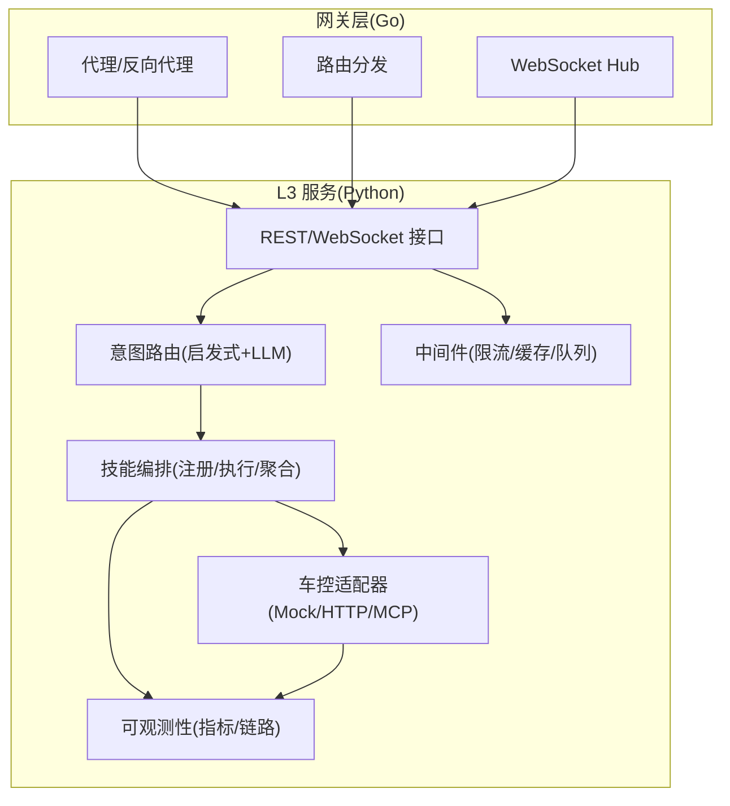
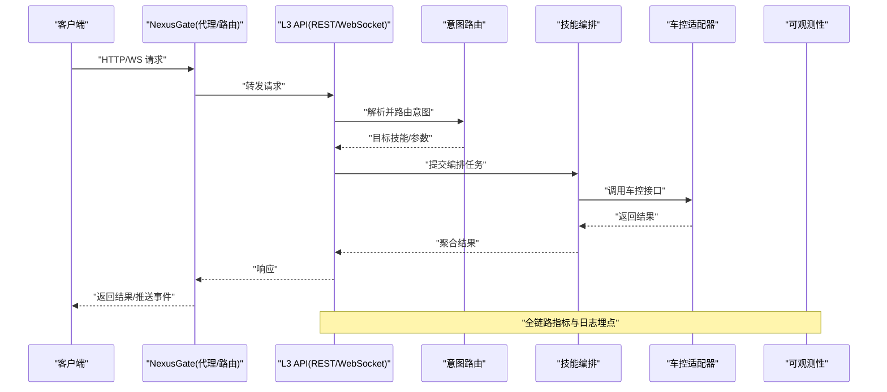
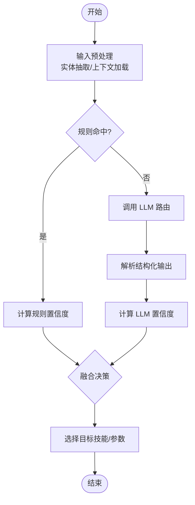
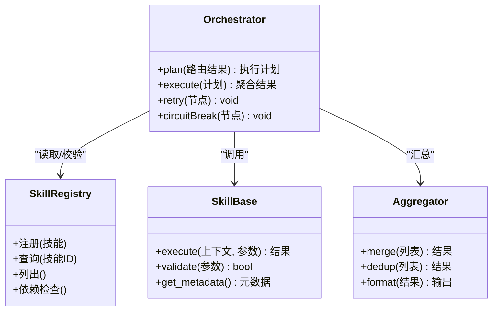
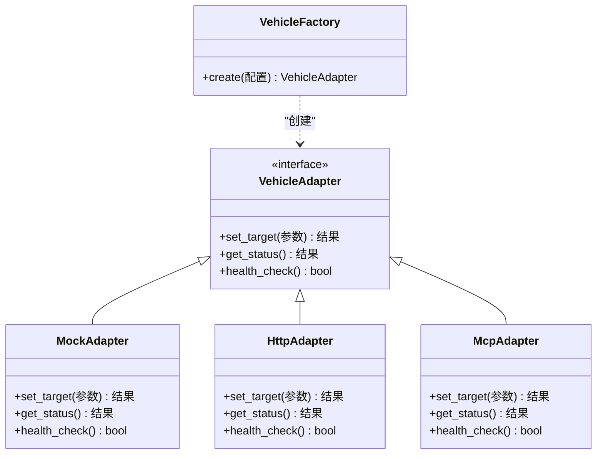
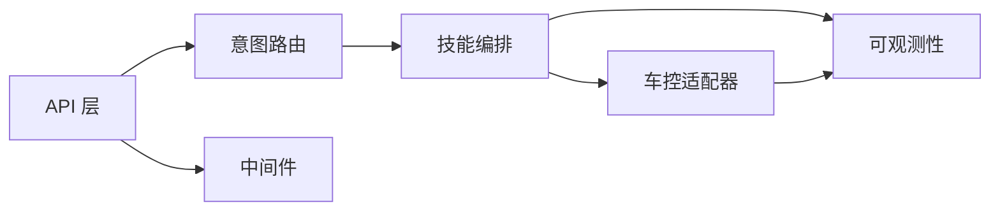

# L3 服务层

<cite>
**本文引用的文件**   
- [backend_design/nexus/main.py](file://backend_design/nexus/main.py)
- [backend_design/nexus/config.py](file://backend_design/nexus/config.py)
- [backend_design/nexus/core/cockpit_manager.py](file://backend_design/nexus/core/cockpit_manager.py)
- [backend_design/nexus/intent/router.py](file://backend_design/nexus/intent/router.py)
- [backend_design/nexus/intent/heuristic.py](file://backend_design/nexus/intent/heuristic.py)
- [backend_design/nexus/intent/llm_router.py](file://backend_design/nexus/intent/llm_router.py)
- [backend_design/nexus/skills/orchestrator.py](file://backend_design/nexus/skills/orchestrator.py)
- [backend_design/nexus/skills/registry.py](file://backend_design/nexus/skills/registry.py)
- [backend_design/nexus/skills/base.py](file://backend_design/nexus/skills/base.py)
- [backend_design/nexus/vehicle/factory.py](file://backend_design/nexus/vehicle/factory.py)
- [backend_design/nexus/vehicle/mock.py](file://backend_design/nexus/vehicle/mock.py)
- [backend_design/nexus/vehicle/http.py](file://backend_design/nexus/vehicle/http.py)
- [backend_design/nexus/vehicle/mcp.py](file://backend_design/nexus/vehicle/mcp.py)
- [backend_design/nexus/api/routes/chat.py](file://backend_design/nexus/api/routes/chat.py)
- [backend_design/nexus/api/routes/vehicle.py](file://backend_design/nexus/api/routes/vehicle.py)
- [backend_design/nexus/api/websocket.py](file://backend_design/nexus/api/websocket.py)
- [backend_design/nexus/middleware/rate_limiter.py](file://backend_design/nexus/middleware/rate_limiter.py)
- [backend_design/nexus/middleware/redis_cache.py](file://backend_design/nexus/middleware/redis_cache.py)
- [backend_design/nexus/middleware/task_queue.py](file://backend_design/nexus/middleware/task_queue.py)
- [backend_design/nexus/core/circuit_breaker.py](file://backend_design/nexus/core/circuit_breaker.py)
- [backend_design/nexus/observability/metrics.py](file://backend_design/nexus/observability/metrics.py)
- [backend_design/nexus/observability/langfuse.py](file://backend_design/nexus/observability/langfuse.py)
- [backend_design/nexus/mcp/gateway.py](file://backend_design/nexus/mcp/gateway.py)
- [backend_design/nexus/models/state.py](file://backend_design/nexus/models/state.py)
- [backend_design/nexus/memory/manager.py](file://backend_design/nexus/memory/manager.py)
- [backend_design/nexus/rag/unified_retriever.py](file://backend_design/nexus/rag/unified_retriever.py)
- [backend_design/nexus/asr/engine.py](file://backend_design/nexus/asr/engine.py)
- [backend_design/nexus/tts/engine.py](file://backend_design/nexus/tts/engine.py)
- [backend_design/nexus_gate/internal/proxy/proxy.go](file://backend_design/nexus_gate/internal/proxy/proxy.go)
- [backend_design/nexus_gate/internal/router/router.go](file://backend_design/nexus_gate/internal/router/router.go)
- [backend_design/nexus_gate/internal/handlers/handlers.go](file://backend_design/nexus_gate/internal/handlers/handlers.go)
- [backend_design/nexus_gate/internal/ws/hub.go](file://backend_design/nexus_gate/internal/ws/hub.go)
- [backend_design/nexus_gate/proto/nexus.proto](file://backend_design/nexus_gate/proto/nexus.proto)
</cite>

## 目录
1. [简介](#简介)
2. [项目结构](#项目结构)
3. [核心组件](#核心组件)
4. [架构总览](#架构总览)
5. [详细组件分析](#详细组件分析)
6. [依赖关系分析](#依赖关系分析)
7. [性能与可观测性](#性能与可观测性)
8. [故障排查指南](#故障排查指南)
9. [结论](#结论)
10. [附录：扩展指南与最佳实践](#附录扩展指南与最佳实践)

## 简介
本文件面向 NexusCockpit 的 L3 服务层，聚焦业务服务架构设计与实现细节。内容覆盖：
- 技能编排系统（注册中心、执行引擎、结果聚合）
- 意图路由机制（启发式规则 + LLM 智能路由）
- 车控适配器模式（Mock/HTTP/MCP 三模式适配）
- 服务发现、负载均衡、容错处理与性能监控
- 服务间通信协议、API 设计规范与数据同步策略
- 服务扩展指南与最佳实践案例

## 项目结构
L3 服务层位于后端 Python 服务中，围绕“入口 API -> 意图路由 -> 技能编排 -> 车控适配 -> 可观测性与中间件”的主线组织。网关层（Go）提供统一接入、鉴权、限流与 WebSocket 转发能力。

图示来源
- [backend_design/nexus/main.py](file://backend_design/nexus/main.py)
- [backend_design/nexus_gate/internal/proxy/proxy.go](file://backend_design/nexus_gate/internal/proxy/proxy.go)
- [backend_design/nexus_gate/internal/router/router.go](file://backend_design/nexus_gate/internal/router/router.go)
- [backend_design/nexus_gate/internal/ws/hub.go](file://backend_design/nexus_gate/internal/ws/hub.go)

章节来源
- [backend_design/nexus/main.py](file://backend_design/nexus/main.py)
- [backend_design/nexus_gate/internal/proxy/proxy.go](file://backend_design/nexus_gate/internal/proxy/proxy.go)
- [backend_design/nexus_gate/internal/router/router.go](file://backend_design/nexus_gate/internal/router/router.go)
- [backend_design/nexus_gate/internal/ws/hub.go](file://backend_design/nexus_gate/internal/ws/hub.go)

## 核心组件
- 入口与上下文管理
  - REST/WebSocket 入口负责请求解析、会话上下文注入、鉴权与中间件链。
  - 会话状态与用户上下文贯穿意图识别、技能执行与结果回写。
- 意图路由
  - 启发式规则优先匹配，失败或不确定时交由 LLM 进行智能路由。
  - 输出目标技能/子流程及必要参数。
- 技能编排
  - 注册中心维护技能元数据与版本；执行引擎按 DAG/顺序调度；聚合器合并多源结果。
- 车控适配器
  - 抽象统一接口，支持 Mock/HTTP/MCP 三种后端实现，便于开发与灰度切换。
- 中间件与可观测性
  - 限流、缓存、异步任务队列；指标采集与分布式链路追踪。

章节来源
- [backend_design/nexus/api/routes/chat.py](file://backend_design/nexus/api/routes/chat.py)
- [backend_design/nexus/api/routes/vehicle.py](file://backend_design/nexus/api/routes/vehicle.py)
- [backend_design/nexus/api/websocket.py](file://backend_design/nexus/api/websocket.py)
- [backend_design/nexus/intent/router.py](file://backend_design/nexus/intent/router.py)
- [backend_design/nexus/intent/heuristic.py](file://backend_design/nexus/intent/heuristic.py)
- [backend_design/nexus/intent/llm_router.py](file://backend_design/nexus/intent/llm_router.py)
- [backend_design/nexus/skills/orchestrator.py](file://backend_design/nexus/skills/orchestrator.py)
- [backend_design/nexus/skills/registry.py](file://backend_design/nexus/skills/registry.py)
- [backend_design/nexus/skills/base.py](file://backend_design/nexus/skills/base.py)
- [backend_design/nexus/vehicle/factory.py](file://backend_design/nexus/vehicle/factory.py)
- [backend_design/nexus/vehicle/mock.py](file://backend_design/nexus/vehicle/mock.py)
- [backend_design/nexus/vehicle/http.py](file://backend_design/nexus/vehicle/http.py)
- [backend_design/nexus/vehicle/mcp.py](file://backend_design/nexus/vehicle/mcp.py)
- [backend_design/nexus/middleware/rate_limiter.py](file://backend_design/nexus/middleware/rate_limiter.py)
- [backend_design/nexus/middleware/redis_cache.py](file://backend_design/nexus/middleware/redis_cache.py)
- [backend_design/nexus/middleware/task_queue.py](file://backend_design/nexus/middleware/task_queue.py)
- [backend_design/nexus/observability/metrics.py](file://backend_design/nexus/observability/metrics.py)
- [backend_design/nexus/observability/langfuse.py](file://backend_design/nexus/observability/langfuse.py)

## 架构总览
从网关到 L3 服务的端到端调用路径如下：

图示来源
- [backend_design/nexus/api/routes/chat.py](file://backend_design/nexus/api/routes/chat.py)
- [backend_design/nexus/intent/router.py](file://backend_design/nexus/intent/router.py)
- [backend_design/nexus/skills/orchestrator.py](file://backend_design/nexus/skills/orchestrator.py)
- [backend_design/nexus/vehicle/factory.py](file://backend_design/nexus/vehicle/factory.py)
- [backend_design/nexus/observability/metrics.py](file://backend_design/nexus/observability/metrics.py)
- [backend_design/nexus_gate/internal/proxy/proxy.go](file://backend_design/nexus_gate/internal/proxy/proxy.go)
- [backend_design/nexus_gate/internal/ws/hub.go](file://backend_design/nexus_gate/internal/ws/hub.go)

## 详细组件分析

### 意图路由机制（启发式 + LLM）
- 设计要点
  - 启发式规则快速命中常见场景，降低 LLM 调用成本与时延。
  - 当置信度不足或规则未覆盖时，触发 LLM 智能路由，结合上下文与历史记忆提升准确率。
  - 路由结果包含目标技能 ID、参数映射与置信度评分，供编排器使用。
- 关键流程
  - 输入预处理：清洗文本、提取实体、加载用户上下文。
  - 规则匹配：关键词/正则/槽位模板匹配。
  - LLM 路由：构造提示词，调用模型，解析结构化输出。
  - 决策融合：规则与 LLM 结果加权，选择最终目标。
- 错误与降级
  - LLM 不可用时回退至纯规则或默认技能。
  - 超时/异常时记录指标并返回友好提示。

图示来源
- [backend_design/nexus/intent/router.py](file://backend_design/nexus/intent/router.py)
- [backend_design/nexus/intent/heuristic.py](file://backend_design/nexus/intent/heuristic.py)
- [backend_design/nexus/intent/llm_router.py](file://backend_design/nexus/intent/llm_router.py)

章节来源
- [backend_design/nexus/intent/router.py](file://backend_design/nexus/intent/router.py)
- [backend_design/nexus/intent/heuristic.py](file://backend_design/nexus/intent/heuristic.py)
- [backend_design/nexus/intent/llm_router.py](file://backend_design/nexus/intent/llm_router.py)

### 技能编排系统（注册中心、执行引擎、结果聚合）
- 设计要点
  - 注册中心：集中管理技能元数据（名称、版本、依赖、参数契约）。
  - 执行引擎：根据路由结果构建执行计划（顺序/并行/DAG），管理生命周期与资源。
  - 结果聚合：对多技能/多源结果进行合并、去重、排序与格式化。
- 关键流程
  - 加载技能清单与依赖图。
  - 校验参数与权限。
  - 调度执行（含重试、熔断、超时控制）。
  - 聚合输出并写入会话状态。
- 扩展方式
  - 新增技能需实现基类契约并在注册中心声明。
  - 通过工厂/配置动态启用不同实现。

图示来源
- [backend_design/nexus/skills/registry.py](file://backend_design/nexus/skills/registry.py)
- [backend_design/nexus/skills/base.py](file://backend_design/nexus/skills/base.py)
- [backend_design/nexus/skills/orchestrator.py](file://backend_design/nexus/skills/orchestrator.py)

章节来源
- [backend_design/nexus/skills/registry.py](file://backend_design/nexus/skills/registry.py)
- [backend_design/nexus/skills/base.py](file://backend_design/nexus/skills/base.py)
- [backend_design/nexus/skills/orchestrator.py](file://backend_design/nexus/skills/orchestrator.py)

### 车控适配器模式（Mock/HTTP/MCP）
- 设计要点
  - 统一抽象接口，屏蔽底层差异。
  - 运行时根据配置选择实现：开发用 Mock，生产用 HTTP 或 MCP。
  - 支持健康检查、超时、重试与熔断。
- 关键流程
  - 工厂根据配置创建具体适配器实例。
  - 调用标准化方法（如开关、调节、查询状态）。
  - 返回统一数据结构，便于上层聚合。

图示来源
- [backend_design/nexus/vehicle/factory.py](file://backend_design/nexus/vehicle/factory.py)
- [backend_design/nexus/vehicle/mock.py](file://backend_design/nexus/vehicle/mock.py)
- [backend_design/nexus/vehicle/http.py](file://backend_design/nexus/vehicle/http.py)
- [backend_design/nexus/vehicle/mcp.py](file://backend_design/nexus/vehicle/mcp.py)

章节来源
- [backend_design/nexus/vehicle/factory.py](file://backend_design/nexus/vehicle/factory.py)
- [backend_design/nexus/vehicle/mock.py](file://backend_design/nexus/vehicle/mock.py)
- [backend_design/nexus/vehicle/http.py](file://backend_design/nexus/vehicle/http.py)
- [backend_design/nexus/vehicle/mcp.py](file://backend_design/nexus/vehicle/mcp.py)

### 服务发现、负载均衡与容错
- 服务发现
  - 通过配置中心/环境变量注册服务地址，配合网关路由表完成静态发现；未来可扩展为动态注册中心。
- 负载均衡
  - 网关层基于轮询/最少连接策略分发请求；Python 侧对下游 HTTP/MCP 调用采用连接池与随机选择。
- 容错处理
  - 熔断器：在连续失败后快速失败，避免雪崩。
  - 重试与退避：对幂等操作进行有限次重试，指数退避。
  - 超时控制：分层设置网关、API、下游调用超时。
  - 降级策略：LLM 不可用时回退规则；车控不可用时返回只读状态或缓存结果。

章节来源
- [backend_design/nexus/core/circuit_breaker.py](file://backend_design/nexus/core/circuit_breaker.py)
- [backend_design/nexus/middleware/rate_limiter.py](file://backend_design/nexus/middleware/rate_limiter.py)
- [backend_design/nexus/middleware/redis_cache.py](file://backend_design/nexus/middleware/redis_cache.py)
- [backend_design/nexus/middleware/task_queue.py](file://backend_design/nexus/middleware/task_queue.py)
- [backend_design/nexus_gate/internal/proxy/proxy.go](file://backend_design/nexus_gate/internal/proxy/proxy.go)

### 服务间通信协议与 API 规范
- 协议
  - 网关与 L3 之间：HTTP/REST 与 WebSocket；内部 RPC 可选 gRPC（当前以 HTTP 为主）。
  - 车控后端：HTTP JSON 或 MCP 协议（由适配器封装）。
- API 设计
  - 统一响应体结构（状态码、消息、数据、追踪 ID）。
  - 分页、过滤、排序参数规范化。
  - 幂等键与重试安全。
  - 错误码分级与可观测性字段。
- WebSocket
  - 用于实时事件推送（车辆状态、对话流式输出）。
  - 心跳保活与断线重连。

章节来源
- [backend_design/nexus/api/routes/chat.py](file://backend_design/nexus/api/routes/chat.py)
- [backend_design/nexus/api/routes/vehicle.py](file://backend_design/nexus/api/routes/vehicle.py)
- [backend_design/nexus/api/websocket.py](file://backend_design/nexus/api/websocket.py)
- [backend_design/nexus_gate/proto/nexus.proto](file://backend_design/nexus_gate/proto/nexus.proto)

### 数据同步策略
- 会话状态
  - 内存状态作为热路径，Redis 作为持久化与跨实例共享。
- 记忆与知识
  - 向量检索与图谱检索统一封装，读写分离与缓存预热。
- 一致性
  - 最终一致：先写缓存/队列，再落库。
  - 冲突解决：时间戳/版本号合并策略。

章节来源
- [backend_design/nexus/models/state.py](file://backend_design/nexus/models/state.py)
- [backend_design/nexus/memory/manager.py](file://backend_design/nexus/memory/manager.py)
- [backend_design/nexus/rag/unified_retriever.py](file://backend_design/nexus/rag/unified_retriever.py)
- [backend_design/nexus/middleware/redis_cache.py](file://backend_design/nexus/middleware/redis_cache.py)

## 依赖关系分析
- 模块耦合
  - API 层依赖意图路由与编排；编排依赖车控适配器；可观测性横切各层。
- 外部依赖
  - Redis、向量/图谱存储、ASR/TTS、LLM 服务、MCP 网关。
- 潜在环依赖
  - 通过接口抽象与工厂解耦，避免直接循环导入。

图示来源
- [backend_design/nexus/api/routes/chat.py](file://backend_design/nexus/api/routes/chat.py)
- [backend_design/nexus/intent/router.py](file://backend_design/nexus/intent/router.py)
- [backend_design/nexus/skills/orchestrator.py](file://backend_design/nexus/skills/orchestrator.py)
- [backend_design/nexus/vehicle/factory.py](file://backend_design/nexus/vehicle/factory.py)
- [backend_design/nexus/observability/metrics.py](file://backend_design/nexus/observability/metrics.py)

章节来源
- [backend_design/nexus/api/routes/chat.py](file://backend_design/nexus/api/routes/chat.py)
- [backend_design/nexus/intent/router.py](file://backend_design/nexus/intent/router.py)
- [backend_design/nexus/skills/orchestrator.py](file://backend_design/nexus/skills/orchestrator.py)
- [backend_design/nexus/vehicle/factory.py](file://backend_design/nexus/vehicle/factory.py)
- [backend_design/nexus/observability/metrics.py](file://backend_design/nexus/observability/metrics.py)

## 性能与可观测性
- 性能优化
  - 连接池与复用：HTTP/MCP 客户端连接池。
  - 缓存策略：热点数据入 Redis，TTL 与失效策略。
  - 异步化：耗时任务入队，非阻塞返回。
  - 批处理：批量查询与合并减少往返。
- 可观测性
  - 指标：QPS、延迟分位、错误率、熔断状态、队列积压。
  - 链路追踪：跨网关、API、LLM、车控的全链路 Trace。
  - 日志：结构化日志，敏感信息脱敏。

章节来源
- [backend_design/nexus/middleware/rate_limiter.py](file://backend_design/nexus/middleware/rate_limiter.py)
- [backend_design/nexus/middleware/redis_cache.py](file://backend_design/nexus/middleware/redis_cache.py)
- [backend_design/nexus/middleware/task_queue.py](file://backend_design/nexus/middleware/task_queue.py)
- [backend_design/nexus/observability/metrics.py](file://backend_design/nexus/observability/metrics.py)
- [backend_design/nexus/observability/langfuse.py](file://backend_design/nexus/observability/langfuse.py)

## 故障排查指南
- 常见问题
  - LLM 路由失败：检查模型可用性、超时与降级策略。
  - 车控调用超时：确认网络连通、证书与端口；查看熔断器状态。
  - 缓存不一致：核对 TTL 与更新顺序；必要时强制刷新。
  - WebSocket 断连：检查心跳与重连逻辑。
- 定位手段
  - 查看指标面板与告警。
  - 拉取链路追踪与结构化日志。
  - 使用健康检查接口验证子系统状态。

章节来源
- [backend_design/nexus/core/circuit_breaker.py](file://backend_design/nexus/core/circuit_breaker.py)
- [backend_design/nexus/observability/metrics.py](file://backend_design/nexus/observability/metrics.py)
- [backend_design/nexus/observability/langfuse.py](file://backend_design/nexus/observability/langfuse.py)
- [backend_design/nexus/api/websocket.py](file://backend_design/nexus/api/websocket.py)

## 结论
L3 服务层通过清晰的职责划分与模块化设计，实现了高内聚低耦合的业务编排与车控适配。意图路由兼顾效率与准确性，适配器模式提升了可替换性与可测试性。配合完善的中间件与可观测性体系，系统在稳定性、可运维性与扩展性方面具备良好基础。

## 附录：扩展指南与最佳实践
- 新增技能
  - 继承基类，实现 execute 与 validate。
  - 在注册中心登记元数据与依赖。
  - 编写单元测试与集成测试用例。
- 新增车控后端
  - 实现适配器接口，注册到工厂。
  - 增加健康检查与错误映射。
  - 灰度发布与流量切换策略。
- 路由增强
  - 扩充规则库与槽位模板。
  - 优化 LLM 提示词与输出解析。
  - 引入置信度阈值与人工审核通道。
- 性能调优
  - 调整连接池大小与超时参数。
  - 合理设置缓存 TTL 与预取策略。
  - 将长耗时任务迁移至队列。
- 安全与合规
  - 敏感数据脱敏与最小权限原则。
  - 审计日志与访问控制。
  - 密钥管理与轮换。

章节来源
- [backend_design/nexus/skills/base.py](file://backend_design/nexus/skills/base.py)
- [backend_design/nexus/skills/registry.py](file://backend_design/nexus/skills/registry.py)
- [backend_design/nexus/vehicle/factory.py](file://backend_design/nexus/vehicle/factory.py)
- [backend_design/nexus/intent/heuristic.py](file://backend_design/nexus/intent/heuristic.py)
- [backend_design/nexus/intent/llm_router.py](file://backend_design/nexus/intent/llm_router.py)
- [backend_design/nexus/middleware/rate_limiter.py](file://backend_design/nexus/middleware/rate_limiter.py)
- [backend_design/nexus/middleware/redis_cache.py](file://backend_design/nexus/middleware/redis_cache.py)
- [backend_design/nexus/middleware/task_queue.py](file://backend_design/nexus/middleware/task_queue.py)