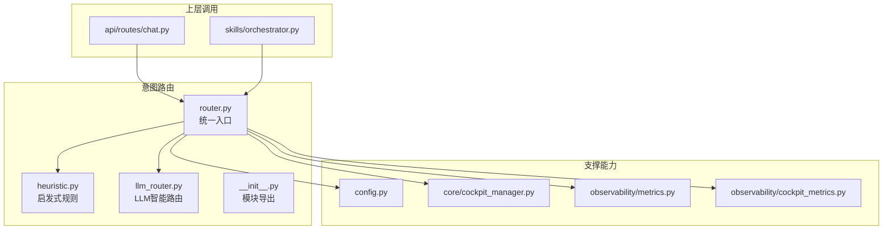
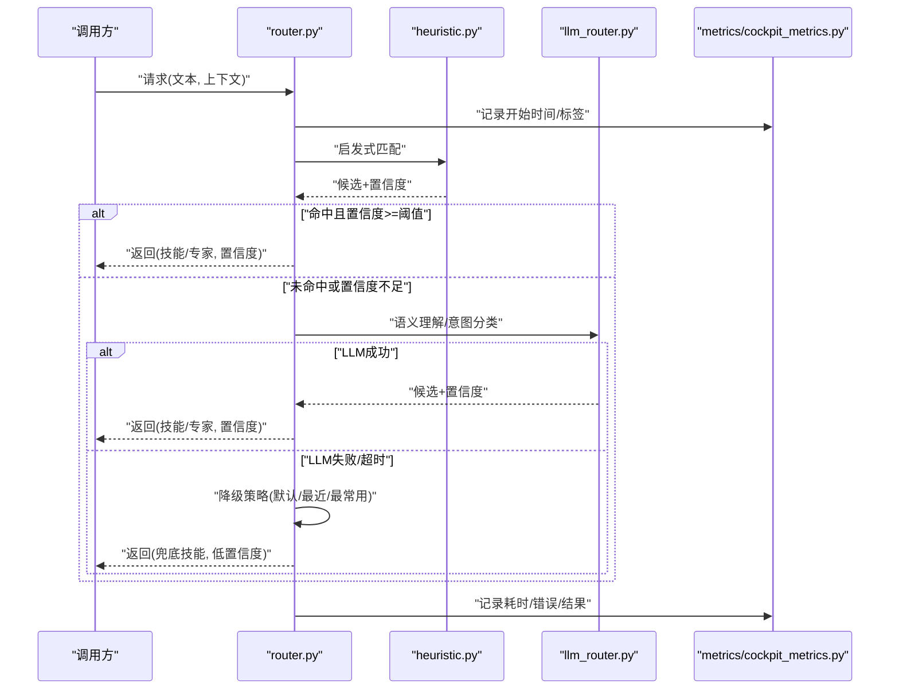
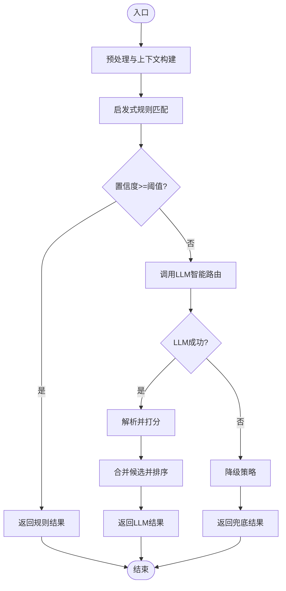
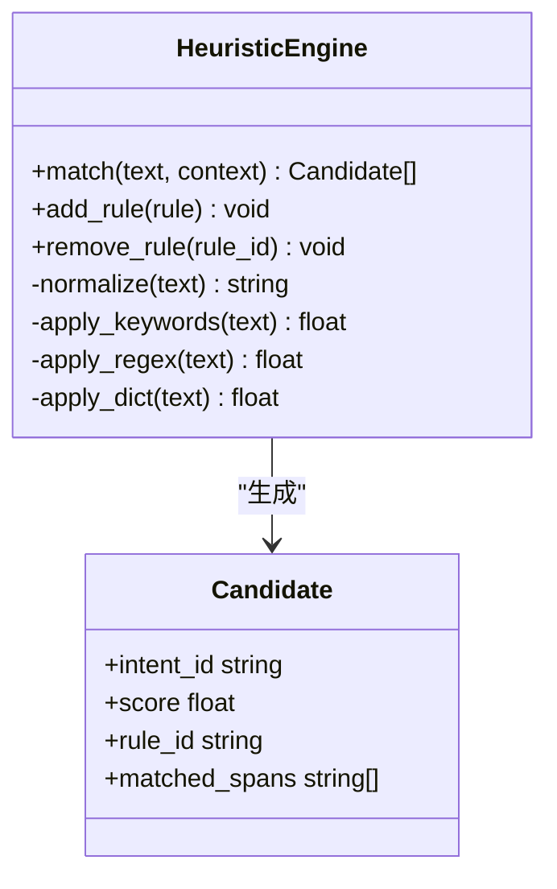
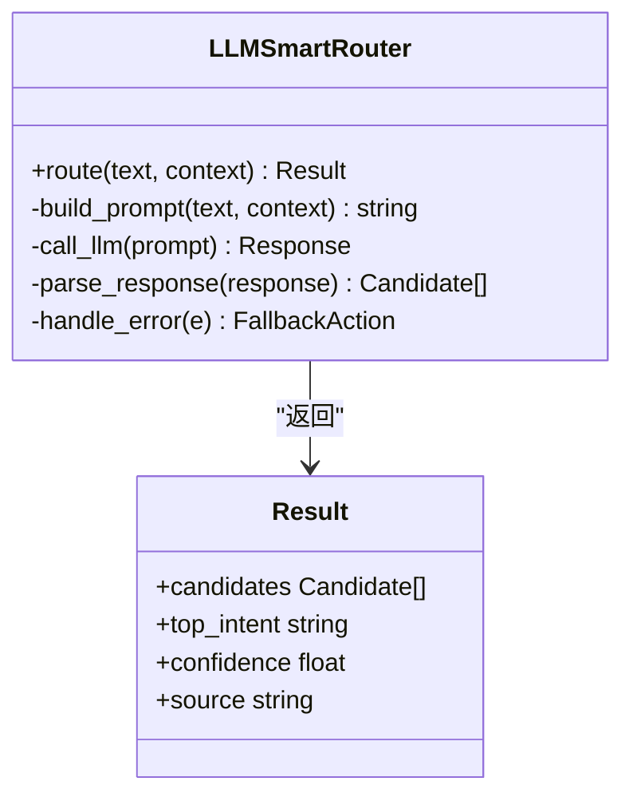
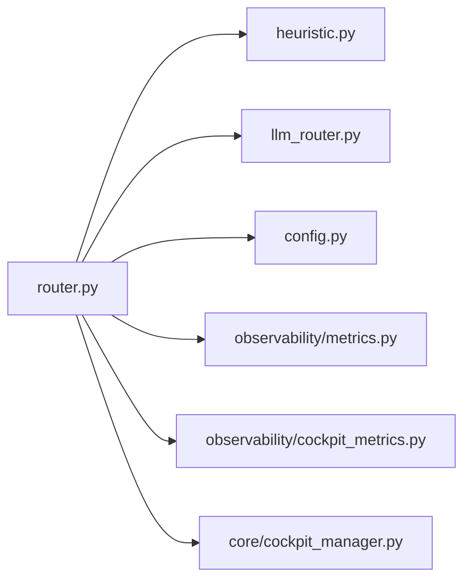

# 意图路由机制

<cite>
**本文引用的文件**   
- [backend_design/nexus/intent/router.py](file://backend_design/nexus/intent/router.py)
- [backend_design/nexus/intent/heuristic.py](file://backend_design/nexus/intent/heuristic.py)
- [backend_design/nexus/intent/llm_router.py](file://backend_design/nexus/intent/llm_router.py)
- [backend_design/nexus/intent/__init__.py](file://backend_design/nexus/intent/__init__.py)
- [backend_design/nexus/config.py](file://backend_design/nexus/config.py)
- [backend_design/nexus/core/cockpit_manager.py](file://backend_design/nexus/core/cockpit_manager.py)
- [backend_design/nexus/api/routes/chat.py](file://backend_design/nexus/api/routes/chat.py)
- [backend_design/nexus/skills/orchestrator.py](file://backend_design/nexus/skills/orchestrator.py)
- [backend_design/nexus/observability/metrics.py](file://backend_design/nexus/observability/metrics.py)
- [backend_design/nexus/observability/cockpit_metrics.py](file://backend_design/nexus/observability/cockpit_metrics.py)
</cite>

## 目录
1. [简介](#简介)
2. [项目结构](#项目结构)
3. [核心组件](#核心组件)
4. [架构总览](#架构总览)
5. [详细组件分析](#详细组件分析)
6. [依赖关系分析](#依赖关系分析)
7. [性能考虑](#性能考虑)
8. [故障排查指南](#故障排查指南)
9. [结论](#结论)
10. [附录](#附录)

## 简介
本文件聚焦 NexusCockpit 的“意图路由机制”，系统性阐述混合路由架构：以启发式规则引擎为快速通道，LLM 智能路由器为语义增强通道，二者协同完成用户意图识别与目标技能/专家的选择。文档覆盖意图识别算法、关键词匹配策略、语义理解模型、路由决策树设计、置信度评分与降级策略，并提供配置优化与性能调优建议，帮助读者在生产环境中稳定高效地运行该子系统。

## 项目结构
意图路由相关代码位于 backend_design/nexus/intent 目录，包含统一入口 router.py、启发式规则 heuristics.py、LLM 智能路由器 llm_router.py 以及模块初始化 __init__.py。上层通过 API 层（如 chat.py）或编排器（orchestrator.py）调用路由能力；配置由 config.py 提供；可观测性指标由 observability 模块采集。

图表来源
- [backend_design/nexus/intent/router.py](file://backend_design/nexus/intent/router.py)
- [backend_design/nexus/intent/heuristic.py](file://backend_design/nexus/intent/heuristic.py)
- [backend_design/nexus/intent/llm_router.py](file://backend_design/nexus/intent/llm_router.py)
- [backend_design/nexus/intent/__init__.py](file://backend_design/nexus/intent/__init__.py)
- [backend_design/nexus/api/routes/chat.py](file://backend_design/nexus/api/routes/chat.py)
- [backend_design/nexus/skills/orchestrator.py](file://backend_design/nexus/skills/orchestrator.py)
- [backend_design/nexus/config.py](file://backend_design/nexus/config.py)
- [backend_design/nexus/core/cockpit_manager.py](file://backend_design/nexus/core/cockpit_manager.py)
- [backend_design/nexus/observability/metrics.py](file://backend_design/nexus/observability/metrics.py)
- [backend_design/nexus/observability/cockpit_metrics.py](file://backend_design/nexus/observability/cockpit_metrics.py)

章节来源
- [backend_design/nexus/intent/router.py](file://backend_design/nexus/intent/router.py)
- [backend_design/nexus/intent/heuristic.py](file://backend_design/nexus/intent/heuristic.py)
- [backend_design/nexus/intent/llm_router.py](file://backend_design/nexus/intent/llm_router.py)
- [backend_design/nexus/intent/__init__.py](file://backend_design/nexus/intent/__init__.py)
- [backend_design/nexus/api/routes/chat.py](file://backend_design/nexus/api/routes/chat.py)
- [backend_design/nexus/skills/orchestrator.py](file://backend_design/nexus/skills/orchestrator.py)
- [backend_design/nexus/config.py](file://backend_design/nexus/config.py)
- [backend_design/nexus/core/cockpit_manager.py](file://backend_design/nexus/core/cockpit_manager.py)
- [backend_design/nexus/observability/metrics.py](file://backend_design/nexus/observability/metrics.py)
- [backend_design/nexus/observability/cockpit_metrics.py](file://backend_design/nexus/observability/cockpit_metrics.py)

## 核心组件
- 统一路由入口（router.py）
  - 职责：接收原始输入文本，执行多阶段路由流程，协调启发式与LLM两条路径，输出最终目标技能/专家及置信度。
  - 关键行为：参数校验、上下文注入、规则命中判定、LLM 调用与回退、指标上报、异常处理。
- 启发式规则引擎（heuristic.py）
  - 职责：基于关键词、正则、白名单/黑名单、领域词典等快速判断意图类别，返回候选列表与置信度。
  - 特点：低延迟、高确定性、易维护，适合高频通用意图。
- LLM 智能路由器（llm_router.py）
  - 职责：在规则未命中或置信度不足时，调用大模型进行语义理解与意图分类，支持提示词模板、系统上下文与结果解析。
  - 特点：强泛化能力，适配长尾场景，但存在延迟与成本。
- 模块导出（__init__.py）
  - 职责：对外暴露路由接口，屏蔽内部实现细节，便于上层按需导入。

章节来源
- [backend_design/nexus/intent/router.py](file://backend_design/nexus/intent/router.py)
- [backend_design/nexus/intent/heuristic.py](file://backend_design/nexus/intent/heuristic.py)
- [backend_design/nexus/intent/llm_router.py](file://backend_design/nexus/intent/llm_router.py)
- [backend_design/nexus/intent/__init__.py](file://backend_design/nexus/intent/__init__.py)

## 架构总览
混合路由采用“先快后慢、可降级”的设计：优先走启发式规则，若命中且置信度达标则直接返回；否则进入 LLM 智能路由；当 LLM 不可用时，按降级策略回退到默认或兜底技能。

图表来源
- [backend_design/nexus/intent/router.py](file://backend_design/nexus/intent/router.py)
- [backend_design/nexus/intent/heuristic.py](file://backend_design/nexus/intent/heuristic.py)
- [backend_design/nexus/intent/llm_router.py](file://backend_design/nexus/intent/llm_router.py)
- [backend_design/nexus/observability/cockpit_metrics.py](file://backend_design/nexus/observability/cockpit_metrics.py)

## 详细组件分析

### 统一路由入口（router.py）
- 功能要点
  - 输入预处理：去噪、截断、语言检测（可选）、上下文拼接（会话历史、用户画像）。
  - 两阶段路由：启发式优先，LLM 补充；支持并行尝试与择优合并。
  - 置信度融合：对多路候选进行排序与打分，输出 Top-1 或 Top-K。
  - 降级策略：LLM 不可用或超时，回退至默认技能或最近使用技能。
  - 可观测性：埋点记录耗时、命中率、错误码、降级次数等。
- 关键流程
  - 参数校验 → 规则匹配 → 置信度评估 → LLM 调用 → 结果解析 → 降级处理 → 指标上报。

图表来源
- [backend_design/nexus/intent/router.py](file://backend_design/nexus/intent/router.py)

章节来源
- [backend_design/nexus/intent/router.py](file://backend_design/nexus/intent/router.py)

### 启发式规则引擎（heuristic.py）
- 匹配策略
  - 关键词匹配：正向/反向关键词库，支持权重与优先级。
  - 正则表达式：用于结构化片段抽取（如地址、时间、设备名）。
  - 领域词典：针对车载、健康、导航等垂直域的词表。
  - 白名单/黑名单：过滤噪声与误判。
- 输出格式
  - 候选意图集合，每个候选包含：意图ID、匹配分数、命中规则ID、命中片段。
- 复杂度与性能
  - 时间复杂度近似 O(N·K)，N 为输入长度，K 为规则数量；可通过索引与缓存优化。
  - 空间复杂度受规则规模影响，建议分域加载与按需启用。

图表来源
- [backend_design/nexus/intent/heuristic.py](file://backend_design/nexus/intent/heuristic.py)

章节来源
- [backend_design/nexus/intent/heuristic.py](file://backend_design/nexus/intent/heuristic.py)

### LLM 智能路由器（llm_router.py）
- 语义理解模型
  - 通过提示词工程将输入文本与上下文组织为结构化指令，要求模型输出意图类别与置信度。
  - 支持多轮对话上下文、用户偏好与当前车辆状态注入。
- 结果解析
  - 从模型响应中解析 JSON 或固定字段，提取候选意图、置信度与解释信息。
  - 对异常响应进行容错与重试。
- 错误与超时
  - 网络异常、鉴权失败、限流、超时等场景需捕获并触发降级。
- 性能优化
  - 并发控制、请求批处理、缓存常见查询、短文本快速路径。

图表来源
- [backend_design/nexus/intent/llm_router.py](file://backend_design/nexus/intent/llm_router.py)

章节来源
- [backend_design/nexus/intent/llm_router.py](file://backend_design/nexus/intent/llm_router.py)

### 模块导出（__init__.py）
- 作用：集中暴露路由接口，简化上层导入；定义版本兼容与默认配置。
- 典型导出：统一路由函数、配置对象、常量枚举。

章节来源
- [backend_design/nexus/intent/__init__.py](file://backend_design/nexus/intent/__init__.py)

### 上层集成点
- API 层（chat.py）
  - 负责接收 HTTP/WebSocket 请求，组装上下文，调用路由并返回结果。
- 编排器（orchestrator.py）
  - 根据路由结果选择具体技能或专家执行，必要时发起二次澄清或工具调用。

章节来源
- [backend_design/nexus/api/routes/chat.py](file://backend_design/nexus/api/routes/chat.py)
- [backend_design/nexus/skills/orchestrator.py](file://backend_design/nexus/skills/orchestrator.py)

## 依赖关系分析
- 内部依赖
  - router.py 依赖 heuristic.py 与 llm_router.py，并通过 config.py 读取配置，向 metrics/cockpit_metrics.py 上报指标。
  - cockpit_manager.py 可能提供会话/上下文管理能力，供路由阶段使用。
- 外部依赖
  - LLM 服务（HTTP/gRPC），需处理鉴权、限流与超时。
  - 规则引擎依赖本地词表与正则库。

图表来源
- [backend_design/nexus/intent/router.py](file://backend_design/nexus/intent/router.py)
- [backend_design/nexus/intent/heuristic.py](file://backend_design/nexus/intent/heuristic.py)
- [backend_design/nexus/intent/llm_router.py](file://backend_design/nexus/intent/llm_router.py)
- [backend_design/nexus/config.py](file://backend_design/nexus/config.py)
- [backend_design/nexus/core/cockpit_manager.py](file://backend_design/nexus/core/cockpit_manager.py)
- [backend_design/nexus/observability/metrics.py](file://backend_design/nexus/observability/metrics.py)
- [backend_design/nexus/observability/cockpit_metrics.py](file://backend_design/nexus/observability/cockpit_metrics.py)

章节来源
- [backend_design/nexus/intent/router.py](file://backend_design/nexus/intent/router.py)
- [backend_design/nexus/config.py](file://backend_design/nexus/config.py)
- [backend_design/nexus/core/cockpit_manager.py](file://backend_design/nexus/core/cockpit_manager.py)
- [backend_design/nexus/observability/metrics.py](file://backend_design/nexus/observability/metrics.py)
- [backend_design/nexus/observability/cockpit_metrics.py](file://backend_design/nexus/observability/cockpit_metrics.py)

## 性能考虑
- 启发式规则
  - 预编译正则、建立关键词倒排索引、分域加载规则集，降低匹配开销。
  - 对高频规则设置短路逻辑，尽早返回。
- LLM 路由
  - 控制并发与队列长度，避免雪崩；对短文本启用快速路径（缓存或轻量模型）。
  - 合理设置超时与重试上限，结合熔断与舱壁隔离。
- 指标与监控
  - 记录各阶段耗时、命中率、降级率、错误分布，结合 Grafana/Prometheus 可视化。
- 资源与容量
  - 根据 QPS 峰值预估内存占用与线程池大小，定期压测与容量规划。

[本节为通用性能指导，不直接分析具体文件]

## 故障排查指南
- 常见问题
  - 规则未命中：检查关键词/正则是否覆盖边界用例，确认权重与优先级。
  - LLM 超时/失败：查看网络连通性、鉴权令牌、限流策略与模型配额。
  - 置信度过低：调整阈值、扩充上下文、优化提示词模板。
  - 降级频繁：评估 LLM 可用性、增加缓存与快速路径。
- 定位方法
  - 开启详细日志，关注路由阶段埋点与错误码。
  - 复现最小用例，逐步关闭规则或禁用 LLM 以隔离问题。
  - 对比不同配置的命中率与延迟，回归验证。

章节来源
- [backend_design/nexus/observability/metrics.py](file://backend_design/nexus/observability/metrics.py)
- [backend_design/nexus/observability/cockpit_metrics.py](file://backend_design/nexus/observability/cockpit_metrics.py)

## 结论
NexusCockpit 的意图路由采用“启发式优先 + LLM 补充”的混合架构，在保证低延迟与高确定性的同时，兼顾复杂语义场景的泛化能力。通过合理的置信度阈值、降级策略与完善的可观测性，可在生产环境获得稳定高效的体验。持续优化规则库与提示词、完善监控与容量规划，是进一步提升质量的关键。

[本节为总结性内容，不直接分析具体文件]

## 附录

### 路由配置优化指南
- 规则配置
  - 按域拆分规则集，启用按需加载；为高频规则赋予更高权重。
  - 定期清理低效规则，避免规则膨胀导致匹配退化。
- LLM 配置
  - 设置合理的超时、重试与并发限制；为短文本准备轻量模型或缓存。
  - 优化提示词模板，明确输出结构与字段约束。
- 阈值与降级
  - 动态调整置信度阈值，平衡准确率与召回率。
  - 预设兜底技能与最近使用策略，确保可用性。

章节来源
- [backend_design/nexus/config.py](file://backend_design/nexus/config.py)
- [backend_design/nexus/intent/router.py](file://backend_design/nexus/intent/router.py)

### 意图识别算法与评分机制
- 启发式评分
  - 基于关键词命中数、正则匹配强度、词典覆盖率加权计算。
- LLM 评分
  - 从模型输出中提取置信度，并结合解析稳定性进行修正。
- 融合策略
  - 多路候选合并，按分数排序；Top-1 作为最终决策，Top-K 用于澄清或备选。

章节来源
- [backend_design/nexus/intent/heuristic.py](file://backend_design/nexus/intent/heuristic.py)
- [backend_design/nexus/intent/llm_router.py](file://backend_design/nexus/intent/llm_router.py)
- [backend_design/nexus/intent/router.py](file://backend_design/nexus/intent/router.py)

### 降级策略设计
- 触发条件
  - LLM 超时、网络异常、鉴权失败、限流、解析失败。
- 回退路径
  - 默认技能 → 最近使用技能 → 最常用技能 → 澄清询问。
- 风险控制
  - 限制降级频率，避免频繁切换；记录降级原因与指标。

章节来源
- [backend_design/nexus/intent/router.py](file://backend_design/nexus/intent/router.py)