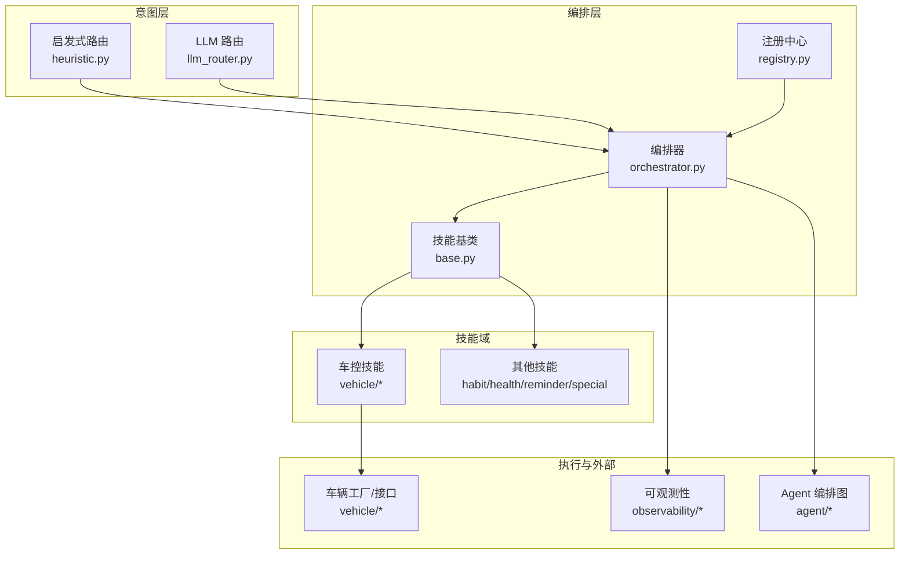
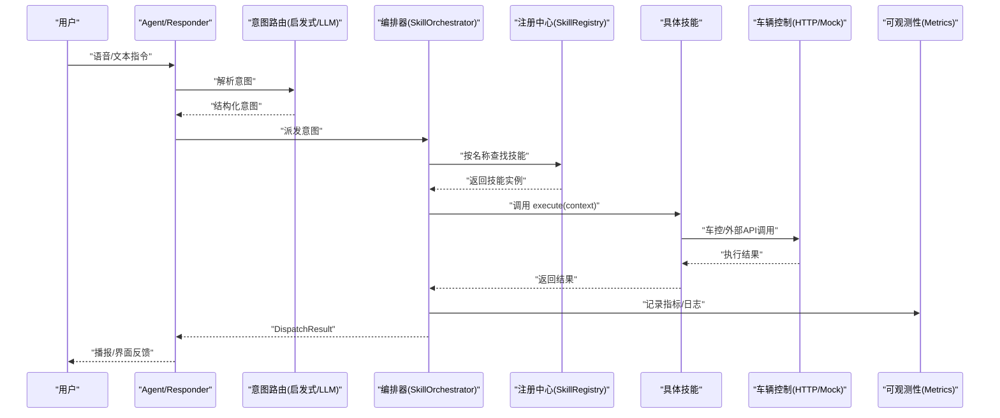
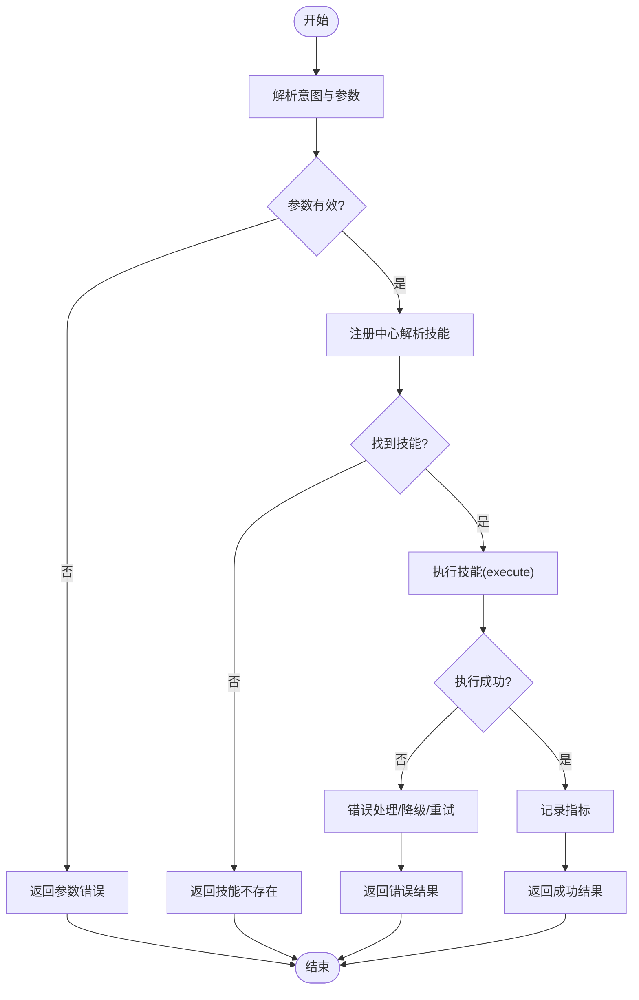
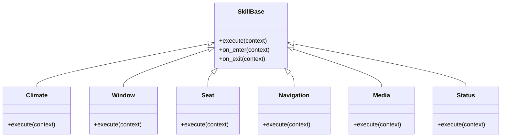
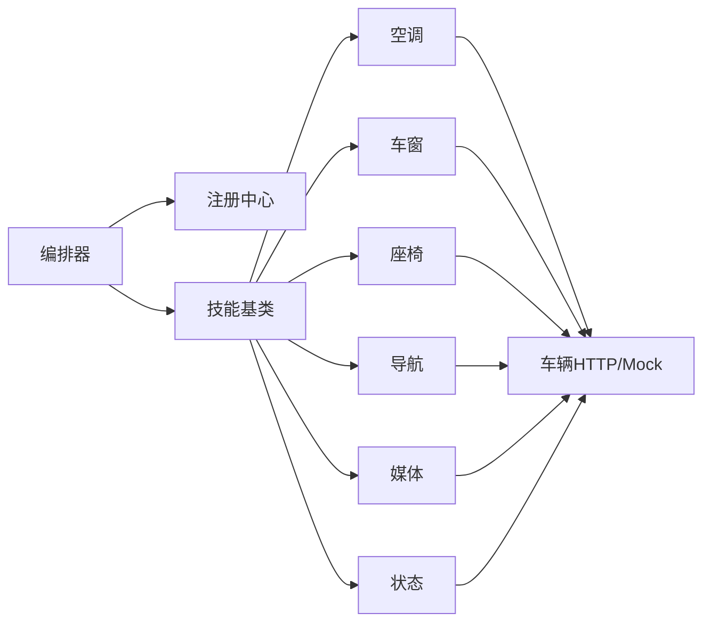

# 技能编排系统

<cite>
**本文引用的文件**   
- [orchestrator.py](file://backend_design/nexus/skills/orchestrator.py)
- [registry.py](file://backend_design/nexus/skills/registry.py)
- [base.py](file://backend_design/nexus/skills/base.py)
- [climate.py](file://backend_design/nexus/skills/vehicle/climate.py)
- [window.py](file://backend_design/nexus/skills/vehicle/window.py)
- [seat.py](file://backend_design/nexus/skills/vehicle/seat.py)
- [navigation.py](file://backend_design/nexus/skills/vehicle/navigation.py)
- [media.py](file://backend_design/nexus/skills/vehicle/media.py)
- [status.py](file://backend_design/nexus/skills/vehicle/status.py)
- [habit.py](file://backend_design/nexus/skills/habit.py)
- [health.py](file://backend_design/nexus/skills/health.py)
- [reminder.py](file://backend_design/nexus/skills/reminder.py)
- [special.py](file://backend_design/nexus/skills/special.py)
- [llm_router.py](file://backend_design/nexus/intent/llm_router.py)
- [heuristic.py](file://backend_design/nexus/intent/heuristic.py)
- [cockpit_metrics.py](file://backend_design/nexus/observability/cockpit_metrics.py)
- [metrics.py](file://backend_design/nexus/observability/metrics.py)
- [responder.py](file://backend_design/nexus/agent/responder.py)
- [supervisor_graph.py](file://backend_design/nexus/agent/supervisor_graph.py)
- [schemas.py](file://backend_design/nexus/models/schemas.py)
- [state.py](file://backend_design/nexus/models/state.py)
- [vehicle_factory.py](file://backend_design/nexus/vehicle/factory.py)
- [vehicle_base.py](file://backend_design/nexus/vehicle/base.py)
- [vehicle_http.py](file://backend_design/nexus/vehicle/http.py)
- [vehicle_mock.py](file://backend_design/nexus/vehicle/mock.py)
- [voiceprint.py](file://backend_design/nexus/core/voiceprint.py)
</cite>

## 目录
1. [简介](#简介)
2. [项目结构](#项目结构)
3. [核心组件](#核心组件)
4. [架构总览](#架构总览)
5. [详细组件分析](#详细组件分析)
6. [依赖关系分析](#依赖关系分析)
7. [性能考虑](#性能考虑)
8. [故障排查指南](#故障排查指南)
9. [结论](#结论)
10. [附录](#附录)

## 简介
本文件面向 NexusCockpit 的技能编排系统，聚焦 SkillOrchestrator 的核心能力：意图分发、技能注册中心机制与执行引擎。文档覆盖车控类技能（空调/车窗/座椅/导航/媒体/状态）、点餐服务、联网搜索与声纹注册等典型技能的调度流程；同时给出 DispatchResult 数据结构设计、性能监控指标收集与错误处理策略，并提供自定义技能开发指南与最佳实践案例。

## 项目结构
技能编排相关代码主要位于 backend_design/nexus 下：
- skills：技能基类、注册表与编排器
- intent：意图识别与路由（启发式与 LLM）
- agent：对话代理与编排图（Supervisor Graph）
- vehicle：车辆控制抽象与实现（HTTP/Mock）
- observability：可观测性（指标与数据保留）
- models：数据模型与状态定义
- core：通用核心能力（如声纹）

图表来源
- [orchestrator.py:1-200](file://backend_design/nexus/skills/orchestrator.py#L1-L200)
- [registry.py:1-200](file://backend_design/nexus/skills/registry.py#L1-L200)
- [base.py:1-200](file://backend_design/nexus/skills/base.py#L1-L200)
- [heuristic.py:1-200](file://backend_design/nexus/intent/heuristic.py#L1-L200)
- [llm_router.py:1-200](file://backend_design/nexus/intent/llm_router.py#L1-L200)
- [vehicle_factory.py:1-200](file://backend_design/nexus/vehicle/factory.py#L1-L200)
- [cockpit_metrics.py:1-200](file://backend_design/nexus/observability/cockpit_metrics.py#L1-L200)
- [supervisor_graph.py:1-200](file://backend_design/nexus/agent/supervisor_graph.py#L1-L200)

章节来源
- [orchestrator.py:1-200](file://backend_design/nexus/skills/orchestrator.py#L1-L200)
- [registry.py:1-200](file://backend_design/nexus/skills/registry.py#L1-L200)
- [base.py:1-200](file://backend_design/nexus/skills/base.py#L1-L200)
- [heuristic.py:1-200](file://backend_design/nexus/intent/heuristic.py#L1-L200)
- [llm_router.py:1-200](file://backend_design/nexus/intent/llm_router.py#L1-L200)
- [vehicle_factory.py:1-200](file://backend_design/nexus/vehicle/factory.py#L1-L200)
- [cockpit_metrics.py:1-200](file://backend_design/nexus/observability/cockpit_metrics.py#L1-L200)
- [supervisor_graph.py:1-200](file://backend_design/nexus/agent/supervisor_graph.py#L1-L200)

## 核心组件
- 技能基类（SkillBase）：定义统一接口、上下文、生命周期钩子与默认错误处理。
- 注册中心（SkillRegistry）：维护技能名称到实现的映射，支持动态发现与版本管理。
- 编排器（SkillOrchestrator）：接收意图结果，选择并执行对应技能，聚合结果，记录指标与日志。
- 意图路由：启发式规则与 LLM 路由共同产出结构化意图，供编排器消费。
- 车辆控制抽象：通过工厂与 HTTP/Mock 后端驱动真实或模拟车控能力。
- 可观测性：在编排关键路径埋点，输出延迟、吞吐、错误率等指标。

章节来源
- [base.py:1-200](file://backend_design/nexus/skills/base.py#L1-L200)
- [registry.py:1-200](file://backend_design/nexus/skills/registry.py#L1-L200)
- [orchestrator.py:1-200](file://backend_design/nexus/skills/orchestrator.py#L1-L200)
- [heuristic.py:1-200](file://backend_design/nexus/intent/heuristic.py#L1-L200)
- [llm_router.py:1-200](file://backend_design/nexus/intent/llm_router.py#L1-L200)
- [vehicle_factory.py:1-200](file://backend_design/nexus/vehicle/factory.py#L1-L200)
- [cockpit_metrics.py:1-200](file://backend_design/nexus/observability/cockpit_metrics.py#L1-L200)

## 架构总览
整体流程：用户输入经 ASR/TTS 后进入 Agent，由意图路由生成结构化意图，SkillOrchestrator 根据意图从注册中心解析目标技能并执行，最终将结果回传至上层。

图表来源
- [responder.py:1-200](file://backend_design/nexus/agent/responder.py#L1-L200)
- [supervisor_graph.py:1-200](file://backend_design/nexus/agent/supervisor_graph.py#L1-L200)
- [heuristic.py:1-200](file://backend_design/nexus/intent/heuristic.py#L1-L200)
- [llm_router.py:1-200](file://backend_design/nexus/intent/llm_router.py#L1-L200)
- [orchestrator.py:1-200](file://backend_design/nexus/skills/orchestrator.py#L1-L200)
- [registry.py:1-200](file://backend_design/nexus/skills/registry.py#L1-L200)
- [vehicle_http.py:1-200](file://backend_design/nexus/vehicle/http.py#L1-L200)
- [vehicle_mock.py:1-200](file://backend_design/nexus/vehicle/mock.py#L1-L200)
- [cockpit_metrics.py:1-200](file://backend_design/nexus/observability/cockpit_metrics.py#L1-L200)

## 详细组件分析

### 编排器（SkillOrchestrator）
- 职责
  - 接收来自 Agent 的意图，解析目标技能名与参数。
  - 从注册中心获取技能实例，构造执行上下文。
  - 执行技能并捕获异常，生成统一的 DispatchResult。
  - 在关键路径采集性能指标与业务指标。
- 关键流程
  - 意图校验与参数补齐
  - 技能解析与降级策略（未注册/不可用）
  - 并发/串行执行策略（多技能协作）
  - 结果聚合与标准化
- 错误处理
  - 分类错误码与消息，便于前端展示与告警
  - 超时与熔断保护（结合中间件/熔断器）
  - 重试与回退（幂等场景）

图表来源
- [orchestrator.py:1-200](file://backend_design/nexus/skills/orchestrator.py#L1-L200)
- [registry.py:1-200](file://backend_design/nexus/skills/registry.py#L1-L200)
- [base.py:1-200](file://backend_design/nexus/skills/base.py#L1-L200)
- [cockpit_metrics.py:1-200](file://backend_design/nexus/observability/cockpit_metrics.py#L1-L200)

章节来源
- [orchestrator.py:1-200](file://backend_design/nexus/skills/orchestrator.py#L1-L200)
- [registry.py:1-200](file://backend_design/nexus/skills/registry.py#L1-L200)
- [base.py:1-200](file://backend_design/nexus/skills/base.py#L1-L200)
- [cockpit_metrics.py:1-200](file://backend_design/nexus/observability/cockpit_metrics.py#L1-L200)

### 注册中心（SkillRegistry）
- 职责
  - 维护“技能名 -> 实现类”的映射
  - 提供按名称、标签、版本的查询与过滤
  - 支持热更新与动态卸载
- 关键点
  - 线程安全访问
  - 预加载与懒加载策略
  - 健康检查与可用性标记

章节来源
- [registry.py:1-200](file://backend_design/nexus/skills/registry.py#L1-L200)

### 技能基类（SkillBase）
- 职责
  - 定义标准接口：execute(context)、可选的 on_enter/on_exit
  - 提供上下文对象（会话、用户、设备、车辆状态等）
  - 默认错误封装与日志规范
- 扩展点
  - 子类重写 execute 实现业务逻辑
  - 使用 context 读取/写入状态
  - 通过基类方法上报指标与追踪

章节来源
- [base.py:1-200](file://backend_design/nexus/skills/base.py#L1-L200)

### 车控类技能
- 空调（Climate）
  - 功能：温度、风量、模式、分区控制
  - 依赖：车辆 HTTP/Mock 接口
  - 指标：成功率、响应时延、失败原因分布
- 车窗（Window）
  - 功能：开合度、防夹状态、联动逻辑
- 座椅（Seat）
  - 功能：位置、加热/通风、记忆位
- 导航（Navigation）
  - 功能：目的地设置、路线偏好、POI 检索
- 媒体（Media）
  - 功能：播放控制、音量、切歌、歌单
- 状态（Status）
  - 功能：车辆状态查询、能耗、里程、报警

图表来源
- [base.py:1-200](file://backend_design/nexus/skills/base.py#L1-L200)
- [climate.py:1-200](file://backend_design/nexus/skills/vehicle/climate.py#L1-L200)
- [window.py:1-200](file://backend_design/nexus/skills/vehicle/window.py#L1-L200)
- [seat.py:1-200](file://backend_design/nexus/skills/vehicle/seat.py#L1-L200)
- [navigation.py:1-200](file://backend_design/nexus/skills/vehicle/navigation.py#L1-L200)
- [media.py:1-200](file://backend_design/nexus/skills/vehicle/media.py#L1-L200)
- [status.py:1-200](file://backend_design/nexus/skills/vehicle/status.py#L1-L200)

章节来源
- [climate.py:1-200](file://backend_design/nexus/skills/vehicle/climate.py#L1-L200)
- [window.py:1-200](file://backend_design/nexus/skills/vehicle/window.py#L1-L200)
- [seat.py:1-200](file://backend_design/nexus/skills/vehicle/seat.py#L1-L200)
- [navigation.py:1-200](file://backend_design/nexus/skills/vehicle/navigation.py#L1-L200)
- [media.py:1-200](file://backend_design/nexus/skills/vehicle/media.py#L1-L200)
- [status.py:1-200](file://backend_design/nexus/skills/vehicle/status.py#L1-L200)

### 其他技能
- 习惯（Habit）：基于用户习惯的自动化建议与触发
- 健康（Health）：健康提醒、体征记录与分析
- 提醒（Reminder）：定时任务与事件提醒
- 特殊（Special）：点餐服务、联网搜索、声纹注册等

章节来源
- [habit.py:1-200](file://backend_design/nexus/skills/habit.py#L1-L200)
- [health.py:1-200](file://backend_design/nexus/skills/health.py#L1-L200)
- [reminder.py:1-200](file://backend_design/nexus/skills/reminder.py#L1-L200)
- [special.py:1-200](file://backend_design/nexus/skills/special.py#L1-L200)

### 意图路由（Heuristic & LLM）
- 启发式路由：基于关键词、正则、规则树快速匹配
- LLM 路由：利用大模型进行语义理解与意图抽取
- 输出：结构化意图（领域、动作、实体、置信度），供编排器消费

章节来源
- [heuristic.py:1-200](file://backend_design/nexus/intent/heuristic.py#L1-L200)
- [llm_router.py:1-200](file://backend_design/nexus/intent/llm_router.py#L1-L200)

### 车辆控制抽象（Vehicle Base/Factories）
- 抽象接口：统一对外的车辆控制 API
- 工厂：按环境选择 HTTP 或 Mock 实现
- 错误与重试：网络异常、鉴权失败、设备离线等

章节来源
- [vehicle_base.py:1-200](file://backend_design/nexus/vehicle/base.py#L1-L200)
- [vehicle_factory.py:1-200](file://backend_design/nexus/vehicle/factory.py#L1-L200)
- [vehicle_http.py:1-200](file://backend_design/nexus/vehicle/http.py#L1-L200)
- [vehicle_mock.py:1-200](file://backend_design/nexus/vehicle/mock.py#L1-L200)

### 可观测性与指标
- 指标维度：技能名、动作、耗时、错误码、上游来源
- 存储与导出：Prometheus/Grafana 集成
- 链路追踪：与 Langfuse 等工具对接

章节来源
- [cockpit_metrics.py:1-200](file://backend_design/nexus/observability/cockpit_metrics.py#L1-L200)
- [metrics.py:1-200](file://backend_design/nexus/observability/metrics.py#L1-L200)

## 依赖关系分析
- 低耦合：编排器仅依赖注册中心与技能基类，不感知具体实现细节
- 高内聚：各技能模块内部自包含业务逻辑与对外依赖
- 外部依赖：车辆控制通过工厂解耦，可替换为不同后端

图表来源
- [orchestrator.py:1-200](file://backend_design/nexus/skills/orchestrator.py#L1-L200)
- [registry.py:1-200](file://backend_design/nexus/skills/registry.py#L1-L200)
- [base.py:1-200](file://backend_design/nexus/skills/base.py#L1-L200)
- [vehicle_http.py:1-200](file://backend_design/nexus/vehicle/http.py#L1-L200)
- [vehicle_mock.py:1-200](file://backend_design/nexus/vehicle/mock.py#L1-L200)

章节来源
- [orchestrator.py:1-200](file://backend_design/nexus/skills/orchestrator.py#L1-L200)
- [registry.py:1-200](file://backend_design/nexus/skills/registry.py#L1-L200)
- [base.py:1-200](file://backend_design/nexus/skills/base.py#L1-L200)
- [vehicle_http.py:1-200](file://backend_design/nexus/vehicle/http.py#L1-L200)
- [vehicle_mock.py:1-200](file://backend_design/nexus/vehicle/mock.py#L1-L200)

## 性能考虑
- 指标采集
  - 端到端时延：从意图到达至结果返回
  - 技能级时延：单个技能执行耗时
  - 错误率：按技能与错误码统计
  - 吞吐：QPS 与并发数
- 优化建议
  - 批量操作合并（如多设备控制）
  - 缓存热点数据（如车辆基础状态）
  - 异步化非关键路径（如日志上报）
  - 连接池与超时配置调优

[本节为通用指导，无需特定文件引用]

## 故障排查指南
- 常见问题
  - 技能未注册：检查注册中心初始化与命名一致性
  - 参数缺失：核对意图解析与参数校验逻辑
  - 车辆接口失败：查看 HTTP 状态码与重试策略
  - 指标缺失：确认埋点是否生效与导出链路
- 定位步骤
  - 查看编排器日志与错误码
  - 检查技能执行上下文与输入参数
  - 验证车辆后端连通性与鉴权
  - 核对 Prometheus/Grafana 面板指标

章节来源
- [orchestrator.py:1-200](file://backend_design/nexus/skills/orchestrator.py#L1-L200)
- [cockpit_metrics.py:1-200](file://backend_design/nexus/observability/cockpit_metrics.py#L1-L200)
- [vehicle_http.py:1-200](file://backend_design/nexus/vehicle/http.py#L1-L200)

## 结论
NexusCockpit 的技能编排系统以 SkillOrchestrator 为核心，结合注册中心与统一基类，实现了可扩展、可观测、可维护的技能生态。通过意图路由与执行引擎的解耦，系统能够灵活接入车控、点餐、搜索、声纹等多类能力，并在生产环境中具备完善的监控与排障手段。

[本节为总结，无需特定文件引用]

## 附录

### DispatchResult 数据结构设计
- 字段建议
  - code：统一错误码
  - message：人类可读消息
  - data：业务数据（可为空）
  - metrics：本次执行的指标快照（可选）
  - trace_id：链路追踪 ID（可选）
- 用途
  - 统一返回格式，便于前端渲染与告警
  - 承载指标与追踪信息，辅助排障

章节来源
- [schemas.py:1-200](file://backend_design/nexus/models/schemas.py#L1-L200)
- [state.py:1-200](file://backend_design/nexus/models/state.py#L1-L200)

### 自定义技能开发指南
- 步骤
  - 继承 SkillBase，实现 execute(context)
  - 在注册中心登记技能名与版本
  - 编写单元测试与集成测试
  - 添加指标埋点与日志
- 最佳实践
  - 幂等设计：确保重复调用不影响结果
  - 超时与重试：合理配置，避免雪崩
  - 错误分类：明确错误码与恢复策略
  - 上下文隔离：避免共享可变状态

章节来源
- [base.py:1-200](file://backend_design/nexus/skills/base.py#L1-L200)
- [registry.py:1-200](file://backend_design/nexus/skills/registry.py#L1-L200)
- [orchestrator.py:1-200](file://backend_design/nexus/skills/orchestrator.py#L1-L200)

### 典型技能调度流程示例
- 车控类（以空调为例）
  - 意图解析：领域=车控，动作=调节温度
  - 编排器：解析参数，查找空调技能
  - 执行：调用车辆 HTTP/Mock 接口
  - 结果：返回成功/失败及状态
- 点餐服务
  - 意图解析：领域=生活，动作=点餐
  - 编排器：调用点餐技能（可能涉及外部 API）
  - 结果：订单信息与支付引导
- 联网搜索
  - 意图解析：领域=知识，动作=搜索
  - 编排器：调用搜索技能（RAG/搜索引擎）
  - 结果：摘要与参考链接
- 声纹注册
  - 意图解析：领域=安全，动作=声纹注册
  - 编排器：调用声纹技能（core/voiceprint）
  - 结果：注册进度与提示

章节来源
- [climate.py:1-200](file://backend_design/nexus/skills/vehicle/climate.py#L1-L200)
- [special.py:1-200](file://backend_design/nexus/skills/special.py#L1-L200)
- [voiceprint.py:1-200](file://backend_design/nexus/core/voiceprint.py#L1-L200)