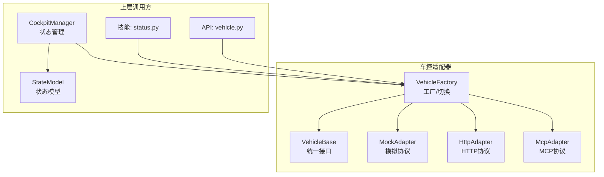
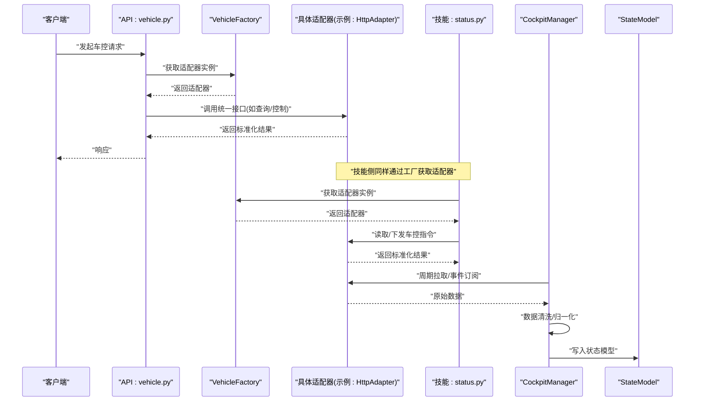
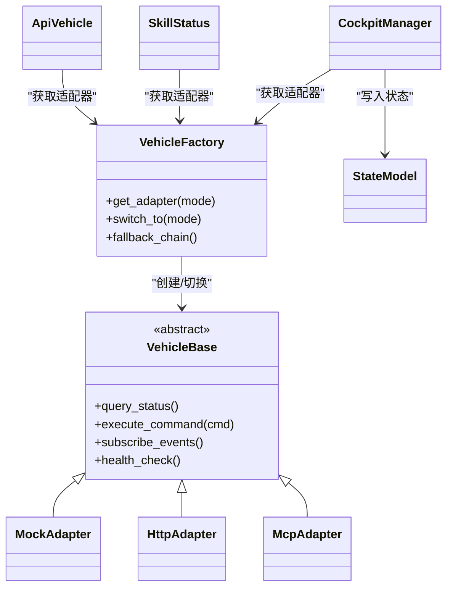

# 车控适配器模式

<cite>
**本文引用的文件**   
- [backend_design/nexus/vehicle/base.py](file://backend_design/nexus/vehicle/base.py)
- [backend_design/nexus/vehicle/factory.py](file://backend_design/nexus/vehicle/factory.py)
- [backend_design/nexus/vehicle/http.py](file://backend_design/nexus/vehicle/http.py)
- [backend_design/nexus/vehicle/mcp.py](file://backend_design/nexus/vehicle/mcp.py)
- [backend_design/nexus/vehicle/mock.py](file://backend_design/nexus/vehicle/mock.py)
- [backend_design/nexus/api/routes/vehicle.py](file://backend_design/nexus/api/routes/vehicle.py)
- [backend_design/nexus/core/cockpit_manager.py](file://backend_design/nexus/core/cockpit_manager.py)
- [backend_design/nexus/models/state.py](file://backend_design/nexus/models/state.py)
- [backend_design/nexus/skills/vehicle/status.py](file://backend_design/nexus/skills/vehicle/status.py)
</cite>

## 目录
1. [简介](#简介)
2. [项目结构](#项目结构)
3. [核心组件](#核心组件)
4. [架构总览](#架构总览)
5. [详细组件分析](#详细组件分析)
6. [依赖关系分析](#依赖关系分析)
7. [性能考量](#性能考量)
8. [故障排查指南](#故障排查指南)
9. [结论](#结论)
10. [附录：新协议适配开发指南与测试验证](#附录新协议适配开发指南与测试验证)

## 简介
本文件面向 NexusCockpit 的车控子系统，系统性阐述“多协议适配器”的设计与实现。该设计通过统一的抽象接口屏蔽底层差异，支持 Mock、HTTP、MCP 三种协议后端；上层业务（技能、API、状态同步）无需关心具体协议细节。文档重点覆盖：
- 统一接口抽象与协议切换机制
- VehicleFactory 工厂模式实现
- 数据格式转换与命令执行结果处理
- 车辆状态同步策略与异常恢复
- 新协议适配开发与测试验证方法

## 项目结构
车控相关代码集中在 backend_design/nexus/vehicle 目录，配合 API 路由、状态模型与技能层共同构成端到端链路。

图表来源
- [backend_design/nexus/vehicle/base.py](file://backend_design/nexus/vehicle/base.py)
- [backend_design/nexus/vehicle/factory.py](file://backend_design/nexus/vehicle/factory.py)
- [backend_design/nexus/vehicle/mock.py](file://backend_design/nexus/vehicle/mock.py)
- [backend_design/nexus/vehicle/http.py](file://backend_design/nexus/vehicle/http.py)
- [backend_design/nexus/vehicle/mcp.py](file://backend_design/nexus/vehicle/mcp.py)
- [backend_design/nexus/api/routes/vehicle.py](file://backend_design/nexus/api/routes/vehicle.py)
- [backend_design/nexus/core/cockpit_manager.py](file://backend_design/nexus/core/cockpit_manager.py)
- [backend_design/nexus/models/state.py](file://backend_design/nexus/models/state.py)
- [backend_design/nexus/skills/vehicle/status.py](file://backend_design/nexus/skills/vehicle/status.py)

章节来源
- [backend_design/nexus/vehicle/base.py](file://backend_design/nexus/vehicle/base.py)
- [backend_design/nexus/vehicle/factory.py](file://backend_design/nexus/vehicle/factory.py)
- [backend_design/nexus/vehicle/mock.py](file://backend_design/nexus/vehicle/mock.py)
- [backend_design/nexus/vehicle/http.py](file://backend_design/nexus/vehicle/http.py)
- [backend_design/nexus/vehicle/mcp.py](file://backend_design/nexus/vehicle/mcp.py)
- [backend_design/nexus/api/routes/vehicle.py](file://backend_design/nexus/api/routes/vehicle.py)
- [backend_design/nexus/core/cockpit_manager.py](file://backend_design/nexus/core/cockpit_manager.py)
- [backend_design/nexus/models/state.py](file://backend_design/nexus/models/state.py)
- [backend_design/nexus/skills/vehicle/status.py](file://backend_design/nexus/skills/vehicle/status.py)

## 核心组件
- 统一接口抽象（VehicleBase）
  - 定义所有协议必须实现的标准化能力，如查询车辆状态、下发控制指令、订阅事件等。
  - 为上层提供一致的方法签名与返回约定，屏蔽协议差异。
- 协议适配器
  - MockAdapter：本地模拟数据，便于联调与自动化测试。
  - HttpAdapter：基于 HTTP 的远程服务调用，负责请求构造、鉴权、重试与错误映射。
  - McpAdapter：基于 MCP 协议的网关交互，封装消息编解码与通道管理。
- 工厂与切换（VehicleFactory）
  - 根据配置或运行时上下文选择具体适配器实例。
  - 支持热切换与降级策略，保证在目标协议不可用时自动回退。
- 上层集成点
  - API 路由：对外暴露车控能力，统一入参校验与出参包装。
  - 技能层：以领域语义调用车控能力（如空调、座椅、车窗、媒体、导航）。
  - 状态管理：周期性拉取或事件驱动更新车辆状态，并持久化到状态模型。

章节来源
- [backend_design/nexus/vehicle/base.py](file://backend_design/nexus/vehicle/base.py)
- [backend_design/nexus/vehicle/factory.py](file://backend_design/nexus/vehicle/factory.py)
- [backend_design/nexus/vehicle/mock.py](file://backend_design/nexus/vehicle/mock.py)
- [backend_design/nexus/vehicle/http.py](file://backend_design/nexus/vehicle/http.py)
- [backend_design/nexus/vehicle/mcp.py](file://backend_design/nexus/vehicle/mcp.py)
- [backend_design/nexus/api/routes/vehicle.py](file://backend_design/nexus/api/routes/vehicle.py)
- [backend_design/nexus/skills/vehicle/status.py](file://backend_design/nexus/skills/vehicle/status.py)
- [backend_design/nexus/core/cockpit_manager.py](file://backend_design/nexus/core/cockpit_manager.py)
- [backend_design/nexus/models/state.py](file://backend_design/nexus/models/state.py)

## 架构总览
下图展示从 API 到适配器的完整调用链路与状态同步路径。

图表来源
- [backend_design/nexus/api/routes/vehicle.py](file://backend_design/nexus/api/routes/vehicle.py)
- [backend_design/nexus/vehicle/factory.py](file://backend_design/nexus/vehicle/factory.py)
- [backend_design/nexus/vehicle/http.py](file://backend_design/nexus/vehicle/http.py)
- [backend_design/nexus/skills/vehicle/status.py](file://backend_design/nexus/skills/vehicle/status.py)
- [backend_design/nexus/core/cockpit_manager.py](file://backend_design/nexus/core/cockpit_manager.py)
- [backend_design/nexus/models/state.py](file://backend_design/nexus/models/state.py)

## 详细组件分析

### 统一接口抽象（VehicleBase）
- 职责
  - 定义标准方法族：查询状态、下发控制、订阅事件、健康检查等。
  - 规范输入输出结构，确保各协议实现可被上层无差别调用。
- 设计要点
  - 使用抽象基类约束子类契约，避免方法名不一致导致的耦合。
  - 对返回值进行类型化约定，便于序列化与跨模块传递。
- 扩展性
  - 新增协议只需继承并实现抽象方法，无需改动上层逻辑。

章节来源
- [backend_design/nexus/vehicle/base.py](file://backend_design/nexus/vehicle/base.py)

### 协议适配器实现

#### MockAdapter（模拟协议）
- 用途
  - 快速验证流程、编写单测、演示功能。
- 特点
  - 返回预设或随机数据，不依赖外部系统。
  - 支持注入不同场景（正常、异常、延迟）以便压力与容错测试。

章节来源
- [backend_design/nexus/vehicle/mock.py](file://backend_design/nexus/vehicle/mock.py)

#### HttpAdapter（HTTP 协议）
- 职责
  - 将统一接口转换为 HTTP 请求，处理鉴权、超时、重试、错误码映射。
- 关键点
  - 请求构建：URL、Header、Body 组装。
  - 错误处理：网络异常、业务错误码、超时等统一转换为内部异常。
  - 幂等与重试：对安全读操作可启用指数退避重试。

章节来源
- [backend_design/nexus/vehicle/http.py](file://backend_design/nexus/vehicle/http.py)

#### McpAdapter（MCP 协议）
- 职责
  - 通过 MCP 网关与远端系统通信，封装消息编解码、会话管理与重连。
- 关键点
  - 消息协议适配：将统一接口调用转为 MCP 消息。
  - 连接管理：心跳、断线重连、限流与熔断。

章节来源
- [backend_design/nexus/vehicle/mcp.py](file://backend_design/nexus/vehicle/mcp.py)

### 工厂与协议切换（VehicleFactory）
- 职责
  - 根据配置或上下文创建并缓存适配器实例。
  - 提供动态切换与降级能力，保障高可用。
- 切换策略
  - 优先级：按配置顺序尝试多个后端，首个成功即返回。
  - 健康检查：定期探测后端可用性，失败则剔除。
  - 灰度/权重：可按比例分流至不同后端（可选）。
- 生命周期
  - 单例或按需创建，结合缓存减少重复初始化开销。

章节来源
- [backend_design/nexus/vehicle/factory.py](file://backend_design/nexus/vehicle/factory.py)

### 上层集成点

#### API 路由（vehicle.py）
- 职责
  - 接收外部请求，参数校验后委托给工厂获取适配器并调用。
  - 统一错误包装与日志记录。
- 典型流程
  - 解析入参 -> 获取适配器 -> 调用统一接口 -> 返回标准化响应。

章节来源
- [backend_design/nexus/api/routes/vehicle.py](file://backend_design/nexus/vehicle.py)

#### 技能层（status.py）
- 职责
  - 以领域语义调用车控能力（例如读取车辆状态）。
  - 通过工厂获取适配器，屏蔽协议细节。

章节来源
- [backend_design/nexus/skills/vehicle/status.py](file://backend_design/nexus/skills/vehicle/status.py)

#### 状态管理与模型（CockpitManager + StateModel）
- 职责
  - 周期拉取或事件驱动更新车辆状态，进行数据清洗与归一化。
  - 将最终状态写入 StateModel，供前端与其他模块消费。
- 同步策略
  - 定时轮询 + 事件推送混合模式。
  - 增量更新与冲突合并策略。

章节来源
- [backend_design/nexus/core/cockpit_manager.py](file://backend_design/nexus/core/cockpit_manager.py)
- [backend_design/nexus/models/state.py](file://backend_design/nexus/models/state.py)

## 依赖关系分析
- 耦合与内聚
  - 适配器之间相互独立，仅通过统一接口与上层交互，内聚度高、耦合度低。
  - 工厂集中管理实例化与切换逻辑，降低调用方复杂度。
- 外部依赖
  - HTTP 适配器依赖网络库与鉴权中间件。
  - MCP 适配器依赖网关 SDK 与连接池。
- 潜在循环依赖
  - 当前分层清晰，未见循环引用风险。

图表来源
- [backend_design/nexus/vehicle/base.py](file://backend_design/nexus/vehicle/base.py)
- [backend_design/nexus/vehicle/factory.py](file://backend_design/nexus/vehicle/factory.py)
- [backend_design/nexus/vehicle/mock.py](file://backend_design/nexus/vehicle/mock.py)
- [backend_design/nexus/vehicle/http.py](file://backend_design/nexus/vehicle/http.py)
- [backend_design/nexus/vehicle/mcp.py](file://backend_design/nexus/vehicle/mcp.py)
- [backend_design/nexus/api/routes/vehicle.py](file://backend_design/nexus/api/routes/vehicle.py)
- [backend_design/nexus/skills/vehicle/status.py](file://backend_design/nexus/skills/vehicle/status.py)
- [backend_design/nexus/core/cockpit_manager.py](file://backend_design/nexus/core/cockpit_manager.py)
- [backend_design/nexus/models/state.py](file://backend_design/nexus/models/state.py)

## 性能考量
- 连接复用与池化
  - HTTP/MCP 适配器应复用连接池，减少握手与建连开销。
- 超时与重试
  - 合理设置读写超时与重试次数，采用指数退避与抖动避免雪崩。
- 批量与增量
  - 状态同步优先增量更新，减少无效传输。
- 缓存
  - 热点状态短缓存，降低下游压力。
- 监控与指标
  - 记录成功率、时延、错误分布，支撑容量规划与问题定位。

## 故障排查指南
- 常见问题
  - 协议不可用：检查健康检查与降级策略是否生效。
  - 鉴权失败：核对 Token 有效期与权限范围。
  - 超时/重试风暴：调整超时阈值与重试上限，观察是否触发熔断。
  - 数据不一致：对比上游原始报文与归一化后的状态，定位转换逻辑。
- 建议手段
  - 开启调试日志与链路追踪。
  - 使用 MockAdapter 隔离外部依赖，复现问题。
  - 压测关键路径，验证稳定性与资源占用。

## 结论
通过统一接口抽象与工厂模式，NexusCockpit 实现了多协议车控能力的松耦合接入。Mock/HTTP/MCP 三种模式共享同一套调用契约，上层业务无需感知底层差异。配合状态同步策略与异常恢复机制，系统在可扩展性与可靠性方面具备良好基础。

## 附录：新协议适配开发指南与测试验证

### 开发步骤
- 新建适配器类
  - 继承统一接口抽象，实现必要方法。
  - 遵循输入输出约定，保持与现有适配器一致的行为语义。
- 注册到工厂
  - 在工厂中注册新协议标识与实例化逻辑。
  - 如需支持动态加载，提供插件式发现机制。
- 配置与切换
  - 在配置中心添加新协议选项，支持优先级与权重。
  - 实现健康检查与降级回退策略。
- 数据转换
  - 明确协议报文与内部模型的映射关系，编写转换与校验逻辑。
- 日志与可观测性
  - 记录关键节点日志与指标，便于排障与优化。

### 测试验证
- 单元测试
  - 针对每个适配器方法编写用例，覆盖正常、边界与异常分支。
  - 使用 MockAdapter 模拟外部依赖，确保测试稳定。
- 集成测试
  - 通过 API 路由端到端验证，确认协议切换与降级有效。
- 回归与压测
  - 引入混沌工程与长稳测试，验证稳定性与资源消耗。
- 验收清单
  - 功能正确性、性能达标、错误可观测、文档完备。