# L4 Agent层

<cite>
**本文引用的文件**   
- [supervisor_graph.py](file://backend_design/nexus/agent/supervisor_graph.py)
- [responder.py](file://backend_design/nexus/agent/responder.py)
- [reviewer.py](file://backend_design/nexus/agent/reviewer.py)
- [base.py](file://backend_design/nexus/agent/experts/base.py)
- [vehicle_expert.py](file://backend_design/nexus/agent/experts/vehicle_expert.py)
- [nav_expert.py](file://backend_design/nexus/agent/experts/nav_expert.py)
- [lifestyle_expert.py](file://backend_design/nexus/agent/experts/lifestyle_expert.py)
- [health_expert.py](file://backend_design/nexus/agent/experts/health_expert.py)
- [chat_expert.py](file://backend_design/nexus/agent/experts/chat_expert.py)
- [__init__.py](file://backend_design/nexus/agent/__init__.py)
- [__init__.py](file://backend_design/nexus/agent/experts/__init__.py)
- [state.py](file://backend_design/nexus/models/state.py)
- [schemas.py](file://backend_design/nexus/models/schemas.py)
- [cockpit_manager.py](file://backend_design/nexus/core/cockpit_manager.py)
- [llm_router.py](file://backend_design/nexus/intent/llm_router.py)
- [router.py](file://backend_design/nexus/intent/router.py)
- [orchestrator.py](file://backend_design/nexus/skills/orchestrator.py)
- [registry.py](file://backend_design/nexus/skills/registry.py)
- [task_queue.py](file://backend_design/nexus/middleware/task_queue.py)
- [session_store.py](file://backend_design/nexus/middleware/session_store.py)
- [redis_cache.py](file://backend_design/nexus/middleware/redis_cache.py)
- [langfuse.py](file://backend_design/nexus/observability/langfuse.py)
- [cockpit_metrics.py](file://backend_design/nexus/observability/cockpit_metrics.py)
</cite>

## 目录
1. [简介](#简介)
2. [项目结构](#项目结构)
3. [核心组件](#核心组件)
4. [架构总览](#架构总览)
5. [详细组件分析](#详细组件分析)
6. [依赖关系分析](#依赖关系分析)
7. [性能考虑](#性能考虑)
8. [故障排查指南](#故障排查指南)
9. [结论](#结论)
10. [附录](#附录)

## 简介
本文件面向 NexusCockpit 的 L4 Agent 层，系统性阐述多智能体协作架构与实现要点。内容覆盖：
- Supervisor 调度器：任务分发、负载均衡、结果汇总
- 专家Agent体系：车辆专家、导航专家、生活专家、健康专家、闲聊专家
- 反思校验机制：Review 阶段的质量控制与纠错
- LangGraph 工作流编排：有状态图管理与异步执行模型
- Agent 通信协议、消息传递机制与状态同步策略
- 自定义Agent开发指南与性能优化建议

## 项目结构
L4 Agent 层位于 backend_design/nexus/agent 及其子模块中，围绕“Supervisor + Experts + Reviewer”的多智能体协作模式组织代码，并通过 models/state.py 定义全局状态，通过 observability 进行可观测性埋点，借助 middleware 提供队列、会话与缓存能力。

```mermaid
graph TB
subgraph "Agent层"
SG["Supervisor 图<br/>supervisor_graph.py"]
RESP["响应器<br/>responder.py"]
REV["评审器<br/>reviewer.py"]
EXP_BASE["专家基类<br/>experts/base.py"]
EXP_V["车辆专家<br/>experts/vehicle_expert.py"]
EXP_N["导航专家<br/>experts/nav_expert.py"]
EXP_L["生活专家<br/>experts/lifestyle_expert.py"]
EXP_H["健康专家<br/>experts/health_expert.py"]
EXP_C["闲聊专家<br/>experts/chat_expert.py"]
end
subgraph "模型与意图"
STATE["状态模型<br/>models/state.py"]
SCHEMA["数据模式<br/>models/schemas.py"]
INTENT_LLM["LLM路由<br/>intent/llm_router.py"]
INTENT_ROUTER["规则路由<br/>intent/router.py"]
end
subgraph "技能编排"
SK_ORCH["技能编排器<br/>skills/orchestrator.py"]
SK_REG["技能注册表<br/>skills/registry.py"]
end
subgraph "中间件"
MQ["任务队列<br/>middleware/task_queue.py"]
SES["会话存储<br/>middleware/session_store.py"]
RC["Redis缓存<br/>middleware/redis_cache.py"]
end
subgraph "可观测性"
LF["Langfuse追踪<br/>observability/langfuse.py"]
MET["指标采集<br/>observability/cockpit_metrics.py"]
end
SG --> EXP_V
SG --> EXP_N
SG --> EXP_L
SG --> EXP_H
SG --> EXP_C
EXP_V --> EXP_BASE
EXP_N --> EXP_BASE
EXP_L --> EXP_BASE
EXP_H --> EXP_BASE
EXP_C --> EXP_BASE
SG --> STATE
SG --> SCHEMA
SG --> INTENT_LLM
SG --> INTENT_ROUTER
SG --> SK_ORCH
SG --> SK_REG
SG --> MQ
SG --> SES
SG --> RC
SG --> LF
SG --> MET
RESP --> STATE
REV --> STATE
```

图表来源
- [supervisor_graph.py](file://backend_design/nexus/agent/supervisor_graph.py)
- [responder.py](file://backend_design/nexus/agent/responder.py)
- [reviewer.py](file://backend_design/nexus/agent/reviewer.py)
- [base.py](file://backend_design/nexus/agent/experts/base.py)
- [vehicle_expert.py](file://backend_design/nexus/agent/experts/vehicle_expert.py)
- [nav_expert.py](file://backend_design/nexus/agent/experts/nav_expert.py)
- [lifestyle_expert.py](file://backend_design/nexus/agent/experts/lifestyle_expert.py)
- [health_expert.py](file://backend_design/nexus/agent/experts/health_expert.py)
- [chat_expert.py](file://backend_design/nexus/agent/experts/chat_expert.py)
- [state.py](file://backend_design/nexus/models/state.py)
- [schemas.py](file://backend_design/nexus/models/schemas.py)
- [llm_router.py](file://backend_design/nexus/intent/llm_router.py)
- [router.py](file://backend_design/nexus/intent/router.py)
- [orchestrator.py](file://backend_design/nexus/skills/orchestrator.py)
- [registry.py](file://backend_design/nexus/skills/registry.py)
- [task_queue.py](file://backend_design/nexus/middleware/task_queue.py)
- [session_store.py](file://backend_design/nexus/middleware/session_store.py)
- [redis_cache.py](file://backend_design/nexus/middleware/redis_cache.py)
- [langfuse.py](file://backend_design/nexus/observability/langfuse.py)
- [cockpit_metrics.py](file://backend_design/nexus/observability/cockpit_metrics.py)

章节来源
- [supervisor_graph.py](file://backend_design/nexus/agent/supervisor_graph.py)
- [responder.py](file://backend_design/nexus/agent/responder.py)
- [reviewer.py](file://backend_design/nexus/agent/reviewer.py)
- [base.py](file://backend_design/nexus/agent/experts/base.py)
- [vehicle_expert.py](file://backend_design/nexus/agent/experts/vehicle_expert.py)
- [nav_expert.py](file://backend_design/nexus/agent/experts/nav_expert.py)
- [lifestyle_expert.py](file://backend_design/nexus/agent/experts/lifestyle_expert.py)
- [health_expert.py](file://backend_design/nexus/agent/experts/health_expert.py)
- [chat_expert.py](file://backend_design/nexus/agent/experts/chat_expert.py)
- [state.py](file://backend_design/nexus/models/state.py)
- [schemas.py](file://backend_design/nexus/models/schemas.py)
- [llm_router.py](file://backend_design/nexus/intent/llm_router.py)
- [router.py](file://backend_design/nexus/intent/router.py)
- [orchestrator.py](file://backend_design/nexus/skills/orchestrator.py)
- [registry.py](file://backend_design/nexus/skills/registry.py)
- [task_queue.py](file://backend_design/nexus/middleware/task_queue.py)
- [session_store.py](file://backend_design/nexus/middleware/session_store.py)
- [redis_cache.py](file://backend_design/nexus/middleware/redis_cache.py)
- [langfuse.py](file://backend_design/nexus/observability/langfuse.py)
- [cockpit_metrics.py](file://backend_design/nexus/observability/cockpit_metrics.py)

## 核心组件
- Supervisor 调度器（supervisor_graph.py）
  - 职责：接收用户请求，解析意图，选择并调度专家节点；维护全局状态；汇聚各专家输出；触发评审与响应生成。
  - 关键特性：基于 LangGraph 的状态机编排；支持并行/串行混合执行；具备重试与降级路径。
- 专家Agent体系（experts/*）
  - 统一接口：所有专家继承自 base.py 定义的抽象基类，保证一致的输入输出契约与上下文访问方式。
  - 领域专家：
    - 车辆专家（vehicle_expert.py）：车控、车况、媒体、空调等。
    - 导航专家（nav_expert.py）：路线规划、POI搜索、路况信息。
    - 生活专家（lifestyle_expert.py）：日程、提醒、习惯、个性化推荐。
    - 健康专家（health_expert.py）：健康监测、运动建议、睡眠分析。
    - 闲聊专家（chat_expert.py）：对话陪伴、话题引导、情感交互。
- 评审器（reviewer.py）
  - 职责：对专家输出进行一致性、安全性、完整性校验；必要时触发修正或回退到备选方案。
- 响应器（responder.py）
  - 职责：将最终结果格式化为用户可见的响应，包括文本、结构化数据与多媒体提示。
- 状态与模式（models/state.py, models/schemas.py）
  - 全局状态：会话ID、用户画像、历史消息、当前任务、专家调用记录、错误与重试计数等。
  - 数据模式：统一的请求/响应Schema，确保跨组件序列化稳定。

章节来源
- [supervisor_graph.py](file://backend_design/nexus/agent/supervisor_graph.py)
- [base.py](file://backend_design/nexus/agent/experts/base.py)
- [vehicle_expert.py](file://backend_design/nexus/agent/experts/vehicle_expert.py)
- [nav_expert.py](file://backend_design/nexus/agent/experts/nav_expert.py)
- [lifestyle_expert.py](file://backend_design/nexus/agent/experts/lifestyle_expert.py)
- [health_expert.py](file://backend_design/nexus/agent/experts/health_expert.py)
- [chat_expert.py](file://backend_design/nexus/agent/experts/chat_expert.py)
- [reviewer.py](file://backend_design/nexus/agent/reviewer.py)
- [responder.py](file://backend_design/nexus/agent/responder.py)
- [state.py](file://backend_design/nexus/models/state.py)
- [schemas.py](file://backend_design/nexus/models/schemas.py)

## 架构总览
下图展示了从请求进入、意图识别、专家调度、结果聚合、评审校验到最终响应的完整链路，以及状态与可观测性的贯穿式支撑。

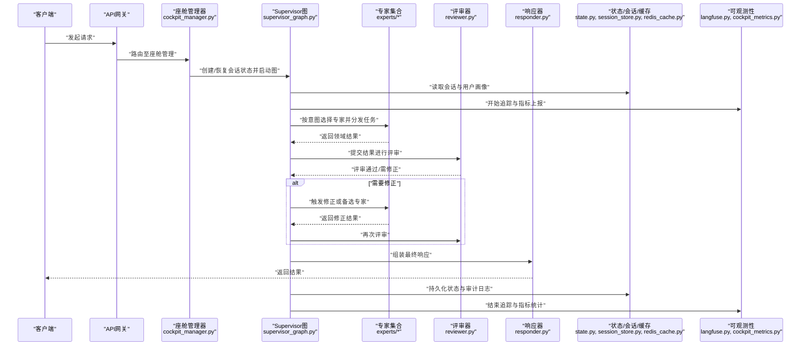

图表来源
- [cockpit_manager.py](file://backend_design/nexus/core/cockpit_manager.py)
- [supervisor_graph.py](file://backend_design/nexus/agent/supervisor_graph.py)
- [reviewer.py](file://backend_design/nexus/agent/reviewer.py)
- [responder.py](file://backend_design/nexus/agent/responder.py)
- [state.py](file://backend_design/nexus/models/state.py)
- [session_store.py](file://backend_design/nexus/middleware/session_store.py)
- [redis_cache.py](file://backend_design/nexus/middleware/redis_cache.py)
- [langfuse.py](file://backend_design/nexus/observability/langfuse.py)
- [cockpit_metrics.py](file://backend_design/nexus/observability/cockpit_metrics.py)

## 详细组件分析

### Supervisor 调度器（LangGraph 工作流编排）
- 设计要点
  - 使用 LangGraph 构建有状态图：节点代表专家或处理步骤，边代表条件分支与循环。
  - 状态管理：通过 state.py 中的状态对象在节点间传递，确保幂等与可恢复。
  - 异步执行：结合 Python 异步模型，支持并发调用多个专家，提升吞吐。
  - 负载均衡：根据负载指标（如队列长度、延迟分位数）动态选择专家实例或降级路径。
  - 结果汇总：采用合并策略（优先级、投票、加权平均）整合多专家输出。
- 关键流程
  - 入口：接收请求，初始化或恢复会话状态。
  - 意图识别：优先规则路由，其次 LLM 路由。
  - 专家调度：并行/串行组合，容错与重试。
  - 评审与修正：reviewer 校验后决定是否回退或二次调用。
  - 响应生成：responder 统一格式输出。
  - 收尾：持久化状态、上报指标与追踪。

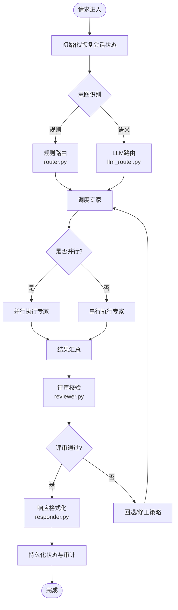

图表来源
- [supervisor_graph.py](file://backend_design/nexus/agent/supervisor_graph.py)
- [router.py](file://backend_design/nexus/intent/router.py)
- [llm_router.py](file://backend_design/nexus/intent/llm_router.py)
- [reviewer.py](file://backend_design/nexus/agent/reviewer.py)
- [responder.py](file://backend_design/nexus/agent/responder.py)
- [state.py](file://backend_design/nexus/models/state.py)

章节来源
- [supervisor_graph.py](file://backend_design/nexus/agent/supervisor_graph.py)
- [router.py](file://backend_design/nexus/intent/router.py)
- [llm_router.py](file://backend_design/nexus/intent/llm_router.py)
- [reviewer.py](file://backend_design/nexus/agent/reviewer.py)
- [responder.py](file://backend_design/nexus/agent/responder.py)
- [state.py](file://backend_design/nexus/models/state.py)

### 专家Agent体系与统一接口
- 统一接口（base.py）
  - 定义专家抽象方法：输入验证、上下文注入、执行逻辑、错误处理、元数据上报。
  - 约定状态字段：专家ID、版本、耗时、错误码、调试信息。
- 领域专家
  - 车辆专家（vehicle_expert.py）：对接车辆服务，执行车控指令，返回执行结果与状态。
  - 导航专家（nav_expert.py）：调用地图与导航服务，返回路线与POI信息。
  - 生活专家（lifestyle_expert.py）：读写用户偏好与习惯，生成个性化建议。
  - 健康专家（health_expert.py）：读取健康数据，给出分析与建议。
  - 闲聊专家（chat_expert.py）：生成自然对话回复，保持上下文连贯。
- 专家注册与发现
  - 通过 __init__.py 暴露专家工厂与注册表，便于动态加载与扩展。

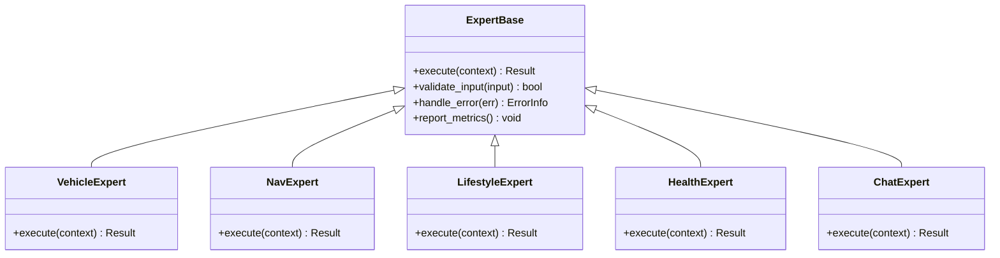

图表来源
- [base.py](file://backend_design/nexus/agent/experts/base.py)
- [vehicle_expert.py](file://backend_design/nexus/agent/experts/vehicle_expert.py)
- [nav_expert.py](file://backend_design/nexus/agent/experts/nav_expert.py)
- [lifestyle_expert.py](file://backend_design/nexus/agent/experts/lifestyle_expert.py)
- [health_expert.py](file://backend_design/nexus/agent/experts/health_expert.py)
- [chat_expert.py](file://backend_design/nexus/agent/experts/chat_expert.py)
- [__init__.py](file://backend_design/nexus/agent/experts/__init__.py)

章节来源
- [base.py](file://backend_design/nexus/agent/experts/base.py)
- [vehicle_expert.py](file://backend_design/nexus/agent/experts/vehicle_expert.py)
- [nav_expert.py](file://backend_design/nexus/agent/experts/nav_expert.py)
- [lifestyle_expert.py](file://backend_design/nexus/agent/experts/lifestyle_expert.py)
- [health_expert.py](file://backend_design/nexus/agent/experts/health_expert.py)
- [chat_expert.py](file://backend_design/nexus/agent/experts/chat_expert.py)
- [__init__.py](file://backend_design/nexus/agent/experts/__init__.py)

### 反思校验机制（Reviewer）
- 校验维度
  - 一致性：与用户意图、上下文约束一致。
  - 安全性：敏感词过滤、权限校验、越权拦截。
  - 完整性：必要字段齐全、格式正确、无缺失数据。
- 处理策略
  - 通过则进入响应器。
  - 不通过则触发修正或回退到备选专家/默认策略。
  - 记录评审详情用于审计与训练反馈。

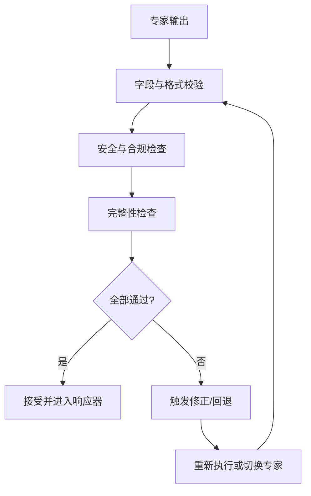

图表来源
- [reviewer.py](file://backend_design/nexus/agent/reviewer.py)
- [responder.py](file://backend_design/nexus/agent/responder.py)

章节来源
- [reviewer.py](file://backend_design/nexus/agent/reviewer.py)
- [responder.py](file://backend_design/nexus/agent/responder.py)

### 状态同步与消息传递机制
- 全局状态（state.py）
  - 会话级：会话ID、用户ID、语言偏好、时间戳。
  - 任务级：当前意图、已选专家、调用次数、错误计数。
  - 结果级：专家输出列表、评审结果、最终响应。
- 会话存储（session_store.py）
  - 提供会话的创建、更新、查询与过期清理。
- Redis缓存（redis_cache.py）
  - 热点数据缓存（如用户画像、常用配置），降低重复计算与外部依赖压力。
- 消息传递
  - 内部以状态对象为消息载体，避免冗余序列化。
  - 跨进程/服务时采用 schemas.py 定义的统一数据结构。

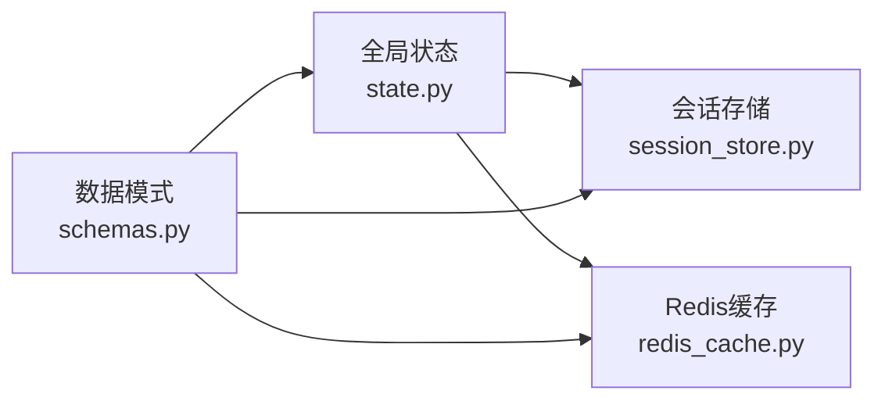

图表来源
- [state.py](file://backend_design/nexus/models/state.py)
- [session_store.py](file://backend_design/nexus/middleware/session_store.py)
- [redis_cache.py](file://backend_design/nexus/middleware/redis_cache.py)
- [schemas.py](file://backend_design/nexus/models/schemas.py)

章节来源
- [state.py](file://backend_design/nexus/models/state.py)
- [session_store.py](file://backend_design/nexus/middleware/session_store.py)
- [redis_cache.py](file://backend_design/nexus/middleware/redis_cache.py)
- [schemas.py](file://backend_design/nexus/models/schemas.py)

### 意图识别与路由
- 规则路由（router.py）
  - 基于关键词、正则、白名单快速匹配，适合高频、确定性场景。
- LLM路由（llm_router.py）
  - 利用大模型进行语义理解与分类，适合复杂、模糊意图。
- 决策融合
  - 先规则后LLM，或加权投票，兼顾速度与准确率。

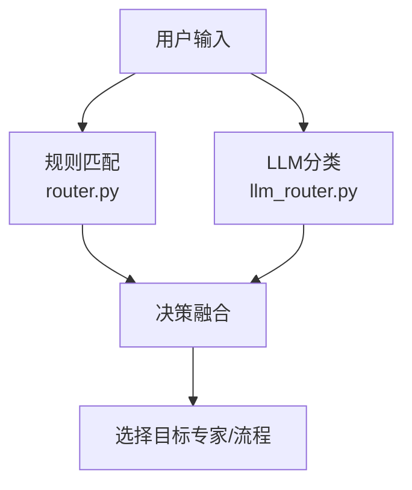

图表来源
- [router.py](file://backend_design/nexus/intent/router.py)
- [llm_router.py](file://backend_design/nexus/intent/llm_router.py)

章节来源
- [router.py](file://backend_design/nexus/intent/router.py)
- [llm_router.py](file://backend_design/nexus/intent/llm_router.py)

### 技能编排与工具集成
- 编排器（orchestrator.py）
  - 负责将多个技能（如车控、导航、健康）组合成端到端流程。
- 注册表（registry.py）
  - 统一管理技能版本、依赖、参数校验与生命周期。
- 与专家协作
  - 专家可调用技能编排器执行复合任务，提高复用性与可维护性。

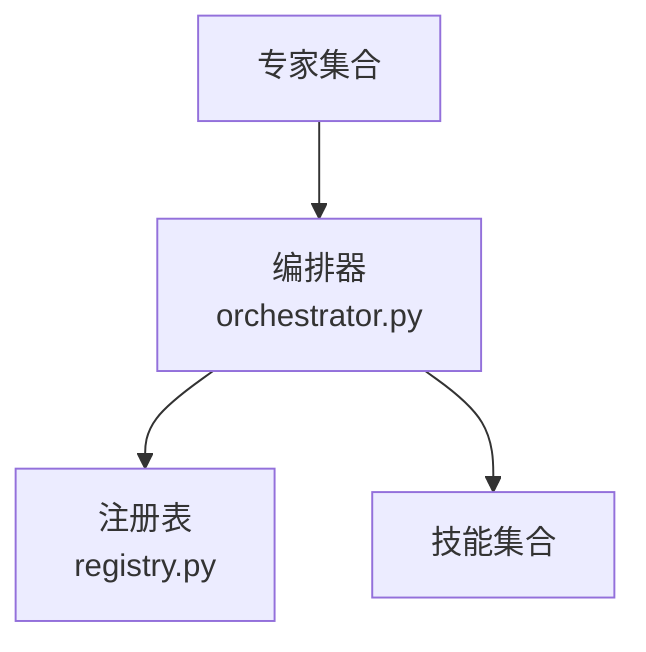

图表来源
- [orchestrator.py](file://backend_design/nexus/skills/orchestrator.py)
- [registry.py](file://backend_design/nexus/skills/registry.py)

章节来源
- [orchestrator.py](file://backend_design/nexus/skills/orchestrator.py)
- [registry.py](file://backend_design/nexus/skills/registry.py)

### 任务队列与异步执行
- 任务队列（task_queue.py）
  - 削峰填谷、背压控制、重试与死信队列。
- 异步模型
  - 基于事件驱动的异步执行，减少阻塞，提升并发度。
- 与Supervisor集成
  - 将专家调用放入队列，Supervisor等待结果并汇总。

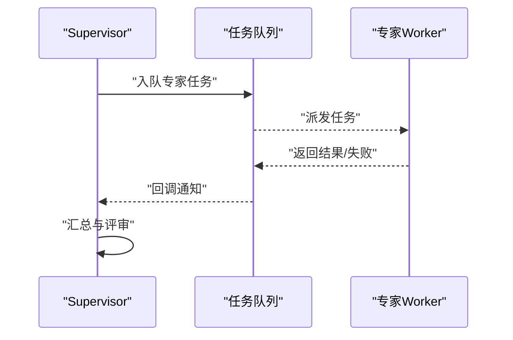

图表来源
- [task_queue.py](file://backend_design/nexus/middleware/task_queue.py)
- [supervisor_graph.py](file://backend_design/nexus/agent/supervisor_graph.py)

章节来源
- [task_queue.py](file://backend_design/nexus/middleware/task_queue.py)
- [supervisor_graph.py](file://backend_design/nexus/agent/supervisor_graph.py)

### 可观测性与度量
- Langfuse追踪（langfuse.py）
  - 记录节点执行轨迹、输入输出、耗时与错误。
- 指标采集（cockpit_metrics.py）
  - 暴露QPS、P99延迟、错误率、专家调用分布等指标。
- 与Supervisor集成
  - 在每个节点前后打点，形成端到端链路视图。

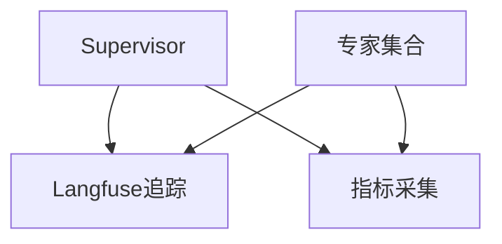

图表来源
- [langfuse.py](file://backend_design/nexus/observability/langfuse.py)
- [cockpit_metrics.py](file://backend_design/nexus/observability/cockpit_metrics.py)
- [supervisor_graph.py](file://backend_design/nexus/agent/supervisor_graph.py)

章节来源
- [langfuse.py](file://backend_design/nexus/observability/langfuse.py)
- [cockpit_metrics.py](file://backend_design/nexus/observability/cockpit_metrics.py)
- [supervisor_graph.py](file://backend_design/nexus/agent/supervisor_graph.py)

## 依赖关系分析
- 组件耦合
  - Supervisor 强依赖状态模型与意图路由；弱依赖专家实现（通过统一接口）。
  - 专家之间解耦，仅通过状态与评审器交互。
- 外部依赖
  - 中间件：任务队列、会话存储、Redis缓存。
  - 可观测性：Langfuse、Prometheus/Grafana（通过指标导出）。
- 潜在循环依赖
  - 通过接口隔离与分层避免循环引用；专家不直接依赖Supervisor，仅通过状态与评审器。

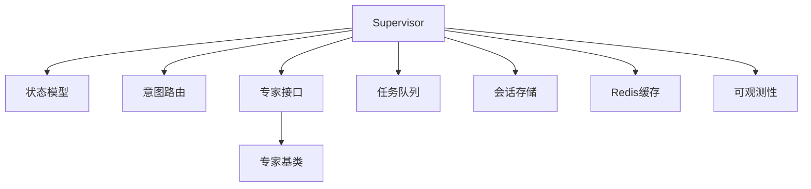

图表来源
- [supervisor_graph.py](file://backend_design/nexus/agent/supervisor_graph.py)
- [state.py](file://backend_design/nexus/models/state.py)
- [router.py](file://backend_design/nexus/intent/router.py)
- [llm_router.py](file://backend_design/nexus/intent/llm_router.py)
- [base.py](file://backend_design/nexus/agent/experts/base.py)
- [task_queue.py](file://backend_design/nexus/middleware/task_queue.py)
- [session_store.py](file://backend_design/nexus/middleware/session_store.py)
- [redis_cache.py](file://backend_design/nexus/middleware/redis_cache.py)
- [langfuse.py](file://backend_design/nexus/observability/langfuse.py)
- [cockpit_metrics.py](file://backend_design/nexus/observability/cockpit_metrics.py)

章节来源
- [supervisor_graph.py](file://backend_design/nexus/agent/supervisor_graph.py)
- [state.py](file://backend_design/nexus/models/state.py)
- [router.py](file://backend_design/nexus/intent/router.py)
- [llm_router.py](file://backend_design/nexus/intent/llm_router.py)
- [base.py](file://backend_design/nexus/agent/experts/base.py)
- [task_queue.py](file://backend_design/nexus/middleware/task_queue.py)
- [session_store.py](file://backend_design/nexus/middleware/session_store.py)
- [redis_cache.py](file://backend_design/nexus/middleware/redis_cache.py)
- [langfuse.py](file://backend_design/nexus/observability/langfuse.py)
- [cockpit_metrics.py](file://backend_design/nexus/observability/cockpit_metrics.py)

## 性能考虑
- 并发与批处理
  - 对独立专家调用采用并发执行；对顺序依赖严格串行。
  - 批量操作合并以减少外部系统往返。
- 缓存与预取
  - 热点数据（用户画像、常用配置）缓存于Redis；按需预取导航与天气等数据。
- 限流与熔断
  - 在专家调用前设置速率限制；异常比例高时自动熔断并降级。
- 资源隔离
  - 不同专家使用独立线程池或进程池，避免相互影响。
- 监控与调优
  - 基于Langfuse与指标系统定位瓶颈；针对P99延迟优化慢路径。

[本节为通用指导，无需具体文件分析]

## 故障排查指南
- 常见问题
  - 意图识别不准：检查规则与LLM路由权重，查看Langfuse链路。
  - 专家超时或失败：查看任务队列积压与重试计数，确认外部依赖健康。
  - 评审频繁拒绝：审查安全策略与完整性校验规则，调整阈值。
  - 状态不一致：核对会话存储与缓存一致性，检查幂等键。
- 诊断手段
  - 启用详细日志与追踪；导出指标到Grafana。
  - 复现用例最小化，逐步隔离问题域。
  - 使用Mock替代外部依赖，验证内部逻辑。

章节来源
- [langfuse.py](file://backend_design/nexus/observability/langfuse.py)
- [cockpit_metrics.py](file://backend_design/nexus/observability/cockpit_metrics.py)
- [task_queue.py](file://backend_design/nexus/middleware/task_queue.py)
- [session_store.py](file://backend_design/nexus/middleware/session_store.py)
- [redis_cache.py](file://backend_design/nexus/middleware/redis_cache.py)

## 结论
NexusCockpit 的 L4 Agent 层通过 Supervisor 调度器、专家体系与评审机制构建了灵活、可扩展的多智能体协作架构。依托 LangGraph 的有状态图与异步执行模型，系统在吞吐、可靠性与可观测性方面具备良好表现。遵循统一接口与状态契约，开发者可快速扩展新专家与技能，满足多样化车载场景需求。

[本节为总结，无需具体文件分析]

## 附录

### 自定义Agent开发指南
- 步骤
  - 新建专家类，继承 base.py 的抽象基类，实现 execute、validate_input、handle_error 等方法。
  - 在 experts/__init__.py 中注册新专家，确保能被Supervisor发现。
  - 编写单元测试，覆盖正常、异常与边界情况。
  - 接入可观测性：在 execute 前后上报指标与追踪。
- 最佳实践
  - 保持幂等：相同输入应产生相同输出。
  - 明确错误码：便于评审与回退策略处理。
  - 控制副作用：对外部系统的写入需幂等与补偿。
  - 文档化输入输出：遵循 schemas.py 的数据模式。

章节来源
- [base.py](file://backend_design/nexus/agent/experts/base.py)
- [__init__.py](file://backend_design/nexus/agent/experts/__init__.py)
- [schemas.py](file://backend_design/nexus/models/schemas.py)
- [langfuse.py](file://backend_design/nexus/observability/langfuse.py)
- [cockpit_metrics.py](file://backend_design/nexus/observability/cockpit_metrics.py)

### 性能优化清单
- 启用专家并行执行与批处理。
- 合理设置缓存TTL与预热策略。
- 引入熔断与降级路径，保障核心功能可用。
- 定期分析Langfuse链路，优化慢节点。
- 对热点专家实施限流与弹性扩容。

[本节为通用指导，无需具体文件分析]