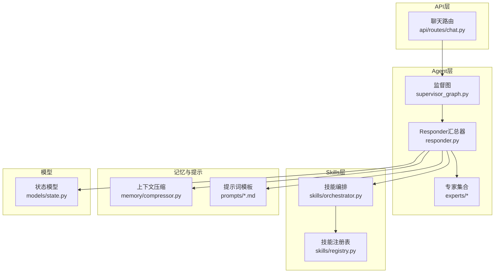
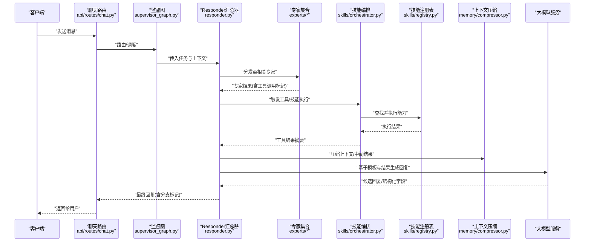
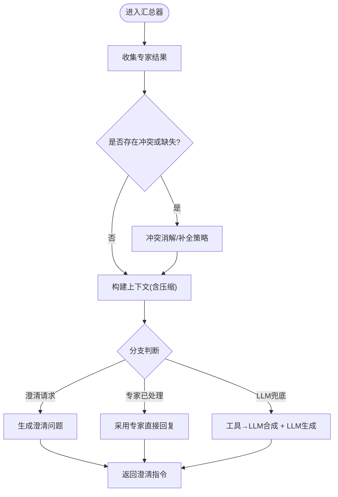
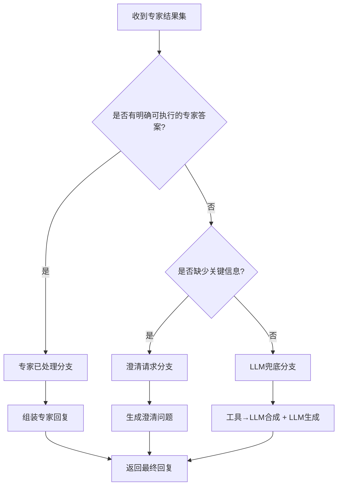
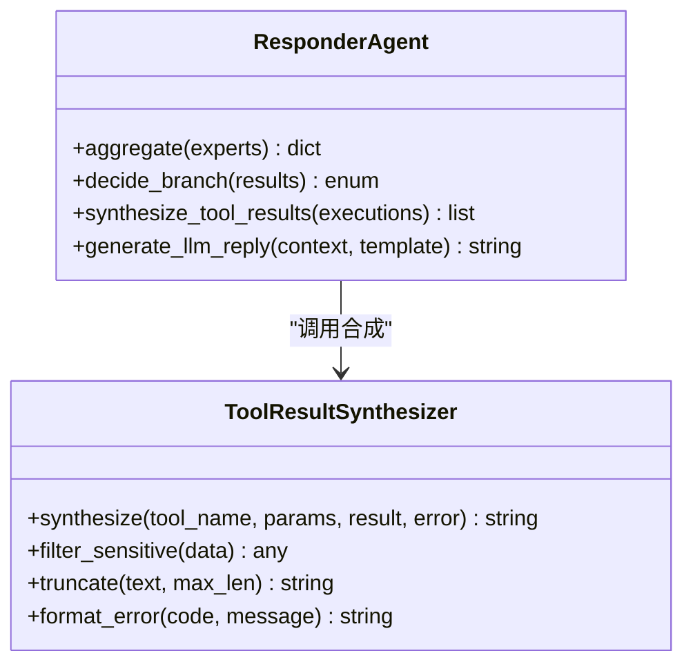
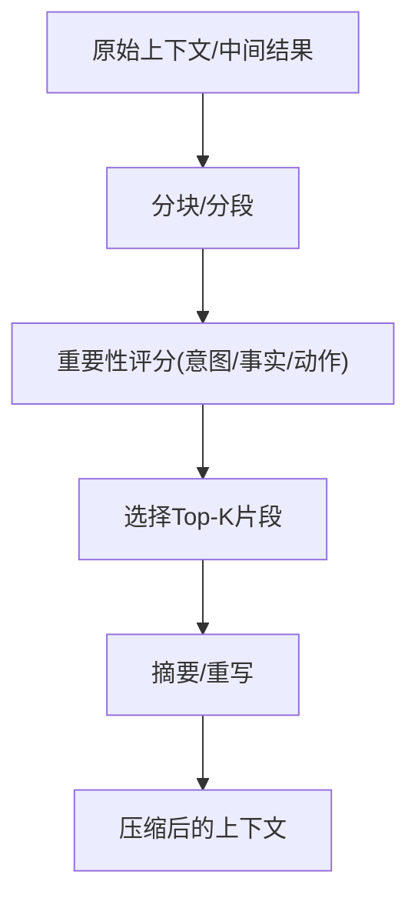
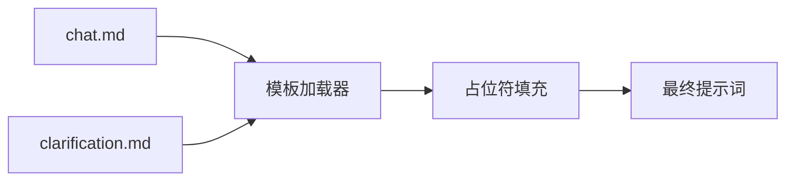
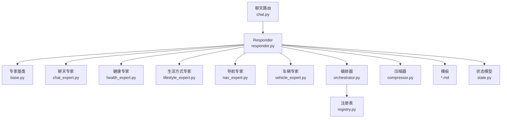

# Responder汇总器

<cite>
**本文引用的文件**   
- [responder.py](file://backend_design/nexus/agent/responder.py)
- [supervisor_graph.py](file://backend_design/nexus/agent/supervisor_graph.py)
- [base.py](file://backend_design/nexus/agent/experts/base.py)
- [chat_expert.py](file://backend_design/nexus/agent/experts/chat_expert.py)
- [health_expert.py](file://backend_design/nexus/agent/experts/health_expert.py)
- [lifestyle_expert.py](file://backend_design/nexus/agent/experts/lifestyle_expert.py)
- [nav_expert.py](file://backend_design/nexus/agent/experts/nav_expert.py)
- [vehicle_expert.py](file://backend_design/nexus/agent/experts/vehicle_expert.py)
- [orchestrator.py](file://backend_design/nexus/skills/orchestrator.py)
- [registry.py](file://backend_design/nexus/skills/registry.py)
- [memory/compressor.py](file://backend_design/nexus/memory/compressor.py)
- [prompts/chat.md](file://backend_design/nexus/prompts/chat.md)
- [prompts/clarification.md](file://backend_design/nexus/prompts/clarification.md)
- [models/state.py](file://backend_design/nexus/models/state.py)
- [api/routes/chat.py](file://backend_design/nexus/api/routes/chat.py)
</cite>

## 目录
1. [简介](#简介)
2. [项目结构](#项目结构)
3. [核心组件](#核心组件)
4. [架构总览](#架构总览)
5. [详细组件分析](#详细组件分析)
6. [依赖关系分析](#依赖关系分析)
7. [性能考量](#性能考量)
8. [故障排查指南](#故障排查指南)
9. [结论](#结论)
10. [附录](#附录)

## 简介
本文件面向 NexusCockpit 的 Responder 汇总器，聚焦 ResponderAgent 的核心职责与实现要点：多专家结果汇总、LLM 响应生成、工具→LLM 合成机制；并详细说明三种分支处理逻辑（澄清请求、专家已处理、LLM兜底）以及 v2.2 增强的工具结果自然语言合成。同时覆盖上下文压缩、提示词模板管理与响应质量优化策略，帮助读者快速理解从“专家产出”到“最终用户可见回复”的完整链路。

## 项目结构
Responder 汇总器位于 agent 层，负责编排专家输出、调用 LLM 进行综合与合成，并与上层 API 路由及状态模型交互。关键位置如下：
- 汇总器入口与主流程：agent/responder.py
- 专家基类与各领域专家：agent/experts/base.py 及各 expert 实现
- 技能编排与注册：skills/orchestrator.py、skills/registry.py
- 上下文压缩：memory/compressor.py
- 提示词模板：prompts/chat.md、prompts/clarification.md
- 状态模型：models/state.py
- 外部接入点：api/routes/chat.py

图表来源
- [responder.py](file://backend_design/nexus/agent/responder.py)
- [supervisor_graph.py](file://backend_design/nexus/agent/supervisor_graph.py)
- [base.py](file://backend_design/nexus/agent/experts/base.py)
- [chat_expert.py](file://backend_design/nexus/agent/experts/chat_expert.py)
- [health_expert.py](file://backend_design/nexus/agent/experts/health_expert.py)
- [lifestyle_expert.py](file://backend_design/nexus/agent/experts/lifestyle_expert.py)
- [nav_expert.py](file://backend_design/nexus/agent/experts/nav_expert.py)
- [vehicle_expert.py](file://backend_design/nexus/agent/experts/vehicle_expert.py)
- [orchestrator.py](file://backend_design/nexus/skills/orchestrator.py)
- [registry.py](file://backend_design/nexus/skills/registry.py)
- [compressor.py](file://backend_design/nexus/memory/compressor.py)
- [chat.md](file://backend_design/nexus/prompts/chat.md)
- [clarification.md](file://backend_design/nexus/prompts/clarification.md)
- [state.py](file://backend_design/nexus/models/state.py)
- [chat.py](file://backend_design/nexus/api/routes/chat.py)

章节来源
- [responder.py](file://backend_design/nexus/agent/responder.py)
- [supervisor_graph.py](file://backend_design/nexus/agent/supervisor_graph.py)
- [base.py](file://backend_design/nexus/agent/experts/base.py)
- [chat_expert.py](file://backend_design/nexus/agent/experts/chat_expert.py)
- [health_expert.py](file://backend_design/nexus/agent/experts/health_expert.py)
- [lifestyle_expert.py](file://backend_design/nexus/agent/experts/lifestyle_expert.py)
- [nav_expert.py](file://backend_design/nexus/agent/experts/nav_expert.py)
- [vehicle_expert.py](file://backend_design/nexus/agent/experts/vehicle_expert.py)
- [orchestrator.py](file://backend_design/nexus/skills/orchestrator.py)
- [registry.py](file://backend_design/nexus/skills/registry.py)
- [compressor.py](file://backend_design/nexus/memory/compressor.py)
- [chat.md](file://backend_design/nexus/prompts/chat.md)
- [clarification.md](file://backend_design/nexus/prompts/clarification.md)
- [state.py](file://backend_design/nexus/models/state.py)
- [chat.py](file://backend_design/nexus/api/routes/chat.py)

## 核心组件
- ResponderAgent（汇总器）
  - 职责：汇聚各专家输出，驱动 LLM 生成最终回复；在需要时发起澄清；当专家未覆盖时走 LLM 兜底；对工具执行结果进行自然语言合成（v2.2增强）。
  - 输入：来自监督图的意图/任务描述、专家结果集、上下文窗口、提示词模板、状态对象。
  - 输出：面向用户的文本回复（可能包含结构化字段，如是否需要澄清、是否由专家直接返回等）。
- 专家体系
  - 基类定义统一接口与元数据；具体专家按领域实现（聊天、健康、生活方式、导航、车辆等）。
- 技能编排与注册
  - 编排器负责将工具/技能与专家或汇总阶段衔接；注册表维护可用能力清单。
- 上下文压缩
  - 在长对话或多专家并行后，对历史与中间结果进行压缩，控制 LLM 输入长度与成本。
- 提示词模板管理
  - 使用 .md 模板集中管理不同阶段的提示词（如通用聊天、澄清引导），便于版本化与本地化。
- 状态模型
  - 承载会话级信息（如当前分支、专家命中情况、工具执行摘要等），供汇总器决策。

章节来源
- [responder.py](file://backend_design/nexus/agent/responder.py)
- [base.py](file://backend_design/nexus/agent/experts/base.py)
- [chat_expert.py](file://backend_design/nexus/agent/experts/chat_expert.py)
- [health_expert.py](file://backend_design/nexus/agent/experts/health_expert.py)
- [lifestyle_expert.py](file://backend_design/nexus/agent/experts/lifestyle_expert.py)
- [nav_expert.py](file://backend_design/nexus/agent/experts/nav_expert.py)
- [vehicle_expert.py](file://backend_design/nexus/agent/experts/vehicle_expert.py)
- [orchestrator.py](file://backend_design/nexus/skills/orchestrator.py)
- [registry.py](file://backend_design/nexus/skills/registry.py)
- [compressor.py](file://backend_design/nexus/memory/compressor.py)
- [chat.md](file://backend_design/nexus/prompts/chat.md)
- [clarification.md](file://backend_design/nexus/prompts/clarification.md)
- [state.py](file://backend_design/nexus/models/state.py)

## 架构总览
下图展示了从 API 到 Responder 汇总器的端到端流程，包括专家并行、工具执行、LLM 合成与分支决策。

图表来源
- [chat.py](file://backend_design/nexus/api/routes/chat.py)
- [supervisor_graph.py](file://backend_design/nexus/agent/supervisor_graph.py)
- [responder.py](file://backend_design/nexus/agent/responder.py)
- [base.py](file://backend_design/nexus/agent/experts/base.py)
- [chat_expert.py](file://backend_design/nexus/agent/experts/chat_expert.py)
- [health_expert.py](file://backend_design/nexus/agent/experts/health_expert.py)
- [lifestyle_expert.py](file://backend_design/nexus/agent/experts/lifestyle_expert.py)
- [nav_expert.py](file://backend_design/nexus/agent/experts/nav_expert.py)
- [vehicle_expert.py](file://backend_design/nexus/agent/experts/vehicle_expert.py)
- [orchestrator.py](file://backend_design/nexus/skills/orchestrator.py)
- [registry.py](file://backend_design/nexus/skills/registry.py)
- [compressor.py](file://backend_design/nexus/memory/compressor.py)

## 详细组件分析

### ResponderAgent 核心功能
- 多专家结果汇总
  - 聚合各专家的结构化输出，去重与冲突消解，形成统一的“事实+动作”视图。
- LLM 响应生成
  - 根据模板与上下文，组织提示词，调用 LLM 生成自然语言回复；支持结构化字段（如是否需要澄清、是否专家已处理等）。
- Tool→LLM 合成机制（v2.2增强）
  - 将工具执行结果（参数、返回值、错误码等）转换为可读的自然语言摘要，再注入到 LLM 提示中，提升最终回复的可解释性与可用性。

图表来源
- [responder.py](file://backend_design/nexus/agent/responder.py)
- [chat.md](file://backend_design/nexus/prompts/chat.md)
- [clarification.md](file://backend_design/nexus/prompts/clarification.md)
- [compressor.py](file://backend_design/nexus/memory/compressor.py)

章节来源
- [responder.py](file://backend_design/nexus/agent/responder.py)
- [chat.md](file://backend_design/nexus/prompts/chat.md)
- [clarification.md](file://backend_design/nexus/prompts/clarification.md)
- [compressor.py](file://backend_design/nexus/memory/compressor.py)

### 三种分支处理逻辑
- 分支一：澄清请求
  - 当专家结果存在关键缺失或歧义时，汇总器依据澄清模板生成追问，避免盲目执行或给出模糊答案。
- 分支二：专家已处理
  - 若某专家能独立完成任务且无需进一步工具执行，则直接采用其回复，减少 LLM 调用与延迟。
- 分支三：LLM兜底
  - 当无专家命中或专家仅返回工具调用计划时，汇总器通过工具→LLM合成机制，将工具结果转译为自然语言，再由 LLM 生成最终回复。

图表来源
- [responder.py](file://backend_design/nexus/agent/responder.py)
- [chat.md](file://backend_design/nexus/prompts/chat.md)
- [clarification.md](file://backend_design/nexus/prompts/clarification.md)

章节来源
- [responder.py](file://backend_design/nexus/agent/responder.py)
- [chat.md](file://backend_design/nexus/prompts/chat.md)
- [clarification.md](file://backend_design/nexus/prompts/clarification.md)

### v2.2 增强的工具结果自然语言合成
- 目标：将工具执行结果（成功/失败、参数、返回体片段、错误码等）转化为简洁、可读、面向用户的自然语言摘要。
- 关键点：
  - 结构化转语义：将键值对、列表、错误码映射为人类可读短语。
  - 安全过滤：屏蔽敏感字段与冗余日志。
  - 长度控制：限制摘要长度，避免污染上下文窗口。
  - 可插拔策略：允许按工具类型定制合成规则。

图表来源
- [responder.py](file://backend_design/nexus/agent/responder.py)
- [orchestrator.py](file://backend_design/nexus/skills/orchestrator.py)
- [registry.py](file://backend_design/nexus/skills/registry.py)

章节来源
- [responder.py](file://backend_design/nexus/agent/responder.py)
- [orchestrator.py](file://backend_design/nexus/skills/orchestrator.py)
- [registry.py](file://backend_design/nexus/skills/registry.py)

### 上下文压缩
- 目的：在多专家并行与工具执行后，控制上下文大小，降低 LLM 调用成本与超时风险。
- 策略：
  - 滑动窗口：保留最近 N 轮对话与关键摘要。
  - 摘要抽取：对长文档/工具结果进行要点提取。
  - 去重合并：合并重复信息与相近语义片段。
  - 优先级：优先保留用户意图、约束条件与关键事实。

图表来源
- [compressor.py](file://backend_design/nexus/memory/compressor.py)
- [responder.py](file://backend_design/nexus/agent/responder.py)

章节来源
- [compressor.py](file://backend_design/nexus/memory/compressor.py)
- [responder.py](file://backend_design/nexus/agent/responder.py)

### 提示词模板管理
- 模板分类：
  - 通用聊天模板：用于日常问答与闲聊。
  - 澄清模板：用于生成追问与确认性提问。
  - 其他领域模板：可按需扩展。
- 管理方式：
  - 以 .md 文件形式存放，便于版本控制与本地化。
  - 运行时加载并按占位符填充（如用户意图、专家结果、工具摘要等）。

图表来源
- [chat.md](file://backend_design/nexus/prompts/chat.md)
- [clarification.md](file://backend_design/nexus/prompts/clarification.md)
- [responder.py](file://backend_design/nexus/agent/responder.py)

章节来源
- [chat.md](file://backend_design/nexus/prompts/chat.md)
- [clarification.md](file://backend_design/nexus/prompts/clarification.md)
- [responder.py](file://backend_design/nexus/agent/responder.py)

### 响应质量优化策略
- 一致性：通过模板与结构化字段约束，保证风格与格式稳定。
- 可解释性：工具→LLM合成让最终回复具备“证据链”。
- 鲁棒性：澄清分支拦截不确定场景；专家已处理分支减少不必要的 LLM 调用。
- 效率：上下文压缩与缓存策略降低延迟与成本。
- 可观测性：结合状态模型记录分支路径与关键指标，便于回溯与调优。

章节来源
- [responder.py](file://backend_design/nexus/agent/responder.py)
- [state.py](file://backend_design/nexus/models/state.py)

## 依赖关系分析
- 模块耦合
  - Responder 强依赖专家接口与技能编排；弱依赖 LLM 与压缩器。
  - 专家之间通过基类解耦，新增领域只需实现基类接口。
  - 模板与状态模型作为配置与契约，降低硬编码耦合。
- 外部集成点
  - API 路由提供 HTTP/WebSocket 接入。
  - 技能注册表暴露工具能力，供编排器动态发现与调用。

图表来源
- [responder.py](file://backend_design/nexus/agent/responder.py)
- [base.py](file://backend_design/nexus/agent/experts/base.py)
- [chat_expert.py](file://backend_design/nexus/agent/experts/chat_expert.py)
- [health_expert.py](file://backend_design/nexus/agent/experts/health_expert.py)
- [lifestyle_expert.py](file://backend_design/nexus/agent/experts/lifestyle_expert.py)
- [nav_expert.py](file://backend_design/nexus/agent/experts/nav_expert.py)
- [vehicle_expert.py](file://backend_design/nexus/agent/experts/vehicle_expert.py)
- [orchestrator.py](file://backend_design/nexus/skills/orchestrator.py)
- [registry.py](file://backend_design/nexus/skills/registry.py)
- [compressor.py](file://backend_design/nexus/memory/compressor.py)
- [chat.md](file://backend_design/nexus/prompts/chat.md)
- [clarification.md](file://backend_design/nexus/prompts/clarification.md)
- [state.py](file://backend_design/nexus/models/state.py)
- [chat.py](file://backend_design/nexus/api/routes/chat.py)

章节来源
- [responder.py](file://backend_design/nexus/agent/responder.py)
- [base.py](file://backend_design/nexus/agent/experts/base.py)
- [chat_expert.py](file://backend_design/nexus/agent/experts/chat_expert.py)
- [health_expert.py](file://backend_design/nexus/agent/experts/health_expert.py)
- [lifestyle_expert.py](file://backend_design/nexus/agent/experts/lifestyle_expert.py)
- [nav_expert.py](file://backend_design/nexus/agent/experts/nav_expert.py)
- [vehicle_expert.py](file://backend_design/nexus/agent/experts/vehicle_expert.py)
- [orchestrator.py](file://backend_design/nexus/skills/orchestrator.py)
- [registry.py](file://backend_design/nexus/skills/registry.py)
- [compressor.py](file://backend_design/nexus/memory/compressor.py)
- [chat.md](file://backend_design/nexus/prompts/chat.md)
- [clarification.md](file://backend_design/nexus/prompts/clarification.md)
- [state.py](file://backend_design/nexus/models/state.py)
- [chat.py](file://backend_design/nexus/api/routes/chat.py)

## 性能考量
- 并行化：专家调用尽量并发执行，缩短整体时延。
- 上下文裁剪：合理设置压缩阈值与窗口大小，避免 LLM 输入过长。
- 模板复用：预编译模板与占位符替换，减少运行时开销。
- 降级策略：当 LLM 不可用时，回退到专家直返或默认话术。
- 资源监控：结合状态模型与可观测性指标，定位瓶颈。

[本节为通用指导，不直接分析具体文件]

## 故障排查指南
- 常见问题
  - 工具执行失败：检查注册表与编排器日志，确认能力可用性与参数合法性。
  - 上下文溢出：调整压缩策略与窗口大小，必要时启用更激进的摘要模式。
  - 模板渲染异常：核对模板占位符与数据类型，确保必填项齐全。
  - 分支误判：审查状态模型中的分支标记与判定条件，必要时增加调试日志。
- 建议步骤
  - 查看状态模型中的分支路径与关键事件。
  - 对比模板渲染前后的差异，定位缺失字段。
  - 复现最小用例，逐步隔离专家与工具的影响。

章节来源
- [state.py](file://backend_design/nexus/models/state.py)
- [responder.py](file://backend_design/nexus/agent/responder.py)
- [registry.py](file://backend_design/nexus/skills/registry.py)
- [orchestrator.py](file://backend_design/nexus/skills/orchestrator.py)

## 结论
Responder 汇总器通过“专家并行 + 工具合成 + LLM 生成”的组合，实现了高可用、可解释、可扩展的回复生成链路。三种分支逻辑覆盖了常见业务场景，v2.2 的工具结果自然语言合成显著提升了用户体验。配合上下文压缩与模板化管理，系统在性能与质量之间取得良好平衡。后续可在更多领域专家、更细粒度的合成策略与更强的可观测性方面持续演进。

[本节为总结性内容，不直接分析具体文件]

## 附录
- 术语
  - 专家：按领域划分的专用处理器，负责特定任务的推理与执行。
  - 工具→LLM合成：将工具执行结果转译为自然语言摘要，再交由 LLM 生成最终回复。
  - 上下文压缩：对长对话与中间结果进行摘要与裁剪，控制 LLM 输入规模。
- 相关文件索引
  - 汇总器与流程：responder.py、supervisor_graph.py
  - 专家实现：experts/*
  - 技能编排与注册：orchestrator.py、registry.py
  - 上下文压缩：memory/compressor.py
  - 提示词模板：prompts/*.md
  - 状态模型：models/state.py
  - 外部接入：api/routes/chat.py

[本节为索引性内容，不直接分析具体文件]