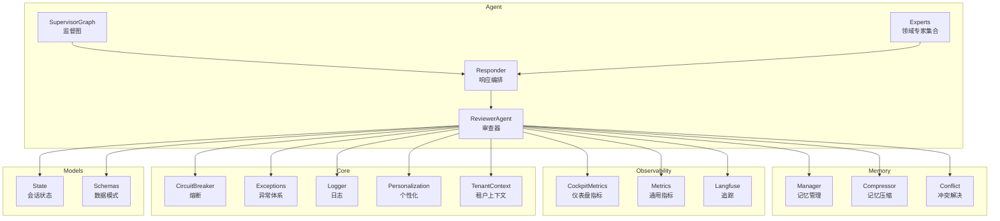
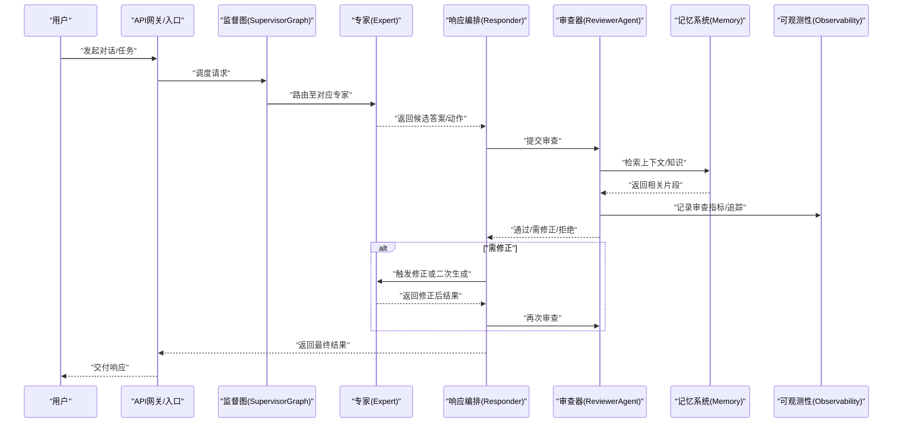
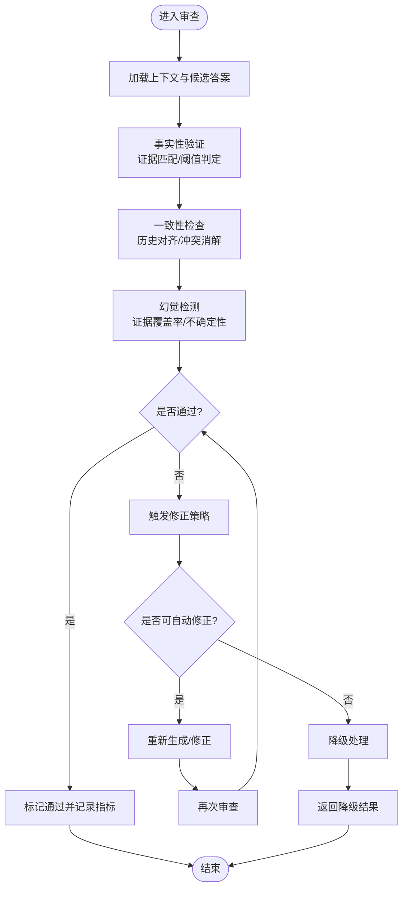
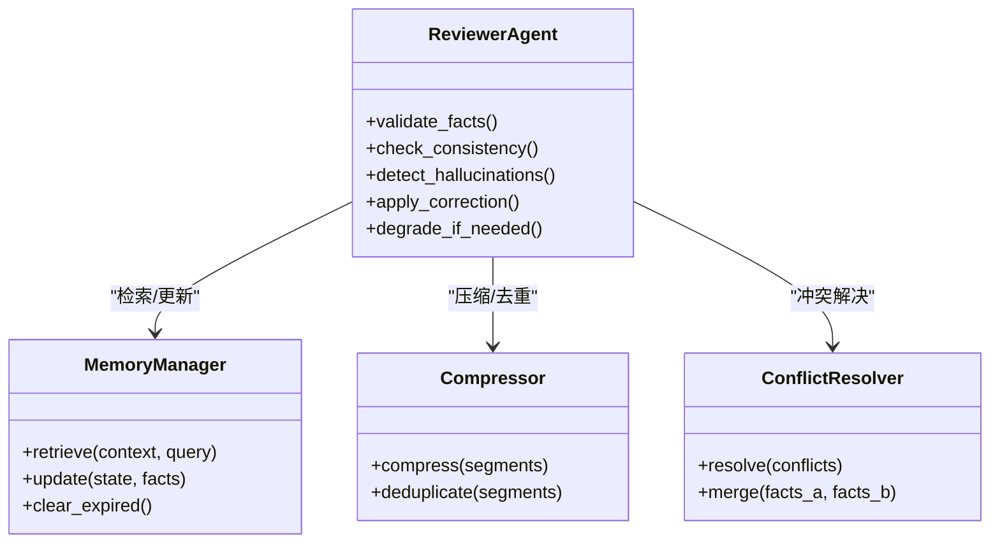
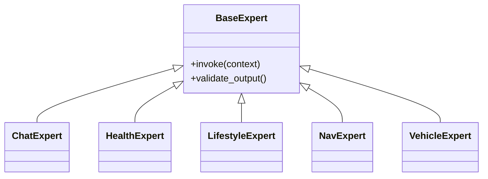
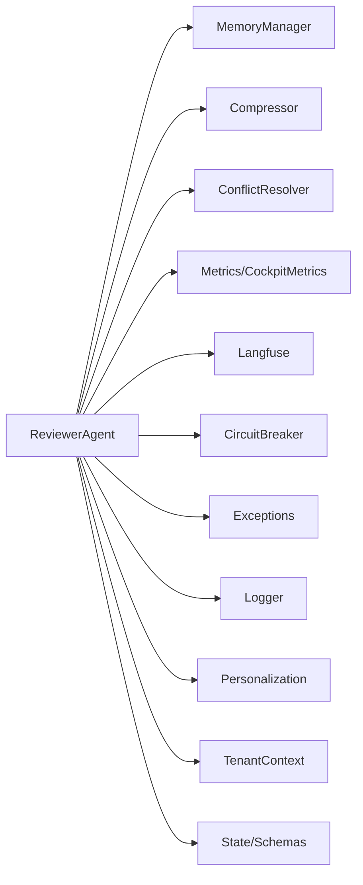

# Reviewer审查器

<cite>
**本文引用的文件**   
- [reviewer.py](file://backend_design/nexus/agent/reviewer.py)
- [responder.py](file://backend_design/nexus/agent/responder.py)
- [supervisor_graph.py](file://backend_design/nexus/agent/supervisor_graph.py)
- [base.py](file://backend_design/nexus/agent/experts/base.py)
- [chat_expert.py](file://backend_design/nexus/agent/experts/chat_expert.py)
- [health_expert.py](file://backend_design/nexus/agent/experts/health_expert.py)
- [lifestyle_expert.py](file://backend_design/nexus/agent/experts/lifestyle_expert.py)
- [nav_expert.py](file://backend_design/nexus/agent/experts/nav_expert.py)
- [vehicle_expert.py](file://backend_design/nexus/agent/experts/vehicle_expert.py)
- [manager.py](file://backend_design/nexus/memory/manager.py)
- [compressor.py](file://backend_design/nexus/memory/compressor.py)
- [conflict.py](file://backend_design/nexus/memory/conflict.py)
- [cockpit_metrics.py](file://backend_design/nexus/observability/cockpit_metrics.py)
- [metrics.py](file://backend_design/nexus/observability/metrics.py)
- [langfuse.py](file://backend_design/nexus/observability/langfuse.py)
- [state.py](file://backend_design/nexus/models/state.py)
- [schemas.py](file://backend_design/nexus/models/schemas.py)
- [cockpit_manager.py](file://backend_design/nexus/core/cockpit_manager.py)
- [circuit_breaker.py](file://backend_design/nexus/core/circuit_breaker.py)
- [exceptions.py](file://backend_design/nexus/core/exceptions.py)
- [logger.py](file://backend_design/nexus/core/logger.py)
- [personalization.py](file://backend_design/nexus/core/personalization.py)
- [tenant_context.py](file://backend_design/nexus/core/tenant_context.py)
- [config.py](file://backend_design/nexus/config.py)
- [main.py](file://backend_design/nexus/main.py)
</cite>

## 目录
1. [简介](#简介)
2. [项目结构](#项目结构)
3. [核心组件](#核心组件)
4. [架构总览](#架构总览)
5. [详细组件分析](#详细组件分析)
6. [依赖分析](#依赖分析)
7. [性能考虑](#性能考虑)
8. [故障排查指南](#故障排查指南)
9. [结论](#结论)
10. [附录](#附录)

## 简介
本文件面向 NexusCockpit 的 Reviewer 审查器，聚焦于 ReviewerAgent 的质量检查机制与工程化落地。内容涵盖：
- 事实性验证、一致性检查、幻觉检测的实现思路与流程
- 审查标准、错误修正策略与降级处理方案
- 与记忆管理系统的集成方式
- 审查指标收集与性能监控
- 审查规则配置与质量评估方法

目标读者包括算法工程师、后端工程师与产品/运营人员，帮助快速理解并正确使用 Reviewer 能力。

## 项目结构
Reviewer 相关代码位于 agent 模块，并与 memory、observability、models、core 等子系统协作。整体组织遵循“专家路由 + 统一审查”的分层设计：
- agent：包含专家（experts）、响应编排（responder）、监督图（supervisor_graph）以及审查器（reviewer）
- memory：负责长期/短期记忆、压缩与冲突解决
- observability：提供指标、追踪与数据保留
- models：定义状态与数据模型
- core：通用能力（熔断、日志、租户上下文、个性化等）
- config/main：应用启动与全局配置

图表来源
- [reviewer.py:1-200](file://backend_design/nexus/agent/reviewer.py#L1-L200)
- [responder.py:1-200](file://backend_design/nexus/agent/responder.py#L1-L200)
- [supervisor_graph.py:1-200](file://backend_design/nexus/agent/supervisor_graph.py#L1-L200)
- [manager.py:1-200](file://backend_design/nexus/memory/manager.py#L1-L200)
- [compressor.py:1-200](file://backend_design/nexus/memory/compressor.py#L1-L200)
- [conflict.py:1-200](file://backend_design/nexus/memory/conflict.py#L1-L200)
- [cockpit_metrics.py:1-200](file://backend_design/nexus/observability/cockpit_metrics.py#L1-L200)
- [metrics.py:1-200](file://backend_design/nexus/observability/metrics.py#L1-L200)
- [langfuse.py:1-200](file://backend_design/nexus/observability/langfuse.py#L1-L200)
- [state.py:1-200](file://backend_design/nexus/models/state.py#L1-L200)
- [schemas.py:1-200](file://backend_design/nexus/models/schemas.py#L1-L200)
- [circuit_breaker.py:1-200](file://backend_design/nexus/core/circuit_breaker.py#L1-L200)
- [exceptions.py:1-200](file://backend_design/nexus/core/exceptions.py#L1-L200)
- [logger.py:1-200](file://backend_design/nexus/core/logger.py#L1-L200)
- [personalization.py:1-200](file://backend_design/nexus/core/personalization.py#L1-L200)
- [tenant_context.py:1-200](file://backend_design/nexus/core/tenant_context.py#L1-L200)

章节来源
- [reviewer.py:1-200](file://backend_design/nexus/agent/reviewer.py#L1-L200)
- [responder.py:1-200](file://backend_design/nexus/agent/responder.py#L1-L200)
- [supervisor_graph.py:1-200](file://backend_design/nexus/agent/supervisor_graph.py#L1-L200)
- [manager.py:1-200](file://backend_design/nexus/memory/manager.py#L1-L200)
- [compressor.py:1-200](file://backend_design/nexus/memory/compressor.py#L1-L200)
- [conflict.py:1-200](file://backend_design/nexus/memory/conflict.py#L1-L200)
- [cockpit_metrics.py:1-200](file://backend_design/nexus/observability/cockpit_metrics.py#L1-L200)
- [metrics.py:1-200](file://backend_design/nexus/observability/metrics.py#L1-L200)
- [langfuse.py:1-200](file://backend_design/nexus/observability/langfuse.py#L1-L200)
- [state.py:1-200](file://backend_design/nexus/models/state.py#L1-L200)
- [schemas.py:1-200](file://backend_design/nexus/models/schemas.py#L1-L200)
- [circuit_breaker.py:1-200](file://backend_design/nexus/core/circuit_breaker.py#L1-L200)
- [exceptions.py:1-200](file://backend_design/nexus/core/exceptions.py#L1-L200)
- [logger.py:1-200](file://backend_design/nexus/core/logger.py#L1-L200)
- [personalization.py:1-200](file://backend_design/nexus/core/personalization.py#L1-L200)
- [tenant_context.py:1-200](file://backend_design/nexus/core/tenant_context.py#L1-L200)

## 核心组件
- ReviewerAgent：集中实现质量检查与修正闭环，包括事实性验证、一致性检查、幻觉检测、修正策略与降级路径。
- Responder：将专家输出与审查结果组合为最终响应，支持重试与回退。
- SupervisorGraph：以有向图形式编排专家调用与审查节点，控制执行顺序与条件分支。
- Memory 子系统：提供记忆检索、压缩与冲突解决，辅助审查进行上下文对齐与去重。
- Observability：记录审查指标、追踪链路，支撑可观测性与问题定位。
- Core 能力：熔断保护、异常分类、日志、个性化与租户上下文隔离。
- Models：会话状态与数据模式，贯穿审查输入输出。

章节来源
- [reviewer.py:1-200](file://backend_design/nexus/agent/reviewer.py#L1-L200)
- [responder.py:1-200](file://backend_design/nexus/agent/responder.py#L1-L200)
- [supervisor_graph.py:1-200](file://backend_design/nexus/agent/supervisor_graph.py#L1-L200)
- [manager.py:1-200](file://backend_design/nexus/memory/manager.py#L1-L200)
- [compressor.py:1-200](file://backend_design/nexus/memory/compressor.py#L1-L200)
- [conflict.py:1-200](file://backend_design/nexus/memory/conflict.py#L1-L200)
- [cockpit_metrics.py:1-200](file://backend_design/nexus/observability/cockpit_metrics.py#L1-L200)
- [metrics.py:1-200](file://backend_design/nexus/observability/metrics.py#L1-L200)
- [langfuse.py:1-200](file://backend_design/nexus/observability/langfuse.py#L1-L200)
- [state.py:1-200](file://backend_design/nexus/models/state.py#L1-L200)
- [schemas.py:1-200](file://backend_design/nexus/models/schemas.py#L1-L200)
- [circuit_breaker.py:1-200](file://backend_design/nexus/core/circuit_breaker.py#L1-L200)
- [exceptions.py:1-200](file://backend_design/nexus/core/exceptions.py#L1-L200)
- [logger.py:1-200](file://backend_design/nexus/core/logger.py#L1-L200)
- [personalization.py:1-200](file://backend_design/nexus/core/personalization.py#L1-L200)
- [tenant_context.py:1-200](file://backend_design/nexus/core/tenant_context.py#L1-L200)

## 架构总览
下图展示从用户请求到审查通过的端到端流程，突出 ReviewerAgent 在其中的关键作用。

图表来源
- [supervisor_graph.py:1-200](file://backend_design/nexus/agent/supervisor_graph.py#L1-L200)
- [responder.py:1-200](file://backend_design/nexus/agent/responder.py#L1-L200)
- [reviewer.py:1-200](file://backend_design/nexus/agent/reviewer.py#L1-L200)
- [manager.py:1-200](file://backend_design/nexus/memory/manager.py#L1-L200)
- [cockpit_metrics.py:1-200](file://backend_design/nexus/observability/cockpit_metrics.py#L1-L200)
- [metrics.py:1-200](file://backend_design/nexus/observability/metrics.py#L1-L200)
- [langfuse.py:1-200](file://backend_design/nexus/observability/langfuse.py#L1-L200)

## 详细组件分析

### ReviewerAgent 质量检查机制
- 事实性验证
  - 基于记忆系统检索到的证据片段，对候选答案的关键断言进行比对与校验
  - 支持阈值判定与置信度评分，结合领域专家先验约束
- 一致性检查
  - 对比历史会话状态与当前上下文，确保不出现自相矛盾或前后不一致
  - 利用记忆压缩与冲突解决模块，识别重复与冲突信息并进行消解
- 幻觉检测
  - 通过证据覆盖率、引用完整性与不确定性表达来识别潜在幻觉
  - 当检测到高不确定或低证据覆盖时，触发修正或降级策略

图表来源
- [reviewer.py:1-200](file://backend_design/nexus/agent/reviewer.py#L1-L200)
- [manager.py:1-200](file://backend_design/nexus/memory/manager.py#L1-L200)
- [compressor.py:1-200](file://backend_design/nexus/memory/compressor.py#L1-L200)
- [conflict.py:1-200](file://backend_design/nexus/memory/conflict.py#L1-L200)

章节来源
- [reviewer.py:1-200](file://backend_design/nexus/agent/reviewer.py#L1-L200)
- [manager.py:1-200](file://backend_design/nexus/memory/manager.py#L1-L200)
- [compressor.py:1-200](file://backend_design/nexus/memory/compressor.py#L1-L200)
- [conflict.py:1-200](file://backend_design/nexus/memory/conflict.py#L1-L200)

### 审查标准与错误修正策略
- 审查标准
  - 事实性：关键断言必须有证据支撑；允许合理推断但需标注不确定性
  - 一致性：与用户偏好、历史行为与车辆状态保持一致
  - 安全性：避免危险操作建议；敏感指令需二次确认
  - 可解释性：输出应包含必要依据或来源提示
- 错误修正策略
  - 自动修正：基于记忆片段与专家约束进行局部重写
  - 二次生成：触发专家重新生成更保守或更精确的答案
  - 人工介入：高风险场景转交人工审核或给出明确风险提示
- 降级处理方案
  - 降级到安全模板：在证据不足时返回保守回答
  - 限流与熔断：在高负载或外部服务不稳定时启用熔断保护
  - 缓存命中：使用最近成功结果作为兜底

章节来源
- [reviewer.py:1-200](file://backend_design/nexus/agent/reviewer.py#L1-L200)
- [circuit_breaker.py:1-200](file://backend_design/nexus/core/circuit_breaker.py#L1-L200)
- [responder.py:1-200](file://backend_design/nexus/agent/responder.py#L1-L200)

### 与记忆管理系统的集成
- 检索与对齐
  - 通过记忆管理器检索与当前意图相关的历史片段与偏好
  - 将候选答案与记忆片段进行对齐，提取差异点用于一致性检查
- 压缩与去重
  - 使用压缩器减少冗余信息，提升审查效率
  - 冲突解决模块识别并合并冲突条目，保证审查输入的一致性
- 持久化与回溯
  - 将审查结果与证据片段写入会话状态，便于后续审计与复盘

图表来源
- [reviewer.py:1-200](file://backend_design/nexus/agent/reviewer.py#L1-L200)
- [manager.py:1-200](file://backend_design/nexus/memory/manager.py#L1-L200)
- [compressor.py:1-200](file://backend_design/nexus/memory/compressor.py#L1-L200)
- [conflict.py:1-200](file://backend_design/nexus/memory/conflict.py#L1-L200)

章节来源
- [reviewer.py:1-200](file://backend_design/nexus/agent/reviewer.py#L1-L200)
- [manager.py:1-200](file://backend_design/nexus/memory/manager.py#L1-L200)
- [compressor.py:1-200](file://backend_design/nexus/memory/compressor.py#L1-L200)
- [conflict.py:1-200](file://backend_design/nexus/memory/conflict.py#L1-L200)

### 审查指标收集与性能监控
- 指标维度
  - 通过率、修正率、拒绝率
  - 平均审查耗时、P95/P99延迟
  - 证据覆盖率、不确定性分布
  - 幻觉检出率、误报率
- 监控与追踪
  - 使用仪表盘指标与通用指标库聚合统计
  - 借助追踪工具记录关键步骤与决策点，便于问题定位
- 告警与看板
  - 针对异常波动设置阈值告警
  - 提供可视化看板观察趋势与热点

章节来源
- [cockpit_metrics.py:1-200](file://backend_design/nexus/observability/cockpit_metrics.py#L1-L200)
- [metrics.py:1-200](file://backend_design/nexus/observability/metrics.py#L1-L200)
- [langfuse.py:1-200](file://backend_design/nexus/observability/langfuse.py#L1-L200)

### 审查规则配置与质量评估方法
- 规则配置
  - 事实性阈值、一致性权重、幻觉检测灵敏度
  - 修正策略开关（自动/二次生成/人工介入）
  - 降级策略优先级与安全模板选择
- 质量评估
  - 离线评测集：构建多领域测试用例，评估准确率与鲁棒性
  - 在线A/B：对比不同规则配置的效果差异
  - 审计抽样：定期抽检高风险场景，持续优化规则

章节来源
- [reviewer.py:1-200](file://backend_design/nexus/agent/reviewer.py#L1-L200)
- [config.py:1-200](file://backend_design/nexus/config.py#L1-L200)

### 专家系统与审查协同
- 专家角色
  - 聊天专家、健康专家、生活方式专家、导航专家、车辆专家等
- 协同机制
  - 监督图根据意图路由到对应专家
  - 专家输出经审查器校验，必要时触发二次生成或修正
  - 审查结果反馈给专家，形成闭环优化

图表来源
- [base.py:1-200](file://backend_design/nexus/agent/experts/base.py#L1-L200)
- [chat_expert.py:1-200](file://backend_design/nexus/agent/experts/chat_expert.py#L1-L200)
- [health_expert.py:1-200](file://backend_design/nexus/agent/experts/health_expert.py#L1-L200)
- [lifestyle_expert.py:1-200](file://backend_design/nexus/agent/experts/lifestyle_expert.py#L1-L200)
- [nav_expert.py:1-200](file://backend_design/nexus/agent/experts/nav_expert.py#L1-L200)
- [vehicle_expert.py:1-200](file://backend_design/nexus/agent/experts/vehicle_expert.py#L1-L200)

章节来源
- [base.py:1-200](file://backend_design/nexus/agent/experts/base.py#L1-L200)
- [chat_expert.py:1-200](file://backend_design/nexus/agent/experts/chat_expert.py#L1-L200)
- [health_expert.py:1-200](file://backend_design/nexus/agent/experts/health_expert.py#L1-L200)
- [lifestyle_expert.py:1-200](file://backend_design/nexus/agent/experts/lifestyle_expert.py#L1-L200)
- [nav_expert.py:1-200](file://backend_design/nexus/agent/experts/nav_expert.py#L1-L200)
- [vehicle_expert.py:1-200](file://backend_design/nexus/agent/experts/vehicle_expert.py#L1-L200)

## 依赖分析
- 内部依赖
  - ReviewerAgent 依赖记忆系统、可观测性、核心能力与模型定义
  - Responder 与 SupervisorGraph 共同编排专家与审查流程
- 外部依赖
  - 外部LLM服务、向量检索、图谱存储等（由RAG与专家实现间接引入）
- 耦合与内聚
  - ReviewerAgent 与记忆系统紧密耦合，但通过接口抽象降低直接依赖
  - 可观测性模块松耦合，便于替换与扩展

图表来源
- [reviewer.py:1-200](file://backend_design/nexus/agent/reviewer.py#L1-L200)
- [manager.py:1-200](file://backend_design/nexus/memory/manager.py#L1-L200)
- [compressor.py:1-200](file://backend_design/nexus/memory/compressor.py#L1-L200)
- [conflict.py:1-200](file://backend_design/nexus/memory/conflict.py#L1-L200)
- [cockpit_metrics.py:1-200](file://backend_design/nexus/observability/cockpit_metrics.py#L1-L200)
- [metrics.py:1-200](file://backend_design/nexus/observability/metrics.py#L1-L200)
- [langfuse.py:1-200](file://backend_design/nexus/observability/langfuse.py#L1-L200)
- [circuit_breaker.py:1-200](file://backend_design/nexus/core/circuit_breaker.py#L1-L200)
- [exceptions.py:1-200](file://backend_design/nexus/core/exceptions.py#L1-L200)
- [logger.py:1-200](file://backend_design/nexus/core/logger.py#L1-L200)
- [personalization.py:1-200](file://backend_design/nexus/core/personalization.py#L1-L200)
- [tenant_context.py:1-200](file://backend_design/nexus/core/tenant_context.py#L1-L200)
- [state.py:1-200](file://backend_design/nexus/models/state.py#L1-L200)
- [schemas.py:1-200](file://backend_design/nexus/models/schemas.py#L1-L200)

章节来源
- [reviewer.py:1-200](file://backend_design/nexus/agent/reviewer.py#L1-L200)
- [manager.py:1-200](file://backend_design/nexus/memory/manager.py#L1-L200)
- [compressor.py:1-200](file://backend_design/nexus/memory/compressor.py#L1-L200)
- [conflict.py:1-200](file://backend_design/nexus/memory/conflict.py#L1-L200)
- [cockpit_metrics.py:1-200](file://backend_design/nexus/observability/cockpit_metrics.py#L1-L200)
- [metrics.py:1-200](file://backend_design/nexus/observability/metrics.py#L1-L200)
- [langfuse.py:1-200](file://backend_design/nexus/observability/langfuse.py#L1-L200)
- [circuit_breaker.py:1-200](file://backend_design/nexus/core/circuit_breaker.py#L1-L200)
- [exceptions.py:1-200](file://backend_design/nexus/core/exceptions.py#L1-L200)
- [logger.py:1-200](file://backend_design/nexus/core/logger.py#L1-L200)
- [personalization.py:1-200](file://backend_design/nexus/core/personalization.py#L1-L200)
- [tenant_context.py:1-200](file://backend_design/nexus/core/tenant_context.py#L1-L200)
- [state.py:1-200](file://backend_design/nexus/models/state.py#L1-L200)
- [schemas.py:1-200](file://backend_design/nexus/models/schemas.py#L1-L200)

## 性能考虑
- 审查批处理与并行化：对多个断言进行并行校验，缩短总体耗时
- 记忆检索优化：采用缓存与预取策略，减少重复检索开销
- 指标采样与异步上报：避免阻塞主流程，保障低延迟
- 熔断与限流：在外部服务抖动时快速失败，保护系统稳定性

[本节为通用指导，无需特定文件来源]

## 故障排查指南
- 常见问题
  - 审查超时：检查外部服务可用性、记忆检索延迟与并发限制
  - 误判过多：调整事实性阈值与幻觉检测灵敏度
  - 降级频繁：评估熔断阈值与降级策略优先级
- 定位手段
  - 查看审查指标与追踪链路，定位瓶颈环节
  - 使用日志与异常分类，快速识别错误类型
  - 结合会话状态与记忆片段，复现问题场景

章节来源
- [cockpit_metrics.py:1-200](file://backend_design/nexus/observability/cockpit_metrics.py#L1-L200)
- [metrics.py:1-200](file://backend_design/nexus/observability/metrics.py#L1-L200)
- [langfuse.py:1-200](file://backend_design/nexus/observability/langfuse.py#L1-L200)
- [logger.py:1-200](file://backend_design/nexus/core/logger.py#L1-L200)
- [exceptions.py:1-200](file://backend_design/nexus/core/exceptions.py#L1-L200)
- [circuit_breaker.py:1-200](file://backend_design/nexus/core/circuit_breaker.py#L1-L200)

## 结论
ReviewerAgent 通过事实性验证、一致性检查与幻觉检测构建了稳健的质量保障体系。结合记忆管理与可观测性，实现了可配置、可评估、可运维的审查闭环。在生产环境中，建议持续优化规则与阈值，完善监控告警，确保用户体验与系统稳定性。

[本节为总结性内容，无需特定文件来源]

## 附录
- 术语表
  - 事实性验证：基于证据对答案断言进行校验
  - 一致性检查：确保答案与上下文和历史一致
  - 幻觉检测：识别无证据或不确定的输出
  - 降级处理：在风险或不可用时返回安全结果
- 参考文件
  - 应用入口与配置：[main.py](file://backend_design/nexus/main.py)、[config.py](file://backend_design/nexus/config.py)
  - 仪表盘管理：[cockpit_manager.py](file://backend_design/nexus/core/cockpit_manager.py)