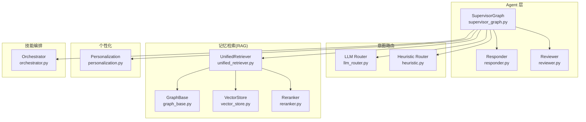
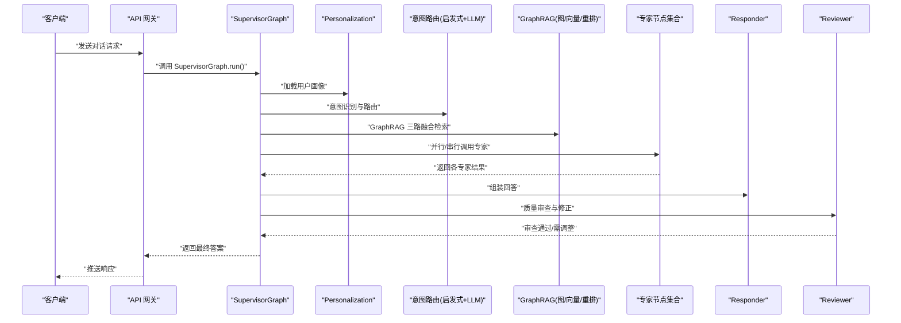
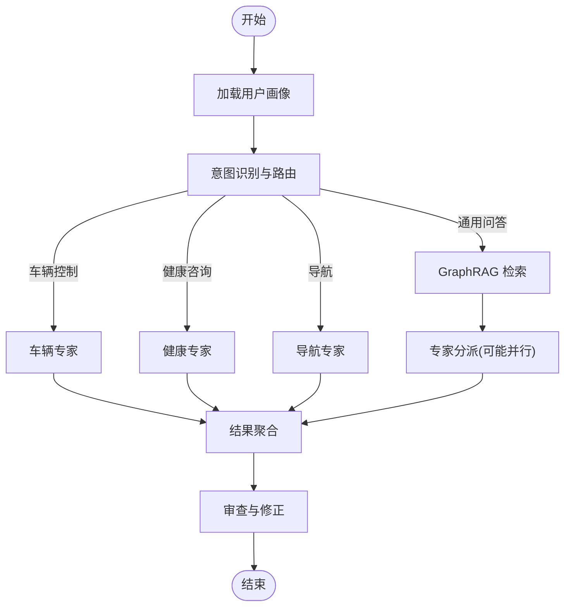
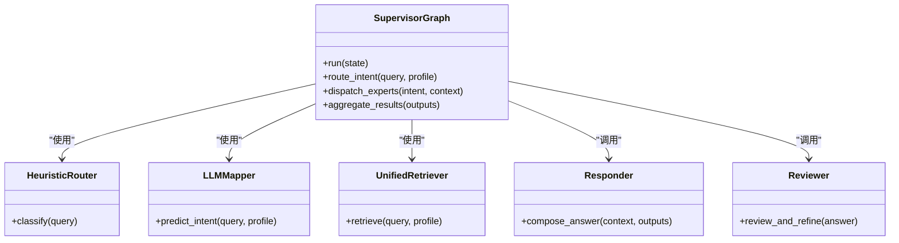
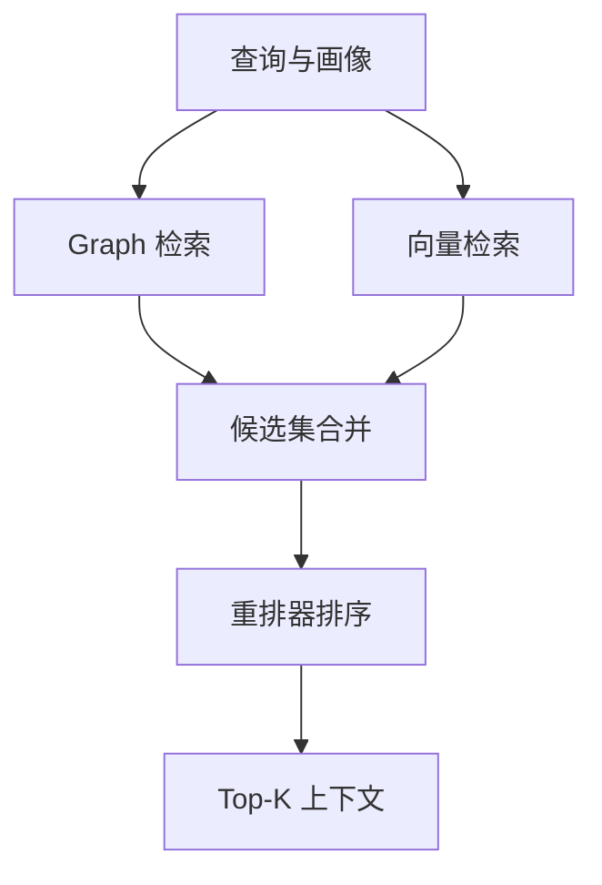
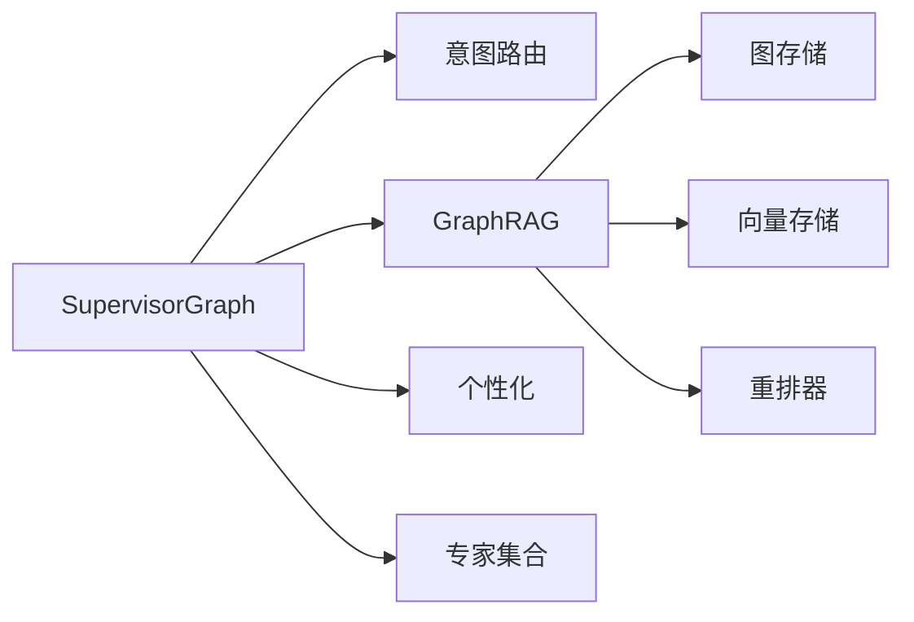

# Supervisor调度器

<cite>
**本文引用的文件**   
- [supervisor_graph.py](file://backend_design/nexus/agent/supervisor_graph.py)
- [state.py](file://backend_design/nexus/models/state.py)
- [llm_router.py](file://backend_design/nexus/intent/llm_router.py)
- [heuristic.py](file://backend_design/nexus/intent/heuristic.py)
- [unified_retriever.py](file://backend_design/nexus/rag/unified_retriever.py)
- [graph_base.py](file://backend_design/nexus/rag/graph_base.py)
- [vector_store.py](file://backend_design/nexus/rag/vector_store.py)
- [reranker.py](file://backend_design/nexus/rag/reranker.py)
- [personalization.py](file://backend_design/nexus/core/personalization.py)
- [responder.py](file://backend_design/nexus/agent/responder.py)
- [reviewer.py](file://backend_design/nexus/agent/reviewer.py)
- [orchestrator.py](file://backend_design/nexus/skills/orchestrator.py)
- [main.py](file://backend_design/nexus/main.py)
</cite>

## 目录
1. [简介](#简介)
2. [项目结构](#项目结构)
3. [核心组件](#核心组件)
4. [架构总览](#架构总览)
5. [详细组件分析](#详细组件分析)
6. [依赖关系分析](#依赖关系分析)
7. [性能考虑](#性能考虑)
8. [故障排查指南](#故障排查指南)
9. [结论](#结论)
10. [附录](#附录)

## 简介
本文件面向 NexusCockpit 的 Supervisor 调度器，聚焦于 SupervisorGraph 类及其在 LangGraph StateGraph 工作流编排中的角色。文档将深入解释以下关键能力：
- 记忆召回（GraphRAG 三路融合）：图检索、向量检索与重排器的协同
- 用户画像加载：个性化上下文注入
- 意图路由与专家分派：基于启发式与 LLM 的路由策略
- 有状态图管理与异步执行模型：LangGraph StateGraph 的状态流转与并发控制
- 条件路由逻辑、并行任务执行与结果聚合策略
- SupervisorState 数据结构说明与性能优化建议

## 项目结构
Supervisor 调度器位于 agent 层，围绕 supervisor_graph.py 构建；其上游依赖包括意图路由（intent）、记忆检索（rag）、个性化（core.personalization），下游对接响应生成（agent.responder）与审查（agent.reviewer）。

图表来源
- [supervisor_graph.py](file://backend_design/nexus/agent/supervisor_graph.py)
- [llm_router.py](file://backend_design/nexus/intent/llm_router.py)
- [heuristic.py](file://backend_design/nexus/intent/heuristic.py)
- [unified_retriever.py](file://backend_design/nexus/rag/unified_retriever.py)
- [graph_base.py](file://backend_design/nexus/rag/graph_base.py)
- [vector_store.py](file://backend_design/nexus/rag/vector_store.py)
- [reranker.py](file://backend_design/nexus/rag/reranker.py)
- [personalization.py](file://backend_design/nexus/core/personalization.py)
- [responder.py](file://backend_design/nexus/agent/responder.py)
- [reviewer.py](file://backend_design/nexus/agent/reviewer.py)
- [orchestrator.py](file://backend_design/nexus/skills/orchestrator.py)

章节来源
- [supervisor_graph.py](file://backend_design/nexus/agent/supervisor_graph.py)
- [main.py](file://backend_design/nexus/main.py)

## 核心组件
- SupervisorGraph：基于 LangGraph StateGraph 的有状态图编排器，负责接收输入、加载用户画像、进行意图识别与路由、触发 GraphRAG 三路融合检索、并行调用专家节点、聚合结果并输出。
- SupervisorState：描述一次调度的完整上下文，包含用户输入、会话标识、画像信息、检索结果、路由决策、专家输出、最终答案等字段。
- 意图路由：结合启发式规则与 LLM 判断，决定进入“通用问答”、“车辆控制”、“健康咨询”、“导航”等专家分支。
- GraphRAG 三路融合：统一检索器整合图检索、向量检索与重排器，产出高质量上下文片段。
- 专家分派与聚合：根据路由结果并行或串行调用专家节点，并对多路结果进行合并与精炼。

章节来源
- [supervisor_graph.py](file://backend_design/nexus/agent/supervisor_graph.py)
- [state.py](file://backend_design/nexus/models/state.py)
- [llm_router.py](file://backend_design/nexus/intent/llm_router.py)
- [heuristic.py](file://backend_design/nexus/intent/heuristic.py)
- [unified_retriever.py](file://backend_design/nexus/rag/unified_retriever.py)
- [reranker.py](file://backend_design/nexus/rag/reranker.py)
- [responder.py](file://backend_design/nexus/agent/responder.py)
- [reviewer.py](file://backend_design/nexus/agent/reviewer.py)

## 架构总览
SupervisorGraph 作为入口，协调意图路由、记忆检索、个性化与专家执行，形成“输入→画像→意图→检索→专家→聚合→输出”的闭环。

图表来源
- [supervisor_graph.py](file://backend_design/nexus/agent/supervisor_graph.py)
- [personalization.py](file://backend_design/nexus/core/personalization.py)
- [llm_router.py](file://backend_design/nexus/intent/llm_router.py)
- [heuristic.py](file://backend_design/nexus/intent/heuristic.py)
- [unified_retriever.py](file://backend_design/nexus/rag/unified_retriever.py)
- [reranker.py](file://backend_design/nexus/rag/reranker.py)
- [responder.py](file://backend_design/nexus/agent/responder.py)
- [reviewer.py](file://backend_design/nexus/agent/reviewer.py)

## 详细组件分析

### SupervisorGraph 类与工作流编排
- 职责边界
  - 管理 StateGraph 节点与边，定义条件路由函数
  - 编排用户画像加载、意图识别、记忆检索、专家执行、结果聚合
  - 提供统一的 run() 接口，支持异步执行与超时控制
- 关键流程
  - 初始化：注册节点、设置入口与出口、配置条件路由
  - 运行：读取 SupervisorState，按阶段推进状态，必要时回退或重试
  - 退出：输出结构化答案，附带溯源信息与元数据
- 设计要点
  - 使用 LangGraph 的有状态图特性，保证中间态可观测与可恢复
  - 条件路由函数依据当前状态动态选择下一节点
  - 对耗时操作采用并发执行与熔断降级

图表来源
- [supervisor_graph.py](file://backend_design/nexus/agent/supervisor_graph.py)
- [llm_router.py](file://backend_design/nexus/intent/llm_router.py)
- [heuristic.py](file://backend_design/nexus/intent/heuristic.py)
- [unified_retriever.py](file://backend_design/nexus/rag/unified_retriever.py)
- [reranker.py](file://backend_design/nexus/rag/reranker.py)
- [responder.py](file://backend_design/nexus/agent/responder.py)
- [reviewer.py](file://backend_design/nexus/agent/reviewer.py)

章节来源
- [supervisor_graph.py](file://backend_design/nexus/agent/supervisor_graph.py)

### SupervisorState 数据结构
- 作用：承载一次调度的全部上下文，贯穿整个工作流
- 关键字段（示例性说明）
  - user_id：用户标识
  - session_id：会话标识
  - query：原始用户输入
  - profile：用户画像摘要（偏好、历史行为、设备信息等）
  - intent：意图标签与置信度
  - rag_context：GraphRAG 检索到的上下文片段
  - expert_outputs：各专家节点的输出映射
  - answer：最终答案文本
  - metadata：追踪、指标与调试信息
- 状态流转
  - 初始：仅包含基础输入与会话信息
  - 画像后：注入 profile
  - 路由后：写入 intent
  - 检索后：填充 rag_context
  - 专家后：汇总 expert_outputs
  - 审查后：生成 answer 与 metadata

章节来源
- [state.py](file://backend_design/nexus/models/state.py)

### 意图路由与专家分派
- 启发式路由：基于关键词、领域词典与规则快速判定
- LLM 路由：对复杂语义进行意图分类，提升准确率
- 专家分派：根据路由结果选择对应专家节点，支持并行执行以提升吞吐
- 容错与降级：当某专家不可用时，回退到通用问答路径

图表来源
- [supervisor_graph.py](file://backend_design/nexus/agent/supervisor_graph.py)
- [heuristic.py](file://backend_design/nexus/intent/heuristic.py)
- [llm_router.py](file://backend_design/nexus/intent/llm_router.py)
- [unified_retriever.py](file://backend_design/nexus/rag/unified_retriever.py)
- [responder.py](file://backend_design/nexus/agent/responder.py)
- [reviewer.py](file://backend_design/nexus/agent/reviewer.py)

章节来源
- [llm_router.py](file://backend_design/nexus/intent/llm_router.py)
- [heuristic.py](file://backend_design/nexus/intent/heuristic.py)
- [supervisor_graph.py](file://backend_design/nexus/agent/supervisor_graph.py)

### GraphRAG 三路融合检索
- 图检索：从知识图谱中抽取相关实体与关系，增强事实性与可解释性
- 向量检索：基于嵌入相似度召回候选片段，覆盖长尾与模糊查询
- 重排器：对候选结果进行相关性重排，提升最终上下文质量
- 统一检索器：封装三路检索与融合策略，对外暴露简洁接口

图表来源
- [unified_retriever.py](file://backend_design/nexus/rag/unified_retriever.py)
- [graph_base.py](file://backend_design/nexus/rag/graph_base.py)
- [vector_store.py](file://backend_design/nexus/rag/vector_store.py)
- [reranker.py](file://backend_design/nexus/rag/reranker.py)

章节来源
- [unified_retriever.py](file://backend_design/nexus/rag/unified_retriever.py)
- [graph_base.py](file://backend_design/nexus/rag/graph_base.py)
- [vector_store.py](file://backend_design/nexus/rag/vector_store.py)
- [reranker.py](file://backend_design/nexus/rag/reranker.py)

### 用户画像加载与个性化
- 画像来源：用户偏好、历史交互、设备与环境信息
- 加载时机：在意图识别前完成，确保路由与检索具备个性化上下文
- 应用方式：影响检索权重、专家选择与回答风格

章节来源
- [personalization.py](file://backend_design/nexus/core/personalization.py)
- [supervisor_graph.py](file://backend_design/nexus/agent/supervisor_graph.py)

### 结果聚合与审查
- 聚合策略：按专家类型加权合并，去重与冲突消解
- 审查机制：对答案一致性、安全性与可读性进行检查，必要时自动修正
- 输出格式：结构化答案，附带溯源引用与元数据

章节来源
- [responder.py](file://backend_design/nexus/agent/responder.py)
- [reviewer.py](file://backend_design/nexus/agent/reviewer.py)
- [supervisor_graph.py](file://backend_design/nexus/agent/supervisor_graph.py)

## 依赖关系分析
- 内部耦合
  - SupervisorGraph 强依赖意图路由与 GraphRAG，弱依赖专家节点（可通过路由表扩展）
  - GraphRAG 模块内部分离清晰：图、向量、重排各司其职，统一检索器屏蔽差异
- 外部集成点
  - 个性化服务：提供画像数据
  - 技能编排：在需要时组合多个技能动作
- 潜在循环依赖
  - 通过分层与接口抽象避免循环，SupervisorGraph 不直接依赖具体专家实现

图表来源
- [supervisor_graph.py](file://backend_design/nexus/agent/supervisor_graph.py)
- [llm_router.py](file://backend_design/nexus/intent/llm_router.py)
- [heuristic.py](file://backend_design/nexus/intent/heuristic.py)
- [unified_retriever.py](file://backend_design/nexus/rag/unified_retriever.py)
- [graph_base.py](file://backend_design/nexus/rag/graph_base.py)
- [vector_store.py](file://backend_design/nexus/rag/vector_store.py)
- [reranker.py](file://backend_design/nexus/rag/reranker.py)
- [personalization.py](file://backend_design/nexus/core/personalization.py)

章节来源
- [supervisor_graph.py](file://backend_design/nexus/agent/supervisor_graph.py)
- [unified_retriever.py](file://backend_design/nexus/rag/unified_retriever.py)

## 性能考虑
- 并行执行
  - 专家节点与检索子任务尽量并行，减少端到端延迟
  - 使用线程池或协程池控制并发度，避免资源争用
- 缓存与复用
  - 对高频画像与检索结果做短期缓存，降低重复计算
- 限流与熔断
  - 对下游服务（图数据库、向量库、LLM）设置超时与熔断，保障稳定性
- 批处理与增量更新
  - 批量提交检索与重排请求，利用索引预热与分页拉取
- 监控与可观测性
  - 记录关键路径耗时、错误率与资源占用，便于定位瓶颈

[本节为通用指导，无需特定文件来源]

## 故障排查指南
- 常见问题
  - 意图误判：检查启发式规则与 LLM 路由参数，增加样本微调
  - 检索质量低：调整 Top-K、重排阈值与相似度分数
  - 专家超时：确认并发上限与后端可用性，启用降级路径
  - 结果不一致：审查聚合策略与冲突消解逻辑
- 诊断手段
  - 查看 SupervisorState 中间态，定位问题阶段
  - 开启链路追踪与日志，关注关键节点耗时与异常堆栈
  - 对 GraphRAG 输出进行抽样评估，验证召回与重排效果

章节来源
- [supervisor_graph.py](file://backend_design/nexus/agent/supervisor_graph.py)
- [state.py](file://backend_design/nexus/models/state.py)
- [unified_retriever.py](file://backend_design/nexus/rag/unified_retriever.py)
- [reranker.py](file://backend_design/nexus/rag/reranker.py)

## 结论
SupervisorGraph 以 LangGraph StateGraph 为核心，实现了从用户画像、意图识别、GraphRAG 三路融合检索到专家分派与结果聚合的完整闭环。通过条件路由与并行执行，系统在准确性与性能之间取得平衡。配合完善的监控与降级策略，可在复杂场景下保持稳定输出。

[本节为总结性内容，无需特定文件来源]

## 附录
- 术语
  - GraphRAG：结合知识图谱与向量检索的增强型检索范式
  - 三路融合：图检索、向量检索与重排器的联合优化
  - 条件路由：基于当前状态动态选择下一执行节点
- 参考入口
  - 主程序入口与服务启动参见 main.py

章节来源
- [main.py](file://backend_design/nexus/main.py)