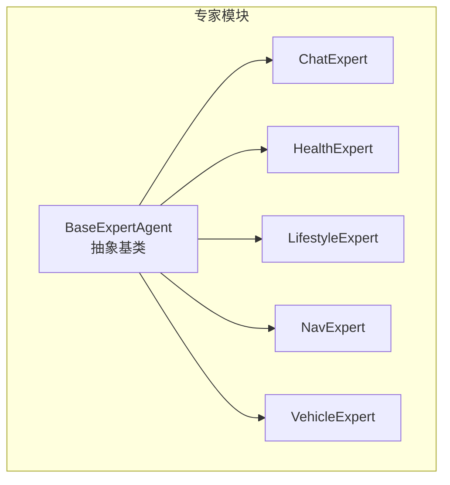
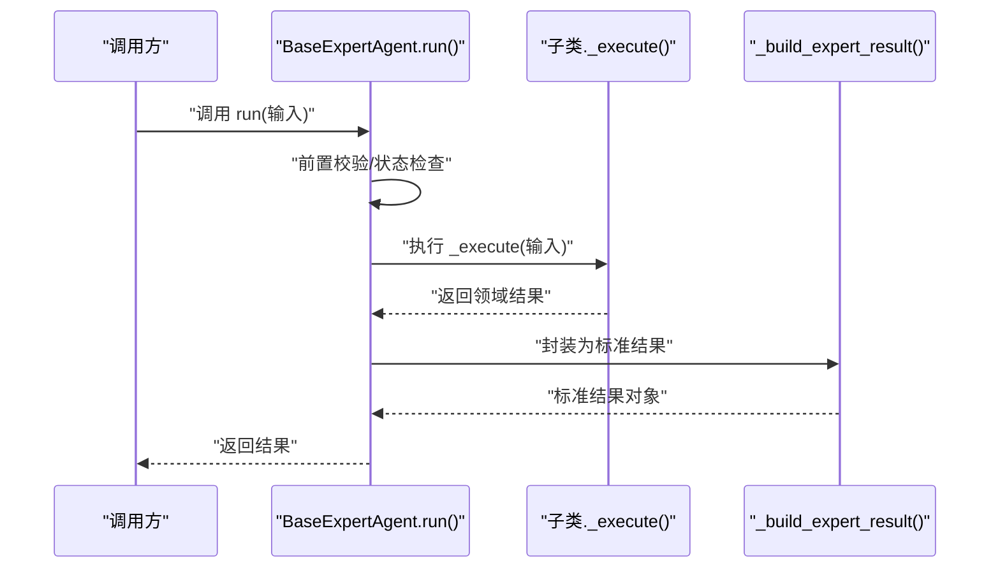
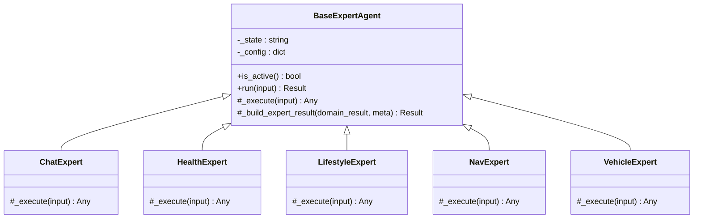
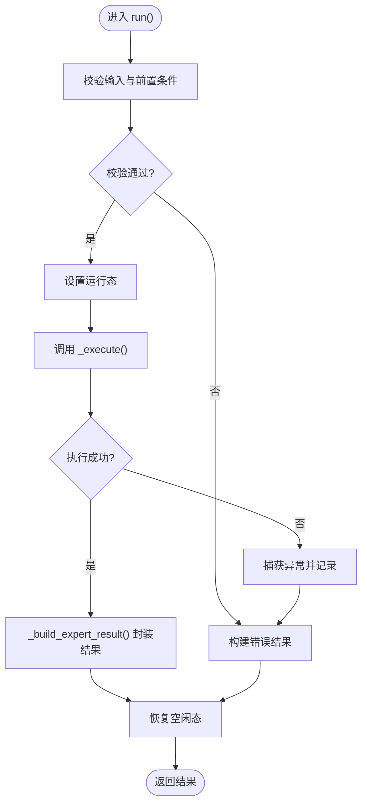
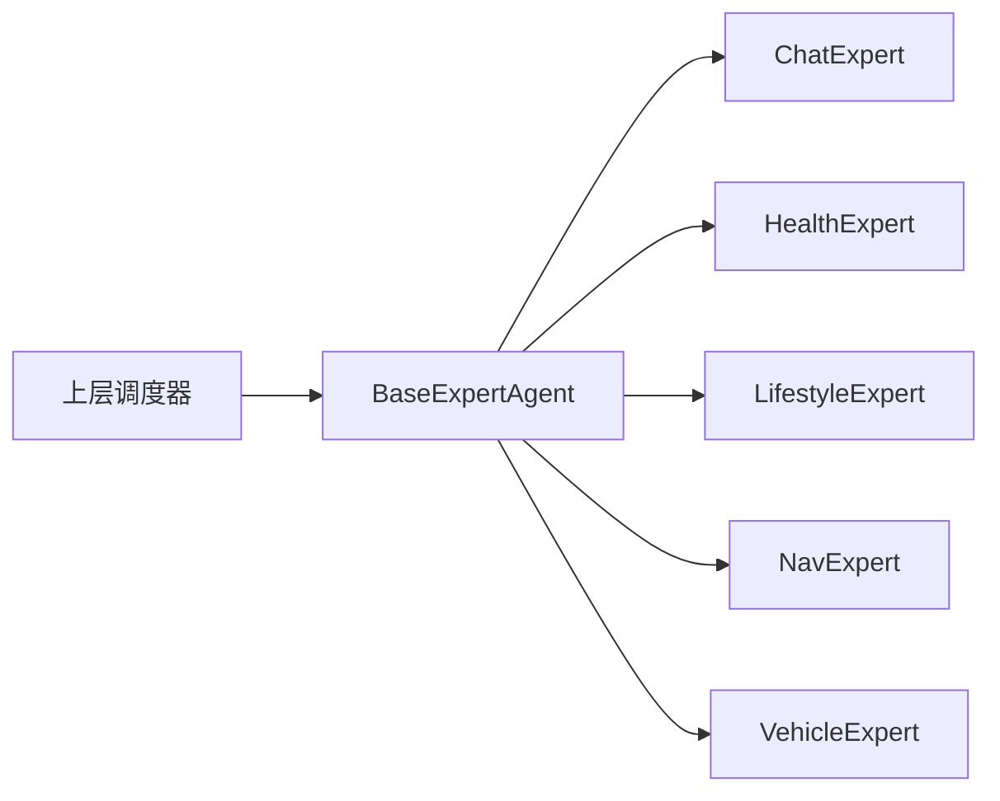

# BaseExpertAgent基类设计

<cite>
**本文引用的文件**   
- [base.py](file://backend_design/nexus/agent/experts/base.py)
- [chat_expert.py](file://backend_design/nexus/agent/experts/chat_expert.py)
- [health_expert.py](file://backend_design/nexus/agent/experts/health_expert.py)
- [lifestyle_expert.py](file://backend_design/nexus/agent/experts/lifestyle_expert.py)
- [nav_expert.py](file://backend_design/nexus/agent/experts/nav_expert.py)
- [vehicle_expert.py](file://backend_design/nexus/agent/experts/vehicle_expert.py)
</cite>

## 目录
1. [简介](#简介)
2. [项目结构](#项目结构)
3. [核心组件](#核心组件)
4. [架构总览](#架构总览)
5. [详细组件分析](#详细组件分析)
6. [依赖分析](#依赖分析)
7. [性能考虑](#性能考虑)
8. [故障排查指南](#故障排查指南)
9. [结论](#结论)
10. [附录](#附录)

## 简介
本文件围绕专家Agent的抽象基类 BaseExpertAgent，系统化阐述其通用架构模式与实现规范。内容涵盖：
- 专家生命周期管理（初始化、激活/停用、运行、清理）
- 状态更新机制（内部状态字段、外部可见状态、一致性保障）
- 错误处理策略（异常捕获、降级、结果封装）
- 关键方法工作机制：is_active()、run()、_execute()
- 工具方法 _build_expert_result() 的使用方式与返回数据结构
- 自定义专家开发的最佳实践与示例指引

## 项目结构
专家模块位于 backend_design/nexus/agent/experts 下，采用“基类+具体专家”的分层组织方式：
- base.py：定义 BaseExpertAgent 抽象基类，统一专家接口与通用流程
- chat_expert.py、health_expert.py、lifestyle_expert.py、nav_expert.py、vehicle_expert.py：各自领域的具体专家实现，继承自基类并覆写 _execute()

图表来源
- [base.py](file://backend_design/nexus/agent/experts/base.py)
- [chat_expert.py](file://backend_design/nexus/agent/experts/chat_expert.py)
- [health_expert.py](file://backend_design/nexus/agent/experts/health_expert.py)
- [lifestyle_expert.py](file://backend_design/nexus/agent/experts/lifestyle_expert.py)
- [nav_expert.py](file://backend_design/nexus/agent/experts/nav_expert.py)
- [vehicle_expert.py](file://backend_design/nexus/agent/experts/vehicle_expert.py)

章节来源
- [base.py](file://backend_design/nexus/agent/experts/base.py)
- [chat_expert.py](file://backend_design/nexus/agent/experts/chat_expert.py)
- [health_expert.py](file://backend_design/nexus/agent/experts/health_expert.py)
- [lifestyle_expert.py](file://backend_design/nexus/agent/experts/lifestyle_expert.py)
- [nav_expert.py](file://backend_design/nexus/agent/experts/nav_expert.py)
- [vehicle_expert.py](file://backend_design/nexus/agent/experts/vehicle_expert.py)

## 核心组件
- BaseExpertAgent（抽象基类）
  - 职责：定义专家的统一入口 run()、活跃性判定 is_active()、执行钩子 _execute()、结果构建 _build_expert_result()、以及生命周期与状态管理的通用逻辑
  - 关键点：
    - run() 负责调用前校验、异常兜底、日志与指标埋点、最终结果封装
    - is_active() 用于快速判断专家是否可参与调度（如配置开关、依赖就绪等）
    - _execute() 为抽象方法，由子类实现具体业务逻辑
    - _build_expert_result() 提供统一的返回结构，便于上层消费

- 具体专家（ChatExpert、HealthExpert、LifestyleExpert、NavExpert、VehicleExpert）
  - 职责：在 _execute() 中实现领域特定的推理或工具调用，并遵循基类约定的输入输出契约

章节来源
- [base.py](file://backend_design/nexus/agent/experts/base.py)
- [chat_expert.py](file://backend_design/nexus/agent/experts/chat_expert.py)
- [health_expert.py](file://backend_design/nexus/agent/experts/health_expert.py)
- [lifestyle_expert.py](file://backend_design/nexus/agent/experts/lifestyle_expert.py)
- [nav_expert.py](file://backend_design/nexus/agent/experts/nav_expert.py)
- [vehicle_expert.py](file://backend_design/nexus/agent/experts/vehicle_expert.py)

## 架构总览
下图展示了专家调用的典型时序：上层调度器根据 is_active() 筛选可用专家，随后调用 run()；run() 在执行前后进行状态与异常处理，并最终委托 _execute() 完成领域逻辑，再通过 _build_expert_result() 生成标准化结果。

图表来源
- [base.py](file://backend_design/nexus/agent/experts/base.py)

## 详细组件分析

### BaseExpertAgent 抽象基类
- 设计要点
  - 生命周期管理：提供统一的启动/停止/重置语义（若实现），确保资源释放与状态一致
  - 状态更新机制：维护内部状态（如运行中、空闲、错误），对外暴露稳定可读的状态视图
  - 错误处理策略：在 run() 中捕获异常，记录上下文，必要时降级返回安全默认值
  - 可扩展性：通过 _execute() 开放扩展点，保持上层流程不变

- 关键方法说明
  - is_active()
    - 作用：快速判定专家是否处于可执行状态（例如配置未禁用、依赖服务正常）
    - 返回值：布尔值，表示是否允许进入 run() 的执行路径
    - 建议：将昂贵检查缓存或延迟到首次调用后，避免频繁开销
  - run()
    - 作用：专家执行的受控入口，包含参数校验、状态切换、异常兜底、结果封装
    - 流程：
      1) 校验输入与前置条件
      2) 标记运行态（如有）
      3) 调用 _execute()
      4) 捕获异常并记录
      5) 使用 _build_expert_result() 生成标准结果
      6) 恢复状态并返回
  - _execute()
    - 作用：抽象方法，子类必须实现
    - 约定：接收输入参数，返回领域结果；不应吞掉异常，交由 run() 统一处理
  - _build_expert_result()
    - 作用：将领域结果包装为统一的数据结构，便于上层聚合与展示
    - 返回结构（概念性描述）：
      - 状态码/成功标志
      - 数据载荷（领域结果）
      - 元信息（耗时、追踪ID、版本等）
      - 错误信息（失败时）

图表来源
- [base.py](file://backend_design/nexus/agent/experts/base.py)
- [chat_expert.py](file://backend_design/nexus/agent/experts/chat_expert.py)
- [health_expert.py](file://backend_design/nexus/agent/experts/health_expert.py)
- [lifestyle_expert.py](file://backend_design/nexus/agent/experts/lifestyle_expert.py)
- [nav_expert.py](file://backend_design/nexus/agent/experts/nav_expert.py)
- [vehicle_expert.py](file://backend_design/nexus/agent/experts/vehicle_expert.py)

章节来源
- [base.py](file://backend_design/nexus/agent/experts/base.py)

### 具体专家实现要点
- ChatExpert
  - 关注点：对话上下文、意图识别、消息组装
  - 在 _execute() 中实现对话相关逻辑，并遵循基类返回约定
- HealthExpert
  - 关注点：健康数据读取、规则推理、风险提示
  - 注意数据源可用性与健康阈值配置
- LifestyleExpert
  - 关注点：习惯偏好、日程提醒、个性化建议
  - 结合用户画像与历史行为进行决策
- NavExpert
  - 关注点：导航查询、路线规划、实时路况
  - 需处理外部地图服务的超时与降级
- VehicleExpert
  - 关注点：车辆控制、状态查询、权限校验
  - 强调安全边界与操作幂等

章节来源
- [chat_expert.py](file://backend_design/nexus/agent/experts/chat_expert.py)
- [health_expert.py](file://backend_design/nexus/agent/experts/health_expert.py)
- [lifestyle_expert.py](file://backend_design/nexus/agent/experts/lifestyle_expert.py)
- [nav_expert.py](file://backend_design/nexus/agent/experts/nav_expert.py)
- [vehicle_expert.py](file://backend_design/nexus/agent/experts/vehicle_expert.py)

### run() 执行流程（流程图）

图表来源
- [base.py](file://backend_design/nexus/agent/experts/base.py)

## 依赖分析
- 内聚性与耦合度
  - BaseExpertAgent 仅暴露最小必要接口，降低与上层调度器的耦合
  - 具体专家通过覆写 _execute() 实现高内聚的领域逻辑
- 外部依赖
  - 各专家可能依赖外部服务（如地图、车辆总线、健康数据源），应在 is_active() 中进行轻量级就绪检查
- 可能的循环依赖
  - 专家之间应避免直接相互调用，如需协作，应通过上层编排器协调

图表来源
- [base.py](file://backend_design/nexus/agent/experts/base.py)
- [chat_expert.py](file://backend_design/nexus/agent/experts/chat_expert.py)
- [health_expert.py](file://backend_design/nexus/agent/experts/health_expert.py)
- [lifestyle_expert.py](file://backend_design/nexus/agent/experts/lifestyle_expert.py)
- [nav_expert.py](file://backend_design/nexus/agent/experts/nav_expert.py)
- [vehicle_expert.py](file://backend_design/nexus/agent/experts/vehicle_expert.py)

章节来源
- [base.py](file://backend_design/nexus/agent/experts/base.py)
- [chat_expert.py](file://backend_design/nexus/agent/experts/chat_expert.py)
- [health_expert.py](file://backend_design/nexus/agent/experts/health_expert.py)
- [lifestyle_expert.py](file://backend_design/nexus/agent/experts/lifestyle_expert.py)
- [nav_expert.py](file://backend_design/nexus/agent/experts/nav_expert.py)
- [vehicle_expert.py](file://backend_design/nexus/agent/experts/vehicle_expert.py)

## 性能考虑
- 避免在 is_active() 中执行重IO，必要时引入缓存或惰性初始化
- run() 中的异常路径应尽量轻量，避免二次异常
- _build_expert_result() 构造的对象应保持不可变或浅拷贝，减少复制成本
- 对长耗时任务，建议在 _execute() 中采用异步或分片处理，并在结果中携带进度标识

## 故障排查指南
- 常见问题
  - is_active() 返回 false：检查配置项与依赖服务状态
  - run() 抛出异常：查看日志上下文，确认 _execute() 是否正确传播异常
  - 结果结构不一致：核对 _build_expert_result() 的字段与类型
- 定位步骤
  - 在 run() 前后增加关键日志（进入、异常、返回）
  - 在 _execute() 中记录输入摘要与中间状态
  - 使用追踪ID贯穿请求链路，便于跨模块关联

章节来源
- [base.py](file://backend_design/nexus/agent/experts/base.py)

## 结论
BaseExpertAgent 通过统一的 run() 入口、灵活的 _execute() 扩展点与标准化的结果封装，构建了高内聚、低耦合的专家体系。遵循 is_active() 的快速判定、run() 的健壮流程与 _build_expert_result() 的结构化输出，可有效提升系统的可维护性与可观测性。

## 附录
- 自定义专家开发最佳实践
  - 明确输入输出契约：在 _execute() 中严格校验输入，保证输出符合基类约定
  - 错误不吞没：将异常上抛至 run() 统一处理，避免静默失败
  - 状态一致性：仅在 run() 中切换状态，_execute() 专注业务
  - 可观测性：在 _execute() 中记录关键指标与上下文
  - 可测试性：将领域逻辑拆分为可独立测试的小函数，便于单测覆盖
  - 示例参考路径（不含代码）：
    - [chat_expert.py](file://backend_design/nexus/agent/experts/chat_expert.py)
    - [health_expert.py](file://backend_design/nexus/agent/experts/health_expert.py)
    - [lifestyle_expert.py](file://backend_design/nexus/agent/experts/lifestyle_expert.py)
    - [nav_expert.py](file://backend_design/nexus/agent/experts/nav_expert.py)
    - [vehicle_expert.py](file://backend_design/nexus/agent/experts/vehicle_expert.py)