# 专家Agent体系

<cite>
**本文引用的文件**   
- [backend_design/nexus/agent/experts/base.py](file://backend_design/nexus/agent/experts/base.py)
- [backend_design/nexus/agent/experts/vehicle_expert.py](file://backend_design/nexus/agent/experts/vehicle_expert.py)
- [backend_design/nexus/agent/experts/nav_expert.py](file://backend_design/nexus/agent/experts/nav_expert.py)
- [backend_design/nexus/agent/experts/lifestyle_expert.py](file://backend_design/nexus/agent/experts/lifestyle_expert.py)
- [backend_design/nexus/agent/experts/health_expert.py](file://backend_design/nexus/agent/experts/health_expert.py)
- [backend_design/nexus/agent/experts/chat_expert.py](file://backend_design/nexus/agent/experts/chat_expert.py)
- [backend_design/nexus/agent/responder.py](file://backend_design/nexus/agent/responder.py)
- [backend_design/nexus/agent/reviewer.py](file://backend_design/nexus/agent/reviewer.py)
- [backend_design/nexus/agent/supervisor_graph.py](file://backend_design/nexus/agent/supervisor_graph.py)
- [backend_design/nexus/intent/router.py](file://backend_design/nexus/intent/router.py)
- [backend_design/nexus/intent/heuristic.py](file://backend_design/nexus/intent/heuristic.py)
- [backend_design/nexus/intent/llm_router.py](file://backend_design/nexus/intent/llm_router.py)
- [backend_design/nexus/models/state.py](file://backend_design/nexus/models/state.py)
- [backend_design/nexus/core/cockpit_manager.py](file://backend_design/nexus/core/cockpit_manager.py)
- [backend_design/nexus/api/routes/chat.py](file://backend_design/nexus/api/routes/chat.py)
</cite>

## 目录
1. [简介](#简介)
2. [项目结构](#项目结构)
3. [核心组件](#核心组件)
4. [架构总览](#架构总览)
5. [详细组件分析](#详细组件分析)
6. [依赖关系分析](#依赖关系分析)
7. [性能与并发](#性能与并发)
8. [故障排查指南](#故障排查指南)
9. [结论](#结论)
10. [附录：自定义专家开发指南](#附录自定义专家开发指南)

## 简介
本文件系统化阐述 NexusCockpit 的“专家Agent体系”，围绕 BaseExpertAgent 抽象基类与五个具体专家（车辆、导航、生活、健康、闲聊）展开，覆盖以下主题：
- 专家注册机制与发现
- 并行执行模型与结果合并策略
- 专家间通信协议
- 错误处理与降级
- 各专家的职责边界、输入输出格式与集成示例
- 自定义专家开发指南

## 项目结构
专家体系位于 agent 子模块中，包含：
- 抽象基类与具体专家实现
- 编排器（Supervisor）、审查者（Reviewer）、应答器（Responder）
- 意图路由（Heuristic/LLM Router）
- 状态模型与 Cockpit 管理器
- API 层接入点

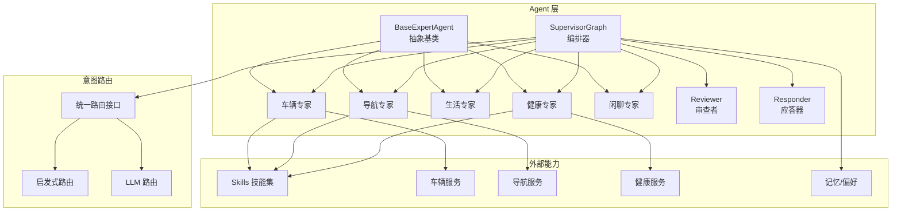

图表来源
- [backend_design/nexus/agent/experts/base.py](file://backend_design/nexus/agent/experts/base.py)
- [backend_design/nexus/agent/experts/vehicle_expert.py](file://backend_design/nexus/agent/experts/vehicle_expert.py)
- [backend_design/nexus/agent/experts/nav_expert.py](file://backend_design/nexus/agent/experts/nav_expert.py)
- [backend_design/nexus/agent/experts/lifestyle_expert.py](file://backend_design/nexus/agent/experts/lifestyle_expert.py)
- [backend_design/nexus/agent/experts/health_expert.py](file://backend_design/nexus/agent/experts/health_expert.py)
- [backend_design/nexus/agent/experts/chat_expert.py](file://backend_design/nexus/agent/experts/chat_expert.py)
- [backend_design/nexus/agent/supervisor_graph.py](file://backend_design/nexus/agent/supervisor_graph.py)
- [backend_design/nexus/agent/reviewer.py](file://backend_design/nexus/agent/reviewer.py)
- [backend_design/nexus/agent/responder.py](file://backend_design/nexus/agent/responder.py)
- [backend_design/nexus/intent/router.py](file://backend_design/nexus/intent/router.py)
- [backend_design/nexus/intent/heuristic.py](file://backend_design/nexus/intent/heuristic.py)
- [backend_design/nexus/intent/llm_router.py](file://backend_design/nexus/intent/llm_router.py)
- [backend_design/nexus/core/cockpit_manager.py](file://backend_design/nexus/core/cockpit_manager.py)

章节来源
- [backend_design/nexus/agent/experts/base.py](file://backend_design/nexus/agent/experts/base.py)
- [backend_design/nexus/agent/supervisor_graph.py](file://backend_design/nexus/agent/supervisor_graph.py)
- [backend_design/nexus/intent/router.py](file://backend_design/nexus/intent/router.py)

## 核心组件
- BaseExpertAgent：定义专家的统一接口、元数据、上下文、工具调用、错误与超时控制、可观测性埋点等。
- 具体专家：车辆、导航、生活、健康、闲聊，分别实现领域特定的处理逻辑与工具调用。
- SupervisorGraph：根据意图路由选择并编排一个或多个专家并行执行，负责结果合并与流程控制。
- Reviewer：对专家输出进行质量校验、合规检查与二次修正建议。
- Responder：将最终结果转换为前端/客户端可读的响应格式。
- Intent Router：提供启发式与 LLM 两种路由策略，决定由哪个或哪些专家处理请求。
- State/CockpitManager：维护会话状态、用户上下文与全局资源。

章节来源
- [backend_design/nexus/agent/experts/base.py](file://backend_design/nexus/agent/experts/base.py)
- [backend_design/nexus/agent/supervisor_graph.py](file://backend_design/nexus/agent/supervisor_graph.py)
- [backend_design/nexus/agent/reviewer.py](file://backend_design/nexus/agent/reviewer.py)
- [backend_design/nexus/agent/responder.py](file://backend_design/nexus/agent/responder.py)
- [backend_design/nexus/intent/router.py](file://backend_design/nexus/intent/router.py)
- [backend_design/nexus/models/state.py](file://backend_design/nexus/models/state.py)
- [backend_design/nexus/core/cockpit_manager.py](file://backend_design/nexus/core/cockpit_manager.py)

## 架构总览
下图展示一次典型的用户请求从 API 到专家执行再到响应的完整链路。

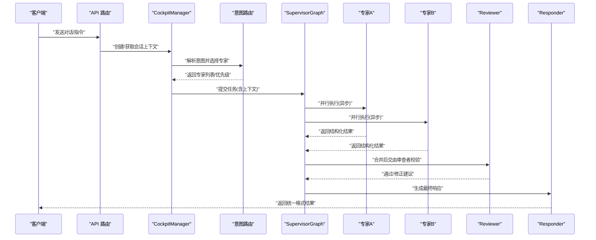

图表来源
- [backend_design/nexus/api/routes/chat.py](file://backend_design/nexus/api/routes/chat.py)
- [backend_design/nexus/core/cockpit_manager.py](file://backend_design/nexus/core/cockpit_manager.py)
- [backend_design/nexus/intent/router.py](file://backend_design/nexus/intent/router.py)
- [backend_design/nexus/agent/supervisor_graph.py](file://backend_design/nexus/agent/supervisor_graph.py)
- [backend_design/nexus/agent/reviewer.py](file://backend_design/nexus/agent/reviewer.py)
- [backend_design/nexus/agent/responder.py](file://backend_design/nexus/agent/responder.py)

## 详细组件分析

### BaseExpertAgent 抽象基类
职责与要点：
- 统一入口：定义 run/invoke 方法，封装参数校验、上下文注入、工具调用、异常捕获与日志埋点。
- 元数据：name、version、description、tags、capabilities，用于注册与路由匹配。
- 上下文：支持用户画像、历史消息、设备信息、权限范围等。
- 工具调用：提供统一的工具调用接口，便于扩展第三方能力（如车辆控制、导航、健康查询）。
- 错误与超时：标准化错误码、重试策略、熔断与超时控制。
- 可观测性：指标上报、追踪ID、审计日志。

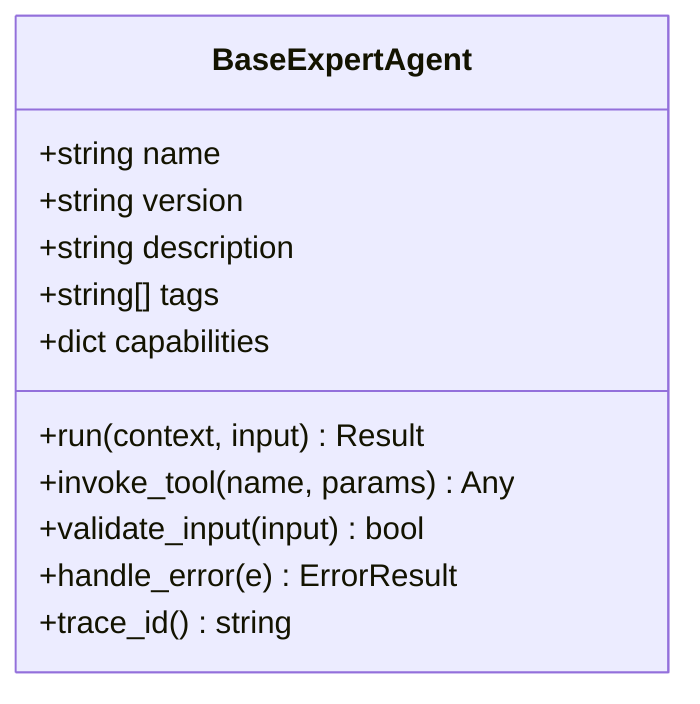

图表来源
- [backend_design/nexus/agent/experts/base.py](file://backend_design/nexus/agent/experts/base.py)

章节来源
- [backend_design/nexus/agent/experts/base.py](file://backend_design/nexus/agent/experts/base.py)

### 车辆专家（Vehicle Expert）
职责边界：
- 车辆状态读取、空调/座椅/车窗控制、媒体播放、车辆诊断等。
- 与车辆服务/技能集交互，遵循安全与权限约束。

输入输出：
- 输入：自然语言指令、车辆上下文（车型、当前状态、权限）。
- 输出：结构化操作结果、状态变更确认、错误码与提示。

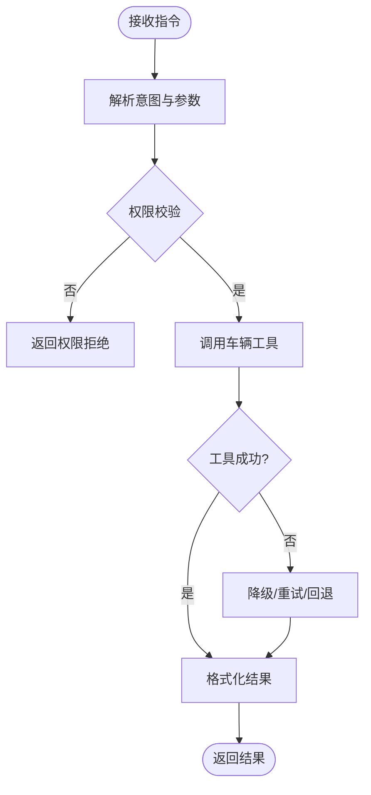

图表来源
- [backend_design/nexus/agent/experts/vehicle_expert.py](file://backend_design/nexus/agent/experts/vehicle_expert.py)

章节来源
- [backend_design/nexus/agent/experts/vehicle_expert.py](file://backend_design/nexus/agent/experts/vehicle_expert.py)

### 导航专家（Navigation Expert）
职责边界：
- 目的地规划、路线计算、实时路况、POI搜索、多模态导航引导。
- 与导航服务/地图技能集交互。

输入输出：
- 输入：起点/终点、偏好（最快/最短/避开拥堵）、时间窗口。
- 输出：路线摘要、ETA、关键节点、异常提示。

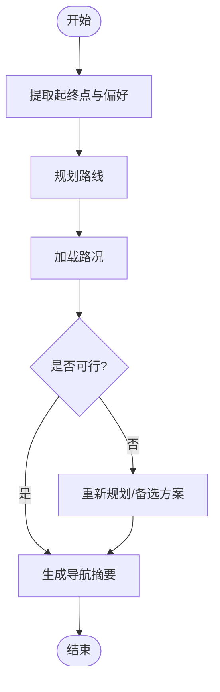

图表来源
- [backend_design/nexus/agent/experts/nav_expert.py](file://backend_design/nexus/agent/experts/nav_expert.py)

章节来源
- [backend_design/nexus/agent/experts/nav_expert.py](file://backend_design/nexus/agent/experts/nav_expert.py)

### 生活专家（Lifestyle Expert）
职责边界：
- 日程管理、提醒、习惯养成、兴趣推荐、消费与生活建议。
- 与记忆/偏好、日历、提醒服务等技能集交互。

输入输出：
- 输入：用户偏好、历史行为、当前场景。
- 输出：个性化建议、待办项、提醒计划。

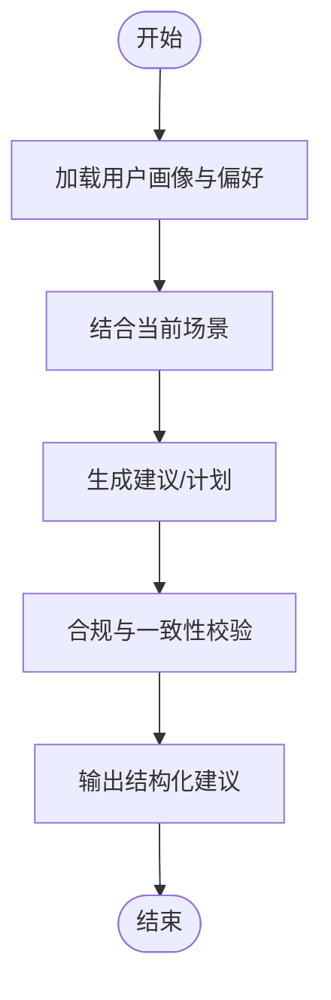

图表来源
- [backend_design/nexus/agent/experts/lifestyle_expert.py](file://backend_design/nexus/agent/experts/lifestyle_expert.py)

章节来源
- [backend_design/nexus/agent/experts/lifestyle_expert.py](file://backend_design/nexus/agent/experts/lifestyle_expert.py)

### 健康专家（Health Expert）
职责边界：
- 健康数据解读、运动建议、睡眠/心率/体重趋势分析、就医指引。
- 与健康管理服务/知识库交互，严格隐私保护。

输入输出：
- 输入：健康指标、体检报告片段、用户目标。
- 输出：健康洞察、风险提示、行动建议。

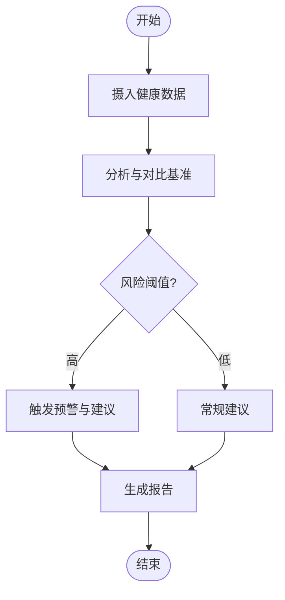

图表来源
- [backend_design/nexus/agent/experts/health_expert.py](file://backend_design/nexus/agent/experts/health_expert.py)

章节来源
- [backend_design/nexus/agent/experts/health_expert.py](file://backend_design/nexus/agent/experts/health_expert.py)

### 闲聊专家（Chat Expert）
职责边界：
- 日常对话、情感陪伴、知识问答、话题引导。
- 作为兜底专家，确保用户体验流畅。

输入输出：
- 输入：自由文本、上下文情绪标签。
- 输出：自然语言回复、可选的后续问题或跳转建议。

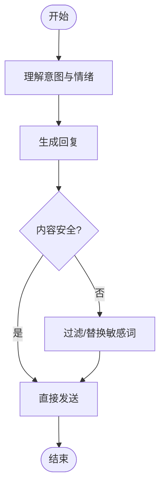

图表来源
- [backend_design/nexus/agent/experts/chat_expert.py](file://backend_design/nexus/agent/experts/chat_expert.py)

章节来源
- [backend_design/nexus/agent/experts/chat_expert.py](file://backend_design/nexus/agent/experts/chat_expert.py)

### 编排器（SupervisorGraph）
职责：
- 基于意图路由选择专家集合，支持单/多专家并行执行。
- 结果合并策略：按优先级、去重、冲突消解、置信度加权。
- 失败处理：部分失败不影响整体，降级为可用专家结果。

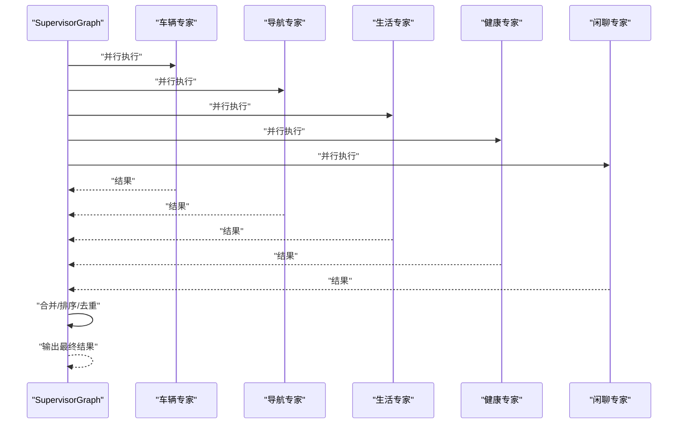

图表来源
- [backend_design/nexus/agent/supervisor_graph.py](file://backend_design/nexus/agent/supervisor_graph.py)

章节来源
- [backend_design/nexus/agent/supervisor_graph.py](file://backend_design/nexus/agent/supervisor_graph.py)

### 审查者（Reviewer）
职责：
- 对合并后的结果进行质量与合规校验。
- 提供修正建议或自动修复（如格式规范化、敏感信息脱敏）。

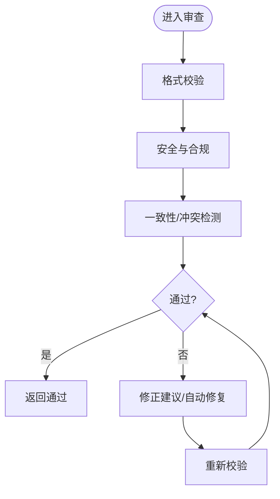

图表来源
- [backend_design/nexus/agent/reviewer.py](file://backend_design/nexus/agent/reviewer.py)

章节来源
- [backend_design/nexus/agent/reviewer.py](file://backend_design/nexus/agent/reviewer.py)

### 应答器（Responder）
职责：
- 将内部结构化结果转换为对外统一响应格式（JSON/流式）。
- 附加元数据（耗时、追踪ID、专家来源）。

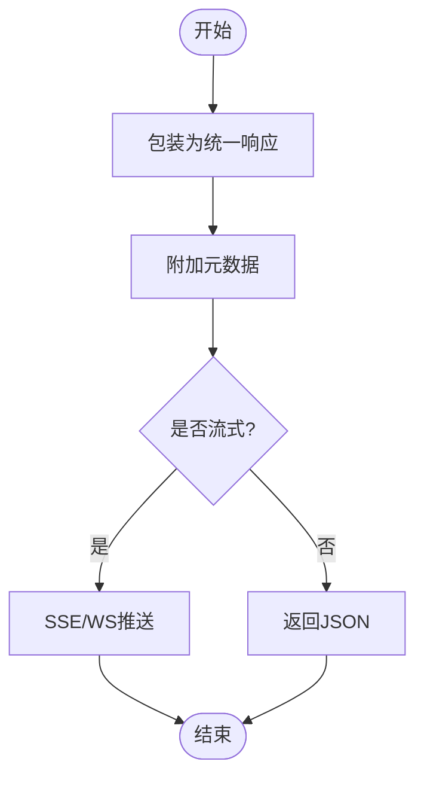

图表来源
- [backend_design/nexus/agent/responder.py](file://backend_design/nexus/agent/responder.py)

章节来源
- [backend_design/nexus/agent/responder.py](file://backend_design/nexus/agent/responder.py)

### 意图路由（Intent Router）
职责：
- 提供启发式规则与 LLM 两种路由策略。
- 输出候选专家列表及权重，供编排器使用。

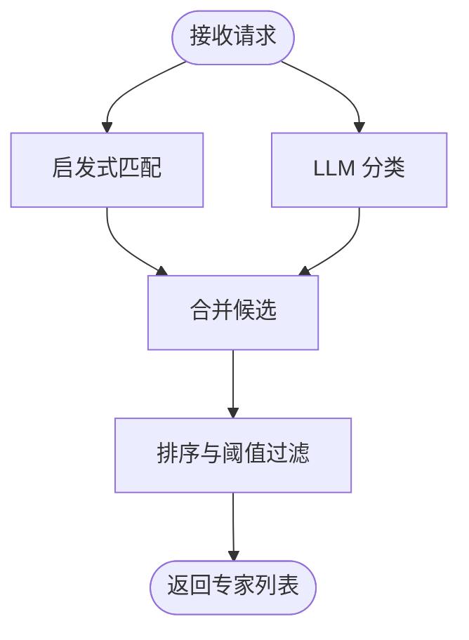

图表来源
- [backend_design/nexus/intent/router.py](file://backend_design/nexus/intent/router.py)
- [backend_design/nexus/intent/heuristic.py](file://backend_design/nexus/intent/heuristic.py)
- [backend_design/nexus/intent/llm_router.py](file://backend_design/nexus/intent/llm_router.py)

章节来源
- [backend_design/nexus/intent/router.py](file://backend_design/nexus/intent/router.py)
- [backend_design/nexus/intent/heuristic.py](file://backend_design/nexus/intent/heuristic.py)
- [backend_design/nexus/intent/llm_router.py](file://backend_design/nexus/intent/llm_router.py)

## 依赖关系分析
- 专家与工具：各专家通过 BaseExpertAgent.invoke_tool 调用 Skills 或外部服务。
- 编排与路由：SupervisorGraph 依赖 Intent Router 输出；Reviewer/Responder 在编排后串联。
- 状态与会话：State/CockpitManager 贯穿全链路，提供上下文与持久化。

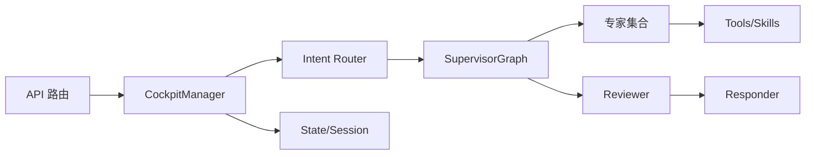

图表来源
- [backend_design/nexus/api/routes/chat.py](file://backend_design/nexus/api/routes/chat.py)
- [backend_design/nexus/core/cockpit_manager.py](file://backend_design/nexus/core/cockpit_manager.py)
- [backend_design/nexus/intent/router.py](file://backend_design/nexus/intent/router.py)
- [backend_design/nexus/agent/supervisor_graph.py](file://backend_design/nexus/agent/supervisor_graph.py)
- [backend_design/nexus/agent/reviewer.py](file://backend_design/nexus/agent/reviewer.py)
- [backend_design/nexus/agent/responder.py](file://backend_design/nexus/agent/responder.py)

章节来源
- [backend_design/nexus/api/routes/chat.py](file://backend_design/nexus/api/routes/chat.py)
- [backend_design/nexus/core/cockpit_manager.py](file://backend_design/nexus/core/cockpit_manager.py)
- [backend_design/nexus/intent/router.py](file://backend_design/nexus/intent/router.py)
- [backend_design/nexus/agent/supervisor_graph.py](file://backend_design/nexus/agent/supervisor_graph.py)
- [backend_design/nexus/agent/reviewer.py](file://backend_design/nexus/agent/reviewer.py)
- [backend_design/nexus/agent/responder.py](file://backend_design/nexus/agent/responder.py)

## 性能与并发
- 并行执行：SupervisorGraph 对多个专家采用异步并发执行，降低端到端延迟。
- 超时与重试：BaseExpertAgent 内置超时控制与有限重试，避免级联失败。
- 结果合并：采用优先级与置信度加权，减少冗余与冲突。
- 缓存与复用：对热点查询（如天气、POI）启用短期缓存，提升吞吐。
- 背压与限流：结合中间件层进行速率限制与队列缓冲，保障稳定性。

[本节为通用指导，不直接分析具体文件]

## 故障排查指南
常见问题与定位步骤：
- 专家未注册或无法发现：检查专家元数据与注册表，确认名称与版本一致。
- 路由错误导致选错专家：查看启发式规则与 LLM 分类日志，调整关键词或提示词。
- 并行执行超时：检查各专家工具调用耗时与网络状况，适当调大超时阈值。
- 结果合并冲突：审查合并策略与优先级配置，必要时引入冲突消解规则。
- 审查失败：关注安全与合规规则，修正敏感词库或脱敏策略。
- 响应格式异常：核对 Responder 的输出模板与字段映射。

章节来源
- [backend_design/nexus/agent/experts/base.py](file://backend_design/nexus/agent/experts/base.py)
- [backend_design/nexus/agent/supervisor_graph.py](file://backend_design/nexus/agent/supervisor_graph.py)
- [backend_design/nexus/agent/reviewer.py](file://backend_design/nexus/agent/reviewer.py)
- [backend_design/nexus/agent/responder.py](file://backend_design/nexus/agent/responder.py)

## 结论
专家Agent体系以 BaseExpertAgent 为核心，配合 SupervisorGraph 的并行编排与 Reviewer/Responder 的质量保障，形成可扩展、高可用的智能体平台。通过统一的路由与通信协议，系统能够灵活组合多领域专家，满足复杂车载场景需求。

[本节为总结，不直接分析具体文件]

## 附录：自定义专家开发指南
开发步骤：
- 继承 BaseExpertAgent，实现 run/invoke 方法与 validate_input。
- 定义元数据（name、version、description、tags、capabilities），便于注册与路由。
- 在 invoke_tool 中对接 Skills 或外部服务，注意权限与安全校验。
- 处理异常与超时，返回标准错误结构，便于上层合并与降级。
- 编写单元测试，覆盖正常路径、异常路径与边界条件。
- 在注册表中登记新专家，更新路由规则（启发式/LLM）。

最佳实践：
- 保持单一职责，避免跨域耦合。
- 使用上下文传递必要信息，避免重复请求。
- 记录追踪ID与关键指标，便于排障与优化。
- 对敏感数据进行脱敏与最小化暴露。

章节来源
- [backend_design/nexus/agent/experts/base.py](file://backend_design/nexus/agent/experts/base.py)
- [backend_design/nexus/agent/supervisor_graph.py](file://backend_design/nexus/agent/supervisor_graph.py)
- [backend_design/nexus/intent/router.py](file://backend_design/nexus/intent/router.py)