# 健康咨询专家

<cite>
**本文引用的文件**   
- [health_expert.py](file://backend_design/nexus/agent/experts/health_expert.py)
- [base.py](file://backend_design/nexus/agent/experts/base.py)
- [chat_expert.py](file://backend_design/nexus/agent/experts/chat_expert.py)
- [responder.py](file://backend_design/nexus/agent/responder.py)
- [reviewer.py](file://backend_design/nexus/agent/reviewer.py)
- [supervisor_graph.py](file://backend_design/nexus/agent/supervisor_graph.py)
- [health.py](file://backend_design/nexus/api/routes/health.py)
- [unified_retriever.py](file://backend_design/nexus/rag/unified_retriever.py)
- [graph_store.py](file://backend_design/nexus/rag/graph_store.py)
- [vector_store.py](file://backend_design/nexus/rag/vector_store.py)
- [reranker_base.py](file://backend_design/nexus/rag/reranker_base.py)
- [embedding.py](file://backend_design/nexus/rag/embedding.py)
- [orchestrator.py](file://backend_design/nexus/skills/orchestrator.py)
- [health_skill.py](file://backend_design/nexus/skills/health.py)
- [schemas.py](file://backend_design/nexus/models/schemas.py)
- [state.py](file://backend_design/nexus/models/state.py)
- [auth.py](file://backend_design/nexus/core/auth.py)
- [personalization.py](file://backend_design/nexus/core/personalization.py)
- [data_retention.py](file://backend_design/nexus/observability/data_retention.py)
- [langfuse.py](file://backend_design/nexus/observability/langfuse.py)
- [config.py](file://backend_design/nexus/config.py)
</cite>

## 目录
1. [简介](#简介)
2. [项目结构](#项目结构)
3. [核心组件](#核心组件)
4. [架构总览](#架构总览)
5. [详细组件分析](#详细组件分析)
6. [依赖关系分析](#依赖关系分析)
7. [性能考量](#性能考量)
8. [故障排查指南](#故障排查指南)
9. [结论](#结论)
10. [附录](#附录)

## 简介
本文件面向“健康咨询专家”能力，系统性阐述知识检索、建议生成与专业性保证机制；覆盖健康数据隐私保护、敏感信息过滤与免责声明策略；并给出健康知识来源验证、置信度评估与风险提示策略。同时提供对话安全规范与合规要求，帮助开发者与安全合规团队落地可审计、可追溯、可回滚的健康咨询服务。

## 项目结构
与健康咨询相关的代码主要分布在以下模块：
- Agent 层：专家路由、审查与编排（健康专家、聊天专家、审查器、监督图）
- RAG 层：统一检索、向量/图谱存储、重排与嵌入
- Skills 层：健康技能编排与执行
- API 层：健康相关接口
- 模型与状态：消息与对话状态定义
- 核心能力：鉴权、个性化、数据保留与可观测性
- 配置：全局配置项

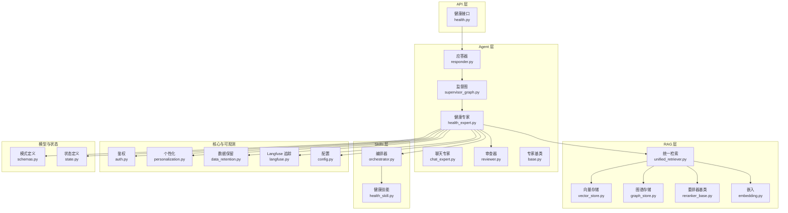

图表来源
- [health_expert.py:1-200](file://backend_design/nexus/agent/experts/health_expert.py#L1-L200)
- [unified_retriever.py:1-200](file://backend_design/nexus/rag/unified_retriever.py#L1-L200)
- [vector_store.py:1-200](file://backend_design/nexus/rag/vector_store.py#L1-L200)
- [graph_store.py:1-200](file://backend_design/nexus/rag/graph_store.py#L1-L200)
- [reranker_base.py:1-200](file://backend_design/nexus/rag/reranker_base.py#L1-L200)
- [embedding.py:1-200](file://backend_design/nexus/rag/embedding.py#L1-L200)
- [orchestrator.py:1-200](file://backend_design/nexus/skills/orchestrator.py#L1-L200)
- [health_skill.py:1-200](file://backend_design/nexus/skills/health.py#L1-L200)
- [health.py:1-200](file://backend_design/nexus/api/routes/health.py#L1-L200)
- [auth.py:1-200](file://backend_design/nexus/core/auth.py#L1-L200)
- [personalization.py:1-200](file://backend_design/nexus/core/personalization.py#L1-L200)
- [data_retention.py:1-200](file://backend_design/nexus/observability/data_retention.py#L1-L200)
- [langfuse.py:1-200](file://backend_design/nexus/observability/langfuse.py#L1-L200)
- [config.py:1-200](file://backend_design/nexus/config.py#L1-L200)
- [schemas.py:1-200](file://backend_design/nexus/models/schemas.py#L1-L200)
- [state.py:1-200](file://backend_design/nexus/models/state.py#L1-L200)

章节来源
- [health_expert.py:1-200](file://backend_design/nexus/agent/experts/health_expert.py#L1-L200)
- [unified_retriever.py:1-200](file://backend_design/nexus/rag/unified_retriever.py#L1-L200)
- [vector_store.py:1-200](file://backend_design/nexus/rag/vector_store.py#L1-L200)
- [graph_store.py:1-200](file://backend_design/nexus/rag/graph_store.py#L1-L200)
- [reranker_base.py:1-200](file://backend_design/nexus/rag/reranker_base.py#L1-L200)
- [embedding.py:1-200](file://backend_design/nexus/rag/embedding.py#L1-L200)
- [orchestrator.py:1-200](file://backend_design/nexus/skills/orchestrator.py#L1-L200)
- [health_skill.py:1-200](file://backend_design/nexus/skills/health.py#L1-L200)
- [health.py:1-200](file://backend_design/nexus/api/routes/health.py#L1-L200)
- [auth.py:1-200](file://backend_design/nexus/core/auth.py#L1-L200)
- [personalization.py:1-200](file://backend_design/nexus/core/personalization.py#L1-L200)
- [data_retention.py:1-200](file://backend_design/nexus/observability/data_retention.py#L1-L200)
- [langfuse.py:1-200](file://backend_design/nexus/observability/langfuse.py#L1-L200)
- [config.py:1-200](file://backend_design/nexus/config.py#L1-L200)
- [schemas.py:1-200](file://backend_design/nexus/models/schemas.py#L1-L200)
- [state.py:1-200](file://backend_design/nexus/models/state.py#L1-L200)

## 核心组件
- 健康专家：负责健康领域意图识别、上下文构建、RAG 检索、建议生成、风险标注与免责声明注入。
- 统一检索：聚合向量与图谱检索结果，进行去重、重排与证据溯源。
- 健康技能编排：将健康建议拆解为可执行动作（如提醒、习惯记录），并与用户画像结合。
- 审查器：对输出进行合规校验、敏感词过滤与免责声明强制插入。
- 监督图：协调专家、检索、技能与审查的端到端流程。
- 鉴权与个性化：确保访问控制与基于用户画像的个性化提示。
- 数据保留与可观测：实现数据生命周期管理与调用链追踪。

章节来源
- [health_expert.py:1-200](file://backend_design/nexus/agent/experts/health_expert.py#L1-L200)
- [unified_retriever.py:1-200](file://backend_design/nexus/rag/unified_retriever.py#L1-L200)
- [orchestrator.py:1-200](file://backend_design/nexus/skills/orchestrator.py#L1-L200)
- [reviewer.py:1-200](file://backend_design/nexus/agent/reviewer.py#L1-L200)
- [supervisor_graph.py:1-200](file://backend_design/nexus/agent/supervisor_graph.py#L1-L200)
- [auth.py:1-200](file://backend_design/nexus/core/auth.py#L1-L200)
- [personalization.py:1-200](file://backend_design/nexus/core/personalization.py#L1-L200)
- [data_retention.py:1-200](file://backend_design/nexus/observability/data_retention.py#L1-L200)
- [langfuse.py:1-200](file://backend_design/nexus/observability/langfuse.py#L1-L200)

## 架构总览
健康咨询从请求进入至最终回复的关键路径如下：
- 入口：健康接口接收请求并进行鉴权与会话初始化
- 编排：监督图调度健康专家与审查器
- 检索：统一检索器聚合向量与图谱结果，经重排后返回证据片段
- 生成：健康专家结合用户画像与证据生成建议，注入免责声明与风险提示
- 审查：审查器进行敏感信息过滤、合规校验与格式校验
- 输出：应答器封装响应，记录可观测指标与日志

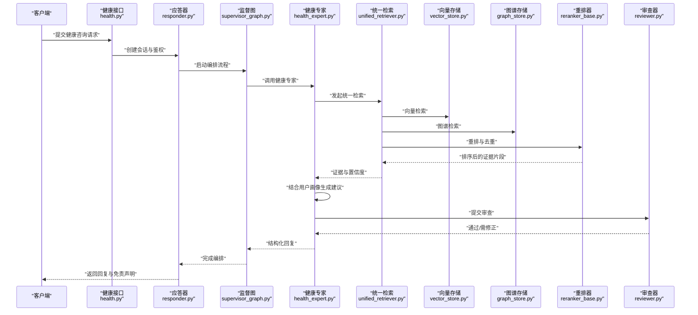

图表来源
- [health.py:1-200](file://backend_design/nexus/api/routes/health.py#L1-L200)
- [responder.py:1-200](file://backend_design/nexus/agent/responder.py#L1-L200)
- [supervisor_graph.py:1-200](file://backend_design/nexus/agent/supervisor_graph.py#L1-L200)
- [health_expert.py:1-200](file://backend_design/nexus/agent/experts/health_expert.py#L1-L200)
- [unified_retriever.py:1-200](file://backend_design/nexus/rag/unified_retriever.py#L1-L200)
- [vector_store.py:1-200](file://backend_design/nexus/rag/vector_store.py#L1-L200)
- [graph_store.py:1-200](file://backend_design/nexus/rag/graph_store.py#L1-L200)
- [reranker_base.py:1-200](file://backend_design/nexus/rag/reranker_base.py#L1-L200)
- [reviewer.py:1-200](file://backend_design/nexus/agent/reviewer.py#L1-L200)

## 详细组件分析

### 健康专家（Health Expert）
职责与流程
- 输入解析：提取症状、病史、用药、生活方式等关键要素
- 上下文构建：融合用户画像、历史会话与健康目标
- 检索增强：调用统一检索获取权威证据片段，附带来源与置信度
- 建议生成：依据证据与个性化约束生成建议，标注风险等级与免责声明
- 审查协作：将输出提交审查器进行敏感信息与合规校验

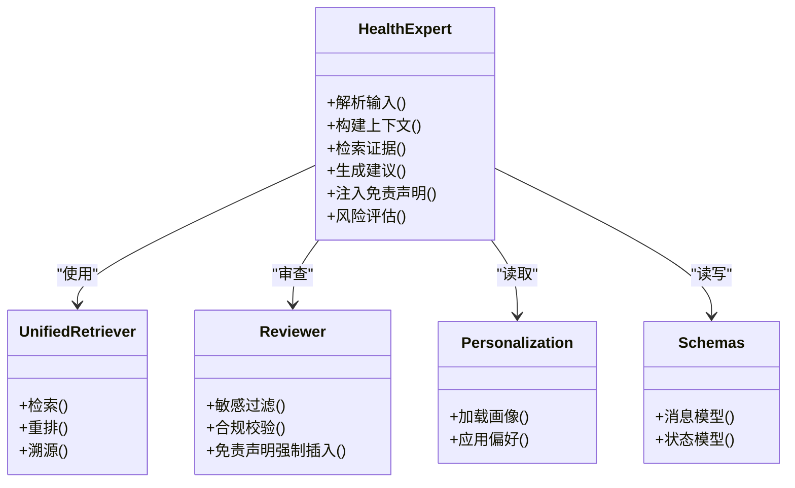

图表来源
- [health_expert.py:1-200](file://backend_design/nexus/agent/experts/health_expert.py#L1-L200)
- [unified_retriever.py:1-200](file://backend_design/nexus/rag/unified_retriever.py#L1-L200)
- [reviewer.py:1-200](file://backend_design/nexus/agent/reviewer.py#L1-L200)
- [personalization.py:1-200](file://backend_design/nexus/core/personalization.py#L1-L200)
- [schemas.py:1-200](file://backend_design/nexus/models/schemas.py#L1-L200)

章节来源
- [health_expert.py:1-200](file://backend_design/nexus/agent/experts/health_expert.py#L1-L200)
- [unified_retriever.py:1-200](file://backend_design/nexus/rag/unified_retriever.py#L1-L200)
- [reviewer.py:1-200](file://backend_design/nexus/agent/reviewer.py#L1-L200)
- [personalization.py:1-200](file://backend_design/nexus/core/personalization.py#L1-L200)
- [schemas.py:1-200](file://backend_design/nexus/models/schemas.py#L1-L200)

### 统一检索（Unified Retriever）
功能要点
- 多源聚合：同时查询向量库与知识图谱，合并候选片段
- 去重与重排：基于相似度与相关性打分，提升证据质量
- 置信度与溯源：为每条证据附加来源元数据与置信度评分
- 降级策略：当某存储不可用时自动切换或回退

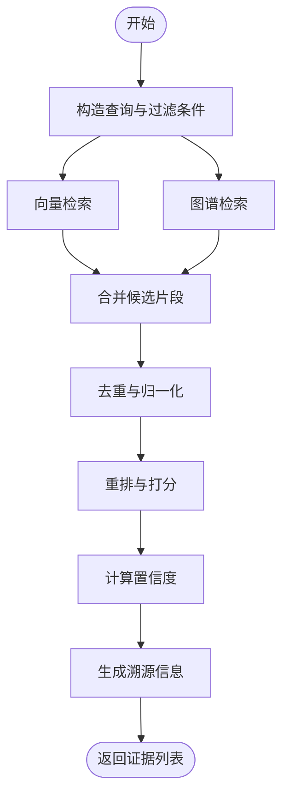

图表来源
- [unified_retriever.py:1-200](file://backend_design/nexus/rag/unified_retriever.py#L1-L200)
- [vector_store.py:1-200](file://backend_design/nexus/rag/vector_store.py#L1-L200)
- [graph_store.py:1-200](file://backend_design/nexus/rag/graph_store.py#L1-L200)
- [reranker_base.py:1-200](file://backend_design/nexus/rag/reranker_base.py#L1-L200)

章节来源
- [unified_retriever.py:1-200](file://backend_design/nexus/rag/unified_retriever.py#L1-L200)
- [vector_store.py:1-200](file://backend_design/nexus/rag/vector_store.py#L1-L200)
- [graph_store.py:1-200](file://backend_design/nexus/rag/graph_store.py#L1-L200)
- [reranker_base.py:1-200](file://backend_design/nexus/rag/reranker_base.py#L1-L200)

### 健康技能编排（Health Skill Orchestrator）
职责
- 将健康建议转化为可执行动作（如健康提醒、习惯打卡）
- 与用户画像联动，按偏好与目标调整执行策略
- 与审查器协作，确保动作输出符合合规要求

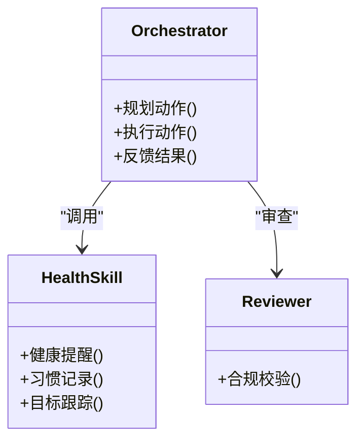

图表来源
- [orchestrator.py:1-200](file://backend_design/nexus/skills/orchestrator.py#L1-L200)
- [health_skill.py:1-200](file://backend_design/nexus/skills/health.py#L1-L200)
- [reviewer.py:1-200](file://backend_design/nexus/agent/reviewer.py#L1-L200)

章节来源
- [orchestrator.py:1-200](file://backend_design/nexus/skills/orchestrator.py#L1-L200)
- [health_skill.py:1-200](file://backend_design/nexus/skills/health.py#L1-L200)
- [reviewer.py:1-200](file://backend_design/nexus/agent/reviewer.py#L1-L200)

### 审查器（Reviewer）
职责
- 敏感信息过滤：识别并替换或屏蔽个人健康敏感字段
- 免责声明强制插入：在高风险建议前追加标准免责声明
- 合规校验：检查是否包含诊断性断言、处方建议等受限内容

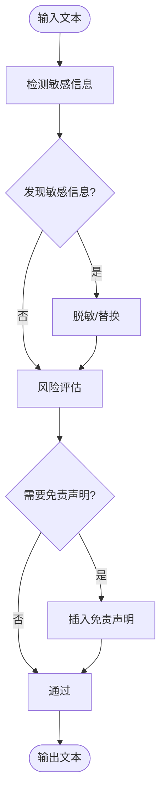

图表来源
- [reviewer.py:1-200](file://backend_design/nexus/agent/reviewer.py#L1-L200)

章节来源
- [reviewer.py:1-200](file://backend_design/nexus/agent/reviewer.py#L1-L200)

### 监督图（Supervisor Graph）
职责
- 编排健康专家、检索、技能与审查的流程节点
- 处理异常分支与降级路径
- 维护会话状态与中间产物

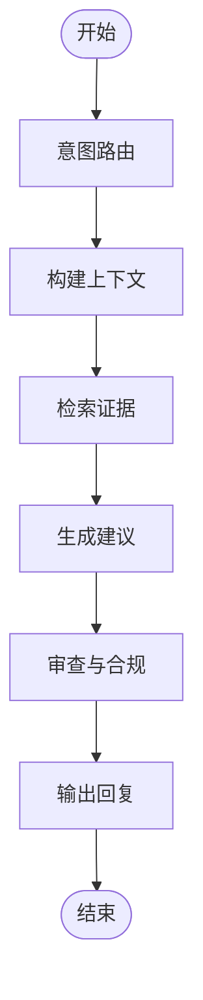

图表来源
- [supervisor_graph.py:1-200](file://backend_design/nexus/agent/supervisor_graph.py#L1-L200)

章节来源
- [supervisor_graph.py:1-200](file://backend_design/nexus/agent/supervisor_graph.py#L1-L200)

### 嵌入与重排（Embedding & Reranker）
职责
- 嵌入：将查询与文档映射到向量空间，支持领域适配
- 重排：基于语义相关性对候选片段进行二次排序，提高准确率

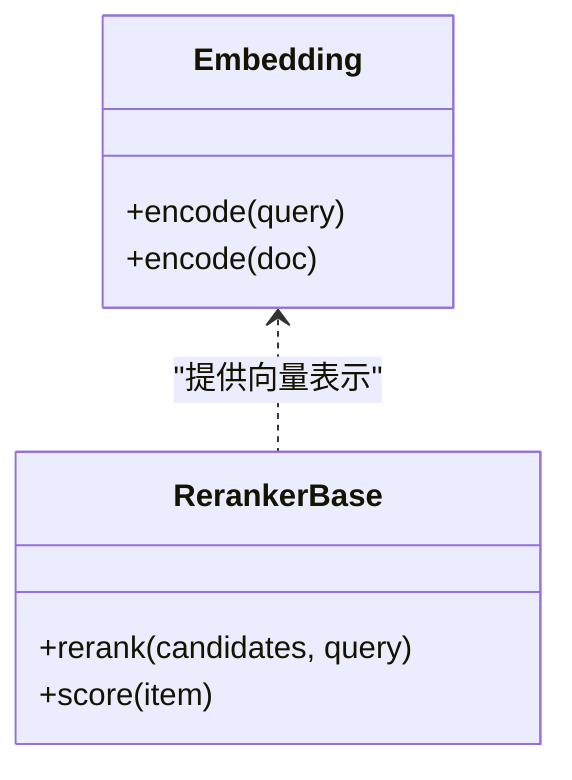

图表来源
- [embedding.py:1-200](file://backend_design/nexus/rag/embedding.py#L1-L200)
- [reranker_base.py:1-200](file://backend_design/nexus/rag/reranker_base.py#L1-L200)

章节来源
- [embedding.py:1-200](file://backend_design/nexus/rag/embedding.py#L1-L200)
- [reranker_base.py:1-200](file://backend_design/nexus/rag/reranker_base.py#L1-L200)

### 鉴权与个性化（Auth & Personalization）
职责
- 鉴权：校验用户身份与权限，限制健康数据的访问范围
- 个性化：加载用户画像与偏好，用于提示工程与动作策略

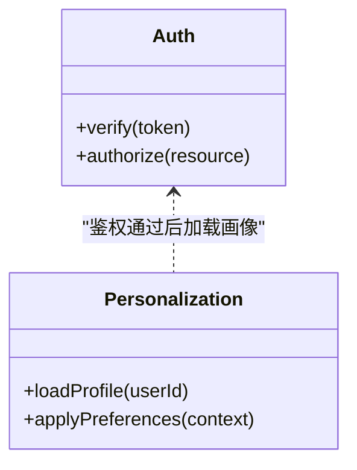

图表来源
- [auth.py:1-200](file://backend_design/nexus/core/auth.py#L1-L200)
- [personalization.py:1-200](file://backend_design/nexus/core/personalization.py#L1-L200)

章节来源
- [auth.py:1-200](file://backend_design/nexus/core/auth.py#L1-L200)
- [personalization.py:1-200](file://backend_design/nexus/core/personalization.py#L1-L200)

### 数据保留与可观测（Data Retention & Observability）
职责
- 数据保留：定义健康数据的生命周期、清理策略与最小化原则
- 可观测：记录调用链、指标与审计日志，便于问题定位与合规审计

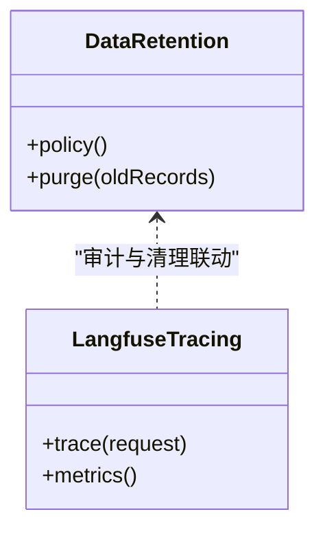

图表来源
- [data_retention.py:1-200](file://backend_design/nexus/observability/data_retention.py#L1-L200)
- [langfuse.py:1-200](file://backend_design/nexus/observability/langfuse.py#L1-L200)

章节来源
- [data_retention.py:1-200](file://backend_design/nexus/observability/data_retention.py#L1-L200)
- [langfuse.py:1-200](file://backend_design/nexus/observability/langfuse.py#L1-L200)

### 配置（Config）
职责
- 集中管理健康专家、检索、审查与可观测的配置项
- 支持环境隔离与动态更新

章节来源
- [config.py:1-200](file://backend_design/nexus/config.py#L1-L200)

## 依赖关系分析
健康咨询模块的依赖关系呈现“专家驱动、检索增强、技能执行、审查兜底”的特点：
- 健康专家依赖统一检索、审查器、个性化与配置
- 统一检索依赖向量存储、图谱存储与重排器
- 编排器依赖健康技能与审查器
- 鉴权贯穿所有入口，数据保留与可观测贯穿全链路

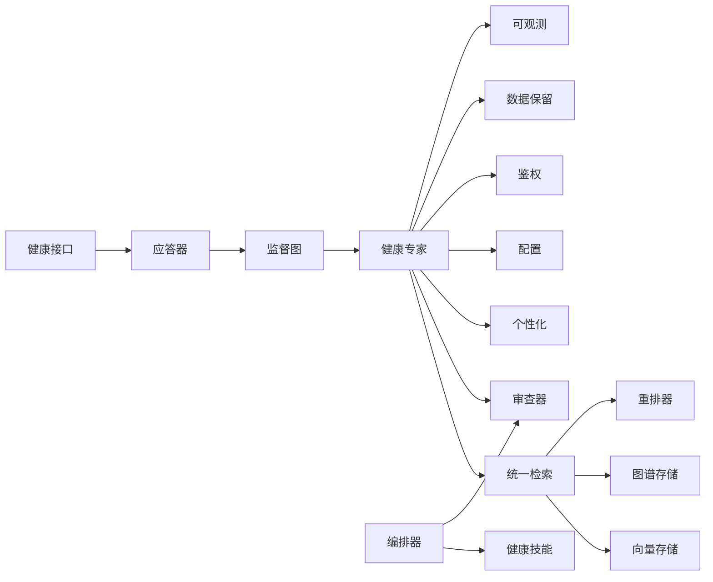

图表来源
- [health_expert.py:1-200](file://backend_design/nexus/agent/experts/health_expert.py#L1-L200)
- [unified_retriever.py:1-200](file://backend_design/nexus/rag/unified_retriever.py#L1-L200)
- [vector_store.py:1-200](file://backend_design/nexus/rag/vector_store.py#L1-L200)
- [graph_store.py:1-200](file://backend_design/nexus/rag/graph_store.py#L1-L200)
- [reranker_base.py:1-200](file://backend_design/nexus/rag/reranker_base.py#L1-L200)
- [reviewer.py:1-200](file://backend_design/nexus/agent/reviewer.py#L1-L200)
- [personalization.py:1-200](file://backend_design/nexus/core/personalization.py#L1-L200)
- [orchestrator.py:1-200](file://backend_design/nexus/skills/orchestrator.py#L1-L200)
- [health_skill.py:1-200](file://backend_design/nexus/skills/health.py#L1-L200)
- [health.py:1-200](file://backend_design/nexus/api/routes/health.py#L1-L200)
- [responder.py:1-200](file://backend_design/nexus/agent/responder.py#L1-L200)
- [supervisor_graph.py:1-200](file://backend_design/nexus/agent/supervisor_graph.py#L1-L200)
- [auth.py:1-200](file://backend_design/nexus/core/auth.py#L1-L200)
- [data_retention.py:1-200](file://backend_design/nexus/observability/data_retention.py#L1-L200)
- [langfuse.py:1-200](file://backend_design/nexus/observability/langfuse.py#L1-L200)
- [config.py:1-200](file://backend_design/nexus/config.py#L1-L200)

章节来源
- [health_expert.py:1-200](file://backend_design/nexus/agent/experts/health_expert.py#L1-L200)
- [unified_retriever.py:1-200](file://backend_design/nexus/rag/unified_retriever.py#L1-L200)
- [vector_store.py:1-200](file://backend_design/nexus/rag/vector_store.py#L1-L200)
- [graph_store.py:1-200](file://backend_design/nexus/rag/graph_store.py#L1-L200)
- [reranker_base.py:1-200](file://backend_design/nexus/rag/reranker_base.py#L1-L200)
- [reviewer.py:1-200](file://backend_design/nexus/agent/reviewer.py#L1-L200)
- [personalization.py:1-200](file://backend_design/nexus/core/personalization.py#L1-L200)
- [orchestrator.py:1-200](file://backend_design/nexus/skills/orchestrator.py#L1-L200)
- [health_skill.py:1-200](file://backend_design/nexus/skills/health.py#L1-L200)
- [health.py:1-200](file://backend_design/nexus/api/routes/health.py#L1-L200)
- [responder.py:1-200](file://backend_design/nexus/agent/responder.py#L1-L200)
- [supervisor_graph.py:1-200](file://backend_design/nexus/agent/supervisor_graph.py#L1-L200)
- [auth.py:1-200](file://backend_design/nexus/core/auth.py#L1-L200)
- [data_retention.py:1-200](file://backend_design/nexus/observability/data_retention.py#L1-L200)
- [langfuse.py:1-200](file://backend_design/nexus/observability/langfuse.py#L1-L200)
- [config.py:1-200](file://backend_design/nexus/config.py#L1-L200)

## 性能考量
- 检索并行化：向量与图谱检索可并发执行，降低端到端延迟
- 缓存策略：对高频健康问答与证据片段进行短期缓存
- 重排优化：采用轻量级重排模型，平衡准确性与吞吐
- 降级与熔断：当外部服务不可用时，自动降级为本地知识库或默认策略
- 流式输出：对长回复采用流式传输，提升用户体验

[本节为通用指导，不直接分析具体文件]

## 故障排查指南
- 检索失败：检查向量与图谱存储连通性与索引状态，确认重排器可用
- 审查拦截：查看审查规则与敏感词表，确认免责声明是否被正确插入
- 鉴权错误：核对令牌有效期与权限范围，确认用户画像加载成功
- 可观测缺失：检查追踪与指标上报通道，确认日志级别与采样率
- 配置异常：核对健康专家、检索与审查相关配置项是否生效

章节来源
- [reviewer.py:1-200](file://backend_design/nexus/agent/reviewer.py#L1-L200)
- [auth.py:1-200](file://backend_design/nexus/core/auth.py#L1-L200)
- [personalization.py:1-200](file://backend_design/nexus/core/personalization.py#L1-L200)
- [data_retention.py:1-200](file://backend_design/nexus/observability/data_retention.py#L1-L200)
- [langfuse.py:1-200](file://backend_design/nexus/observability/langfuse.py#L1-L200)
- [config.py:1-200](file://backend_design/nexus/config.py#L1-L200)

## 结论
健康咨询专家以“检索增强+专业审查+可观测审计”为核心，确保建议生成的科学性、安全性与可追溯性。通过统一检索、重排与溯源，结合用户画像与合规审查，系统能够在保障隐私与合规的前提下，提供高质量的健康建议与风险提示。

[本节为总结性内容，不直接分析具体文件]

## 附录
- 术语说明
  - 置信度：证据与查询的相关性评分，用于衡量建议的可信程度
  - 免责声明：针对高风险建议的标准提示，明确非医疗诊断性质
  - 溯源：证据的来源元数据，包括文档ID、段落位置与更新时间
- 最佳实践
  - 始终启用免责声明与风险提示
  - 对敏感信息进行最小化处理与脱敏
  - 定期更新知识库与重排模型，保持时效性与准确性
  - 建立完整的审计日志与指标看板，便于问题定位与合规审计

[本节为补充说明，不直接分析具体文件]