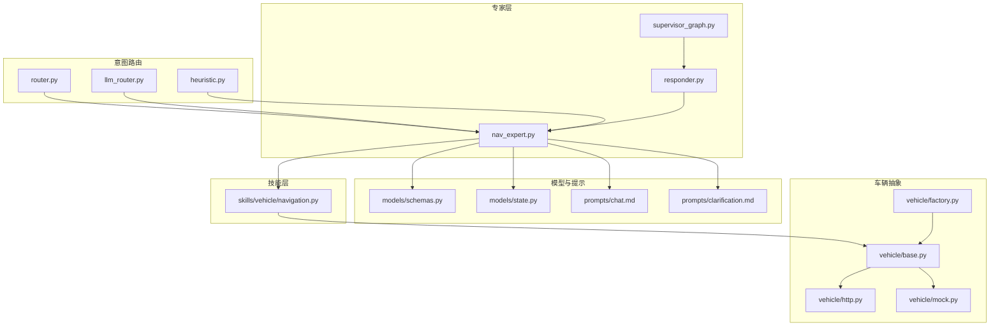
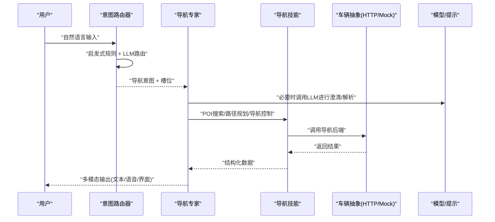
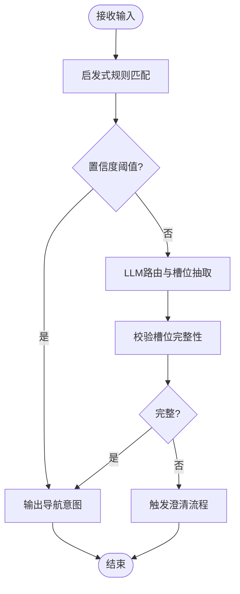
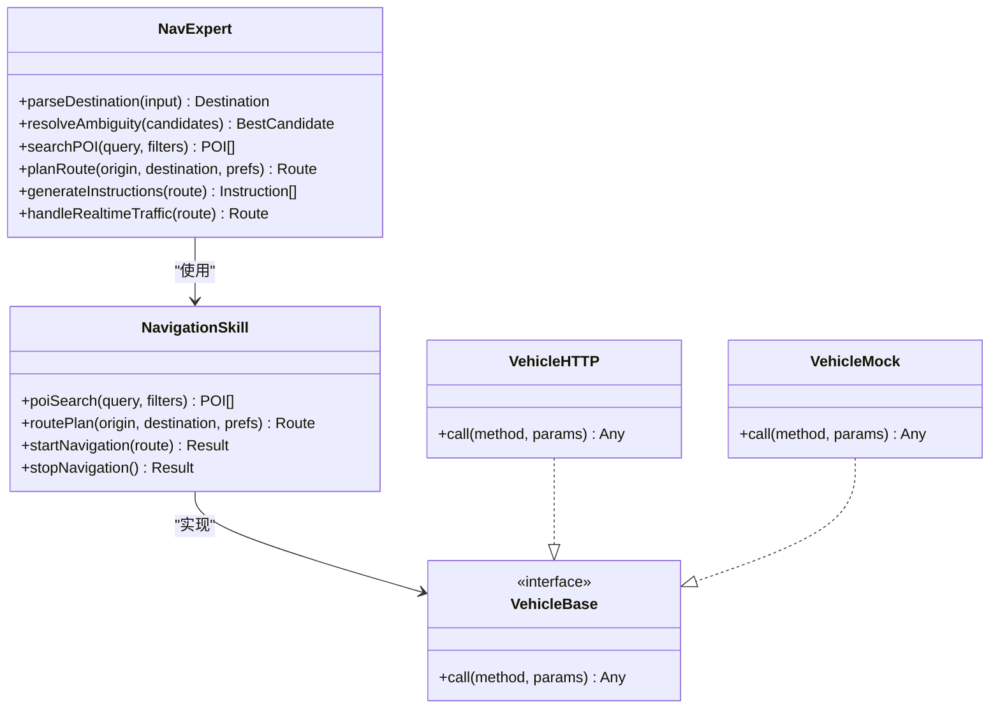
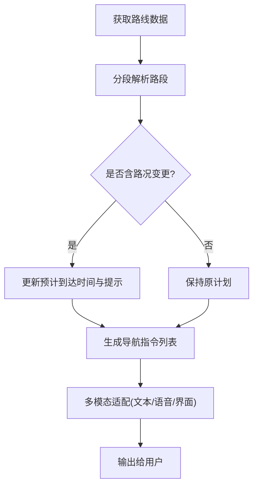
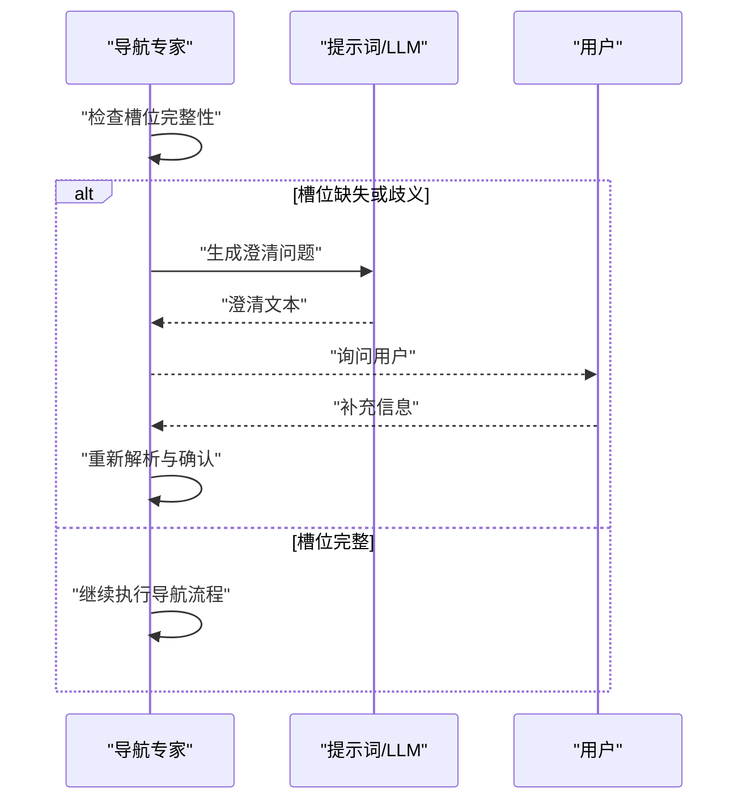
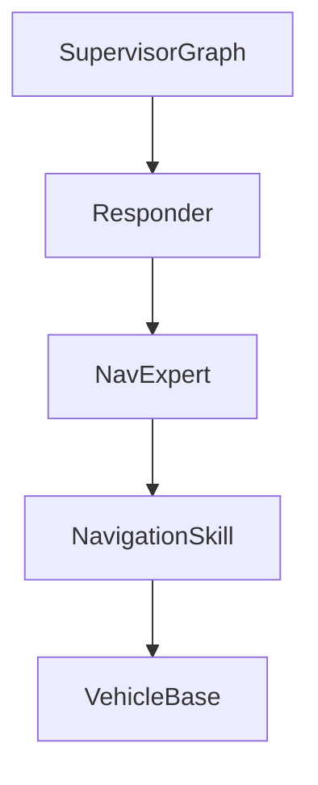
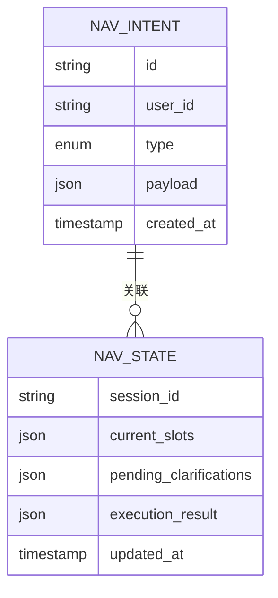
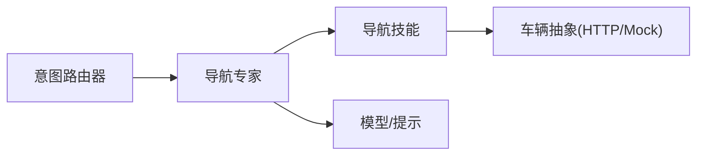

# 导航专家

<cite>
**本文引用的文件**   
- [nav_expert.py](file://backend_design/nexus/agent/experts/nav_expert.py)
- [navigation.py](file://backend_design/nexus/skills/vehicle/navigation.py)
- [router.py](file://backend_design/nexus/intent/router.py)
- [llm_router.py](file://backend_design/nexus/intent/llm_router.py)
- [heuristic.py](file://backend_design/nexus/intent/heuristic.py)
- [responder.py](file://backend_design/nexus/agent/responder.py)
- [supervisor_graph.py](file://backend_design/nexus/agent/supervisor_graph.py)
- [schemas.py](file://backend_design/nexus/models/schemas.py)
- [state.py](file://backend_design/nexus/models/state.py)
- [chat.md](file://backend_design/nexus/prompts/chat.md)
- [clarification.md](file://backend_design/nexus/prompts/clarification.md)
- [vehicle_base.py](file://backend_design/nexus/vehicle/base.py)
- [vehicle_http.py](file://backend_design/nexus/vehicle/http.py)
- [vehicle_mock.py](file://backend_design/nexus/vehicle/mock.py)
- [vehicle_factory.py](file://backend_design/nexus/vehicle/factory.py)
</cite>

## 目录
1. [简介](#简介)
2. [项目结构](#项目结构)
3. [核心组件](#核心组件)
4. [架构总览](#架构总览)
5. [详细组件分析](#详细组件分析)
6. [依赖关系分析](#依赖关系分析)
7. [性能考量](#性能考量)
8. [故障排查指南](#故障排查指南)
9. [结论](#结论)
10. [附录](#附录)

## 简介
本文件面向“导航专家”的开发者与集成者，系统性阐述导航意图识别、目的地解析与路线规划逻辑；说明地名匹配算法、POI搜索与路径优化策略；定义导航指令生成格式、多模态输出处理与实时路况集成方式；并提供完整的导航对话处理流程与异常处理方案。文档以代码级事实为依据，辅以可视化图示，帮助读者快速理解并扩展导航能力。

## 项目结构
导航相关能力主要分布在以下模块：
- 意图路由层：负责将用户输入分类到导航意图，并触发后续处理
- 导航专家：封装导航领域知识、参数抽取、澄清与决策
- 车辆技能：提供导航技能接口（如发起导航、查询POI）
- 模型与状态：承载请求/响应模式与对话状态
- 提示词：用于引导大模型进行结构化输出与澄清
- 车辆抽象与实现：统一对外调用导航后端或模拟服务

图表来源
- [router.py:1-200](file://backend_design/nexus/intent/router.py#L1-L200)
- [llm_router.py:1-200](file://backend_design/nexus/intent/llm_router.py#L1-L200)
- [heuristic.py:1-200](file://backend_design/nexus/intent/heuristic.py#L1-L200)
- [nav_expert.py:1-400](file://backend_design/nexus/agent/experts/nav_expert.py#L1-L400)
- [responder.py:1-200](file://backend_design/nexus/agent/responder.py#L1-L200)
- [supervisor_graph.py:1-200](file://backend_design/nexus/agent/supervisor_graph.py#L1-L200)
- [navigation.py:1-300](file://backend_design/nexus/skills/vehicle/navigation.py#L1-L300)
- [schemas.py:1-200](file://backend_design/nexus/models/schemas.py#L1-L200)
- [state.py:1-200](file://backend_design/nexus/models/state.py#L1-L200)
- [chat.md:1-200](file://backend_design/nexus/prompts/chat.md#L1-L200)
- [clarification.md:1-200](file://backend_design/nexus/prompts/clarification.md#L1-L200)
- [vehicle_base.py:1-200](file://backend_design/nexus/vehicle/base.py#L1-L200)
- [vehicle_http.py:1-200](file://backend_design/nexus/vehicle/http.py#L1-L200)
- [vehicle_mock.py:1-200](file://backend_design/nexus/vehicle/mock.py#L1-L200)
- [vehicle_factory.py:1-200](file://backend_design/nexus/vehicle/factory.py#L1-L200)

章节来源
- [router.py:1-200](file://backend_design/nexus/intent/router.py#L1-L200)
- [nav_expert.py:1-400](file://backend_design/nexus/agent/experts/nav_expert.py#L1-L400)
- [navigation.py:1-300](file://backend_design/nexus/skills/vehicle/navigation.py#L1-L300)
- [schemas.py:1-200](file://backend_design/nexus/models/schemas.py#L1-L200)
- [state.py:1-200](file://backend_design/nexus/models/state.py#L1-L200)
- [chat.md:1-200](file://backend_design/nexus/prompts/chat.md#L1-L200)
- [clarification.md:1-200](file://backend_design/nexus/prompts/clarification.md#L1-L200)
- [vehicle_base.py:1-200](file://backend_design/nexus/vehicle/base.py#L1-L200)
- [vehicle_http.py:1-200](file://backend_design/nexus/vehicle/http.py#L1-L200)
- [vehicle_mock.py:1-200](file://backend_design/nexus/vehicle/mock.py#L1-L200)
- [vehicle_factory.py:1-200](file://backend_design/nexus/vehicle/factory.py#L1-L200)

## 核心组件
- 意图路由器：结合启发式规则与大模型路由，判断是否为导航意图，并提取关键槽位（起点、终点、偏好等）。
- 导航专家：在确认导航意图后，执行目的地解析、地名消歧、POI检索、路线规划与指令生成，协调多模态输出与实时路况。
- 导航技能：封装对导航后端的调用（HTTP/Mock），包括POI搜索、路径计算、导航启动/停止等。
- 模型与提示：通过结构化Schema与提示词模板，确保LLM输出稳定可解析，支持澄清与二次确认。
- 车辆抽象：统一导航后端接入点，便于替换为真实车载系统或仿真环境。

章节来源
- [router.py:1-200](file://backend_design/nexus/intent/router.py#L1-L200)
- [llm_router.py:1-200](file://backend_design/nexus/intent/llm_router.py#L1-L200)
- [heuristic.py:1-200](file://backend_design/nexus/intent/heuristic.py#L1-L200)
- [nav_expert.py:1-400](file://backend_design/nexus/agent/experts/nav_expert.py#L1-L400)
- [navigation.py:1-300](file://backend_design/nexus/skills/vehicle/navigation.py#L1-L300)
- [schemas.py:1-200](file://backend_design/nexus/models/schemas.py#L1-L200)
- [chat.md:1-200](file://backend_design/nexus/prompts/chat.md#L1-L200)
- [clarification.md:1-200](file://backend_design/nexus/prompts/clarification.md#L1-L200)
- [vehicle_base.py:1-200](file://backend_design/nexus/vehicle/base.py#L1-L200)
- [vehicle_http.py:1-200](file://backend_design/nexus/vehicle/http.py#L1-L200)
- [vehicle_mock.py:1-200](file://backend_design/nexus/vehicle/mock.py#L1-L200)
- [vehicle_factory.py:1-200](file://backend_design/nexus/vehicle/factory.py#L1-L200)

## 架构总览
导航对话从入口到执行的端到端流程如下：

图表来源
- [router.py:1-200](file://backend_design/nexus/intent/router.py#L1-L200)
- [llm_router.py:1-200](file://backend_design/nexus/intent/llm_router.py#L1-L200)
- [heuristic.py:1-200](file://backend_design/nexus/intent/heuristic.py#L1-L200)
- [nav_expert.py:1-400](file://backend_design/nexus/agent/experts/nav_expert.py#L1-L400)
- [navigation.py:1-300](file://backend_design/nexus/skills/vehicle/navigation.py#L1-L300)
- [vehicle_base.py:1-200](file://backend_design/nexus/vehicle/base.py#L1-L200)
- [vehicle_http.py:1-200](file://backend_design/nexus/vehicle/http.py#L1-L200)
- [vehicle_mock.py:1-200](file://backend_design/nexus/vehicle/mock.py#L1-L200)
- [chat.md:1-200](file://backend_design/nexus/prompts/chat.md#L1-L200)
- [clarification.md:1-200](file://backend_design/nexus/prompts/clarification.md#L1-L200)

## 详细组件分析

### 意图识别与路由
- 启发式规则：基于关键词、句式与上下文特征快速判定导航意图，降低延迟。
- LLM路由：当规则置信度不足时，交由大模型进行语义级意图判别与槽位抽取。
- 路由输出：标准化为导航意图对象，包含起点、终点、时间、偏好等字段，供专家层消费。

图表来源
- [heuristic.py:1-200](file://backend_design/nexus/intent/heuristic.py#L1-L200)
- [llm_router.py:1-200](file://backend_design/nexus/intent/llm_router.py#L1-L200)
- [router.py:1-200](file://backend_design/nexus/intent/router.py#L1-L200)

章节来源
- [heuristic.py:1-200](file://backend_design/nexus/intent/heuristic.py#L1-L200)
- [llm_router.py:1-200](file://backend_design/nexus/intent/llm_router.py#L1-L200)
- [router.py:1-200](file://backend_design/nexus/intent/router.py#L1-L200)

### 导航专家（目的地解析、地名匹配、POI搜索、路线规划）
- 目的地解析：从用户输入中抽取候选地点，结合历史位置、常用地址与上下文进行归一化。
- 地名匹配算法：采用多级匹配策略（前缀/模糊/同义/别名），并结合地理编码与距离权重排序。
- POI搜索：通过导航技能调用后端POI接口，支持按类别、距离、评分等过滤。
- 路线规划：根据偏好（最快/最短/避开拥堵/收费策略）选择最优路径，融合实时路况信息。
- 指令生成：将路径转换为分步导航指令，支持文本、语音与界面渲染的多模态输出。

图表来源
- [nav_expert.py:1-400](file://backend_design/nexus/agent/experts/nav_expert.py#L1-L400)
- [navigation.py:1-300](file://backend_design/nexus/skills/vehicle/navigation.py#L1-L300)
- [vehicle_base.py:1-200](file://backend_design/nexus/vehicle/base.py#L1-L200)
- [vehicle_http.py:1-200](file://backend_design/nexus/vehicle/http.py#L1-L200)
- [vehicle_mock.py:1-200](file://backend_design/nexus/vehicle/mock.py#L1-L200)

章节来源
- [nav_expert.py:1-400](file://backend_design/nexus/agent/experts/nav_expert.py#L1-L400)
- [navigation.py:1-300](file://backend_design/nexus/skills/vehicle/navigation.py#L1-L300)
- [vehicle_base.py:1-200](file://backend_design/nexus/vehicle/base.py#L1-L200)
- [vehicle_http.py:1-200](file://backend_design/nexus/vehicle/http.py#L1-L200)
- [vehicle_mock.py:1-200](file://backend_design/nexus/vehicle/mock.py#L1-L200)

### 导航指令生成与多模态输出
- 指令格式：每条指令包含动作类型（直行/转向/变道/进入高速/到达等）、描述文本、距离/时间提示、可选媒体资源（语音片段/图标）。
- 多模态处理：文本用于界面展示，语音用于播报，图标/动画用于视觉增强；根据设备能力动态适配。
- 实时路况集成：在路线规划阶段注入拥堵、事故、施工等信息，动态调整建议与提示。

图表来源
- [nav_expert.py:1-400](file://backend_design/nexus/agent/experts/nav_expert.py#L1-L400)
- [navigation.py:1-300](file://backend_design/nexus/skills/vehicle/navigation.py#L1-L300)

章节来源
- [nav_expert.py:1-400](file://backend_design/nexus/agent/experts/nav_expert.py#L1-L400)
- [navigation.py:1-300](file://backend_design/nexus/skills/vehicle/navigation.py#L1-L300)

### 对话处理与澄清机制
- 澄清触发：当槽位缺失或存在歧义时，导航专家依据提示词模板生成澄清问题。
- 二次确认：在高风险操作（如开始导航）前进行确认，避免误触。
- 上下文维护：结合会话状态与记忆，提升连续对话体验。

图表来源
- [nav_expert.py:1-400](file://backend_design/nexus/agent/experts/nav_expert.py#L1-L400)
- [chat.md:1-200](file://backend_design/nexus/prompts/chat.md#L1-L200)
- [clarification.md:1-200](file://backend_design/nexus/prompts/clarification.md#L1-L200)

章节来源
- [nav_expert.py:1-400](file://backend_design/nexus/agent/experts/nav_expert.py#L1-L400)
- [chat.md:1-200](file://backend_design/nexus/prompts/chat.md#L1-L200)
- [clarification.md:1-200](file://backend_design/nexus/prompts/clarification.md#L1-L200)

### 响应编排与监督图
- 响应编排：将导航专家的产物组装为最终响应，包括结构化数据与多模态内容。
- 监督图：在复杂任务中，通过有向图组织子任务（解析、搜索、规划、输出），保证可控的执行顺序与错误恢复。

图表来源
- [supervisor_graph.py:1-200](file://backend_design/nexus/agent/supervisor_graph.py#L1-L200)
- [responder.py:1-200](file://backend_design/nexus/agent/responder.py#L1-L200)
- [nav_expert.py:1-400](file://backend_design/nexus/agent/experts/nav_expert.py#L1-L400)
- [navigation.py:1-300](file://backend_design/nexus/skills/vehicle/navigation.py#L1-L300)
- [vehicle_base.py:1-200](file://backend_design/nexus/vehicle/base.py#L1-L200)

章节来源
- [supervisor_graph.py:1-200](file://backend_design/nexus/agent/supervisor_graph.py#L1-L200)
- [responder.py:1-200](file://backend_design/nexus/agent/responder.py#L1-L200)

### 数据模型与状态管理
- 请求/响应模式：通过Schema定义导航相关的数据结构，确保前后端一致性与可验证性。
- 对话状态：记录当前意图、已收集槽位、待澄清项与执行结果，支撑多轮交互。

图表来源
- [schemas.py:1-200](file://backend_design/nexus/models/schemas.py#L1-L200)
- [state.py:1-200](file://backend_design/nexus/models/state.py#L1-L200)

章节来源
- [schemas.py:1-200](file://backend_design/nexus/models/schemas.py#L1-L200)
- [state.py:1-200](file://backend_design/nexus/models/state.py#L1-L200)

## 依赖关系分析
导航专家与其上下游依赖如下：

图表来源
- [router.py:1-200](file://backend_design/nexus/intent/router.py#L1-L200)
- [nav_expert.py:1-400](file://backend_design/nexus/agent/experts/nav_expert.py#L1-L400)
- [navigation.py:1-300](file://backend_design/nexus/skills/vehicle/navigation.py#L1-L300)
- [vehicle_base.py:1-200](file://backend_design/nexus/vehicle/base.py#L1-L200)
- [vehicle_http.py:1-200](file://backend_design/nexus/vehicle/http.py#L1-L200)
- [vehicle_mock.py:1-200](file://backend_design/nexus/vehicle/mock.py#L1-L200)
- [schemas.py:1-200](file://backend_design/nexus/models/schemas.py#L1-L200)
- [chat.md:1-200](file://backend_design/nexus/prompts/chat.md#L1-L200)

章节来源
- [router.py:1-200](file://backend_design/nexus/intent/router.py#L1-L200)
- [nav_expert.py:1-400](file://backend_design/nexus/agent/experts/nav_expert.py#L1-L400)
- [navigation.py:1-300](file://backend_design/nexus/skills/vehicle/navigation.py#L1-L300)
- [vehicle_base.py:1-200](file://backend_design/nexus/vehicle/base.py#L1-L200)
- [vehicle_http.py:1-200](file://backend_design/nexus/vehicle/http.py#L1-L200)
- [vehicle_mock.py:1-200](file://backend_design/nexus/vehicle/mock.py#L1-L200)
- [schemas.py:1-200](file://backend_design/nexus/models/schemas.py#L1-L200)
- [chat.md:1-200](file://backend_design/nexus/prompts/chat.md#L1-L200)

## 性能考量
- 意图路由优先使用启发式规则以降低延迟，仅在必要时调用LLM。
- POI搜索与路径规划应启用缓存与去重，减少重复网络请求。
- 多模态输出按需生成，避免不必要的媒体资源加载。
- 实时路况增量更新，避免全量重算导致卡顿。

[本节为通用指导，不直接分析具体文件]

## 故障排查指南
- 意图识别失败：检查启发式规则覆盖度与LLM路由配置，查看槽位抽取是否完整。
- 目的地歧义：审查地名匹配策略与候选集质量，必要时引入更多同义词与别名库。
- POI搜索无结果：核对查询条件与过滤参数，确认后端服务可用性与权限。
- 路径规划异常：检查起点/终点坐标有效性、偏好设置与路况数据源连通性。
- 导航无法启动：验证车辆抽象实现（HTTP/Mock）与后端接口契约一致性。
- 澄清循环：优化提示词模板与澄清策略，避免重复提问。

章节来源
- [nav_expert.py:1-400](file://backend_design/nexus/agent/experts/nav_expert.py#L1-L400)
- [navigation.py:1-300](file://backend_design/nexus/skills/vehicle/navigation.py#L1-L300)
- [vehicle_base.py:1-200](file://backend_design/nexus/vehicle/base.py#L1-L200)
- [vehicle_http.py:1-200](file://backend_design/nexus/vehicle/http.py#L1-L200)
- [vehicle_mock.py:1-200](file://backend_design/nexus/vehicle/mock.py#L1-L200)
- [chat.md:1-200](file://backend_design/nexus/prompts/chat.md#L1-L200)
- [clarification.md:1-200](file://backend_design/nexus/prompts/clarification.md#L1-L200)

## 结论
导航专家通过“意图路由—专家处理—技能调用—多模态输出”的分层架构，实现了高可用的导航对话体验。其地名匹配、POI搜索与路径优化策略兼顾准确性与性能，配合实时路况与澄清机制，能够在复杂场景下稳健运行。建议在持续迭代中完善地名知识库、优化提示词模板与监控指标，进一步提升用户体验与系统可靠性。

[本节为总结性内容，不直接分析具体文件]

## 附录
- 术语表
  - 槽位：对话中需要填充的关键信息（如起点、终点、偏好）。
  - 澄清：在信息不完整或存在歧义时向用户追问。
  - 多模态：同时支持文本、语音、界面等多种输出形式。
- 参考实现路径
  - 意图路由：[router.py](file://backend_design/nexus/intent/router.py)、[llm_router.py](file://backend_design/nexus/intent/llm_router.py)、[heuristic.py](file://backend_design/nexus/intent/heuristic.py)
  - 导航专家：[nav_expert.py](file://backend_design/nexus/agent/experts/nav_expert.py)
  - 导航技能：[navigation.py](file://backend_design/nexus/skills/vehicle/navigation.py)
  - 车辆抽象：[vehicle_base.py](file://backend_design/nexus/vehicle/base.py)、[vehicle_http.py](file://backend_design/nexus/vehicle/http.py)、[vehicle_mock.py](file://backend_design/nexus/vehicle/mock.py)、[vehicle_factory.py](file://backend_design/nexus/vehicle/factory.py)
  - 模型与提示：[schemas.py](file://backend_design/nexus/models/schemas.py)、[state.py](file://backend_design/nexus/models/state.py)、[chat.md](file://backend_design/nexus/prompts/chat.md)、[clarification.md](file://backend_design/nexus/prompts/clarification.md)