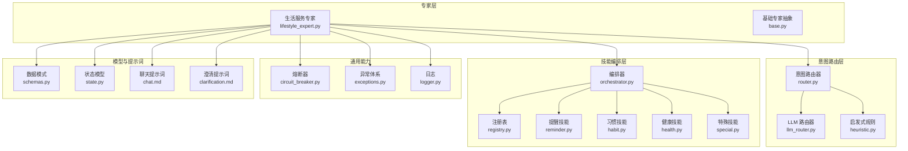
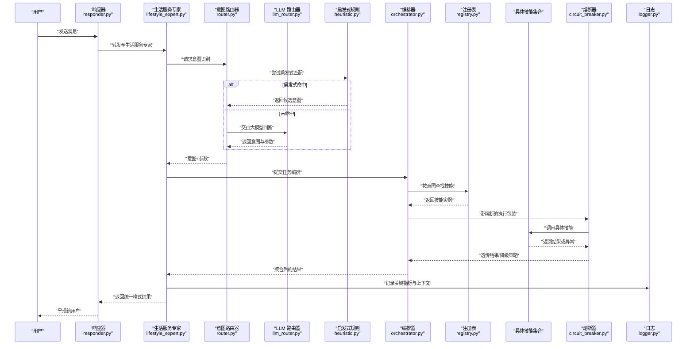
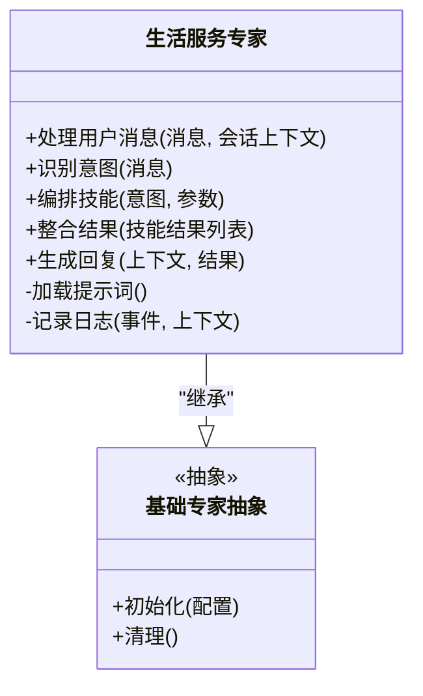
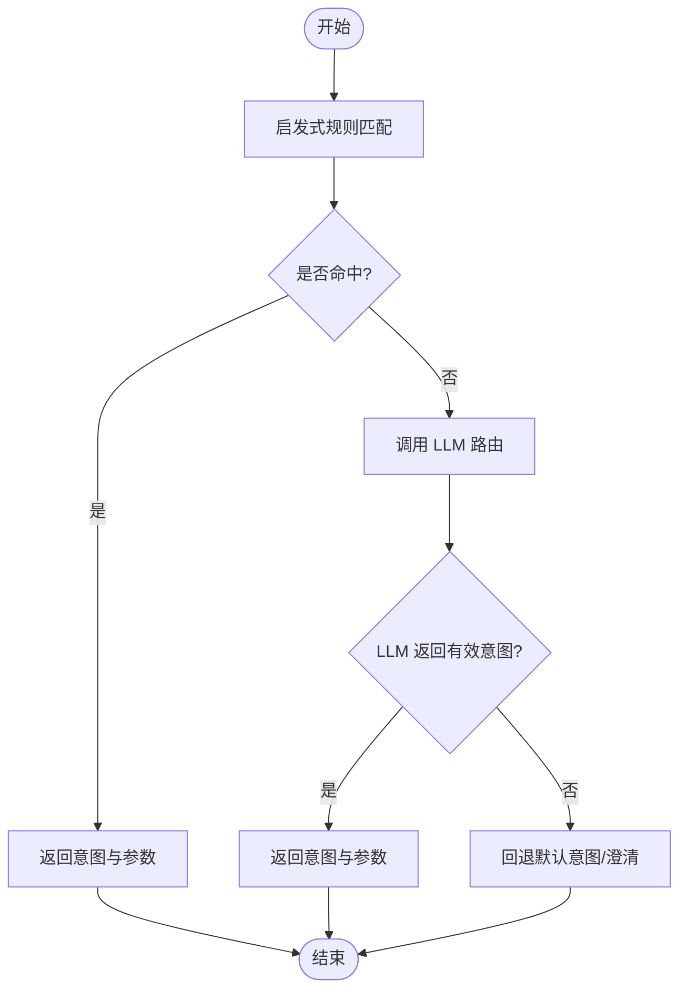
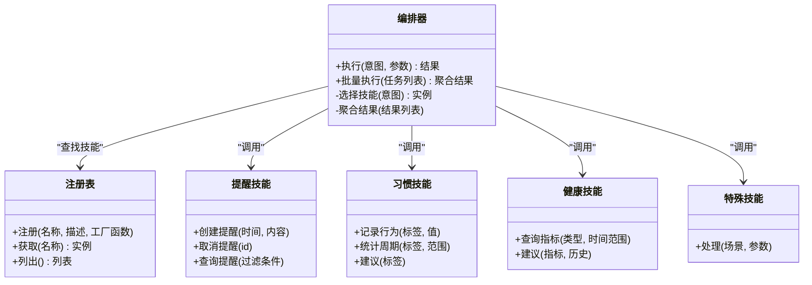
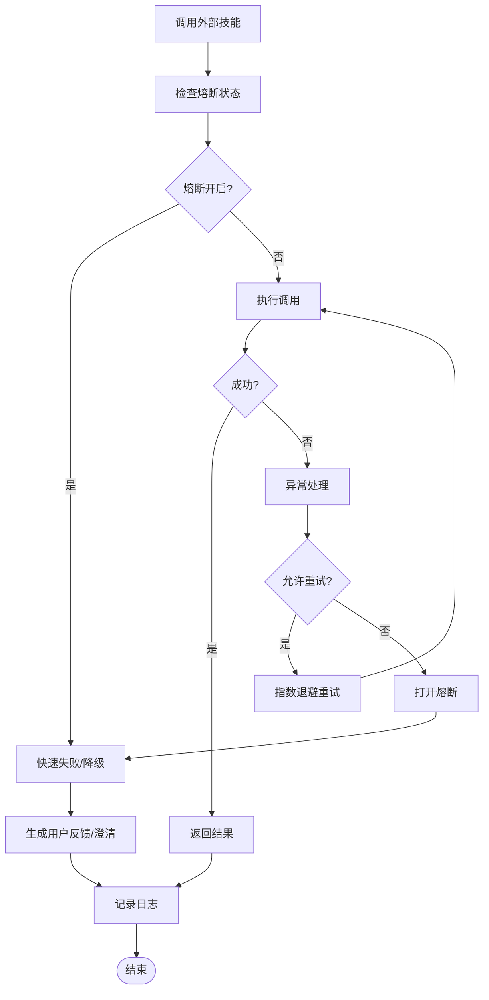
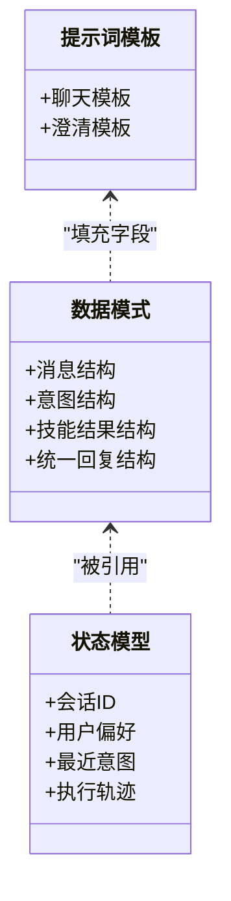
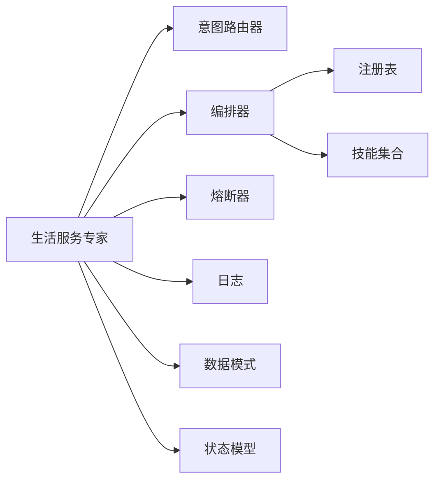

# 生活服务专家

<cite>
**本文引用的文件**   
- [lifestyle_expert.py](file://backend_design/nexus/agent/experts/lifestyle_expert.py)
- [base.py](file://backend_design/nexus/agent/experts/base.py)
- [orchestrator.py](file://backend_design/nexus/skills/orchestrator.py)
- [registry.py](file://backend_design/nexus/skills/registry.py)
- [reminder.py](file://backend_design/nexus/skills/reminder.py)
- [habit.py](file://backend_design/nexus/skills/habit.py)
- [health.py](file://backend_design/nexus/skills/health.py)
- [special.py](file://backend_design/nexus/skills/special.py)
- [llm_router.py](file://backend_design/nexus/intent/llm_router.py)
- [heuristic.py](file://backend_design/nexus/intent/heuristic.py)
- [router.py](file://backend_design/nexus/intent/router.py)
- [responder.py](file://backend_design/nexus/agent/responder.py)
- [supervisor_graph.py](file://backend_design/nexus/agent/supervisor_graph.py)
- [circuit_breaker.py](file://backend_design/nexus/core/circuit_breaker.py)
- [exceptions.py](file://backend_design/nexus/core/exceptions.py)
- [logger.py](file://backend_design/nexus/core/logger.py)
- [schemas.py](file://backend_design/nexus/models/schemas.py)
- [state.py](file://backend_design/nexus/models/state.py)
- [chat.md](file://backend_design/nexus/prompts/chat.md)
- [clarification.md](file://backend_design/nexus/prompts/clarification.md)
</cite>

## 目录
1. [简介](#简介)
2. [项目结构](#项目结构)
3. [核心组件](#核心组件)
4. [架构总览](#架构总览)
5. [详细组件分析](#详细组件分析)
6. [依赖分析](#依赖分析)
7. [性能考虑](#性能考虑)
8. [故障排查指南](#故障排查指南)
9. [结论](#结论)
10. [附录](#附录)

## 简介
本文件面向“生活服务专家”的构建与使用，聚焦以下目标：
- 意图分类：如何识别用户请求属于生活服务的范畴（天气、新闻、提醒、习惯、健康等）。
- 技能调用：如何将意图路由到具体技能（如提醒设置、习惯追踪、健康建议等），并编排多技能协作。
- 结果整合：如何将多个技能的输出进行汇总、去重、格式化，并以统一的结构返回给上层对话系统。
- 服务集成方式：通过注册表与编排器实现可插拔的技能扩展，支持外部服务或本地逻辑的统一接入。
- 错误处理、超时重试与用户反馈：基于熔断器、异常体系与日志记录，保障稳定性与可观测性。
- 完整对话示例与扩展指南：提供端到端场景说明与二次开发指引。

## 项目结构
围绕“生活服务专家”，关键代码分布在如下模块：
- 专家层：负责领域能力封装与对外接口（生活服务专家、基础专家抽象）。
- 意图路由层：负责将自然语言输入解析为领域意图，并选择对应专家或技能。
- 技能编排层：负责技能注册、发现与执行编排，支持多技能组合。
- 模型与提示词：定义数据契约与对话模板，支撑意图识别与澄清。
- 通用能力：熔断、异常、日志等横切关注点。



图表来源
- [lifestyle_expert.py](file://backend_design/nexus/agent/experts/lifestyle_expert.py)
- [base.py](file://backend_design/nexus/agent/experts/base.py)
- [llm_router.py](file://backend_design/nexus/intent/llm_router.py)
- [heuristic.py](file://backend_design/nexus/intent/heuristic.py)
- [router.py](file://backend_design/nexus/intent/router.py)
- [orchestrator.py](file://backend_design/nexus/skills/orchestrator.py)
- [registry.py](file://backend_design/nexus/skills/registry.py)
- [reminder.py](file://backend_design/nexus/skills/reminder.py)
- [habit.py](file://backend_design/nexus/skills/habit.py)
- [health.py](file://backend_design/nexus/skills/health.py)
- [special.py](file://backend_design/nexus/skills/special.py)
- [circuit_breaker.py](file://backend_design/nexus/core/circuit_breaker.py)
- [exceptions.py](file://backend_design/nexus/core/exceptions.py)
- [logger.py](file://backend_design/nexus/core/logger.py)
- [schemas.py](file://backend_design/nexus/models/schemas.py)
- [state.py](file://backend_design/nexus/models/state.py)
- [chat.md](file://backend_design/nexus/prompts/chat.md)
- [clarification.md](file://backend_design/nexus/prompts/clarification.md)

章节来源
- [lifestyle_expert.py](file://backend_design/nexus/agent/experts/lifestyle_expert.py)
- [base.py](file://backend_design/nexus/agent/experts/base.py)
- [llm_router.py](file://backend_design/nexus/intent/llm_router.py)
- [heuristic.py](file://backend_design/nexus/intent/heuristic.py)
- [router.py](file://backend_design/nexus/intent/router.py)
- [orchestrator.py](file://backend_design/nexus/skills/orchestrator.py)
- [registry.py](file://backend_design/nexus/skills/registry.py)
- [reminder.py](file://backend_design/nexus/skills/reminder.py)
- [habit.py](file://backend_design/nexus/skills/habit.py)
- [health.py](file://backend_design/nexus/skills/health.py)
- [special.py](file://backend_design/nexus/skills/special.py)
- [circuit_breaker.py](file://backend_design/nexus/core/circuit_breaker.py)
- [exceptions.py](file://backend_design/nexus/core/exceptions.py)
- [logger.py](file://backend_design/nexus/core/logger.py)
- [schemas.py](file://backend_design/nexus/models/schemas.py)
- [state.py](file://backend_design/nexus/models/state.py)
- [chat.md](file://backend_design/nexus/prompts/chat.md)
- [clarification.md](file://backend_design/nexus/prompts/clarification.md)

## 核心组件
- 生活服务专家：作为领域入口，承接用户请求，完成意图识别、技能编排、结果整合与回复生成。
- 意图路由器：结合启发式规则与大模型路由，提高意图识别准确率与鲁棒性。
- 技能编排器与注册表：统一管理技能生命周期，支持动态发现与顺序/并行执行。
- 提醒、习惯、健康、特殊技能：覆盖典型日常生活场景的具体实现。
- 熔断器与异常体系：对不稳定外部依赖进行保护，避免雪崩；提供一致的异常语义。
- 日志与模型：贯穿全链路的可观测性与结构化数据契约。

章节来源
- [lifestyle_expert.py](file://backend_design/nexus/agent/experts/lifestyle_expert.py)
- [router.py](file://backend_design/nexus/intent/router.py)
- [orchestrator.py](file://backend_design/nexus/skills/orchestrator.py)
- [registry.py](file://backend_design/nexus/skills/registry.py)
- [reminder.py](file://backend_design/nexus/skills/reminder.py)
- [habit.py](file://backend_design/nexus/skills/habit.py)
- [health.py](file://backend_design/nexus/skills/health.py)
- [special.py](file://backend_design/nexus/skills/special.py)
- [circuit_breaker.py](file://backend_design/nexus/core/circuit_breaker.py)
- [exceptions.py](file://backend_design/nexus/core/exceptions.py)
- [logger.py](file://backend_design/nexus/core/logger.py)
- [schemas.py](file://backend_design/nexus/models/schemas.py)
- [state.py](file://backend_design/nexus/models/state.py)

## 架构总览
下图展示了从用户输入到最终回复的关键路径：意图识别→专家调度→技能编排→结果整合→回复生成。



图表来源
- [responder.py](file://backend_design/nexus/agent/responder.py)
- [lifestyle_expert.py](file://backend_design/nexus/agent/experts/lifestyle_expert.py)
- [router.py](file://backend_design/nexus/intent/router.py)
- [llm_router.py](file://backend_design/nexus/intent/llm_router.py)
- [heuristic.py](file://backend_design/nexus/intent/heuristic.py)
- [orchestrator.py](file://backend_design/nexus/skills/orchestrator.py)
- [registry.py](file://backend_design/nexus/skills/registry.py)
- [circuit_breaker.py](file://backend_design/nexus/core/circuit_breaker.py)
- [logger.py](file://backend_design/nexus/core/logger.py)

## 详细组件分析

### 生活服务专家（Lifestyle Expert）
职责
- 接收用户消息，维护会话状态，驱动意图识别与技能编排。
- 根据意图选择并调用相关技能，整合多源结果，生成统一回复。
- 与熔断器、异常体系、日志系统交互，确保健壮性与可观测性。

关键流程
- 初始化与上下文加载：读取会话状态、个性化偏好与提示词模板。
- 意图识别：优先启发式规则，其次大模型路由。
- 技能编排：通过编排器与注册表定位技能，执行并收集结果。
- 结果整合：合并、去重、排序与格式化，适配上层展示需求。
- 回复生成：结合聊天提示词模板，生成自然语言回复。



图表来源
- [lifestyle_expert.py](file://backend_design/nexus/agent/experts/lifestyle_expert.py)
- [base.py](file://backend_design/nexus/agent/experts/base.py)

章节来源
- [lifestyle_expert.py](file://backend_design/nexus/agent/experts/lifestyle_expert.py)
- [base.py](file://backend_design/nexus/agent/experts/base.py)

### 意图分类与路由
设计要点
- 启发式规则：基于关键词、正则、白名单/黑名单快速判定常见意图，降低延迟与成本。
- LLM 路由：在复杂或模糊场景下，借助大模型进行意图判别与参数抽取。
- 统一路由器：屏蔽底层差异，向上层暴露一致接口。



图表来源
- [heuristic.py](file://backend_design/nexus/intent/heuristic.py)
- [llm_router.py](file://backend_design/nexus/intent/llm_router.py)
- [router.py](file://backend_design/nexus/intent/router.py)

章节来源
- [heuristic.py](file://backend_design/nexus/intent/heuristic.py)
- [llm_router.py](file://backend_design/nexus/intent/llm_router.py)
- [router.py](file://backend_design/nexus/intent/router.py)

### 技能编排与注册
设计要点
- 注册表：集中管理技能元信息与实例化逻辑，支持热插拔。
- 编排器：根据意图与参数，选择并执行一个或多个技能，支持顺序/并行、失败隔离与结果聚合。
- 典型技能：提醒、习惯、健康、特殊场景等。



图表来源
- [registry.py](file://backend_design/nexus/skills/registry.py)
- [orchestrator.py](file://backend_design/nexus/skills/orchestrator.py)
- [reminder.py](file://backend_design/nexus/skills/reminder.py)
- [habit.py](file://backend_design/nexus/skills/habit.py)
- [health.py](file://backend_design/nexus/skills/health.py)
- [special.py](file://backend_design/nexus/skills/special.py)

章节来源
- [registry.py](file://backend_design/nexus/skills/registry.py)
- [orchestrator.py](file://backend_design/nexus/skills/orchestrator.py)
- [reminder.py](file://backend_design/nexus/skills/reminder.py)
- [habit.py](file://backend_design/nexus/skills/habit.py)
- [health.py](file://backend_design/nexus/skills/health.py)
- [special.py](file://backend_design/nexus/skills/special.py)

### 错误处理、超时重试与用户反馈
机制概览
- 熔断器：对不稳定外部依赖进行熔断、半开探测与恢复，避免级联故障。
- 异常体系：统一异常类型与错误码，便于上层捕获与降级。
- 日志：记录关键事件、上下文与指标，辅助排障与审计。
- 用户反馈：当服务不可用或信息不足时，引导用户提供必要信息或给出友好提示。



图表来源
- [circuit_breaker.py](file://backend_design/nexus/core/circuit_breaker.py)
- [exceptions.py](file://backend_design/nexus/core/exceptions.py)
- [logger.py](file://backend_design/nexus/core/logger.py)

章节来源
- [circuit_breaker.py](file://backend_design/nexus/core/circuit_breaker.py)
- [exceptions.py](file://backend_design/nexus/core/exceptions.py)
- [logger.py](file://backend_design/nexus/core/logger.py)

### 数据模型与提示词
- 数据模式：定义统一的输入输出结构，保证跨模块一致性。
- 状态模型：维护会话上下文、意图缓存、技能执行轨迹等。
- 提示词：聊天与澄清模板用于生成自然语言回复与追问。



图表来源
- [schemas.py](file://backend_design/nexus/models/schemas.py)
- [state.py](file://backend_design/nexus/models/state.py)
- [chat.md](file://backend_design/nexus/prompts/chat.md)
- [clarification.md](file://backend_design/nexus/prompts/clarification.md)

章节来源
- [schemas.py](file://backend_design/nexus/models/schemas.py)
- [state.py](file://backend_design/nexus/models/state.py)
- [chat.md](file://backend_design/nexus/prompts/chat.md)
- [clarification.md](file://backend_design/nexus/prompts/clarification.md)

### 对话示例（端到端）
以下为典型场景的对话流程示意（概念图，不直接映射具体源码）：

```mermaid
sequenceDiagram
participant U as "用户"
participant EXP as "生活服务专家"
participant RT as "意图路由器"
participant ORCH as "编排器"
participant SK as "技能集合"
U->>EXP : "明天早上八点提醒我开会"
EXP->>RT : "识别意图"
RT-->>EXP : "意图=提醒; 参数={时间 : 明早8点, 内容 : 开会}"
EXP->>ORCH : "执行提醒技能"
ORCH->>SK : "创建提醒"
SK-->>ORCH : "成功, 提醒ID"
ORCH-->>EXP : "聚合结果"
EXP-->>U : "已设置提醒，将在明早8点提醒您开会"
U->>EXP : "今天步数多少？"
EXP->>RT : "识别意图"
RT-->>EXP : "意图=健康; 参数={类型 : 步数, 范围 : 今日}"
EXP->>ORCH : "执行健康技能"
ORCH->>SK : "查询今日步数"
SK-->>ORCH : "返回数值"
ORCH-->>EXP : "聚合结果"
EXP-->>U : "您今天走了XXXX步"
```

[此图为概念流程，无需图表来源]

## 依赖分析
- 低耦合高内聚：专家层仅依赖路由与编排接口；编排器通过注册表解耦具体技能实现。
- 外部依赖保护：通过熔断器隔离不稳定服务，避免雪崩。
- 可观测性：日志贯穿全流程，便于问题定位与性能分析。
- 可扩展性：新增技能仅需注册，无需修改现有流程。



图表来源
- [lifestyle_expert.py](file://backend_design/nexus/agent/experts/lifestyle_expert.py)
- [router.py](file://backend_design/nexus/intent/router.py)
- [orchestrator.py](file://backend_design/nexus/skills/orchestrator.py)
- [registry.py](file://backend_design/nexus/skills/registry.py)
- [circuit_breaker.py](file://backend_design/nexus/core/circuit_breaker.py)
- [logger.py](file://backend_design/nexus/core/logger.py)
- [schemas.py](file://backend_design/nexus/models/schemas.py)
- [state.py](file://backend_design/nexus/models/state.py)

章节来源
- [lifestyle_expert.py](file://backend_design/nexus/agent/experts/lifestyle_expert.py)
- [router.py](file://backend_design/nexus/intent/router.py)
- [orchestrator.py](file://backend_design/nexus/skills/orchestrator.py)
- [registry.py](file://backend_design/nexus/skills/registry.py)
- [circuit_breaker.py](file://backend_design/nexus/core/circuit_breaker.py)
- [logger.py](file://backend_design/nexus/core/logger.py)
- [schemas.py](file://backend_design/nexus/models/schemas.py)
- [state.py](file://backend_design/nexus/models/state.py)

## 性能考虑
- 意图识别优化：优先启发式规则，减少大模型调用次数；对高频意图做缓存。
- 并发编排：对无依赖的多技能调用采用并行执行，缩短整体时延。
- 熔断与限流：对不稳定外部服务启用熔断与重试退避，避免资源耗尽。
- 结果聚合优化：增量聚合与流式返回，提升首字时延体验。
- 日志采样：在高吞吐场景下对日志进行采样与分级，降低开销。

[本节为通用指导，无需章节来源]

## 故障排查指南
常见问题与定位步骤
- 意图识别不准
  - 检查启发式规则是否覆盖边界用例，必要时补充关键词或正则。
  - 查看 LLM 路由的输入上下文与返回结果，确认提示词是否需要调整。
- 技能执行失败
  - 观察熔断器状态与异常类型，确认是否为外部服务抖动或超时。
  - 检查重试策略与退避间隔，必要时调整阈值。
- 结果不完整或重复
  - 审查编排器的聚合逻辑，确保去重与合并策略正确。
- 用户体验不佳
  - 增加澄清提问与友好提示，减少用户等待焦虑。
  - 对长耗时操作提供进度反馈。

章节来源
- [heuristic.py](file://backend_design/nexus/intent/heuristic.py)
- [llm_router.py](file://backend_design/nexus/intent/llm_router.py)
- [circuit_breaker.py](file://backend_design/nexus/core/circuit_breaker.py)
- [exceptions.py](file://backend_design/nexus/core/exceptions.py)
- [logger.py](file://backend_design/nexus/core/logger.py)

## 结论
生活服务专家通过“意图识别—技能编排—结果整合—回复生成”的闭环，实现了日常生活的多场景覆盖。借助注册表与编排器，系统具备良好的可扩展性与可维护性；熔断器与异常体系保障了稳定性；日志与数据模式提升了可观测性与一致性。建议在后续迭代中持续完善启发式规则、优化并发编排策略，并丰富用户反馈与澄清机制，以提升整体体验。

[本节为总结，无需章节来源]

## 附录
- 扩展指南
  - 新增技能：在注册表中登记技能元信息，实现标准接口，并在编排器中声明依赖关系。
  - 增强意图识别：补充启发式规则与 LLM 路由提示词，定期评估准确率。
  - 强化容错：针对新技能接入熔断与重试策略，完善异常语义与日志埋点。
  - 监控与度量：结合日志与指标，建立关键路径的监控看板，及时发现瓶颈与异常。

[本节为通用指导，无需章节来源]