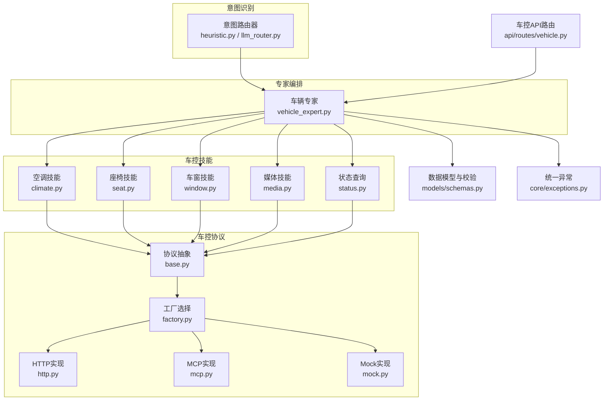
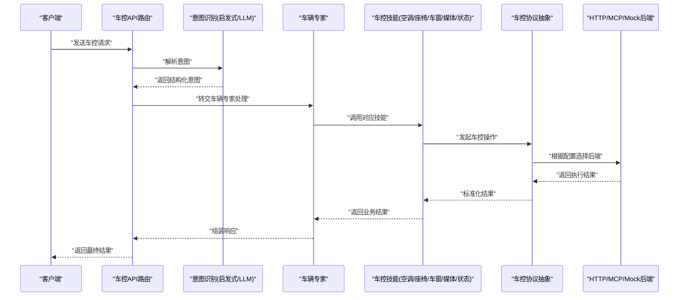
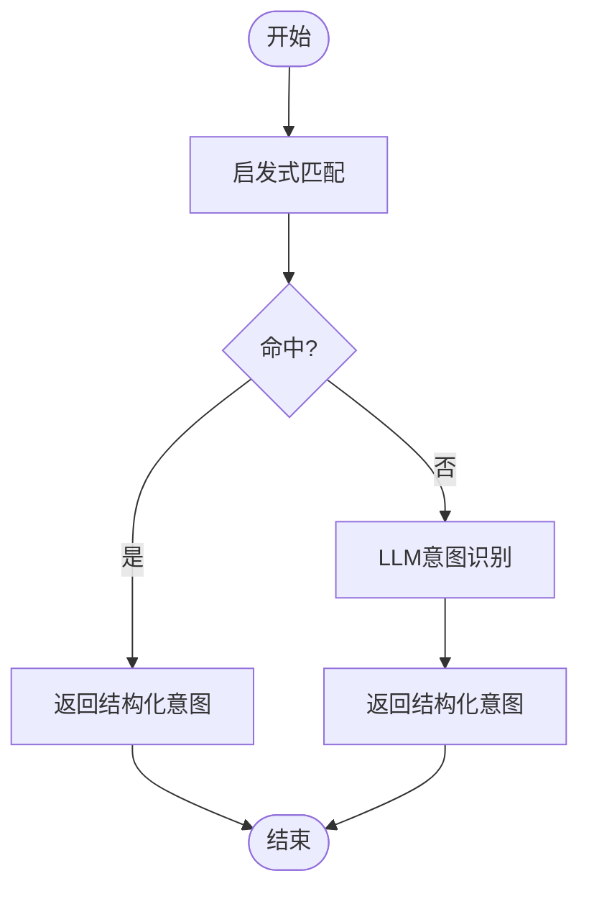
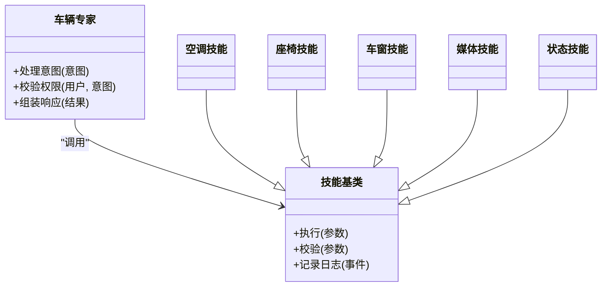
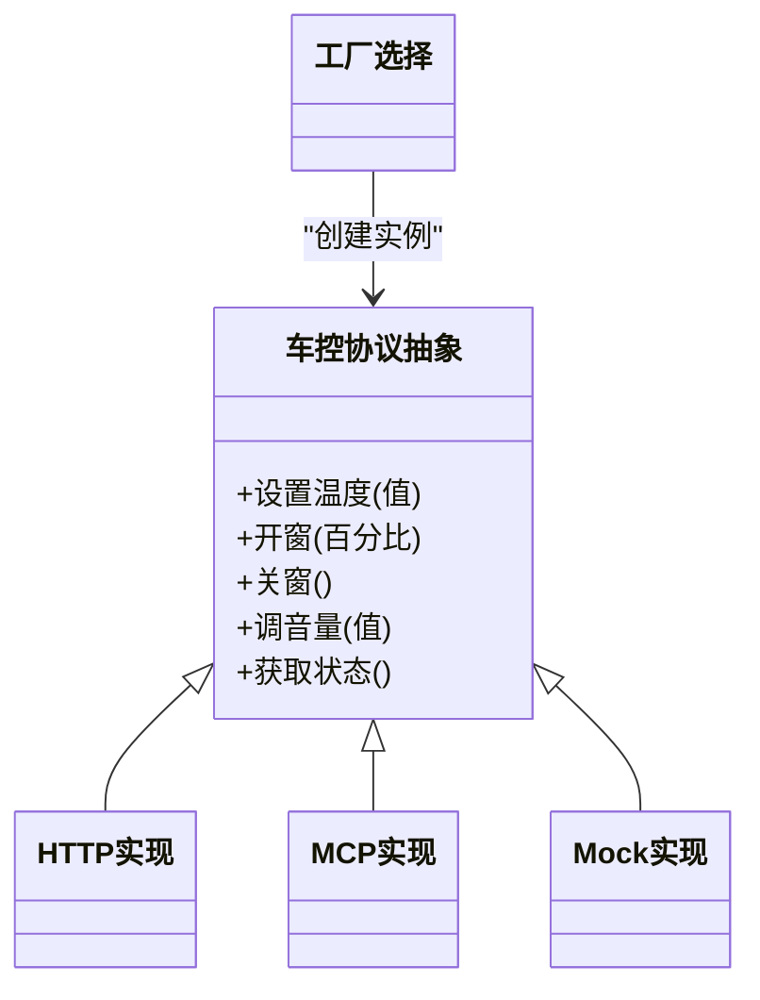
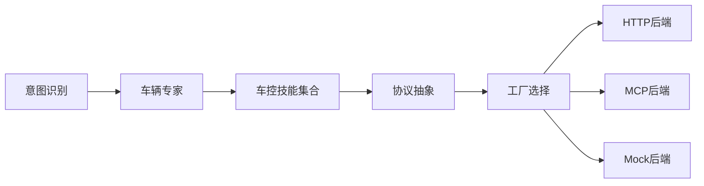

# 车辆控制专家

<cite>
**本文引用的文件**   
- [backend_design/nexus/agent/experts/vehicle_expert.py](file://backend_design/nexus/agent/experts/vehicle_expert.py)
- [backend_design/nexus/skills/vehicle/climate.py](file://backend_design/nexus/skills/vehicle/climate.py)
- [backend_design/nexus/skills/vehicle/seat.py](file://backend_design/nexus/skills/vehicle/seat.py)
- [backend_design/nexus/skills/vehicle/window.py](file://backend_design/nexus/skills/vehicle/window.py)
- [backend_design/nexus/skills/vehicle/media.py](file://backend_design/nexus/skills/vehicle/media.py)
- [backend_design/nexus/skills/vehicle/status.py](file://backend_design/nexus/skills/vehicle/status.py)
- [backend_design/nexus/skills/base.py](file://backend_design/nexus/skills/base.py)
- [backend_design/nexus/vehicle/base.py](file://backend_design/nexus/vehicle/base.py)
- [backend_design/nexus/vehicle/factory.py](file://backend_design/nexus/vehicle/factory.py)
- [backend_design/nexus/vehicle/http.py](file://backend_design/nexus/vehicle/http.py)
- [backend_design/nexus/vehicle/mcp.py](file://backend_design/nexus/vehicle/mcp.py)
- [backend_design/nexus/vehicle/mock.py](file://backend_design/nexus/vehicle/mock.py)
- [backend_design/nexus/intent/router.py](file://backend_design/nexus/intent/router.py)
- [backend_design/nexus/intent/heuristic.py](file://backend_design/nexus/intent/heuristic.py)
- [backend_design/nexus/intent/llm_router.py](file://backend_design/nexus/intent/llm_router.py)
- [backend_design/nexus/api/routes/vehicle.py](file://backend_design/nexus/api/routes/vehicle.py)
- [backend_design/nexus/models/schemas.py](file://backend_design/nexus/models/schemas.py)
- [backend_design/nexus/core/exceptions.py](file://backend_design/nexus/core/exceptions.py)
- [backend_design/nexus/prompts/vehicle.md](file://backend_design/nexus/prompts/vehicle.md)
</cite>

## 目录
1. [简介](#简介)
2. [项目结构](#项目结构)
3. [核心组件](#核心组件)
4. [架构总览](#架构总览)
5. [详细组件分析](#详细组件分析)
6. [依赖关系分析](#依赖关系分析)
7. [性能与可靠性](#性能与可靠性)
8. [故障排查指南](#故障排查指南)
9. [结论](#结论)
10. [附录：车控命令语法与安全校验](#附录车控命令语法与安全校验)

## 简介
本文件面向“车辆控制专家”角色，系统化阐述从自然语言意图识别到车控指令解析、参数校验、安全策略与执行的全链路流程。覆盖空调、座椅、车窗、媒体等常见车控能力，并给出典型场景的处理示例与错误恢复策略。文档同时提供协议抽象（HTTP/MCP）与实现细节，帮助开发者快速集成与扩展新的车辆功能。

## 项目结构
与车辆控制相关的关键目录与职责如下：
- agent/experts：专家路由与编排入口，负责将用户请求分派至领域专家（如车辆专家）。
- intent/*：意图识别层，包含启发式规则与LLM路由，输出结构化意图。
- skills/vehicle/*：具体车控技能实现（空调、座椅、车窗、媒体、状态查询等），封装业务逻辑与参数处理。
- vehicle/*：车控协议抽象与多后端实现（HTTP、MCP、Mock），屏蔽底层差异。
- api/routes/vehicle.py：对外暴露的车控API路由。
- models/schemas.py：统一的输入/输出数据模型与校验。
- core/exceptions.py：统一异常定义与错误码。
- prompts/vehicle.md：用于引导LLM进行车控意图识别的提示词模板。

图表来源
- [backend_design/nexus/intent/router.py:1-200](file://backend_design/nexus/intent/router.py#L1-L200)
- [backend_design/nexus/intent/heuristic.py:1-200](file://backend_design/nexus/intent/heuristic.py#L1-L200)
- [backend_design/nexus/intent/llm_router.py:1-200](file://backend_design/nexus/intent/llm_router.py#L1-L200)
- [backend_design/nexus/agent/experts/vehicle_expert.py:1-200](file://backend_design/nexus/agent/experts/vehicle_expert.py#L1-L200)
- [backend_design/nexus/skills/vehicle/climate.py:1-200](file://backend_design/nexus/skills/vehicle/climate.py#L1-L200)
- [backend_design/nexus/skills/vehicle/seat.py:1-200](file://backend_design/nexus/skills/vehicle/seat.py#L1-L200)
- [backend_design/nexus/skills/vehicle/window.py:1-200](file://backend_design/nexus/skills/vehicle/window.py#L1-L200)
- [backend_design/nexus/skills/vehicle/media.py:1-200](file://backend_design/nexus/skills/vehicle/media.py#L1-L200)
- [backend_design/nexus/skills/vehicle/status.py:1-200](file://backend_design/nexus/skills/vehicle/status.py#L1-L200)
- [backend_design/nexus/vehicle/base.py:1-200](file://backend_design/nexus/vehicle/base.py#L1-L200)
- [backend_design/nexus/vehicle/factory.py:1-200](file://backend_design/nexus/vehicle/factory.py#L1-L200)
- [backend_design/nexus/vehicle/http.py:1-200](file://backend_design/nexus/vehicle/http.py#L1-L200)
- [backend_design/nexus/vehicle/mcp.py:1-200](file://backend_design/nexus/vehicle/mcp.py#L1-L200)
- [backend_design/nexus/vehicle/mock.py:1-200](file://backend_design/nexus/vehicle/mock.py#L1-L200)
- [backend_design/nexus/api/routes/vehicle.py:1-200](file://backend_design/nexus/api/routes/vehicle.py#L1-L200)
- [backend_design/nexus/models/schemas.py:1-200](file://backend_design/nexus/models/schemas.py#L1-L200)
- [backend_design/nexus/core/exceptions.py:1-200](file://backend_design/nexus/core/exceptions.py#L1-L200)

章节来源
- [backend_design/nexus/agent/experts/vehicle_expert.py:1-200](file://backend_design/nexus/agent/experts/vehicle_expert.py#L1-L200)
- [backend_design/nexus/skills/base.py:1-200](file://backend_design/nexus/skills/base.py#L1-L200)
- [backend_design/nexus/vehicle/base.py:1-200](file://backend_design/nexus/vehicle/base.py#L1-L200)
- [backend_design/nexus/vehicle/factory.py:1-200](file://backend_design/nexus/vehicle/factory.py#L1-L200)
- [backend_design/nexus/api/routes/vehicle.py:1-200](file://backend_design/nexus/api/routes/vehicle.py#L1-L200)
- [backend_design/nexus/models/schemas.py:1-200](file://backend_design/nexus/models/schemas.py#L1-L200)
- [backend_design/nexus/core/exceptions.py:1-200](file://backend_design/nexus/core/exceptions.py#L1-L200)
- [backend_design/nexus/prompts/vehicle.md:1-200](file://backend_design/nexus/prompts/vehicle.md#L1-L200)

## 核心组件
- 意图识别层
  - 启发式路由：基于关键词与规则的轻量匹配，适合离线或低延迟场景。
  - LLM路由：结合提示词模板进行语义理解，输出标准化意图结构。
- 车辆专家
  - 接收结构化意图，调用对应车控技能，完成参数校验、安全检查与执行。
- 车控技能
  - 按功能域拆分：空调、座椅、车窗、媒体、状态查询等，各自封装业务逻辑与参数处理。
- 车控协议抽象
  - 通过统一接口屏蔽HTTP/MCP/Mock等后端差异，支持动态选择与降级。
- 数据模型与异常
  - 使用统一Schema进行输入输出校验；集中定义异常类型与错误码，便于前端展示与日志追踪。

章节来源
- [backend_design/nexus/intent/router.py:1-200](file://backend_design/nexus/intent/router.py#L1-L200)
- [backend_design/nexus/intent/heuristic.py:1-200](file://backend_design/nexus/intent/heuristic.py#L1-L200)
- [backend_design/nexus/intent/llm_router.py:1-200](file://backend_design/nexus/intent/llm_router.py#L1-L200)
- [backend_design/nexus/agent/experts/vehicle_expert.py:1-200](file://backend_design/nexus/agent/experts/vehicle_expert.py#L1-L200)
- [backend_design/nexus/skills/base.py:1-200](file://backend_design/nexus/skills/base.py#L1-L200)
- [backend_design/nexus/vehicle/base.py:1-200](file://backend_design/nexus/vehicle/base.py#L1-L200)
- [backend_design/nexus/vehicle/factory.py:1-200](file://backend_design/nexus/vehicle/factory.py#L1-L200)
- [backend_design/nexus/models/schemas.py:1-200](file://backend_design/nexus/models/schemas.py#L1-L200)
- [backend_design/nexus/core/exceptions.py:1-200](file://backend_design/nexus/core/exceptions.py#L1-L200)

## 架构总览
下图展示了从用户请求到车控执行的端到端流程，包括意图识别、专家调度、技能执行与协议适配。

图表来源
- [backend_design/nexus/api/routes/vehicle.py:1-200](file://backend_design/nexus/api/routes/vehicle.py#L1-L200)
- [backend_design/nexus/intent/router.py:1-200](file://backend_design/nexus/intent/router.py#L1-L200)
- [backend_design/nexus/intent/heuristic.py:1-200](file://backend_design/nexus/intent/heuristic.py#L1-L200)
- [backend_design/nexus/intent/llm_router.py:1-200](file://backend_design/nexus/intent/llm_router.py#L1-L200)
- [backend_design/nexus/agent/experts/vehicle_expert.py:1-200](file://backend_design/nexus/agent/experts/vehicle_expert.py#L1-L200)
- [backend_design/nexus/skills/vehicle/climate.py:1-200](file://backend_design/nexus/skills/vehicle/climate.py#L1-L200)
- [backend_design/nexus/skills/vehicle/seat.py:1-200](file://backend_design/nexus/skills/vehicle/seat.py#L1-L200)
- [backend_design/nexus/skills/vehicle/window.py:1-200](file://backend_design/nexus/skills/vehicle/window.py#L1-L200)
- [backend_design/nexus/skills/vehicle/media.py:1-200](file://backend_design/nexus/skills/vehicle/media.py#L1-L200)
- [backend_design/nexus/skills/vehicle/status.py:1-200](file://backend_design/nexus/skills/vehicle/status.py#L1-L200)
- [backend_design/nexus/vehicle/base.py:1-200](file://backend_design/nexus/vehicle/base.py#L1-L200)
- [backend_design/nexus/vehicle/factory.py:1-200](file://backend_design/nexus/vehicle/factory.py#L1-L200)
- [backend_design/nexus/vehicle/http.py:1-200](file://backend_design/nexus/vehicle/http.py#L1-L200)
- [backend_design/nexus/vehicle/mcp.py:1-200](file://backend_design/nexus/vehicle/mcp.py#L1-L200)
- [backend_design/nexus/vehicle/mock.py:1-200](file://backend_design/nexus/vehicle/mock.py#L1-L200)

## 详细组件分析

### 意图识别与路由
- 启发式路由：基于关键词与模式匹配快速定位意图类别，适用于高频、稳定的车控短语。
- LLM路由：结合提示词模板进行语义理解，输出标准化的意图结构，提升泛化能力。
- 路由决策：优先启发式，失败时回退到LLM路由，保证可用性与性能平衡。

图表来源
- [backend_design/nexus/intent/heuristic.py:1-200](file://backend_design/nexus/intent/heuristic.py#L1-L200)
- [backend_design/nexus/intent/llm_router.py:1-200](file://backend_design/nexus/intent/llm_router.py#L1-L200)
- [backend_design/nexus/intent/router.py:1-200](file://backend_design/nexus/intent/router.py#L1-L200)
- [backend_design/nexus/prompts/vehicle.md:1-200](file://backend_design/nexus/prompts/vehicle.md#L1-L200)

章节来源
- [backend_design/nexus/intent/router.py:1-200](file://backend_design/nexus/intent/router.py#L1-L200)
- [backend_design/nexus/intent/heuristic.py:1-200](file://backend_design/nexus/intent/heuristic.py#L1-L200)
- [backend_design/nexus/intent/llm_router.py:1-200](file://backend_design/nexus/intent/llm_router.py#L1-L200)
- [backend_design/nexus/prompts/vehicle.md:1-200](file://backend_design/nexus/prompts/vehicle.md#L1-L200)

### 车辆专家与技能编排
- 车辆专家：接收结构化意图，依据意图类型分发到对应技能；负责参数聚合、权限检查与结果组装。
- 技能基类：定义统一的技能接口与生命周期钩子，确保各技能行为一致。
- 具体技能：
  - 空调：温度、风量、模式、分区控制等。
  - 座椅：位置、加热、通风、按摩等。
  - 车窗：开合度、防夹保护、联动控制等。
  - 媒体：播放、暂停、切歌、音量、源切换等。
  - 状态：读取当前车辆状态（温度、门窗、媒体信息等）。

图表来源
- [backend_design/nexus/agent/experts/vehicle_expert.py:1-200](file://backend_design/nexus/agent/experts/vehicle_expert.py#L1-L200)
- [backend_design/nexus/skills/base.py:1-200](file://backend_design/nexus/skills/base.py#L1-L200)
- [backend_design/nexus/skills/vehicle/climate.py:1-200](file://backend_design/nexus/skills/vehicle/climate.py#L1-L200)
- [backend_design/nexus/skills/vehicle/seat.py:1-200](file://backend_design/nexus/skills/vehicle/seat.py#L1-L200)
- [backend_design/nexus/skills/vehicle/window.py:1-200](file://backend_design/nexus/skills/vehicle/window.py#L1-L200)
- [backend_design/nexus/skills/vehicle/media.py:1-200](file://backend_design/nexus/skills/vehicle/media.py#L1-L200)
- [backend_design/nexus/skills/vehicle/status.py:1-200](file://backend_design/nexus/skills/vehicle/status.py#L1-L200)

章节来源
- [backend_design/nexus/agent/experts/vehicle_expert.py:1-200](file://backend_design/nexus/agent/experts/vehicle_expert.py#L1-L200)
- [backend_design/nexus/skills/base.py:1-200](file://backend_design/nexus/skills/base.py#L1-L200)
- [backend_design/nexus/skills/vehicle/climate.py:1-200](file://backend_design/nexus/skills/vehicle/climate.py#L1-L200)
- [backend_design/nexus/skills/vehicle/seat.py:1-200](file://backend_design/nexus/skills/vehicle/seat.py#L1-L200)
- [backend_design/nexus/skills/vehicle/window.py:1-200](file://backend_design/nexus/skills/vehicle/window.py#L1-L200)
- [backend_design/nexus/skills/vehicle/media.py:1-200](file://backend_design/nexus/skills/vehicle/media.py#L1-L200)
- [backend_design/nexus/skills/vehicle/status.py:1-200](file://backend_design/nexus/skills/vehicle/status.py#L1-L200)

### 车控协议抽象与后端实现
- 协议抽象：定义统一的车辆操作接口（如设置温度、开关窗、调节音量等），屏蔽底层差异。
- 后端实现：
  - HTTP：通过REST或RPC调用车载网关。
  - MCP：通过消息通信协议与车载系统交互。
  - Mock：用于开发与测试环境的模拟实现。
- 工厂选择：根据配置与环境动态选择后端，支持热切换与降级。

图表来源
- [backend_design/nexus/vehicle/base.py:1-200](file://backend_design/nexus/vehicle/base.py#L1-L200)
- [backend_design/nexus/vehicle/http.py:1-200](file://backend_design/nexus/vehicle/http.py#L1-L200)
- [backend_design/nexus/vehicle/mcp.py:1-200](file://backend_design/nexus/vehicle/mcp.py#L1-L200)
- [backend_design/nexus/vehicle/mock.py:1-200](file://backend_design/nexus/vehicle/mock.py#L1-L200)
- [backend_design/nexus/vehicle/factory.py:1-200](file://backend_design/nexus/vehicle/factory.py#L1-L200)

章节来源
- [backend_design/nexus/vehicle/base.py:1-200](file://backend_design/nexus/vehicle/base.py#L1-L200)
- [backend_design/nexus/vehicle/http.py:1-200](file://backend_design/nexus/vehicle/http.py#L1-L200)
- [backend_design/nexus/vehicle/mcp.py:1-200](file://backend_design/nexus/vehicle/mcp.py#L1-L200)
- [backend_design/nexus/vehicle/mock.py:1-200](file://backend_design/nexus/vehicle/mock.py#L1-L200)
- [backend_design/nexus/vehicle/factory.py:1-200](file://backend_design/nexus/vehicle/factory.py#L1-L200)

### 数据模型与校验
- 统一Schema：对输入参数进行类型、范围与组合约束，避免非法参数进入业务层。
- 输出规范：为前端与下游服务提供一致的响应格式，包含状态码、消息与数据体。
- 校验时机：在API路由层与技能层双重校验，确保健壮性。

章节来源
- [backend_design/nexus/models/schemas.py:1-200](file://backend_design/nexus/models/schemas.py#L1-L200)
- [backend_design/nexus/api/routes/vehicle.py:1-200](file://backend_design/nexus/api/routes/vehicle.py#L1-L200)

### 统一异常与错误码
- 异常分类：参数错误、权限不足、设备不可用、网络超时等。
- 错误码：为每种错误定义稳定编码，便于前端展示与监控告警。
- 错误恢复：在关键路径增加重试、降级与回退策略。

章节来源
- [backend_design/nexus/core/exceptions.py:1-200](file://backend_design/nexus/core/exceptions.py#L1-L200)

## 依赖关系分析
- 组件耦合
  - 车辆专家强依赖意图识别与车控技能；技能弱依赖协议抽象，通过工厂解耦后端实现。
- 外部依赖
  - HTTP/MCP后端可能依赖车载网关或中间件；Mock实现仅用于本地调试。
- 循环依赖
  - 通过分层与接口隔离避免循环依赖；技能与协议抽象之间无直接双向引用。

图表来源
- [backend_design/nexus/intent/router.py:1-200](file://backend_design/nexus/intent/router.py#L1-L200)
- [backend_design/nexus/agent/experts/vehicle_expert.py:1-200](file://backend_design/nexus/agent/experts/vehicle_expert.py#L1-L200)
- [backend_design/nexus/skills/base.py:1-200](file://backend_design/nexus/skills/base.py#L1-L200)
- [backend_design/nexus/vehicle/base.py:1-200](file://backend_design/nexus/vehicle/base.py#L1-L200)
- [backend_design/nexus/vehicle/factory.py:1-200](file://backend_design/nexus/vehicle/factory.py#L1-L200)
- [backend_design/nexus/vehicle/http.py:1-200](file://backend_design/nexus/vehicle/http.py#L1-L200)
- [backend_design/nexus/vehicle/mcp.py:1-200](file://backend_design/nexus/vehicle/mcp.py#L1-L200)
- [backend_design/nexus/vehicle/mock.py:1-200](file://backend_design/nexus/vehicle/mock.py#L1-L200)

章节来源
- [backend_design/nexus/agent/experts/vehicle_expert.py:1-200](file://backend_design/nexus/agent/experts/vehicle_expert.py#L1-L200)
- [backend_design/nexus/skills/base.py:1-200](file://backend_design/nexus/skills/base.py#L1-L200)
- [backend_design/nexus/vehicle/base.py:1-200](file://backend_design/nexus/vehicle/base.py#L1-L200)
- [backend_design/nexus/vehicle/factory.py:1-200](file://backend_design/nexus/vehicle/factory.py#L1-L200)

## 性能与可靠性
- 意图识别优化
  - 启发式优先，减少LLM调用开销；缓存热点意图映射。
- 并发与限流
  - 对高频车控操作（如媒体控制）实施限流，防止过载。
- 降级策略
  - 当HTTP/MCP后端不可用时，自动切换到Mock或只读状态查询，保障基本可用性。
- 可观测性
  - 关键路径埋点与指标上报，便于监控与排障。

[本节为通用指导，不直接分析具体文件]

## 故障排查指南
- 常见问题
  - 参数校验失败：检查输入字段类型与取值范围。
  - 权限不足：确认用户角色与车辆绑定关系。
  - 后端不可用：查看HTTP/MCP连接状态与重试次数。
- 定位步骤
  - 查看统一异常中的错误码与消息。
  - 核对意图识别结果是否符合预期。
  - 检查技能执行日志与协议调用栈。
- 恢复策略
  - 参数错误：返回明确提示并引导修正。
  - 后端故障：启用降级与回退逻辑，必要时通知运维。

章节来源
- [backend_design/nexus/core/exceptions.py:1-200](file://backend_design/nexus/core/exceptions.py#L1-L200)
- [backend_design/nexus/api/routes/vehicle.py:1-200](file://backend_design/nexus/api/routes/vehicle.py#L1-L200)

## 结论
本方案通过“意图识别—专家编排—技能执行—协议抽象”的分层设计，实现了高内聚、低耦合的车辆控制系统。借助统一的数据模型与异常体系，系统在可扩展性、可维护性与可靠性方面具备良好基础。建议在生产环境完善监控告警与自动化测试，持续提升用户体验与稳定性。

[本节为总结性内容，不直接分析具体文件]

## 附录：车控命令语法与安全校验

### 支持的车辆功能与控制协议
- 功能域
  - 空调：温度设定、风量调节、模式切换、分区控制。
  - 座椅：位置调整、加热/通风/按摩开关与强度。
  - 车窗：开合度控制、防夹保护、联动关闭。
  - 媒体：播放控制、音量调节、音源切换、列表操作。
  - 状态：读取当前车辆状态信息。
- 控制协议
  - HTTP：REST/RPC风格接口，适合网关转发。
  - MCP：消息通信协议，适合实时控制。
  - Mock：开发测试用模拟实现。

章节来源
- [backend_design/nexus/skills/vehicle/climate.py:1-200](file://backend_design/nexus/skills/vehicle/climate.py#L1-L200)
- [backend_design/nexus/skills/vehicle/seat.py:1-200](file://backend_design/nexus/skills/vehicle/seat.py#L1-L200)
- [backend_design/nexus/skills/vehicle/window.py:1-200](file://backend_design/nexus/skills/vehicle/window.py#L1-L200)
- [backend_design/nexus/skills/vehicle/media.py:1-200](file://backend_design/nexus/skills/vehicle/media.py#L1-L200)
- [backend_design/nexus/skills/vehicle/status.py:1-200](file://backend_design/nexus/skills/vehicle/status.py#L1-L200)
- [backend_design/nexus/vehicle/http.py:1-200](file://backend_design/nexus/vehicle/http.py#L1-L200)
- [backend_design/nexus/vehicle/mcp.py:1-200](file://backend_design/nexus/vehicle/mcp.py#L1-L200)
- [backend_design/nexus/vehicle/mock.py:1-200](file://backend_design/nexus/vehicle/mock.py#L1-L200)

### 车控命令语法格式（示例）
以下为常用命令的语法约定（以JSON为例，字段名与取值范围遵循统一Schema）：
- 空调
  - 设置温度：{ "action": "set_temperature", "zone": "front|rear", "value": 数值 }
  - 调节风量：{ "action": "set_fan", "level": 数值 }
  - 切换模式：{ "action": "set_mode", "mode": "auto|cool|heat|defrost" }
- 座椅
  - 调整位置：{ "action": "adjust_seat", "position": "forward|backward|up|down", "value": 数值 }
  - 开启加热：{ "action": "seat_heat", "level": 数值 }
  - 开启通风：{ "action": "seat_ventilation", "level": 数值 }
- 车窗
  - 开窗：{ "action": "open_window", "percentage": 数值(0-100) }
  - 关窗：{ "action": "close_window" }
- 媒体
  - 播放/暂停：{ "action": "play|pause" }
  - 切歌：{ "action": "next|previous" }
  - 音量：{ "action": "set_volume", "value": 数值 }
  - 音源：{ "action": "switch_source", "source": "radio|bluetooth|usb" }
- 状态查询
  - 获取状态：{ "action": "get_status", "keys": ["temperature","windows","media"] }

章节来源
- [backend_design/nexus/models/schemas.py:1-200](file://backend_design/nexus/models/schemas.py#L1-L200)
- [backend_design/nexus/skills/vehicle/climate.py:1-200](file://backend_design/nexus/skills/vehicle/climate.py#L1-L200)
- [backend_design/nexus/skills/vehicle/seat.py:1-200](file://backend_design/nexus/skills/vehicle/seat.py#L1-L200)
- [backend_design/nexus/skills/vehicle/window.py:1-200](file://backend_design/nexus/skills/vehicle/window.py#L1-L200)
- [backend_design/nexus/skills/vehicle/media.py:1-200](file://backend_design/nexus/skills/vehicle/media.py#L1-L200)
- [backend_design/nexus/skills/vehicle/status.py:1-200](file://backend_design/nexus/skills/vehicle/status.py#L1-L200)

### 参数验证与安全检查机制
- 参数验证
  - 类型校验：确保数值、枚举、布尔等类型正确。
  - 范围校验：如温度区间、音量范围、开窗百分比等。
  - 组合校验：如分区与目标设备的匹配关系。
- 安全检查
  - 权限校验：用户是否具备操作该车辆的权限。
  - 状态前置条件：如车速高于阈值禁止某些操作。
  - 频率限制：防止短时间内重复触发同一操作。
- 错误处理
  - 返回明确的错误码与消息。
  - 记录审计日志，便于追溯。

章节来源
- [backend_design/nexus/models/schemas.py:1-200](file://backend_design/nexus/models/schemas.py#L1-L200)
- [backend_design/nexus/core/exceptions.py:1-200](file://backend_design/nexus/core/exceptions.py#L1-L200)
- [backend_design/nexus/agent/experts/vehicle_expert.py:1-200](file://backend_design/nexus/agent/experts/vehicle_expert.py#L1-L200)

### 常见车控场景与错误恢复策略
- 场景一：设置空调温度
  - 正常流程：意图识别→参数校验→权限检查→调用空调技能→HTTP/MCP下发→返回成功。
  - 异常处理：参数越界返回错误码；后端不可用触发降级（仅读状态）；重试后仍失败则提示用户稍后再试。
- 场景二：开窗
  - 正常流程：意图识别→防夹检测→权限检查→调用车窗技能→下发控制→返回成功。
  - 异常处理：检测到障碍物触发停止与报警；网络超时重试一次后回退到本地状态更新。
- 场景三：媒体播放
  - 正常流程：意图识别→参数校验→调用媒体技能→切换音源/播放→返回成功。
  - 异常处理：音源不可用时自动回退到默认音源；播放失败提示用户检查蓝牙连接。

章节来源
- [backend_design/nexus/agent/experts/vehicle_expert.py:1-200](file://backend_design/nexus/agent/experts/vehicle_expert.py#L1-L200)
- [backend_design/nexus/skills/vehicle/climate.py:1-200](file://backend_design/nexus/skills/vehicle/climate.py#L1-L200)
- [backend_design/nexus/skills/vehicle/window.py:1-200](file://backend_design/nexus/skills/vehicle/window.py#L1-L200)
- [backend_design/nexus/skills/vehicle/media.py:1-200](file://backend_design/nexus/skills/vehicle/media.py#L1-L200)
- [backend_design/nexus/vehicle/factory.py:1-200](file://backend_design/nexus/vehicle/factory.py#L1-L200)