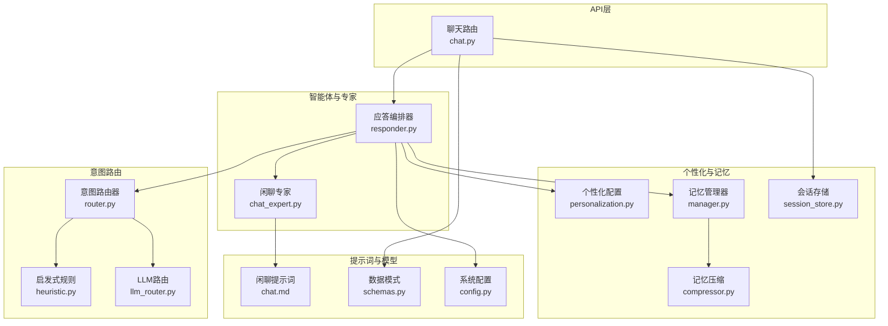
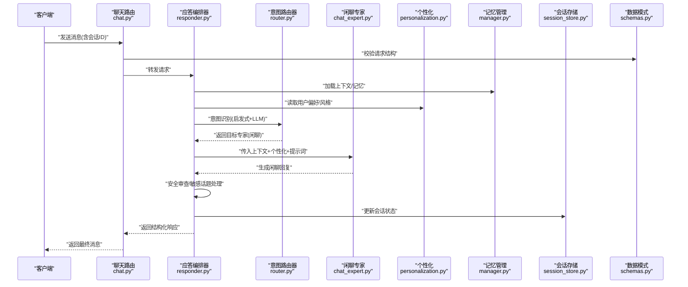
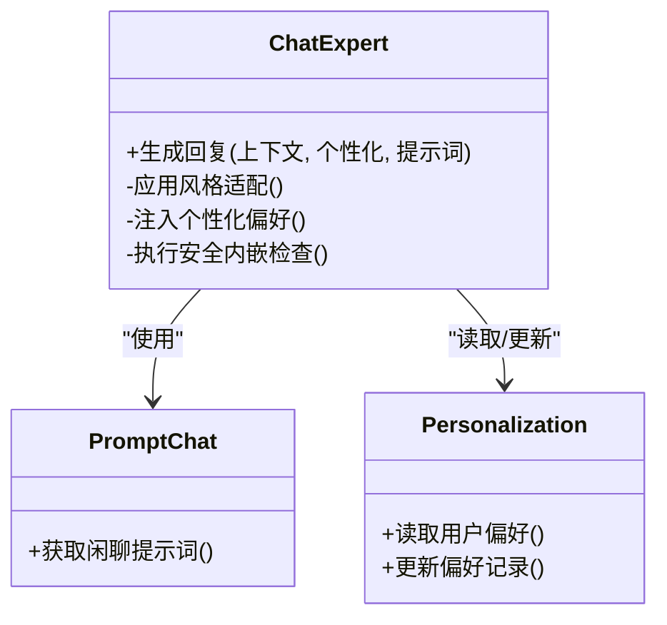
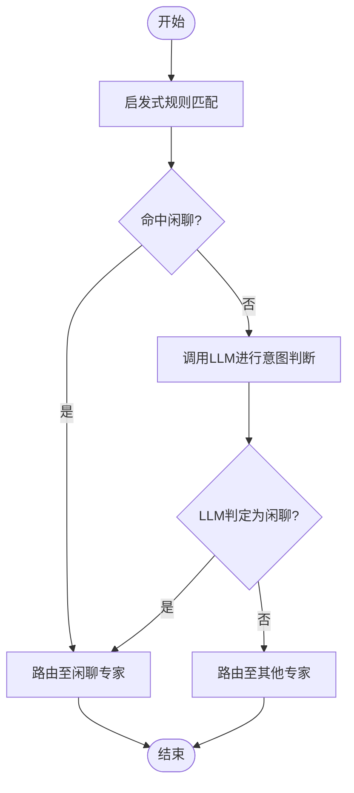
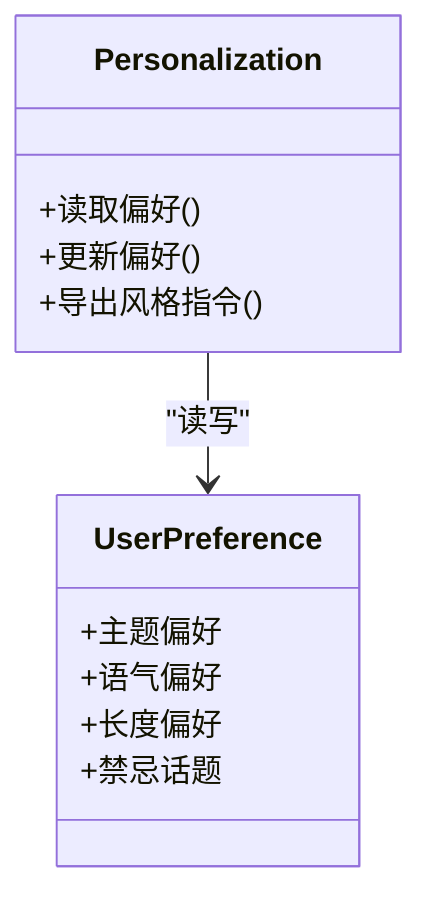
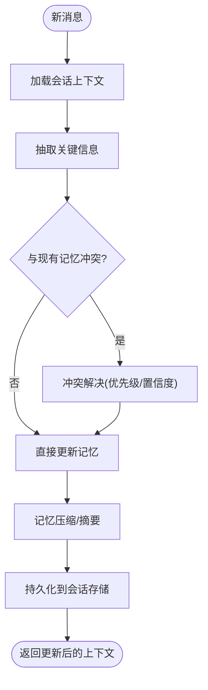
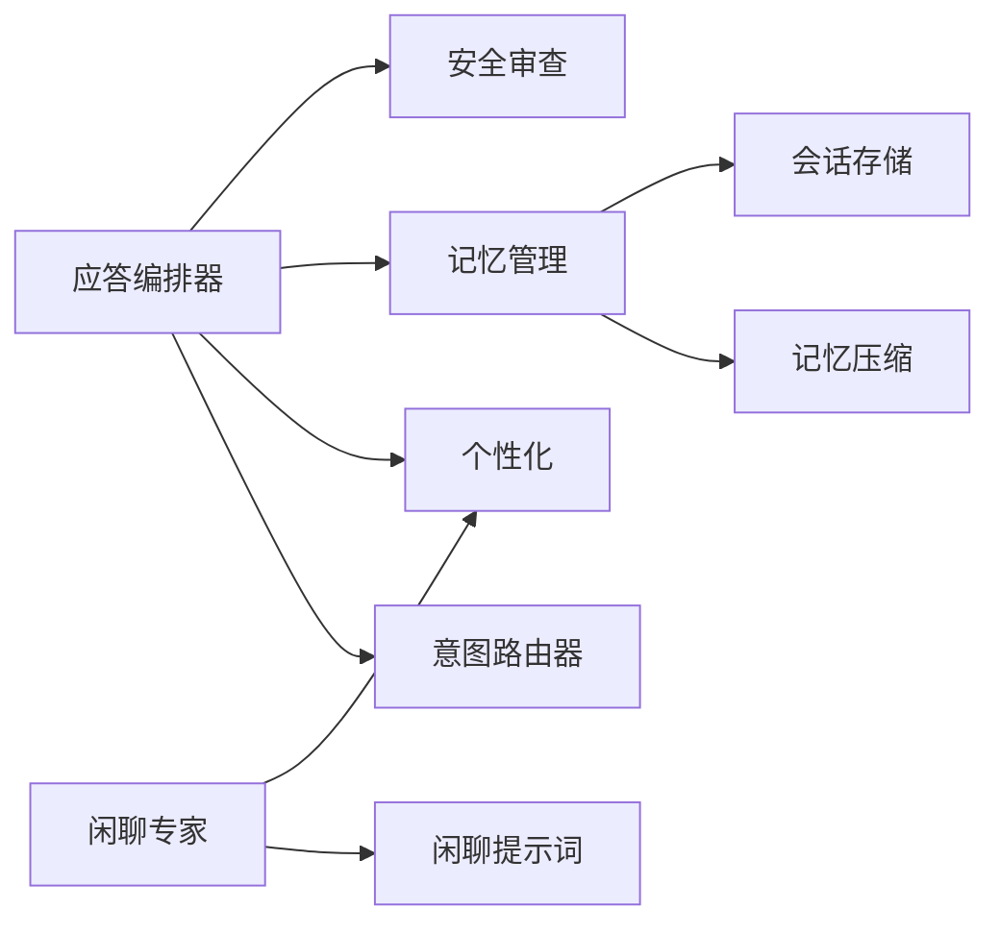

# 闲聊对话专家

<cite>
**本文引用的文件**   
- [backend_design/nexus/agent/experts/chat_expert.py](file://backend_design/nexus/agent/experts/chat_expert.py)
- [backend_design/nexus/agent/responder.py](file://backend_design/nexus/agent/responder.py)
- [backend_design/nexus/intent/router.py](file://backend_design/nexus/intent/router.py)
- [backend_design/nexus/intent/heuristic.py](file://backend_design/nexus/intent/heuristic.py)
- [backend_design/nexus/intent/llm_router.py](file://backend_design/nexus/intent/llm_router.py)
- [backend_design/nexus/core/personalization.py](file://backend_design/nexus/core/personalization.py)
- [backend_design/nexus/memory/manager.py](file://backend_design/nexus/memory/manager.py)
- [backend_design/nexus/memory/compressor.py](file://backend_design/nexus/memory/compressor.py)
- [backend_design/nexus/middleware/session_store.py](file://backend_design/nexus/middleware/session_store.py)
- [backend_design/nexus/api/routes/chat.py](file://backend_design/nexus/api/routes/chat.py)
- [backend_design/nexus/prompts/chat.md](file://backend_design/nexus/prompts/chat.md)
- [backend_design/nexus/models/schemas.py](file://backend_design/nexus/models/schemas.py)
- [backend_design/nexus/config.py](file://backend_design/nexus/config.py)
</cite>

## 目录
1. [简介](#简介)
2. [项目结构](#项目结构)
3. [核心组件](#核心组件)
4. [架构总览](#架构总览)
5. [详细组件分析](#详细组件分析)
6. [依赖关系分析](#依赖关系分析)
7. [性能考量](#性能考量)
8. [故障排查指南](#故障排查指南)
9. [结论](#结论)
10. [附录](#附录)

## 简介
本文件面向“闲聊对话专家”模块，系统性阐述闲聊意图识别、情感分析与个性化回复生成机制；说明对话风格适配、上下文理解与记忆保持策略；覆盖内容安全过滤、敏感话题处理与用户偏好学习；并提供质量评估标准与用户体验优化建议。文档以代码级事实为依据，辅以架构图与时序图帮助读者快速建立整体认知。

## 项目结构
围绕闲聊对话能力，相关代码主要分布在以下子系统中：
- 智能体与专家层：负责闲聊专家实现、统一应答编排与审查流程
- 意图路由层：提供启发式与LLM驱动的意图识别与路由
- 个性化与记忆：维护用户偏好、会话记忆与压缩摘要
- 中间件与会话：提供会话存储、限流等通用能力
- API 层：暴露聊天接口，承载请求解析与响应封装
- 提示词与模型：定义闲聊提示模板与数据模式

图示来源
- [backend_design/nexus/api/routes/chat.py](file://backend_design/nexus/api/routes/chat.py)
- [backend_design/nexus/agent/responder.py](file://backend_design/nexus/agent/responder.py)
- [backend_design/nexus/agent/experts/chat_expert.py](file://backend_design/nexus/agent/experts/chat_expert.py)
- [backend_design/nexus/intent/router.py](file://backend_design/nexus/intent/router.py)
- [backend_design/nexus/intent/heuristic.py](file://backend_design/nexus/intent/heuristic.py)
- [backend_design/nexus/intent/llm_router.py](file://backend_design/nexus/intent/llm_router.py)
- [backend_design/nexus/core/personalization.py](file://backend_design/nexus/core/personalization.py)
- [backend_design/nexus/memory/manager.py](file://backend_design/nexus/memory/manager.py)
- [backend_design/nexus/memory/compressor.py](file://backend_design/nexus/memory/compressor.py)
- [backend_design/nexus/middleware/session_store.py](file://backend_design/nexus/middleware/session_store.py)
- [backend_design/nexus/prompts/chat.md](file://backend_design/nexus/prompts/chat.md)
- [backend_design/nexus/models/schemas.py](file://backend_design/nexus/models/schemas.py)
- [backend_design/nexus/config.py](file://backend_design/nexus/config.py)

章节来源
- [backend_design/nexus/api/routes/chat.py](file://backend_design/nexus/api/routes/chat.py)
- [backend_design/nexus/agent/responder.py](file://backend_design/nexus/agent/responder.py)
- [backend_design/nexus/agent/experts/chat_expert.py](file://backend_design/nexus/agent/experts/chat_expert.py)
- [backend_design/nexus/intent/router.py](file://backend_design/nexus/intent/router.py)
- [backend_design/nexus/intent/heuristic.py](file://backend_design/nexus/intent/heuristic.py)
- [backend_design/nexus/intent/llm_router.py](file://backend_design/nexus/intent/llm_router.py)
- [backend_design/nexus/core/personalization.py](file://backend_design/nexus/core/personalization.py)
- [backend_design/nexus/memory/manager.py](file://backend_design/nexus/memory/manager.py)
- [backend_design/nexus/memory/compressor.py](file://backend_design/nexus/memory/compressor.py)
- [backend_design/nexus/middleware/session_store.py](file://backend_design/nexus/middleware/session_store.py)
- [backend_design/nexus/prompts/chat.md](file://backend_design/nexus/prompts/chat.md)
- [backend_design/nexus/models/schemas.py](file://backend_design/nexus/models/schemas.py)
- [backend_design/nexus/config.py](file://backend_design/nexus/config.py)

## 核心组件
- 闲聊专家（Chat Expert）：专注闲聊场景的对话生成，结合提示词与个性化信息输出自然、有温度的回复。
- 应答编排器（Responder）：串联意图识别、专家调用、安全审查与结果组装，形成端到端对话流水线。
- 意图路由器（Intent Router）：融合启发式规则与LLM判断，将输入分流至闲聊或专业领域专家。
- 个性化配置（Personalization）：管理用户偏好、风格与历史特征，驱动回复的个性化与一致性。
- 记忆管理器（Memory Manager）：维护会话上下文、长期记忆与冲突合并，保障连贯性与可追溯性。
- 记忆压缩（Compressor）：对长上下文进行摘要与降维，控制成本并提升检索效率。
- 会话存储（Session Store）：持久化会话状态，支撑跨请求的上下文恢复。
- 闲聊提示词（Prompt Chat）：定义闲聊风格、边界与安全约束，指导模型输出。
- 数据模式（Schemas）：规范请求/响应结构与字段校验。
- 系统配置（Config）：集中管理功能开关、阈值与外部服务参数。

章节来源
- [backend_design/nexus/agent/experts/chat_expert.py](file://backend_design/nexus/agent/experts/chat_expert.py)
- [backend_design/nexus/agent/responder.py](file://backend_design/nexus/agent/responder.py)
- [backend_design/nexus/intent/router.py](file://backend_design/nexus/intent/router.py)
- [backend_design/nexus/core/personalization.py](file://backend_design/nexus/core/personalization.py)
- [backend_design/nexus/memory/manager.py](file://backend_design/nexus/memory/manager.py)
- [backend_design/nexus/memory/compressor.py](file://backend_design/nexus/memory/compressor.py)
- [backend_design/nexus/middleware/session_store.py](file://backend_design/nexus/middleware/session_store.py)
- [backend_design/nexus/prompts/chat.md](file://backend_design/nexus/prompts/chat.md)
- [backend_design/nexus/models/schemas.py](file://backend_design/nexus/models/schemas.py)
- [backend_design/nexus/config.py](file://backend_design/nexus/config.py)

## 架构总览
闲聊对话从API进入，经应答编排器完成意图识别、专家选择、个性化注入、安全审查与结果返回。记忆与个性化贯穿始终，确保对话连贯与贴合用户画像。

图示来源
- [backend_design/nexus/api/routes/chat.py](file://backend_design/nexus/api/routes/chat.py)
- [backend_design/nexus/agent/responder.py](file://backend_design/nexus/agent/responder.py)
- [backend_design/nexus/intent/router.py](file://backend_design/nexus/intent/router.py)
- [backend_design/nexus/agent/experts/chat_expert.py](file://backend_design/nexus/agent/experts/chat_expert.py)
- [backend_design/nexus/core/personalization.py](file://backend_design/nexus/core/personalization.py)
- [backend_design/nexus/memory/manager.py](file://backend_design/nexus/memory/manager.py)
- [backend_design/nexus/middleware/session_store.py](file://backend_design/nexus/middleware/session_store.py)
- [backend_design/nexus/models/schemas.py](file://backend_design/nexus/models/schemas.py)

## 详细组件分析

### 闲聊专家（Chat Expert）
- 职责：在闲聊场景下生成自然、友好且符合风格的回复；结合个性化信息与上下文，避免重复与机械感。
- 关键机制：
  - 提示词驱动：通过闲聊提示词定义语气、长度、话题边界与安全约束。
  - 个性化注入：引入用户偏好、兴趣标签与历史互动风格。
  - 上下文融合：吸收最近多轮对话要点，保证连贯性。
  - 安全内嵌：在生成阶段遵循敏感话题规避与合规要求。
- 复杂度与优化：
  - 生成过程受提示词长度与上下文窗口影响，需配合记忆压缩降低开销。
  - 可通过缓存高频闲聊片段与风格模板减少重复计算。

图示来源
- [backend_design/nexus/agent/experts/chat_expert.py](file://backend_design/nexus/agent/experts/chat_expert.py)
- [backend_design/nexus/prompts/chat.md](file://backend_design/nexus/prompts/chat.md)
- [backend_design/nexus/core/personalization.py](file://backend_design/nexus/core/personalization.py)

章节来源
- [backend_design/nexus/agent/experts/chat_expert.py](file://backend_design/nexus/agent/experts/chat_expert.py)
- [backend_design/nexus/prompts/chat.md](file://backend_design/nexus/prompts/chat.md)
- [backend_design/nexus/core/personalization.py](file://backend_design/nexus/core/personalization.py)

### 意图识别与路由（Heuristic + LLM）
- 职责：将用户输入分类为闲聊或专业领域，决定由闲聊专家或其他专家处理。
- 关键机制：
  - 启发式规则：基于关键词、句式与常见闲聊模式快速判定。
  - LLM路由：当启发式不确定时，调用大模型进行语义级意图判别。
  - 降级策略：在LLM不可用时回退到启发式，保障可用性。
- 决策流程：

图示来源
- [backend_design/nexus/intent/router.py](file://backend_design/nexus/intent/router.py)
- [backend_design/nexus/intent/heuristic.py](file://backend_design/nexus/intent/heuristic.py)
- [backend_design/nexus/intent/llm_router.py](file://backend_design/nexus/intent/llm_router.py)

章节来源
- [backend_design/nexus/intent/router.py](file://backend_design/nexus/intent/router.py)
- [backend_design/nexus/intent/heuristic.py](file://backend_design/nexus/intent/heuristic.py)
- [backend_design/nexus/intent/llm_router.py](file://backend_design/nexus/intent/llm_router.py)

### 个性化与风格适配
- 职责：维护用户偏好、语言风格与互动习惯，使闲聊更贴近个人特征。
- 关键机制：
  - 偏好采集：从显式设置与隐式行为中学习（如常用话题、语气偏好）。
  - 风格映射：将偏好转换为提示词中的风格指令与示例。
  - 动态更新：随对话推进微调权重，避免刻板印象。
- 数据结构与关系：

图示来源
- [backend_design/nexus/core/personalization.py](file://backend_design/nexus/core/personalization.py)

章节来源
- [backend_design/nexus/core/personalization.py](file://backend_design/nexus/core/personalization.py)

### 上下文理解与记忆保持
- 职责：在多轮对话中维持连贯性，提取关键信息并长期保存，支持后续个性化与推荐。
- 关键机制：
  - 会话记忆：按时间顺序维护消息序列与摘要。
  - 冲突合并：当新信息与旧记忆不一致时，采用优先级与置信度合并。
  - 记忆压缩：对长上下文进行摘要与去重，降低上下文成本。
- 处理流程：

图示来源
- [backend_design/nexus/memory/manager.py](file://backend_design/nexus/memory/manager.py)
- [backend_design/nexus/memory/compressor.py](file://backend_design/nexus/memory/compressor.py)
- [backend_design/nexus/middleware/session_store.py](file://backend_design/nexus/middleware/session_store.py)

章节来源
- [backend_design/nexus/memory/manager.py](file://backend_design/nexus/memory/manager.py)
- [backend_design/nexus/memory/compressor.py](file://backend_design/nexus/memory/compressor.py)
- [backend_design/nexus/middleware/session_store.py](file://backend_design/nexus/middleware/session_store.py)

### 安全过滤与敏感话题处理
- 职责：在生成前后进行内容安全审查，规避不当内容与敏感话题，确保合规。
- 关键机制：
  - 前置过滤：对输入进行敏感词与违规模式检测。
  - 后置审查：对模型输出进行二次校验与改写。
  - 降级策略：当安全服务不可用时，启用本地白名单/黑名单与保守回复。
- 集成点：
  - 在应答编排器中串联安全步骤，确保所有专家输出均经过审查。
  - 结合闲聊提示词中的安全约束，引导模型自审。

章节来源
- [backend_design/nexus/agent/responder.py](file://backend_design/nexus/agent/responder.py)
- [backend_design/nexus/prompts/chat.md](file://backend_design/nexus/prompts/chat.md)

### 数据模式与API契约
- 职责：定义聊天请求/响应的结构，确保前后端一致与可验证性。
- 关键点：
  - 必填字段：消息文本、会话标识、可选上下文ID。
  - 扩展字段：个性化开关、风格参数、安全级别。
  - 错误码：用于区分网络、校验、业务与安全错误。

章节来源
- [backend_design/nexus/models/schemas.py](file://backend_design/nexus/models/schemas.py)
- [backend_design/nexus/api/routes/chat.py](file://backend_design/nexus/api/routes/chat.py)

### 系统配置与开关
- 职责：集中管理闲聊能力相关的配置项，包括路由阈值、安全策略、记忆压缩参数等。
- 关键点：
  - 功能开关：是否启用LLM路由、是否启用记忆压缩、是否启用个性化。
  - 阈值与超时：启发式匹配阈值、LLM调用超时、重试次数。
  - 外部服务：安全服务、向量库、RAG等连接参数。

章节来源
- [backend_design/nexus/config.py](file://backend_design/nexus/config.py)

## 依赖关系分析
- 耦合与内聚：
  - 应答编排器作为中枢，聚合意图路由、个性化、记忆与安全，内聚度高。
  - 闲聊专家相对独立，仅依赖提示词与个性化，便于替换与测试。
- 外部依赖：
  - 会话存储可能依赖Redis或数据库，需关注可用性与一致性。
  - LLM路由与安全服务存在外部依赖，需设计降级与熔断策略。
- 潜在循环依赖：
  - 应避免专家与编排器之间的双向调用，保持单向依赖。

图示来源
- [backend_design/nexus/agent/responder.py](file://backend_design/nexus/agent/responder.py)
- [backend_design/nexus/agent/experts/chat_expert.py](file://backend_design/nexus/agent/experts/chat_expert.py)
- [backend_design/nexus/intent/router.py](file://backend_design/nexus/intent/router.py)
- [backend_design/nexus/core/personalization.py](file://backend_design/nexus/core/personalization.py)
- [backend_design/nexus/memory/manager.py](file://backend_design/nexus/memory/manager.py)
- [backend_design/nexus/memory/compressor.py](file://backend_design/nexus/memory/compressor.py)
- [backend_design/nexus/middleware/session_store.py](file://backend_design/nexus/middleware/session_store.py)
- [backend_design/nexus/prompts/chat.md](file://backend_design/nexus/prompts/chat.md)

章节来源
- [backend_design/nexus/agent/responder.py](file://backend_design/nexus/agent/responder.py)
- [backend_design/nexus/agent/experts/chat_expert.py](file://backend_design/nexus/agent/experts/chat_expert.py)
- [backend_design/nexus/intent/router.py](file://backend_design/nexus/intent/router.py)
- [backend_design/nexus/core/personalization.py](file://backend_design/nexus/core/personalization.py)
- [backend_design/nexus/memory/manager.py](file://backend_design/nexus/memory/manager.py)
- [backend_design/nexus/memory/compressor.py](file://backend_design/nexus/memory/compressor.py)
- [backend_design/nexus/middleware/session_store.py](file://backend_design/nexus/middleware/session_store.py)
- [backend_design/nexus/prompts/chat.md](file://backend_design/nexus/prompts/chat.md)

## 性能考量
- 上下文成本控制：
  - 使用记忆压缩与摘要减少提示词长度，降低LLM调用成本与延迟。
  - 合理设置会话窗口大小，避免过长上下文导致响应缓慢。
- 路由与降级：
  - 启发式优先，仅在必要时调用LLM路由，提高吞吐与稳定性。
  - 外部服务失败时启用本地策略与默认回复，保障可用性。
- 并发与缓存：
  - 对高频闲聊片段与风格模板进行缓存，减少重复计算。
  - 会话存储采用异步写入与批量更新，降低I/O压力。
- 监控与观测：
  - 记录关键指标（意图识别准确率、生成延迟、安全拦截率），持续优化。

[本节为通用性能建议，不直接分析具体文件]

## 故障排查指南
- 常见问题定位：
  - 意图误判：检查启发式规则与LLM路由日志，确认阈值与样本分布。
  - 个性化失效：核对个性化配置加载与更新流程，确认偏好来源与时效。
  - 记忆丢失：验证会话存储可用性与持久化策略，检查压缩参数是否过激。
  - 安全拦截过多：调整安全策略与白名单，审查提示词中的安全约束。
- 诊断步骤：
  - 查看编排器链路日志，定位异常节点。
  - 对比输入与输出，确认是否在安全审查或记忆更新环节出错。
  - 回放会话上下文，复现问题并逐步缩小范围。

章节来源
- [backend_design/nexus/agent/responder.py](file://backend_design/nexus/agent/responder.py)
- [backend_design/nexus/intent/router.py](file://backend_design/nexus/intent/router.py)
- [backend_design/nexus/core/personalization.py](file://backend_design/nexus/core/personalization.py)
- [backend_design/nexus/memory/manager.py](file://backend_design/nexus/memory/manager.py)
- [backend_design/nexus/middleware/session_store.py](file://backend_design/nexus/middleware/session_store.py)

## 结论
闲聊对话专家通过“意图识别—个性化注入—记忆保持—安全审查”的闭环，实现了自然、连贯且安全的闲聊体验。建议在工程实践中持续优化路由策略、记忆压缩与个性化学习，同时完善质量评估与监控体系，以提升用户体验与系统稳定性。

[本节为总结性内容，不直接分析具体文件]

## 附录
- 质量评估标准（建议）：
  - 相关性：回复是否与当前话题与上下文高度相关。
  - 连贯性：多轮对话中逻辑一致、无矛盾。
  - 个性化：是否体现用户偏好与风格。
  - 安全性：是否有效规避敏感与不当内容。
  - 流畅度：语言自然、表达清晰、无冗余。
- 用户体验优化建议：
  - 渐进式个性化：初期轻量交互收集偏好，逐步丰富画像。
  - 可控风格：允许用户调节语气、长度与话题深度。
  - 透明反馈：提供“不喜欢/改进”按钮，驱动偏好学习。
  - 容错与兜底：在异常情况下提供友好提示与替代方案。

[本节为概念性内容，不直接分析具体文件]