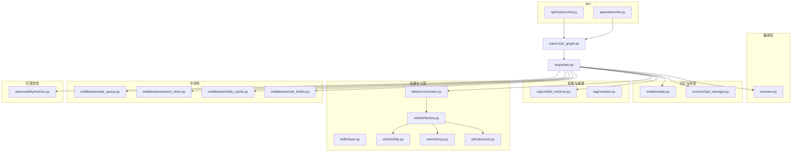
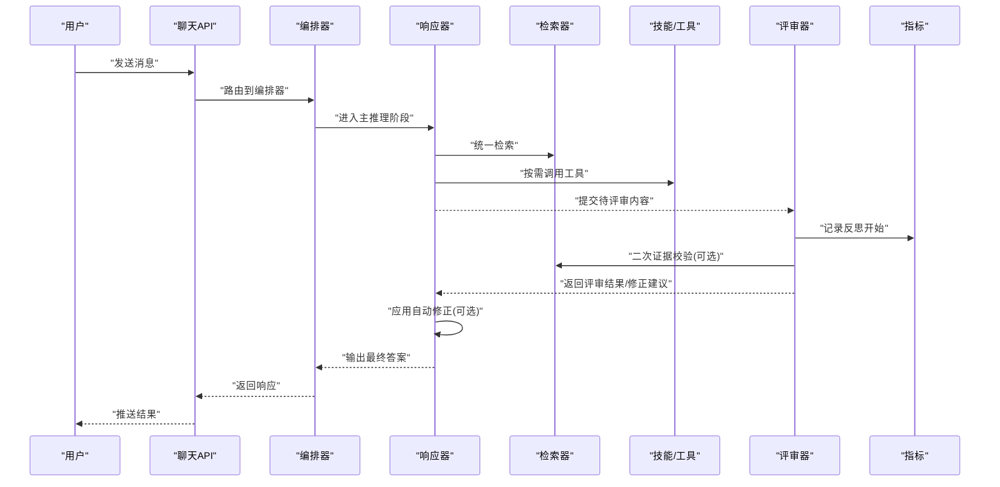
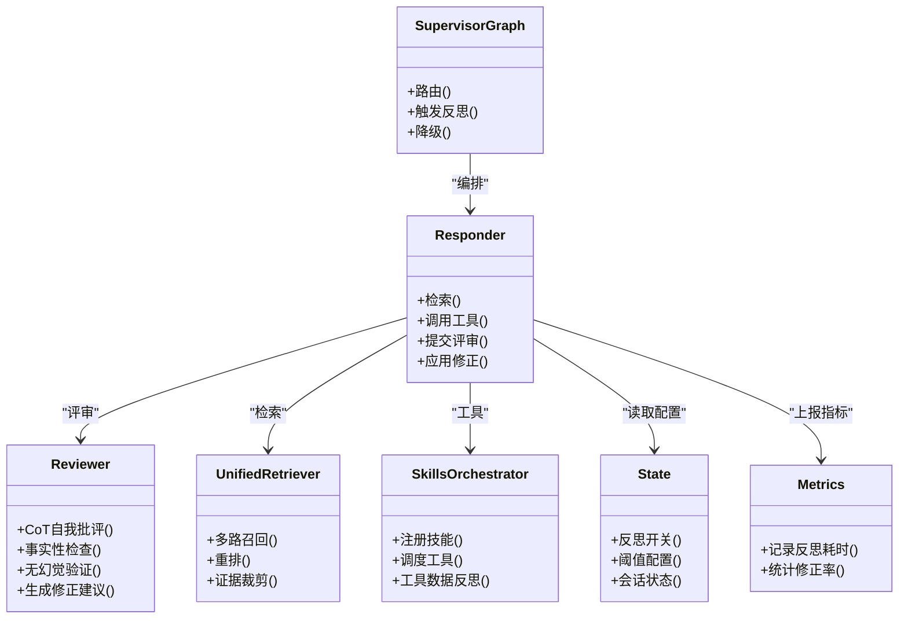

# 反思校验系统

<cite>
**本文引用的文件**   
- [backend_design/nexus/agent/responder.py](file://backend_design/nexus/agent/responder.py)
- [backend_design/nexus/agent/reviewer.py](file://backend_design/nexus/agent/reviewer.py)
- [backend_design/nexus/agent/supervisor_graph.py](file://backend_design/nexus/agent/supervisor_graph.py)
- [backend_design/nexus/core/cockpit_manager.py](file://backend_design/nexus/core/cockpit_manager.py)
- [backend_design/nexus/models/state.py](file://backend_design/nexus/models/state.py)
- [backend_design/nexus/config.py](file://backend_design/nexus/config.py)
- [backend_design/nexus/observability/metrics.py](file://backend_design/nexus/observability/metrics.py)
- [backend_design/nexus/rag/unified_retriever.py](file://backend_design/nexus/rag/unified_retriever.py)
- [backend_design/nexus/rag/reranker.py](file://backend_design/nexus/rag/reranker.py)
- [backend_design/nexus/api/routes/chat.py](file://backend_design/nexus/api/routes/chat.py)
- [backend_design/nexus/api/websocket.py](file://backend_design/nexus/api/websocket.py)
- [backend_design/nexus/core/circuit_breaker.py](file://backend_design/nexus/core/circuit_breaker.py)
- [backend_design/nexus/memory/compressor.py](file://backend_design/nexus/memory/compressor.py)
- [backend_design/nexus/memory/conflict.py](file://backend_design/nexus/memory/conflict.py)
- [backend_design/nexus/memory/manager.py](file://backend_design/nexus/memory/manager.py)
- [backend_design/nexus/intent/llm_router.py](file://backend_design/nexus/intent/llm_router.py)
- [backend_design/nexus/skills/orchestrator.py](file://backend_design/nexus/skills/orchestrator.py)
- [backend_design/nexus/skills/base.py](file://backend_design/nexus/skills/base.py)
- [backend_design/nexus/vehicle/factory.py](file://backend_design/nexus/vehicle/factory.py)
- [backend_design/nexus/vehicle/http.py](file://backend_design/nexus/vehicle/http.py)
- [backend_design/nexus/vehicle/mcp.py](file://backend_design/nexus/vehicle/mcp.py)
- [backend_design/nexus/vehicle/mock.py](file://backend_design/nexus/vehicle/mock.py)
- [backend_design/nexus/middleware/task_queue.py](file://backend_design/nexus/middleware/task_queue.py)
- [backend_design/nexus/middleware/session_store.py](file://backend_design/nexus/middleware/session_store.py)
- [backend_design/nexus/middleware/redis_cache.py](file://backend_design/nexus/middleware/redis_cache.py)
- [backend_design/nexus/middleware/rate_limiter.py](file://backend_design/nexus/middleware/rate_limiter.py)
- [backend_design/nexus/prompts/chat.md](file://backend_design/nexus/prompts/chat.md)
- [backend_design/nexus/prompts/clarification.md](file://backend_design/nexus/prompts/clarification.md)
- [backend_design/nexus/prompts/memory_extract.md](file://backend_design/nexus/prompts/memory_extract.md)
- [backend_design/nexus/prompts/vehicle.md](file://backend_design/nexus/prompts/vehicle.md)
</cite>

## 目录
1. [简介](#简介)
2. [项目结构](#项目结构)
3. [核心组件](#核心组件)
4. [架构总览](#架构总览)
5. [详细组件分析](#详细组件分析)
6. [依赖关系分析](#依赖关系分析)
7. [性能与降级策略](#性能与降级策略)
8. [故障排查指南](#故障排查指南)
9. [结论](#结论)
10. [附录](#附录)

## 简介
本文件面向 NexusCockpit v2.2 引入的“反思校验系统”，系统性阐述其设计目标、运行机制与落地方案。重点覆盖：
- 反思机制总体架构与控制流
- CoT（思维链）自我批评模式、事实性检查与无幻觉验证
- 多场景反思策略：工具数据反思、搜索结果反思、轻量检查
- 自动修正流程与重试/回退策略
- 反思开关配置、性能优化与降级策略
- 效果评估与调优指南

## 项目结构
反思校验系统贯穿 Agent 编排、检索增强生成（RAG）、技能执行、会话状态与可观测性等模块，关键位置如下：
- 编排与决策：supervisor_graph、responder、reviewer
- 状态与配置：state、config
- 检索与重排：unified_retriever、reranker
- 技能与工具：skills/orchestrator、base、vehicle/*
- 中间件与会话：task_queue、session_store、redis_cache、rate_limiter
- 可观测性与指标：metrics
- API 入口：chat、websocket

图表来源
- [backend_design/nexus/agent/supervisor_graph.py](file://backend_design/nexus/agent/supervisor_graph.py)
- [backend_design/nexus/agent/responder.py](file://backend_design/nexus/agent/responder.py)
- [backend_design/nexus/agent/reviewer.py](file://backend_design/nexus/agent/reviewer.py)
- [backend_design/nexus/rag/unified_retriever.py](file://backend_design/nexus/rag/unified_retriever.py)
- [backend_design/nexus/rag/reranker.py](file://backend_design/nexus/rag/reranker.py)
- [backend_design/nexus/skills/orchestrator.py](file://backend_design/nexus/skills/orchestrator.py)
- [backend_design/nexus/skills/base.py](file://backend_design/nexus/skills/base.py)
- [backend_design/nexus/vehicle/factory.py](file://backend_design/nexus/vehicle/factory.py)
- [backend_design/nexus/vehicle/http.py](file://backend_design/nexus/vehicle/http.py)
- [backend_design/nexus/vehicle/mcp.py](file://backend_design/nexus/vehicle/mcp.py)
- [backend_design/nexus/vehicle/mock.py](file://backend_design/nexus/vehicle/mock.py)
- [backend_design/nexus/middleware/task_queue.py](file://backend_design/nexus/middleware/task_queue.py)
- [backend_design/nexus/middleware/session_store.py](file://backend_design/nexus/middleware/session_store.py)
- [backend_design/nexus/middleware/redis_cache.py](file://backend_design/nexus/middleware/redis_cache.py)
- [backend_design/nexus/middleware/rate_limiter.py](file://backend_design/nexus/middleware/rate_limiter.py)
- [backend_design/nexus/observability/metrics.py](file://backend_design/nexus/observability/metrics.py)
- [backend_design/nexus/api/routes/chat.py](file://backend_design/nexus/api/routes/chat.py)
- [backend_design/nexus/api/websocket.py](file://backend_design/nexus/api/websocket.py)

章节来源
- [backend_design/nexus/agent/supervisor_graph.py](file://backend_design/nexus/agent/supervisor_graph.py)
- [backend_design/nexus/agent/responder.py](file://backend_design/nexus/agent/responder.py)
- [backend_design/nexus/agent/reviewer.py](file://backend_design/nexus/agent/reviewer.py)
- [backend_design/nexus/rag/unified_retriever.py](file://backend_design/nexus/rag/unified_retriever.py)
- [backend_design/nexus/rag/reranker.py](file://backend_design/nexus/rag/reranker.py)
- [backend_design/nexus/skills/orchestrator.py](file://backend_design/nexus/skills/orchestrator.py)
- [backend_design/nexus/skills/base.py](file://backend_design/nexus/skills/base.py)
- [backend_design/nexus/vehicle/factory.py](file://backend_design/nexus/vehicle/factory.py)
- [backend_design/nexus/vehicle/http.py](file://backend_design/nexus/vehicle/http.py)
- [backend_design/nexus/vehicle/mcp.py](file://backend_design/nexus/vehicle/mcp.py)
- [backend_design/nexus/vehicle/mock.py](file://backend_design/nexus/vehicle/mock.py)
- [backend_design/nexus/middleware/task_queue.py](file://backend_design/nexus/middleware/task_queue.py)
- [backend_design/nexus/middleware/session_store.py](file://backend_design/nexus/middleware/session_store.py)
- [backend_design/nexus/middleware/redis_cache.py](file://backend_design/nexus/middleware/redis_cache.py)
- [backend_design/nexus/middleware/rate_limiter.py](file://backend_design/nexus/middleware/rate_limiter.py)
- [backend_design/nexus/observability/metrics.py](file://backend_design/nexus/observability/metrics.py)
- [backend_design/nexus/api/routes/chat.py](file://backend_design/nexus/api/routes/chat.py)
- [backend_design/nexus/api/websocket.py](file://backend_design/nexus/api/websocket.py)

## 核心组件
- 编排器（Supervisor Graph）
  - 负责请求路由、阶段划分、反思触发条件判断与整体控制流。
- 响应器（Responder）
  - 承载主推理路径，串联检索、工具调用、反思评审与结果合成。
- 评审器（Reviewer）
  - 实现反思校验的核心逻辑：CoT 自我批评、事实性检查、无幻觉验证与自动修正建议。
- 检索与重排（Unified Retriever / Reranker）
  - 提供统一检索接口与结果重排，为事实性检查与无幻觉验证提供证据源。
- 技能编排与工具（Skills Orchestrator / Base / Vehicle*）
  - 封装领域能力与外部工具调用，支持工具数据反思与自动修正。
- 状态与配置（State / Config）
  - 管理会话状态、反思开关、阈值与策略参数。
- 中间件（Task Queue / Session Store / Redis Cache / Rate Limiter）
  - 支撑异步反思任务、会话持久化、缓存与限流保护。
- 可观测性（Metrics）
  - 记录反思耗时、通过率、修正次数等关键指标。

章节来源
- [backend_design/nexus/agent/supervisor_graph.py](file://backend_design/nexus/agent/supervisor_graph.py)
- [backend_design/nexus/agent/responder.py](file://backend_design/nexus/agent/responder.py)
- [backend_design/nexus/agent/reviewer.py](file://backend_design/nexus/agent/reviewer.py)
- [backend_design/nexus/rag/unified_retriever.py](file://backend_design/nexus/rag/unified_retriever.py)
- [backend_design/nexus/rag/reranker.py](file://backend_design/nexus/rag/reranker.py)
- [backend_design/nexus/skills/orchestrator.py](file://backend_design/nexus/skills/orchestrator.py)
- [backend_design/nexus/skills/base.py](file://backend_design/nexus/skills/base.py)
- [backend_design/nexus/vehicle/factory.py](file://backend_design/nexus/vehicle/factory.py)
- [backend_design/nexus/vehicle/http.py](file://backend_design/nexus/vehicle/http.py)
- [backend_design/nexus/vehicle/mcp.py](file://backend_design/nexus/vehicle/mcp.py)
- [backend_design/nexus/vehicle/mock.py](file://backend_design/nexus/vehicle/mock.py)
- [backend_design/nexus/models/state.py](file://backend_design/nexus/models/state.py)
- [backend_design/nexus/config.py](file://backend_design/nexus/config.py)
- [backend_design/nexus/middleware/task_queue.py](file://backend_design/nexus/middleware/task_queue.py)
- [backend_design/nexus/middleware/session_store.py](file://backend_design/nexus/middleware/session_store.py)
- [backend_design/nexus/middleware/redis_cache.py](file://backend_design/nexus/middleware/redis_cache.py)
- [backend_design/nexus/middleware/rate_limiter.py](file://backend_design/nexus/middleware/rate_limiter.py)
- [backend_design/nexus/observability/metrics.py](file://backend_design/nexus/observability/metrics.py)

## 架构总览
反思校验系统在 v2.2 中作为独立评审阶段嵌入到主推理链路，形成“生成-评审-修正”闭环。

图表来源
- [backend_design/nexus/api/routes/chat.py](file://backend_design/nexus/api/routes/chat.py)
- [backend_design/nexus/agent/supervisor_graph.py](file://backend_design/nexus/agent/supervisor_graph.py)
- [backend_design/nexus/agent/responder.py](file://backend_design/nexus/agent/responder.py)
- [backend_design/nexus/rag/unified_retriever.py](file://backend_design/nexus/rag/unified_retriever.py)
- [backend_design/nexus/agent/reviewer.py](file://backend_design/nexus/agent/reviewer.py)
- [backend_design/nexus/observability/metrics.py](file://backend_design/nexus/observability/metrics.py)

## 详细组件分析

### 编排器（Supervisor Graph）
- 职责
  - 解析请求上下文，决定是否需要启用反思校验。
  - 协调主推理与评审阶段的切换与重试。
  - 根据负载与延迟预算选择反思强度（完整/轻量）。
- 关键点
  - 反射触发条件：基于意图复杂度、工具调用数量、检索置信度等。
  - 降级策略：当评审超时或失败时，回退到轻量检查或直接输出。

章节来源
- [backend_design/nexus/agent/supervisor_graph.py](file://backend_design/nexus/agent/supervisor_graph.py)

### 响应器（Responder）
- 职责
  - 组织检索与工具调用，收集证据与执行结果。
  - 将候选答案与证据提交给评审器进行反思校验。
  - 接收评审反馈并执行自动修正。
- 关键点
  - 证据聚合：合并检索片段与工具返回的结构化数据。
  - 修正策略：按优先级替换/补充/删除断言，保留引用来源。
  - 指标上报：记录反思轮次、修正次数、耗时分布。

章节来源
- [backend_design/nexus/agent/responder.py](file://backend_design/nexus/agent/responder.py)
- [backend_design/nexus/observability/metrics.py](file://backend_design/nexus/observability/metrics.py)

### 评审器（Reviewer）
- 职责
  - 实现三大反思能力：
    - CoT 自我批评：以结构化思维链对答案进行逐步审视。
    - 事实性检查：对照检索证据与权威来源核验关键断言。
    - 无幻觉验证：识别并消除未由证据支持的推断。
  - 输出评审报告与修正建议，驱动自动修正。
- 关键点
  - 评分与阈值：对每个断言打分，超过阈值则标记需修正。
  - 证据溯源：为每条修正建议附带来源片段与定位信息。
  - 安全边界：禁止在不确定情况下编造来源；必要时采用保守回答。

章节来源
- [backend_design/nexus/agent/reviewer.py](file://backend_design/nexus/agent/reviewer.py)

### 检索与重排（Unified Retriever / Reranker）
- 职责
  - 提供统一检索接口，聚合多源结果。
  - 通过重排提升相关性与可信度，为事实性检查提供高质量证据。
- 关键点
  - 多路召回：向量检索、关键词检索、图谱检索等。
  - 重排策略：语义相关性、时效性、来源权威性综合排序。
  - 证据裁剪：仅保留与问题强相关的片段，降低噪声。

章节来源
- [backend_design/nexus/rag/unified_retriever.py](file://backend_design/nexus/rag/unified_retriever.py)
- [backend_design/nexus/rag/reranker.py](file://backend_design/nexus/rag/reranker.py)

### 技能编排与工具（Skills Orchestrator / Base / Vehicle*）
- 职责
  - 封装车辆控制、媒体播放、导航等技能。
  - 暴露统一工具接口供响应器调用，并为工具数据反思提供输入。
- 关键点
  - 工具数据反思：校验工具返回数据的完整性、一致性与合理性。
  - 自动修正：对异常值或缺失字段进行补全或回退默认值。
  - 错误隔离：单个工具失败不影响整体流程，采用局部重试或降级。

章节来源
- [backend_design/nexus/skills/orchestrator.py](file://backend_design/nexus/skills/orchestrator.py)
- [backend_design/nexus/skills/base.py](file://backend_design/nexus/skills/base.py)
- [backend_design/nexus/vehicle/factory.py](file://backend_design/nexus/vehicle/factory.py)
- [backend_design/nexus/vehicle/http.py](file://backend_design/nexus/vehicle/http.py)
- [backend_design/nexus/vehicle/mcp.py](file://backend_design/nexus/vehicle/mcp.py)
- [backend_design/nexus/vehicle/mock.py](file://backend_design/nexus/vehicle/mock.py)

### 状态与配置（State / Config）
- 职责
  - 维护会话级反思开关、阈值与策略参数。
  - 持久化反思过程与结果，便于审计与回溯。
- 关键点
  - 反思开关：全局开关、按会话/意图粒度开关。
  - 阈值配置：事实性检查阈值、无幻觉容忍度、修正最大轮次。
  - 降级策略：超时、资源不足时的降级路径。

章节来源
- [backend_design/nexus/models/state.py](file://backend_design/nexus/models/state.py)
- [backend_design/nexus/config.py](file://backend_design/nexus/config.py)

### 中间件（Task Queue / Session Store / Redis Cache / Rate Limiter）
- 职责
  - 异步执行反思任务，避免阻塞主链路。
  - 会话状态持久化与共享。
  - 热点数据缓存与访问限流。
- 关键点
  - 任务队列：反思任务入队、重试与死信处理。
  - 会话存储：保存反思轨迹与修正历史。
  - 缓存策略：缓存检索结果与评审结论，减少重复计算。
  - 限流保护：防止反思风暴导致系统过载。

章节来源
- [backend_design/nexus/middleware/task_queue.py](file://backend_design/nexus/middleware/task_queue.py)
- [backend_design/nexus/middleware/session_store.py](file://backend_design/nexus/middleware/session_store.py)
- [backend_design/nexus/middleware/redis_cache.py](file://backend_design/nexus/middleware/redis_cache.py)
- [backend_design/nexus/middleware/rate_limiter.py](file://backend_design/nexus/middleware/rate_limiter.py)

### API 入口（Chat / WebSocket）
- 职责
  - 接收用户请求，转发至编排器。
  - 支持流式推送反思过程与最终结果。
- 关键点
  - 事件流：分阶段推送“检索完成”“评审中”“已修正”等事件。
  - 超时控制：结合中间件与编排器设置端到端超时。

章节来源
- [backend_design/nexus/api/routes/chat.py](file://backend_design/nexus/api/routes/chat.py)
- [backend_design/nexus/api/websocket.py](file://backend_design/nexus/api/websocket.py)

## 依赖关系分析
反思校验系统的依赖关系呈现“编排居中、检索与工具两侧扩展、中间件与可观测性横向支撑”的特点。

图表来源
- [backend_design/nexus/agent/supervisor_graph.py](file://backend_design/nexus/agent/supervisor_graph.py)
- [backend_design/nexus/agent/responder.py](file://backend_design/nexus/agent/responder.py)
- [backend_design/nexus/agent/reviewer.py](file://backend_design/nexus/agent/reviewer.py)
- [backend_design/nexus/rag/unified_retriever.py](file://backend_design/nexus/rag/unified_retriever.py)
- [backend_design/nexus/skills/orchestrator.py](file://backend_design/nexus/skills/orchestrator.py)
- [backend_design/nexus/models/state.py](file://backend_design/nexus/models/state.py)
- [backend_design/nexus/observability/metrics.py](file://backend_design/nexus/observability/metrics.py)

## 性能与降级策略
- 反思强度分级
  - 完整反思：适用于高价值问答、复杂工具链路与低置信度检索。
  - 轻量检查：适用于简单问答、高置信度检索与低延迟要求场景。
- 自动修正流程
  - 断言级修正：逐条断言评分，超阈即修正；保留证据来源。
  - 段落级修正：对整段内容进行重写或删减，确保一致性。
  - 工具级修正：对工具返回数据进行校验与补全，失败则回退默认值。
- 降级策略
  - 评审超时：回退到轻量检查或直接输出，并标注不确定性。
  - 检索失败：使用缓存或默认知识，降低事实性检查强度。
  - 工具不可用：跳过该工具分支，采用替代方案或保守回答。
- 资源与限流
  - 任务队列背压：反思任务排队与优先级调度。
  - 缓存命中：复用检索与评审结果，减少重复计算。
  - 速率限制：防止突发流量引发反思风暴。

章节来源
- [backend_design/nexus/agent/supervisor_graph.py](file://backend_design/nexus/agent/supervisor_graph.py)
- [backend_design/nexus/agent/responder.py](file://backend_design/nexus/agent/responder.py)
- [backend_design/nexus/agent/reviewer.py](file://backend_design/nexus/agent/reviewer.py)
- [backend_design/nexus/rag/unified_retriever.py](file://backend_design/nexus/rag/unified_retriever.py)
- [backend_design/nexus/middleware/task_queue.py](file://backend_design/nexus/middleware/task_queue.py)
- [backend_design/nexus/middleware/redis_cache.py](file://backend_design/nexus/middleware/redis_cache.py)
- [backend_design/nexus/middleware/rate_limiter.py](file://backend_design/nexus/middleware/rate_limiter.py)

## 故障排查指南
- 常见问题
  - 反思不触发：检查编排器触发条件与状态中的反思开关。
  - 评审超时：查看任务队列积压与评审器耗时指标，调整阈值或降级策略。
  - 修正无效：确认证据质量与重排效果，必要时扩大检索范围。
  - 工具数据异常：检查工具返回结构与校验规则，启用容错与默认值。
- 诊断步骤
  - 查看会话状态与反思轨迹，定位失败阶段。
  - 检查检索证据是否充分，重排分数是否合理。
  - 审查评审报告与修正建议，确认评分阈值是否过严。
  - 观察指标面板，关注反思耗时、修正率与失败率趋势。
- 恢复措施
  - 临时关闭反思或切换到轻量检查。
  - 增加缓存命中率，预热热点数据。
  - 扩容任务队列与评审器实例，缓解拥塞。

章节来源
- [backend_design/nexus/models/state.py](file://backend_design/nexus/models/state.py)
- [backend_design/nexus/observability/metrics.py](file://backend_design/nexus/observability/metrics.py)
- [backend_design/nexus/middleware/task_queue.py](file://backend_design/nexus/middleware/task_queue.py)
- [backend_design/nexus/rag/unified_retriever.py](file://backend_design/nexus/rag/unified_retriever.py)
- [backend_design/nexus/rag/reranker.py](file://backend_design/nexus/rag/reranker.py)

## 结论
NexusCockpit v2.2 的反思校验系统通过“生成-评审-修正”闭环显著提升了答案的事实性与可靠性。借助分层反思策略、自动修正与完善的降级机制，系统在准确性与性能之间取得良好平衡。配合可观测性与中间件保障，可在复杂业务场景中稳定运行。

## 附录

### 反思策略速查表
- 工具数据反思
  - 适用：工具返回结构化数据，需校验完整性与一致性。
  - 动作：缺失字段补全、异常值替换、失败回退。
- 搜索结果反思
  - 适用：检索证据不充分或存在冲突。
  - 动作：扩大检索范围、重排优化、证据裁剪。
- 轻量检查
  - 适用：简单问答、高置信度场景。
  - 动作：快速事实核对、无幻觉扫描、保守回答。

### 反思开关与阈值配置要点
- 全局开关：开启/关闭反思校验。
- 粒度开关：按会话、意图或技能维度控制。
- 阈值配置：事实性检查阈值、无幻觉容忍度、修正最大轮次。
- 降级策略：评审超时、检索失败、工具不可用的回退路径。

### 效果评估与调优指南
- 评估指标
  - 事实性准确率、无幻觉比例、修正成功率、平均反思耗时。
- 调优方向
  - 提升检索质量与重排效果。
  - 调整评审阈值与修正策略。
  - 优化任务队列与缓存命中率。
  - 针对高频场景定制轻量检查策略。