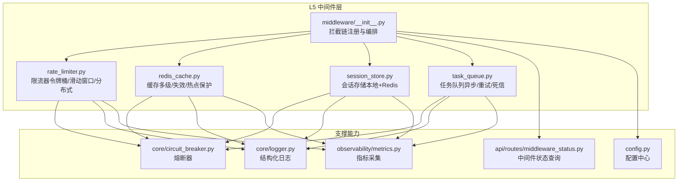
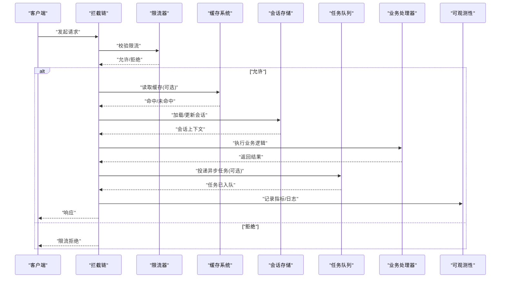
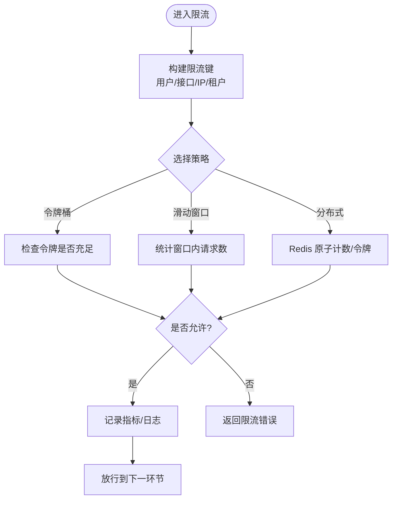
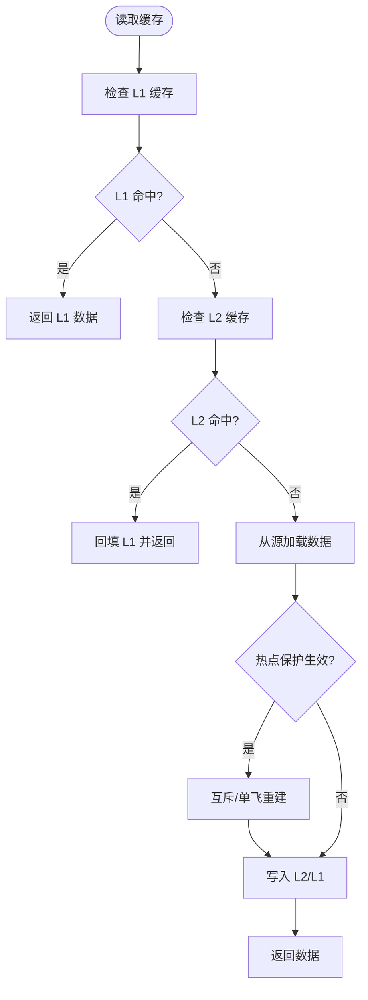
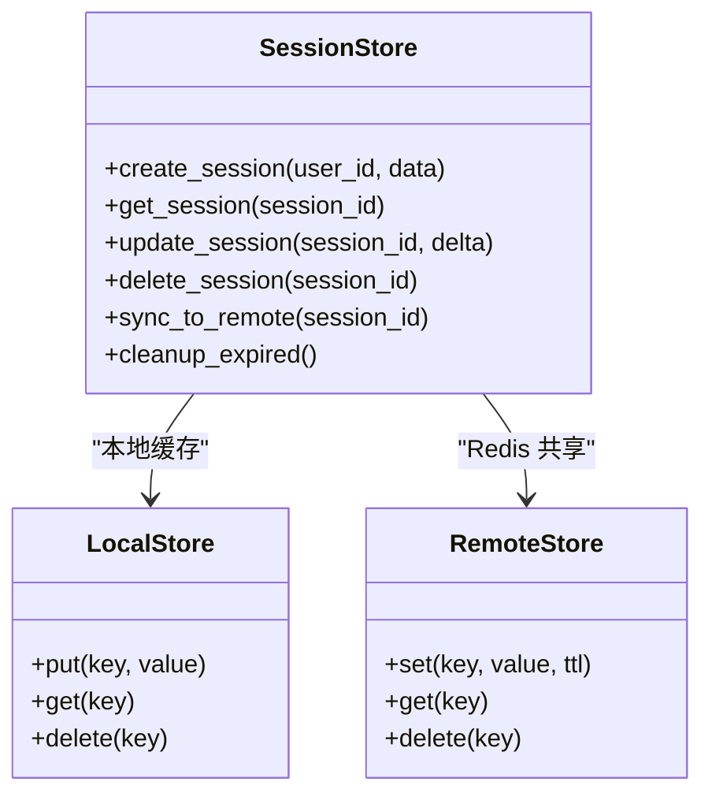
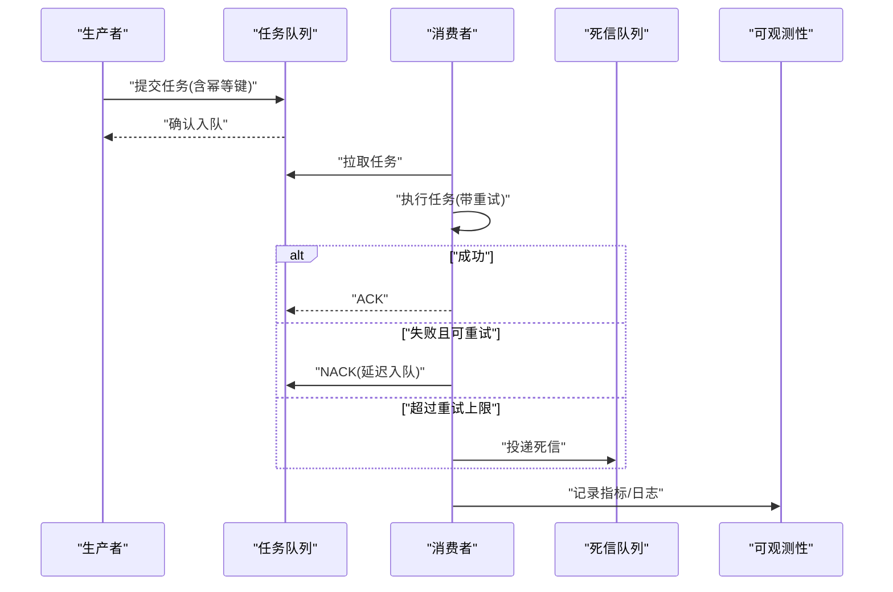
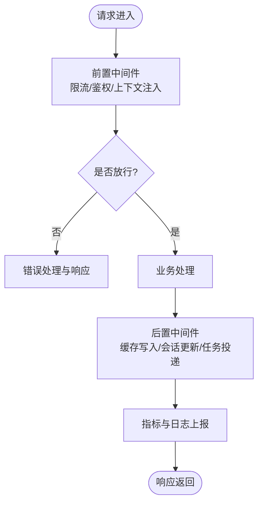
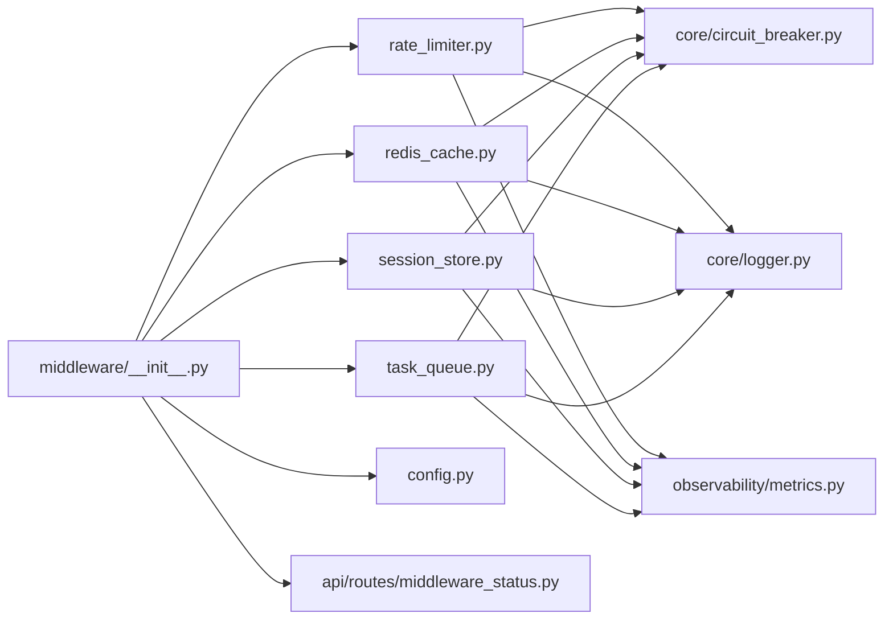

# L5 中间件层

<cite>
**本文引用的文件**   
- [backend_design/nexus/middleware/__init__.py](file://backend_design/nexus/middleware/__init__.py)
- [backend_design/nexus/middleware/rate_limiter.py](file://backend_design/nexus/middleware/rate_limiter.py)
- [backend_design/nexus/middleware/redis_cache.py](file://backend_design/nexus/middleware/redis_cache.py)
- [backend_design/nexus/middleware/session_store.py](file://backend_design/nexus/middleware/session_store.py)
- [backend_design/nexus/middleware/task_queue.py](file://backend_design/nexus/middleware/task_queue.py)
- [backend_design/nexus/core/circuit_breaker.py](file://backend_design/nexus/core/circuit_breaker.py)
- [backend_design/nexus/core/logger.py](file://backend_design/nexus/core/logger.py)
- [backend_design/nexus/config.py](file://backend_design/nexus/config.py)
- [backend_design/nexus/api/routes/middleware_status.py](file://backend_design/nexus/api/routes/middleware_status.py)
- [backend_design/nexus/observability/metrics.py](file://backend_design/nexus/observability/metrics.py)
</cite>

## 目录
1. [简介](#简介)
2. [项目结构](#项目结构)
3. [核心组件](#核心组件)
4. [架构总览](#架构总览)
5. [详细组件分析](#详细组件分析)
6. [依赖关系分析](#依赖关系分析)
7. [性能考量](#性能考量)
8. [故障排查指南](#故障排查指南)
9. [结论](#结论)
10. [附录](#附录)

## 简介
本章节面向 NexusCockpit 的 L5 中间件层，聚焦通用中间件架构设计与实现，涵盖以下关键能力：
- 限流器：令牌桶、滑动窗口与分布式限流策略
- 缓存系统：多级缓存、失效策略与热点数据保护
- 会话存储：用户状态管理与跨服务会话同步
- 任务队列：异步任务处理、重试机制与死信队列
- 拦截链与上下文传递：请求进入至返回的全链路控制
- 错误处理与可观测性：统一异常、指标采集与熔断降级
- 配置管理：集中化配置与运行时开关
- 监控与告警：指标暴露、日志追踪与可视化

## 项目结构
L5 中间件层位于 backend_design/nexus/middleware 目录下，提供统一的横切能力。各模块职责清晰、边界明确，并通过统一的拦截链进行编排。

图示来源
- [backend_design/nexus/middleware/__init__.py](file://backend_design/nexus/middleware/__init__.py)
- [backend_design/nexus/middleware/rate_limiter.py](file://backend_design/nexus/middleware/rate_limiter.py)
- [backend_design/nexus/middleware/redis_cache.py](file://backend_design/nexus/middleware/redis_cache.py)
- [backend_design/nexus/middleware/session_store.py](file://backend_design/nexus/middleware/session_store.py)
- [backend_design/nexus/middleware/task_queue.py](file://backend_design/nexus/middleware/task_queue.py)
- [backend_design/nexus/core/circuit_breaker.py](file://backend_design/nexus/core/circuit_breaker.py)
- [backend_design/nexus/core/logger.py](file://backend_design/nexus/core/logger.py)
- [backend_design/nexus/config.py](file://backend_design/nexus/config.py)
- [backend_design/nexus/api/routes/middleware_status.py](file://backend_design/nexus/api/routes/middleware_status.py)
- [backend_design/nexus/observability/metrics.py](file://backend_design/nexus/observability/metrics.py)

章节来源
- [backend_design/nexus/middleware/__init__.py](file://backend_design/nexus/middleware/__init__.py)
- [backend_design/nexus/middleware/rate_limiter.py](file://backend_design/nexus/middleware/rate_limiter.py)
- [backend_design/nexus/middleware/redis_cache.py](file://backend_design/nexus/middleware/redis_cache.py)
- [backend_design/nexus/middleware/session_store.py](file://backend_design/nexus/middleware/session_store.py)
- [backend_design/nexus/middleware/task_queue.py](file://backend_design/nexus/middleware/task_queue.py)

## 核心组件
本节对四大核心中间件进行概览式说明，后续章节将深入每个组件的实现细节与调用流程。

- 限流器
  - 支持令牌桶、滑动窗口与基于 Redis 的分布式限流
  - 提供按用户、接口、IP 等多维度的限流键生成策略
  - 与熔断器联动，在下游异常时快速失败并回退
- 缓存系统
  - 多级缓存：进程内缓存 + Redis 二级缓存
  - 失效策略：TTL、主动失效、事件驱动失效
  - 热点保护：防击穿、防穿透、防雪崩
- 会话存储
  - 本地内存会话 + Redis 共享会话，支持多实例一致性
  - 会话生命周期管理、过期清理与跨服务同步
- 任务队列
  - 异步任务调度、幂等执行、指数退避重试
  - 死信队列用于失败任务归档与人工干预
  - 与熔断器配合，避免级联故障

章节来源
- [backend_design/nexus/middleware/rate_limiter.py](file://backend_design/nexus/middleware/rate_limiter.py)
- [backend_design/nexus/middleware/redis_cache.py](file://backend_design/nexus/middleware/redis_cache.py)
- [backend_design/nexus/middleware/session_store.py](file://backend_design/nexus/middleware/session_store.py)
- [backend_design/nexus/middleware/task_queue.py](file://backend_design/nexus/middleware/task_queue.py)

## 架构总览
L5 中间件层通过拦截链组织请求生命周期，所有横切关注点（限流、鉴权、缓存、会话、任务等）以插件形式挂载。上下文对象贯穿全链路，承载请求元信息、追踪ID、租户标识等。

图示来源
- [backend_design/nexus/middleware/__init__.py](file://backend_design/nexus/middleware/__init__.py)
- [backend_design/nexus/middleware/rate_limiter.py](file://backend_design/nexus/middleware/rate_limiter.py)
- [backend_design/nexus/middleware/redis_cache.py](file://backend_design/nexus/middleware/redis_cache.py)
- [backend_design/nexus/middleware/session_store.py](file://backend_design/nexus/middleware/session_store.py)
- [backend_design/nexus/middleware/task_queue.py](file://backend_design/nexus/middleware/task_queue.py)
- [backend_design/nexus/observability/metrics.py](file://backend_design/nexus/observability/metrics.py)

## 详细组件分析

### 限流器（令牌桶、滑动窗口、分布式限流）
- 设计要点
  - 令牌桶：平滑突发流量，适合稳定吞吐场景
  - 滑动窗口：更精确的时间窗口计数，适合严格 QPS 限制
  - 分布式限流：基于 Redis 原子操作，保证多实例一致
- 维度与键空间
  - 支持按用户 ID、接口路径、IP 地址、租户等组合键
  - 键前缀与命名规范便于监控与治理
- 与熔断器联动
  - 当下游异常率升高时，限流器可收紧阈值或快速拒绝
- 指标与可观测性
  - 记录被拒绝次数、剩余令牌、窗口计数等指标

图示来源
- [backend_design/nexus/middleware/rate_limiter.py](file://backend_design/nexus/middleware/rate_limiter.py)
- [backend_design/nexus/core/circuit_breaker.py](file://backend_design/nexus/core/circuit_breaker.py)

章节来源
- [backend_design/nexus/middleware/rate_limiter.py](file://backend_design/nexus/middleware/rate_limiter.py)
- [backend_design/nexus/core/circuit_breaker.py](file://backend_design/nexus/core/circuit_breaker.py)

### 缓存系统（多级缓存、失效策略、热点数据保护）
- 多级缓存
  - L1：进程内缓存（低延迟、高吞吐）
  - L2：Redis 缓存（共享、持久化）
- 失效策略
  - TTL 自动过期
  - 主动失效（写后删/更新）
  - 事件驱动失效（消息通知）
- 热点数据保护
  - 防击穿：互斥锁或单飞重建
  - 防穿透：布隆过滤器或空值缓存
  - 防雪崩：随机抖动 TTL、分片隔离
- 一致性模型
  - 读写分离与最终一致性
  - 版本化键与并发安全

图示来源
- [backend_design/nexus/middleware/redis_cache.py](file://backend_design/nexus/middleware/redis_cache.py)

章节来源
- [backend_design/nexus/middleware/redis_cache.py](file://backend_design/nexus/middleware/redis_cache.py)

### 会话存储（用户状态管理、跨服务会话同步）
- 存储模型
  - 本地内存会话：低延迟，适合单机
  - Redis 共享会话：多实例一致，支持跨服务
- 生命周期
  - 创建、更新、读取、销毁
  - 过期清理与后台回收
- 同步策略
  - 写扩散：更新时广播变更
  - 读扩散：按需拉取最新状态
- 安全性
  - 敏感字段加密
  - 访问控制与审计

图示来源
- [backend_design/nexus/middleware/session_store.py](file://backend_design/nexus/middleware/session_store.py)

章节来源
- [backend_design/nexus/middleware/session_store.py](file://backend_design/nexus/middleware/session_store.py)

### 任务队列（异步任务处理、重试机制、死信队列）
- 任务模型
  - 任务定义、优先级、超时、幂等键
- 执行模型
  - 消费者池、并发度控制
  - 指数退避重试、最大重试次数
- 死信队列
  - 失败任务归档、告警与人工介入
- 可靠性
  - 至少一次语义、去重与补偿
  - 与熔断器联动，避免过载

图示来源
- [backend_design/nexus/middleware/task_queue.py](file://backend_design/nexus/middleware/task_queue.py)

章节来源
- [backend_design/nexus/middleware/task_queue.py](file://backend_design/nexus/middleware/task_queue.py)

### 拦截链、上下文传递与错误处理
- 拦截链
  - 统一入口注册中间件，按顺序执行
  - 支持短路（如限流拒绝）、透传与后置处理
- 上下文传递
  - 携带请求 ID、租户 ID、用户 ID、追踪标签
  - 跨中间件共享状态，避免重复解析
- 错误处理
  - 统一异常类型与错误码
  - 分级降级：快速失败、默认值、只读模式
  - 与熔断器协作，动态调整行为

图示来源
- [backend_design/nexus/middleware/__init__.py](file://backend_design/nexus/middleware/__init__.py)
- [backend_design/nexus/core/logger.py](file://backend_design/nexus/core/logger.py)
- [backend_design/nexus/core/circuit_breaker.py](file://backend_design/nexus/core/circuit_breaker.py)

章节来源
- [backend_design/nexus/middleware/__init__.py](file://backend_design/nexus/middleware/__init__.py)
- [backend_design/nexus/core/logger.py](file://backend_design/nexus/core/logger.py)
- [backend_design/nexus/core/circuit_breaker.py](file://backend_design/nexus/core/circuit_breaker.py)

## 依赖关系分析
L5 中间件层对外暴露统一接口，内部依赖可观测性与配置中心，形成松耦合、高内聚的模块化结构。

图示来源
- [backend_design/nexus/middleware/__init__.py](file://backend_design/nexus/middleware/__init__.py)
- [backend_design/nexus/middleware/rate_limiter.py](file://backend_design/nexus/middleware/rate_limiter.py)
- [backend_design/nexus/middleware/redis_cache.py](file://backend_design/nexus/middleware/redis_cache.py)
- [backend_design/nexus/middleware/session_store.py](file://backend_design/nexus/middleware/session_store.py)
- [backend_design/nexus/middleware/task_queue.py](file://backend_design/nexus/middleware/task_queue.py)
- [backend_design/nexus/core/circuit_breaker.py](file://backend_design/nexus/core/circuit_breaker.py)
- [backend_design/nexus/core/logger.py](file://backend_design/nexus/core/logger.py)
- [backend_design/nexus/config.py](file://backend_design/nexus/config.py)
- [backend_design/nexus/api/routes/middleware_status.py](file://backend_design/nexus/api/routes/middleware_status.py)
- [backend_design/nexus/observability/metrics.py](file://backend_design/nexus/observability/metrics.py)

章节来源
- [backend_design/nexus/middleware/__init__.py](file://backend_design/nexus/middleware/__init__.py)
- [backend_design/nexus/config.py](file://backend_design/nexus/config.py)

## 性能考量
- 限流器
  - 优先使用原子操作与本地预检降低 Redis 压力
  - 合理设置令牌速率与突发容量，避免过度拒绝
- 缓存系统
  - L1 命中率优化：热点数据常驻、LRU 淘汰
  - L2 批量读写与压缩传输，减少网络开销
  - 热点保护参数调优：互斥锁粒度、TTL 抖动范围
- 会话存储
  - 会话大小控制与字段裁剪
  - 批量过期清理与惰性删除结合
- 任务队列
  - 消费者并发度与背压控制
  - 重试间隔与死信阈值平衡，避免风暴
- 可观测性
  - 指标采样与聚合，避免高频上报
  - 日志级别与采样率控制，降低 I/O 压力

[本节为通用指导，不直接分析具体文件]

## 故障排查指南
- 常见问题定位
  - 限流误杀：检查限流键、阈值与时间窗口；查看指标与日志
  - 缓存不一致：核对失效策略与写后更新顺序；观察热点保护是否触发
  - 会话丢失：检查本地与 Redis 同步路径；确认过期与清理策略
  - 任务堆积：评估消费者容量与重试策略；检查死信队列积压
- 诊断工具
  - 中间件状态查询接口：查看运行态配置与健康状况
  - 指标面板：关注拒绝率、命中率、延迟分布、错误率
  - 日志检索：按请求 ID 与租户 ID 追踪全链路
- 恢复策略
  - 熔断降级：快速失败与只读模式
  - 动态配置：在线调整限流阈值、缓存 TTL、消费者并发度
  - 灰度发布：逐步放量，观察指标与错误率

章节来源
- [backend_design/nexus/api/routes/middleware_status.py](file://backend_design/nexus/api/routes/middleware_status.py)
- [backend_design/nexus/observability/metrics.py](file://backend_design/nexus/observability/metrics.py)
- [backend_design/nexus/core/circuit_breaker.py](file://backend_design/nexus/core/circuit_breaker.py)

## 结论
L5 中间件层通过清晰的模块划分与统一的拦截链编排，提供了高可用、可扩展的横切能力。限流、缓存、会话与任务队列相互协同，并结合熔断器与可观测性体系，确保在高负载与异常场景下的稳定性与可维护性。建议在生产环境中持续监控关键指标，结合动态配置与灰度策略，不断优化性能与可靠性。

[本节为总结性内容，不直接分析具体文件]

## 附录
- 配置项建议
  - 限流：令牌速率、突发容量、窗口大小、分布式开关
  - 缓存：L1 容量、L2 TTL、热点保护开关、失效策略
  - 会话：过期时间、同步模式、清理周期
  - 任务：消费者并发度、重试次数、死信阈值
- 最佳实践
  - 幂等设计：任务与会话更新需具备幂等键
  - 分层降级：先限流、再熔断、最后兜底
  - 可观测先行：埋点与指标覆盖关键路径

[本节为补充信息，不直接分析具体文件]