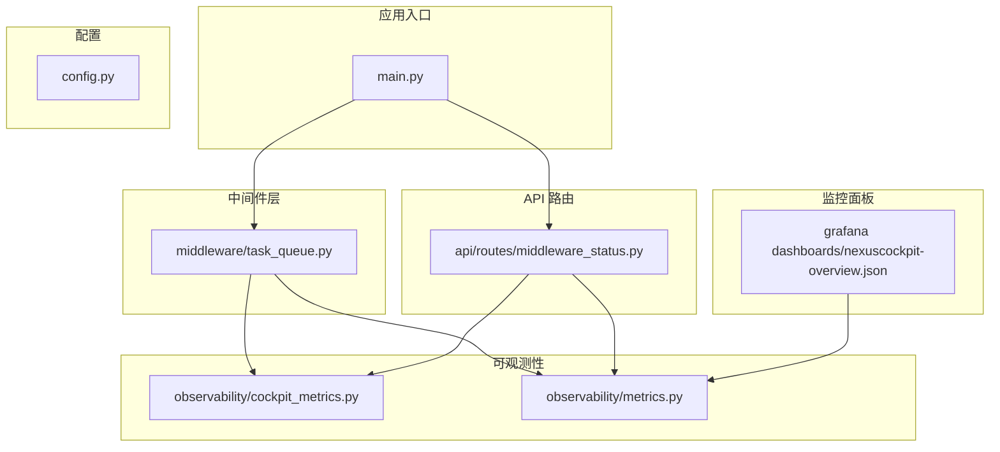
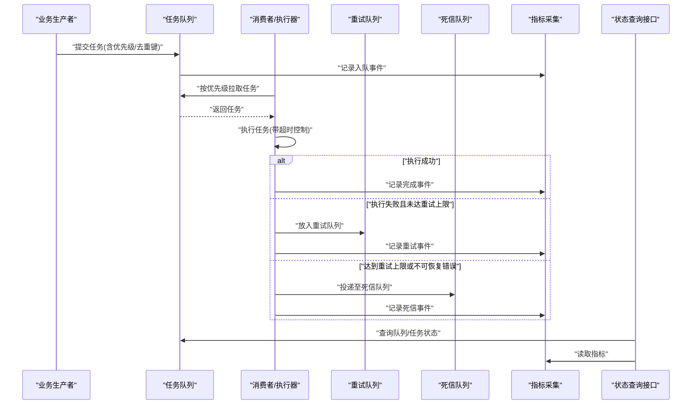
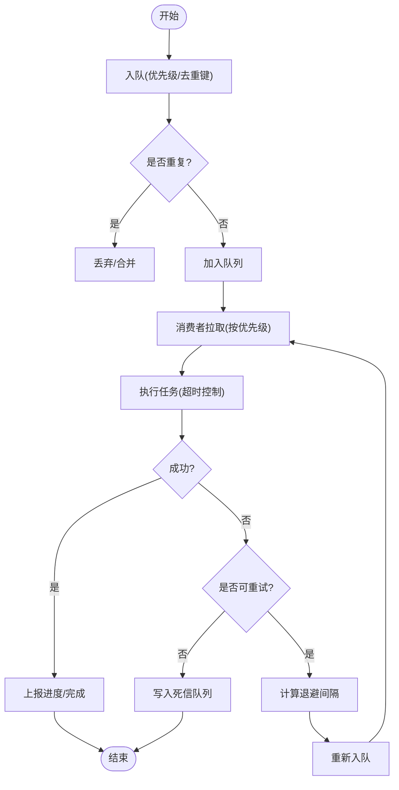
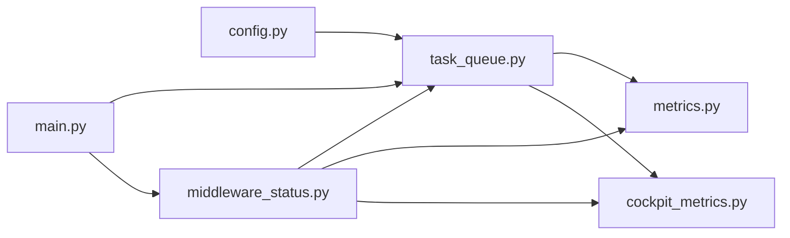

# 任务队列中间件

<cite>
**本文引用的文件**   
- [task_queue.py](file://backend_design/nexus/middleware/task_queue.py)
- [middleware_status.py](file://backend_design/nexus/api/routes/middleware_status.py)
- [cockpit_metrics.py](file://backend_design/nexus/observability/cockpit_metrics.py)
- [metrics.py](file://backend_design/nexus/observability/metrics.py)
- [config.py](file://backend_design/nexus/config.py)
- [main.py](file://backend_design/nexus/main.py)
- [dashboard JSON](file://config/grafana/provisioning/dashboards/nexuscockpit-overview.json)
</cite>

## 目录
1. [简介](#简介)
2. [项目结构](#项目结构)
3. [核心组件](#核心组件)
4. [架构总览](#架构总览)
5. [详细组件分析](#详细组件分析)
6. [依赖关系分析](#依赖关系分析)
7. [性能考量](#性能考量)
8. [故障诊断与排障指南](#故障诊断与排障指南)
9. [结论](#结论)
10. [附录](#附录)

## 简介
本文件为 NexusCockpit 的任务队列中间件提供系统化文档，围绕异步任务处理的生产者-消费者模型、优先级调度、重试与死信队列、任务定义规范、执行器设计模式、状态跟踪与进度上报、去重与批量处理、超时控制、资源隔离与负载均衡策略展开。同时给出监控面板、性能分析与故障诊断工具的使用建议，以及高可用部署与扩展方案。

## 项目结构
任务队列中间件位于后端模块的 middleware 层，并通过 API 路由暴露状态查询能力；可观测性指标由 observability 层统一采集；配置集中于 config；应用启动时初始化并注册相关服务。

图表来源
- [main.py](file://backend_design/nexus/main.py)
- [task_queue.py](file://backend_design/nexus/middleware/task_queue.py)
- [middleware_status.py](file://backend_design/nexus/api/routes/middleware_status.py)
- [cockpit_metrics.py](file://backend_design/nexus/observability/cockpit_metrics.py)
- [metrics.py](file://backend_design/nexus/observability/metrics.py)
- [config.py](file://backend_design/nexus/config.py)
- [dashboard JSON](file://config/grafana/provisioning/dashboards/nexuscockpit-overview.json)

章节来源
- [main.py](file://backend_design/nexus/main.py)
- [task_queue.py](file://backend_design/nexus/middleware/task_queue.py)
- [middleware_status.py](file://backend_design/nexus/api/routes/middleware_status.py)
- [cockpit_metrics.py](file://backend_design/nexus/observability/cockpit_metrics.py)
- [metrics.py](file://backend_design/nexus/observability/metrics.py)
- [config.py](file://backend_design/nexus/config.py)
- [dashboard JSON](file://config/grafana/provisioning/dashboards/nexuscockpit-overview.json)

## 核心组件
- 任务队列实现：负责任务入队、出队、优先级调度、重试与死信队列、去重与批量处理、超时控制、进度上报等。
- 状态查询接口：提供任务运行态、队列长度、失败统计、死信数量等查询能力。
- 指标采集：在关键路径埋点，输出队列吞吐、延迟、错误率、重试次数、死信计数等指标。
- 配置项：队列容量、并发度、重试策略、超时时间、死信阈值、去重窗口等。
- 应用集成：在应用启动阶段初始化队列、注册路由、绑定指标。

章节来源
- [task_queue.py](file://backend_design/nexus/middleware/task_queue.py)
- [middleware_status.py](file://backend_design/nexus/api/routes/middleware_status.py)
- [cockpit_metrics.py](file://backend_design/nexus/observability/cockpit_metrics.py)
- [metrics.py](file://backend_design/nexus/observability/metrics.py)
- [config.py](file://backend_design/nexus/config.py)
- [main.py](file://backend_design/nexus/main.py)

## 架构总览
任务队列采用生产者-消费者模型：上游业务作为生产者将任务提交到队列；消费者（工作进程）从队列拉取任务并按优先级执行；失败任务进入重试队列，超过最大重试次数后转入死信队列；所有关键事件通过指标系统上报，供监控面板展示。

图表来源
- [task_queue.py](file://backend_design/nexus/middleware/task_queue.py)
- [middleware_status.py](file://backend_design/nexus/api/routes/middleware_status.py)
- [cockpit_metrics.py](file://backend_design/nexus/observability/cockpit_metrics.py)
- [metrics.py](file://backend_design/nexus/observability/metrics.py)

## 详细组件分析

### 任务队列实现（生产者-消费者与调度）
- 任务入队：支持优先级字段，内部使用优先结构保证高优先级先出队。
- 任务出队：消费者循环拉取，结合超时控制避免阻塞。
- 重试机制：对瞬时错误进行指数退避重试，累计次数超过阈值则转死信。
- 死信队列：持久化保存不可恢复任务，便于人工干预与审计。
- 进度上报：在执行过程中周期性更新任务进度，供外部查询。
- 去重策略：基于业务唯一键在窗口期内抑制重复任务。
- 批量处理：支持批量拉取与批量提交结果，提升吞吐。
- 资源隔离：按任务类型或租户维度隔离执行上下文，防止相互影响。
- 负载均衡：多消费者实例共享队列，自动均衡负载。

图表来源
- [task_queue.py](file://backend_design/nexus/middleware/task_queue.py)

章节来源
- [task_queue.py](file://backend_design/nexus/middleware/task_queue.py)

### 任务定义规范
- 必需字段：任务类型、唯一键（用于去重）、优先级、参数载荷、超时时间、重试策略。
- 可选字段：标签/分组（用于资源隔离与路由）、回调地址（结果回传）、进度上报频率。
- 约束：唯一键在指定窗口内全局唯一；优先级为数值越小越优先；超时时间需大于零。
- 版本兼容：任务结构变更应向后兼容，新增字段默认空值。

章节来源
- [task_queue.py](file://backend_design/nexus/middleware/task_queue.py)

### 执行器设计模式
- 插件式执行器：不同任务类型对应不同执行器，通过注册表动态发现与调用。
- 生命周期钩子：执行前/后钩子用于日志、指标、权限校验与资源准备。
- 上下文隔离：每个执行器持有独立上下文，避免共享状态污染。
- 错误分类：区分可重试与不可重试错误，驱动重试与死信分支。

章节来源
- [task_queue.py](file://backend_design/nexus/middleware/task_queue.py)

### 任务状态跟踪与进度报告
- 状态机：待处理、进行中、成功、失败、重试中、死信。
- 进度字段：百分比、当前步骤、最近更新时间。
- 查询接口：支持按任务ID、类型、状态、时间范围过滤查询。
- 实时性：进度以增量方式上报，避免频繁写放大。

章节来源
- [task_queue.py](file://backend_design/nexus/middleware/task_queue.py)
- [middleware_status.py](file://backend_design/nexus/api/routes/middleware_status.py)

### 任务去重、批量处理、超时控制
- 去重：基于唯一键+时间窗口的布隆/集合结构，减少重复执行。
- 批量：消费者批量拉取，执行器批量提交，降低锁竞争与网络开销。
- 超时：任务级与批级双重超时，触发取消与清理。

章节来源
- [task_queue.py](file://backend_design/nexus/middleware/task_queue.py)

### 资源隔离与负载均衡
- 资源隔离：按任务标签或租户维度分配执行槽位，限制并发与资源占用。
- 负载均衡：多消费者共享同一队列，操作系统或框架层面实现公平调度。
- 背压：当队列积压超过阈值时，生产者侧限流或拒绝新任务。

章节来源
- [task_queue.py](file://backend_design/nexus/middleware/task_queue.py)

### 重试机制与死信队列
- 重试策略：固定间隔或指数退避，支持最大重试次数与抖动。
- 死信条件：超过最大重试次数、标记为不可重试、执行异常类型命中黑名单。
- 死信处理：提供导出与回放能力，支持人工修复后重新入队。

章节来源
- [task_queue.py](file://backend_design/nexus/middleware/task_queue.py)

### 监控与可观测性
- 指标维度：入队速率、出队速率、平均/分位延迟、错误率、重试次数、死信计数、队列深度。
- 埋点位置：入队、出队、执行开始/结束、重试、死信、超时、去重命中。
- 面板展示：Grafana 面板聚合指标，提供概览与下钻视图。

章节来源
- [cockpit_metrics.py](file://backend_design/nexus/observability/cockpit_metrics.py)
- [metrics.py](file://backend_design/nexus/observability/metrics.py)
- [dashboard JSON](file://config/grafana/provisioning/dashboards/nexuscockpit-overview.json)

### 配置与环境变量
- 队列容量：最大任务数，超出触发背压。
- 消费者并发：单实例消费者线程/协程数。
- 重试与超时：最大重试次数、退避策略、任务超时时间。
- 死信阈值：死信告警阈值与保留时长。
- 去重窗口：去重键有效时间。
- 指标开关：是否启用指标采集与采样率。

章节来源
- [config.py](file://backend_design/nexus/config.py)

### 应用集成与启动流程
- 初始化：应用启动时加载配置，创建队列实例与消费者池。
- 路由注册：注册状态查询接口，暴露健康检查与统计信息。
- 优雅关闭：停止接收新任务，等待消费者完成，持久化状态。

章节来源
- [main.py](file://backend_design/nexus/main.py)

## 依赖关系分析
- 模块耦合：任务队列依赖配置与指标模块；API 路由依赖队列与指标；应用入口负责装配。
- 外部依赖：可能依赖消息存储（如 Redis/内存队列）与指标后端（如 Prometheus），具体由配置决定。
- 潜在环依赖：确保指标模块不反向依赖队列实现，仅通过接口或事件订阅。

图表来源
- [config.py](file://backend_design/nexus/config.py)
- [task_queue.py](file://backend_design/nexus/middleware/task_queue.py)
- [metrics.py](file://backend_design/nexus/observability/metrics.py)
- [cockpit_metrics.py](file://backend_design/nexus/observability/cockpit_metrics.py)
- [middleware_status.py](file://backend_design/nexus/api/routes/middleware_status.py)
- [main.py](file://backend_design/nexus/main.py)

章节来源
- [config.py](file://backend_design/nexus/config.py)
- [task_queue.py](file://backend_design/nexus/middleware/task_queue.py)
- [metrics.py](file://backend_design/nexus/observability/metrics.py)
- [cockpit_metrics.py](file://backend_design/nexus/observability/cockpit_metrics.py)
- [middleware_status.py](file://backend_design/nexus/api/routes/middleware_status.py)
- [main.py](file://backend_design/nexus/main.py)

## 性能考量
- 吞吐优化：增大批量大小、合理设置消费者并发、避免热点键导致锁竞争。
- 延迟优化：缩短去重判断与指标上报开销，必要时异步落盘。
- 背压与限流：队列满时快速失败或降级，保护下游依赖。
- 资源隔离：按任务类型划分执行槽位，避免长尾任务拖垮整体。
- 监控采样：在高吞吐场景下调低指标采样率，平衡精度与开销。

[本节为通用指导，无需源码引用]

## 故障诊断与排障指南
- 常见问题
  - 任务堆积：检查消费者并发与下游依赖可用性，关注队列深度与出队速率。
  - 大量重试：定位错误类型，调整重试策略或增加幂等处理。
  - 死信增长：导出死信任务进行分析，修复后重新入队。
  - 超时频繁：评估任务耗时分布，拆分大任务或提高超时阈值。
- 诊断工具
  - 状态查询接口：查看任务列表、状态分布、最近失败原因。
  - 指标面板：观察入队/出队速率、P95/P99 延迟、错误率、重试与死信计数。
  - 日志关联：通过任务 ID 追踪全链路日志，定位瓶颈与异常。
- 操作建议
  - 临时扩容消费者实例，缓解积压。
  - 对热点任务启用去重与批量处理。
  - 针对不稳定依赖开启熔断与降级。

章节来源
- [middleware_status.py](file://backend_design/nexus/api/routes/middleware_status.py)
- [cockpit_metrics.py](file://backend_design/nexus/observability/cockpit_metrics.py)
- [metrics.py](file://backend_design/nexus/observability/metrics.py)

## 结论
NexusCockpit 的任务队列中间件提供了完整的异步任务处理能力，涵盖优先级调度、重试与死信、去重与批量、超时与资源隔离、负载均衡与可观测性。通过合理的配置与监控，可在生产环境获得稳定、可扩展的异步执行基础设施。

[本节为总结，无需源码引用]

## 附录
- 监控面板
  - Grafana 面板配置文件位于 dashboard JSON，包含概览与关键指标视图。
  - 建议在面板中添加队列深度、重试率、死信率、P99 延迟等关键 KPI。
- 部署与扩展
  - 水平扩展：增加消费者实例，共享同一队列后端。
  - 高可用：队列后端与指标后端均应采用集群模式，避免单点故障。
  - 灰度发布：逐步放量消费者实例，配合指标与告警验证稳定性。

章节来源
- [dashboard JSON](file://config/grafana/provisioning/dashboards/nexuscockpit-overview.json)